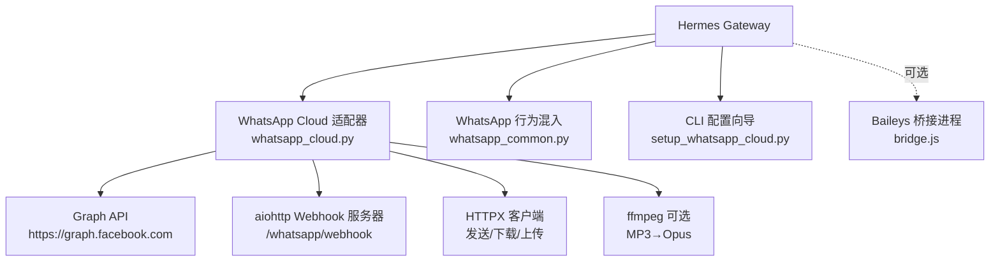
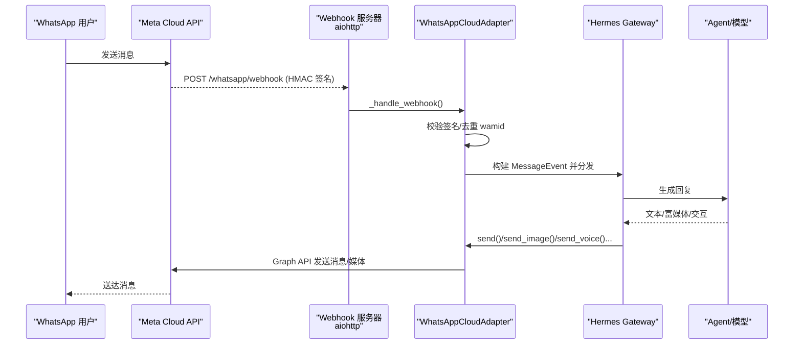
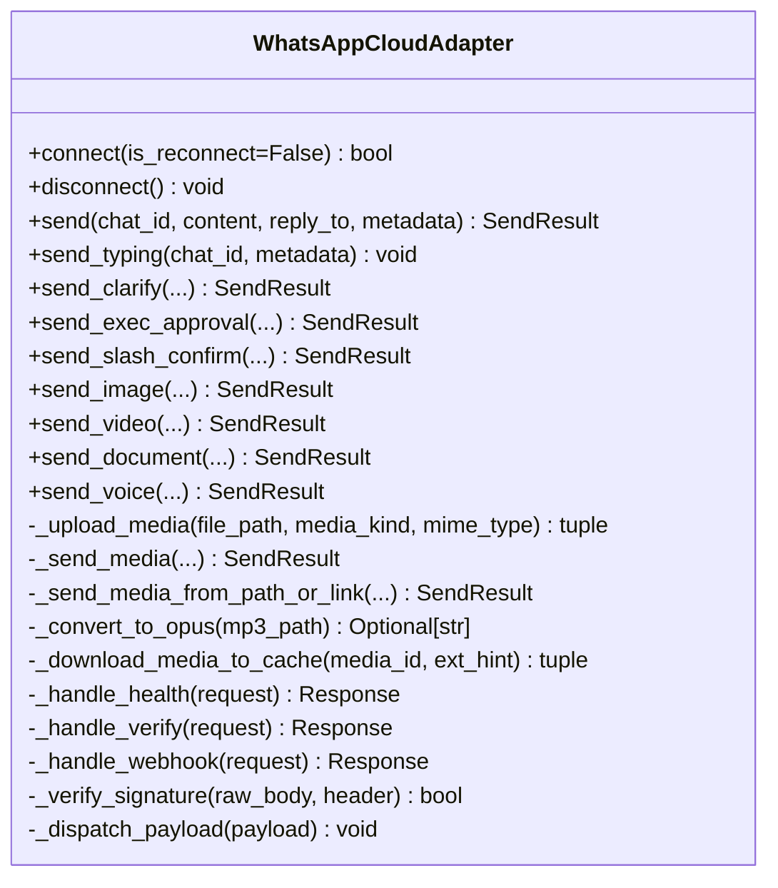
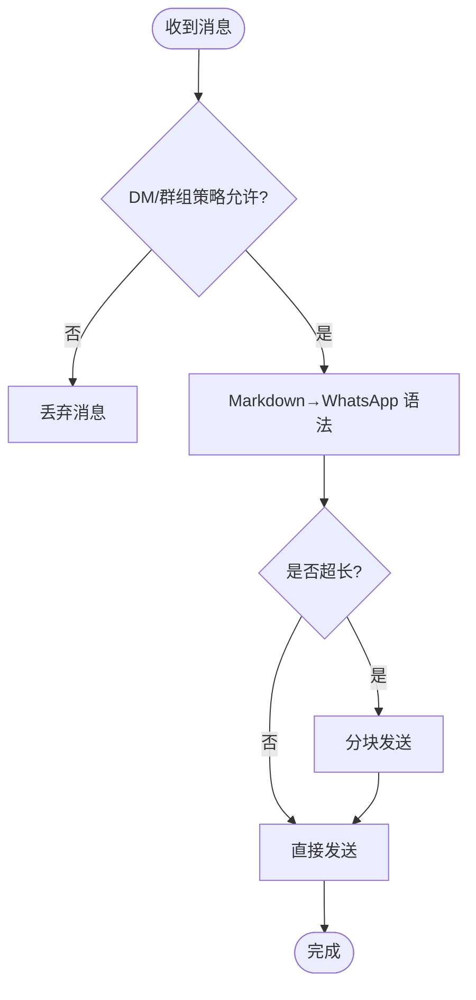
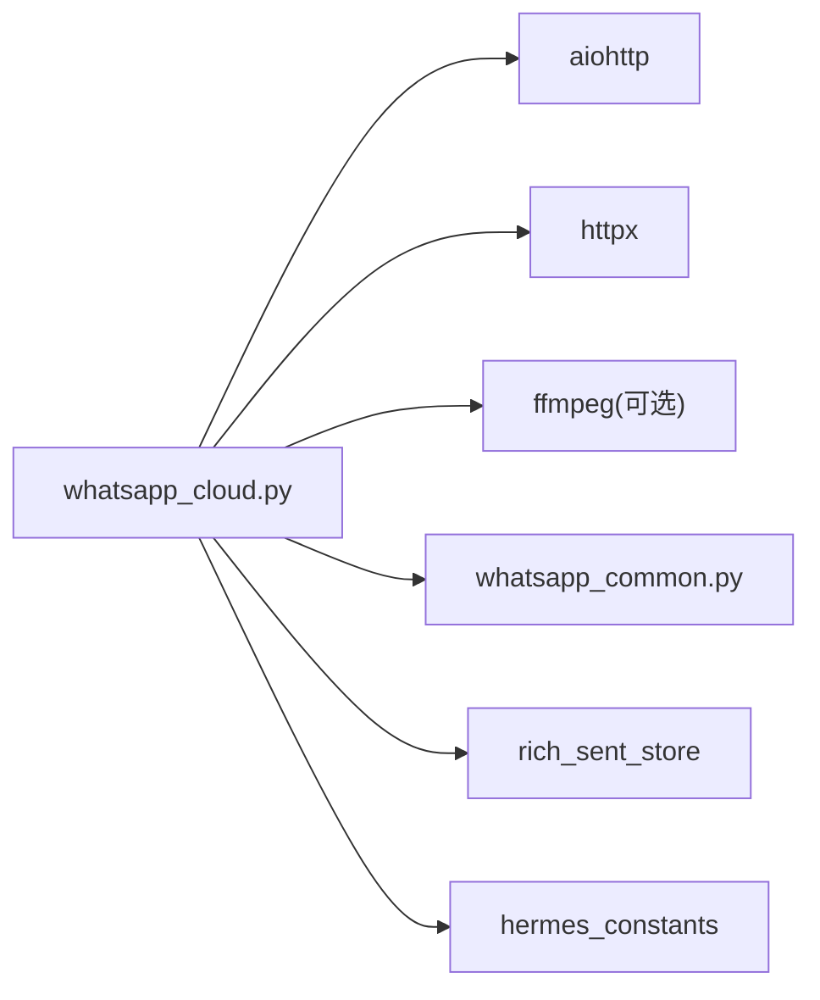

# WhatsApp 平台适配器

<cite>
**本文引用的文件**
- [whatsapp_cloud.py](file://gateway/platforms/whatsapp_cloud.py)
- [whatsapp_common.py](file://gateway/platforms/whatsapp_common.py)
- [setup_whatsapp_cloud.py](file://hermes_cli/setup_whatsapp_cloud.py)
- [bridge.js](file://scripts/whatsapp-bridge/bridge.js)
- [test_adapter_connect_is_reconnect_contract.py](file://tests/gateway/test_adapter_connect_is_reconnect_contract.py)
</cite>

## 目录
1. [简介](#简介)
2. [项目结构](#项目结构)
3. [核心组件](#核心组件)
4. [架构总览](#架构总览)
5. [详细组件分析](#详细组件分析)
6. [依赖关系分析](#依赖关系分析)
7. [性能考虑](#性能考虑)
8. [故障排除指南](#故障排除指南)
9. [结论](#结论)
10. [附录](#附录)

## 简介
本文件面向需要在 Hermes Agent 中集成 WhatsApp Business API（Meta Cloud API）的开发者，提供端到端的适配说明与实现要点。内容涵盖：
- Meta for Developers 账户设置、应用创建与电话号码验证流程指引
- 消息类型支持：文本、图片、视频、文档、音频、位置、联系人、模板消息
- 用户认证、会话管理与消息状态跟踪
- 富媒体处理：图片压缩、视频转码、音频格式转换与文件上传
- 语音消息处理：语音转文字与文字转语音
- 平台限制：消息长度、媒体大小、模板审批等
- 交互能力：按钮、列表、快速回复的实现示例
- 错误处理、重试机制与性能优化策略
- 调试工具与排障清单

## 项目结构
WhatsApp 相关代码主要分布在以下位置：
- gateway/platforms/whatsapp_cloud.py：Cloud API 适配器（出站 Graph API + 入站 Webhook）
- gateway/platforms/whatsapp_common.py：WhatsApp 通用行为（格式化、白名单、提及检测、分块等）
- hermes_cli/setup_whatsapp_cloud.py：交互式配置向导（收集凭据、生成 verify token、打印后续步骤）
- scripts/whatsapp-bridge/bridge.js：Baileys 桥接进程（非官方通道，用于个人号或本地联调）
- tests/gateway/test_adapter_connect_is_reconnect_contract.py：校验所有平台适配器的 connect() 签名包含 is_reconnect

图表来源
- [whatsapp_cloud.py:203-495](file://gateway/platforms/whatsapp_cloud.py#L203-L495)
- [whatsapp_common.py:64-125](file://gateway/platforms/whatsapp_common.py#L64-L125)
- [setup_whatsapp_cloud.py:232-542](file://hermes_cli/setup_whatsapp_cloud.py#L232-L542)
- [bridge.js:1-20](file://scripts/whatsapp-bridge/bridge.js#L1-L20)

章节来源
- [whatsapp_cloud.py:1-120](file://gateway/platforms/whatsapp_cloud.py#L1-L120)
- [whatsapp_common.py:1-30](file://gateway/platforms/whatsapp_common.py#L1-L30)
- [setup_whatsapp_cloud.py:1-33](file://hermes_cli/setup_whatsapp_cloud.py#L1-L33)
- [bridge.js:1-20](file://scripts/whatsapp-bridge/bridge.js#L1-L20)

## 核心组件
- WhatsAppCloudAdapter：基于 BasePlatformAdapter 的正式 Cloud API 适配器，负责：
  - 出站：通过 Graph API 发送文本、媒体、交互消息（按钮/列表）
  - 入站：aiohttp 接收 Meta webhook，校验 HMAC 签名，去重 wamid，分发到网关
  - 媒体：上传/下载、Opus 转换、缓存落盘
  - UX：打字指示器、已读回执、引用回复
- WhatsAppBehaviorMixin：跨传输的 WhatsApp 行为层，提供：
  - DM/群组策略、白名单匹配、提及检测、Markdown→WhatsApp 语法转换
  - 消息分块与最大长度控制
- CLI 配置向导：引导填写 Phone Number ID、Access Token、App Secret、Verify Token、允许用户列表，并输出后续操作清单
- Baileys 桥接（可选）：Node.js 进程，暴露 HTTP 接口供 Python 侧调用，用于个人号联调或特殊场景

章节来源
- [whatsapp_cloud.py:203-495](file://gateway/platforms/whatsapp_cloud.py#L203-L495)
- [whatsapp_common.py:64-125](file://gateway/platforms/whatsapp_common.py#L64-L125)
- [setup_whatsapp_cloud.py:232-542](file://hermes_cli/setup_whatsapp_cloud.py#L232-L542)
- [bridge.js:1-20](file://scripts/whatsapp-bridge/bridge.js#L1-L20)

## 架构总览
下图展示从用户到 Hermes Agent 再到 Meta Cloud API 的完整链路，包括双向消息流与富媒体处理。

图表来源
- [whatsapp_cloud.py:1457-1522](file://gateway/platforms/whatsapp_cloud.py#L1457-L1522)
- [whatsapp_cloud.py:513-589](file://gateway/platforms/whatsapp_cloud.py#L513-L589)
- [whatsapp_cloud.py:970-1148](file://gateway/platforms/whatsapp_cloud.py#L970-L1148)

## 详细组件分析

### 组件一：WhatsAppCloudAdapter（Cloud API 适配器）
职责与关键点
- 连接生命周期：初始化 httpx 客户端、启动 aiohttp 服务、注册健康检查与 webhook 路由
- 出站文本：格式化→分块→POST Graph API → 记录 rich_sent_store 以便引用解析
- 交互消息：按钮（≤3 选项）、列表（>3 选项），内部维护澄清/审批/确认状态映射
- 媒体发送：优先 link 模式，否则两步上传（获取 media_id）再发送；支持图片、视频、文档、音频
- 语音消息：本地 MP3 尝试 ffmpeg 转 Opus 以呈现绿色语音气泡；不可用时回退为音频附件
- 入站处理：读取原始 body→HMAC 校验→JSON 解析→wamid 去重→构建事件→分发
- 打字/已读：基于最近 inbound wamid 调用 Graph API 显示“正在输入”和标记已读

图表来源
- [whatsapp_cloud.py:203-495](file://gateway/platforms/whatsapp_cloud.py#L203-L495)
- [whatsapp_cloud.py:513-589](file://gateway/platforms/whatsapp_cloud.py#L513-L589)
- [whatsapp_cloud.py:678-949](file://gateway/platforms/whatsapp_cloud.py#L678-L949)
- [whatsapp_cloud.py:970-1148](file://gateway/platforms/whatsapp_cloud.py#L970-L1148)
- [whatsapp_cloud.py:1194-1311](file://gateway/platforms/whatsapp_cloud.py#L1194-L1311)
- [whatsapp_cloud.py:1314-1406](file://gateway/platforms/whatsapp_cloud.py#L1314-L1406)
- [whatsapp_cloud.py:1410-1522](file://gateway/platforms/whatsapp_cloud.py#L1410-L1522)

章节来源
- [whatsapp_cloud.py:203-495](file://gateway/platforms/whatsapp_cloud.py#L203-L495)
- [whatsapp_cloud.py:513-589](file://gateway/platforms/whatsapp_cloud.py#L513-L589)
- [whatsapp_cloud.py:678-949](file://gateway/platforms/whatsapp_cloud.py#L678-L949)
- [whatsapp_cloud.py:970-1148](file://gateway/platforms/whatsapp_cloud.py#L970-L1148)
- [whatsapp_cloud.py:1194-1311](file://gateway/platforms/whatsapp_cloud.py#L1194-L1311)
- [whatsapp_cloud.py:1314-1406](file://gateway/platforms/whatsapp_cloud.py#L1314-L1406)
- [whatsapp_cloud.py:1410-1522](file://gateway/platforms/whatsapp_cloud.py#L1410-L1522)

### 组件二：WhatsAppBehaviorMixin（通用行为）
职责与关键点
- 安全与访问控制：DM/群组策略、白名单匹配、广播/频道过滤
- 提及与引用：@提及检测、回复机器人检测、自定义正则匹配
- 格式化：Markdown→WhatsApp 语法（粗体、斜体、删除线、代码块保护、链接转换）
- 分块与长度：按 MAX_MESSAGE_LENGTH 与回复前缀预留空间进行分块

图表来源
- [whatsapp_common.py:64-125](file://gateway/platforms/whatsapp_common.py#L64-L125)
- [whatsapp_common.py:127-177](file://gateway/platforms/whatsapp_common.py#L127-L177)
- [whatsapp_common.py:254-289](file://gateway/platforms/whatsapp_common.py#L254-L289)
- [whatsapp_common.py:424-499](file://gateway/platforms/whatsapp_common.py#L424-L499)

章节来源
- [whatsapp_common.py:64-125](file://gateway/platforms/whatsapp_common.py#L64-L125)
- [whatsapp_common.py:127-177](file://gateway/platforms/whatsapp_common.py#L127-L177)
- [whatsapp_common.py:254-289](file://gateway/platforms/whatsapp_common.py#L254-L289)
- [whatsapp_common.py:424-499](file://gateway/platforms/whatsapp_common.py#L424-L499)

### 组件三：CLI 配置向导（Setup Wizard）
职责与关键点
- 字段校验：Phone Number ID（15-17 位数字）、Access Token（EAA 开头）、App Secret（32 位十六进制）
- 生成 Verify Token：用于 Meta 订阅验证握手
- 输出后续步骤：启动隧道（cloudflared/ngrok）、启动网关、在 Meta 控制台配置 Webhook 回调地址与订阅字段、添加收件人号码
- 提示如何设置业务账号资料（名称、头像、描述等）

章节来源
- [setup_whatsapp_cloud.py:52-157](file://hermes_cli/setup_whatsapp_cloud.py#L52-L157)
- [setup_whatsapp_cloud.py:232-542](file://hermes_cli/setup_whatsapp_cloud.py#L232-L542)

### 组件四：Baileys 桥接（可选，个人号/联调）
职责与关键点
- Node.js 进程，使用 @whiskeysockets/baileys 连接 WhatsApp
- 暴露 HTTP 端点：/messages（轮询）、/send、/send-media、/typing、/health 等
- 队列化发送：避免并发 sendMessage 导致路由错乱
- 自哈希与健康检查：便于网关检测旧版本并重启
- 消息去重与调试：记录最近发送 ID、调试日志、投票聚合等

章节来源
- [bridge.js:1-20](file://scripts/whatsapp-bridge/bridge.js#L1-L20)
- [bridge.js:128-157](file://scripts/whatsapp-bridge/bridge.js#L128-L157)
- [bridge.js:228-248](file://scripts/whatsapp-bridge/bridge.js#L228-L248)
- [bridge.js:388-479](file://scripts/whatsapp-bridge/bridge.js#L388-L479)
- [bridge.js:532-779](file://scripts/whatsapp-bridge/bridge.js#L532-L779)

## 依赖关系分析
- 运行时依赖
  - aiohttp：Webhook 服务器（入站）
  - httpx：Graph API 客户端（出站/媒体上传下载）
  - ffmpeg（可选）：MP3→Opus 转换，使语音消息以绿色气泡呈现
- 外部系统
  - Meta Cloud API（Graph API）：消息发送、媒体管理、状态回调
  - Meta Webhook：入站消息推送（需 HTTPS 公网可达）
- 内部模块
  - WhatsAppBehaviorMixin：格式化、策略、分块
  - rich_sent_store：记录已发送消息以便引用解析
  - hermes_constants：路径与目录常量

图表来源
- [whatsapp_cloud.py:44-83](file://gateway/platforms/whatsapp_cloud.py#L44-L83)
- [whatsapp_cloud.py:129-133](file://gateway/platforms/whatsapp_cloud.py#L129-L133)
- [whatsapp_cloud.py:188-190](file://gateway/platforms/whatsapp_cloud.py#L188-L190)

章节来源
- [whatsapp_cloud.py:44-83](file://gateway/platforms/whatsapp_cloud.py#L44-L83)
- [whatsapp_cloud.py:129-133](file://gateway/platforms/whatsapp_cloud.py#L129-L133)
- [whatsapp_cloud.py:188-190](file://gateway/platforms/whatsapp_cloud.py#L188-L190)

## 性能考虑
- 连接与超时
  - httpx 客户端使用平台级 keepalive 限制，避免 CLOSE_WAIT 堆积
  - 发送超时保护（桥接侧），防止长时间挂起
- 分块与长度
  - 文本按 MAX_MESSAGE_LENGTH 分块，并为回复前缀预留空间
  - 交互消息正文限制 1024 字符，标题/描述有各自上限
- 媒体大小限制
  - 图片 5MB、视频 16MB、音频 16MB、文档 100MB、贴纸 100KB/500KB
- 入站负载保护
  - Webhook 请求体限制 3MB，超限拒绝
- 去重与缓存
  - wamid 去重内存表（FIFO 淘汰）
  - 入站媒体缓存至 HERMES_HOME，避免重复下载
- 并发与队列
  - 桥接侧发送队列串行化，避免并发发送导致路由错乱

章节来源
- [whatsapp_cloud.py:88-118](file://gateway/platforms/whatsapp_cloud.py#L88-L118)
- [whatsapp_cloud.py:153-161](file://gateway/platforms/whatsapp_cloud.py#L153-L161)
- [whatsapp_cloud.py:1314-1406](file://gateway/platforms/whatsapp_cloud.py#L1314-L1406)
- [bridge.js:128-157](file://scripts/whatsapp-bridge/bridge.js#L128-L157)

## 故障排除指南
常见问题与定位方法
- Webhook 无法验证
  - 未配置 verify_token：GET 订阅握手返回 503
  - 未配置 app_secret：POST 入站返回 503，无法校验 HMAC
  - 解决：确保在 Meta 控制台配置回调地址与 verify token，并在环境变量中设置 app_secret
- 入站被拒绝
  - X-Hub-Signature-256 不匹配：返回 401，检查 app_secret 与原始 body 一致性
  - 载荷过大：超过 3MB 返回 413
- 发送失败
  - Graph API 返回错误：统一格式化错误信息（含 code 与 message）
  - 媒体大小超限：在上传前检查并提前报错
- 语音消息不是绿色气泡
  - ffmpeg 未安装或转换失败：回退为音频附件；安装 ffmpeg 后可获得原生语音气泡
- 重复消息
  - wamid 去重命中：检查 Meta 重试与网络抖动；合理调整去重窗口
- 连接断开后恢复
  - 所有平台适配器的 connect() 必须接受 is_reconnect 关键字参数，否则网关重连会失败

调试建议
- 使用 /health 端点检查服务状态、verify_token/app_secret 配置、ffmpeg 可用性
- 查看日志中的警告与错误信息（如签名拒绝、wamid 过期、Graph API 错误码）
- 在桥接模式下启用 WHATSAPP_DEBUG 输出调试事件

章节来源
- [whatsapp_cloud.py:1410-1522](file://gateway/platforms/whatsapp_cloud.py#L1410-L1522)
- [whatsapp_cloud.py:951-960](file://gateway/platforms/whatsapp_cloud.py#L951-L960)
- [whatsapp_cloud.py:1262-1311](file://gateway/platforms/whatsapp_cloud.py#L1262-L1311)
- [whatsapp_cloud.py:1551-1569](file://gateway/platforms/whatsapp_cloud.py#L1551-L1569)
- [test_adapter_connect_is_reconnect_contract.py:114-145](file://tests/gateway/test_adapter_connect_is_reconnect_contract.py#L114-L145)

## 结论
本适配器提供了生产可用的 WhatsApp Business API 集成方案，具备：
- 安全的入站校验与去重
- 丰富的出站能力（文本、富媒体、交互消息）
- 稳健的媒体处理与语音气泡支持
- 完善的配置向导与调试手段
建议在部署时严格遵循配置向导的步骤，确保密钥与回调地址正确，并根据业务需求开启必要的策略（白名单、提及要求等）。

## 附录

### Meta 账户设置与应用创建（步骤摘要）
- 在 Meta for Developers 创建应用，选择“Connect with customers through WhatsApp”
- 在 App Dashboard → WhatsApp → API Setup 生成 Access Token（临时或系统用户永久令牌）
- 记录 Phone Number ID（15-17 位数字，非手机号本身）
- 在 Settings → Basic 获取 App Secret（32 位十六进制）
- 运行 CLI 向导生成 Verify Token，并在 Meta 控制台配置 Webhook 回调地址与订阅字段（messages）
- 将测试号码加入收件人列表

章节来源
- [setup_whatsapp_cloud.py:253-261](file://hermes_cli/setup_whatsapp_cloud.py#L253-L261)
- [setup_whatsapp_cloud.py:268-337](file://hermes_cli/setup_whatsapp_cloud.py#L268-L337)
- [setup_whatsapp_cloud.py:339-407](file://hermes_cli/setup_whatsapp_cloud.py#L339-L407)
- [setup_whatsapp_cloud.py:409-433](file://hermes_cli/setup_whatsapp_cloud.py#L409-L433)
- [setup_whatsapp_cloud.py:464-510](file://hermes_cli/setup_whatsapp_cloud.py#L464-L510)

### 消息类型支持与限制
- 文本：支持 Markdown→WhatsApp 语法转换，自动分块
- 图片/视频/文档：支持 link 模式与上传模式；注意大小限制
- 音频：优先 Opus 语音气泡，否则回退为音频附件
- 位置/联系人：可通过桥接或上层工具扩展（当前 Cloud 适配器侧重文本与富媒体）
- 模板消息：需 Meta 审批；本适配器聚焦免费交互（按钮/列表），模板需另行配置

章节来源
- [whatsapp_cloud.py:108-127](file://gateway/platforms/whatsapp_cloud.py#L108-L127)
- [whatsapp_cloud.py:661-843](file://gateway/platforms/whatsapp_cloud.py#L661-L843)
- [whatsapp_cloud.py:1150-1260](file://gateway/platforms/whatsapp_cloud.py#L1150-L1260)

### 用户认证、会话管理与状态跟踪
- 认证：Access Token（Bearer）用于 Graph API；app_secret 用于 HMAC 校验
- 会话：无持久会话概念；通过 wamid 与 chat_id 关联上下文
- 状态：typing/read 通过 Graph API 更新；状态事件可记录但不主动转发

章节来源
- [whatsapp_cloud.py:533-589](file://gateway/platforms/whatsapp_cloud.py#L533-L589)
- [whatsapp_cloud.py:591-660](file://gateway/platforms/whatsapp_cloud.py#L591-L660)
- [whatsapp_cloud.py:1457-1522](file://gateway/platforms/whatsapp_cloud.py#L1457-L1522)

### 富媒体处理与语音
- 图片压缩/视频转码：由上层工具链处理后再传入适配器；适配器仅负责上传/发送
- 音频格式转换：MP3→Opus（ffmpeg），失败则回退为音频附件
- 文件上传：两步式（获取 media_id 再发送），支持 caption/filename

章节来源
- [whatsapp_cloud.py:970-1148](file://gateway/platforms/whatsapp_cloud.py#L970-L1148)
- [whatsapp_cloud.py:1194-1311](file://gateway/platforms/whatsapp_cloud.py#L1194-L1311)

### 交互消息示例（按钮、列表、快速回复）
- 澄清问题（clarify）：≤3 选项用按钮，>3 选项用列表，并附加“其他”入口
- 执行审批（exec approval）：批准/拒绝按钮
- 斜杠命令确认（slash confirm）：一次批准/始终批准/取消

章节来源
- [whatsapp_cloud.py:757-949](file://gateway/platforms/whatsapp_cloud.py#L757-L949)

### 错误处理与重试
- Graph API 错误：统一格式化错误信息，便于日志与排查
- 网络异常：捕获并记录，返回失败结果
- 重试：网关层对适配器 connect 的重试要求 is_reconnect 参数；适配器自身对非关键错误采用静默降级（如 typing 失败不影响主流程）

章节来源
- [whatsapp_cloud.py:551-589](file://gateway/platforms/whatsapp_cloud.py#L551-L589)
- [whatsapp_cloud.py:607-660](file://gateway/platforms/whatsapp_cloud.py#L607-L660)
- [test_adapter_connect_is_reconnect_contract.py:114-145](file://tests/gateway/test_adapter_connect_is_reconnect_contract.py#L114-L145)