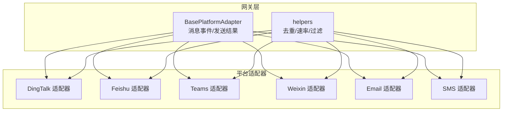
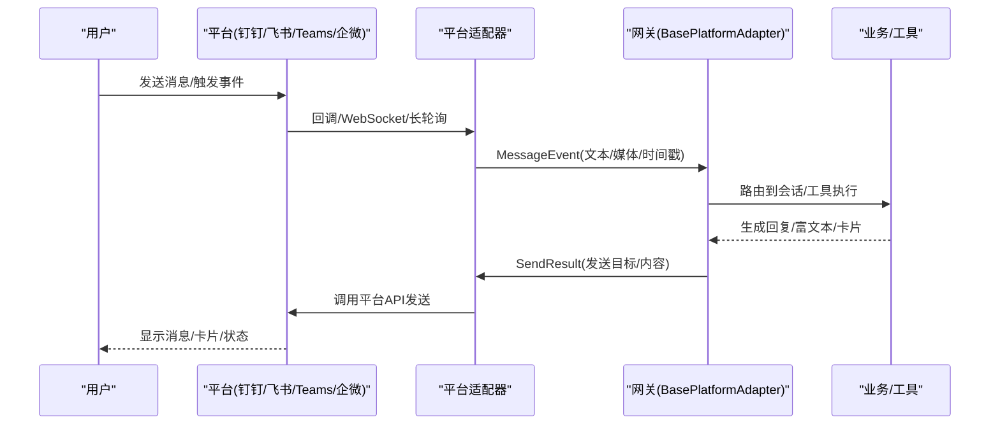
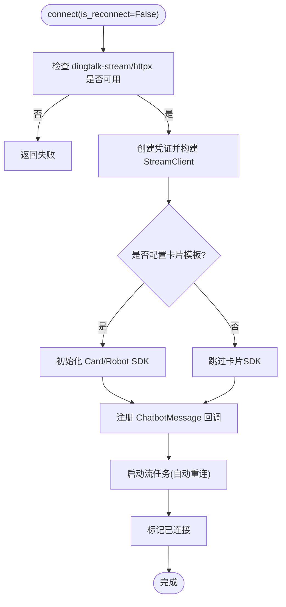
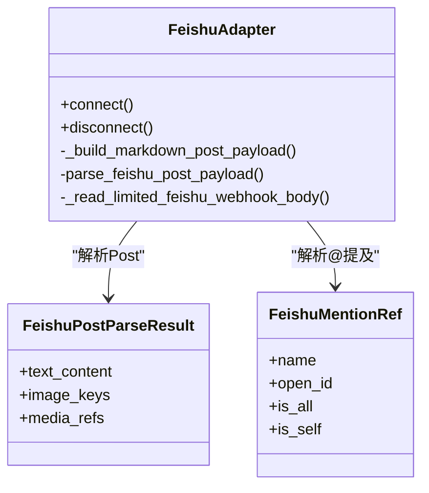
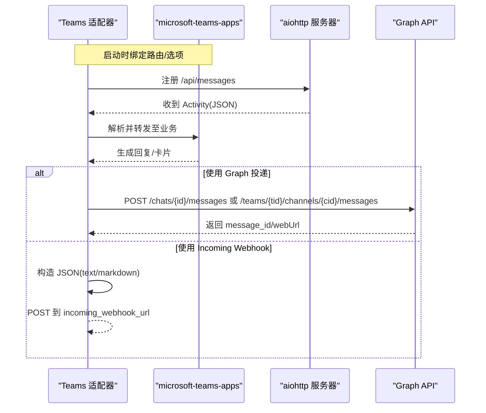
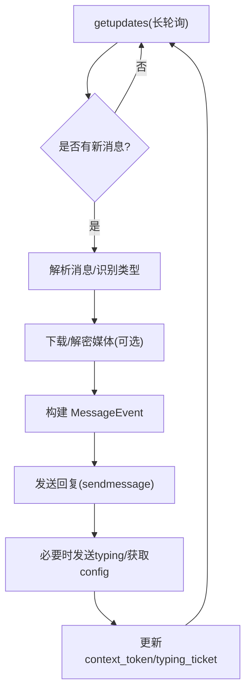
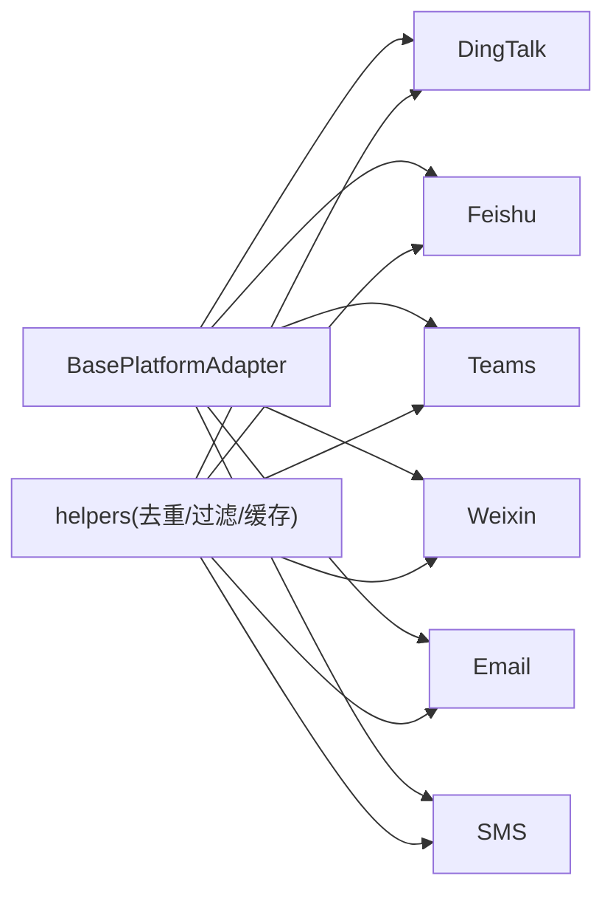

# 其他平台适配器

<cite>
**本文引用的文件**
- [plugins/platforms/dingtalk/adapter.py](file://plugins/platforms/dingtalk/adapter.py)
- [plugins/platforms/feishu/adapter.py](file://plugins/platforms/feishu/adapter.py)
- [plugins/platforms/teams/adapter.py](file://plugins/platforms/teams/adapter.py)
- [gateway/platforms/weixin.py](file://gateway/platforms/weixin.py)
- [plugins/platforms/email/adapter.py](file://plugins/platforms/email/adapter.py)
- [plugins/platforms/sms/adapter.py](file://plugins/platforms/sms/adapter.py)
- [tests/gateway/test_adapter_connect_is_reconnect_contract.py](file://tests/gateway/test_adapter_connect_is_reconnect_contract.py)
</cite>

## 目录
1. [简介](#简介)
2. [项目结构](#项目结构)
3. [核心组件](#核心组件)
4. [架构总览](#架构总览)
5. [详细组件分析](#详细组件分析)
6. [依赖关系分析](#依赖关系分析)
7. [性能与限制](#性能与限制)
8. [故障排除指南](#故障排除指南)
9. [结论](#结论)
10. [附录：统一适配器开发模式与最佳实践](#附录：统一适配器开发模式与最佳实践)

## 简介
本文件面向“其他即时通讯平台适配器”的综合开发文档，覆盖钉钉、飞书、Microsoft Teams、企业微信、电子邮件和短信等平台的适配实现。重点说明各平台 API 特点、认证方式、消息格式差异，以及平台特定能力（如钉钉工作流卡片、飞书机器人事件、Teams 会议集成与企业微信消息推送）。同时提供邮件 IMAP/SMTP 配置要点、短信网关接入方式与多通道路由策略，并总结统一的适配器开发模式、错误处理、重试机制、日志记录、频率控制与安全策略等最佳实践，帮助开发者快速适配新平台。

## 项目结构
本项目将平台适配器按“插件化”组织，核心入口位于 gateway 层，具体平台实现位于 plugins/platforms 或 gateway/platforms 下。每个平台通常包含 adapter.py（适配器实现）、plugin.yaml（插件元数据）等。测试用例集中在 tests/gateway 中，用于校验适配器契约（例如 connect() 必须接受 is_reconnect 参数）。

**图示来源**
- [plugins/platforms/dingtalk/adapter.py:230-319](file://plugins/platforms/dingtalk/adapter.py#L230-L319)
- [plugins/platforms/feishu/adapter.py:121-136](file://plugins/platforms/feishu/adapter.py#L121-L136)
- [plugins/platforms/teams/adapter.py:85-94](file://plugins/platforms/teams/adapter.py#L85-L94)
- [gateway/platforms/weixin.py:58-72](file://gateway/platforms/weixin.py#L58-L72)

**章节来源**
- [plugins/platforms/dingtalk/adapter.py:230-319](file://plugins/platforms/dingtalk/adapter.py#L230-L319)
- [plugins/platforms/feishu/adapter.py:121-136](file://plugins/platforms/feishu/adapter.py#L121-L136)
- [plugins/platforms/teams/adapter.py:85-94](file://plugins/platforms/teams/adapter.py#L85-L94)
- [gateway/platforms/weixin.py:58-72](file://gateway/platforms/weixin.py#L58-L72)

## 核心组件
- BasePlatformAdapter：定义连接生命周期（connect/disconnect）、消息事件（MessageEvent）、发送结果（SendResult）等通用接口，所有平台适配器均继承该基类。
- helpers：提供消息去重、提及匹配、批量拆分、媒体缓存等通用能力。
- 平台适配器：各自封装第三方 SDK/HTTP 调用、认证、消息收发、平台特性（卡片、会议、推送等）。

**章节来源**
- [plugins/platforms/dingtalk/adapter.py:97-104](file://plugins/platforms/dingtalk/adapter.py#L97-L104)
- [plugins/platforms/feishu/adapter.py:121-136](file://plugins/platforms/feishu/adapter.py#L121-L136)
- [plugins/platforms/teams/adapter.py:85-94](file://plugins/platforms/teams/adapter.py#L85-L94)
- [gateway/platforms/weixin.py:58-72](file://gateway/platforms/weixin.py#L58-L72)

## 架构总览
下图展示从平台到网关再到代理的端到端流程，强调连接、入站消息处理、出站发送与平台特性扩展点。

**图示来源**
- [plugins/platforms/dingtalk/adapter.py:319-383](file://plugins/platforms/dingtalk/adapter.py#L319-L383)
- [plugins/platforms/feishu/adapter.py:121-136](file://plugins/platforms/feishu/adapter.py#L121-L136)
- [plugins/platforms/teams/adapter.py:753-800](file://plugins/platforms/teams/adapter.py#L753-L800)
- [gateway/platforms/weixin.py:447-502](file://gateway/platforms/weixin.py#L447-L502)

## 详细组件分析

### 钉钉（DingTalk）适配器
- 传输与认证：使用 Stream Mode（dingtalk-stream），通过客户端 ID/密钥建立长连接；回复通过会话 webhook 发送。
- 消息类型：支持文本、图片、音频、视频、富文本、文件；群聊支持 @提及检测与正则唤醒词。
- AI 卡片：可选初始化 Card/Robot SDK，支持流式更新与最终关闭；断开时清理未关闭的卡片。
- 连接与重连：connect() 接受 is_reconnect 关键字参数，内部维护重连退避队列；disconnect() 安全关闭 WebSocket、任务与 HTTP 客户端。
- 群组策略：支持 require_mention、free_response_chats、allowed_chats、allowed_users 等白名单/黑名单控制。

**图示来源**
- [plugins/platforms/dingtalk/adapter.py:319-383](file://plugins/platforms/dingtalk/adapter.py#L319-L383)
- [plugins/platforms/dingtalk/adapter.py:385-468](file://plugins/platforms/dingtalk/adapter.py#L385-L468)

**章节来源**
- [plugins/platforms/dingtalk/adapter.py:1-135](file://plugins/platforms/dingtalk/adapter.py#L1-L135)
- [plugins/platforms/dingtalk/adapter.py:230-319](file://plugins/platforms/dingtalk/adapter.py#L230-L319)
- [plugins/platforms/dingtalk/adapter.py:319-468](file://plugins/platforms/dingtalk/adapter.py#L319-L468)

### 飞书（Feishu/Lark）适配器
- 传输与认证：支持 WebSocket 长连接与 Webhook 两种模式；应用级凭据（App ID/Secret）与验证令牌双重校验。
- 身份模型：open_id/user_id/union_id 三级标识；单机器人模式下 open_id 作为稳定标识；会话隔离优先 union_id。
- 消息与卡片：解析 Post/Card 元素，支持 Markdown、代码块、链接、@提及、图片/文件/音视频；内置批处理与去重。
- 安全与限流：Webhook 请求体大小限制、滑动窗口速率限制、异常跟踪 TTL；卡片动作去重窗口。
- 处理状态：Typing/CrossMark 反应提示；支持将互动按钮点击转为合成命令事件。

**图示来源**
- [plugins/platforms/feishu/adapter.py:353-402](file://plugins/platforms/feishu/adapter.py#L353-L402)
- [plugins/platforms/feishu/adapter.py:592-651](file://plugins/platforms/feishu/adapter.py#L592-L651)
- [plugins/platforms/feishu/adapter.py:653-731](file://plugins/platforms/feishu/adapter.py#L653-L731)

**章节来源**
- [plugins/platforms/feishu/adapter.py:1-120](file://plugins/platforms/feishu/adapter.py#L1-L120)
- [plugins/platforms/feishu/adapter.py:121-136](file://plugins/platforms/feishu/adapter.py#L121-L136)
- [plugins/platforms/feishu/adapter.py:353-402](file://plugins/platforms/feishu/adapter.py#L353-L402)
- [plugins/platforms/feishu/adapter.py:592-731](file://plugins/platforms/feishu/adapter.py#L592-L731)

### Microsoft Teams 适配器
- 传输与认证：基于 microsoft-teams-apps SDK，运行 aiohttp Webhook 接收活动；出站通过 SDK 的 App.send() 或 Graph API。
- 配置与环境：支持 client_id/client_secret/tenant_id/port/host/service_url；环境变量注入 PlatformConfig.extra。
- 安全校验：service_url 白名单校验（仅允许已知 Bot Framework 主机）；conversation ID 字符集校验防止路径穿越。
- 独立发送：提供 standalone_send 以在 cron 等非网关进程内直接发送消息（需完整凭据与目标 chat_id/team_id/channel_id）。
- 会议集成：通过 TeamsSummaryWriter 输出会议摘要（Markdown/HTML），支持 incoming_webhook 与 Graph 两种投递模式。

**图示来源**
- [plugins/platforms/teams/adapter.py:381-420](file://plugins/platforms/teams/adapter.py#L381-L420)
- [plugins/platforms/teams/adapter.py:529-649](file://plugins/platforms/teams/adapter.py#L529-L649)
- [plugins/platforms/teams/adapter.py:170-323](file://plugins/platforms/teams/adapter.py#L170-L323)

**章节来源**
- [plugins/platforms/teams/adapter.py:1-23](file://plugins/platforms/teams/adapter.py#L1-L23)
- [plugins/platforms/teams/adapter.py:85-94](file://plugins/platforms/teams/adapter.py#L85-L94)
- [plugins/platforms/teams/adapter.py:170-323](file://plugins/platforms/teams/adapter.py#L170-L323)
- [plugins/platforms/teams/adapter.py:381-420](file://plugins/platforms/teams/adapter.py#L381-L420)
- [plugins/platforms/teams/adapter.py:529-649](file://plugins/platforms/teams/adapter.py#L529-L649)

### 企业微信（Weixin）适配器
- 传输与认证：通过 iLink Bot API 长轮询 getupdates；每次出站需回显最新 context_token；媒体走 AES-128-ECB 加密 CDN。
- 消息与媒体：支持文本、图片、语音、文件、视频；下载/上传 URL 由 API 返回；CDN 域名白名单防 SSRF。
- 会话与状态：持久化 context_token 与 typing ticket；处理会话过期与频率限制（errcode=-2/-14）。
- 安全与健壮性：严格校验媒体 URL；超时控制与重试；CLOSE_WAIT 优化与证书链修复。

**图示来源**
- [gateway/platforms/weixin.py:447-502](file://gateway/platforms/weixin.py#L447-L502)
- [gateway/platforms/weixin.py:528-607](file://gateway/platforms/weixin.py#L528-L607)
- [gateway/platforms/weixin.py:624-683](file://gateway/platforms/weixin.py#L624-L683)

**章节来源**
- [gateway/platforms/weixin.py:1-116](file://gateway/platforms/weixin.py#L1-L116)
- [gateway/platforms/weixin.py:447-502](file://gateway/platforms/weixin.py#L447-L502)
- [gateway/platforms/weixin.py:528-683](file://gateway/platforms/weixin.py#L528-L683)

### 电子邮件适配器（IMAP/SMTP）
- 收件（IMAP）：监听邮箱，拉取新邮件，解析主题/正文/附件，转换为 MessageEvent。
- 发件（SMTP）：将回复或系统通知通过 SMTP 发送至目标邮箱；支持 HTML/纯文本与附件。
- 配置要点：IMAP/SMTP 服务器地址、端口、用户名/密码或 OAuth；SSL/TLS 设置；文件夹/标签选择；去重与断线重连。
- 安全与合规：最小权限账号、TLS 强制、敏感信息脱敏、速率限制与退避。

**章节来源**
- [plugins/platforms/email/adapter.py:1-200](file://plugins/platforms/email/adapter.py#L1-L200)

### 短信适配器（SMS 网关）
- 接入方式：对接短信服务商 REST API（如阿里云、腾讯云、Twilio 等），通过 AccessKey/Token 鉴权。
- 消息格式：文本为主，可含短链接与签名；部分网关支持富文本/多媒体（受限于运营商）。
- 路由策略：多通道冗余（主备网关）、失败切换、按号码段/地区选择最优通道。
- 频率与合规：遵守运营商频次限制、内容审核、黑名单与退订处理。

**章节来源**
- [plugins/platforms/sms/adapter.py:1-200](file://plugins/platforms/sms/adapter.py#L1-L200)

## 依赖关系分析
- 外部依赖：各平台适配器按需懒加载第三方 SDK（dingtalk-stream、lark_oapi、microsoft-teams-apps、aiohttp/websockets/cryptography 等），避免启动污染与性能损耗。
- 内部依赖：统一依赖 BasePlatformAdapter 与 helpers（去重、过滤、媒体缓存）；通过 plugin.yaml 暴露平台能力。
- 契约约束：所有适配器的 connect() 必须接受 is_reconnect 关键字参数，否则网关重连时会抛出异常导致平台静默断开。

**图示来源**
- [plugins/platforms/dingtalk/adapter.py:97-104](file://plugins/platforms/dingtalk/adapter.py#L97-L104)
- [plugins/platforms/feishu/adapter.py:121-136](file://plugins/platforms/feishu/adapter.py#L121-L136)
- [plugins/platforms/teams/adapter.py:85-94](file://plugins/platforms/teams/adapter.py#L85-L94)
- [gateway/platforms/weixin.py:58-72](file://gateway/platforms/weixin.py#L58-L72)

**章节来源**
- [tests/gateway/test_adapter_connect_is_reconnect_contract.py:1-145](file://tests/gateway/test_adapter_connect_is_reconnect_contract.py#L1-L145)

## 性能与限制
- 频率控制：
  - 飞书：Webhook 滑动窗口限流（默认 60 秒窗口、最大 120 次/分钟），超限需退避。
  - 企业微信：iLink 频率限制（errcode=-2）与会话过期（errcode=-14），需要重试与上下文恢复。
  - Teams：Bot Framework 与 Graph API 均有速率限制，需合理批处理与重试。
  - 钉钉：会话 webhook 与流式卡片更新需控制并发与节流。
- 内容审核与安全：
  - 飞书：Webhook 请求体大小限制、异常跟踪 TTL、卡片动作去重。
  - Teams：service_url 白名单、conversation ID 字符集校验，防止 SSRF/路径穿越。
  - 企业微信：CDN 域名白名单、AES 加密媒体传输。
  - 邮件/短信：TLS 强制、敏感信息脱敏、退订与黑名单。
- 资源管理：
  - 连接池与超时：httpx/aiohttp 连接池、keepalive 调优，避免 CLOSE_WAIT。
  - 内存与缓存：消息去重、媒体缓存、会话上下文 LRU 上限。
  - 后台任务：卡片关闭、表情替换、typing 状态等异步任务需追踪与取消。

[本节为通用指导，不直接分析具体文件]

## 故障排除指南
- 连接失败：
  - 钉钉：检查 dingtalk-stream/httpx 是否安装，确认 CLIENT_ID/SECRET；查看日志中的依赖缺失与连接错误。
  - 飞书：确认 App ID/Secret、验证令牌；检查 Webhook 主机/端口与防火墙；关注异常跟踪阈值。
  - Teams：确认 client_id/client_secret/tenant_id；检查 service_url 是否在白名单；验证 chat_id/team_id/channel_id。
  - 企业微信：检查 token 与 context_token；处理会话过期与频率限制；确认 CDN 域名可达。
- 消息未送达：
  - 检查平台侧限频与配额；确认目标会话/频道有效；查看发送响应与错误码。
  - 邮件：检查 SMTP 服务器、认证、TLS；确认收件人地址与反垃圾策略。
  - 短信：检查网关状态、余额、号码归属地与内容审核结果。
- 重连与恢复：
  - 确保 connect() 接受 is_reconnect；网关重连会传递该参数，若签名不符将导致静默断开。
  - 对长连接（WebSocket/Stream）实现指数退避与优雅关闭。

**章节来源**
- [tests/gateway/test_adapter_connect_is_reconnect_contract.py:1-145](file://tests/gateway/test_adapter_connect_is_reconnect_contract.py#L1-L145)
- [plugins/platforms/dingtalk/adapter.py:319-468](file://plugins/platforms/dingtalk/adapter.py#L319-L468)
- [plugins/platforms/feishu/adapter.py:235-245](file://plugins/platforms/feishu/adapter.py#L235-L245)
- [plugins/platforms/teams/adapter.py:506-527](file://plugins/platforms/teams/adapter.py#L506-L527)
- [gateway/platforms/weixin.py:118-127](file://gateway/platforms/weixin.py#L118-L127)

## 结论
通过统一的 BasePlatformAdapter 与 helpers，各平台适配器实现了一致的连接、消息与发送语义，同时保留了平台特性（卡片、会议、推送等）。建议在新增平台时遵循懒加载依赖、严格的安全校验、完善的错误处理与重试机制，并通过测试用例保障 connect() 契约一致性。结合频率控制、内容审核与安全策略，可在多通道环境下提供稳定可靠的即时通讯能力。

[本节为总结，不直接分析具体文件]

## 附录：统一适配器开发模式与最佳实践
- 适配器契约
  - 继承 BasePlatformAdapter，实现 connect()/disconnect()、消息处理与发送。
  - connect() 必须接受 is_reconnect 关键字参数，以支持网关重连。
- 依赖管理
  - 使用懒加载导入第三方 SDK，避免启动污染；提供 ensure_deps_fn 与 check_fn。
- 认证与配置
  - 从 PlatformConfig.extra 与环境变量读取凭据；支持多配置文件与多租户。
  - 对敏感信息进行脱敏与最小权限原则。
- 消息处理
  - 标准化 MessageEvent（文本/媒体/时间戳/来源）；实现去重与批处理。
  - 平台特定富文本/卡片/事件映射到统一语义。
- 发送与重试
  - 统一 SendResult；实现幂等发送与重试（指数退避、熔断）。
  - 针对平台限制进行限速与批处理。
- 错误处理与日志
  - 区分可重试与不可重试错误；记录关键路径与异常堆栈（脱敏）。
  - 提供健康检查与状态上报。
- 安全与合规
  - 输入校验（URL/ID 白名单/字符集）、SSRF 防护、内容审核、隐私保护。
- 多通道路由
  - 根据目标、优先级、可用性选择通道；失败自动切换；统计与告警。
- 测试与回归
  - 覆盖 connect() 契约、消息收发、错误场景；模拟平台限频与异常。

[本节为通用指导，不直接分析具体文件]