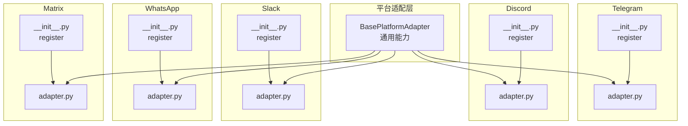
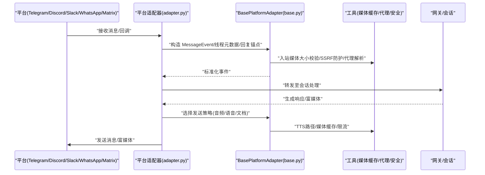
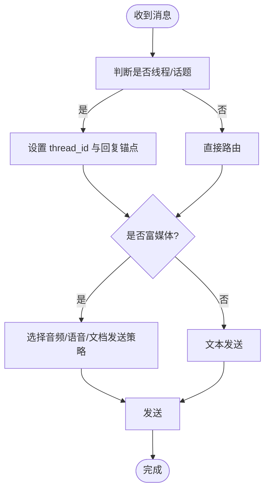
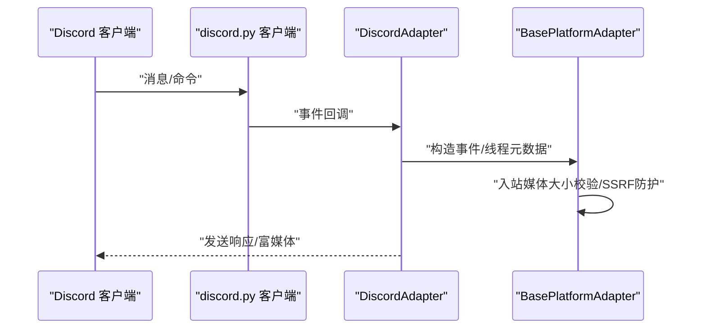
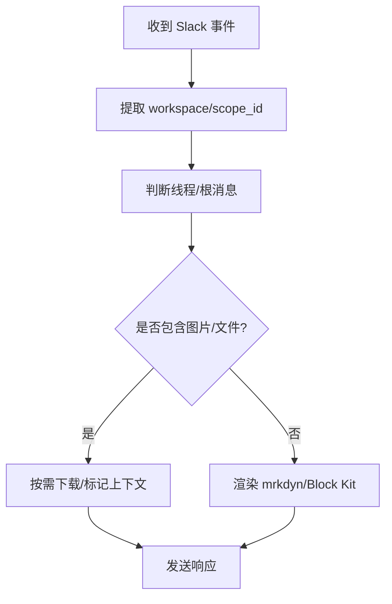
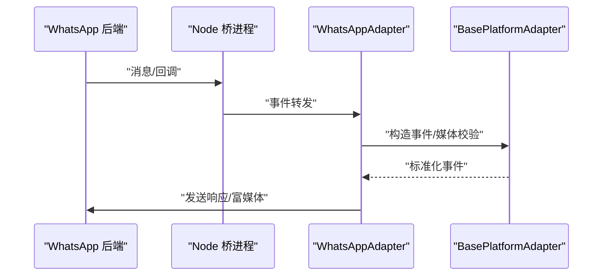
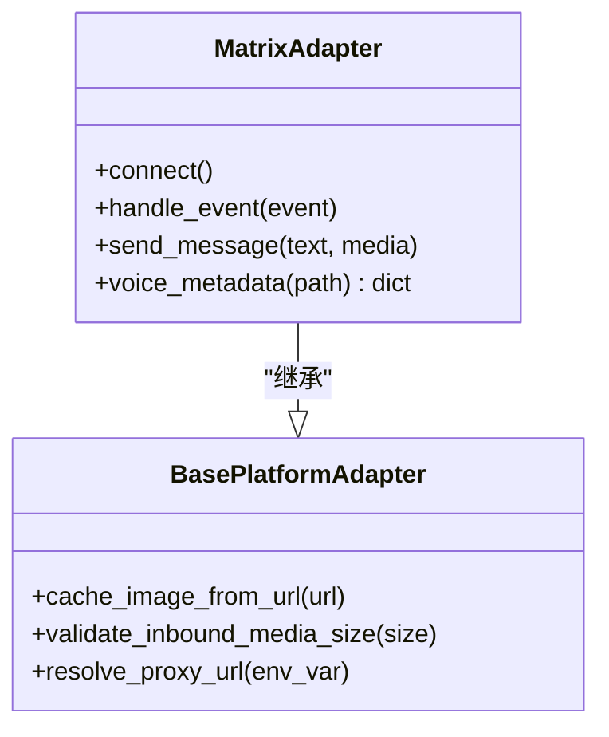
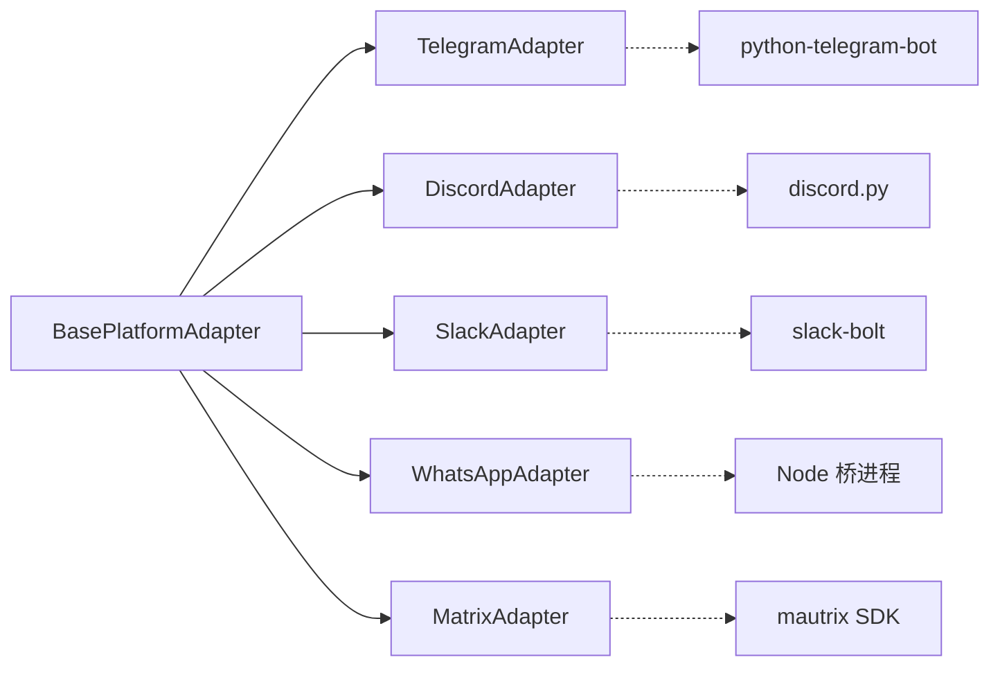

# 即时通讯平台适配器

<cite>
**本文引用的文件**
- [gateway/platforms/base.py](file://gateway/platforms/base.py)
- [plugins/platforms/telegram/__init__.py](file://plugins/platforms/telegram/__init__.py)
- [plugins/platforms/telegram/adapter.py](file://plugins/platforms/telegram/adapter.py)
- [plugins/platforms/discord/__init__.py](file://plugins/platforms/discord/__init__.py)
- [plugins/platforms/discord/adapter.py](file://plugins/platforms/discord/adapter.py)
- [plugins/platforms/slack/__init__.py](file://plugins/platforms/slack/__init__.py)
- [plugins/platforms/slack/adapter.py](file://plugins/platforms/slack/adapter.py)
- [plugins/platforms/whatsapp/__init__.py](file://plugins/platforms/whatsapp/__init__.py)
- [plugins/platforms/whatsapp/adapter.py](file://plugins/platforms/whatsapp/adapter.py)
- [plugins/platforms/matrix/__init__.py](file://plugins/platforms/matrix/__init__.py)
- [plugins/platforms/matrix/adapter.py](file://plugins/platforms/matrix/adapter.py)
</cite>

## 目录
1. [简介](#简介)
2. [项目结构](#项目结构)
3. [核心组件](#核心组件)
4. [架构总览](#架构总览)
5. [详细组件分析](#详细组件分析)
6. [依赖关系分析](#依赖关系分析)
7. [性能与限制](#性能与限制)
8. [故障排查指南](#故障排查指南)
9. [结论](#结论)
10. [附录：开发示例与最佳实践](#附录：开发示例与最佳实践)

## 简介
本指南面向需要在 Hermes Agent 中接入主流即时通讯平台的开发者，系统阐述 Telegram、Discord、Slack、WhatsApp、Matrix 等平台的适配器实现要点。内容涵盖各平台 API 差异、消息格式转换、富媒体支持（图片、音频、视频、文档）、用户权限模型、认证流程、Webhook/Bot 配置、频率限制与内容安全、调试与日志、以及性能优化建议。通过统一的 BasePlatformAdapter 抽象，各平台适配器以插件形式注册并复用通用能力（如入站媒体大小限制、代理配置、SSRF 防护、TTS 输出路径生成等）。

## 项目结构
- 平台适配层位于 gateway/platforms/base.py，提供统一接口与通用工具；各平台具体实现位于 plugins/platforms/<platform>/adapter.py，并通过 __init__.py 暴露 register 函数完成注册。
- 关键职责划分：
  - base.py：定义 BasePlatformAdapter、消息事件类型、发送结果、媒体缓存、代理与网络工具、长度限制、TTS 输出路径等。
  - 各平台 adapter.py：对接平台 SDK/Webhook，处理消息收发、线程/会话路由、富媒体、权限控制、错误处理与重试。
  - 各平台 __init__.py：仅导出 register，便于插件机制加载。

图表来源
- [gateway/platforms/base.py:1-120](file://gateway/platforms/base.py#L1-L120)
- [plugins/platforms/telegram/__init__.py:1-4](file://plugins/platforms/telegram/__init__.py#L1-L4)
- [plugins/platforms/telegram/adapter.py:1-200](file://plugins/platforms/telegram/adapter.py#L1-L200)
- [plugins/platforms/discord/__init__.py:1-4](file://plugins/platforms/discord/__init__.py#L1-L4)
- [plugins/platforms/discord/adapter.py:1-200](file://plugins/platforms/discord/adapter.py#L1-L200)
- [plugins/platforms/slack/__init__.py:1-4](file://plugins/platforms/slack/__init__.py#L1-L4)
- [plugins/platforms/slack/adapter.py:1-200](file://plugins/platforms/slack/adapter.py#L1-L200)
- [plugins/platforms/whatsapp/__init__.py:1-4](file://plugins/platforms/whatsapp/__init__.py#L1-L4)
- [plugins/platforms/whatsapp/adapter.py:1-200](file://plugins/platforms/whatsapp/adapter.py#L1-L200)
- [plugins/platforms/matrix/__init__.py:1-4](file://plugins/platforms/matrix/__init__.py#L1-L4)
- [plugins/platforms/matrix/adapter.py:1-200](file://plugins/platforms/matrix/adapter.py#L1-L200)

章节来源
- [gateway/platforms/base.py:1-120](file://gateway/platforms/base.py#L1-L120)
- [plugins/platforms/telegram/__init__.py:1-4](file://plugins/platforms/telegram/__init__.py#L1-L4)
- [plugins/platforms/discord/__init__.py:1-4](file://plugins/platforms/discord/__init__.py#L1-L4)
- [plugins/platforms/slack/__init__.py:1-4](file://plugins/platforms/slack/__init__.py#L1-L4)
- [plugins/platforms/whatsapp/__init__.py:1-4](file://plugins/platforms/whatsapp/__init__.py#L1-L4)
- [plugins/platforms/matrix/__init__.py:1-4](file://plugins/platforms/matrix/__init__.py#L1-L4)

## 核心组件
- BasePlatformAdapter：统一的消息事件模型、发送结果、处理结果枚举、线程元数据构建、回复锚点选择、媒体发送策略（音频/语音/文档）、自动 TTS 输出路径生成、入站媒体大小限制、代理解析与绕过、SSRF 重定向防护、URL 脱敏日志等。
- 平台适配器：继承 BasePlatformAdapter，实现平台特定的连接、鉴权、消息收发、富媒体处理、权限控制、错误恢复与重试。

关键通用能力要点
- 媒体发送策略：根据扩展名与平台特性决定走“音频发送”、“语音气泡”或“文档发送”。Telegram 对 sendAudio/sendVoice 的格式有严格限制。
- 入站媒体保护：默认最大 128 MiB，可配置；下载时按 Content-Length 与流式读取双重校验，防止 OOM。
- 代理与网络：支持 HTTP/SOCKS 代理、macOS 系统代理自动检测、NO_PROXY 匹配、aiohttp/discord 客户端参数注入。
- 长度限制：Telegram 使用 UTF-16 代码单元计数，提供截断工具避免超限。
- TTS：按平台要求生成 .ogg 或 .mp3 临时路径，保证下游播放器兼容。

章节来源
- [gateway/platforms/base.py:153-234](file://gateway/platforms/base.py#L153-L234)
- [gateway/platforms/base.py:738-800](file://gateway/platforms/base.py#L738-L800)
- [gateway/platforms/base.py:417-517](file://gateway/platforms/base.py#L417-L517)
- [gateway/platforms/base.py:176-199](file://gateway/platforms/base.py#L176-L199)

## 架构总览
下图展示从平台事件到内部消息事件，再到发送结果的通用流程，以及各平台适配器的角色。

图表来源
- [gateway/platforms/base.py:78-150](file://gateway/platforms/base.py#L78-L150)
- [gateway/platforms/base.py:738-800](file://gateway/platforms/base.py#L738-L800)
- [plugins/platforms/telegram/adapter.py:1-200](file://plugins/platforms/telegram/adapter.py#L1-L200)
- [plugins/platforms/discord/adapter.py:1-200](file://plugins/platforms/discord/adapter.py#L1-L200)
- [plugins/platforms/slack/adapter.py:1-200](file://plugins/platforms/slack/adapter.py#L1-L200)
- [plugins/platforms/whatsapp/adapter.py:1-200](file://plugins/platforms/whatsapp/adapter.py#L1-L200)
- [plugins/platforms/matrix/adapter.py:1-200](file://plugins/platforms/matrix/adapter.py#L1-L200)

## 详细组件分析

### Telegram 适配器
- 连接与鉴权：基于 python-telegram-bot，支持轮询与 Webhook；提供初始化超时与死锁诊断，避免 PTB/httpx 初始化阻塞导致网关挂起。
- 消息与线程：DM 主题与话题消息通过 thread_id 与 reply_to_message_id 路由；私有 DM 主题优先回复触发消息以保持车道一致。
- 富媒体：音频/语音/文档发送策略由扩展名与平台限制决定；Telegram 的 sendAudio 仅接受 MP3/M4A，sendVoice 仅接受 Opus/OGG；其他音频作为文档发送。
- 长度限制：使用 UTF-16 代码单元计算，提供前缀截断工具避免超过 4096 限制。
- 安全与代理：支持代理解析与 NO_PROXY 匹配；错误文本脱敏避免泄露敏感信息。

图表来源
- [gateway/platforms/base.py:78-150](file://gateway/platforms/base.py#L78-L150)
- [gateway/platforms/base.py:153-173](file://gateway/platforms/base.py#L153-L173)
- [gateway/platforms/base.py:202-234](file://gateway/platforms/base.py#L202-L234)
- [plugins/platforms/telegram/adapter.py:1-200](file://plugins/platforms/telegram/adapter.py#L1-L200)

章节来源
- [plugins/platforms/telegram/adapter.py:1-200](file://plugins/platforms/telegram/adapter.py#L1-L200)
- [gateway/platforms/base.py:78-150](file://gateway/platforms/base.py#L78-L150)
- [gateway/platforms/base.py:153-173](file://gateway/platforms/base.py#L153-L173)
- [gateway/platforms/base.py:202-234](file://gateway/platforms/base.py#L202-L234)

### Discord 适配器
- 连接与鉴权：基于 discord.py，支持 intents、命令同步策略与状态持久化；应用级命令数量上限为 100，需控制注册集合。
- 消息与线程：支持频道与线程；非对话消息（状态更新、后台任务）通过元数据标记避免污染历史。
- 富媒体：图片下载支持重定向守卫与 SSRF 检查；音频/视频/文档通过通用缓存与发送策略处理。
- 链接渲染：Markdown 链接标签去 scheme 以避免预览覆盖；目标 URL 用尖括号包裹减少不必要的 OG 预览。

图表来源
- [plugins/platforms/discord/adapter.py:1-200](file://plugins/platforms/discord/adapter.py#L1-L200)
- [gateway/platforms/base.py:738-800](file://gateway/platforms/base.py#L738-L800)

章节来源
- [plugins/platforms/discord/adapter.py:1-200](file://plugins/platforms/discord/adapter.py#L1-L200)
- [gateway/platforms/base.py:738-800](file://gateway/platforms/base.py#L738-L800)

### Slack 适配器
- 连接与鉴权：基于 slack-bolt Socket Mode；支持多工作区 scope_id 透传，确保异步/流式/恢复边界后仍路由到正确团队。
- 消息与线程：支持频道与线程；线程根消息的图片在冷启动时最多下载 4 张以提升上下文质量。
- 富媒体与表格：mrkdwn 不支持 GFM 表格，适配器将表格转为预格式化文本并填充列宽对齐；文件附件以紧凑文本标记呈现。
- 安全与代理：支持代理解析与 NO_PROXY 匹配；错误体读取限制体积避免大响应影响日志。

图表来源
- [plugins/platforms/slack/adapter.py:1-200](file://plugins/platforms/slack/adapter.py#L1-L200)
- [gateway/platforms/base.py:78-150](file://gateway/platforms/base.py#L78-L150)

章节来源
- [plugins/platforms/slack/adapter.py:1-200](file://plugins/platforms/slack/adapter.py#L1-L200)
- [gateway/platforms/base.py:78-150](file://gateway/platforms/base.py#L78-L150)

### WhatsApp 适配器
- 后端模式：支持 WhatsApp Business API、whatsapp-web.js（Node 子进程）、Baileys（Node 子进程）等多种后端；通过桥接模式统一接口。
- 进程管理：跨平台清理端口占用与僵尸桥进程；Windows 使用 netstat/taskkill，POSIX 使用 lsof/ss；PID 文件记录与重启时间校验避免误杀无关进程。
- 鉴权与会话：通过环境变量与作用域获取密钥；owner 回复前缀用于区分来源。
- 安全与限制：入站媒体大小限制与代理配置复用基础能力。

图表来源
- [plugins/platforms/whatsapp/adapter.py:1-200](file://plugins/platforms/whatsapp/adapter.py#L1-L200)
- [gateway/platforms/base.py:738-800](file://gateway/platforms/base.py#L738-L800)

章节来源
- [plugins/platforms/whatsapp/adapter.py:1-200](file://plugins/platforms/whatsapp/adapter.py#L1-L200)
- [gateway/platforms/base.py:738-800](file://gateway/platforms/base.py#L738-L800)

### Matrix 适配器
- 连接与鉴权：基于 mautrix Python SDK；支持访问令牌或密码登录；可选端到端加密（E2EE），设备 ID 持久化；代理支持。
- 消息与线程：支持房间与线程；可配置自动创建线程、@mention 要求、公开房间创建权限等。
- 富媒体与语音：m.audio 事件附带 MSC3245 voice 元数据（时长、波形）提升气泡渲染；音频探测使用 ffprobe/ffmpeg，失败时降级。
- 安全与限制：入站媒体大小限制与代理配置复用基础能力。

图表来源
- [plugins/platforms/matrix/adapter.py:1-200](file://plugins/platforms/matrix/adapter.py#L1-L200)
- [gateway/platforms/base.py:738-800](file://gateway/platforms/base.py#L738-L800)

章节来源
- [plugins/platforms/matrix/adapter.py:1-200](file://plugins/platforms/matrix/adapter.py#L1-L200)
- [gateway/platforms/base.py:738-800](file://gateway/platforms/base.py#L738-L800)

## 依赖关系分析
- 平台适配器均依赖 BasePlatformAdapter 提供的通用能力，降低重复实现并保证一致性。
- 外部依赖：
  - Telegram：python-telegram-bot
  - Discord：discord.py
  - Slack：slack-bolt（Socket Mode）
  - WhatsApp：Node.js 桥（whatsapp-web.js/Baileys）或 Business API
  - Matrix：mautrix Python SDK（可选 encryption）
- 共享工具：
  - 媒体缓存与大小限制
  - 代理解析与 NO_PROXY 匹配
  - SSRF 重定向防护
  - URL 脱敏日志

图表来源
- [gateway/platforms/base.py:1-120](file://gateway/platforms/base.py#L1-L120)
- [plugins/platforms/telegram/adapter.py:1-200](file://plugins/platforms/telegram/adapter.py#L1-L200)
- [plugins/platforms/discord/adapter.py:1-200](file://plugins/platforms/discord/adapter.py#L1-L200)
- [plugins/platforms/slack/adapter.py:1-200](file://plugins/platforms/slack/adapter.py#L1-L200)
- [plugins/platforms/whatsapp/adapter.py:1-200](file://plugins/platforms/whatsapp/adapter.py#L1-L200)
- [plugins/platforms/matrix/adapter.py:1-200](file://plugins/platforms/matrix/adapter.py#L1-L200)

章节来源
- [gateway/platforms/base.py:1-120](file://gateway/platforms/base.py#L1-L120)
- [plugins/platforms/telegram/adapter.py:1-200](file://plugins/platforms/telegram/adapter.py#L1-L200)
- [plugins/platforms/discord/adapter.py:1-200](file://plugins/platforms/discord/adapter.py#L1-L200)
- [plugins/platforms/slack/adapter.py:1-200](file://plugins/platforms/slack/adapter.py#L1-L200)
- [plugins/platforms/whatsapp/adapter.py:1-200](file://plugins/platforms/whatsapp/adapter.py#L1-L200)
- [plugins/platforms/matrix/adapter.py:1-200](file://plugins/platforms/matrix/adapter.py#L1-L200)

## 性能与限制
- 入站媒体大小限制：默认 128 MiB，可通过配置调整；下载时按 Content-Length 与流式读取双重校验，避免内存溢出。
- 频率控制：
  - Discord 应用命令总数上限 100，需控制注册集合。
  - 各平台均有各自速率限制，建议在适配器层实现退避与队列。
- 长度限制：
  - Telegram 消息长度按 UTF-16 代码单元计算，提供截断工具避免超限。
- 富媒体处理：
  - 音频/语音/文档发送策略依据平台限制与扩展名选择最优路径。
  - 图片下载支持重定向守卫与 SSRF 检查。
- 代理与网络：
  - 支持 HTTP/SOCKS 代理、macOS 系统代理自动检测、NO_PROXY 匹配。
  - aiohttp/discord 客户端参数注入，确保 DNS 解析通过代理。

章节来源
- [gateway/platforms/base.py:738-800](file://gateway/platforms/base.py#L738-L800)
- [gateway/platforms/base.py:417-517](file://gateway/platforms/base.py#L417-L517)
- [gateway/platforms/base.py:202-234](file://gateway/platforms/base.py#L202-L234)
- [plugins/platforms/discord/adapter.py:1-200](file://plugins/platforms/discord/adapter.py#L1-L200)

## 故障排查指南
- Telegram 初始化阻塞：
  - 现象：网关卡在“attempt 1/8”，无进一步输出。
  - 原因：PTB/httpx 初始化处于取消屏蔽作用域，asyncio.wait_for 无法及时中断。
  - 解决：使用线程定时器强制超时并转储堆栈，定位阻塞帧；必要时关闭半建应用的 httpx 传输池。
- WhatsApp 桥进程残留：
  - 现象：端口占用或旧进程未释放。
  - 解决：通过 PID 文件与启动时间校验识别并终止僵尸桥进程；跨平台使用 netstat/lsof/ss 精准定位监听进程。
- Slack 错误体过大：
  - 现象：日志被大响应拖慢。
  - 解决：限制错误体读取体积，避免完整响应进入日志。
- 通用安全：
  - 入站媒体大小限制与 SSRF 重定向防护应始终启用；URL 脱敏避免泄露凭据。

章节来源
- [plugins/platforms/telegram/adapter.py:68-173](file://plugins/platforms/telegram/adapter.py#L68-L173)
- [plugins/platforms/whatsapp/adapter.py:65-200](file://plugins/platforms/whatsapp/adapter.py#L65-L200)
- [plugins/platforms/slack/adapter.py:70-108](file://plugins/platforms/slack/adapter.py#L70-L108)
- [gateway/platforms/base.py:738-800](file://gateway/platforms/base.py#L738-L800)

## 结论
通过 BasePlatformAdapter 的统一抽象与各平台适配器的差异化实现，Hermes Agent 能够以一致的方式接入 Telegram、Discord、Slack、WhatsApp、Matrix 等平台。通用能力（媒体大小限制、代理、SSRF、长度限制、TTS 路径）显著降低了重复开发与维护成本。开发者在新增平台时，应重点关注：
- 平台特定的鉴权与连接方式
- 消息与线程路由策略
- 富媒体发送策略与平台限制
- 频率控制与错误恢复
- 安全与日志规范

## 附录：开发示例与最佳实践
- 平台注册：
  - 在各平台 __init__.py 中导出 register，供插件机制加载。
- 消息类型映射：
  - 文本、图片、音频、视频、文档统一映射为内部事件；平台特定字段（如 thread_id、reply_to_message_id）在 Base 层构建。
- 表情符号与富文本：
  - 注意平台渲染差异（如 Discord Markdown 链接、Slack mrkdyn 表格）；必要时进行预处理与降级。
- 文件上传与语音：
  - 依据扩展名与平台限制选择音频/语音/文档发送；Telegram 严格区分 sendAudio 与 sendVoice 格式。
- 权限模型：
  - 使用 scope_id/workspace 标识多工作区；DM/频道/线程级别控制访问。
- Webhook/Bot 配置：
  - 按平台要求配置 Webhook 或 Bot Token；启用 Socket Mode（Slack）或轮询（Telegram）。
- 调试与日志：
  - 使用 URL 脱敏与错误体限制；在关键路径添加结构化日志。
- 性能优化：
  - 合理设置入站媒体大小限制；使用代理与连接池；控制命令注册数量（Discord）。

章节来源
- [plugins/platforms/telegram/__init__.py:1-4](file://plugins/platforms/telegram/__init__.py#L1-L4)
- [plugins/platforms/discord/__init__.py:1-4](file://plugins/platforms/discord/__init__.py#L1-L4)
- [plugins/platforms/slack/__init__.py:1-4](file://plugins/platforms/slack/__init__.py#L1-L4)
- [plugins/platforms/whatsapp/__init__.py:1-4](file://plugins/platforms/whatsapp/__init__.py#L1-L4)
- [plugins/platforms/matrix/__init__.py:1-4](file://plugins/platforms/matrix/__init__.py#L1-L4)
- [gateway/platforms/base.py:738-800](file://gateway/platforms/base.py#L738-L800)
- [plugins/platforms/discord/adapter.py:1-200](file://plugins/platforms/discord/adapter.py#L1-L200)
- [plugins/platforms/slack/adapter.py:1-200](file://plugins/platforms/slack/adapter.py#L1-L200)
- [plugins/platforms/telegram/adapter.py:1-200](file://plugins/platforms/telegram/adapter.py#L1-L200)
- [plugins/platforms/whatsapp/adapter.py:1-200](file://plugins/platforms/whatsapp/adapter.py#L1-L200)
- [plugins/platforms/matrix/adapter.py:1-200](file://plugins/platforms/matrix/adapter.py#L1-L200)