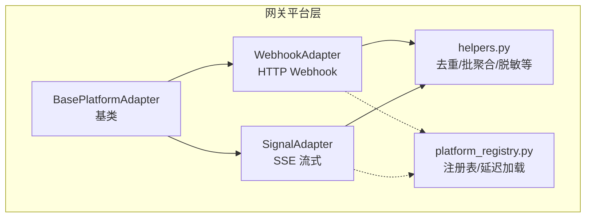
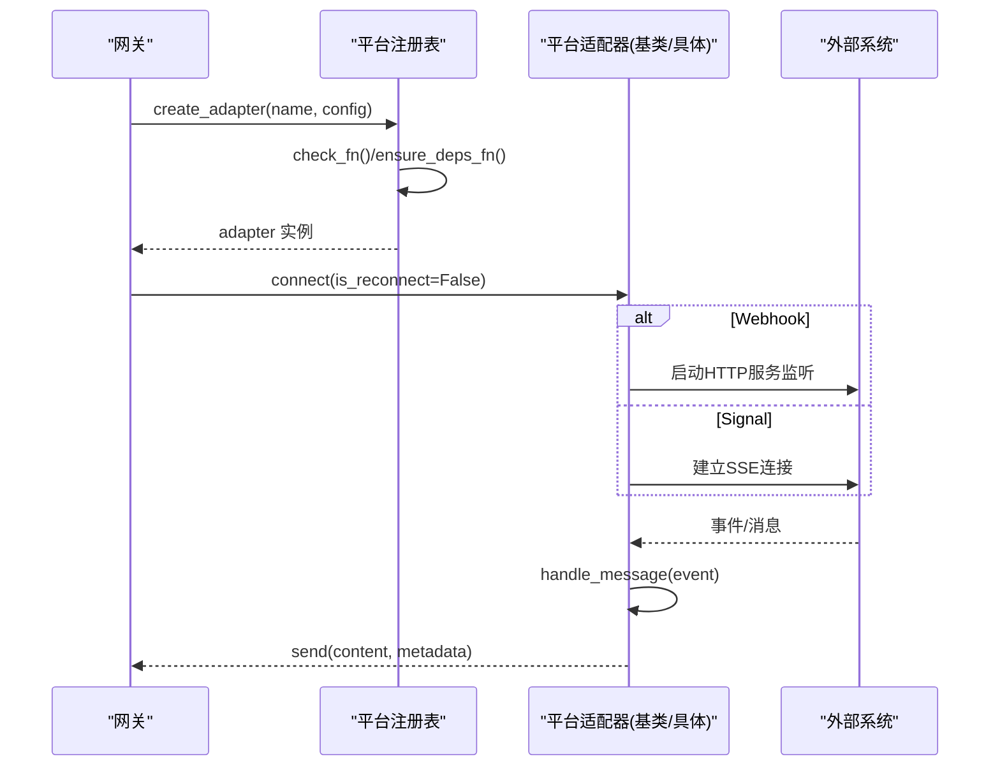
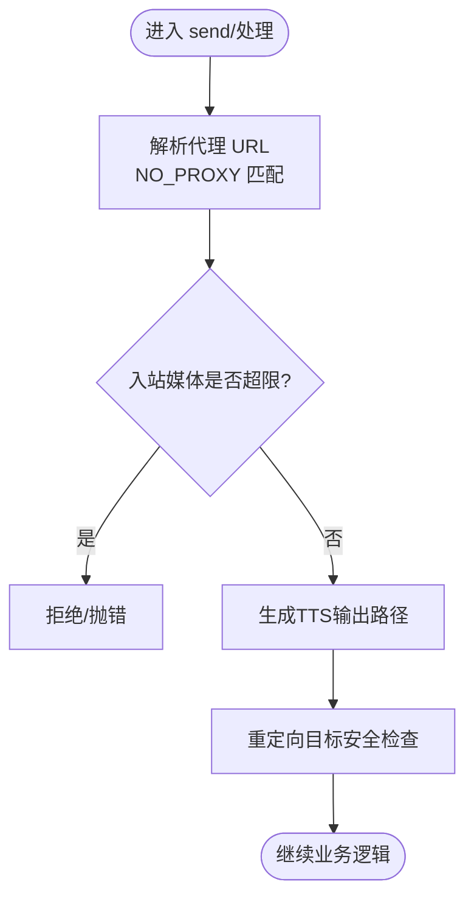
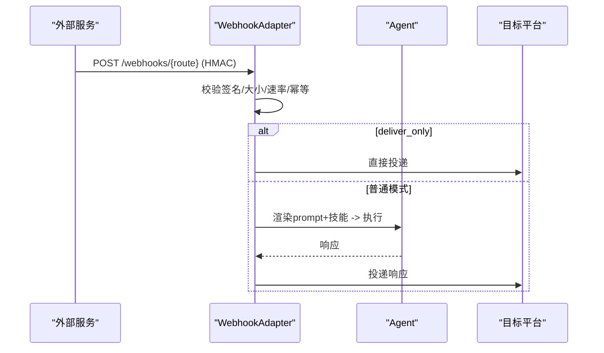
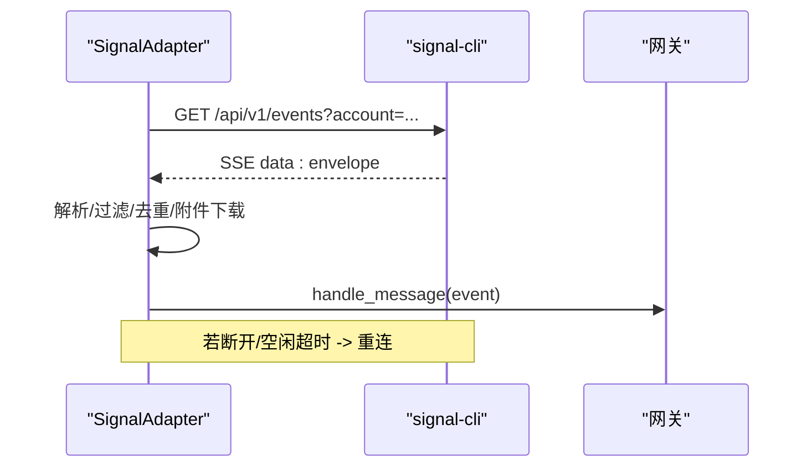
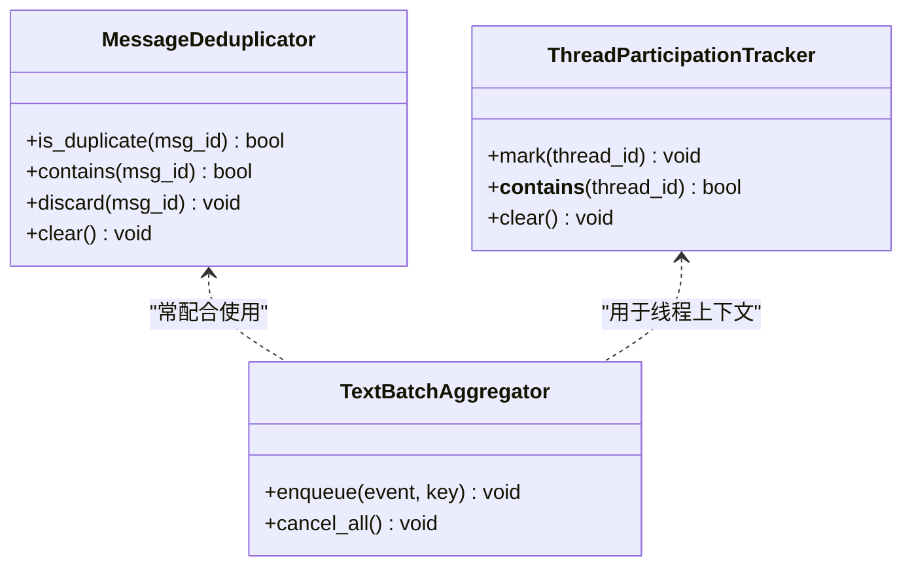
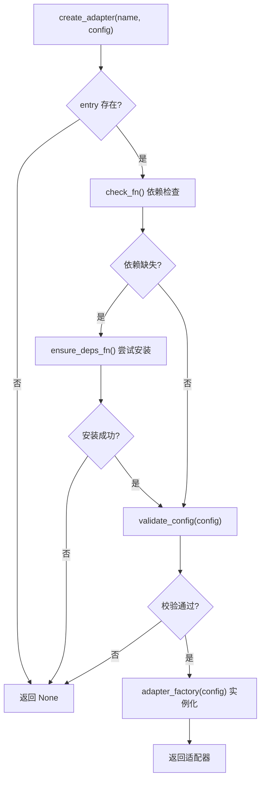
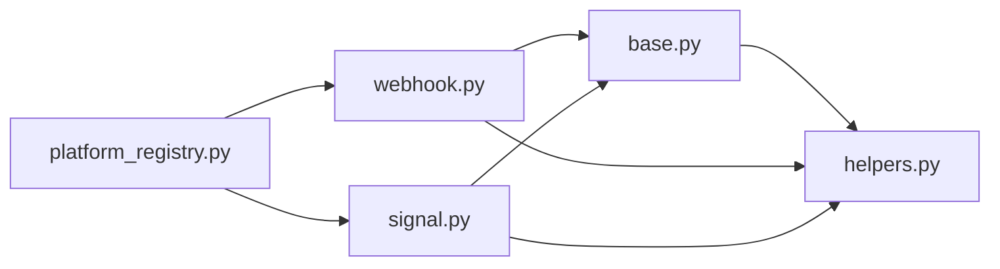

# 平台适配器基础架构

<cite>
**本文引用的文件**
- [gateway/platforms/base.py](file://gateway/platforms/base.py)
- [gateway/platforms/webhook.py](file://gateway/platforms/webhook.py)
- [gateway/platforms/signal.py](file://gateway/platforms/signal.py)
- [gateway/platforms/helpers.py](file://gateway/platforms/helpers.py)
- [gateway/platform_registry.py](file://gateway/platform_registry.py)
- [tests/gateway/test_adapter_connect_is_reconnect_contract.py](file://tests/gateway/test_adapter_connect_is_reconnect_contract.py)
</cite>

## 目录
1. [简介](#简介)
2. [项目结构](#项目结构)
3. [核心组件](#核心组件)
4. [架构总览](#架构总览)
5. [详细组件分析](#详细组件分析)
6. [依赖关系分析](#依赖关系分析)
7. [性能考量](#性能考量)
8. [故障排查指南](#故障排查指南)
9. [结论](#结论)
10. [附录：自定义平台适配器实现指南](#附录自定义平台适配器实现指南)

## 简介
本文件面向希望构建或扩展“平台适配器”的开发者，系统性阐述 Hermes 网关中平台适配器的基础架构与最佳实践。内容涵盖：
- 核心接口设计与基类继承关系
- 消息格式转换、会话状态管理、认证处理流程
- 错误重试策略、连接生命周期管理、心跳检测与断线重连
- 速率限制、插件注册机制、配置管理与插件发现
- 与网关系统的集成方式（事件发布/订阅、命令处理、中间件支持）
- 提供完整基类使用示例与端到端流程图，帮助快速实现基本消息收发

## 项目结构
平台适配器位于 gateway/platforms 目录下，采用“基类 + 具体平台实现 + 通用工具”的分层组织：
- base.py：定义 BasePlatformAdapter 抽象基类、消息模型、发送结果、媒体缓存、代理与网络辅助等通用能力
- webhook.py：Webhook 适配器，接收外部 HTTP 回调并触发 Agent 运行
- signal.py：Signal 适配器，基于 signal-cli HTTP 模式与 SSE 流式接收消息
- helpers.py：跨平台共享工具（去重、文本批聚合、Markdown 处理、线程参与跟踪、脱敏等）
- platform_registry.py：平台适配器注册表，支持内置与插件自注册、延迟加载、依赖检查与工厂创建

图表来源
- [gateway/platforms/base.py:1-120](file://gateway/platforms/base.py#L1-L120)
- [gateway/platforms/webhook.py:177-243](file://gateway/platforms/webhook.py#L177-L243)
- [gateway/platforms/signal.py:253-341](file://gateway/platforms/signal.py#L253-L341)
- [gateway/platforms/helpers.py:24-180](file://gateway/platforms/helpers.py#L24-L180)
- [gateway/platform_registry.py:38-181](file://gateway/platform_registry.py#L38-L181)

章节来源
- [gateway/platforms/base.py:1-120](file://gateway/platforms/base.py#L1-L120)
- [gateway/platform_registry.py:1-181](file://gateway/platform_registry.py#L1-L181)

## 核心组件
- BasePlatformAdapter（基类）
  - 统一抽象：connect/disconnect/send/get_chat_info/handle_message 等生命周期与消息处理入口
  - 通用能力：媒体缓存、代理解析、UTF-16 长度计算、消息截断、TTS 输出路径、SSRF 防护、入站媒体大小限制校验
- WebhookAdapter
  - 启动 aiohttp 服务，路由 /health 与 /webhooks/{route}
  - HMAC 签名校验、速率限制、幂等性缓存、动态路由热重载、deliver_only 直通投递
- SignalAdapter
  - 通过 httpx 连接 signal-cli HTTP 模式，SSE 流式接收事件
  - 健康监控、心跳检测、自动重连、群/DM 过滤、引用回复上下文提取、附件下载与类型推断
- helpers.py
  - MessageDeduplicator：TTL 去重
  - TextBatchAggregator：快速文本事件批聚合
  - Markdown 工具：表格转列表、分块、围栏感知合并
  - ThreadParticipationTracker：线程参与持久化
  - redact_phone：号码脱敏
- platform_registry.py
  - PlatformEntry：描述平台元数据、依赖检查、配置校验、安装提示、YAML→环境桥接、独立发送器钩子等
  - PlatformRegistry：集中注册/查找/实例化，支持延迟加载与插件覆盖

章节来源
- [gateway/platforms/base.py:570-800](file://gateway/platforms/base.py#L570-L800)
- [gateway/platforms/webhook.py:177-403](file://gateway/platforms/webhook.py#L177-L403)
- [gateway/platforms/signal.py:253-421](file://gateway/platforms/signal.py#L253-L421)
- [gateway/platforms/helpers.py:24-180](file://gateway/platforms/helpers.py#L24-L180)
- [gateway/platform_registry.py:38-181](file://gateway/platform_registry.py#L38-L181)

## 架构总览
平台适配器通过统一的基类抽象屏蔽不同平台的差异，由注册表在启动时按需发现与实例化。Webhook 与 Signal 分别代表“请求驱动”和“流式推送”两类典型接入方式。

图表来源
- [gateway/platform_registry.py:299-377](file://gateway/platform_registry.py#L299-L377)
- [gateway/platforms/webhook.py:248-344](file://gateway/platforms/webhook.py#L248-L344)
- [gateway/platforms/signal.py:347-382](file://gateway/platforms/signal.py#L347-L382)

## 详细组件分析

### 基类与通用能力（BasePlatformAdapter）
- 设计要点
  - 抽象方法：connect/disconnect/send/get_chat_info/handle_message
  - 通用工具：媒体缓存、代理解析、UTF-16 长度与截断、TTS 输出路径、SSRF 重定向防护、入站媒体大小限制
- 关键流程
  - 代理解析：优先平台环境变量，其次全局代理，最后 macOS 系统代理；支持 NO_PROXY 匹配
  - 安全：SSRF 重定向目标校验，URL 日志脱敏
  - 媒体：入站媒体大小限制可配置，默认 128 MiB，超限抛出异常

图表来源
- [gateway/platforms/base.py:417-517](file://gateway/platforms/base.py#L417-L517)
- [gateway/platforms/base.py:682-696](file://gateway/platforms/base.py#L682-L696)
- [gateway/platforms/base.py:741-800](file://gateway/platforms/base.py#L741-L800)

章节来源
- [gateway/platforms/base.py:417-517](file://gateway/platforms/base.py#L417-L517)
- [gateway/platforms/base.py:682-696](file://gateway/platforms/base.py#L682-L696)
- [gateway/platforms/base.py:741-800](file://gateway/platforms/base.py#L741-L800)

### Webhook 适配器
- 功能概述
  - 启动 aiohttp 应用，暴露 /health 与 /webhooks/{route}
  - 每路由要求 HMAC 密钥，支持 V2 时间戳签名防重放
  - 固定窗口速率限制、幂等性缓存（delivery_id）、动态路由热重载
  - deliver_only 模式：跳过 Agent，直接投递到目标平台
- 安全与健壮性
  - 非回环主机禁止 INSECURE_NO_AUTH
  - 请求体大小限制（Header 与实际读取双重校验）
  - 事件类型过滤、脚本预处理、技能注入

图表来源
- [gateway/platforms/webhook.py:248-344](file://gateway/platforms/webhook.py#L248-L344)
- [gateway/platforms/webhook.py:584-800](file://gateway/platforms/webhook.py#L584-L800)

章节来源
- [gateway/platforms/webhook.py:177-403](file://gateway/platforms/webhook.py#L177-L403)
- [gateway/platforms/webhook.py:584-800](file://gateway/platforms/webhook.py#L584-L800)

### Signal 适配器
- 功能概述
  - 通过 httpx 连接 signal-cli HTTP 模式，SSE 流式接收事件
  - 健康监控任务定期探测，长时间无活动强制重连
  - 群/DM 白名单、@提及过滤、引用回复上下文提取、附件下载与类型推断
- 重连与心跳
  - SSE 断开指数退避重连（带抖动）
  - 健康检查失败或长时间空闲触发强制重连

图表来源
- [gateway/platforms/signal.py:347-382](file://gateway/platforms/signal.py#L347-L382)
- [gateway/platforms/signal.py:426-531](file://gateway/platforms/signal.py#L426-L531)

章节来源
- [gateway/platforms/signal.py:253-421](file://gateway/platforms/signal.py#L253-L421)
- [gateway/platforms/signal.py:426-531](file://gateway/platforms/signal.py#L426-L531)

### 通用工具（helpers.py）
- 消息去重：TTL 缓存，支持容量裁剪与过期清理
- 文本批聚合：按 key 聚合快速到达的文本事件，避免碎片化
- Markdown 处理：表格转列表、围栏感知分块与合并、段落边界切分
- 线程参与跟踪：持久化已参与的线程 ID，限制最大数量
- 脱敏：电话号码脱敏，保护隐私

图表来源
- [gateway/platforms/helpers.py:24-180](file://gateway/platforms/helpers.py#L24-L180)
- [gateway/platforms/helpers.py:217-279](file://gateway/platforms/helpers.py#L217-L279)

章节来源
- [gateway/platforms/helpers.py:24-180](file://gateway/platforms/helpers.py#L24-L180)
- [gateway/platforms/helpers.py:217-279](file://gateway/platforms/helpers.py#L217-L279)

### 平台注册与插件发现（platform_registry.py）
- 设计要点
  - PlatformEntry：描述 name/label/factory/check_fn/validate_config/ensure_deps_fn/is_connected/required_env/install_hint/setup_fn/env_enablement_fn/apply_yaml_config_fn/standalone_sender_fn 等
  - 延迟加载：仅在实际使用时导入重型 SDK，减少冷启动开销
  - 依赖检查与安装：check_fn 被动探测，ensure_deps_fn 主动安装，仅在需要时执行
  - 配置校验：validate_config 提前拦截错误配置
- 使用方式
  - 插件侧：调用 register(PlatformEntry(...))
  - 网关侧：create_adapter(name, config) 返回适配器实例

图表来源
- [gateway/platform_registry.py:299-377](file://gateway/platform_registry.py#L299-L377)

章节来源
- [gateway/platform_registry.py:38-181](file://gateway/platform_registry.py#L38-L181)
- [gateway/platform_registry.py:299-377](file://gateway/platform_registry.py#L299-L377)

## 依赖关系分析
- 耦合与内聚
  - base.py 提供高内聚的通用能力，降低各平台实现重复代码
  - webhook/signal 各自专注特定协议与生态，通过 helpers 复用通用逻辑
  - platform_registry 解耦平台发现与实例化，支持插件覆盖与延迟加载
- 外部依赖
  - aiohttp（Webhook）、httpx（Signal）、signal-cli（外部进程）
  - 可选：aiohttp_socks（SOCKS 代理）
- 潜在循环依赖
  - 通过延迟导入与模块级常量规避，保持启动性能与稳定性

图表来源
- [gateway/platforms/base.py:1-120](file://gateway/platforms/base.py#L1-L120)
- [gateway/platforms/webhook.py:177-243](file://gateway/platforms/webhook.py#L177-L243)
- [gateway/platforms/signal.py:253-341](file://gateway/platforms/signal.py#L253-L341)
- [gateway/platform_registry.py:1-181](file://gateway/platform_registry.py#L1-L181)

章节来源
- [gateway/platforms/base.py:1-120](file://gateway/platforms/base.py#L1-L120)
- [gateway/platform_registry.py:1-181](file://gateway/platform_registry.py#L1-L181)

## 性能考量
- 延迟加载：平台模块仅在首次使用时导入，显著缩短 CLI/网关冷启动时间
- 速率限制：Webhook 固定窗口限流，Signal 批量发送与退避重连
- 内存控制：入站媒体大小限制，防止 OOM；去重与批聚合减少无效处理
- 代理优化：优先 connector 路径（aiohttp_socks），减少 per-request 开销
- 健康监控：Signal SSE 空闲检测与强制重连，避免静默失效

[本节为通用指导，不直接分析具体文件]

## 故障排查指南
- 常见问题
  - 依赖缺失：check_fn 失败且 ensure_deps_fn 未安装成功，导致 create_adapter 返回 None
  - 配置错误：validate_config 失败，需检查 extra 字段与环境变量
  - Webhook 鉴权失败：HMAC 签名不匹配或缺少 secret，返回 401/403
  - Signal 连接失败：signal-cli 不可达或账户未配置，connect 返回 False
- 诊断建议
  - 查看日志中的平台名称与错误信息（如 “[webhook] Route ... has no HMAC secret”）
  - 确认 NO_PROXY/no_proxy 是否正确排除目标主机
  - 验证动态路由文件变更是否被热重载
  - 检查 SSE 健康监控是否触发强制重连

章节来源
- [gateway/platform_registry.py:315-377](file://gateway/platform_registry.py#L315-L377)
- [gateway/platforms/webhook.py:248-344](file://gateway/platforms/webhook.py#L248-L344)
- [gateway/platforms/signal.py:347-382](file://gateway/platforms/signal.py#L347-L382)

## 结论
Hermes 的平台适配器基础架构以基类为核心，结合注册表与通用工具，实现了高内聚、低耦合、可扩展的多平台接入方案。Webhook 与 Signal 分别展示了请求驱动与流式推送的典型实现。通过延迟加载、依赖检查、配置校验与健康监控，系统在易用性与健壮性之间取得良好平衡。开发者可据此快速构建自定义平台适配器，并无缝融入网关的事件与命令体系。

[本节为总结，不直接分析具体文件]

## 附录：自定义平台适配器实现指南
- 步骤概览
  1. 新建适配器类继承 BasePlatformAdapter，实现 connect/disconnect/send/get_chat_info/handle_message
  2. 在 platform_registry.py 中注册 PlatformEntry，提供 name/label/factory/check_fn/validate_config 等
  3. 如需插件化，使用 register_deferred 延迟加载，避免冷启动开销
  4. 利用 helpers.py 的去重、批聚合、Markdown 工具提升体验
  5. 遵循 is_reconnect 契约：connect(*, is_reconnect: bool = False) 必须接受该关键字参数
- 关键契约与约定
  - connect 必须接受 is_reconnect 关键字参数，否则网关重连时会抛出 TypeError
  - send 返回 SendResult，success=True/False 及可选 error
  - handle_message 接收 MessageEvent，包含 source/text/message_type/media_urls/timestamp 等
- 示例流程（文字版）
  - 初始化：读取配置 extra，设置客户端/会话状态
  - 连接：建立长连接或启动服务，标记 connected
  - 接收：解析平台事件为 MessageEvent，调用 handle_message
  - 发送：根据 deliver 策略或平台 API 发送消息，记录结果
  - 断开：取消任务、关闭连接、释放资源

章节来源
- [tests/gateway/test_adapter_connect_is_reconnect_contract.py:114-145](file://tests/gateway/test_adapter_connect_is_reconnect_contract.py#L114-L145)
- [gateway/platforms/base.py:570-800](file://gateway/platforms/base.py#L570-L800)
- [gateway/platform_registry.py:38-181](file://gateway/platform_registry.py#L38-L181)