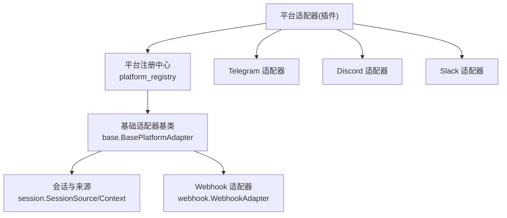
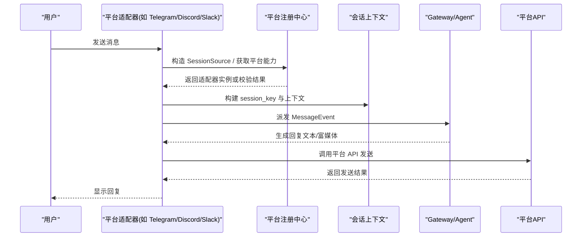
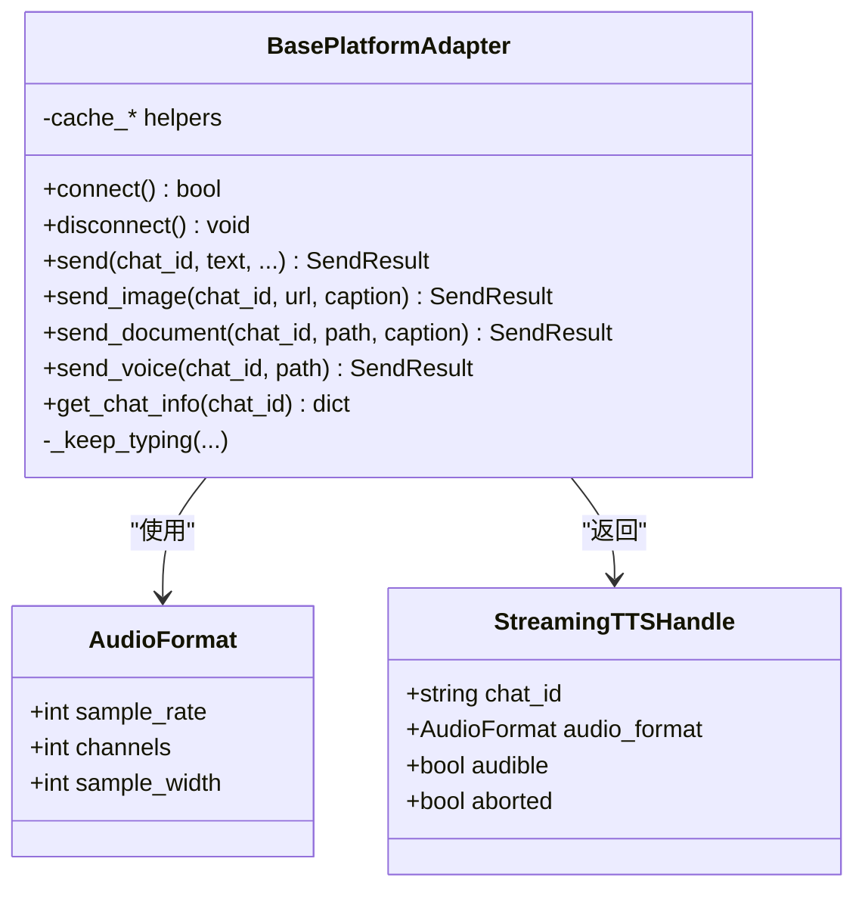
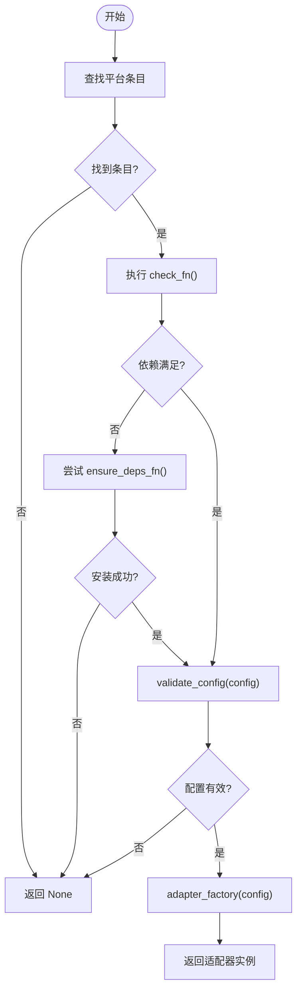
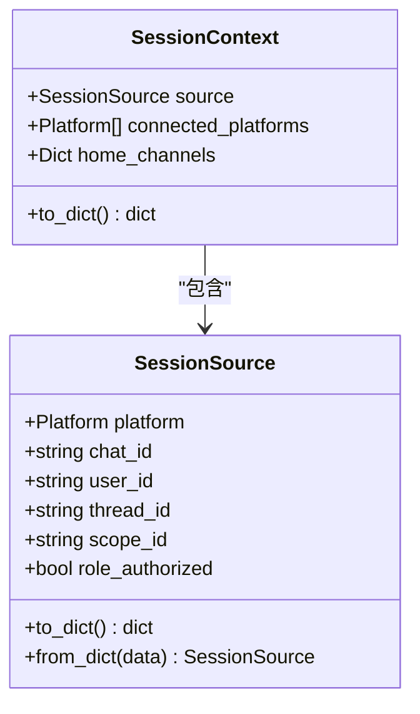
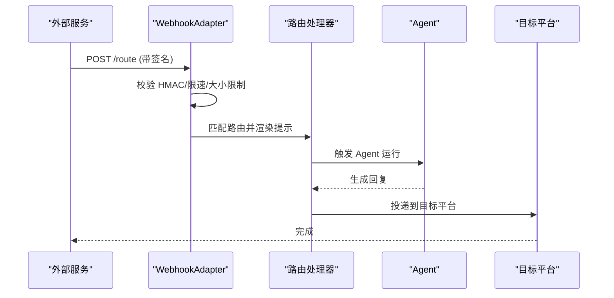
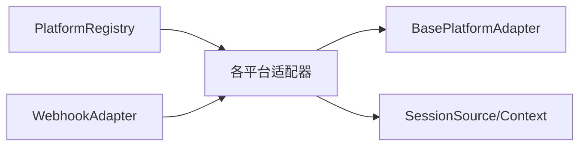

# 平台适配器开发

<cite>
**本文引用的文件**
- [gateway/platforms/base.py](file://gateway/platforms/base.py)
- [gateway/platform_registry.py](file://gateway/platform_registry.py)
- [gateway/session.py](file://gateway/session.py)
- [gateway/platforms/webhook.py](file://gateway/platforms/webhook.py)
- [plugins/platforms/telegram/adapter.py](file://plugins/platforms/telegram/adapter.py)
- [plugins/platforms/discord/adapter.py](file://plugins/platforms/discord/adapter.py)
- [plugins/platforms/slack/adapter.py](file://plugins/platforms/slack/adapter.py)
- [gateway/platforms/ADDING_A_PLATFORM.md](file://gateway/platforms/ADDING_A_PLATFORM.md)
</cite>

## 目录
1. [简介](#简介)
2. [项目结构](#项目结构)
3. [核心组件](#核心组件)
4. [架构总览](#架构总览)
5. [详细组件分析](#详细组件分析)
6. [依赖关系分析](#依赖关系分析)
7. [性能考量](#性能考量)
8. [故障排查指南](#故障排查指南)
9. [结论](#结论)
10. [附录](#附录)

## 简介
本指南面向希望为 Hermes Gateway 新增消息平台适配器的开发者，系统阐述接口规范、消息格式转换、会话与状态同步、认证处理、错误重试、速率限制、连接管理，以及富媒体、命令与权限等平台特性适配。文档同时提供 Telegram、Discord、Slack 等平台的实现要点与测试、调试、部署建议，帮助快速完成从设计到上线的完整流程。

## 项目结构
Hermes 的平台适配器采用“插件优先”的扩展模式：
- 基础抽象与通用能力集中在 gateway/platforms/base.py（BasePlatformAdapter、消息事件、发送结果、媒体缓存、代理与限流工具等）。
- 平台注册中心在 gateway/platform_registry.py，负责延迟加载、依赖检查、配置校验与工厂创建。
- 会话上下文与来源信息在 gateway/session.py，统一描述消息来源、路由键、PII 脱敏策略等。
- 具体平台以插件形式位于 plugins/platforms/<platform>/，每个平台一个 adapter.py 实现。
- 通用 Webhook 适配器在 gateway/platforms/webhook.py，用于接收外部服务回调并触发 Agent 运行。
- 新增平台清单与集成步骤参考 gateway/platforms/ADDING_A_PLATFORM.md。

**图示来源**
- [gateway/platform_registry.py:183-381](file://gateway/platform_registry.py#L183-L381)
- [gateway/platforms/base.py:570-620](file://gateway/platforms/base.py#L570-L620)
- [gateway/session.py:148-346](file://gateway/session.py#L148-L346)
- [gateway/platforms/webhook.py:177-200](file://gateway/platforms/webhook.py#L177-L200)

**章节来源**
- [gateway/platforms/ADDING_A_PLATFORM.md:1-75](file://gateway/platforms/ADDING_A_PLATFORM.md#L1-L75)
- [gateway/platform_registry.py:1-182](file://gateway/platform_registry.py#L1-L182)

## 核心组件
- BasePlatformAdapter：所有平台适配器的基类，定义 connect/disconnect/send/send_image/send_document 等标准方法，并提供消息去重、线程参与跟踪、媒体缓存、代理解析、SSRF 防护、TTS 流式输出等通用能力。
- PlatformRegistry：集中注册平台元数据与工厂，支持延迟导入、依赖探测、自动安装提示、配置校验、独立发送器钩子等。
- SessionSource/SessionContext：统一描述消息来源（平台、聊天ID、用户ID、线程、作用域等），构建动态系统提示，支持 PII 脱敏与多用户会话标记。
- WebhookAdapter：通用 HTTP 回调入口，支持 HMAC 签名校验、限速、幂等、路由模板渲染与跨平台投递。

关键职责映射：
- 认证与鉴权：通过 PlatformEntry.allowed_users_env/allow_all_env 及网关授权逻辑控制访问；各平台适配器内部再结合 SDK 鉴权。
- 消息格式转换：适配器将平台原始消息转换为 MessageEvent，再由网关统一处理；发送时由 base 层根据平台特性选择音频/视频/文档路径。
- 会话与状态：基于 SessionSource 构建 session_key，持久化会话元数据，支持自动续期与恢复。
- 错误重试与限流：base 层提供通用重试与超时保护；各平台可叠加自身速率限制与退避策略。
- 连接管理：connect/disconnect 生命周期由适配器实现；registry 负责按需实例化与依赖准备。

**章节来源**
- [gateway/platforms/base.py:570-620](file://gateway/platforms/base.py#L570-L620)
- [gateway/platform_registry.py:38-182](file://gateway/platform_registry.py#L38-L182)
- [gateway/session.py:148-346](file://gateway/session.py#L148-L346)
- [gateway/platforms/webhook.py:177-200](file://gateway/platforms/webhook.py#L177-L200)

## 架构总览
下图展示一次典型的消息接入与回复流程，涵盖平台适配器、注册中心、会话上下文与网关调度。

**图示来源**
- [gateway/platform_registry.py:299-377](file://gateway/platform_registry.py#L299-L377)
- [gateway/session.py:148-346](file://gateway/session.py#L148-L346)
- [plugins/platforms/telegram/adapter.py:1-200](file://plugins/platforms/telegram/adapter.py#L1-L200)
- [plugins/platforms/discord/adapter.py:1-200](file://plugins/platforms/discord/adapter.py#L1-L200)
- [plugins/platforms/slack/adapter.py:1-200](file://plugins/platforms/slack/adapter.py#L1-L200)

## 详细组件分析

### 平台适配器基类与通用能力
- 消息事件与发送结果：统一抽象 inbound/outbound 数据结构，屏蔽平台差异。
- 媒体处理：内置图片/音频/视频/文档缓存与大小上限校验，避免内存溢出与 SSRF。
- 代理与网络：支持 HTTP/SOCKS 代理、NO_PROXY 匹配、macOS 系统代理检测。
- TTS 流式：AudioFormat/StreamingTTSHandle 支持按平台偏好输出 Ogg/MP3。
- 线程与引用：_thread_metadata_for_source/_reply_anchor_for_event 处理 Slack/Discord/Telegram 的线程与回复锚点。

**图示来源**
- [gateway/platforms/base.py:570-620](file://gateway/platforms/base.py#L570-L620)

**章节来源**
- [gateway/platforms/base.py:570-620](file://gateway/platforms/base.py#L570-L620)

### 平台注册中心与生命周期
- 延迟加载：避免启动时导入重型 SDK，首次使用时才加载对应平台模块。
- 依赖检查与安装：check_fn 轻量探测，ensure_deps_fn 在需要时主动安装依赖。
- 配置校验：validate_config 在创建前验证必要字段。
- 工厂创建：adapter_factory 接收 PlatformConfig 并返回适配器实例。
- 独立发送器：standalone_sender_fn 支持 cron 等进程外场景直接投递。

**图示来源**
- [gateway/platform_registry.py:299-377](file://gateway/platform_registry.py#L299-L377)

**章节来源**
- [gateway/platform_registry.py:183-381](file://gateway/platform_registry.py#L183-L381)

### 会话管理与状态同步
- SessionSource：记录平台、聊天/用户标识、线程、作用域、是否机器人、消息触发 ID 等，用于路由与权限判定。
- SessionContext：注入动态系统提示，告知 Agent 当前来源、可用平台、默认投递通道等。
- PII 脱敏：对安全平台进行用户/聊天 ID 哈希化处理，避免敏感信息进入 LLM。
- 多用户会话：共享线程或非线程群组时可启用多用户会话标记，避免缓存失效。

**图示来源**
- [gateway/session.py:148-346](file://gateway/session.py#L148-L346)

**章节来源**
- [gateway/session.py:148-346](file://gateway/session.py#L148-L346)

### Webhook 适配器（通用回调）
- 安全：每路由要求 HMAC 密钥，支持 V2 时间戳绑定防重放；可选 INSECURE_NO_AUTH 仅用于测试。
- 路由：routes 定义事件过滤、提示模板、技能加载、投递目标与额外参数。
- 幂等与限速：防止重复执行与突发流量。
- 进程内/外投递：可与 send_message_tool 配合，在 cron 等进程外场景直接发送。

**图示来源**
- [gateway/platforms/webhook.py:177-200](file://gateway/platforms/webhook.py#L177-L200)

**章节来源**
- [gateway/platforms/webhook.py:1-200](file://gateway/platforms/webhook.py#L1-L200)

### 平台特定实现要点

#### Telegram 适配器
- 使用 python-telegram-bot，处理私聊主题、群聊话题、语音/音频区分、按钮交互、错误信息脱敏。
- 注意 UTF-16 长度限制与消息截断，确保不破坏代理字符边界。
- 线程与回复锚点：DM 主题下优先回复触发消息，避免偏离活跃车道。

**章节来源**
- [plugins/platforms/telegram/adapter.py:1-200](file://plugins/platforms/telegram/adapter.py#L1-L200)

#### Discord 适配器
- 使用 discord.py，支持服务器/频道/线程、Slash 命令、附件下载与重定向安全校验。
- 非对话消息历史识别与归档策略，避免污染会话上下文。
- 图片/音视频处理与 FFmpeg 辅助工具集成。

**章节来源**
- [plugins/platforms/discord/adapter.py:1-200](file://plugins/platforms/discord/adapter.py#L1-L200)

#### Slack 适配器
- 使用 slack-bolt Socket Mode，支持频道/DM、线程、Slash 命令、Block Kit 富媒体。
- 表格预处理与对齐，提升可读性；限制错误体读取大小，避免大响应阻塞。
- 线程根消息图片回灌与上下文增强，提高提及场景体验。

**章节来源**
- [plugins/platforms/slack/adapter.py:1-200](file://plugins/platforms/slack/adapter.py#L1-L200)

## 依赖关系分析
- 适配器与基类：所有平台适配器继承 BasePlatformAdapter，复用通用能力。
- 注册中心与适配器：通过 PlatformEntry 暴露名称、标签、工厂、依赖检查、配置校验、独立发送器等元数据。
- 会话与适配器：适配器构造 SessionSource/SessionContext，驱动路由与提示注入。
- Webhook 与平台：WebhookAdapter 可将外部事件转化为 Agent 任务，并投递到任意已注册平台。

**图示来源**
- [gateway/platform_registry.py:183-381](file://gateway/platform_registry.py#L183-L381)
- [gateway/platforms/base.py:570-620](file://gateway/platforms/base.py#L570-L620)
- [gateway/session.py:148-346](file://gateway/session.py#L148-L346)
- [gateway/platforms/webhook.py:177-200](file://gateway/platforms/webhook.py#L177-L200)

**章节来源**
- [gateway/platform_registry.py:183-381](file://gateway/platform_registry.py#L183-L381)
- [gateway/platforms/base.py:570-620](file://gateway/platforms/base.py#L570-L620)
- [gateway/session.py:148-346](file://gateway/session.py#L148-L346)
- [gateway/platforms/webhook.py:177-200](file://gateway/platforms/webhook.py#L177-L200)

## 性能考量
- 延迟加载：平台模块仅在首次使用时导入，减少冷启动开销。
- 媒体大小限制：入站媒体缓冲有全局上限，防止 OOM。
- 代理与网络：支持 SOCKS/HTTP 代理与 NO_PROXY，避免 DNS 污染与内网泄漏。
- 线程与超时：Telegram 初始化具备线程级超时与死锁诊断，避免事件循环阻塞导致挂起。
- 速率限制：Webhook 路由自带固定窗口限速；平台侧可按需叠加更细粒度限制。

[本节为通用指导，无需特定文件来源]

## 故障排查指南
- 依赖缺失：查看 registry 日志中的 install_hint 与 ensure_deps_fn 失败原因。
- 配置错误：validate_config 失败会记录警告，检查 token、server、端口等必填项。
- 连接异常：适配器 connect() 抛出异常时，检查网络、代理、证书与凭据。
- 消息丢失：确认 SessionSource 的 chat_id/thread_id/scope_id 是否正确；核对去重与过滤规则。
- 富媒体失败：检查媒体类型、大小限制、URL 安全校验与重定向链。
- Webhook 被拒：核对 HMAC 密钥、V2 时间戳、限速阈值与 body 大小限制。

**章节来源**
- [gateway/platform_registry.py:315-377](file://gateway/platform_registry.py#L315-L377)
- [gateway/platforms/webhook.py:177-200](file://gateway/platforms/webhook.py#L177-L200)
- [plugins/platforms/telegram/adapter.py:1-200](file://plugins/platforms/telegram/adapter.py#L1-L200)

## 结论
通过统一的基类抽象、注册中心与会话模型，Hermes 提供了可扩展、高内聚的平台适配器体系。开发者可遵循插件路径快速接入新平台，复用通用能力并聚焦平台特性。结合 Webhook 适配器，可实现跨系统的事件驱动集成。完善的测试、调试与部署实践有助于保障稳定性与可维护性。

[本节为总结性内容，无需特定文件来源]

## 附录

### 新增平台开发清单（摘要）
- 创建适配器：继承 BasePlatformAdapter，实现 connect/disconnect/send 等核心方法。
- 注册平台：通过 PlatformEntry 暴露名称、标签、工厂、依赖检查、配置校验、独立发送器等。
- 会话与提示：正确构造 SessionSource/SessionContext，必要时添加平台行为提示。
- 认证与权限：配置 allowed_users_env/allow_all_env，并在适配器中结合 SDK 鉴权。
- 富媒体与命令：利用 base 提供的媒体缓存与 Block Kit/Inline Keyboard 等能力。
- 测试与验证：覆盖枚举、配置加载、适配器初始化、消息路由、发送工具路由等。
- 文档与向导：更新 CLI 设置向导、状态显示与环境变量说明。

**章节来源**
- [gateway/platforms/ADDING_A_PLATFORM.md:76-405](file://gateway/platforms/ADDING_A_PLATFORM.md#L76-L405)