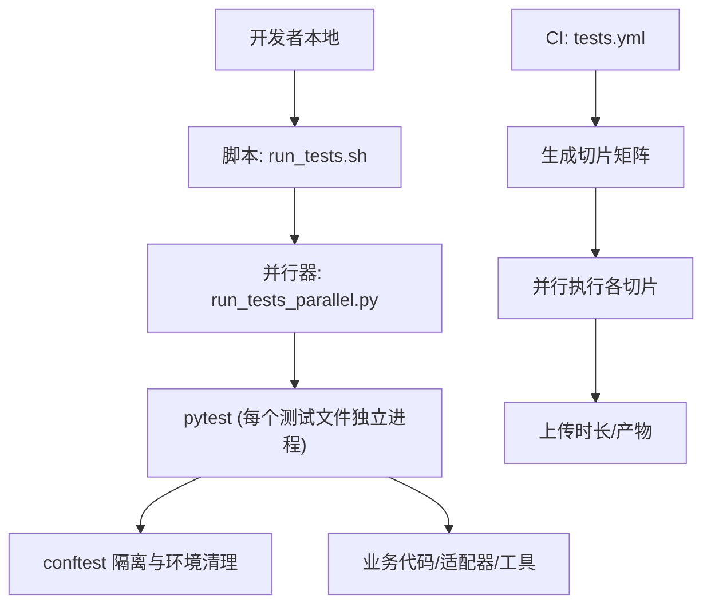
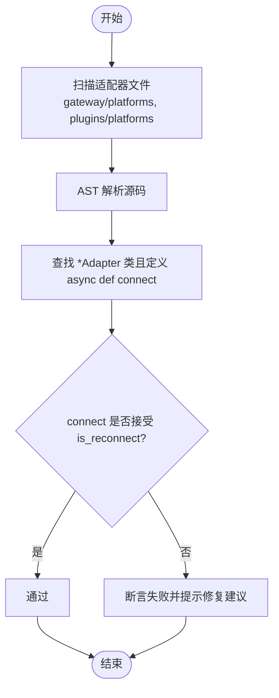
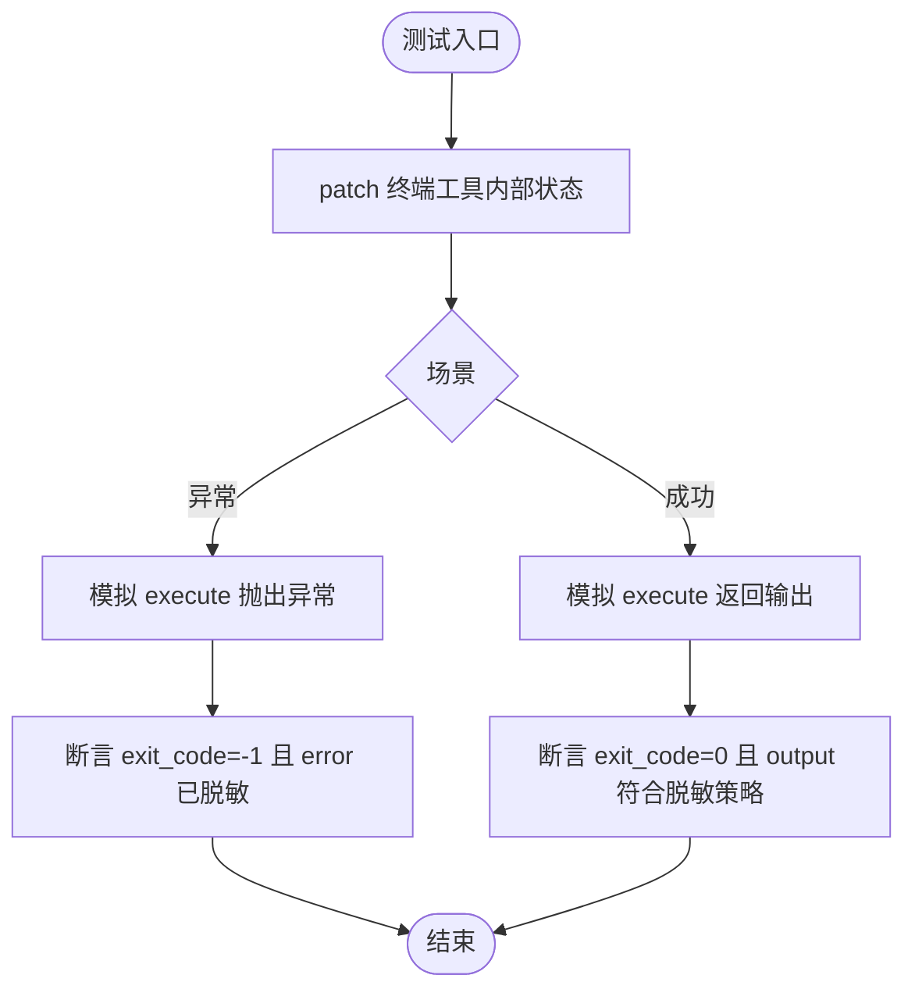
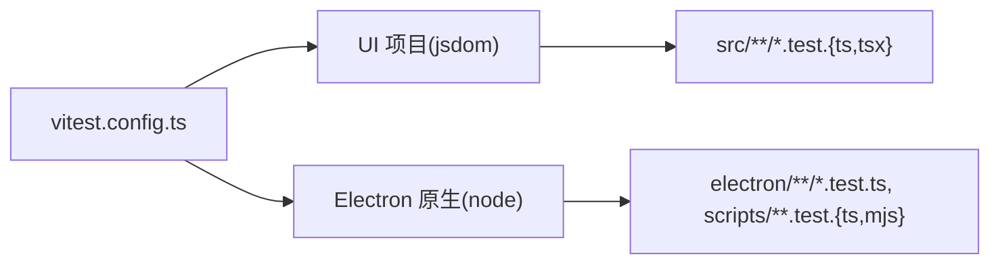
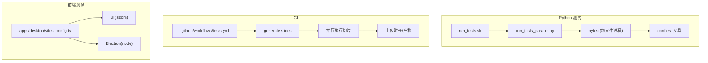

# 测试与调试

<cite>
**本文引用的文件**
- [tests/conftest.py](file://tests/conftest.py)
- [scripts/run_tests.sh](file://scripts/run_tests.sh)
- [.github/workflows/tests.yml](file://.github/workflows/tests.yml)
- [tests/gateway/test_adapter_connect_is_reconnect_contract.py](file://tests/gateway/test_adapter_connect_is_reconnect_contract.py)
- [tests/tools/test_terminal_error_redaction.py](file://tests/tools/test_terminal_error_redaction.py)
- [apps/desktop/vitest.config.ts](file://apps/desktop/vitest.config.ts)
- [tests/e2e/conftest.py](file://tests/e2e/conftest.py)
</cite>

## 目录
1. [简介](#简介)
2. [项目结构](#项目结构)
3. [核心组件](#核心组件)
4. [架构总览](#架构总览)
5. [详细组件分析](#详细组件分析)
6. [依赖关系分析](#依赖关系分析)
7. [性能考量](#性能考量)
8. [故障排查指南](#故障排查指南)
9. [结论](#结论)
10. [附录](#附录)

## 简介
本指南面向平台适配器的测试与调试，覆盖单元测试、集成测试与端到端（E2E）测试的完整实践。内容包含：
- 测试环境搭建与隔离策略
- Mock/Stub 服务配置与测试数据准备
- 消息流转验证与功能正确性校验
- 调试技巧：日志分析、网络抓包、性能监控
- 常见问题诊断：连接失败、消息丢失、权限错误
- 高质量测试用例示例与持续集成（CI）自动化流程

## 项目结构
仓库采用多语言、多层次的工程组织：
- Python 后端与网关：以 pytest 为核心，配合自定义 runner 实现“按文件进程隔离”的并行执行
- 桌面端前端与 Electron：使用 Vitest 进行单元与原生模块测试
- CI：GitHub Actions 将测试切片并行化，统一安装依赖并运行测试与 E2E



**图表来源**
- [scripts/run_tests.sh:1-184](file://scripts/run_tests.sh#L1-L184)
- [.github/workflows/tests.yml:1-252](file://.github/workflows/tests.yml#L1-L252)

**章节来源**
- [scripts/run_tests.sh:1-184](file://scripts/run_tests.sh#L1-L184)
- [.github/workflows/tests.yml:1-252](file://.github/workflows/tests.yml#L1-L252)

## 核心组件
- 测试环境与隔离
  - 通过 conftest 在每次测试前清空敏感环境变量、重定向 HERMES_HOME、固定时区/语言/哈希种子，确保本地与 CI 一致
  - 提供写保护守卫，防止误写生产数据库或看板
- 测试执行器
  - run_tests.sh 作为统一入口，强制“每文件一个进程”，避免跨文件状态泄漏
  - CI 中通过 generate-slices 将测试集切分为多个并行任务
- 前端测试
  - apps/desktop 使用 Vitest，分别配置 jsdom 与 node 环境，支持 UI 与 Electron 原生逻辑测试

**章节来源**
- [tests/conftest.py:1-800](file://tests/conftest.py#L1-L800)
- [scripts/run_tests.sh:1-184](file://scripts/run_tests.sh#L1-L184)
- [apps/desktop/vitest.config.ts:1-32](file://apps/desktop/vitest.config.ts#L1-L32)

## 架构总览
下图展示了从开发者到 CI 的测试执行路径，以及关键隔离点与保障机制。

```mermaid
sequenceDiagram
participant Dev as "开发者"
participant Runner as "run_tests.sh"
participant Par as "run_tests_parallel.py"
participant Pyt as "pytest(单文件进程)"
participant Fix as "conftest 隔离"
participant Code as "被测代码/适配器"
Dev->>Runner : 执行测试命令
Runner->>Par : 启动并行器(设置TZ/LANG/HASH等)
Par->>Pyt : 为每个测试文件启动新进程
Pyt->>Fix : 加载自动夹具(清变量/重定向HOME/写保护)
Fix-->>Pyt : 安全环境就绪
Pyt->>Code : 调用被测函数/适配器
Code-->>Pyt : 返回结果/事件
Pyt-->>Dev : 报告断言结果
```

**图表来源**
- [scripts/run_tests.sh:102-184](file://scripts/run_tests.sh#L102-L184)
- [tests/conftest.py:429-526](file://tests/conftest.py#L429-L526)

## 详细组件分析

### 平台适配器契约静态检查（单元测试）
- 目标：保证所有平台适配器的 connect() 方法签名兼容 is_reconnect 参数，避免网关重连时静默断开
- 方法：不导入第三方 SDK，直接解析 AST 扫描 gateway/platforms 与 plugins/platforms 下的适配器类，断言其 connect 接受 is_reconnect
- 价值：在编译期/测试期捕获接口不一致问题，提升系统稳定性



**图表来源**
- [tests/gateway/test_adapter_connect_is_reconnect_contract.py:44-103](file://tests/gateway/test_adapter_connect_is_reconnect_contract.py#L44-L103)
- [tests/gateway/test_adapter_connect_is_reconnect_contract.py:109-145](file://tests/gateway/test_adapter_connect_is_reconnect_contract.py#L109-L145)

**章节来源**
- [tests/gateway/test_adapter_connect_is_reconnect_contract.py:1-145](file://tests/gateway/test_adapter_connect_is_reconnect_contract.py#L1-145)

### 终端工具输出脱敏（单元测试）
- 目标：确保终端工具的错误与回溯不包含密钥等敏感信息；同时保留可配置的脱敏开关与命令感知能力
- 方法：构造最小化终端配置，注入失败环境/注册表，断言返回 payload 中的 error/traceback 字段已脱敏；成功场景下验证脱敏开关与命令感知回调
- 价值：防止敏感信息泄露，保障错误上报安全



**图表来源**
- [tests/tools/test_terminal_error_redaction.py:27-45](file://tests/tools/test_terminal_error_redaction.py#L27-L45)
- [tests/tools/test_terminal_error_redaction.py:47-154](file://tests/tools/test_terminal_error_redaction.py#L47-L154)

**章节来源**
- [tests/tools/test_terminal_error_redaction.py:1-154](file://tests/tools/test_terminal_error_redaction.py#L1-L154)

### 桌面端前端测试配置（Vitest）
- 目标：为 React UI 与 Electron 原生逻辑分别配置测试环境
- 要点：
  - UI 项目使用 jsdom 环境，设置全局与超时，避免冷启动超时
  - 原生项目使用 node 环境，覆盖 electron 与 scripts 下的测试
- 价值：前后端一致的测试体验与更快的反馈循环



**图表来源**
- [apps/desktop/vitest.config.ts:1-32](file://apps/desktop/vitest.config.ts#L1-L32)

**章节来源**
- [apps/desktop/vitest.config.ts:1-32](file://apps/desktop/vitest.config.ts#L1-L32)

### 端到端测试（E2E）
- 位置：tests/e2e
- 作用：验证真实平台交互（如 Discord 适配器、中继流式响应等），通常依赖外部服务或容器
- 建议：结合 Docker 镜像缓存与最小化网络请求，提高稳定性与速度

**章节来源**
- [tests/e2e/conftest.py](file://tests/e2e/conftest.py)

## 依赖关系分析
- 测试执行链
  - run_tests.sh → run_tests_parallel.py → pytest（每文件进程）→ conftest 夹具
- CI 流水线
  - 生成切片矩阵 → 并行执行 → 收集时长 → 合并缓存
- 前端测试
  - Vitest 配置驱动 UI 与 Electron 两套测试环境



**图表来源**
- [scripts/run_tests.sh:102-184](file://scripts/run_tests.sh#L102-L184)
- [.github/workflows/tests.yml:20-148](file://.github/workflows/tests.yml#L20-L148)
- [apps/desktop/vitest.config.ts:1-32](file://apps/desktop/vitest.config.ts#L1-L32)

**章节来源**
- [scripts/run_tests.sh:102-184](file://scripts/run_tests.sh#L102-L184)
- [.github/workflows/tests.yml:20-148](file://.github/workflows/tests.yml#L20-L148)
- [apps/desktop/vitest.config.ts:1-32](file://apps/desktop/vitest.config.ts#L1-L32)

## 性能考量
- 并行与切片
  - CI 通过 generate-slices 将测试集切分，减少单任务耗时与超时风险
- 缓存优化
  - uv 缓存持久化，仅当依赖清单变化时重建；CI 结束后合并各切片时长用于后续平衡
- 字节码预编译
  - 启动前对 .py 进行 compileall，降低子进程首次导入开销
- 前端冷启动
  - Vitest 为 UI 测试延长超时，避免 jsdom 初始化导致的假失败

[本节为通用指导，无需特定文件引用]

## 故障排查指南
- 连接失败
  - 现象：适配器 connect() 抛错或重连后静默断开
  - 排查：确认适配器 connect 签名包含 is_reconnect；查看网关重连调用路径；必要时启用更细粒度日志
  - 参考：适配器契约测试
- 消息丢失
  - 现象：平台通道无消息流入/流出
  - 排查：检查会话上下文、消息路由与队列；确认未触发写保护导致的数据写入被拒；核对平台鉴权与白名单
- 权限错误
  - 现象：认证失败或访问受限
  - 排查：确认环境变量未被 conftest 清理影响；检查平台允许的账号/频道列表；核对 OAuth/Token 配置
- 日志分析
  - 使用 hermes CLI 日志与网关日志定位时间线；关注重试、超时与异常堆栈
- 网络抓包
  - 使用代理或抓包工具（如 mitmproxy、Charles）观察请求/响应；注意脱敏后的输出
- 性能监控
  - 关注 CI 时长分布；利用 test_durations.json 识别慢测试；前端关注 vitest 冷启动与渲染耗时

**章节来源**
- [tests/gateway/test_adapter_connect_is_reconnect_contract.py:1-145](file://tests/gateway/test_adapter_connect_is_reconnect_contract.py#L1-L145)
- [tests/conftest.py:429-526](file://tests/conftest.py#L429-L526)

## 结论
本项目建立了完善的测试与调试体系：通过严格的测试环境隔离、适配器契约静态检查、终端输出脱敏、前端双环境测试与 CI 切片并行，保障了平台适配器的质量与稳定性。建议在新平台接入时遵循本文规范，完善单元测试与 E2E 用例，并在 CI 中纳入相应检查，持续提升交付质量。

[本节为总结，无需特定文件引用]

## 附录
- 快速上手
  - 本地运行：scripts/run_tests.sh
  - 指定范围：scripts/run_tests.sh tests/agent/ tests/acp/
  - 单文件：scripts/run_tests.sh tests/foo.py
- 前端测试
  - 进入 apps/desktop，使用 Vitest 运行 UI 与 Electron 测试
- CI 行为
  - 自动生成切片、并行执行、收集时长并缓存，保证稳定与高效

[本节为补充说明，无需特定文件引用]