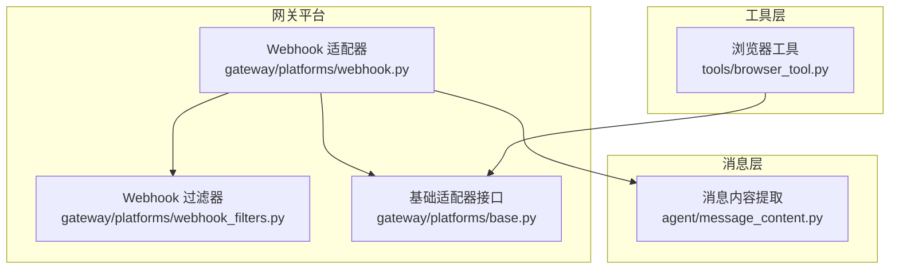
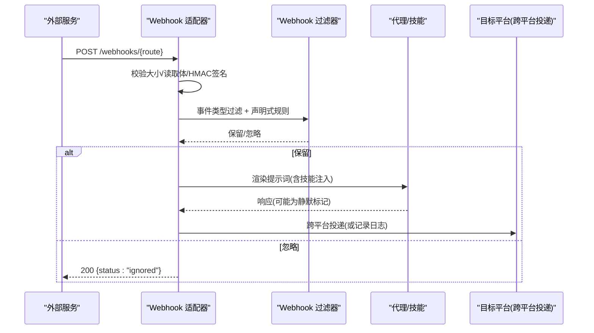
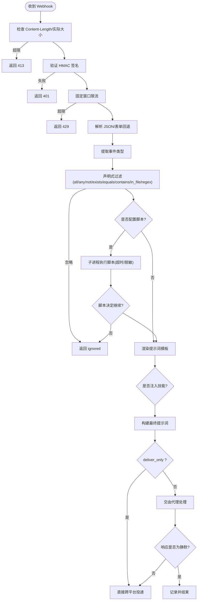
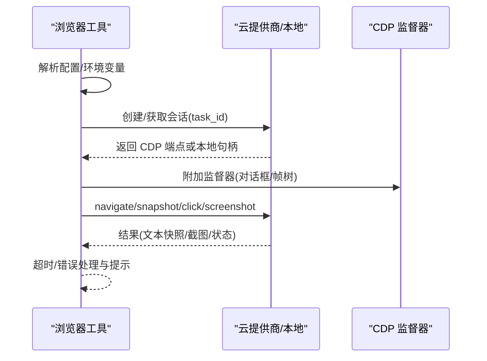
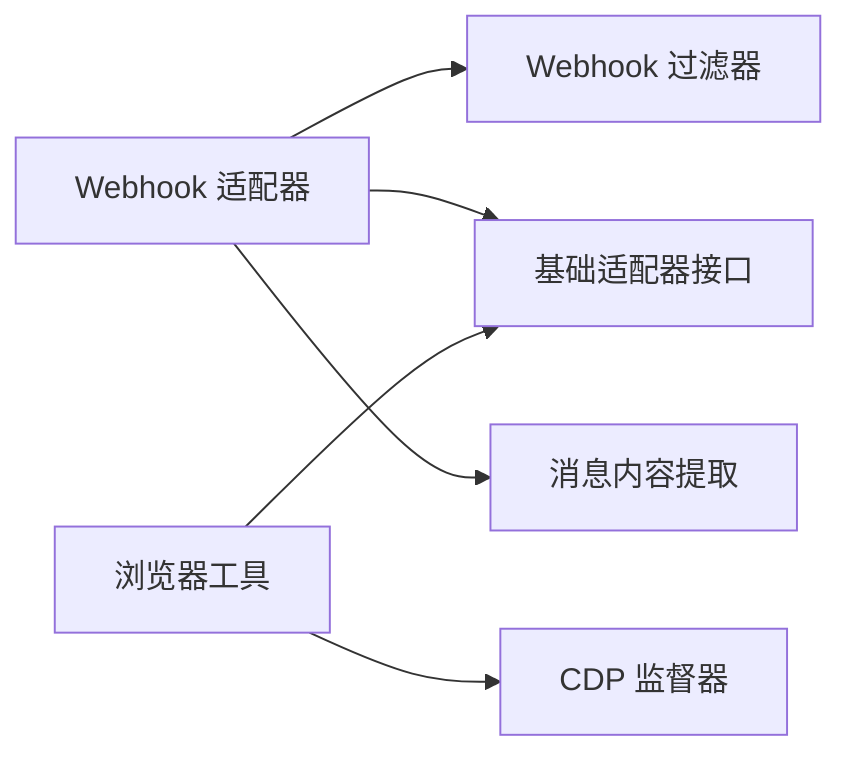

# 高级功能适配

<cite>
**本文引用的文件**
- [gateway/platforms/webhook.py](file://gateway/platforms/webhook.py)
- [gateway/platforms/webhook_filters.py](file://gateway/platforms/webhook_filters.py)
- [tools/browser_tool.py](file://tools/browser_tool.py)
- [agent/message_content.py](file://agent/message_content.py)
- [gateway/platforms/base.py](file://gateway/platforms/base.py)
- [tests/gateway/test_adapter_connect_is_reconnect_contract.py](file://tests/gateway/test_adapter_connect_is_reconnect_contract.py)
</cite>

## 目录
1. [简介](#简介)
2. [项目结构](#项目结构)
3. [核心组件](#核心组件)
4. [架构总览](#架构总览)
5. [详细组件分析](#详细组件分析)
6. [依赖关系分析](#依赖关系分析)
7. [性能与内存优化](#性能与内存优化)
8. [故障排查指南](#故障排查指南)
9. [结论](#结论)
10. [附录：开发示例与最佳实践](#附录开发示例与最佳实践)

## 简介
本指南面向平台适配器的高级功能开发与集成，覆盖以下主题：
- 富媒体处理：图片、视频、音频的上传下载、缓存管理与格式转换机制
- Webhook 过滤：请求级事件类型过滤、脚本化内容变换、安全校验（HMAC）、速率限制与幂等
- 复杂消息解析与渲染：Markdown/HTML/富文本的提取与展示策略
- 浏览器自动化：网页抓取、表单填写、截图生成、会话隔离与云端/本地后端切换
- 错误处理与可观测性：敏感信息脱敏、超时与重试、健康检查与日志
- 性能与内存管理：流式读取、TTL 清理、并发控制与资源回收

## 项目结构
围绕“平台适配器”的高级能力，代码主要分布在网关平台层、工具层与消息处理层：
- 网关平台层：Webhook 适配器与过滤器、基础适配器接口
- 工具层：浏览器自动化工具、媒体与 TTS 辅助
- 消息层：通用消息内容扁平化与富文本提取

图表来源
- [gateway/platforms/webhook.py:177-344](file://gateway/platforms/webhook.py#L177-L344)
- [gateway/platforms/webhook_filters.py:94-226](file://gateway/platforms/webhook_filters.py#L94-L226)
- [gateway/platforms/base.py:153-200](file://gateway/platforms/base.py#L153-L200)
- [tools/browser_tool.py:125-177](file://tools/browser_tool.py#L125-L177)
- [agent/message_content.py:17-51](file://agent/message_content.py#L17-L51)

章节来源
- [gateway/platforms/webhook.py:177-344](file://gateway/platforms/webhook.py#L177-L344)
- [gateway/platforms/webhook_filters.py:94-226](file://gateway/platforms/webhook_filters.py#L94-L226)
- [gateway/platforms/base.py:153-200](file://gateway/platforms/base.py#L153-L200)
- [tools/browser_tool.py:125-177](file://tools/browser_tool.py#L125-L177)
- [agent/message_content.py:17-51](file://agent/message_content.py#L17-L51)

## 核心组件
- Webhook 适配器：提供 HTTP 端点接收外部事件，执行 HMAC 签名校验、事件类型过滤、脚本变换、模板渲染提示词，并支持跨平台投递。
- Webhook 过滤器：声明式过滤规则（字段存在性、等于/包含/正则、文件匹配、all/any/not），以及可选脚本执行（带超时与输出脱敏）。
- 基础适配器接口：定义连接/断开、发送、聊天信息等统一契约，并提供媒体路由（如音频格式选择）和自动 TTS 路径生成。
- 浏览器工具：封装多后端（本地 Chromium、Browserbase、Browser Use、Firecrawl）的页面导航、快照、点击、截图、对话框处理与 CDP 监督器。
- 消息内容提取：从多种消息结构中抽取可见文本，忽略非文本部分，便于后续渲染或压缩。

章节来源
- [gateway/platforms/webhook.py:177-344](file://gateway/platforms/webhook.py#L177-L344)
- [gateway/platforms/webhook_filters.py:94-226](file://gateway/platforms/webhook_filters.py#L94-L226)
- [gateway/platforms/base.py:153-200](file://gateway/platforms/base.py#L153-L200)
- [tools/browser_tool.py:125-177](file://tools/browser_tool.py#L125-L177)
- [agent/message_content.py:17-51](file://agent/message_content.py#L17-L51)

## 架构总览
Webhook 作为事件入口，经过安全校验、过滤与脚本处理后，将载荷转换为提示词并驱动代理；结果通过内置或插件平台进行投递。浏览器工具在任务上下文中提供页面交互与截图能力，供技能或工具调用。

图表来源
- [gateway/platforms/webhook.py:584-800](file://gateway/platforms/webhook.py#L584-L800)
- [gateway/platforms/webhook_filters.py:141-226](file://gateway/platforms/webhook_filters.py#L141-L226)

## 详细组件分析

### Webhook 适配器与过滤
- 启动与路由：创建 aiohttp 应用，注册健康检查与 webhook 路由，支持多 profile 前缀复用同一处理器。
- 安全与限流：强制 HMAC 校验（支持 V2 时间戳绑定防重放），按路由固定窗口限流，拒绝过大负载。
- 动态订阅：热加载 JSON 订阅文件，合并静态路由，严格校验 secret 与 loopback 绑定策略。
- 过滤与脚本：支持 all/any/not 组合、字段存在性/相等/包含/正则/文件匹配；可选脚本执行（bash/python），输出脱敏与超时保护。
- 提示词渲染与技能注入：基于模板与事件上下文渲染 prompt，并可注入技能命令以增强处理能力。
- 幂等与去重：基于 delivery_id 的 TTL 缓存避免重复执行。
- 投递策略：支持 log、github_comment 及任意已注册平台；对“静默响应”不投递。

图表来源
- [gateway/platforms/webhook.py:584-800](file://gateway/platforms/webhook.py#L584-L800)
- [gateway/platforms/webhook_filters.py:141-303](file://gateway/platforms/webhook_filters.py#L141-L303)

章节来源
- [gateway/platforms/webhook.py:177-344](file://gateway/platforms/webhook.py#L177-L344)
- [gateway/platforms/webhook.py:584-800](file://gateway/platforms/webhook.py#L584-L800)
- [gateway/platforms/webhook_filters.py:94-303](file://gateway/platforms/webhook_filters.py#L94-L303)

### 浏览器自动化
- 后端选择：优先本地 headless Chromium，其次 Browserbase/Browser Use/Firecrawl；支持 CDP 直连覆盖。
- 会话隔离：按 task_id 隔离会话，自动清理；CDP 监督器负责对话框与帧树信息。
- 页面交互：导航、快照（可摘要/截断）、元素点击、截图；支持视屏模型进行截图分析。
- 安全与环境：子进程环境最小化传递密钥；URL 安全策略与敏感查询参数屏蔽；日志中脱敏 CDP URL。
- 超时与容错：命令超时、首次打开更大超时；错误提示包含常见修复建议。

图表来源
- [tools/browser_tool.py:125-177](file://tools/browser_tool.py#L125-L177)
- [tools/browser_tool.py:594-650](file://tools/browser_tool.py#L594-L650)
- [tools/browser_tool.py:735-800](file://tools/browser_tool.py#L735-L800)

章节来源
- [tools/browser_tool.py:125-177](file://tools/browser_tool.py#L125-L177)
- [tools/browser_tool.py:594-650](file://tools/browser_tool.py#L594-L650)
- [tools/browser_tool.py:735-800](file://tools/browser_tool.py#L735-L800)

### 富媒体处理与格式转换
- 音频路由：根据扩展名与平台能力选择原生音频发送（如 Telegram 的 MP3/M4A 与 Opus/OGG 语音），否则作为文档发送。
- 自动 TTS：按平台生成合适的临时音频路径（ogg/mp3），由工具链保证容器正确性。
- 图片/视频：通过浏览器工具截图与存储，结合 LLM 摘要与截断策略控制体积；结合 web 工具进行提取与缓存。

章节来源
- [gateway/platforms/base.py:153-200](file://gateway/platforms/base.py#L153-L200)
- [tools/browser_tool.py:259-277](file://tools/browser_tool.py#L259-L277)

### 复杂消息格式的解析与渲染
- 文本提取：从多种消息结构中提取可见文本，忽略图像/音频等非文本部分，便于后续 Markdown/HTML/富文本渲染。
- 渲染策略：结合平台能力与用户偏好，将提取文本转为 Markdown/HTML；必要时使用 LLM 摘要与截断控制长度。

章节来源
- [agent/message_content.py:17-51](file://agent/message_content.py#L17-L51)

## 依赖关系分析
- Webhook 适配器依赖过滤器进行内容筛选与脚本执行，依赖基础适配器完成生命周期与投递。
- 浏览器工具依赖云平台或本地 Chromium，并通过 CDP 监督器增强交互能力。
- 消息内容模块被 Webhook 与渲染流程复用，确保一致性的文本提取。

图表来源
- [gateway/platforms/webhook.py:177-344](file://gateway/platforms/webhook.py#L177-L344)
- [gateway/platforms/webhook_filters.py:94-226](file://gateway/platforms/webhook_filters.py#L94-L226)
- [gateway/platforms/base.py:153-200](file://gateway/platforms/base.py#L153-L200)
- [tools/browser_tool.py:594-650](file://tools/browser_tool.py#L594-L650)
- [agent/message_content.py:17-51](file://agent/message_content.py#L17-L51)

章节来源
- [gateway/platforms/webhook.py:177-344](file://gateway/platforms/webhook.py#L177-L344)
- [gateway/platforms/webhook_filters.py:94-226](file://gateway/platforms/webhook_filters.py#L94-L226)
- [gateway/platforms/base.py:153-200](file://gateway/platforms/base.py#L153-L200)
- [tools/browser_tool.py:594-650](file://tools/browser_tool.py#L594-L650)
- [agent/message_content.py:17-51](file://agent/message_content.py#L17-L51)

## 性能与内存优化
- 流式与大小限制：在读取请求体前检查 Content-Length，并在 aiohttp 层设置 client_max_size，防止大负载占用内存。
- TTL 清理：对幂等缓存与投递信息维护 TTL，定期清理过期条目，避免无限增长。
- 并发与超时：脚本执行在独立线程运行，避免阻塞事件循环；命令与脚本均设置超时，防止长时间占用资源。
- 资源回收：浏览器会话按 task_id 隔离并自动清理；CDP 监督器在会话结束时停止。
- 日志脱敏：对 CDP URL、脚本输出等进行脱敏，减少敏感信息泄露风险。

章节来源
- [gateway/platforms/webhook.py:286-344](file://gateway/platforms/webhook.py#L286-L344)
- [gateway/platforms/webhook.py:404-461](file://gateway/platforms/webhook.py#L404-L461)
- [gateway/platforms/webhook_filters.py:228-303](file://gateway/platforms/webhook_filters.py#L228-L303)
- [tools/browser_tool.py:259-277](file://tools/browser_tool.py#L259-L277)
- [tools/browser_tool.py:594-650](file://tools/browser_tool.py#L594-L650)

## 故障排查指南
- Webhook 无法启动：检查端口冲突与主机绑定（IPv4/IPv6），确认 HMAC secret 配置与 loopback 策略。
- 签名校验失败：确认 X-Webhook-Signature-V2 头部与时间戳绑定；避免使用仅 body 的 V1 签名（已弃用）。
- 事件被忽略：检查事件类型与声明式过滤规则（all/any/not/exists/equals/contains/in_file/regex）。
- 脚本执行失败：查看脚本路径是否在允许目录、是否存在、是否超时；注意输出脱敏后的 stderr。
- 浏览器工具超时：检查首次打开超时、Chromium 沙箱与系统库依赖；参考错误提示中的修复建议。
- 适配器重连异常：确保所有平台适配器的 connect() 方法接受 is_reconnect 关键字参数，避免重连时崩溃。

章节来源
- [gateway/platforms/webhook.py:248-344](file://gateway/platforms/webhook.py#L248-L344)
- [gateway/platforms/webhook.py:584-800](file://gateway/platforms/webhook.py#L584-L800)
- [gateway/platforms/webhook_filters.py:228-303](file://gateway/platforms/webhook_filters.py#L228-L303)
- [tools/browser_tool.py:385-422](file://tools/browser_tool.py#L385-L422)
- [tests/gateway/test_adapter_connect_is_reconnect_contract.py:1-145](file://tests/gateway/test_adapter_connect_is_reconnect_contract.py#L1-L145)

## 结论
本指南梳理了平台适配器的高级能力：Webhook 的安全与灵活路由、浏览器自动化的多后端与健壮性、富媒体与复杂消息的处理策略，以及性能与内存优化的关键实践。遵循这些模式与规范，可在保证安全与稳定性的前提下，快速集成与扩展平台能力。

## 附录：开发示例与最佳实践
- Webhook 路由配置要点
  - 为每条路由设置 HMAC secret，生产环境禁止 INSECURE_NO_AUTH 与非 loopback 绑定。
  - 使用 events 与 filters 精确控制事件类型与内容匹配；必要时引入脚本进行复杂变换。
  - 启用 deliver_only 用于零成本通知场景，并确保 deliver 目标有效。
- 浏览器自动化最佳实践
  - 明确 cloud_provider 或 CDP 覆盖；合理设置 command_timeout 与首次打开超时。
  - 使用快照与摘要控制页面内容体积；截图分析配合视觉模型提升准确性。
  - 利用 CDP 监督器处理对话框与帧树，提高交互稳定性。
- 富媒体与消息渲染
  - 依据平台能力选择音频发送方式；自动生成合适后缀的 TTS 输出路径。
  - 使用消息内容提取函数统一获取可见文本，再进行 Markdown/HTML 渲染。
- 错误处理与安全
  - 对所有外部输入进行大小限制与签名校验；脚本输出与日志进行脱敏。
  - 对重连与超时进行防护，确保适配器与工具具备自愈能力。

章节来源
- [gateway/platforms/webhook.py:177-344](file://gateway/platforms/webhook.py#L177-L344)
- [gateway/platforms/webhook.py:584-800](file://gateway/platforms/webhook.py#L584-L800)
- [gateway/platforms/webhook_filters.py:94-303](file://gateway/platforms/webhook_filters.py#L94-L303)
- [tools/browser_tool.py:259-277](file://tools/browser_tool.py#L259-L277)
- [tools/browser_tool.py:594-650](file://tools/browser_tool.py#L594-L650)
- [gateway/platforms/base.py:153-200](file://gateway/platforms/base.py#L153-L200)
- [agent/message_content.py:17-51](file://agent/message_content.py#L17-L51)
- [tests/gateway/test_adapter_connect_is_reconnect_contract.py:1-145](file://tests/gateway/test_adapter_connect_is_reconnect_contract.py#L1-L145)