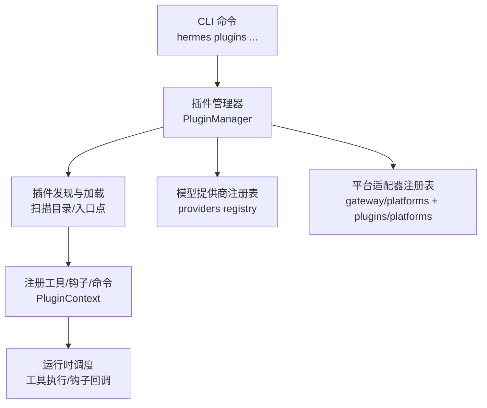
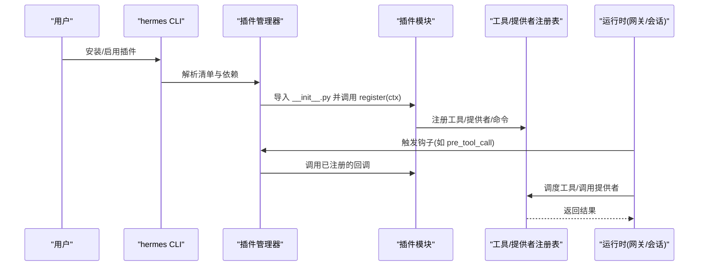
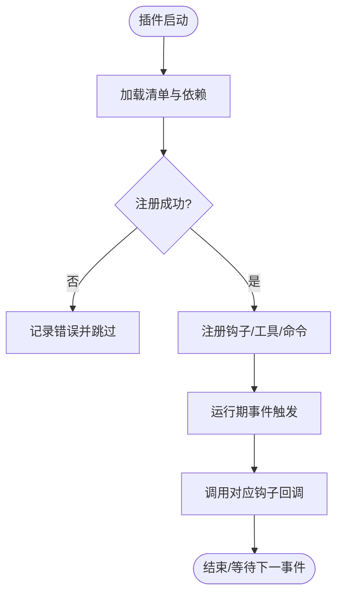
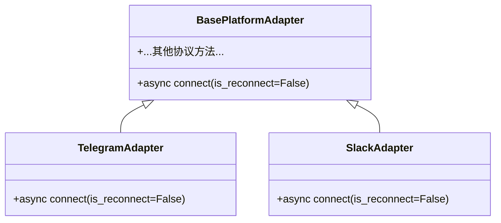
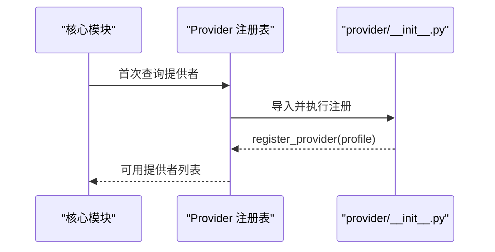
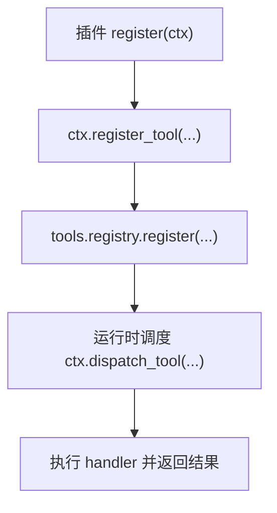
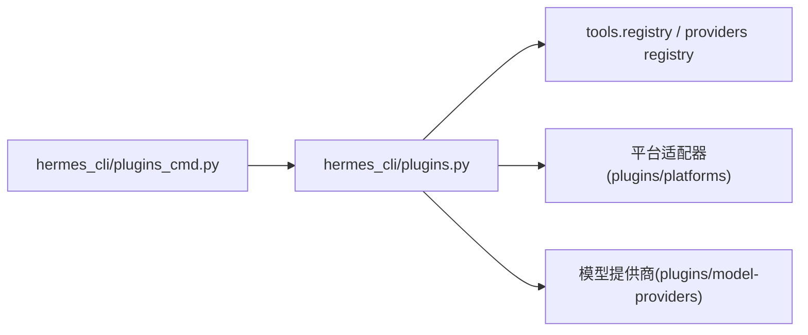

# 插件开发

<cite>
**本文引用的文件**
- [hermes_cli/plugins.py](file://hermes_cli/plugins.py)
- [hermes_cli/plugins_cmd.py](file://hermes_cli/plugins_cmd.py)
- [plugins/plugin_utils.py](file://plugins/plugin_utils.py)
- [plugins/model-providers/README.md](file://plugins/model-providers/README.md)
- [tests/gateway/test_adapter_connect_is_reconnect_contract.py](file://tests/gateway/test_adapter_connect_is_reconnect_contract.py)
</cite>

## 目录
1. [简介](#简介)
2. [项目结构](#项目结构)
3. [核心组件](#核心组件)
4. [架构总览](#架构总览)
5. [详细组件分析](#详细组件分析)
6. [依赖关系分析](#依赖关系分析)
7. [性能与并发注意事项](#性能与并发注意事项)
8. [故障排查指南](#故障排查指南)
9. [结论](#结论)
10. [附录：开发与发布清单](#附录开发与发布清单)

## 简介
本指南面向希望扩展 Hermes Agent 能力的开发者，系统讲解插件架构、扩展点与钩子机制、平台适配器、模型提供商、工具扩展与技能开发的实现方法；覆盖插件生命周期管理、依赖解析与版本兼容性；提供从简单工具插件到复杂多平台适配器的完整示例路径；并给出测试、调试、部署与发布的最佳实践，帮助构建完整的插件技术栈与工具链。

## 项目结构
Hermes 的插件体系由 CLI 层发现与加载、运行时注册与调度、以及多种可插拔能力（工具、平台、模型提供商等）组成。关键目录与职责如下：
- hermes_cli/plugins.py：插件发现、加载、注册、钩子分发、上下文对象 PluginContext 暴露给插件使用。
- hermes_cli/plugins_cmd.py：插件安装、更新、移除、启用/禁用、环境变量引导、after-install 提示等 CLI 命令。
- plugins/*：内置插件集合（如 model-providers、platforms、image_gen、memory 等）。
- tests/*：针对插件与适配器的契约与行为测试（例如平台适配器 connect 签名约束）。

图表来源
- [hermes_cli/plugins.py:1-800](file://hermes_cli/plugins.py#L1-L800)
- [hermes_cli/plugins_cmd.py:1-800](file://hermes_cli/plugins_cmd.py#L1-L800)
- [plugins/model-providers/README.md:1-71](file://plugins/model-providers/README.md#L1-L71)

章节来源
- [hermes_cli/plugins.py:1-800](file://hermes_cli/plugins.py#L1-L800)
- [hermes_cli/plugins_cmd.py:1-800](file://hermes_cli/plugins_cmd.py#L1-L800)
- [plugins/model-providers/README.md:1-71](file://plugins/model-providers/README.md#L1-L71)

## 核心组件
- 插件清单与类型
  - 清单：每个插件需包含 plugin.yaml（或兼容格式），声明 name、kind、version、description、requires_env、provides_tools/provides_hooks 等。
  - 类型：standalone、backend、exclusive、platform、model-provider，决定加载策略与启用方式。
- 插件上下文 PluginContext
  - 提供给插件的 API：注册工具、注册 CLI/slash 命令、注入消息、注册上下文引擎、图像/视频生成提供者、Web 搜索/提取提供者、仪表盘认证提供者等。
  - 安全门控：覆盖内置工具需要显式配置授权；LLM 访问通过受控门面进行。
- 钩子系统
  - 支持 pre/post 工具调用、终端输出转换、工具结果转换、LLM 输出/请求前后处理、会话生命周期、网关前置分发、审批生命周期、看板任务状态变更、子代理生命周期等。
- 插件发现与加载
  - 来源：内置插件、用户插件（~/.hermes/plugins）、项目插件（./.hermes/plugins，可选）、pip 入口点。
  - 优先级：后发现的同名插件覆盖前者；支持启用/禁用白名单与黑名单。
- 插件 CLI
  - 安装/更新/移除/启用/禁用；支持 Git URL、owner/repo 简写、子目录、after-install 文档渲染、环境变量引导保存。

章节来源
- [hermes_cli/plugins.py:136-219](file://hermes_cli/plugins.py#L136-L219)
- [hermes_cli/plugins.py:307-362](file://hermes_cli/plugins.py#L307-L362)
- [hermes_cli/plugins.py:368-800](file://hermes_cli/plugins.py#L368-L800)
- [hermes_cli/plugins_cmd.py:70-138](file://hermes_cli/plugins_cmd.py#L70-L138)
- [hermes_cli/plugins_cmd.py:264-403](file://hermes_cli/plugins_cmd.py#L264-L403)
- [hermes_cli/plugins_cmd.py:584-730](file://hermes_cli/plugins_cmd.py#L584-L730)

## 架构总览
下图展示插件在运行时的主要交互：CLI 安装/启停 → 插件管理器扫描与加载 → 插件通过 PluginContext 注册能力 → 运行时按事件触发钩子与工具调度。

图表来源
- [hermes_cli/plugins.py:1-800](file://hermes_cli/plugins.py#L1-L800)
- [hermes_cli/plugins_cmd.py:1-800](file://hermes_cli/plugins_cmd.py#L1-L800)

## 详细组件分析

### 插件生命周期与钩子
- 生命周期阶段
  - 发现与校验：读取清单、检查 manifest_version、解析 requires_env。
  - 加载与注册：导入模块，调用 register(ctx)，完成工具/命令/提供者注册。
  - 运行期：根据事件触发钩子，执行工具与提供者逻辑。
  - 卸载/重启：清理资源（由宿主负责），下次启动重新加载。
- 钩子分类
  - 工具与 LLM：pre_tool_call、post_tool_call、transform_terminal_output、transform_tool_result、transform_llm_output、pre_llm_call、post_llm_call。
  - 会话与子代理：on_session_start/end/finalize/reset、subagent_start/stop。
  - 网关与审批：pre_gateway_dispatch、pre_approval_request、post_approval_response。
  - 业务域：kanban_task_claimed/completed/blocked、on_skill_lifecycle。
- 安全与可控性
  - 覆盖内置工具需显式授权；LLM 访问通过受限门面；钩子返回值有明确约定，避免破坏主流程。

图表来源
- [hermes_cli/plugins.py:136-219](file://hermes_cli/plugins.py#L136-L219)
- [hermes_cli/plugins.py:368-800](file://hermes_cli/plugins.py#L368-L800)

章节来源
- [hermes_cli/plugins.py:136-219](file://hermes_cli/plugins.py#L136-L219)
- [hermes_cli/plugins.py:368-800](file://hermes_cli/plugins.py#L368-L800)

### 平台适配器（Platform Adapter）
- 位置与发现
  - 内置平台位于 gateway/platforms，插件化平台位于 plugins/platforms。
  - 适配器类通常以 *Adapter 命名，并提供异步 connect() 等方法。
- 契约要求
  - connect() 必须接受 is_reconnect 关键字参数，否则网关重连时会失败并导致平台静默断开。
  - 测试通过静态 AST 扫描所有适配器文件，确保签名合规。
- 开发要点
  - 遵循 BasePlatformAdapter 接口约定；正确处理连接、心跳、断线重连；保证幂等与健壮性。

图表来源
- [tests/gateway/test_adapter_connect_is_reconnect_contract.py:1-145](file://tests/gateway/test_adapter_connect_is_reconnect_contract.py#L1-L145)

章节来源
- [tests/gateway/test_adapter_connect_is_reconnect_contract.py:1-145](file://tests/gateway/test_adapter_connect_is_reconnect_contract.py#L1-L145)

### 模型提供商（Model Provider）
- 目录结构与注册
  - 每个 provider 为独立子目录，__init__.py 中定义 ProviderProfile 并调用 register_provider(profile)。
  - 首次调用 get_provider_profile/list_providers 时扫描目录并自动注册。
- 新增步骤
  - 创建 __init__.py 定义 profile（name、aliases、display_name、env_vars、base_url 等）。
  - 创建 plugin.yaml 声明 name、kind=model-provider、version、description、author。
  - 无需修改其他核心模块，auth/config/models/runtime 等会自动装配。
- 高级用法
  - 可通过继承 ProviderProfile 重写特定钩子（如 build_extra_body、thinking_config 翻译）。

图表来源
- [plugins/model-providers/README.md:1-71](file://plugins/model-providers/README.md#L1-L71)

章节来源
- [plugins/model-providers/README.md:1-71](file://plugins/model-providers/README.md#L1-L71)

### 工具扩展（Tool Extension）
- 注册方式
  - 通过 PluginContext.register_tool(name, toolset, schema, handler, ...) 将自定义工具加入全局注册表。
  - 支持异步处理器、环境依赖声明、描述与图标、是否允许覆盖内置工具等。
- 安全门控
  - 覆盖内置工具需显式授权（plugins.entries.<plugin_id>.allow_tool_override=true），防止恶意替换敏感工具。
- 调用方式
  - 插件内可使用 ctx.dispatch_tool(tool_name, args, **kwargs) 通过注册表调度工具，自动注入父代理上下文（若可用）。

图表来源
- [hermes_cli/plugins.py:439-490](file://hermes_cli/plugins.py#L439-L490)
- [hermes_cli/plugins.py:633-660](file://hermes_cli/plugins.py#L633-L660)

章节来源
- [hermes_cli/plugins.py:439-490](file://hermes_cli/plugins.py#L439-L490)
- [hermes_cli/plugins.py:633-660](file://hermes_cli/plugins.py#L633-L660)

### 技能（Skill）与上下文引擎
- 技能
  - 通过 on_skill_lifecycle 钩子感知技能的启动/停止等生命周期事件，便于统计与审计。
- 上下文引擎
  - 插件可注册自定义 ContextEngine 替代内置压缩器，但仅允许一个上下文引擎插件生效。

章节来源
- [hermes_cli/plugins.py:662-688](file://hermes_cli/plugins.py#L662-L688)
- [hermes_cli/plugins.py:136-219](file://hermes_cli/plugins.py#L136-L219)

### 依赖解析与版本兼容性
- 清单版本
  - 安装器维护 _SUPPORTED_MANIFEST_VERSION，插件可声明 manifest_version；超出支持范围会拒绝安装并提示升级。
- 环境变量依赖
  - requires_env 支持字符串或结构化条目；安装时检测缺失项并交互式保存到 .env。
- 启用/禁用控制
  - 通过 config.yaml 的 plugins.enabled/disabled 精确控制加载；用户/项目插件可覆盖内置同名插件。

章节来源
- [hermes_cli/plugins_cmd.py:70-73](file://hermes_cli/plugins_cmd.py#L70-L73)
- [hermes_cli/plugins_cmd.py:312-403](file://hermes_cli/plugins_cmd.py#L312-L403)
- [hermes_cli/plugins_cmd.py:540-556](file://hermes_cli/plugins_cmd.py#L540-L556)
- [hermes_cli/plugins.py:231-274](file://hermes_cli/plugins.py#L231-L274)

## 依赖关系分析
- 组件耦合
  - 插件管理器与 CLI 命令强耦合（安装/更新/启用/禁用）。
  - 插件通过 PluginContext 与注册表弱耦合，降低对核心实现的直接依赖。
  - 平台适配器与网关重连机制通过严格契约解耦。
- 外部依赖
  - Git 用于插件仓库拉取；YAML/JSON 用于清单解析；可选第三方 SDK 由各适配器/提供商按需引入。
- 循环依赖规避
  - 延迟导入（如 tools.registry、agent.context_engine）避免启动时循环依赖。

图表来源
- [hermes_cli/plugins_cmd.py:1-800](file://hermes_cli/plugins_cmd.py#L1-L800)
- [hermes_cli/plugins.py:1-800](file://hermes_cli/plugins.py#L1-L800)
- [plugins/model-providers/README.md:1-71](file://plugins/model-providers/README.md#L1-L71)

章节来源
- [hermes_cli/plugins_cmd.py:1-800](file://hermes_cli/plugins_cmd.py#L1-L800)
- [hermes_cli/plugins.py:1-800](file://hermes_cli/plugins.py#L1-L800)

## 性能与并发注意事项
- 单例与懒初始化
  - 使用插件共享工具 lazy_singleton 与 SingletonSlot，避免多线程下的竞态条件与资源泄漏。
- 钩子与 I/O
  - 钩子回调应避免阻塞主循环；长耗时操作应后台化或限流。
- 资源释放
  - 适配器与提供商应在会话结束或插件卸载时正确关闭连接与句柄。

章节来源
- [plugins/plugin_utils.py:1-136](file://plugins/plugin_utils.py#L1-L136)

## 故障排查指南
- 插件未加载
  - 检查是否在 enabled 白名单或未被 disabled 黑名单屏蔽；查看清单名称与 key 匹配。
  - 设置 HERMES_PLUGINS_DEBUG=1 获取详细发现日志。
- 工具未出现
  - 确认 register_tool 调用成功且未因覆盖保护被拒绝；检查 toolset 与 schema 合法性。
- 平台适配器断连
  - 确保 connect() 签名包含 is_reconnect；参考契约测试修复。
- 环境变量缺失
  - 使用安装流程中的交互式提示补齐 requires_env 变量；或手动写入 .env。
- 版本不兼容
  - 若 manifest_version 过高，升级 Hermes 后再安装；或调整插件清单版本。

章节来源
- [hermes_cli/plugins.py:83-130](file://hermes_cli/plugins.py#L83-L130)
- [hermes_cli/plugins.py:496-520](file://hermes_cli/plugins.py#L496-L520)
- [tests/gateway/test_adapter_connect_is_reconnect_contract.py:1-145](file://tests/gateway/test_adapter_connect_is_reconnect_contract.py#L1-L145)
- [hermes_cli/plugins_cmd.py:312-403](file://hermes_cli/plugins_cmd.py#L312-L403)
- [hermes_cli/plugins_cmd.py:540-556](file://hermes_cli/plugins_cmd.py#L540-L556)

## 结论
Hermes 插件体系通过清晰的清单、安全的上下文 API、丰富的钩子与注册表机制，提供了可扩展的工具、平台与模型能力。开发者可基于统一的生命周期与依赖管理，快速实现从简单工具到复杂多平台适配器的扩展，并通过严格的契约与测试保障稳定性。结合 CLI 的安装与发布流程，形成完整的插件生态。

## 附录：开发与发布清单
- 最小插件结构
  - plugin.yaml：声明 name、kind、version、description、requires_env、provides_tools/provides_hooks。
  - __init__.py：实现 register(ctx)，调用 ctx 提供的注册 API。
- 工具插件示例路径
  - 参考 PluginContext.register_tool 与 ctx.dispatch_tool 的使用方式。
- 平台适配器示例路径
  - 参考适配器契约与测试，确保 connect(is_reconnect=False) 签名一致。
- 模型提供商示例路径
  - 参考 README 中的 ProviderProfile 注册流程与 plugin.yaml 模板。
- 测试与调试
  - 使用 pytest 编写单元测试；利用 HERMES_PLUGINS_DEBUG 输出详细日志；对适配器进行静态签名检查。
- 部署与发布
  - 使用 hermes plugins install/update/remove/enable/disable 管理；提交至 Git 仓库供他人安装；遵循清单版本与依赖声明。

章节来源
- [hermes_cli/plugins.py:368-800](file://hermes_cli/plugins.py#L368-L800)
- [hermes_cli/plugins_cmd.py:584-730](file://hermes_cli/plugins_cmd.py#L584-L730)
- [plugins/model-providers/README.md:1-71](file://plugins/model-providers/README.md#L1-L71)
- [tests/gateway/test_adapter_connect_is_reconnect_contract.py:1-145](file://tests/gateway/test_adapter_connect_is_reconnect_contract.py#L1-L145)