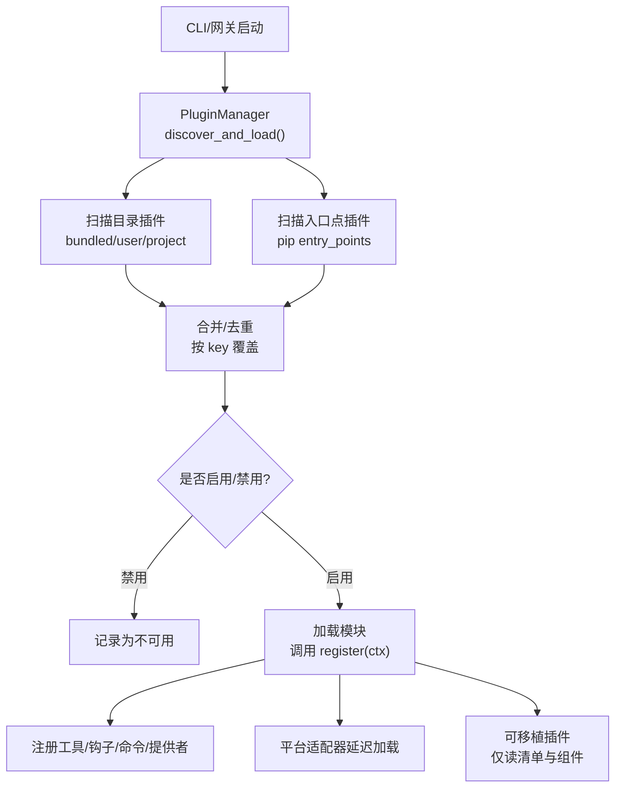
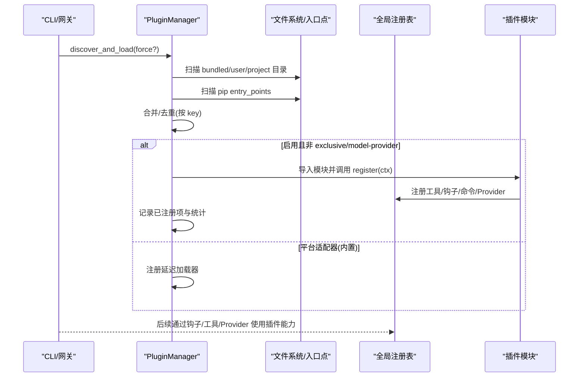
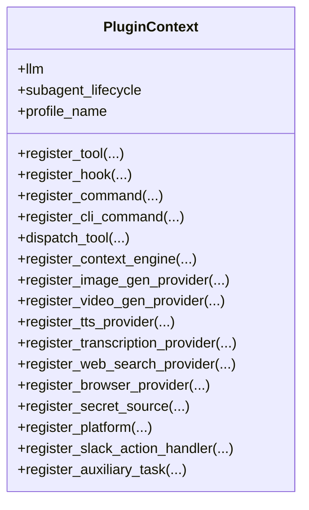
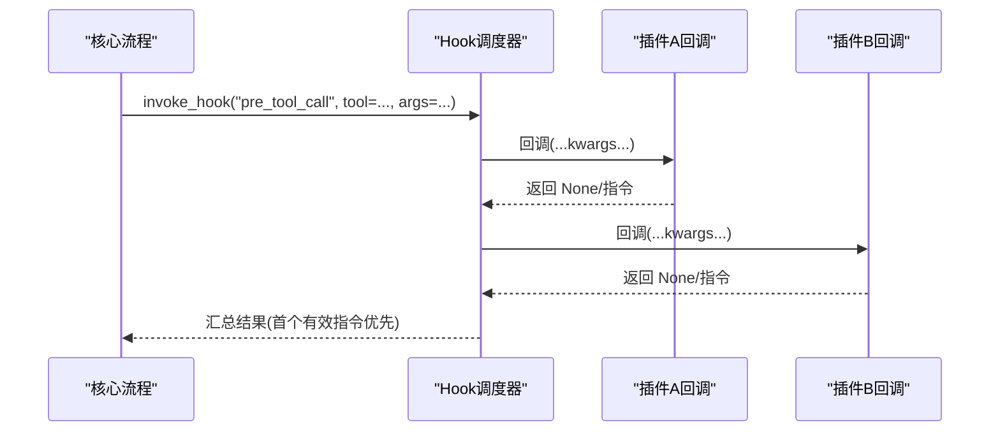
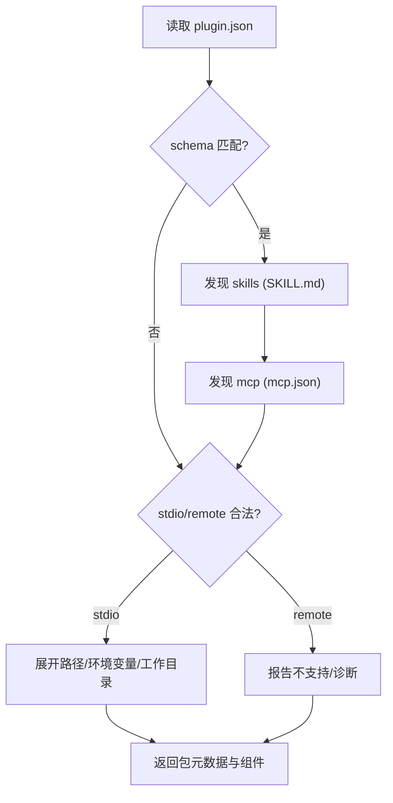
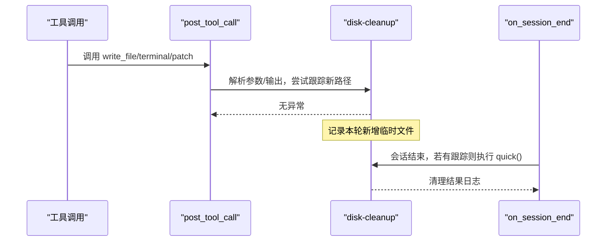
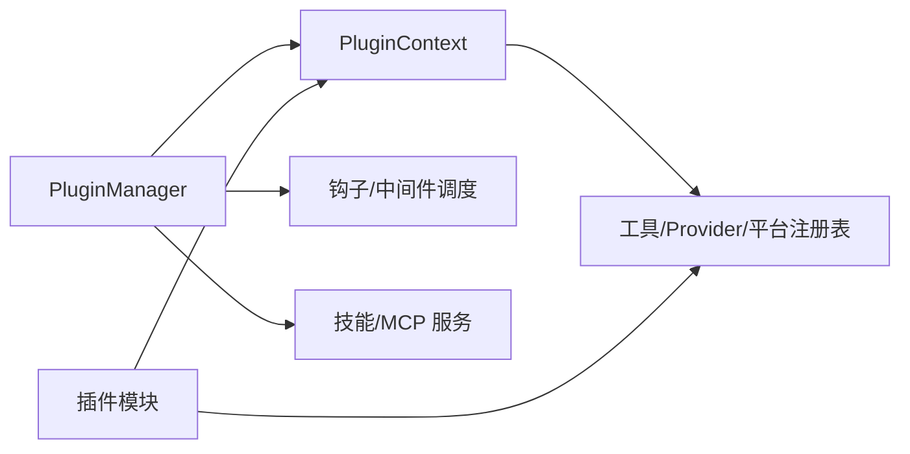

# 插件架构设计

<cite>
**本文引用的文件**
- [hermes_cli/plugins.py](file://hermes_cli/plugins.py)
- [hermes_cli/agent_plugins.py](file://hermes_cli/agent_plugins.py)
- [plugins/plugin_utils.py](file://plugins/plugin_utils.py)
- [plugins/disk-cleanup/__init__.py](file://plugins/disk-cleanup/__init__.py)
</cite>

## 目录
1. [简介](#简介)
2. [项目结构](#项目结构)
3. [核心组件](#核心组件)
4. [架构总览](#架构总览)
5. [详细组件分析](#详细组件分析)
6. [依赖关系分析](#依赖关系分析)
7. [性能考量](#性能考量)
8. [故障排查指南](#故障排查指南)
9. [结论](#结论)
10. [附录](#附录)

## 简介
本文件系统性阐述 Hermes Agent 的插件架构，覆盖设计理念、生命周期管理、依赖解析、版本与兼容性处理、插件发现机制、接口规范、钩子与扩展点、注册表、动态加载、隔离策略与安全沙箱，以及开发最佳实践。文档通过类图、时序图与流程图等可视化方式，帮助开发者理解插件系统内部工作原理并高效扩展能力。

## 项目结构
Hermes 插件系统围绕以下关键位置组织：
- 插件管理器与发现逻辑：hermes_cli/plugins.py
- 可移植插件（Agent Plugins v1）清单与组件校验：hermes_cli/agent_plugins.py
- 插件并发安全工具：plugins/plugin_utils.py
- 示例插件实现（演示钩子、斜杠命令等）：plugins/disk-cleanup/__init__.py



图表来源
- [hermes_cli/plugins.py:1341-1494](file://hermes_cli/plugins.py#L1341-L1494)
- [hermes_cli/plugins.py:1496-1545](file://hermes_cli/plugins.py#L1496-L1545)
- [hermes_cli/plugins.py:1813-1837](file://hermes_cli/plugins.py#L1813-L1837)
- [hermes_cli/plugins.py:1862-1901](file://hermes_cli/plugins.py#L1862-L1901)
- [hermes_cli/plugins.py:1903-1989](file://hermes_cli/plugins.py#L1903-L1989)

章节来源
- [hermes_cli/plugins.py:1341-1494](file://hermes_cli/plugins.py#L1341-L1494)
- [hermes_cli/plugins.py:1496-1545](file://hermes_cli/plugins.py#L1496-L1545)
- [hermes_cli/plugins.py:1813-1837](file://hermes_cli/plugins.py#L1813-L1837)
- [hermes_cli/plugins.py:1862-1901](file://hermes_cli/plugins.py#L1862-L1901)
- [hermes_cli/plugins.py:1903-1989](file://hermes_cli/plugins.py#L1903-L1989)

## 核心组件
- 插件清单与运行时状态
  - PluginManifest：描述插件元数据、来源、类型、键名、便携标记等
  - LoadedPlugin：记录已加载插件的模块、已注册的工具/钩子/中间件/命令、启用状态与错误信息
- 插件上下文与注册表
  - PluginContext：暴露给插件的注册 API（工具、钩子、命令、各类 Provider、平台适配器等）
  - PluginManager：集中式发现、加载、钩子/中间件调度、技能与 MCP 服务聚合
- 可移植插件支持
  - agent_plugins：对 v1 格式进行只读验证与组件翻译（技能、MCP），不导入 Python 代码

章节来源
- [hermes_cli/plugins.py:307-362](file://hermes_cli/plugins.py#L307-L362)
- [hermes_cli/plugins.py:368-1303](file://hermes_cli/plugins.py#L368-L1303)
- [hermes_cli/plugins.py:1309-1335](file://hermes_cli/plugins.py#L1309-L1335)
- [hermes_cli/agent_plugins.py:47-77](file://hermes_cli/agent_plugins.py#L47-L77)

## 架构总览
下图展示从启动到插件可用、再到运行时调用的整体流程。



图表来源
- [hermes_cli/plugins.py:1341-1494](file://hermes_cli/plugins.py#L1341-L1494)
- [hermes_cli/plugins.py:1862-1901](file://hermes_cli/plugins.py#L1862-L1901)
- [hermes_cli/plugins.py:1903-1989](file://hermes_cli/plugins.py#L1903-L1989)

## 详细组件分析

### 插件管理器与生命周期
- 发现阶段
  - 收集目录清单（bundled/user/project），再收集入口点清单
  - 按 key 合并与去重，应用禁用/启用白名单
  - 特殊类型跳过：exclusive 与 model-provider 由各自子系统负责
- 加载阶段
  - 普通插件：导入模块并调用 register(ctx)，记录新增项
  - 平台适配器：注册延迟加载器，首次使用时才导入
  - 可移植插件：仅读取清单与组件，不导入 Python 代码
- 钩子与中间件
  - 提供大量生命周期钩子（如 pre_tool_call、post_tool_call、on_session_* 等）
  - 中间件用于横切关注点（如审计、遥测）
- 安全与信任门控
  - 工具覆盖需显式授权（allow_tool_override）
  - 可配置启用/禁用列表，默认 opt-in

```mermaid
flowchart TD
Start(["开始"]) --> Scan["扫描插件源"]
Scan --> Merge["合并/去重(按key)"]
Merge --> Policy{"启用/禁用策略"}
Policy --> |禁用| Skip["记录为不可用"]
Policy --> |启用| Load{"插件类型"}
Load --> |普通| Import["导入并调用 register(ctx)"]
Load --> |平台(内置)| Defer["注册延迟加载器"]
Load --> |exclusive/model-provider| Bypass["交由子系统处理"]
Import --> Track["记录新增工具/钩子/命令"]
Defer --> Use["首次使用时导入"]
Bypass --> End(["结束"])
Track --> End
Skip --> End
Use --> End
```

图表来源
- [hermes_cli/plugins.py:1341-1494](file://hermes_cli/plugins.py#L1341-L1494)
- [hermes_cli/plugins.py:1862-1901](file://hermes_cli/plugins.py#L1862-L1901)
- [hermes_cli/plugins.py:1903-1989](file://hermes_cli/plugins.py#L1903-L1989)

章节来源
- [hermes_cli/plugins.py:1341-1494](file://hermes_cli/plugins.py#L1341-L1494)
- [hermes_cli/plugins.py:1862-1901](file://hermes_cli/plugins.py#L1862-L1901)
- [hermes_cli/plugins.py:1903-1989](file://hermes_cli/plugins.py#L1903-L1989)

### 插件上下文与扩展点
- 工具注册：register_tool(name, toolset, schema, handler, ...)
  - 支持覆盖内置工具但需显式授权
  - 自动追踪归属，便于“hermes plugins list”统计
- 钩子注册：register_hook(hook_name, callback)
  - 支持 pre/post 工具调用、LLM 调用前后、会话生命周期、网关前置分发、审批流、看板任务等
- 命令注册：register_command（会话内斜杠命令）、register_cli_command（CLI 子命令）
- Provider 注册：图像生成、视频生成、TTS、STT、Web 搜索/抓取、浏览器云后端、密钥源、平台适配器等
- 辅助任务：register_auxiliary_task 声明 LLM 驱动的辅助任务，统一路由与配置注入
- 上下文引擎与技能：可替换压缩引擎；注册技能供系统发现



图表来源
- [hermes_cli/plugins.py:368-1303](file://hermes_cli/plugins.py#L368-L1303)

章节来源
- [hermes_cli/plugins.py:368-1303](file://hermes_cli/plugins.py#L368-L1303)

### 钩子机制与数据流
- 钩子集合：VALID_HOOKS 定义了所有支持的钩子名称
- 调用路径：通过 invoke_hook/hook 调度器在合适时机触发
- 典型用例：
  - pre_tool_call：拦截/批准/阻断工具调用
  - post_tool_call：观察结果、自动跟踪临时文件
  - on_session_end：会话结束时执行清理或上报
  - pre_gateway_dispatch：消息进入网关前的重写/丢弃



图表来源
- [hermes_cli/plugins.py:136-219](file://hermes_cli/plugins.py#L136-L219)
- [hermes_cli/plugins.py:2293-2298](file://hermes_cli/plugins.py#L2293-L2298)

章节来源
- [hermes_cli/plugins.py:136-219](file://hermes_cli/plugins.py#L136-L219)
- [hermes_cli/plugins.py:2293-2298](file://hermes_cli/plugins.py#L2293-L2298)

### 可移植插件（Agent Plugins v1）
- 只读验证：plugin.json 必须声明受支持的 schema，字段严格校验
- 组件发现：
  - skills：每个子目录含 SKILL.md，前缀 YAML 校验
  - mcp：mcp.json 定义 stdio/远程服务器（当前仅支持 stdio）
- 路径与占位符：支持 ${PLUGIN_ROOT}/${PLUGIN_DATA} 展开，限制相对路径范围
- 安全边界：不导入 Python 代码，避免副作用；仅做清单与组件翻译



图表来源
- [hermes_cli/agent_plugins.py:97-155](file://hermes_cli/agent_plugins.py#L97-L155)
- [hermes_cli/agent_plugins.py:192-252](file://hermes_cli/agent_plugins.py#L192-L252)
- [hermes_cli/agent_plugins.py:255-365](file://hermes_cli/agent_plugins.py#L255-L365)
- [hermes_cli/agent_plugins.py:368-448](file://hermes_cli/agent_plugins.py#L368-L448)
- [hermes_cli/agent_plugins.py:451-485](file://hermes_cli/agent_plugins.py#L451-L485)

章节来源
- [hermes_cli/agent_plugins.py:97-155](file://hermes_cli/agent_plugins.py#L97-L155)
- [hermes_cli/agent_plugins.py:192-252](file://hermes_cli/agent_plugins.py#L192-L252)
- [hermes_cli/agent_plugins.py:255-365](file://hermes_cli/agent_plugins.py#L255-L365)
- [hermes_cli/agent_plugins.py:368-448](file://hermes_cli/agent_plugins.py#L368-L448)
- [hermes_cli/agent_plugins.py:451-485](file://hermes_cli/agent_plugins.py#L451-L485)

### 插件示例：disk-cleanup
- 钩子使用：post_tool_call 自动跟踪临时文件；on_session_end 执行快速清理
- 命令提供：/disk-cleanup 提供 status/dry-run/quick/deep/track/forget
- 并发安全：线程锁保护每任务的临时文件集合



图表来源
- [plugins/disk-cleanup/__init__.py:128-189](file://plugins/disk-cleanup/__init__.py#L128-L189)
- [plugins/disk-cleanup/__init__.py:309-317](file://plugins/disk-cleanup/__init__.py#L309-L317)

章节来源
- [plugins/disk-cleanup/__init__.py:128-189](file://plugins/disk-cleanup/__init__.py#L128-L189)
- [plugins/disk-cleanup/__init__.py:309-317](file://plugins/disk-cleanup/__init__.py#L309-L317)

## 依赖关系分析
- 插件与宿主
  - 插件通过 PluginContext 访问宿主能力（LLM、子代理生命周期、注册表等）
  - 宿主通过 PluginManager 维护插件清单、钩子、中间件、技能、MCP 服务
- 外部依赖
  - 平台适配器可能引入重型 SDK，采用延迟加载降低冷启动开销
  - 可移植插件仅依赖 JSON/YAML 解析，不引入第三方运行时
- 耦合与内聚
  - 插件间通过共享注册表交互，避免直接耦合
  - 钩子/中间件解耦业务逻辑，提升内聚性



图表来源
- [hermes_cli/plugins.py:1309-1335](file://hermes_cli/plugins.py#L1309-L1335)
- [hermes_cli/plugins.py:368-1303](file://hermes_cli/plugins.py#L368-L1303)

章节来源
- [hermes_cli/plugins.py:1309-1335](file://hermes_cli/plugins.py#L1309-L1335)
- [hermes_cli/plugins.py:368-1303](file://hermes_cli/plugins.py#L368-L1303)

## 性能考量
- 延迟加载平台适配器：避免冷启动时导入重型 SDK，仅在首次使用时加载
- 只读可移植插件：清单与组件发现不导入 Python 代码，减少启动成本
- 懒构建宿主能力：PluginContext.llm 与 subagent_lifecycle 按需初始化
- 并发安全：提供 lazy_singleton 与 SingletonSlot 防止多线程单例竞态

章节来源
- [hermes_cli/plugins.py:1862-1901](file://hermes_cli/plugins.py#L1862-L1901)
- [hermes_cli/plugins.py:380-413](file://hermes_cli/plugins.py#L380-L413)
- [plugins/plugin_utils.py:43-81](file://plugins/plugin_utils.py#L43-L81)
- [plugins/plugin_utils.py:84-136](file://plugins/plugin_utils.py#L84-L136)

## 故障排查指南
- 插件未生效
  - 检查是否在 plugins.enabled 白名单中，或被 disabled 黑名单屏蔽
  - 查看 LoadedPlugin.error 字段定位失败原因
- 工具覆盖被拒绝
  - 需要设置 allow_tool_override: true 以允许覆盖内置工具
- 钩子未触发
  - 确认插件正确调用 ctx.register_hook 并在 VALID_HOOKS 范围内
- 可移植插件组件无效
  - 检查 plugin.json/mcp.json/SKILL.md 是否符合 schema 与约束
  - 查看 diagnostics 中的具体诊断信息

章节来源
- [hermes_cli/plugins.py:1398-1487](file://hermes_cli/plugins.py#L1398-L1487)
- [hermes_cli/plugins.py:452-520](file://hermes_cli/plugins.py#L452-L520)
- [hermes_cli/agent_plugins.py:97-155](file://hermes_cli/agent_plugins.py#L97-L155)
- [hermes_cli/agent_plugins.py:368-448](file://hermes_cli/agent_plugins.py#L368-L448)

## 结论
Hermes 插件系统通过清晰的发现-加载-注册流程、丰富的钩子与 Provider 扩展点、严格的清单校验与信任门控，实现了高内聚、低耦合的可插拔架构。延迟加载与只读可移植插件显著优化了启动性能与安全性。遵循本文档的设计与最佳实践，开发者可以安全、高效地扩展 Hermes Agent 的能力。

## 附录

### 插件开发最佳实践
- 明确插件类型与来源：standalone/backend/exclusive/platform/model-provider
- 使用 ctx.register_* 系列 API 注册能力，避免直接操作底层注册表
- 谨慎使用工具覆盖，确保获得 operator 显式授权
- 利用钩子实现横切关注点（审计、合规、清理），保持幂等与健壮
- 可移植插件优先：仅声明清单与资源，不引入 Python 代码
- 并发安全：使用 lazy_singleton/SingletonSlot 管理昂贵对象
- 调试：开启 HERMES_PLUGINS_DEBUG 获取详细发现日志

章节来源
- [hermes_cli/plugins.py:136-219](file://hermes_cli/plugins.py#L136-L219)
- [hermes_cli/plugins.py:452-520](file://hermes_cli/plugins.py#L452-L520)
- [hermes_cli/plugins.py:1862-1901](file://hermes_cli/plugins.py#L1862-L1901)
- [plugins/plugin_utils.py:43-81](file://plugins/plugin_utils.py#L43-L81)
- [plugins/plugin_utils.py:84-136](file://plugins/plugin_utils.py#L84-L136)