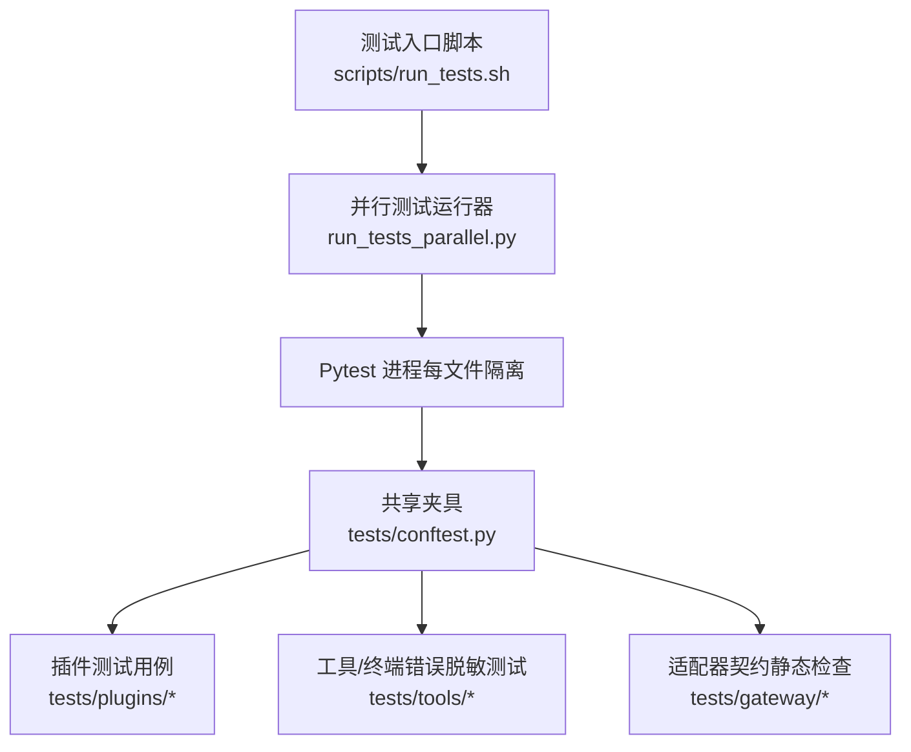
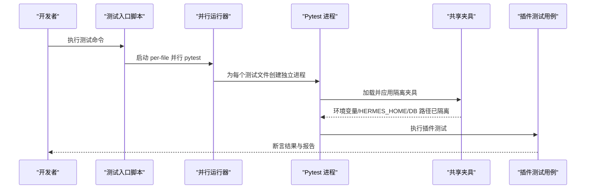
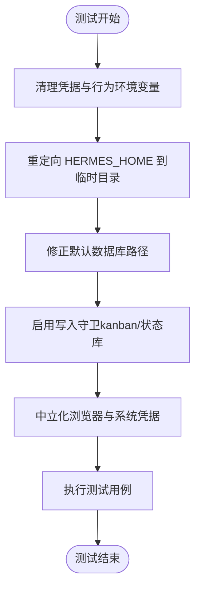
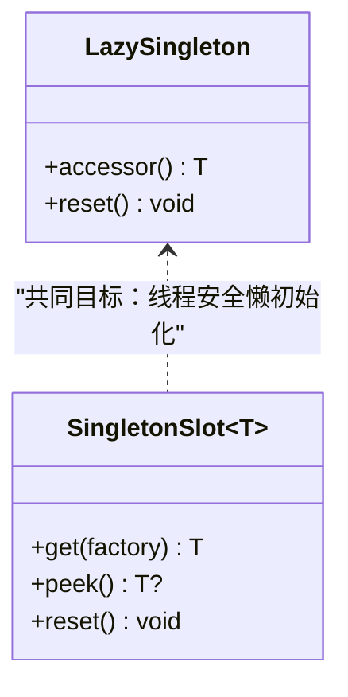
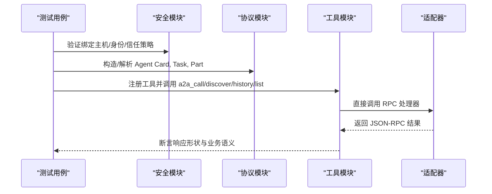
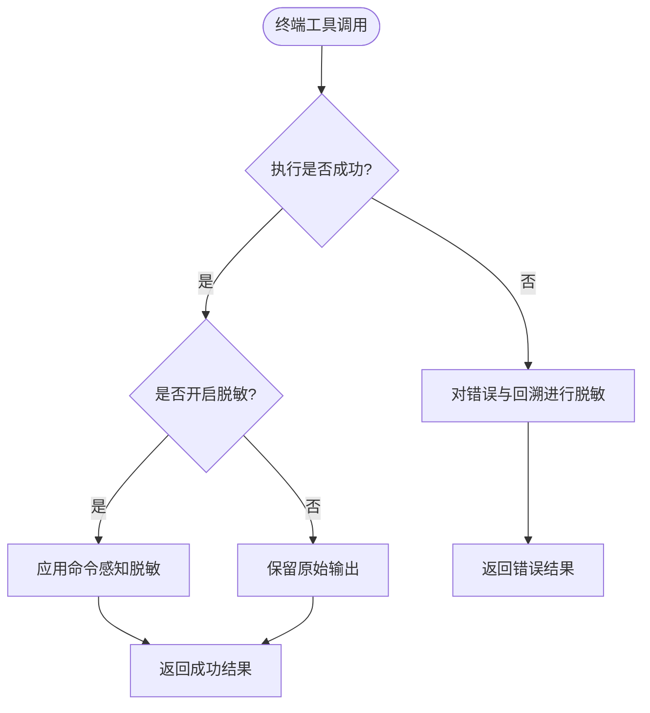
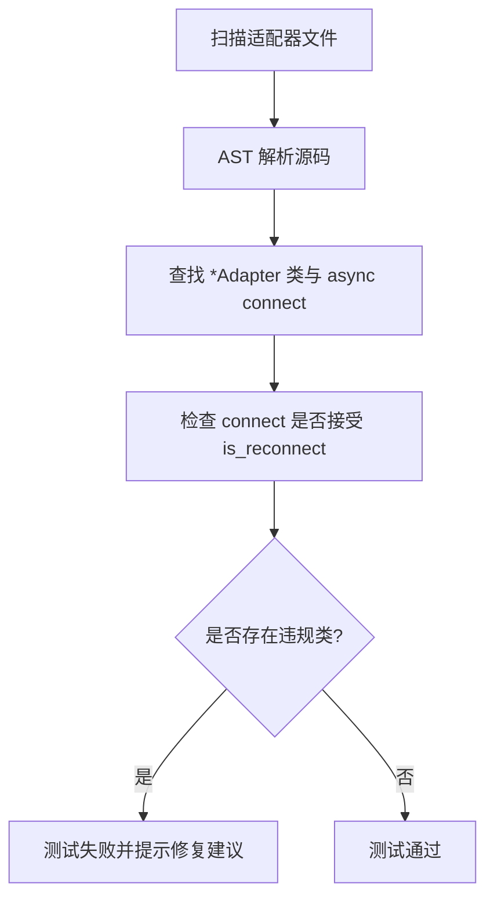
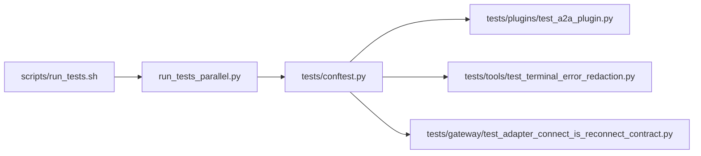

# 插件测试与调试

<cite>
**本文引用的文件**
- [tests/conftest.py](file://tests/conftest.py)
- [scripts/run_tests.sh](file://scripts/run_tests.sh)
- [plugins/plugin_utils.py](file://plugins/plugin_utils.py)
- [tests/plugins/test_a2a_plugin.py](file://tests/plugins/test_a2a_plugin.py)
- [tests/tools/test_terminal_error_redaction.py](file://tests/tools/test_terminal_error_redaction.py)
- [tests/gateway/test_adapter_connect_is_reconnect_contract.py](file://tests/gateway/test_adapter_connect_is_reconnect_contract.py)
</cite>

## 目录
1. [简介](#简介)
2. [项目结构](#项目结构)
3. [核心组件](#核心组件)
4. [架构总览](#架构总览)
5. [详细组件分析](#详细组件分析)
6. [依赖关系分析](#依赖关系分析)
7. [性能考量](#性能考量)
8. [故障排查指南](#故障排查指南)
9. [结论](#结论)
10. [附录](#附录)

## 简介
本指南面向插件开发者，提供在 Hermes Agent 中编写高质量插件的测试与调试完整方法。内容覆盖：
- 单元测试、集成测试、端到端测试的策略与实践
- 测试框架使用、模拟对象与环境搭建
- 插件接口测试、异常处理与性能测试示例
- 调试工具、日志分析与性能分析技术
- 常见问题诊断方法与解决方案

目标是帮助开发者确保插件的质量与稳定性，并在本地与 CI 环境中获得一致、可重复的结果。

## 项目结构
Hermes Agent 的测试基础设施围绕“隔离、可重复、安全”的原则构建：
- 统一的测试入口脚本负责环境清理、并行执行与确定性设置
- 全局 conftest 提供强隔离的测试环境（环境变量、HERMES_HOME、数据库路径等）
- 插件相关测试位于 tests/plugins 与 tests/tools 等目录，按功能域组织
- 针对平台适配器与协议契约的静态检查类测试，避免引入重型依赖

**图表来源**
- [scripts/run_tests.sh:1-184](file://scripts/run_tests.sh#L1-L184)
- [tests/conftest.py:1-800](file://tests/conftest.py#L1-L800)

**章节来源**
- [scripts/run_tests.sh:1-184](file://scripts/run_tests.sh#L1-L184)
- [tests/conftest.py:1-800](file://tests/conftest.py#L1-L800)

## 核心组件
- 测试环境与隔离
  - 自动清除敏感环境变量，重定向 HERMES_HOME 到临时目录，锁定时区与语言，禁用 AWS IMDS 与懒安装，重置插件单例，防止跨测试污染
  - 对 kanban 与主状态数据库写入进行守卫，拒绝写入真实生产路径
- 插件并发与单例安全
  - 提供线程安全的懒加载单例装饰器与槽位，避免多线程竞争导致的资源泄漏
- 插件接口与协议测试
  - 通过 HTTP 服务器与直接调用适配器 RPC 的方式，验证 A2A 协议的形状、安全策略、持久化与工具注册约定
- 错误与敏感信息保护
  - 终端工具的错误输出与回溯必须脱敏，避免泄露密钥或令牌
- 适配器契约静态检查
  - 通过 AST 扫描所有平台适配器的 connect 签名，确保兼容网关的重连参数

**章节来源**
- [tests/conftest.py:1-800](file://tests/conftest.py#L1-L800)
- [plugins/plugin_utils.py:1-136](file://plugins/plugin_utils.py#L1-L136)
- [tests/plugins/test_a2a_plugin.py:1-800](file://tests/plugins/test_a2a_plugin.py#L1-L800)
- [tests/tools/test_terminal_error_redaction.py:1-154](file://tests/tools/test_terminal_error_redaction.py#L1-L154)
- [tests/gateway/test_adapter_connect_is_reconnect_contract.py:1-145](file://tests/gateway/test_adapter_connect_is_reconnect_contract.py#L1-L145)

## 架构总览
下图展示了从测试入口到具体插件测试的执行流，以及关键隔离点与守卫机制。

**图表来源**
- [scripts/run_tests.sh:102-184](file://scripts/run_tests.sh#L102-L184)
- [tests/conftest.py:429-526](file://tests/conftest.py#L429-L526)

## 详细组件分析

### 测试环境与夹具（conftest）
- 环境变量清洗：自动移除所有疑似凭据的环境变量，阻断本地密钥泄漏到测试断言
- 行为开关清零：HERMES_* 行为变量默认清空，避免不同开发机配置影响测试结果
- 工作目录隔离：将 HERMES_HOME 指向临时目录，确保状态、会话、技能等不污染真实用户数据
- 数据库路径修正：修正 hermes_state 默认 DB 路径至测试目录，避免写入真实 state.db
- 写入守卫：对 kanban 与主状态数据库写入进行拒绝式守卫，防止误写生产路径
- 浏览器与 Keychain 中立化：记录而非打开浏览器；屏蔽 macOS Keychain 读取，避免外部依赖干扰

**图表来源**
- [tests/conftest.py:119-526](file://tests/conftest.py#L119-L526)
- [tests/conftest.py:586-718](file://tests/conftest.py#L586-L718)

**章节来源**
- [tests/conftest.py:119-526](file://tests/conftest.py#L119-L526)
- [tests/conftest.py:586-718](file://tests/conftest.py#L586-L718)

### 插件并发与单例安全（plugin_utils）
- 懒加载单例装饰器：保证零参工厂只被调用一次，即使并发调用也安全；附带 reset 能力用于测试清理
- 带键的单例槽位：当实例构建依赖配置键时，使用 SingletonSlot 缓存首个成功构建的实例，避免重复初始化
- 适用场景：网络客户端、SDK 连接、文件句柄、后台线程等资源密集型对象

**图表来源**
- [plugins/plugin_utils.py:43-81](file://plugins/plugin_utils.py#L43-L81)
- [plugins/plugin_utils.py:84-136](file://plugins/plugin_utils.py#L84-L136)

**章节来源**
- [plugins/plugin_utils.py:1-136](file://plugins/plugin_utils.py#L1-L136)

### 插件接口与协议测试（A2A 插件）
- 安全策略测试：绑定主机选择、对等身份映射、可信对等体白名单、注入过滤与审计日志
- 协议形状测试：Agent Card、Task、Part、角色、错误码、时间戳精度、JSON-RPC 结果与错误
- 持久化测试：消息持久化、对话列表、历史工具调用
- 工具注册与调度：遵循 registry.dispatch 的调用约定，支持别名参数
- 适配器 RPC 处理：直接驱动适配器方法，验证任务查询、取消、分页、推送配置等

**图表来源**
- [tests/plugins/test_a2a_plugin.py:42-177](file://tests/plugins/test_a2a_plugin.py#L42-L177)
- [tests/plugins/test_a2a_plugin.py:214-416](file://tests/plugins/test_a2a_plugin.py#L214-L416)
- [tests/plugins/test_a2a_plugin.py:459-577](file://tests/plugins/test_a2a_plugin.py#L459-L577)
- [tests/plugins/test_a2a_plugin.py:696-800](file://tests/plugins/test_a2a_plugin.py#L696-L800)

**章节来源**
- [tests/plugins/test_a2a_plugin.py:1-800](file://tests/plugins/test_a2a_plugin.py#L1-L800)

### 错误与敏感信息保护（终端工具）
- 错误输出脱敏：前台重试、导入错误、后台启动失败、外层异常等路径均对错误与回溯进行脱敏
- 成功输出保留：允许关闭脱敏以保留原始输出，便于调试；同时保持命令感知的脱敏策略
- 断言方式：通过自定义断言函数确认敏感片段已被替换为掩码

**图表来源**
- [tests/tools/test_terminal_error_redaction.py:47-154](file://tests/tools/test_terminal_error_redaction.py#L47-L154)

**章节来源**
- [tests/tools/test_terminal_error_redaction.py:1-154](file://tests/tools/test_terminal_error_redaction.py#L1-L154)

### 适配器契约静态检查（connect 签名）
- 目的：确保所有平台适配器的 connect 方法接受 is_reconnect 关键字参数，避免网关重连时静默断开
- 方法：通过 AST 解析 gateway/platforms 与 plugins/platforms 下的适配器文件，提取类与方法签名进行检查
- 优势：无需导入第三方 SDK，避免引入可选依赖；在 CI 中稳定执行

**图表来源**
- [tests/gateway/test_adapter_connect_is_reconnect_contract.py:44-103](file://tests/gateway/test_adapter_connect_is_reconnect_contract.py#L44-L103)
- [tests/gateway/test_adapter_connect_is_reconnect_contract.py:109-145](file://tests/gateway/test_adapter_connect_is_reconnect_contract.py#L109-L145)

**章节来源**
- [tests/gateway/test_adapter_connect_is_reconnect_contract.py:1-145](file://tests/gateway/test_adapter_connect_is_reconnect_contract.py#L1-L145)

## 依赖关系分析
- 测试入口脚本依赖并行运行器与 Python 环境探测，确保 pytest 可用
- conftest 为所有测试提供统一隔离，插件测试与工具测试均依赖其夹具
- 插件测试依赖协议与安全模块，并通过 monkeypatch 与临时目录实现无网络、无外部依赖的验证
- 适配器契约检查仅依赖 AST 与 pathlib，避免运行时依赖

**图表来源**
- [scripts/run_tests.sh:102-184](file://scripts/run_tests.sh#L102-L184)
- [tests/conftest.py:429-526](file://tests/conftest.py#L429-L526)

**章节来源**
- [scripts/run_tests.sh:102-184](file://scripts/run_tests.sh#L102-L184)
- [tests/conftest.py:429-526](file://tests/conftest.py#L429-L526)

## 性能考量
- 字节码预编译：测试入口脚本会预先编译 .pyc 缓存，减少多进程首次导入开销
- 并行执行：per-file 隔离的 pytest 进程并行运行，提升整体吞吐
- 懒安装禁用：测试环境禁用按需安装，避免网络阻塞与超时
- 异步与并发：插件中的懒单例与线程锁确保资源初始化高效且安全

[本节提供通用指导，不直接分析具体文件]

## 故障排查指南
- 测试环境不一致
  - 现象：本地与 CI 行为差异
  - 排查：确认使用 scripts/run_tests.sh 启动；检查环境变量是否被清理；确认 HERMES_HOME 指向临时目录
- 插件单例导致的状态泄漏
  - 现象：后续测试受先前测试影响
  - 排查：使用 lazy_singleton.reset() 或 SingletonSlot.reset() 清理；确保测试间无共享可变状态
- 适配器重连失败
  - 现象：平台通道在第一次断线后无法恢复
  - 排查：检查 connect 签名是否包含 is_reconnect；运行适配器契约静态检查测试
- 错误输出泄露敏感信息
  - 现象：日志或结果中包含密钥或令牌
  - 排查：确认错误路径已调用脱敏逻辑；必要时调整 redact 开关或命令感知策略
- 写入真实数据目录
  - 现象：测试意外写入 ~/.hermes
  - 排查：检查写入守卫是否生效；确认 HERMES_HOME 与数据库路径已正确重定向

**章节来源**
- [scripts/run_tests.sh:102-184](file://scripts/run_tests.sh#L102-L184)
- [tests/conftest.py:429-526](file://tests/conftest.py#L429-L526)
- [tests/gateway/test_adapter_connect_is_reconnect_contract.py:109-145](file://tests/gateway/test_adapter_connect_is_reconnect_contract.py#L109-L145)
- [tests/tools/test_terminal_error_redaction.py:47-154](file://tests/tools/test_terminal_error_redaction.py#L47-L154)

## 结论
通过统一的测试入口、强隔离的夹具、插件并发安全原语以及严格的协议与错误处理测试，Hermes Agent 提供了可靠的插件测试与调试基础。开发者应：
- 始终使用脚本入口运行测试，确保环境一致性
- 利用单例安全原语管理插件资源，避免并发问题
- 编写覆盖安全、协议、持久化与工具调用的全面测试
- 关注错误脱敏与写入守卫，防止敏感信息与生产数据泄露
- 借助静态契约检查保障适配器兼容性

## 附录
- 常用测试命令
  - 全量测试：scripts/run_tests.sh
  - 指定目录：scripts/run_tests.sh tests/plugins/
  - 单文件：scripts/run_tests.sh tests/plugins/test_a2a_plugin.py
  - 并行度控制：scripts/run_tests.sh -j 4
- 调试技巧
  - 使用 monkeypatch 替换外部依赖与网络调用
  - 通过临时目录与固定环境变量复现问题
  - 结合适配器契约检查快速定位签名不兼容问题

[本节提供通用指导，不直接分析具体文件]