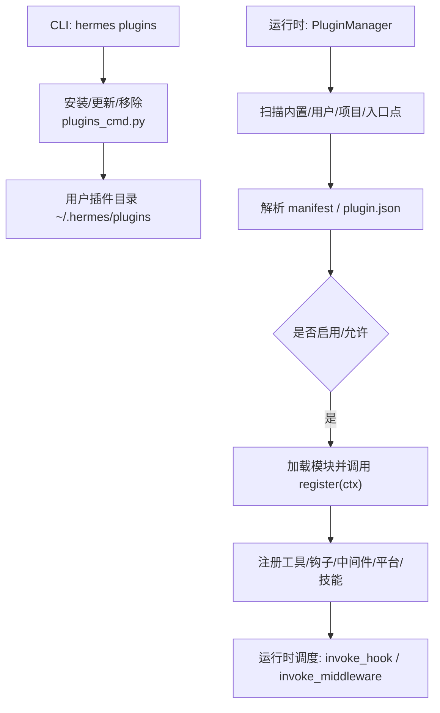
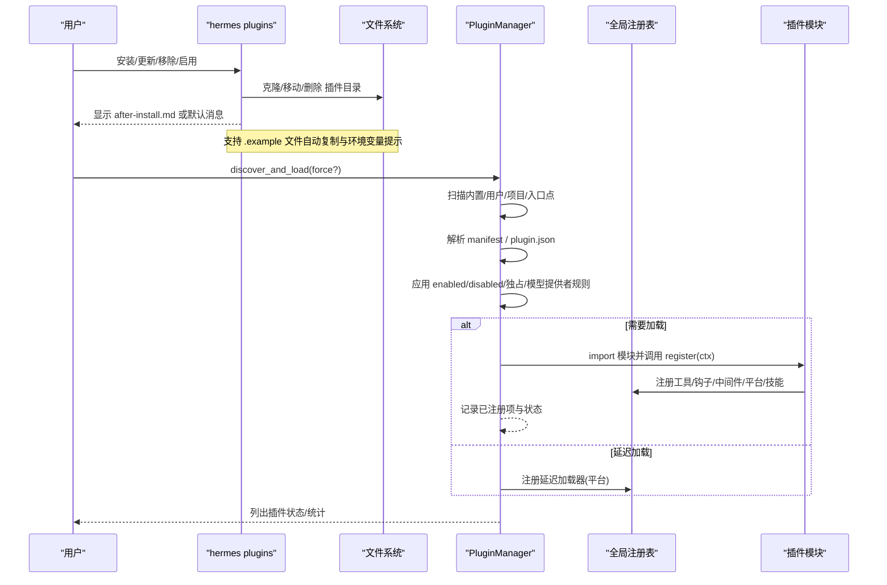
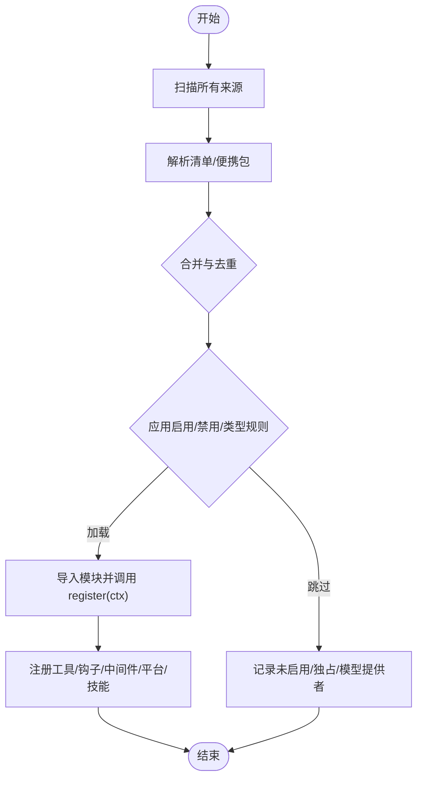
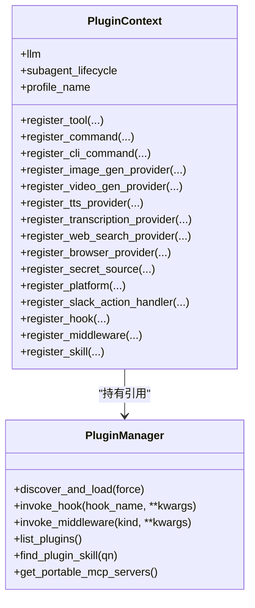
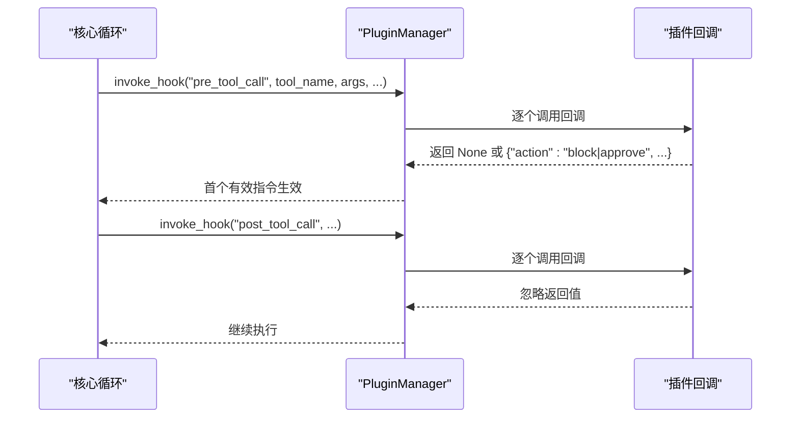
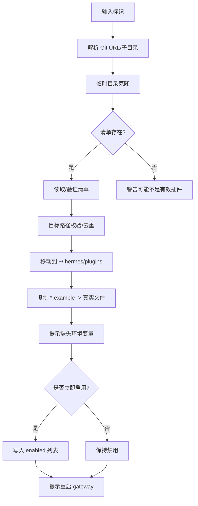
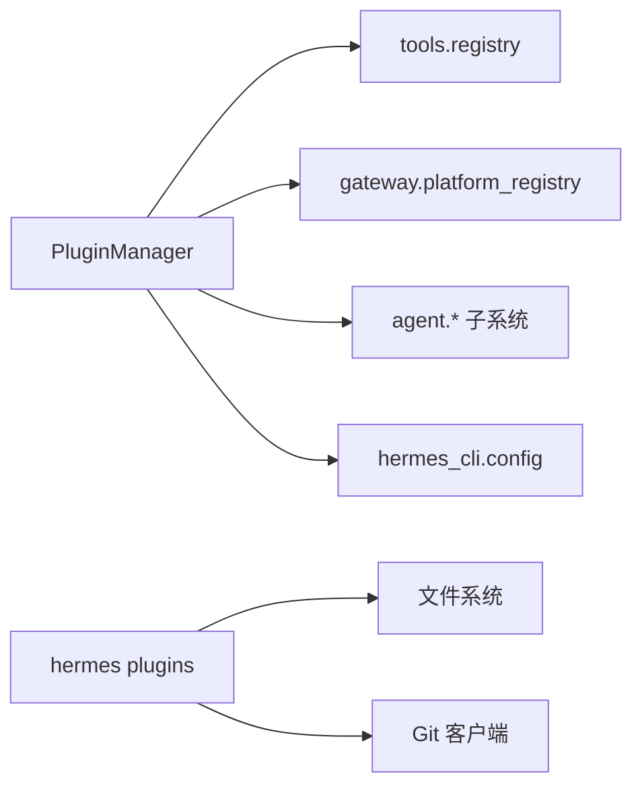

# 插件生命周期管理

<cite>
**本文引用的文件**
- [hermes_cli/plugins.py](file://hermes_cli/plugins.py)
- [hermes_cli/plugins_cmd.py](file://hermes_cli/plugins_cmd.py)
- [plugins/plugin_utils.py](file://plugins/plugin_utils.py)
</cite>

## 目录
1. [简介](#简介)
2. [项目结构](#项目结构)
3. [核心组件](#核心组件)
4. [架构总览](#架构总览)
5. [详细组件分析](#详细组件分析)
6. [依赖关系分析](#依赖关系分析)
7. [性能考量](#性能考量)
8. [故障排查指南](#故障排查指南)
9. [结论](#结论)
10. [附录](#附录)

## 简介
本文件系统性说明 Hermes Agent 的插件生命周期管理，覆盖从安装、发现、加载、初始化、运行到销毁的全过程。重点解释：
- 插件来源与优先级（内置、用户、项目、pip 入口点）
- 依赖解析与版本冲突处理策略
- 热重载与故障恢复机制
- 状态管理与事件通知（钩子/中间件）
- 插件间通信、共享状态与隔离策略
- 调试、性能监控与诊断工具
- 面向开发者的最佳实践与参考

## 项目结构
Hermes 插件系统由 CLI 层与运行时管理器组成：
- 安装与管理命令：通过 hermes plugins 子命令完成安装、更新、移除、启用/禁用等
- 插件发现与加载：PluginManager 统一扫描并加载插件模块，注册工具、钩子、中间件、平台适配器、技能等
- 插件上下文：PluginContext 为插件提供安全的扩展能力（注册工具、命令、提供者、钩子等）
- 并发安全：提供线程安全的单例工具，避免插件内部资源竞争

**图表来源**
- [hermes_cli/plugins_cmd.py:584-667](file://hermes_cli/plugins_cmd.py#L584-L667)
- [hermes_cli/plugins.py:1341-1494](file://hermes_cli/plugins.py#L1341-L1494)
- [hermes_cli/plugins.py:1903-1989](file://hermes_cli/plugins.py#L1903-L1989)

**章节来源**
- [hermes_cli/plugins_cmd.py:584-667](file://hermes_cli/plugins_cmd.py#L584-L667)
- [hermes_cli/plugins.py:1341-1494](file://hermes_cli/plugins.py#L1341-L1494)

## 核心组件
- PluginManifest：描述插件元数据（名称、版本、来源、类型、键、便携性等）
- LoadedPlugin：运行时实例状态（是否启用、错误信息、已注册项计数）
- PluginContext：插件扩展点门面（注册工具、命令、提供者、钩子、中间件、技能等）
- PluginManager：插件生命周期中枢（发现、加载、钩子/中间件调度、清单收集、可插拔能力）
- CLI 插件命令：安装、更新、移除、启用/禁用、环境变量提示、示例文件复制等

关键职责边界：
- 安装阶段：校验标识、克隆仓库、解析清单、拷贝示例、提示环境变量、可选启用
- 加载阶段：按来源顺序合并、去重、过滤禁用/独占/模型提供者、按需延迟加载平台
- 运行阶段：钩子与中间件安全执行、工具注册与调度、平台适配器懒加载
- 清理阶段：卸载时删除目录、清除字节码、更新配置

**章节来源**
- [hermes_cli/plugins.py:307-362](file://hermes_cli/plugins.py#L307-L362)
- [hermes_cli/plugins.py:368-1303](file://hermes_cli/plugins.py#L368-L1303)
- [hermes_cli/plugins.py:1309-1494](file://hermes_cli/plugins.py#L1309-L1494)
- [hermes_cli/plugins_cmd.py:584-729](file://hermes_cli/plugins_cmd.py#L584-L729)

## 架构总览
下图展示插件从安装到运行的端到端流程，包括发现、加载、初始化、运行与销毁的关键节点。

**图表来源**
- [hermes_cli/plugins_cmd.py:584-729](file://hermes_cli/plugins_cmd.py#L584-L729)
- [hermes_cli/plugins.py:1341-1494](file://hermes_cli/plugins.py#L1341-L1494)
- [hermes_cli/plugins.py:1903-1989](file://hermes_cli/plugins.py#L1903-L1989)

## 详细组件分析

### 插件发现与加载流程
- 多来源扫描：内置、用户、项目（需显式开启）、pip 入口点
- 清单解析：支持 native YAML/YML 与 portable JSON；深度限制为两级目录
- 优先级与去重：后出现的源覆盖先前的同名键；最终仅加载“胜出者”
- 特殊类型处理：
  - 独占型（exclusive）：交由类别发现系统激活
  - 模型提供者（model-provider）：由 providers 子系统懒加载
  - 平台适配器（platform）：注册延迟加载器，首次使用时导入
- 启用控制：enabled 白名单与 disabled 黑名单；内置后端自动加载

**图表来源**
- [hermes_cli/plugins.py:1380-1494](file://hermes_cli/plugins.py#L1380-L1494)
- [hermes_cli/plugins.py:1496-1807](file://hermes_cli/plugins.py#L1496-L1807)
- [hermes_cli/plugins.py:1813-1837](file://hermes_cli/plugins.py#L1813-L1837)

**章节来源**
- [hermes_cli/plugins.py:1380-1494](file://hermes_cli/plugins.py#L1380-L1494)
- [hermes_cli/plugins.py:1496-1807](file://hermes_cli/plugins.py#L1496-L1807)
- [hermes_cli/plugins.py:1813-1837](file://hermes_cli/plugins.py#L1813-L1837)

### 插件上下文与扩展点
- 工具注册：register_tool(name, toolset, schema, handler, ...)
  - 覆盖内置工具需显式授权（allow_tool_override）
- 命令注册：register_command（会话内斜杠命令）与 register_cli_command（CLI 子命令）
- 提供者注册：图像生成、视频生成、TTS、STT、Web 搜索/提取、浏览器、Secret Source、平台适配器、Slack Action Handler
- 钩子与中间件：register_hook(hook_name, callback)、register_middleware(kind, callback)
- 技能注册：register_skill(name, path, description, frontmatter)
- LLM 访问：ctx.llm（受控代理，基于插件 ID 与配置权限）
- 子代理生命周期：ctx.subagent_lifecycle（只读快照与序列化句柄）

**图表来源**
- [hermes_cli/plugins.py:368-1303](file://hermes_cli/plugins.py#L368-L1303)
- [hermes_cli/plugins.py:1309-1494](file://hermes_cli/plugins.py#L1309-L1494)

**章节来源**
- [hermes_cli/plugins.py:368-1303](file://hermes_cli/plugins.py#L368-L1303)

### 钩子与中间件执行
- 钩子集合 VALID_HOOKS：涵盖工具调用前后、LLM 调用前后、会话生命周期、网关前置分发、审批生命周期、看板任务生命周期等
- 钩子调用：invoke_hook(hook_name, **kwargs)，每个回调独立 try/except，异常不影响主循环
- 中间件：invoke_middleware(kind, **kwargs)，用于请求重写或执行包装
- pre_tool_call 指令：支持 block/approve 与 rule_key，结合审批门控实现细粒度策略

**图表来源**
- [hermes_cli/plugins.py:136-219](file://hermes_cli/plugins.py#L136-L219)
- [hermes_cli/plugins.py:2103-2169](file://hermes_cli/plugins.py#L2103-L2169)
- [hermes_cli/plugins.py:2326-2399](file://hermes_cli/plugins.py#L2326-L2399)

**章节来源**
- [hermes_cli/plugins.py:136-219](file://hermes_cli/plugins.py#L136-L219)
- [hermes_cli/plugins.py:2103-2169](file://hermes_cli/plugins.py#L2103-L2169)
- [hermes_cli/plugins.py:2326-2399](file://hermes_cli/plugins.py#L2326-L2399)

### 安装、更新与卸载
- 安装：
  - 解析标识（完整 URL、GitHub 简写、浏览器链接、子目录）
  - 临时克隆、校验清单、拷贝示例文件、提示缺失的环境变量
  - 可选立即启用；提示重启 gateway 生效
- 更新：
  - git pull 最新代码，清理旧字节码，复制新增示例文件
- 卸载：
  - 删除插件目录，输出确认信息

**图表来源**
- [hermes_cli/plugins_cmd.py:154-247](file://hermes_cli/plugins_cmd.py#L154-L247)
- [hermes_cli/plugins_cmd.py:462-581](file://hermes_cli/plugins_cmd.py#L462-L581)
- [hermes_cli/plugins_cmd.py:584-667](file://hermes_cli/plugins_cmd.py#L584-L667)
- [hermes_cli/plugins_cmd.py:670-729](file://hermes_cli/plugins_cmd.py#L670-L729)

**章节来源**
- [hermes_cli/plugins_cmd.py:154-247](file://hermes_cli/plugins_cmd.py#L154-L247)
- [hermes_cli/plugins_cmd.py:462-581](file://hermes_cli/plugins_cmd.py#L462-L581)
- [hermes_cli/plugins_cmd.py:584-667](file://hermes_cli/plugins_cmd.py#L584-L667)
- [hermes_cli/plugins_cmd.py:670-729](file://hermes_cli/plugins_cmd.py#L670-L729)

### 依赖解析与版本冲突处理
- 清单版本：manifest_version 上限检查，超出则提示升级 Hermes
- 依赖检测：平台适配器的 check_fn 用于探测依赖是否可用；必要时 ensure_deps_fn 在安装/连接前触发
- 名称冲突：
  - 工具覆盖：需 allow_tool_override 授权，否则拒绝覆盖内置工具
  - 技能命名空间：便携插件使用稳定命名空间，避免跨插件冲突
  - 平台/提供者：按注册表优先级与配置路由选择

**章节来源**
- [hermes_cli/plugins_cmd.py:540-556](file://hermes_cli/plugins_cmd.py#L540-L556)
- [hermes_cli/plugins.py:438-520](file://hermes_cli/plugins.py#L438-L520)
- [hermes_cli/plugins.py:979-1039](file://hermes_cli/plugins.py#L979-L1039)
- [hermes_cli/plugins.py:1254-1303](file://hermes_cli/plugins.py#L1254-L1303)

### 热重载与故障恢复
- 热重载：discover_and_load(force=True) 清空缓存并重新扫描，适用于长驻进程中的插件变更
- 失败保护：
  - 钩子/中间件回调异常被捕获，不影响主循环
  - 平台适配器延迟加载，失败回退到急切加载
  - 便携包加载失败记录诊断信息，不中断其他组件
- 安全模式：HERMES_SAFE_MODE=1 跳过插件发现，便于快速启动

**章节来源**
- [hermes_cli/plugins.py:1341-1378](file://hermes_cli/plugins.py#L1341-L1378)
- [hermes_cli/plugins.py:1862-1901](file://hermes_cli/plugins.py#L1862-L1901)
- [hermes_cli/plugins.py:1991-2041](file://hermes_cli/plugins.py#L1991-L2041)
- [hermes_cli/plugins.py:2103-2169](file://hermes_cli/plugins.py#L2103-L2169)

### 状态管理、事件通知与资源清理
- 状态管理：LoadedPlugin 记录启用状态、错误信息、已注册项数量；PluginManager 维护全局注册表
- 事件通知：通过钩子与中间件在关键生命周期点广播事件（工具调用、LLM 调用、会话、网关、审批、看板任务等）
- 资源清理：
  - 卸载时删除目录
  - 更新时清理 __pycache__
  - 便携插件技能/MCP 服务器注册失败时记录警告并跳过

**章节来源**
- [hermes_cli/plugins.py:346-362](file://hermes_cli/plugins.py#L346-L362)
- [hermes_cli/plugins.py:1309-1336](file://hermes_cli/plugins.py#L1309-L1336)
- [hermes_cli/plugins_cmd.py:697-703](file://hermes_cli/plugins_cmd.py#L697-L703)
- [hermes_cli/plugins.py:1991-2041](file://hermes_cli/plugins.py#L1991-L2041)

### 插件间通信、共享状态与隔离策略
- 通信机制：
  - 通过全局注册表共享工具、提供者、平台适配器
  - 通过钩子/中间件进行事件驱动交互
  - 通过 ctx.dispatch_tool 调用其他工具（带父代理上下文）
- 共享状态：
  - 插件模块级单例需谨慎；建议使用线程安全单例工具
- 隔离策略：
  - 模块命名空间隔离：hermes_plugins.<slug>
  - 工具覆盖需显式授权
  - 便携插件技能命名空间稳定，避免冲突

**章节来源**
- [hermes_cli/plugins.py:633-660](file://hermes_cli/plugins.py#L633-L660)
- [hermes_cli/plugins.py:1903-1989](file://hermes_cli/plugins.py#L1903-L1989)
- [plugins/plugin_utils.py:43-81](file://plugins/plugin_utils.py#L43-L81)
- [plugins/plugin_utils.py:84-136](file://plugins/plugin_utils.py#L84-L136)

### 调试、性能监控与诊断工具
- 调试日志：HERMES_PLUGINS_DEBUG=1 将插件发现日志输出到 stderr，便于定位未加载原因
- 诊断信息：
  - 便携插件清单解析诊断（diagnostics）
  - 插件列表包含错误信息与统计（工具/钩子/中间件/命令数量）
- 性能优化：
  - 平台适配器延迟加载，减少启动开销
  - 线程安全单例避免重复初始化与资源泄漏

**章节来源**
- [hermes_cli/plugins.py:83-130](file://hermes_cli/plugins.py#L83-L130)
- [hermes_cli/plugins.py:1991-2041](file://hermes_cli/plugins.py#L1991-L2041)
- [hermes_cli/plugins.py:2191-2211](file://hermes_cli/plugins.py#L2191-L2211)
- [plugins/plugin_utils.py:43-81](file://plugins/plugin_utils.py#L43-L81)

## 依赖关系分析
- 外部依赖：
  - PyYAML（可选）：解析 native 清单
  - Git：安装/更新插件
  - importlib.metadata：入口点扫描
- 内部依赖：
  - tools.registry：工具注册与调度
  - gateway.platform_registry：平台适配器注册与延迟加载
  - agent.* 子系统：LLM 代理、上下文引擎、各类提供者注册表
  - hermes_cli.config：配置读取与保存

**图表来源**
- [hermes_cli/plugins.py:1903-1989](file://hermes_cli/plugins.py#L1903-L1989)
- [hermes_cli/plugins_cmd.py:31-63](file://hermes_cli/plugins_cmd.py#L31-L63)
- [hermes_cli/plugins_cmd.py:462-581](file://hermes_cli/plugins_cmd.py#L462-L581)

**章节来源**
- [hermes_cli/plugins.py:1903-1989](file://hermes_cli/plugins.py#L1903-L1989)
- [hermes_cli/plugins_cmd.py:31-63](file://hermes_cli/plugins_cmd.py#L31-L63)
- [hermes_cli/plugins_cmd.py:462-581](file://hermes_cli/plugins_cmd.py#L462-L581)

## 性能考量
- 启动优化：平台适配器延迟加载，避免导入重型 SDK
- 并发安全：使用线程安全单例避免 TOCTOU 竞争与资源泄漏
- 日志级别：DEBUG 仅在调试时启用，生产环境保持 INFO/ERROR
- 清单解析：fast_safe_load 提升安全性与性能

**章节来源**
- [hermes_cli/plugins.py:1862-1901](file://hermes_cli/plugins.py#L1862-L1901)
- [plugins/plugin_utils.py:43-81](file://plugins/plugin_utils.py#L43-L81)
- [hermes_cli/plugins.py:83-130](file://hermes_cli/plugins.py#L83-L130)

## 故障排查指南
- 插件未加载：
  - 检查 enabled/disabled 配置
  - 查看清单解析日志与诊断信息
  - 启用 HERMES_PLUGINS_DEBUG=1 获取详细发现日志
- 工具覆盖失败：
  - 确认 allow_tool_override 配置
  - 检查工具名与工具集冲突
- 平台适配器不可用：
  - 检查 check_fn 与 ensure_deps_fn
  - 查看延迟加载失败的回退日志
- 更新失败：
  - 确认 git 可用与网络连通
  - 检查子目录是否存在且合法

**章节来源**
- [hermes_cli/plugins.py:83-130](file://hermes_cli/plugins.py#L83-L130)
- [hermes_cli/plugins.py:438-520](file://hermes_cli/plugins.py#L438-L520)
- [hermes_cli/plugins.py:1862-1901](file://hermes_cli/plugins.py#L1862-L1901)
- [hermes_cli/plugins_cmd.py:462-581](file://hermes_cli/plugins_cmd.py#L462-L581)

## 结论
Hermes 插件系统通过统一的发现、加载、注册与调度机制，提供了可扩展、安全、高性能的插件生态。其设计强调：
- 明确的生命周期与状态管理
- 严格的权限与隔离策略
- 健壮的错误处理与故障恢复
- 灵活的扩展点与事件驱动通信
- 完善的调试与诊断工具

开发者可基于此文档理解与管理插件生命周期，构建高质量的可插拔功能。

## 附录
- 常用命令：
  - hermes plugins install <identifier> [--force] [--enable]
  - hermes plugins update <name>
  - hermes plugins remove <name>
  - hermes plugins list
- 环境变量：
  - HERMES_PLUGINS_DEBUG=1：启用插件调试日志
  - HERMES_ENABLE_PROJECT_PLUGINS=1：启用项目插件
  - HERMES_SAFE_MODE=1：安全模式（跳过插件发现）
- 清单字段：
  - name、version、description、author、requires_env、provides_tools、provides_hooks、kind、source、path、key、portable、skill_namespace

**章节来源**
- [hermes_cli/plugins_cmd.py:584-729](file://hermes_cli/plugins_cmd.py#L584-L729)
- [hermes_cli/plugins.py:83-130](file://hermes_cli/plugins.py#L83-L130)
- [hermes_cli/plugins.py:307-362](file://hermes_cli/plugins.py#L307-L362)