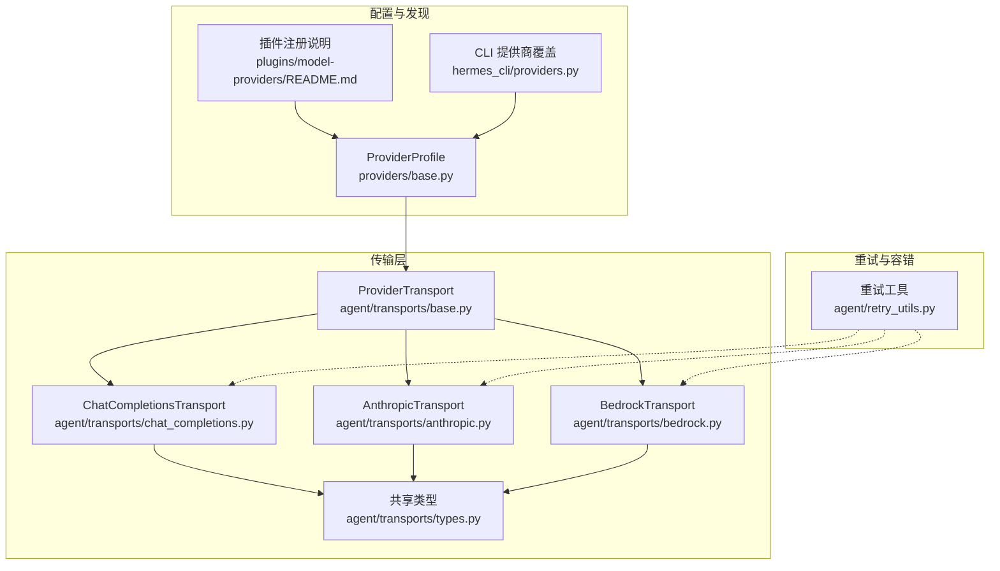
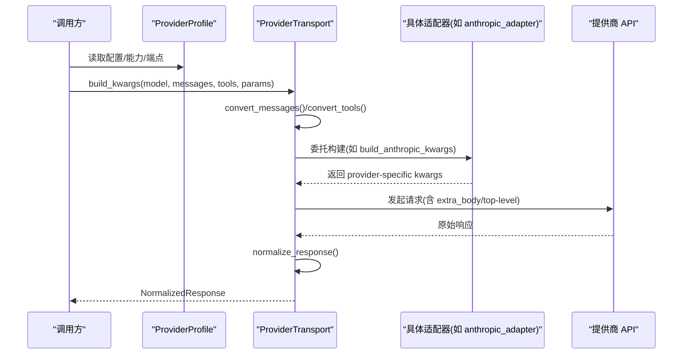
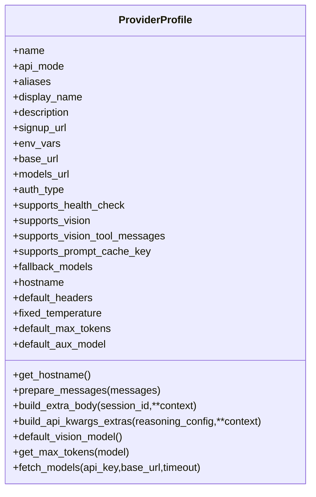
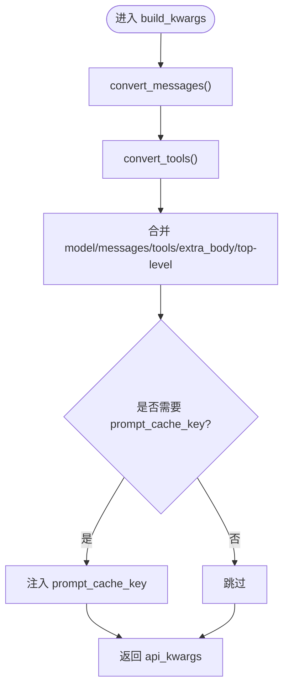
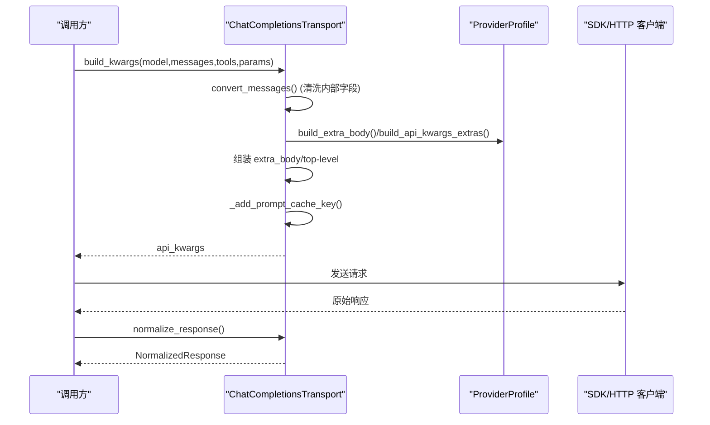
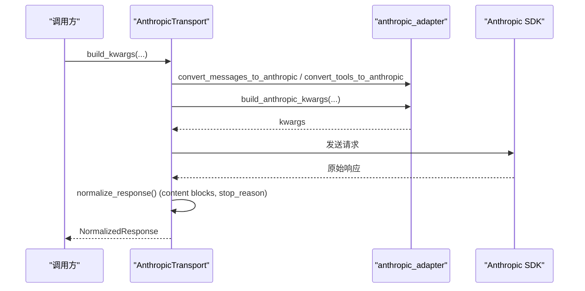
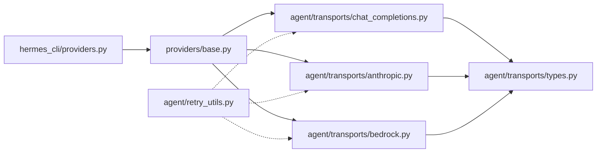
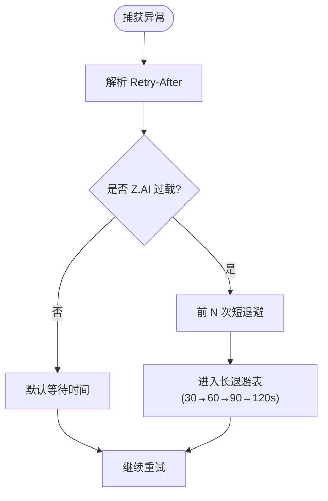

# 模型提供商集成

<cite>
**本文引用的文件**
- [providers/base.py](file://providers/base.py)
- [agent/transports/base.py](file://agent/transports/base.py)
- [agent/transports/chat_completions.py](file://agent/transports/chat_completions.py)
- [agent/transports/anthropic.py](file://agent/transports/anthropic.py)
- [agent/transports/bedrock.py](file://agent/transports/bedrock.py)
- [agent/transports/types.py](file://agent/transports/types.py)
- [hermes_cli/providers.py](file://hermes_cli/providers.py)
- [plugins/model-providers/README.md](file://plugins/model-providers/README.md)
- [agent/retry_utils.py](file://agent/retry_utils.py)
</cite>

## 目录
1. [简介](#简介)
2. [项目结构](#项目结构)
3. [核心组件](#核心组件)
4. [架构总览](#架构总览)
5. [详细组件分析](#详细组件分析)
6. [依赖关系分析](#依赖关系分析)
7. [性能与缓存](#性能与缓存)
8. [重试与错误处理](#重试与错误处理)
9. [故障排查指南](#故障排查指南)
10. [结论](#结论)
11. [附录：开发示例与最佳实践](#附录：开发示例与最佳实践)

## 简介
本指南面向希望为新的 AI 模型服务开发“提供商适配器”的开发者。文档基于仓库中的传输层抽象、提供商配置与插件机制，系统阐述接口规范、请求格式转换、响应处理、错误映射、认证方式、API 调用封装、流式响应支持、缓存策略、参数映射、特性与限制处理、性能优化、重试机制与监控集成等主题，并提供可操作的实现路径与最佳实践。

## 项目结构
围绕“模型提供商集成”，代码采用分层解耦设计：
- 提供商配置与发现：通过 ProviderProfile 声明式描述提供商能力、端点、鉴权、默认行为；通过插件目录自动注册。
- 传输层抽象：ProviderTransport 定义消息/工具/参数/响应的统一转换契约，屏蔽不同 API 差异。
- 具体传输实现：chat_completions（OpenAI 兼容）、anthropic_messages、bedrock_converse 等。
- 共享类型：NormalizedResponse、ToolCall、Usage 等统一数据结构。
- CLI 层覆盖：hermes_cli/providers.py 提供模型目录与覆盖配置，驱动运行时选择。
- 重试与容错：jittered backoff、自适应限退避、特定供应商过载处理。

图表来源
- [providers/base.py:38-239](file://providers/base.py#L38-L239)
- [agent/transports/base.py:16-90](file://agent/transports/base.py#L16-L90)
- [agent/transports/chat_completions.py:207-747](file://agent/transports/chat_completions.py#L207-L747)
- [agent/transports/anthropic.py:13-251](file://agent/transports/anthropic.py#L13-L251)
- [agent/transports/bedrock.py:15-154](file://agent/transports/bedrock.py#L15-L154)
- [agent/transports/types.py:18-175](file://agent/transports/types.py#L18-L175)
- [hermes_cli/providers.py:31-200](file://hermes_cli/providers.py#L31-L200)
- [plugins/model-providers/README.md:1-71](file://plugins/model-providers/README.md#L1-L71)

章节来源
- [providers/base.py:38-239](file://providers/base.py#L38-L239)
- [agent/transports/base.py:16-90](file://agent/transports/base.py#L16-L90)
- [hermes_cli/providers.py:31-200](file://hermes_cli/providers.py#L31-L200)
- [plugins/model-providers/README.md:1-71](file://plugins/model-providers/README.md#L1-L71)

## 核心组件
- ProviderProfile（声明式提供商配置）
  - 描述身份、显示名、鉴权类型、基础 URL、模型列表端点、是否支持健康检查、视觉能力、提示词缓存键支持、默认头部、温度策略、最大输出长度、辅助模型、钩子方法（prepare_messages/build_extra_body/build_api_kwargs_extras/fetch_models）。
  - fetch_models 负责拉取模型清单，带鉴权头与 UA 设置，失败时返回 None 并记录日志。
- ProviderTransport（传输抽象）
  - 统一四个关键方法：convert_messages、convert_tools、build_kwargs、normalize_response；可选 validate_response、extract_cache_stats、map_finish_reason。
- 具体传输实现
  - ChatCompletionsTransport：OpenAI 兼容模式，负责消息清洗、工具处理、max_tokens/temperature/reasoning/thinking_config 组装、prompt_cache_key 注入、provider_data 透传。
  - AnthropicTransport：将 OpenAI 消息/工具转为 Anthropic Messages 格式，解析 content blocks（text/thinking/tool_use），映射 finish_reason，提取缓存统计。
  - BedrockTransport：适配 AWS Converse，处理 boto3 原始响应或已归一化对象，抽取 usage、tool_calls、finish_reason。
- 共享类型
  - ToolCall、Usage、NormalizedResponse：跨提供商的统一响应形态，provider_data 承载协议特有元数据。

章节来源
- [providers/base.py:38-239](file://providers/base.py#L38-L239)
- [agent/transports/base.py:16-90](file://agent/transports/base.py#L16-L90)
- [agent/transports/chat_completions.py:207-747](file://agent/transports/chat_completions.py#L207-L747)
- [agent/transports/anthropic.py:13-251](file://agent/transports/anthropic.py#L13-L251)
- [agent/transports/bedrock.py:15-154](file://agent/transports/bedrock.py#L15-L154)
- [agent/transports/types.py:18-175](file://agent/transports/types.py#L18-L175)

## 架构总览
下图展示从上层到提供商的调用链与数据流转：配置层声明提供商能力，传输层负责协议转换，下游消费统一 NormalizedResponse。

图表来源
- [agent/transports/base.py:16-90](file://agent/transports/base.py#L16-L90)
- [agent/transports/chat_completions.py:356-747](file://agent/transports/chat_completions.py#L356-L747)
- [agent/transports/anthropic.py:41-78](file://agent/transports/anthropic.py#L41-L78)
- [agent/transports/bedrock.py:32-65](file://agent/transports/bedrock.py#L32-L65)

## 详细组件分析

### 提供商配置与插件注册（ProviderProfile）
- 作用：集中声明提供商的身份、鉴权、端点、能力与请求级行为；避免在调用处散落大量布尔开关。
- 关键能力：
  - 鉴权与端点：env_vars、base_url、models_url、auth_type、supports_health_check。
  - 能力标记：supports_vision、supports_vision_tool_messages、supports_prompt_cache_key。
  - 请求级钩子：prepare_messages、build_extra_body、build_api_kwargs_extras、get_max_tokens、default_vision_model。
  - 模型清单：fetch_models 支持 Bearer 鉴权、UA 设置、JSON 解析与异常兜底。
- 插件机制：
  - 每个子目录是一个自包含的 ProviderProfile 插件，通过 __init__.py 调用 register_provider(profile)。
  - 用户目录下的同名插件可覆盖内置插件（最后写入者胜）。

图表来源
- [providers/base.py:38-239](file://providers/base.py#L38-L239)

章节来源
- [providers/base.py:38-239](file://providers/base.py#L38-L239)
- [plugins/model-providers/README.md:1-71](file://plugins/model-providers/README.md#L1-L71)

### 传输层抽象与通用流程（ProviderTransport）
- 职责边界：仅负责数据路径转换（消息/工具/参数/响应），不持有客户端生命周期、流式、凭据刷新、中断、重试等。
- 标准方法：
  - convert_messages：将 OpenAI 格式消息转换为提供商原生格式。
  - convert_tools：将 OpenAI 工具定义转换为提供商原生 schema。
  - build_kwargs：组装最终传给 SDK/HTTP 客户端的参数字典。
  - normalize_response：将原始响应归一化为 NormalizedResponse。
  - 可选：validate_response、extract_cache_stats、map_finish_reason。

图表来源
- [agent/transports/base.py:16-90](file://agent/transports/base.py#L16-L90)
- [agent/transports/chat_completions.py:356-747](file://agent/transports/chat_completions.py#L356-L747)

章节来源
- [agent/transports/base.py:16-90](file://agent/transports/base.py#L16-L90)

### Chat Completions 传输（OpenAI 兼容）
- 消息清洗：移除内部字段（如 codex_*、tool_name、effect_disposition、timestamp、api_content、_ 前缀标记），按目标模型决定是否保留 Gemini 的 extra_content。
- 工具处理：对 Moonshot/Kimi 进行工具 schema 规范化。
- 参数组装：
  - max_tokens 优先级：临时覆盖 > 用户指定 > 提供商默认（get_max_tokens）。
  - reasoning/thinking：根据提供商与模型族（Gemini、LM Studio、Kimi、TokenHub、GitHub Models）差异化注入 top-level 或 extra_body。
  - extra_body：聚合 provider_preferences、plugins、thinking、reasoning 等。
  - prompt_cache_key：仅在显式支持的端点注入，使用内容地址化 key 与 session 范围。
- 响应归一化：保留 tool_calls 的 provider_data（如 Gemini thought_signature），抽取 usage，映射 finish_reason。

图表来源
- [agent/transports/chat_completions.py:217-747](file://agent/transports/chat_completions.py#L217-L747)
- [providers/base.py:117-179](file://providers/base.py#L117-L179)

章节来源
- [agent/transports/chat_completions.py:217-747](file://agent/transports/chat_completions.py#L217-L747)
- [providers/base.py:117-179](file://providers/base.py#L117-L179)

### Anthropic 传输（Messages API）
- 消息/工具转换：委托至 anthropic_adapter，生成 system/messages 与 input_schema。
- 参数构建：传递 max_tokens、reasoning_config、tool_choice、base_url、fast_mode 等。
- 响应归一化：
  - 解析 content blocks（text/thinking/tool_use），维护有序块以正确重放签名 thinking。
  - 映射 stop_reason → finish_reason（end_turn/refusal 等）。
  - 提取缓存统计（cache_read_input_tokens/cache_creation_input_tokens）。
- 响应校验：空 content 但终止原因为 end_turn/refusal 视为有效，避免误重试。

图表来源
- [agent/transports/anthropic.py:24-78](file://agent/transports/anthropic.py#L24-L78)
- [agent/transports/anthropic.py:80-245](file://agent/transports/anthropic.py#L80-L245)

章节来源
- [agent/transports/anthropic.py:24-245](file://agent/transports/anthropic.py#L24-L245)

### Bedrock 传输（Converse API）
- 消息/工具转换：委托 bedrock_adapter，生成 Converse 格式。
- 参数构建：region、guardrail_config、max_tokens、temperature。
- 响应归一化：兼容 boto3 原始 dict 与已归一化 SimpleNamespace，抽取 tool_calls、usage、finish_reason、reasoning。
- 响应校验：检查 output 或 choices。

章节来源
- [agent/transports/bedrock.py:22-148](file://agent/transports/bedrock.py#L22-L148)

### 共享类型（NormalizedResponse、ToolCall、Usage）
- ToolCall：id/name/arguments/provider_data，向后兼容 function.name/arguments 访问。
- Usage：prompt_tokens/completion_tokens/total_tokens/cached_tokens。
- NormalizedResponse：content/tool_calls/finish_reason/reasoning/usage/provider_data，以及若干便捷属性（reasoning_details、anthropic_content_blocks 等）。

章节来源
- [agent/transports/types.py:18-175](file://agent/transports/types.py#L18-L175)

## 依赖关系分析
- 配置层依赖：
  - hermes_cli/providers.py 提供模型目录与覆盖（transport/auth/base_url/env），与 ProviderProfile 共同决定运行时行为。
- 传输层依赖：
  - chat_completions 依赖 moonshot_schema、lmstudio_reasoning、gemini 相关逻辑与 ProviderProfile 钩子。
  - anthropic/bedrock 分别依赖各自 adapter 模块。
- 重试与容错：
  - retry_utils 提供 jittered_backoff、parse_retry_after_seconds、adaptive_rate_limit_backoff、zai_coding_overload 特殊处理。

图表来源
- [hermes_cli/providers.py:31-200](file://hermes_cli/providers.py#L31-L200)
- [providers/base.py:38-239](file://providers/base.py#L38-L239)
- [agent/transports/chat_completions.py:207-747](file://agent/transports/chat_completions.py#L207-L747)
- [agent/transports/anthropic.py:13-251](file://agent/transports/anthropic.py#L13-L251)
- [agent/transports/bedrock.py:15-154](file://agent/transports/bedrock.py#L15-L154)
- [agent/transports/types.py:18-175](file://agent/transports/types.py#L18-L175)
- [agent/retry_utils.py:1-200](file://agent/retry_utils.py#L1-L200)

章节来源
- [hermes_cli/providers.py:31-200](file://hermes_cli/providers.py#L31-L200)
- [agent/retry_utils.py:1-200](file://agent/retry_utils.py#L1-L200)

## 性能与缓存
- 提示词缓存键（prompt_cache_key）
  - 仅在显式支持的端点注入（ProviderProfile.supports_prompt_cache_key 或 api.openai.com）。
  - 基于静态指令与工具的哈希，结合 session 范围，确保等价请求路由到同一缓存桶。
- 提供商缓存统计
  - Anthropic：提取 cache_read_input_tokens 与 cache_creation_input_tokens。
- 模型清单缓存
  - fetch_models 失败时返回 None，调用方应回退到静态模型列表，避免频繁探测。
- 消息清洗与最小化负载
  - 去除内部字段与多余键，降低严格网关拒绝风险，减少无效往返。

章节来源
- [agent/transports/chat_completions.py:44-77](file://agent/transports/chat_completions.py#L44-L77)
- [agent/transports/chat_completions.py:173-188](file://agent/transports/chat_completions.py#L173-L188)
- [agent/transports/chat_completions.py:588-595](file://agent/transports/chat_completions.py#L588-L595)
- [agent/transports/chat_completions.py:739-745](file://agent/transports/chat_completions.py#L739-L745)
- [agent/transports/anthropic.py:222-231](file://agent/transports/anthropic.py#L222-L231)
- [providers/base.py:181-239](file://providers/base.py#L181-L239)

## 重试与错误处理
- 退避策略
  - jittered_backoff：指数退避+抖动，避免并发风暴。
  - parse_retry_after_seconds：解析 Retry-After 头（数字/HTTP-date）。
  - adaptive_rate_limit_backoff：针对 Z.AI Coding Plan GLM-5.2 过载（HTTP 429 code 1305）短重试后切换长退避表。
- 错误分类
  - is_zai_coding_overload_error：精确识别特定过载场景，避免误判普通配额/计费 429。
- 响应校验
  - 各传输提供 validate_response，防止将“已完成但无文本”的响应误判为失败并重试。

图表来源
- [agent/retry_utils.py:38-128](file://agent/retry_utils.py#L38-L128)
- [agent/retry_utils.py:142-200](file://agent/retry_utils.py#L142-L200)

章节来源
- [agent/retry_utils.py:38-200](file://agent/retry_utils.py#L38-L200)
- [agent/transports/anthropic.py:194-220](file://agent/transports/anthropic.py#L194-L220)
- [agent/transports/bedrock.py:118-132](file://agent/transports/bedrock.py#L118-L132)

## 故障排查指南
- 400/422/5xx 由严格网关拒绝
  - 检查消息清洗是否移除了内部字段（如 _ 前缀、tool_name、timestamp）。
  - 确认未向不支持的提供商发送 extra_content 或未知字段。
- 思考/推理字段导致验证失败
  - Gemini 非 openai 兼容端点需使用 thinkingConfig；openai 兼容端点需 snake_case 字段。
  - 非 Gemini 模型不应携带 thinking_config。
- 工具调用签名丢失
  - Gemini 3 thinking 模型需在后续请求中回放 extra_content（thought_signature）。
- 空响应被误重试
  - 校验响应是否为 end_turn/refusal 等合法终止原因。
- 模型清单不可用
  - fetch_models 失败时回退到静态列表；检查 base_url/models_url 与鉴权头。

章节来源
- [agent/transports/chat_completions.py:217-350](file://agent/transports/chat_completions.py#L217-L350)
- [agent/transports/chat_completions.py:93-161](file://agent/transports/chat_completions.py#L93-L161)
- [agent/transports/anthropic.py:194-220](file://agent/transports/anthropic.py#L194-L220)
- [providers/base.py:181-239](file://providers/base.py#L181-L239)

## 结论
该体系通过 ProviderProfile 声明式配置与 ProviderTransport 统一传输抽象，将多提供商差异收敛到最小转换层，并以 NormalizedResponse 作为统一产物。借助提示词缓存、响应校验、智能重试与提供商特定钩子，既保证兼容性又兼顾性能与稳定性。新增提供商只需实现/注册 ProviderProfile 与对应传输（或复用现有传输），即可快速接入。

## 附录：开发示例与最佳实践

### 新增提供商步骤（以 OpenAI 兼容为例）
- 创建插件目录与 __init__.py，定义 ProviderProfile（name、base_url、env_vars、auth_type、supports_prompt_cache_key 等），并在末尾调用 register_provider(profile)。
- 若需要自定义消息预处理、extra_body 或 top-level 参数，请覆写 prepare_messages、build_extra_body、build_api_kwargs_extras。
- 若提供商有独特模型清单端点，覆写 fetch_models。
- 通过 hermes_cli/providers.py 的覆盖机制调整 transport/auth/base_url/env 等元信息。

章节来源
- [plugins/model-providers/README.md:28-71](file://plugins/model-providers/README.md#L28-L71)
- [providers/base.py:117-179](file://providers/base.py#L117-L179)
- [hermes_cli/providers.py:31-200](file://hermes_cli/providers.py#L31-L200)

### 参数映射与特性处理要点
- 温度控制：ProviderProfile.fixed_temperature 可固定或省略；ChatCompletionsTransport 会按 profile 与调用方参数优先级注入。
- 最大输出：优先 ephemeral/user，其次 get_max_tokens(model)，再 fallback。
- 推理/思考：
  - Gemini：区分 native 与 openai 兼容端点，映射 thinking_config/thinkingLevel/thinkingBudget。
  - LM Studio/Kimi/TokenHub/GitHub Models：按模型族注入 reasoning_effort 或 extra_body.reasoning。
- 工具 Schema：Moonshot/Kimi 需规范化；Anthropic 需转 input_schema；Bedrock 转 toolConfig。

章节来源
- [agent/transports/chat_completions.py:356-747](file://agent/transports/chat_completions.py#L356-L747)
- [agent/transports/anthropic.py:35-78](file://agent/transports/anthropic.py#L35-L78)
- [agent/transports/bedrock.py:27-65](file://agent/transports/bedrock.py#L27-L65)

### 流式响应支持
- 当前传输层关注非流式响应归一化；流式处理不在传输内实现，通常在上层（AIAgent/调用方）管理流式事件与状态。
- 如需扩展，可在调用方侧对接提供商 SDK 的流式接口，并将增量片段聚合为统一的中间表示后再消费。

[本节为概念性说明，不直接分析具体文件]

### 认证方式与 API 调用封装
- 鉴权类型：api_key、oauth_device_code、oauth_external、aws_sdk 等，由 ProviderProfile.auth_type 与 hermes_cli/providers.py 的 HermesOverlay 共同决定。
- 端点与头部：base_url/models_url/default_headers 控制请求基址与附加头；fetch_models 演示了 Bearer 鉴权与 UA 设置。
- 调用封装：传输层只负责参数构造与响应归一化；实际 HTTP/SDK 调用由上层完成。

章节来源
- [providers/base.py:52-91](file://providers/base.py#L52-L91)
- [providers/base.py:181-239](file://providers/base.py#L181-L239)
- [hermes_cli/providers.py:31-200](file://hermes_cli/providers.py#L31-L200)

### 监控与可观测性
- 使用 NormalizedResponse.usage 与 extract_cache_stats 收集 token 用量与缓存命中情况。
- 在调用方侧埋点：请求耗时、重试次数、错误码分布、提供商维度指标。
- 利用 ProviderProfile.fetch_models 的健康探测结果（supports_health_check）做可用性巡检。

章节来源
- [agent/transports/types.py:79-109](file://agent/transports/types.py#L79-L109)
- [agent/transports/anthropic.py:222-231](file://agent/transports/anthropic.py#L222-L231)
- [providers/base.py:52-57](file://providers/base.py#L52-L57)

### 最佳实践清单
- 始终通过 ProviderProfile 声明提供商能力，避免硬编码分支。
- 对严格网关保持最小载荷：清理内部字段、按需注入 extra_body。
- 谨慎处理推理/思考字段：按模型族与端点类型精准映射。
- 启用 prompt_cache_key 以提升重复请求命中率。
- 使用 jittered 退避与自适应限退避，避免雪崩。
- 对“空响应但已终止”的情况做特殊校验，避免误重试。
- 在调用方侧完善监控与告警，覆盖错误率、延迟、用量与缓存命中。

[本节为通用指导，不直接分析具体文件]