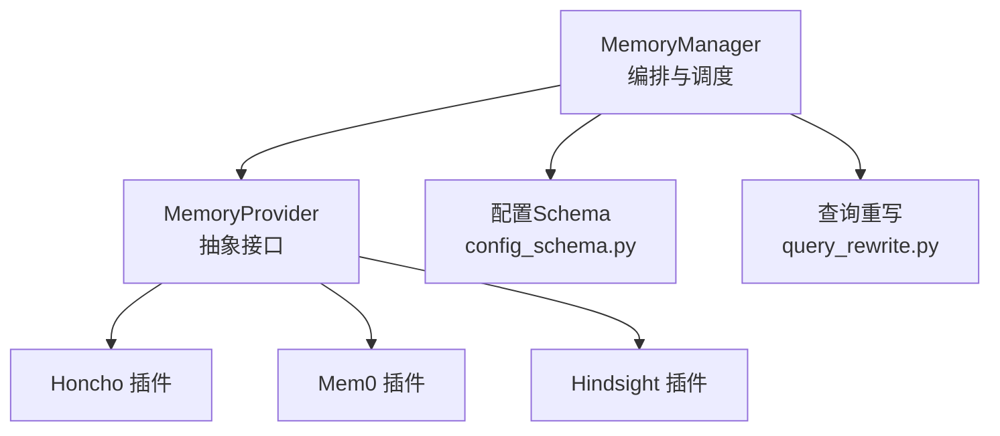
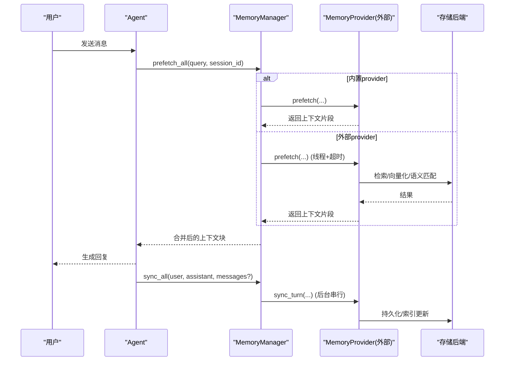
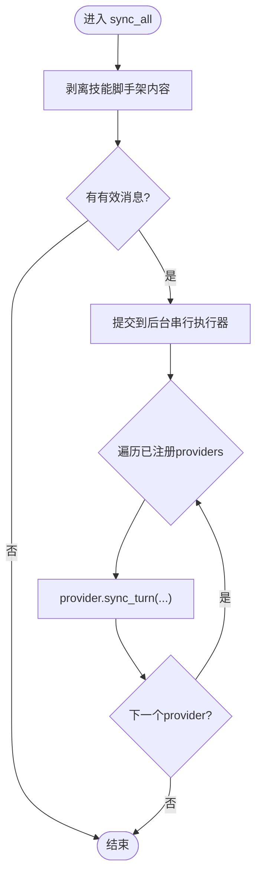
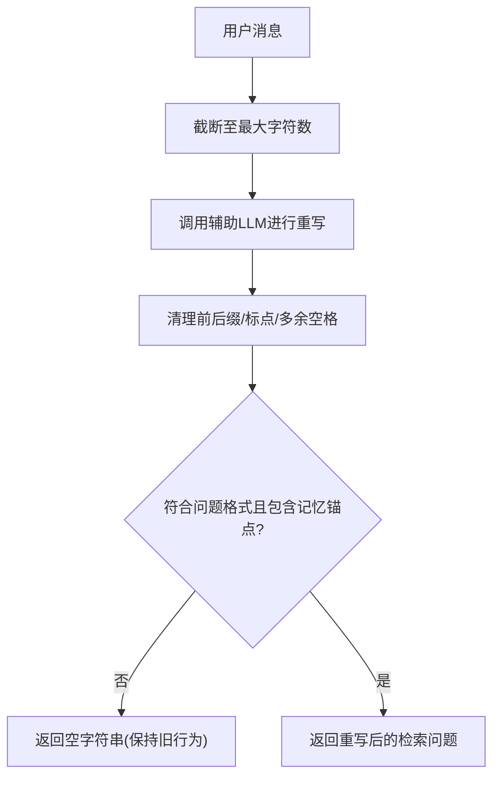
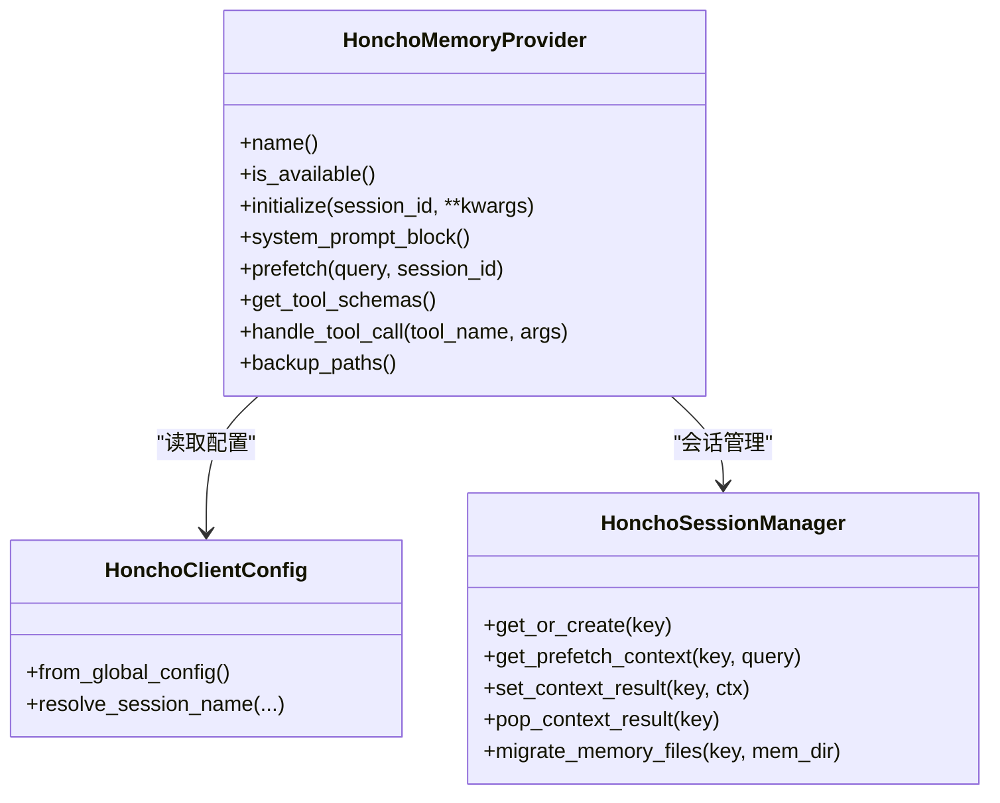
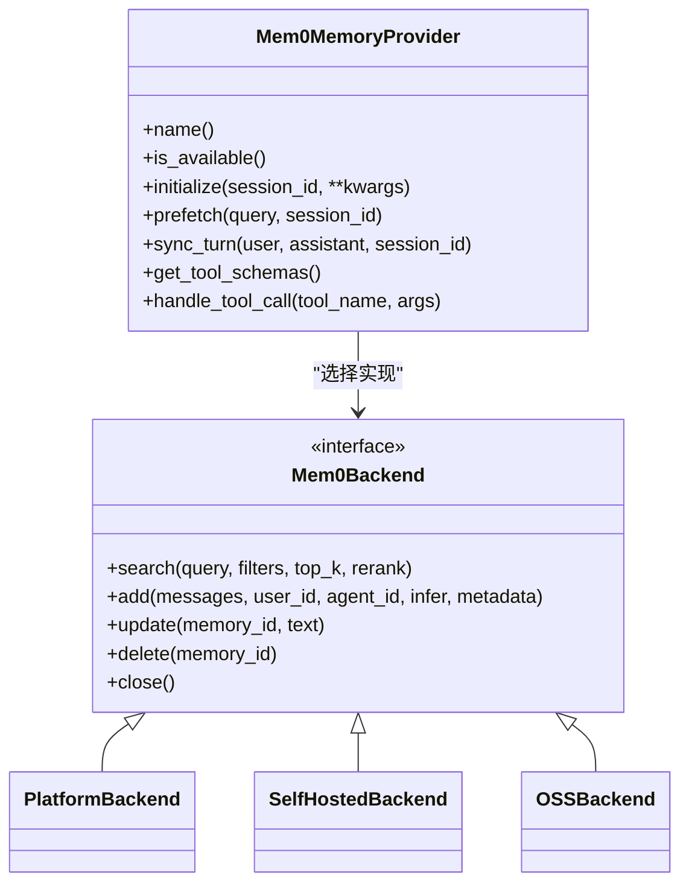
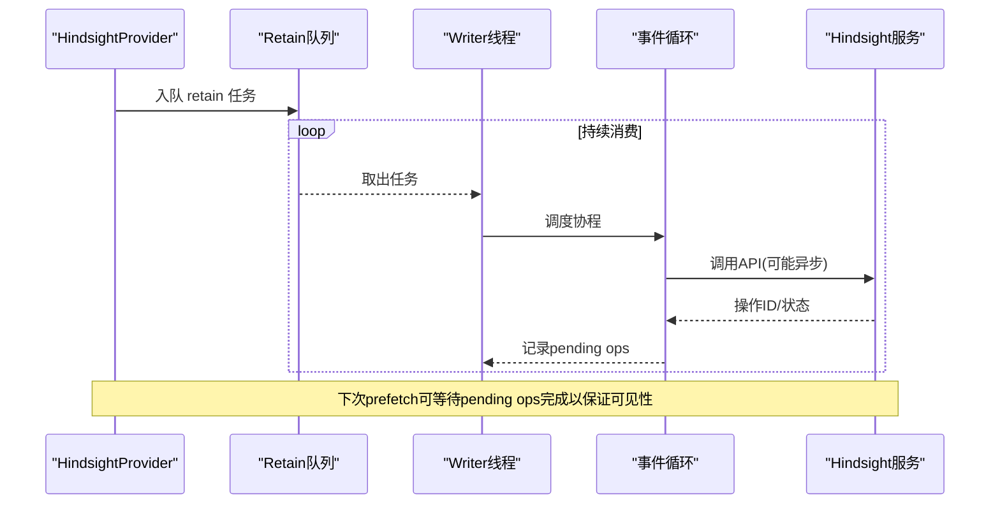
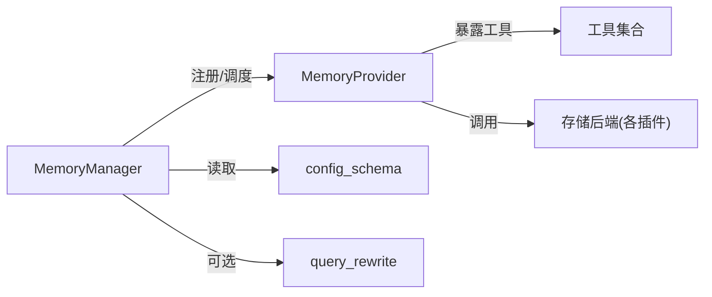

# 记忆插件开发

<cite>
**本文引用的文件**
- [agent/memory_manager.py](file://agent/memory_manager.py)
- [agent/memory_provider.py](file://agent/memory_provider.py)
- [plugins/memory/config_schema.py](file://plugins/memory/config_schema.py)
- [plugins/memory/query_rewrite.py](file://plugins/memory/query_rewrite.py)
- [plugins/memory/honcho/__init__.py](file://plugins/memory/honcho/__init__.py)
- [plugins/memory/honcho/client.py](file://plugins/memory/honcho/client.py)
- [plugins/memory/mem0/__init__.py](file://plugins/memory/mem0/__init__.py)
- [plugins/memory/mem0/_backend.py](file://plugins/memory/mem0/_backend.py)
- [plugins/memory/hindsight/__init__.py](file://plugins/memory/hindsight/__init__.py)
</cite>

## 目录
1. [简介](#简介)
2. [项目结构](#项目结构)
3. [核心组件](#核心组件)
4. [架构总览](#架构总览)
5. [详细组件分析](#详细组件分析)
6. [依赖关系分析](#依赖关系分析)
7. [性能考虑](#性能考虑)
8. [故障排查指南](#故障排查指南)
9. [结论](#结论)
10. [附录](#附录)

## 简介
本指南面向希望为 Hermes Agent 扩展“记忆系统”存储后端的开发者。文档围绕 MemoryProvider 接口规范、数据持久化、检索与索引机制、向量搜索、语义匹配、上下文压缩、缓存策略展开，并提供 Honcho、Mem0、Hindsight 等记忆后端的实现要点与最佳实践。同时涵盖数据迁移、备份恢复与一致性保证，帮助你在不破坏现有流程的前提下，安全地接入新的记忆后端。

## 项目结构
记忆系统由“核心编排层 + 插件抽象层 + 具体插件实现”构成：
- 核心编排层：MemoryManager 负责注册/调度多个 MemoryProvider，统一注入系统提示、预取上下文、回合同步、工具暴露与后台任务管理。
- 插件抽象层：MemoryProvider 定义标准生命周期与可选钩子；config_schema 提供声明式配置面板；query_rewrite 提供查询重写能力。
- 具体插件实现：Honcho、Mem0、Hindsight 等以插件形式提供不同存储与检索能力（本地/云端、向量/图、混合检索等）。

图表来源
- [agent/memory_manager.py:364-800](file://agent/memory_manager.py#L364-L800)
- [agent/memory_provider.py:81-358](file://agent/memory_provider.py#L81-L358)
- [plugins/memory/config_schema.py:1-145](file://plugins/memory/config_schema.py#L1-L145)
- [plugins/memory/query_rewrite.py:1-140](file://plugins/memory/query_rewrite.py#L1-L140)

章节来源
- [agent/memory_manager.py:1-157](file://agent/memory_manager.py#L1-L157)
- [agent/memory_provider.py:1-80](file://agent/memory_provider.py#L1-L80)
- [plugins/memory/config_schema.py:1-145](file://plugins/memory/config_schema.py#L1-L145)
- [plugins/memory/query_rewrite.py:1-140](file://plugins/memory/query_rewrite.py#L1-L140)

## 核心组件
- MemoryProvider 抽象类：定义 name、is_available、initialize、system_prompt_block、prefetch、queue_prefetch、sync_turn、get_tool_schemas、handle_tool_call、shutdown 以及若干可选钩子（on_turn_start、on_session_end、on_session_switch、on_pre_compress、on_delegation、backup_paths、get_config_schema/save_config）。
- MemoryManager：单点集成入口，负责：
  - 最多一个外部 provider 的注册与冲突防护
  - 系统提示拼装
  - 每轮前 prefetch_all（含超时保护）
  - 每轮后 sync_all（后台串行写入，避免阻塞对话）
  - 工具模式暴露与名称去重/保留核心工具名
  - 流式上下文清洗（StreamingContextScrubber）
- 配置 Schema：通过 ProviderConfigSchema 声明字段类型、是否密钥、作用域等，驱动通用 UI 与 API。
- 查询重写：将最新用户消息改写为“仅用于检索”的问题，提升召回质量。

章节来源
- [agent/memory_provider.py:81-358](file://agent/memory_provider.py#L81-L358)
- [agent/memory_manager.py:364-800](file://agent/memory_manager.py#L364-L800)
- [plugins/memory/config_schema.py:1-145](file://plugins/memory/config_schema.py#L1-L145)
- [plugins/memory/query_rewrite.py:1-140](file://plugins/memory/query_rewrite.py#L1-L140)

## 架构总览
下图展示从“用户消息”到“记忆上下文注入/写入”的完整调用链，以及外部 provider 的异步与超时保护。

图表来源
- [agent/memory_manager.py:525-694](file://agent/memory_manager.py#L525-L694)
- [agent/memory_provider.py:132-170](file://agent/memory_provider.py#L132-L170)

## 详细组件分析

### MemoryProvider 接口与生命周期
- 必需方法：name、is_available、initialize、get_tool_schemas
- 常用方法：system_prompt_block、prefetch、queue_prefetch、sync_turn、handle_tool_call、shutdown
- 可选钩子：on_turn_start、on_session_end、on_session_switch、on_pre_compress、on_delegation、backup_paths、get_config_schema/save_config
- trivial prompt 过滤：对无意义的简短输入跳过记忆检索，减少网络开销与噪声注入

章节来源
- [agent/memory_provider.py:44-80](file://agent/memory_provider.py#L44-L80)
- [agent/memory_provider.py:81-358](file://agent/memory_provider.py#L81-L358)

### MemoryManager 编排与并发控制
- 注册限制：仅允许一个外部 provider，避免工具表膨胀与冲突
- 工具暴露：normalize_tool_schema 统一 OpenAI function schema，屏蔽重复/非法 schema
- 预取保护：外部 provider 的 prefetch 使用独立线程并带超时，避免卡死主循环
- 写入串行：sync_all 通过单工作线程顺序执行，确保 turn N 先于 turn N+1 落地
- 流式清洗：StreamingContextScrubber 处理跨分片的 <memory-context> 标签，防止泄露内部上下文

图表来源
- [agent/memory_manager.py:626-694](file://agent/memory_manager.py#L626-L694)

章节来源
- [agent/memory_manager.py:50-157](file://agent/memory_manager.py#L50-L157)
- [agent/memory_manager.py:364-800](file://agent/memory_manager.py#L364-L800)

### 配置系统与声明式字段
- 字段类型：text、select、secret、bool、number、json
- 存储后端：flat_json、honcho_host_block
- 作用域：host/root，支持别名与环境变量回退
- 加载方式：按路径动态导入 config_schema.py，避免污染 web server 进程

章节来源
- [plugins/memory/config_schema.py:1-145](file://plugins/memory/config_schema.py#L1-L145)

### 查询重写（语义匹配前置）
- 目标：将最新用户消息改写为“仅用于检索”的简洁问题
- 约束：长度限制、禁止指令泄漏、必须指向用户历史/偏好/上下文
- 失败降级：异常或无效输出时回退到原始行为

图表来源
- [plugins/memory/query_rewrite.py:18-140](file://plugins/memory/query_rewrite.py#L18-L140)

章节来源
- [plugins/memory/query_rewrite.py:1-140](file://plugins/memory/query_rewrite.py#L1-L140)

### 插件实现一：Honcho
- 模式：context/tools/hybrid 三种召回模式
- 工具：profile、search、reasoning、context、conclude
- 会话初始化：支持延迟初始化（tools-only），后台预热，认证失败一次性提示
- 缓存：基础上下文缓存（representation/card），按 cadence 刷新
- 迁移：首次会话可迁移本地 memories 文件到远端
- 备份：声明 ~/.honcho 目录参与备份

图表来源
- [plugins/memory/honcho/__init__.py:237-800](file://plugins/memory/honcho/__init__.py#L237-L800)
- [plugins/memory/honcho/client.py:1-200](file://plugins/memory/honcho/client.py#L1-L200)

章节来源
- [plugins/memory/honcho/__init__.py:1-800](file://plugins/memory/honcho/__init__.py#L1-L800)
- [plugins/memory/honcho/client.py:1-200](file://plugins/memory/honcho/client.py#L1-L200)

### 插件实现二：Mem0
- 模式：platform（云）、self-hosted（HTTP API）、oss（本地向量库）
- 工具：mem0_search、mem0_add、mem0_update、mem0_delete
- 预取：后台线程检索并短等待热路径，失败走熔断器
- 元数据：user_id/agent_id/channel 标记，便于多通道聚合与视图
- 后端抽象：PlatformBackend/SelfHostedBackend/OSSBackend 统一接口

图表来源
- [plugins/memory/mem0/__init__.py:194-629](file://plugins/memory/mem0/__init__.py#L194-L629)
- [plugins/memory/mem0/_backend.py:9-200](file://plugins/memory/mem0/_backend.py#L9-L200)

章节来源
- [plugins/memory/mem0/__init__.py:1-629](file://plugins/memory/mem0/__init__.py#L1-L629)
- [plugins/memory/mem0/_backend.py:1-200](file://plugins/memory/mem0/_backend.py#L1-L200)

### 插件实现三：Hindsight
- 能力：知识图谱、实体解析、多策略检索（语义/关键词/图遍历/重排）
- 模式：cloud/local，支持嵌入式守护进程与远程 API
- 工具：retain、recall、reflect
- 队列与事件循环：单写者模型 + 共享事件循环，避免资源泄漏
- 版本探测：/version 探测 update_mode='append' 支持，避免覆盖写入
- 配置：profile-scoped 与 legacy 路径兼容，敏感信息权限校验

图表来源
- [plugins/memory/hindsight/__init__.py:255-300](file://plugins/memory/hindsight/__init__.py#L255-L300)
- [plugins/memory/hindsight/__init__.py:681-800](file://plugins/memory/hindsight/__init__.py#L681-L800)

章节来源
- [plugins/memory/hindsight/__init__.py:1-800](file://plugins/memory/hindsight/__init__.py#L1-L800)

## 依赖关系分析
- MemoryManager 依赖 MemoryProvider 抽象，并通过 normalize_tool_schema 统一工具 schema
- 各插件通过 get_tool_schemas 暴露工具，并由 MemoryManager 注入到 Agent 的工具集
- 配置系统通过 config_schema.py 提供声明式字段，UI/API 无需定制渲染
- 查询重写依赖辅助 LLM 调用，失败时降级

图表来源
- [agent/memory_manager.py:110-157](file://agent/memory_manager.py#L110-L157)
- [plugins/memory/config_schema.py:1-145](file://plugins/memory/config_schema.py#L1-L145)
- [plugins/memory/query_rewrite.py:1-140](file://plugins/memory/query_rewrite.py#L1-L140)

章节来源
- [agent/memory_manager.py:110-157](file://agent/memory_manager.py#L110-L157)
- [plugins/memory/config_schema.py:1-145](file://plugins/memory/config_schema.py#L1-L145)
- [plugins/memory/query_rewrite.py:1-140](file://plugins/memory/query_rewrite.py#L1-L140)

## 性能考虑
- 预取超时与跳过：外部 provider 的 prefetch 使用线程+超时，避免阻塞主循环
- 写入串行化：单工作线程顺序执行 sync_turn，保证顺序与可预测性
- 缓存策略：
  - Honcho：基础上下文缓存，按 context_cadence 刷新
  - Mem0：后台预取+短等待热路径，失败熔断
  - Hindsight：共享事件循环与单写者队列，降低资源抖动
- 查询优化：
  - 查询重写提升语义匹配精度
  - trivial prompt 过滤减少无效检索
  - 工具模式按需调用，避免不必要的网络往返
- 资源保护：
  - 流式上下文清洗避免泄露内部标记
  - 嵌入守护进程健康检查与优雅重启

[本节为通用指导，不直接分析具体文件]

## 故障排查指南
- 外部 provider 预取超时：检查网络/服务可用性，必要时调整 external_prefetch_timeout
- 工具名冲突：确保 provider 工具名不与核心工具冲突，否则会被忽略
- 认证失败：Honcho 会记录一次性提示；Mem0/Hindsight 会在日志中给出错误原因
- 写入不可见：Hindsight 在异步模式下需等待 pending ops 完成再检索
- 备份缺失：确认 backup_paths 声明了外部路径（如 ~/.honcho、~/.hindsight）

章节来源
- [agent/memory_manager.py:547-595](file://agent/memory_manager.py#L547-L595)
- [plugins/memory/honcho/__init__.py:603-611](file://plugins/memory/honcho/__init__.py#L603-L611)
- [plugins/memory/mem0/__init__.py:294-336](file://plugins/memory/mem0/__init__.py#L294-L336)
- [plugins/memory/hindsight/__init__.py:732-773](file://plugins/memory/hindsight/__init__.py#L732-L773)

## 结论
通过 MemoryProvider 抽象与 MemoryManager 编排，Hermes Agent 提供了可扩展、高可用、低侵入的记忆系统。开发者只需实现标准接口，即可接入多种存储后端，并利用统一的工具暴露、预取/写入管线、配置面板与备份机制。结合查询重写、缓存与并发控制，可在保证性能的同时获得稳定的语义检索体验。

[本节为总结性内容，不直接分析具体文件]

## 附录

### 新存储后端开发步骤清单
- 实现 MemoryProvider 必要方法与可选钩子
- 实现 get_tool_schemas/handle_tool_call（如需）
- 实现 initialize/shutdown，处理连接与会话
- 实现 is_available（仅检查配置/依赖，不做网络调用）
- 实现 backup_paths（若存在外部路径）
- 可选：实现 get_config_schema/save_config 以接入配置面板
- 可选：使用 query_rewrite 作为检索查询重写器
- 测试：验证 prefetch/sync_turn 的超时、失败与重试行为

章节来源
- [agent/memory_provider.py:81-358](file://agent/memory_provider.py#L81-L358)
- [plugins/memory/config_schema.py:1-145](file://plugins/memory/config_schema.py#L1-L145)
- [plugins/memory/query_rewrite.py:1-140](file://plugins/memory/query_rewrite.py#L1-L140)

### 数据迁移、备份恢复与一致性
- 迁移：在 initialize 中检测空会话并迁移本地 memories 文件（参考 Honcho）
- 备份：通过 backup_paths 声明外部路径，纳入 hermes backup/import 流程
- 一致性：
  - 写入串行化保证顺序
  - 异步写入场景下，prefetch 等待 pending ops 完成（参考 Hindsight）
  - 工具调用幂等设计，避免重复写入

章节来源
- [plugins/memory/honcho/__init__.py:507-520](file://plugins/memory/honcho/__init__.py#L507-L520)
- [agent/memory_provider.py:341-358](file://agent/memory_provider.py#L341-L358)
- [plugins/memory/hindsight/__init__.py:732-773](file://plugins/memory/hindsight/__init__.py#L732-L773)