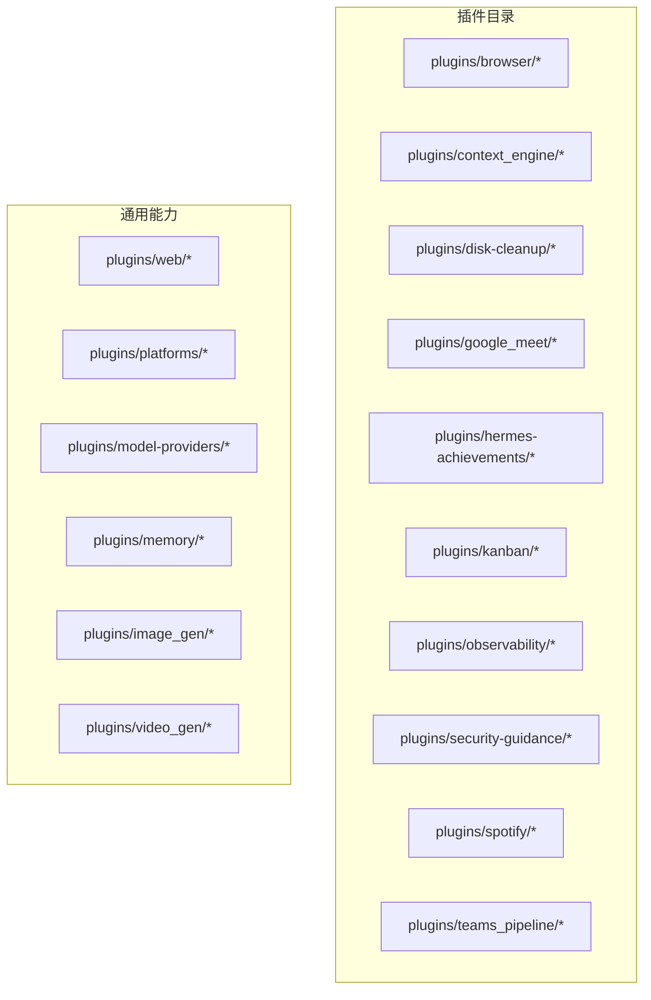
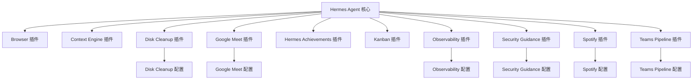
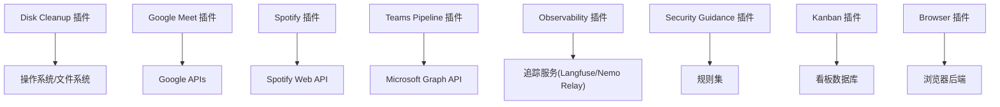

# 专用插件

<cite>
**本文引用的文件**
- [plugins/browser/__init__.py](file://plugins/browser/__init__.py)
- [plugins/browser/browser_use/__init__.py](file://plugins/browser/browser_use/__init__.py)
- [plugins/browser/browserbase/__init__.py](file://plugins/browser/browserbase/__init__.py)
- [plugins/browser/firecrawl/__init__.py](file://plugins/browser/firecrawl/__init__.py)
- [plugins/context_engine/__init__.py](file://plugins/context_engine/__init__.py)
- [plugins/disk-cleanup/__init__.py](file://plugins/disk-cleanup/__init__.py)
- [plugins/disk-cleanup/plugin.yaml](file://plugins/disk-cleanup/plugin.yaml)
- [plugins/google_meet/__init__.py](file://plugins/google_meet/__init__.py)
- [plugins/google_meet/plugin.yaml](file://plugins/google_meet/plugin.yaml)
- [plugins/hermes-achievements/README.md](file://plugins/hermes-achievements/README.md)
- [plugins/kanban/dashboard/__init__.py](file://plugins/kanban/dashboard/__init__.py)
- [plugins/kanban/systemd/__init__.py](file://plugins/kanban/systemd/__init__.py)
- [plugins/observability/langfuse/__init__.py](file://plugins/observability/langfuse/__init__.py)
- [plugins/observability/nemo_relay/__init__.py](file://plugins/observability/nemo_relay/__init__.py)
- [plugins/security-guidance/__init__.py](file://plugins/security-guidance/__init__.py)
- [plugins/security-guidance/plugin.yaml](file://plugins/security-guidance/plugin.yaml)
- [plugins/spotify/__init__.py](file://plugins/spotify/__init__.py)
- [plugins/spotify/plugin.yaml](file://plugins/spotify/plugin.yaml)
- [plugins/teams_pipeline/__init__.py](file://plugins/teams_pipeline/__init__.py)
- [plugins/teams_pipeline/plugin.yaml](file://plugins/teams_pipeline/plugin.yaml)
- [plugins/teams_pipeline/pipeline.py](file://plugins/teams_pipeline/pipeline.py)
- [plugins/teams_pipeline/store.py](file://plugins/teams_pipeline/store.py)
- [plugins/teams_pipeline/subscriptions.py](file://plugins/teams_pipeline/subscriptions.py)
- [plugins/teams_pipeline/models.py](file://plugins/teams_pipeline/models.py)
- [plugins/teams_pipeline/runtime.py](file://plugins/teams_pipeline/runtime.py)
- [plugins/teams_pipeline/cli.py](file://plugins/teams_pipeline/cli.py)
- [plugins/teams_pipeline/meetings.py](file://plugins/teams_pipeline/meetings.py)
- [plugins/web/__init__.py](file://plugins/web/__init__.py)
- [plugins/web/brave_free/__init__.py](file://plugins/web/brave_free/__init__.py)
- [plugins/web/ddgs/__init__.py](file://plugins/web/ddgs/__init__.py)
- [plugins/web/exa/__init__.py](file://plugins/web/exa/__init__.py)
- [plugins/web/firecrawl/__init__.py](file://plugins/web/firecrawl/__init__.py)
- [plugins/web/searxng/__init__.py](file://plugins/web/searxng/__init__.py)
- [plugins/web/tavily/__init__.py](file://plugins/web/tavily/__init__.py)
- [plugins/web/xai/__init__.py](file://plugins/web/xai/__init__.py)
- [plugins/platforms/discord/__init__.py](file://plugins/platforms/discord/__init__.py)
- [plugins/platforms/google_chat/__init__.py](file://plugins/platforms/google_chat/__init__.py)
- [plugins/platforms/homeassistant/__init__.py](file://plugins/platforms/homeassistant/__init__.py)
- [plugins/platforms/irc/__init__.py](file://plugins/platforms/irc/__init__.py)
- [plugins/platforms/line/__init__.py](file://plugins/platforms/line/__init__.py)
- [plugins/platforms/mattermost/__init__.py](file://plugins/platforms/mattermost/__init__.py)
- [plugins/platforms/ntfy/__init__.py](file://plugins/platforms/ntfy/__init__.py)
- [plugins/platforms/teams/__init__.py](file://plugins/platforms/teams/__init__.py)
- [plugins/model-providers/README.md](file://plugins/model-providers/README.md)
- [plugins/memory/__init__.py](file://plugins/memory/__init__.py)
- [plugins/image_gen/__init__.py](file://plugins/image_gen/__init__.py)
- [plugins/video_gen/__init__.py](file://plugins/video_gen/__init__.py)
- [plugins/web/__init__.py](file://plugins/web/__init__.py)
- [plugins/web/brave_free/__init__.py](file://plugins/web/brave_free/__init__.py)
- [plugins/web/ddgs/__init__.py](file://plugins/web/ddgs/__init__.py)
- [plugins/web/exa/__init__.py](file://plugins/web/exa/__init__.py)
- [plugins/web/firecrawl/__init__.py](file://plugins/web/firecrawl/__init__.py)
- [plugins/web/searxng/__init__.py](file://plugins/web/searxng/__init__.py)
- [plugins/web/tavily/__init__.py](file://plugins/web/tavily/__init__.py)
- [plugins/web/xai/__init__.py](file://plugins/web/xai/__init__.py)
- [plugins/platforms/discord/__init__.py](file://plugins/platforms/discord/__init__.py)
- [plugins/platforms/google_chat/__init__.py](file://plugins/platforms/google_chat/__init__.py)
- [plugins/platforms/homeassistant/__init__.py](file://plugins/platforms/homeassistant/__init__.py)
- [plugins/platforms/irc/__init__.py](file://plugins/platforms/irc/__init__.py)
- [plugins/platforms/line/__init__.py](file://plugins/platforms/line/__init__.py)
- [plugins/platforms/mattermost/__init__.py](file://plugins/platforms/mattermost/__init__.py)
- [plugins/platforms/ntfy/__init__.py](file://plugins/platforms/ntfy/__init__.py)
- [plugins/platforms/teams/__init__.py](file://plugins/platforms/teams/__init__.py)
- [plugins/model-providers/README.md](file://plugins/model-providers/README.md)
- [plugins/memory/__init__.py](file://plugins/memory/__init__.py)
- [plugins/image_gen/__init__.py](file://plugins/image_gen/__init__.py)
- [plugins/video_gen/__init__.py](file://plugins/video_gen/__init__.py)
- [plugins/web/__init__.py](file://plugins/web/__init__.py)
- [plugins/web/brave_free/__init__.py](file://plugins/web/brave_free/__init__.py)
- [plugins/web/ddgs/__init__.py](file://plugins/web/ddgs/__init__.py)
- [plugins/web/exa/__init__.py](file://plugins/web/exa/__init__.py)
- [plugins/web/firecrawl/__init__.py](file://plugins/web/firecrawl/__init__.py)
- [plugins/web/searxng/__init__.py](file://plugins/web/searxng/__init__.py)
- [plugins/web/tavily/__init__.py](file://plugins/web/tavily/__init__.py)
- [plugins/web/xai/__init__.py](file://plugins/web/xai/__init__.py)
- [plugins/platforms/discord/__init__.py](file://plugins/platforms/discord/__init__.py)
- [plugins/platforms/google_chat/__init__.py](file://plugins/platforms/google_chat/__init__.py)
- [plugins/platforms/homeassistant/__init__.py](file://plugins/platforms/homeassistant/__init__.py)
- [plugins/platforms/irc/__init__.py](file://plugins/platforms/irc/__init__.py)
- [plugins/platforms/line/__init__.py](file://plugins/platforms/line/__init__.py)
- [plugins/platforms/mattermost/__init__.py](file://plugins/platforms/mattermost/__init__.py)
- [plugins/platforms/ntfy/__init__.py](file://plugins/platforms/ntfy/__init__.py)
- [plugins/platforms/teams/__init__.py](file://plugins/platforms/teams/__init__.py)
- [plugins/model-providers/README.md](file://plugins/model-providers/README.md)
- [plugins/memory/__init__.py](file://plugins/memory/__init__.py)
- [plugins/image_gen/__init__.py](file://plugins/image_gen/__init__.py)
- [plugins/video_gen/__init__.py](file://plugins/video_gen/__init__.py)
</cite>

## 目录
1. [简介](#简介)
2. [项目结构](#项目结构)
3. [核心组件](#核心组件)
4. [架构总览](#架构总览)
5. [详细组件分析](#详细组件分析)
6. [依赖分析](#依赖分析)
7. [性能考虑](#性能考虑)
8. [故障排除指南](#故障排除指南)
9. [结论](#结论)
10. [附录](#附录)

## 简介
本技术文档聚焦于Hermes Agent专用插件体系，系统梳理并说明以下专用插件的功能特性、使用场景与配置方法：Browser（浏览器）、Context Engine（上下文引擎）、Disk Cleanup（磁盘清理）、Google Meet（会议）、Hermes Achievements（成就）、Kanban（看板）、Observability（可观测性）、Security Guidance（安全指引）、Spotify（音乐）以及 Teams Pipeline（Teams流水线）。文档同时覆盖插件集成方式、参数配置、故障排除、功能对比、使用建议与最佳实践，并给出开发、测试与维护流程建议。

## 项目结构
Hermes Agent的专用插件主要位于仓库根目录下的plugins子目录中，按功能域分层组织，例如browser、context_engine、disk-cleanup、google_meet、hermes-achievements、kanban、observability、security-guidance、spotify、teams_pipeline等。每个插件通常包含一个或多个实现模块与一个plugin.yaml清单文件用于声明元数据与能力。

**图表来源**
- [plugins/browser/__init__.py](file://plugins/browser/__init__.py)
- [plugins/context_engine/__init__.py](file://plugins/context_engine/__init__.py)
- [plugins/disk-cleanup/__init__.py](file://plugins/disk-cleanup/__init__.py)
- [plugins/google_meet/__init__.py](file://plugins/google_meet/__init__.py)
- [plugins/hermes-achievements/README.md](file://plugins/hermes-achievements/README.md)
- [plugins/kanban/dashboard/__init__.py](file://plugins/kanban/dashboard/__init__.py)
- [plugins/observability/langfuse/__init__.py](file://plugins/observability/langfuse/__init__.py)
- [plugins/security-guidance/__init__.py](file://plugins/security-guidance/__init__.py)
- [plugins/spotify/__init__.py](file://plugins/spotify/__init__.py)
- [plugins/teams_pipeline/__init__.py](file://plugins/teams_pipeline/__init__.py)
- [plugins/web/__init__.py](file://plugins/web/__init__.py)
- [plugins/platforms/discord/__init__.py](file://plugins/platforms/discord/__init__.py)
- [plugins/model-providers/README.md](file://plugins/model-providers/README.md)
- [plugins/memory/__init__.py](file://plugins/memory/__init__.py)
- [plugins/image_gen/__init__.py](file://plugins/image_gen/__init__.py)
- [plugins/video_gen/__init__.py](file://plugins/video_gen/__init__.py)

**章节来源**
- [plugins/browser/__init__.py](file://plugins/browser/__init__.py)
- [plugins/context_engine/__init__.py](file://plugins/context_engine/__init__.py)
- [plugins/disk-cleanup/__init__.py](file://plugins/disk-cleanup/__init__.py)
- [plugins/google_meet/__init__.py](file://plugins/google_meet/__init__.py)
- [plugins/hermes-achievements/README.md](file://plugins/hermes-achievements/README.md)
- [plugins/kanban/dashboard/__init__.py](file://plugins/kanban/dashboard/__init__.py)
- [plugins/observability/langfuse/__init__.py](file://plugins/observability/langfuse/__init__.py)
- [plugins/security-guidance/__init__.py](file://plugins/security-guidance/__init__.py)
- [plugins/spotify/__init__.py](file://plugins/spotify/__init__.py)
- [plugins/teams_pipeline/__init__.py](file://plugins/teams_pipeline/__init__.py)
- [plugins/web/__init__.py](file://plugins/web/__init__.py)
- [plugins/platforms/discord/__init__.py](file://plugins/platforms/discord/__init__.py)
- [plugins/model-providers/README.md](file://plugins/model-providers/README.md)
- [plugins/memory/__init__.py](file://plugins/memory/__init__.py)
- [plugins/image_gen/__init__.py](file://plugins/image_gen/__init__.py)
- [plugins/video_gen/__init__.py](file://plugins/video_gen/__init__.py)

## 核心组件
本节对各专用插件进行概览式说明，包括功能定位、典型使用场景与配置要点。

- Browser（浏览器）
  - 功能：提供网页浏览、自动化操作与信息抽取能力，支持多种浏览器后端与抓取工具。
  - 使用场景：网页检索、自动化表单填写、截图与内容提取。
  - 配置要点：选择浏览器后端、设置超时与重试策略、代理与用户代理配置。
  - 参考文件：[plugins/browser/__init__.py](file://plugins/browser/__init__.py)

- Context Engine（上下文引擎）
  - 功能：管理与压缩对话上下文，优化长文本处理与内存占用。
  - 使用场景：长对话、多轮问答、上下文压缩与检索增强。
  - 配置要点：压缩算法、阈值与窗口大小、缓存策略。
  - 参考文件：[plugins/context_engine/__init__.py](file://plugins/context_engine/__init__.py)

- Disk Cleanup（磁盘清理）
  - 功能：清理临时文件、缓存与过期数据，释放磁盘空间。
  - 使用场景：定期维护、容器内清理、CI环境清理。
  - 配置要点：扫描路径、保留策略、白名单/黑名单。
  - 参考文件：[plugins/disk-cleanup/plugin.yaml](file://plugins/disk-cleanup/plugin.yaml)

- Google Meet（会议）
  - 功能：与Google Meet集成，支持会议创建、录制、音频桥接与状态管理。
  - 使用场景：远程会议自动化、会议录制与转录、音频桥接。
  - 配置要点：OAuth凭据、会议模板、录制选项、音频桥接参数。
  - 参考文件：[plugins/google_meet/plugin.yaml](file://plugins/google_meet/plugin.yaml)

- Hermes Achievements（成就）
  - 功能：记录与展示Agent行为成就，提供可视化仪表盘。
  - 使用场景：行为审计、成就解锁、进度追踪。
  - 配置要点：成就规则、存储位置、仪表盘路径。
  - 参考文件：[plugins/hermes-achievements/README.md](file://plugins/hermes-achievements/README.md)

- Kanban（看板）
  - 功能：看板任务编排与执行，支持看板数据库与系统服务集成。
  - 使用场景：任务编排、工作流自动化、看板驱动的多智能体协作。
  - 配置要点：看板数据库、任务分解与调度、系统服务集成。
  - 参考文件：[plugins/kanban/dashboard/__init__.py](file://plugins/kanban/dashboard/__init__.py)

- Observability（可观测性）
  - 功能：集成Langfuse与Nemo Relay，提供链路追踪与指标上报。
  - 使用场景：调试与性能分析、链路追踪、指标可视化。
  - 配置要点：追踪端点、密钥、采样率、标签。
  - 参考文件：[plugins/observability/langfuse/__init__.py](file://plugins/observability/langfuse/__init__.py)

- Security Guidance（安全指引）
  - 功能：提供安全模式识别与风险指导，辅助安全审计。
  - 使用场景：安全扫描、风险评估、合规检查。
  - 配置要点：模式匹配、规则集、输出格式。
  - 参考文件：[plugins/security-guidance/plugin.yaml](file://plugins/security-guidance/plugin.yaml)

- Spotify（音乐）
  - 功能：Spotify客户端集成，支持播放控制与歌单管理。
  - 使用场景：音乐播放自动化、播放列表管理、设备控制。
  - 配置要点：OAuth认证、播放设备、权限范围。
  - 参考文件：[plugins/spotify/plugin.yaml](file://plugins/spotify/plugin.yaml)

- Teams Pipeline（Teams流水线）
  - 功能：Teams会议与管道集成，支持会议管理、订阅与运行时。
  - 使用场景：会议自动化、会议录制、订阅与事件处理。
  - 配置要点：订阅配置、会议模型、运行时参数。
  - 参考文件：[plugins/teams_pipeline/plugin.yaml](file://plugins/teams_pipeline/plugin.yaml)

**章节来源**
- [plugins/browser/__init__.py](file://plugins/browser/__init__.py)
- [plugins/context_engine/__init__.py](file://plugins/context_engine/__init__.py)
- [plugins/disk-cleanup/plugin.yaml](file://plugins/disk-cleanup/plugin.yaml)
- [plugins/google_meet/plugin.yaml](file://plugins/google_meet/plugin.yaml)
- [plugins/hermes-achievements/README.md](file://plugins/hermes-achievements/README.md)
- [plugins/kanban/dashboard/__init__.py](file://plugins/kanban/dashboard/__init__.py)
- [plugins/observability/langfuse/__init__.py](file://plugins/observability/langfuse/__init__.py)
- [plugins/security-guidance/plugin.yaml](file://plugins/security-guidance/plugin.yaml)
- [plugins/spotify/plugin.yaml](file://plugins/spotify/plugin.yaml)
- [plugins/teams_pipeline/plugin.yaml](file://plugins/teams_pipeline/plugin.yaml)

## 架构总览
下图展示了专用插件在Hermes Agent中的整体交互关系：插件通过统一的插件框架加载，部分插件依赖外部平台或服务（如Google Meet、Spotify、Teams），并通过各自的配置文件进行能力声明与参数注入。

**图表来源**
- [plugins/browser/__init__.py](file://plugins/browser/__init__.py)
- [plugins/context_engine/__init__.py](file://plugins/context_engine/__init__.py)
- [plugins/disk-cleanup/plugin.yaml](file://plugins/disk-cleanup/plugin.yaml)
- [plugins/google_meet/plugin.yaml](file://plugins/google_meet/plugin.yaml)
- [plugins/hermes-achievements/README.md](file://plugins/hermes-achievements/README.md)
- [plugins/kanban/dashboard/__init__.py](file://plugins/kanban/dashboard/__init__.py)
- [plugins/observability/langfuse/__init__.py](file://plugins/observability/langfuse/__init__.py)
- [plugins/security-guidance/plugin.yaml](file://plugins/security-guidance/plugin.yaml)
- [plugins/spotify/plugin.yaml](file://plugins/spotify/plugin.yaml)
- [plugins/teams_pipeline/plugin.yaml](file://plugins/teams_pipeline/plugin.yaml)

## 详细组件分析

### Browser 插件
- 功能概述：提供网页浏览与自动化能力，支持多种浏览器后端与抓取工具，适配不同平台与需求。
- 关键实现与职责：
  - 浏览器后端选择与初始化
  - 页面自动化与交互
  - 内容提取与截图
- 参数配置要点：
  - 浏览器类型与启动参数
  - 超时与重试策略
  - 代理与用户代理设置
- 使用建议：
  - 在受限网络环境中优先配置代理
  - 合理设置超时以平衡稳定性与响应速度
- 故障排除：
  - 浏览器版本不兼容：升级至受支持版本
  - 权限不足：确保具备读写与网络访问权限
  - 资源耗尽：调整并发与超时参数

**章节来源**
- [plugins/browser/__init__.py](file://plugins/browser/__init__.py)

### Context Engine 插件
- 功能概述：负责对话上下文的压缩与管理，降低长文本带来的成本与延迟。
- 关键实现与职责：
  - 上下文压缩算法
  - 历史消息聚合与摘要
  - 缓存与去重策略
- 参数配置要点：
  - 压缩阈值与窗口大小
  - 摘要长度与保留策略
  - 缓存命中率目标
- 使用建议：
  - 对长对话启用压缩，对短交互保持原样
  - 结合业务语境调整摘要策略
- 故障排除：
  - 压缩后语义丢失：增大摘要长度或减少压缩比例
  - 性能瓶颈：优化缓存与批处理策略

**章节来源**
- [plugins/context_engine/__init__.py](file://plugins/context_engine/__init__.py)

### Disk Cleanup 插件
- 功能概述：清理临时文件、缓存与过期数据，释放磁盘空间。
- 关键实现与职责：
  - 扫描与识别可清理文件
  - 安全删除与备份策略
  - 白名单/黑名单过滤
- 参数配置要点：
  - 扫描路径与递归深度
  - 保留时间与文件类型
  - 并发与日志级别
- 使用建议：
  - 在容器或CI环境中定期执行
  - 避免清理关键系统文件
- 故障排除：
  - 权限不足：提升执行权限或调整路径
  - 错误删除：启用备份与回滚机制

**章节来源**
- [plugins/disk-cleanup/plugin.yaml](file://plugins/disk-cleanup/plugin.yaml)

### Google Meet 插件
- 功能概述：与Google Meet集成，支持会议创建、录制、音频桥接与状态管理。
- 关键实现与职责：
  - OAuth认证与令牌管理
  - 会议生命周期管理
  - 录制与音频桥接
- 参数配置要点：
  - OAuth客户端ID与密钥
  - 会议模板与默认设置
  - 录制选项与音频桥接参数
- 使用建议：
  - 提前配置OAuth凭据与权限
  - 合理设置录制与桥接策略
- 故障排除：
  - 认证失败：检查凭据与网络连通性
  - 录制异常：确认Google Workspace许可与权限

**章节来源**
- [plugins/google_meet/plugin.yaml](file://plugins/google_meet/plugin.yaml)

### Hermes Achievements 插件
- 功能概述：记录与展示Agent行为成就，提供可视化仪表盘。
- 关键实现与职责：
  - 成就规则定义与触发
  - 数据持久化与查询
  - 仪表盘渲染与导出
- 参数配置要点：
  - 成就规则与权重
  - 存储路径与格式
  - 仪表盘主题与布局
- 使用建议：
  - 明确成就边界与触发条件
  - 定期备份成就数据
- 故障排除：
  - 数据不一致：检查持久化与事务一致性
  - 仪表盘渲染异常：验证数据格式与依赖

**章节来源**
- [plugins/hermes-achievements/README.md](file://plugins/hermes-achievements/README.md)

### Kanban 插件
- 功能概述：看板任务编排与执行，支持看板数据库与系统服务集成。
- 关键实现与职责：
  - 看板数据库管理
  - 任务分解与调度
  - 系统服务集成与事件处理
- 参数配置要点：
  - 看板数据库连接与迁移
  - 任务分解策略与优先级
  - 系统服务端口与鉴权
- 使用建议：
  - 将复杂任务拆分为原子任务
  - 结合流水线与监控
- 故障排除：
  - 数据库连接失败：检查连接字符串与网络
  - 任务卡死：启用超时与重试

**章节来源**
- [plugins/kanban/dashboard/__init__.py](file://plugins/kanban/dashboard/__init__.py)

### Observability 插件
- 功能概述：集成Langfuse与Nemo Relay，提供链路追踪与指标上报。
- 关键实现与职责：
  - 追踪数据采集与上报
  - 指标计算与可视化
  - 采样与标签管理
- 参数配置要点：
  - 追踪端点与密钥
  - 采样率与批量大小
  - 标签与维度
- 使用建议：
  - 在生产环境启用采样以控制成本
  - 结合告警与仪表盘
- 故障排除：
  - 上报失败：检查网络与端点可达性
  - 数据缺失：核对采样与标签配置

**章节来源**
- [plugins/observability/langfuse/__init__.py](file://plugins/observability/langfuse/__init__.py)

### Security Guidance 插件
- 功能概述：提供安全模式识别与风险指导，辅助安全审计。
- 关键实现与职责：
  - 安全模式识别与分类
  - 风险评分与建议
  - 规则集更新与热加载
- 参数配置要点：
  - 模式匹配规则集
  - 风险阈值与建议模板
  - 输出格式与日志级别
- 使用建议：
  - 定期更新规则集
  - 结合合规要求定制建议
- 故障排除：
  - 漏报/误报：调整阈值与规则
  - 性能问题：优化规则匹配与缓存

**章节来源**
- [plugins/security-guidance/plugin.yaml](file://plugins/security-guidance/plugin.yaml)

### Spotify 插件
- 功能概述：Spotify客户端集成，支持播放控制与歌单管理。
- 关键实现与职责：
  - OAuth认证与令牌刷新
  - 播放控制与设备切换
  - 歌单与播放历史管理
- 参数配置要点：
  - OAuth客户端ID与密钥
  - 默认播放设备与音量
  - 权限范围与回调地址
- 使用建议：
  - 提前配置OAuth与设备权限
  - 控制播放频率避免过度请求
- 故障排除：
  - 认证失败：检查凭据与回调地址
  - 设备不可用：确认设备在线与权限

**章节来源**
- [plugins/spotify/plugin.yaml](file://plugins/spotify/plugin.yaml)

### Teams Pipeline 插件
- 功能概述：Teams会议与管道集成，支持会议管理、订阅与运行时。
- 关键实现与职责：
  - 会议管理与事件订阅
  - 运行时状态与错误处理
  - 会话存储与恢复
- 参数配置要点：
  - 订阅配置与事件过滤
  - 会议模型与默认参数
  - 运行时超时与重试
- 使用建议：
  - 明确订阅范围与事件粒度
  - 结合会议生命周期管理
- 故障排除：
  - 订阅失败：检查权限与事件类型
  - 运行时异常：启用日志与重试

**章节来源**
- [plugins/teams_pipeline/plugin.yaml](file://plugins/teams_pipeline/plugin.yaml)

## 依赖分析
下图展示专用插件之间的依赖关系与外部依赖：

**图表来源**
- [plugins/disk-cleanup/plugin.yaml](file://plugins/disk-cleanup/plugin.yaml)
- [plugins/google_meet/plugin.yaml](file://plugins/google_meet/plugin.yaml)
- [plugins/spotify/plugin.yaml](file://plugins/spotify/plugin.yaml)
- [plugins/teams_pipeline/plugin.yaml](file://plugins/teams_pipeline/plugin.yaml)
- [plugins/observability/langfuse/__init__.py](file://plugins/observability/langfuse/__init__.py)
- [plugins/security-guidance/plugin.yaml](file://plugins/security-guidance/plugin.yaml)
- [plugins/kanban/dashboard/__init__.py](file://plugins/kanban/dashboard/__init__.py)
- [plugins/browser/__init__.py](file://plugins/browser/__init__.py)

**章节来源**
- [plugins/disk-cleanup/plugin.yaml](file://plugins/disk-cleanup/plugin.yaml)
- [plugins/google_meet/plugin.yaml](file://plugins/google_meet/plugin.yaml)
- [plugins/spotify/plugin.yaml](file://plugins/spotify/plugin.yaml)
- [plugins/teams_pipeline/plugin.yaml](file://plugins/teams_pipeline/plugin.yaml)
- [plugins/observability/langfuse/__init__.py](file://plugins/observability/langfuse/__init__.py)
- [plugins/security-guidance/plugin.yaml](file://plugins/security-guidance/plugin.yaml)
- [plugins/kanban/dashboard/__init__.py](file://plugins/kanban/dashboard/__init__.py)
- [plugins/browser/__init__.py](file://plugins/browser/__init__.py)

## 性能考虑
- 上下文压缩：合理设置压缩阈值与摘要长度，避免过度压缩导致语义损失；在高并发场景下启用批处理与缓存。
- 磁盘清理：在容器或CI环境中定期执行，避免在高峰期运行；使用白名单/黑名单减少误删风险。
- 浏览器自动化：限制并发数量，设置合理的超时与重试策略；在受限网络中配置代理。
- 观测性：在生产环境启用采样与批量上报，控制追踪数据量；为关键路径增加标签以便快速定位。
- 安全指引：优化规则匹配算法与缓存，减少重复计算；定期更新规则集以提高准确性。
- Teams/Meet集成：合理设置订阅粒度与事件过滤，避免过多无效事件；为API调用添加重试与退避策略。
- Spotify：控制播放频率与批量操作，避免触发速率限制；提前预热设备与权限。

## 故障排除指南
- 认证失败
  - 检查OAuth凭据是否正确且未过期
  - 确认回调地址与权限范围配置
  - 核对网络连通性与代理设置
- 资源访问异常
  - 确认文件系统权限与磁盘空间
  - 检查数据库连接与迁移脚本
- API调用失败
  - 查看重试与退避策略是否生效
  - 核对速率限制与配额
- 行为异常
  - 启用详细日志并定位具体步骤
  - 回滚最近变更以隔离问题
- 性能问题
  - 分析追踪数据与指标
  - 优化批处理与缓存策略

**章节来源**
- [plugins/google_meet/plugin.yaml](file://plugins/google_meet/plugin.yaml)
- [plugins/spotify/plugin.yaml](file://plugins/spotify/plugin.yaml)
- [plugins/teams_pipeline/plugin.yaml](file://plugins/teams_pipeline/plugin.yaml)
- [plugins/observability/langfuse/__init__.py](file://plugins/observability/langfuse/__init__.py)
- [plugins/security-guidance/plugin.yaml](file://plugins/security-guidance/plugin.yaml)
- [plugins/disk-cleanup/plugin.yaml](file://plugins/disk-cleanup/plugin.yaml)
- [plugins/kanban/dashboard/__init__.py](file://plugins/kanban/dashboard/__init__.py)
- [plugins/browser/__init__.py](file://plugins/browser/__init__.py)

## 结论
Hermes Agent专用插件体系围绕“浏览器自动化、上下文管理、系统维护、会议与媒体集成、可观测性、安全审计、看板编排与Teams流水线”等核心能力构建。通过标准化的插件接口与配置文件，用户可以灵活组合与扩展插件能力，满足从个人助理到企业级自动化场景的需求。建议在生产环境中结合采样、缓存与可观测性策略，持续优化性能与稳定性。

## 附录
- 开发流程建议
  - 使用最小可行实现（MVP）快速验证插件核心功能
  - 编写单元测试与集成测试，覆盖正常与异常路径
  - 提供清晰的配置文档与示例
- 测试流程建议
  - 单元测试：针对关键函数与类进行隔离测试
  - 集成测试：模拟真实外部服务与API调用
  - 回归测试：在插件更新后验证向后兼容性
- 维护流程建议
  - 定期审查依赖与安全漏洞
  - 建立变更日志与发布说明
  - 提供用户反馈渠道与问题跟踪