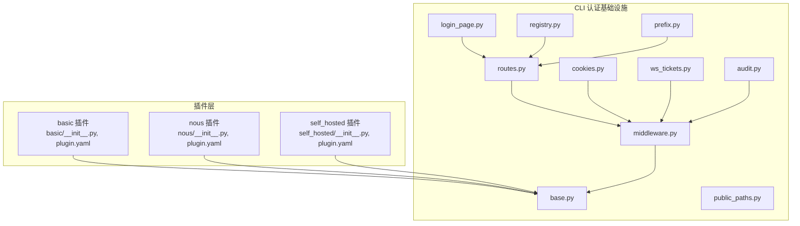
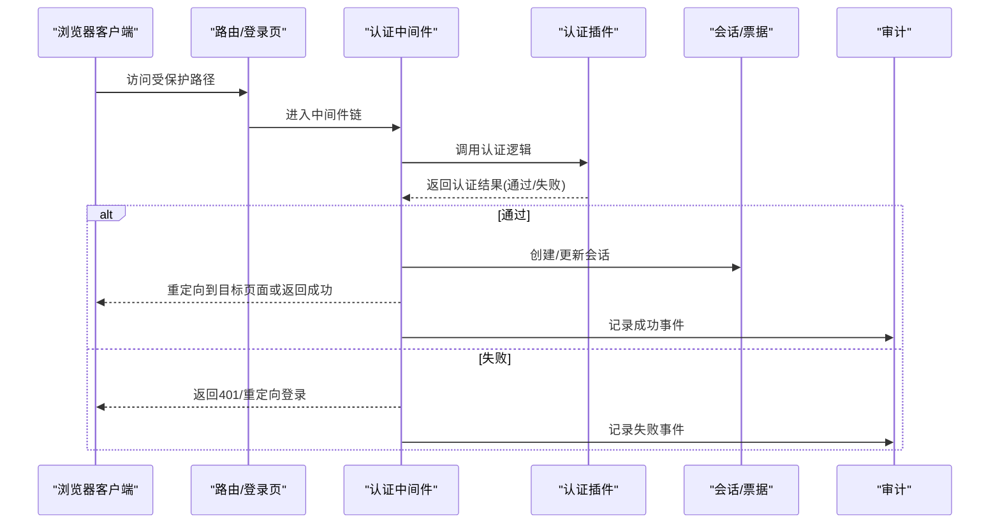
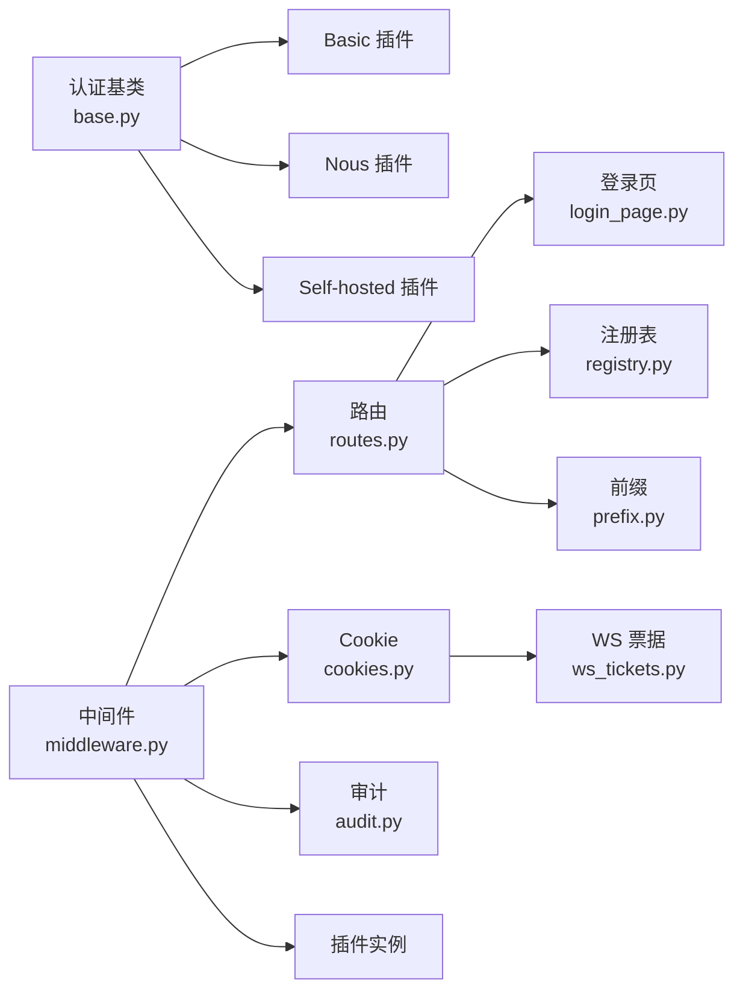
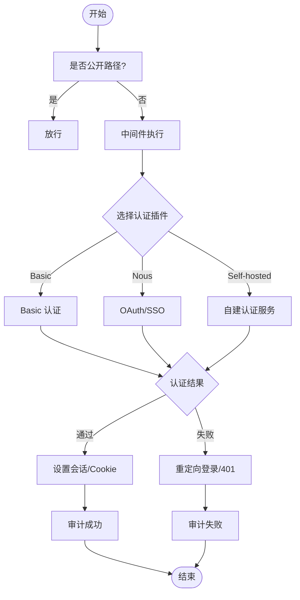

# 仪表板认证插件

<cite>
**本文引用的文件**
- [plugins/dashboard_auth/basic/__init__.py](file://plugins/dashboard_auth/basic/__init__.py)
- [plugins/dashboard_auth/basic/plugin.yaml](file://plugins/dashboard_auth/basic/plugin.yaml)
- [plugins/dashboard_auth/nous/__init__.py](file://plugins/dashboard_auth/nous/__init__.py)
- [plugins/dashboard_auth/nous/plugin.yaml](file://plugins/dashboard_auth/nous/plugin.yaml)
- [plugins/dashboard_auth/self_hosted/__init__.py](file://plugins/dashboard_auth/self_hosted/__init__.py)
- [plugins/dashboard_auth/self_hosted/plugin.yaml](file://plugins/dashboard_auth/self_hosted/plugin.yaml)
- [hermes_cli/dashboard_auth/base.py](file://hermes_cli/dashboard_auth/base.py)
- [hermes_cli/dashboard_auth/middleware.py](file://hermes_cli/dashboard_auth/middleware.py)
- [hermes_cli/dashboard_auth/public_paths.py](file://hermes_cli/dashboard_auth/public_paths.py)
- [hermes_cli/dashboard_auth/cookies.py](file://hermes_cli/dashboard_auth/cookies.py)
- [hermes_cli/dashboard_auth/ws_tickets.py](file://hermes_cli/dashboard_auth/ws_tickets.py)
- [hermes_cli/dashboard_auth/routes.py](file://hermes_cli/dashboard_auth/routes.py)
- [hermes_cli/dashboard_auth/login_page.py](file://hermes_cli/dashboard_auth/login_page.py)
- [hermes_cli/dashboard_auth/registry.py](file://hermes_cli/dashboard_auth/registry.py)
- [hermes_cli/dashboard_auth/prefix.py](file://hermes_cli/dashboard_auth/prefix.py)
- [hermes_cli/dashboard_auth/audit.py](file://hermes_cli/dashboard_auth/audit.py)
- [tests/hermes_cli/test_dashboard_auth_401_reauth.py](file://tests/hermes_cli/test_dashboard_auth_401_reauth.py)
- [tests/hermes_cli/test_dashboard_auth_audit.py](file://tests/hermes_cli/test_dashboard_auth_audit.py)
</cite>

## 目录
1. [简介](#简介)
2. [项目结构](#项目结构)
3. [核心组件](#核心组件)
4. [架构总览](#架构总览)
5. [详细组件分析](#详细组件分析)
6. [依赖关系分析](#依赖关系分析)
7. [性能考量](#性能考量)
8. [故障排除指南](#故障排除指南)
9. [结论](#结论)
10. [附录](#附录)

## 简介
本文件为 Hermes Agent 仪表板认证插件的技术文档，覆盖三大认证模式：Basic 认证、Nous 认证与 Self-hosted 认证。文档从系统架构、组件关系、数据流与处理逻辑入手，详细说明认证流程、令牌管理与会话处理，并提供配置示例、安全考虑与故障排除指南。同时给出开发、测试与部署流程建议，帮助开发者快速理解与扩展认证能力。

## 项目结构
仪表板认证插件由两部分组成：
- 插件层（plugins/dashboard_auth）：定义三种认证插件的具体实现与清单文件（plugin.yaml）
- CLI 层（hermes_cli/dashboard_auth）：提供认证中间件、路由、会话与审计等通用基础设施

图表来源
- [plugins/dashboard_auth/basic/__init__.py](file://plugins/dashboard_auth/basic/__init__.py)
- [plugins/dashboard_auth/nous/__init__.py](file://plugins/dashboard_auth/nous/__init__.py)
- [plugins/dashboard_auth/self_hosted/__init__.py](file://plugins/dashboard_auth/self_hosted/__init__.py)
- [hermes_cli/dashboard_auth/base.py](file://hermes_cli/dashboard_auth/base.py)
- [hermes_cli/dashboard_auth/middleware.py](file://hermes_cli/dashboard_auth/middleware.py)
- [hermes_cli/dashboard_auth/routes.py](file://hermes_cli/dashboard_auth/routes.py)

章节来源
- [plugins/dashboard_auth/basic/plugin.yaml](file://plugins/dashboard_auth/basic/plugin.yaml)
- [plugins/dashboard_auth/nous/plugin.yaml](file://plugins/dashboard_auth/nous/plugin.yaml)
- [plugins/dashboard_auth/self_hosted/plugin.yaml](file://plugins/dashboard_auth/self_hosted/plugin.yaml)
- [hermes_cli/dashboard_auth/base.py](file://hermes_cli/dashboard_auth/base.py)
- [hermes_cli/dashboard_auth/middleware.py](file://hermes_cli/dashboard_auth/middleware.py)
- [hermes_cli/dashboard_auth/routes.py](file://hermes_cli/dashboard_auth/routes.py)

## 核心组件
- 认证基类与接口：定义认证插件的统一抽象与生命周期钩子
- 中间件：负责请求拦截、权限校验、重定向与会话维护
- 路由与页面：登录页渲染、公开路径白名单、WebSocket 会话票据
- Cookie 与会话：Cookie 设置与解析、会话状态管理
- 注册表与前缀：认证插件注册、URL 前缀映射
- 审计：认证事件记录与审计日志

章节来源
- [hermes_cli/dashboard_auth/base.py](file://hermes_cli/dashboard_auth/base.py)
- [hermes_cli/dashboard_auth/middleware.py](file://hermes_cli/dashboard_auth/middleware.py)
- [hermes_cli/dashboard_auth/public_paths.py](file://hermes_cli/dashboard_auth/public_paths.py)
- [hermes_cli/dashboard_auth/cookies.py](file://hermes_cli/dashboard_auth/cookies.py)
- [hermes_cli/dashboard_auth/ws_tickets.py](file://hermes_cli/dashboard_auth/ws_tickets.py)
- [hermes_cli/dashboard_auth/routes.py](file://hermes_cli/dashboard_auth/routes.py)
- [hermes_cli/dashboard_auth/login_page.py](file://hermes_cli/dashboard_auth/login_page.py)
- [hermes_cli/dashboard_auth/registry.py](file://hermes_cli/dashboard_auth/registry.py)
- [hermes_cli/dashboard_auth/prefix.py](file://hermes_cli/dashboard_auth/prefix.py)
- [hermes_cli/dashboard_auth/audit.py](file://hermes_cli/dashboard_auth/audit.py)

## 架构总览
仪表板认证的整体工作流如下：

图表来源
- [hermes_cli/dashboard_auth/middleware.py](file://hermes_cli/dashboard_auth/middleware.py)
- [hermes_cli/dashboard_auth/routes.py](file://hermes_cli/dashboard_auth/routes.py)
- [hermes_cli/dashboard_auth/audit.py](file://hermes_cli/dashboard_auth/audit.py)
- [hermes_cli/dashboard_auth/ws_tickets.py](file://hermes_cli/dashboard_auth/ws_tickets.py)

## 详细组件分析

### Basic 认证插件
- 实现要点
  - 使用用户名/密码进行认证
  - 通过插件清单声明入口与参数
  - 与中间件协作完成登录、会话建立与登出
- 配置项
  - 用户名与密码存储方式（明文/密钥管理）
  - 登录后跳转路径
  - 会话过期策略
- 典型流程
  - 用户提交凭据 → 中间件调用插件 → 验证通过 → 写入 Cookie/会话 → 审计记录

章节来源
- [plugins/dashboard_auth/basic/__init__.py](file://plugins/dashboard_auth/basic/__init__.py)
- [plugins/dashboard_auth/basic/plugin.yaml](file://plugins/dashboard_auth/basic/plugin.yaml)
- [hermes_cli/dashboard_auth/middleware.py](file://hermes_cli/dashboard_auth/middleware.py)
- [hermes_cli/dashboard_auth/cookies.py](file://hermes_cli/dashboard_auth/cookies.py)
- [hermes_cli/dashboard_auth/audit.py](file://hermes_cli/dashboard_auth/audit.py)

### Nous 认证插件
- 实现要点
  - 与 Nous 平台的 OAuth/SSO 集成
  - 通过回调地址完成授权码交换与用户信息获取
- 配置项
  - 客户端 ID/密钥
  - 回调地址
  - 用户域/组限制
- 典型流程
  - 重定向至 Nous 授权 → 回调接收授权码 → 交换访问令牌 → 建立本地会话 → 审计记录

章节来源
- [plugins/dashboard_auth/nous/__init__.py](file://plugins/dashboard_auth/nous/__init__.py)
- [plugins/dashboard_auth/nous/plugin.yaml](file://plugins/dashboard_auth/nous/plugin.yaml)
- [hermes_cli/dashboard_auth/routes.py](file://hermes_cli/dashboard_auth/routes.py)
- [hermes_cli/dashboard_auth/middleware.py](file://hermes_cli/dashboard_auth/middleware.py)
- [hermes_cli/dashboard_auth/audit.py](file://hermes_cli/dashboard_auth/audit.py)

### Self-hosted 认证插件
- 实现要点
  - 自建认证服务对接（如 LDAP、自定义 OIDC）
  - 支持多因子与企业级策略
- 配置项
  - 认证服务地址与端点
  - TLS/证书校验
  - 用户属性映射
- 典型流程
  - 用户输入凭据 → 转发至自建认证服务 → 成功后颁发内部票据/会话 → 审计记录

章节来源
- [plugins/dashboard_auth/self_hosted/__init__.py](file://plugins/dashboard_auth/self_hosted/__init__.py)
- [plugins/dashboard_auth/self_hosted/plugin.yaml](file://plugins/dashboard_auth/self_hosted/plugin.yaml)
- [hermes_cli/dashboard_auth/middleware.py](file://hermes_cli/dashboard_auth/middleware.py)
- [hermes_cli/dashboard_auth/ws_tickets.py](file://hermes_cli/dashboard_auth/ws_tickets.py)
- [hermes_cli/dashboard_auth/audit.py](file://hermes_cli/dashboard_auth/audit.py)

### 通用基础设施
- 中间件
  - 拦截请求、识别公开路径、执行认证插件、处理重定向与错误
- 路由与登录页
  - 统一的登录页渲染与受保护资源路由
- Cookie 与会话
  - Cookie 设置、解析与会话状态维护；支持 WebSocket 会话票据
- 注册表与前缀
  - 插件注册与 URL 前缀映射，便于多插件共存
- 审计
  - 记录认证成功/失败事件，支持后续合规与追踪

章节来源
- [hermes_cli/dashboard_auth/middleware.py](file://hermes_cli/dashboard_auth/middleware.py)
- [hermes_cli/dashboard_auth/routes.py](file://hermes_cli/dashboard_auth/routes.py)
- [hermes_cli/dashboard_auth/login_page.py](file://hermes_cli/dashboard_auth/login_page.py)
- [hermes_cli/dashboard_auth/cookies.py](file://hermes_cli/dashboard_auth/cookies.py)
- [hermes_cli/dashboard_auth/ws_tickets.py](file://hermes_cli/dashboard_auth/ws_tickets.py)
- [hermes_cli/dashboard_auth/registry.py](file://hermes_cli/dashboard_auth/registry.py)
- [hermes_cli/dashboard_auth/prefix.py](file://hermes_cli/dashboard_auth/prefix.py)
- [hermes_cli/dashboard_auth/audit.py](file://hermes_cli/dashboard_auth/audit.py)

## 依赖关系分析
认证插件之间的耦合度低，通过统一的基类与中间件解耦。插件与基础设施之间采用接口契约，避免直接依赖具体实现。

图表来源
- [hermes_cli/dashboard_auth/base.py](file://hermes_cli/dashboard_auth/base.py)
- [plugins/dashboard_auth/basic/__init__.py](file://plugins/dashboard_auth/basic/__init__.py)
- [plugins/dashboard_auth/nous/__init__.py](file://plugins/dashboard_auth/nous/__init__.py)
- [plugins/dashboard_auth/self_hosted/__init__.py](file://plugins/dashboard_auth/self_hosted/__init__.py)
- [hermes_cli/dashboard_auth/middleware.py](file://hermes_cli/dashboard_auth/middleware.py)
- [hermes_cli/dashboard_auth/routes.py](file://hermes_cli/dashboard_auth/routes.py)
- [hermes_cli/dashboard_auth/login_page.py](file://hermes_cli/dashboard_auth/login_page.py)
- [hermes_cli/dashboard_auth/cookies.py](file://hermes_cli/dashboard_auth/cookies.py)
- [hermes_cli/dashboard_auth/ws_tickets.py](file://hermes_cli/dashboard_auth/ws_tickets.py)
- [hermes_cli/dashboard_auth/registry.py](file://hermes_cli/dashboard_auth/registry.py)
- [hermes_cli/dashboard_auth/prefix.py](file://hermes_cli/dashboard_auth/prefix.py)
- [hermes_cli/dashboard_auth/audit.py](file://hermes_cli/dashboard_auth/audit.py)

## 性能考量
- 中间件短路：对公开路径与已认证请求应尽快放行，减少不必要的插件调用
- 会话缓存：在高并发场景下，建议将会话状态缓存于内存或共享存储，降低数据库/外部服务压力
- 审计异步化：审计写入可异步化，避免阻塞主请求链路
- 插件选择：根据部署环境选择轻量级插件（如 Basic），在需要时再启用复杂插件（如 Nous 或 Self-hosted）

## 故障排除指南
- 401 未授权自动重认证
  - 现象：访问受保护资源返回 401，客户端被重定向至登录页
  - 排查：确认中间件是否正确识别未认证状态；检查 Cookie 是否设置；核对公开路径白名单
  - 参考测试：[tests/hermes_cli/test_dashboard_auth_401_reauth.py](file://tests/hermes_cli/test_dashboard_auth_401_reauth.py)
- 审计日志缺失
  - 现象：认证事件未记录
  - 排查：确认审计模块是否启用；检查日志输出级别；验证中间件是否调用审计接口
  - 参考测试：[tests/hermes_cli/test_dashboard_auth_audit.py](file://tests/hermes_cli/test_dashboard_auth_audit.py)
- WebSocket 会话异常
  - 现象：WebSocket 连接无法通过认证
  - 排查：确认 WS 票据生成与传递流程；核对票据有效期与签名；检查前缀与路由匹配
  - 参考模块：[hermes_cli/dashboard_auth/ws_tickets.py](file://hermes_cli/dashboard_auth/ws_tickets.py)
- 登录页渲染问题
  - 现象：登录页无法显示或样式异常
  - 排查：确认路由映射与静态资源路径；检查模板与前端资源打包
  - 参考模块：[hermes_cli/dashboard_auth/routes.py](file://hermes_cli/dashboard_auth/routes.py)，[hermes_cli/dashboard_auth/login_page.py](file://hermes_cli/dashboard_auth/login_page.py)

章节来源
- [tests/hermes_cli/test_dashboard_auth_401_reauth.py](file://tests/hermes_cli/test_dashboard_auth_401_reauth.py)
- [tests/hermes_cli/test_dashboard_auth_audit.py](file://tests/hermes_cli/test_dashboard_auth_audit.py)
- [hermes_cli/dashboard_auth/ws_tickets.py](file://hermes_cli/dashboard_auth/ws_tickets.py)
- [hermes_cli/dashboard_auth/routes.py](file://hermes_cli/dashboard_auth/routes.py)
- [hermes_cli/dashboard_auth/login_page.py](file://hermes_cli/dashboard_auth/login_page.py)

## 结论
仪表板认证插件通过清晰的分层设计与统一的中间件机制，实现了对多种认证模式的支持。Basic、Nous 与 Self-hosted 插件分别面向不同部署场景，既保证了易用性，又兼顾了安全性与可扩展性。结合会话管理、Cookie 与审计功能，整体方案具备良好的生产可用性。

## 附录

### 认证流程对比（流程图）

图表来源
- [hermes_cli/dashboard_auth/middleware.py](file://hermes_cli/dashboard_auth/middleware.py)
- [hermes_cli/dashboard_auth/cookies.py](file://hermes_cli/dashboard_auth/cookies.py)
- [hermes_cli/dashboard_auth/audit.py](file://hermes_cli/dashboard_auth/audit.py)
- [plugins/dashboard_auth/basic/__init__.py](file://plugins/dashboard_auth/basic/__init__.py)
- [plugins/dashboard_auth/nous/__init__.py](file://plugins/dashboard_auth/nous/__init__.py)
- [plugins/dashboard_auth/self_hosted/__init__.py](file://plugins/dashboard_auth/self_hosted/__init__.py)

### 配置示例（路径指引）
- Basic 插件清单：[plugins/dashboard_auth/basic/plugin.yaml](file://plugins/dashboard_auth/basic/plugin.yaml)
- Nous 插件清单：[plugins/dashboard_auth/nous/plugin.yaml](file://plugins/dashboard_auth/nous/plugin.yaml)
- Self-hosted 插件清单：[plugins/dashboard_auth/self_hosted/plugin.yaml](file://plugins/dashboard_auth/self_hosted/plugin.yaml)
- 中间件与路由：[hermes_cli/dashboard_auth/middleware.py](file://hermes_cli/dashboard_auth/middleware.py)，[hermes_cli/dashboard_auth/routes.py](file://hermes_cli/dashboard_auth/routes.py)
- Cookie 与会话：[hermes_cli/dashboard_auth/cookies.py](file://hermes_cli/dashboard_auth/cookies.py)，[hermes_cli/dashboard_auth/ws_tickets.py](file://hermes_cli/dashboard_auth/ws_tickets.py)
- 审计：[hermes_cli/dashboard_auth/audit.py](file://hermes_cli/dashboard_auth/audit.py)

### 开发、测试与部署流程
- 开发
  - 在对应插件目录新增认证逻辑与清单文件
  - 扩展中间件以支持新插件的路由与会话
  - 编写单元测试与集成测试
- 测试
  - 使用现有测试用例作为参考：[tests/hermes_cli/test_dashboard_auth_401_reauth.py](file://tests/hermes_cli/test_dashboard_auth_401_reauth.py)，[tests/hermes_cli/test_dashboard_auth_audit.py](file://tests/hermes_cli/test_dashboard_auth_audit.py)
- 部署
  - 将插件清单与实现打包发布
  - 在运行环境中启用相应插件并配置参数
  - 配置公开路径白名单与安全头（HTTPS、SameSite、HttpOnly 等）