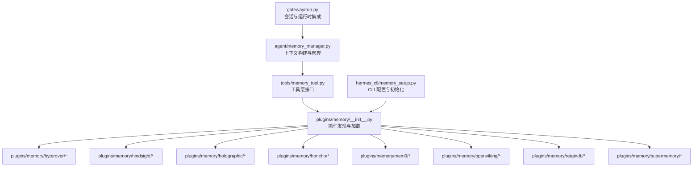
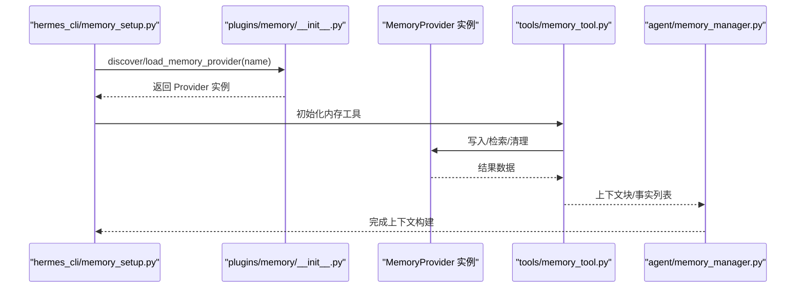
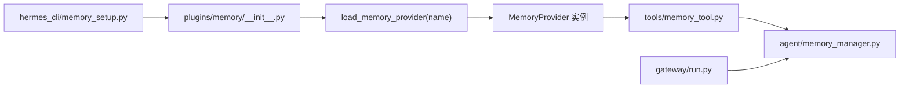

# 内存插件

<cite>
**本文引用的文件**
- [plugins/memory/__init__.py](file://plugins/memory/__init__.py)
- [plugins/memory/byterover/plugin.yaml](file://plugins/memory/byterover/plugin.yaml)
- [plugins/memory/hindsight/plugin.yaml](file://plugins/memory/hindsight/plugin.yaml)
- [plugins/memory/holographic/plugin.yaml](file://plugins/memory/holographic/plugin.yaml)
- [plugins/memory/honcho/plugin.yaml](file://plugins/memory/honcho/plugin.yaml)
- [plugins/memory/mem0/plugin.yaml](file://plugins/memory/mem0/plugin.yaml)
- [plugins/memory/openviking/plugin.yaml](file://plugins/memory/openviking/plugin.yaml)
- [plugins/memory/retaindb/plugin.yaml](file://plugins/memory/retaindb/plugin.yaml)
- [plugins/memory/supermemory/plugin.yaml](file://plugins/memory/supermemory/plugin.yaml)
- [agent/memory_manager.py](file://agent/memory_manager.py)
- [agent/memory_provider.py](file://agent/memory_provider.py)
- [tools/memory_tool.py](file://tools/memory_tool.py)
- [hermes_cli/memory_setup.py](file://hermes_cli/memory_setup.py)
- [hermes_cli/main.py](file://hermes_cli/main.py)
- [hermes_cli/doctor.py](file://hermes_cli/doctor.py)
- [gateway/run.py](file://gateway/run.py)
</cite>

## 目录
1. [简介](#简介)
2. [项目结构](#项目结构)
3. [核心组件](#核心组件)
4. [架构总览](#架构总览)
5. [详细组件分析](#详细组件分析)
6. [依赖关系分析](#依赖关系分析)
7. [性能考量](#性能考量)
8. [故障排查指南](#故障排查指南)
9. [结论](#结论)
10. [附录](#附录)

## 简介
本技术文档聚焦于 Hermes Agent 的内存插件体系，系统性阐述内存插件的功能特性、数据模型与配置方式，并针对 Byterover、Hindsight、Holographic、Honcho、Mem0、OpenViking、RetainDB 和 SuperMemory 八类插件给出使用场景、检索机制、持久化策略与性能优化建议。同时提供插件选择指南、配置示例路径、最佳实践以及开发、测试与部署流程说明，帮助用户在不同业务需求下高效落地。

## 项目结构
内存插件位于 plugins/memory 目录下，每个子目录代表一个独立的内存提供者插件，均通过统一的发现与加载机制接入 Hermes Agent。核心入口与加载逻辑由 plugins/memory/__init__.py 提供；各插件以 plugin.yaml 描述元数据与配置项；Agent 在运行时通过工具层与管理器层调用内存插件完成上下文构建与事实存储。

**图示来源**
- [plugins/memory/__init__.py:90-216](file://plugins/memory/__init__.py#L90-L216)
- [agent/memory_manager.py:1-100](file://agent/memory_manager.py#L1-L100)
- [tools/memory_tool.py:1-100](file://tools/memory_tool.py#L1-L100)
- [hermes_cli/memory_setup.py:1-200](file://hermes_cli/memory_setup.py#L1-L200)
- [gateway/run.py:15700-16250](file://gateway/run.py#L15700-L16250)

**章节来源**
- [plugins/memory/__init__.py:90-216](file://plugins/memory/__init__.py#L90-L216)

## 核心组件
- 插件发现与加载
  - 发现机制：扫描内置 plugins/memory/<name>/ 与用户插件目录 $HERMES_HOME/plugins/<name>/，内置优先。
  - 加载策略：支持两种模式实例化提供者：注册函数式（register）或类继承式（MemoryProvider 子类）。
- 统一接口契约
  - 插件需暴露 MemoryProvider 实例或注册函数，以便上层按名称加载与调用。
- 工具层与运行时集成
  - tools/memory_tool.py 暴露内存工具接口，供 Agent 执行“写入/检索/清理”等操作。
  - agent/memory_manager.py 负责将内存结果整合进对话上下文，gateway/run.py 在会话生命周期中触发刷新与清理。

**章节来源**
- [plugins/memory/__init__.py:74-216](file://plugins/memory/__init__.py#L74-L216)
- [agent/memory_manager.py:1-100](file://agent/memory_manager.py#L1-L100)
- [tools/memory_tool.py:1-100](file://tools/memory_tool.py#L1-L100)
- [gateway/run.py:15700-16250](file://gateway/run.py#L15700-L16250)

## 架构总览
内存插件采用“插件发现—加载—实例化—工具调用—上下文融合”的分层架构。CLI 与网关负责初始化与调度，工具层封装具体操作，内存提供者负责数据持久化与检索。

**图示来源**
- [hermes_cli/memory_setup.py:150-200](file://hermes_cli/memory_setup.py#L150-L200)
- [plugins/memory/__init__.py:183-216](file://plugins/memory/__init__.py#L183-L216)
- [tools/memory_tool.py:1-100](file://tools/memory_tool.py#L1-100)
- [agent/memory_manager.py:1-100](file://agent/memory_manager.py#L1-L100)

## 详细组件分析

### Byterover
- 使用场景
  - 需要基于时间序列与事件流的事实存储，适合需要“何时发生何事”的强时序记忆。
- 数据模型
  - 以事件为中心的事实条目，包含时间戳、主体、客体、动作与上下文标签。
- 检索机制
  - 支持按时间窗口、标签过滤与关键词检索，可组合多条件进行召回。
- 配置要点
  - 通过 plugin.yaml 定义存储路径、索引策略与默认保留周期。
- 性能优化
  - 合理设置批量写入阈值与异步刷盘，避免高频小写入导致的抖动。

**章节来源**
- [plugins/memory/byterover/plugin.yaml:1-200](file://plugins/memory/byterover/plugin.yaml#L1-L200)

### Hindsight
- 使用场景
  - 强调“事后回顾”的记忆增强，适合需要从历史经验中提炼规律与教训的场景。
- 数据模型
  - 事实+反思维度，反思可包含总结、建议与风险提示。
- 检索机制
  - 基于事实检索后，叠加反思权重排序，提升高价值回顾内容的可见性。
- 配置要点
  - 反思生成开关、权重参数与缓存策略在 plugin.yaml 中定义。
- 性能优化
  - 对反思计算进行延迟与批处理，避免阻塞主流程。

**章节来源**
- [plugins/memory/hindsight/plugin.yaml:1-200](file://plugins/memory/hindsight/plugin.yaml#L1-L200)

### Holographic
- 使用场景
  - 需要高维关联与跨域知识融合的记忆系统，适合复杂推理与跨领域问题求解。
- 数据模型
  - 将事实映射到高维向量空间，支持语义相似度检索与聚类。
- 检索机制
  - 向量化检索 + 多模态特征融合，支持模糊匹配与近邻搜索。
- 配置要点
  - 向量维度、相似度阈值与索引类型在 plugin.yaml 中配置。
- 性能优化
  - 使用近似最近邻索引（如 IVF/PQ）平衡精度与速度。

**章节来源**
- [plugins/memory/holographic/plugin.yaml:1-200](file://plugins/memory/holographic/plugin.yaml#L1-L200)

### Honcho
- 使用场景
  - 企业级知识库与合规记忆，强调访问控制与审计追踪。
- 数据模型
  - 事实+权限标签+审计日志，支持细粒度访问控制与变更追踪。
- 检索机制
  - 基于角色的权限过滤 + 内容检索，确保返回结果符合当前会话权限。
- 配置要点
  - 认证与授权策略、审计开关、配置文件路径解析在 Honcho 插件中实现。
- 性能优化
  - 权限过滤前置化，减少无效检索；缓存热点权限范围。

**章节来源**
- [plugins/memory/honcho/plugin.yaml:1-200](file://plugins/memory/honcho/plugin.yaml#L1-L200)
- [hermes_cli/doctor.py:2018-2080](file://hermes_cli/doctor.py#L2018-L2080)
- [gateway/run.py:15747-16203](file://gateway/run.py#L15747-L16203)

### Mem0
- 使用场景
  - 开源社区驱动的记忆系统，强调易用与可扩展性，适合快速原型与中小规模应用。
- 数据模型
  - 事实+标签+元数据，支持结构化与非结构化混合存储。
- 检索机制
  - 基于关键词与语义的混合检索，支持标签筛选与时间过滤。
- 配置要点
  - 通过 _load_config 加载插件配置，包括数据库连接与索引参数。
- 性能优化
  - 合理设置分页与并发，避免大查询阻塞。

**章节来源**
- [plugins/memory/mem0/plugin.yaml:1-200](file://plugins/memory/mem0/plugin.yaml#L1-L200)
- [hermes_cli/doctor.py:2055-2060](file://hermes_cli/doctor.py#L2055-L2060)

### OpenViking
- 使用场景
  - 面向开放生态的记忆系统，强调与第三方服务的集成能力。
- 数据模型
  - 事实+外部标识符+同步状态，便于与外部系统对齐。
- 检索机制
  - 支持本地检索与外部同步检索的混合模式。
- 配置要点
  - 外部服务凭据、同步策略与冲突解决规则在 plugin.yaml 中定义。
- 性能优化
  - 异步同步与增量更新，降低网络开销。

**章节来源**
- [plugins/memory/openviking/plugin.yaml:1-200](file://plugins/memory/openviking/plugin.yaml#L1-L200)

### RetainDB
- 使用场景
  - 高可靠持久化与长周期记忆，适合需要长期演进与版本化的场景。
- 数据模型
  - 事实+版本号+快照，支持回滚与版本对比。
- 检索机制
  - 基于版本的时间线检索，支持快照级回放。
- 配置要点
  - 版本保留策略、快照间隔与压缩参数在 plugin.yaml 中配置。
- 性能优化
  - 分层存储与冷热分离，减少热数据写放大。

**章节来源**
- [plugins/memory/retaindb/plugin.yaml:1-200](file://plugins/memory/retaindb/plugin.yaml#L1-L200)

### SuperMemory
- 使用场景
  - 超大规模与高并发场景下的记忆系统，强调扩展性与稳定性。
- 数据模型
  - 事实+分区键+副本一致性，支持水平扩展与多活部署。
- 检索机制
  - 分区路由 + 广播检索，结合去重与合并策略。
- 配置要点
  - 分区数量、副本数与一致性级别在 plugin.yaml 中定义。
- 性能优化
  - 读写分离、批量合并与背压控制，保障吞吐与延迟。

**章节来源**
- [plugins/memory/supermemory/plugin.yaml:1-200](file://plugins/memory/supermemory/plugin.yaml#L1-L200)

## 依赖关系分析
- 插件发现与加载
  - plugins/memory/__init__.py 提供 discover/load/find 等函数，统一管理插件目录与实例化。
- 运行时集成
  - agent/memory_manager.py 依赖 MemoryProvider 接口，将检索结果注入上下文。
  - tools/memory_tool.py 作为工具层桥接，屏蔽具体插件差异。
  - hermes_cli/memory_setup.py 负责 CLI 初始化与配置下发。
  - gateway/run.py 在会话生命周期内触发上下文刷新与清理。

**图示来源**
- [plugins/memory/__init__.py:183-216](file://plugins/memory/__init__.py#L183-L216)
- [tools/memory_tool.py:1-100](file://tools/memory_tool.py#L1-L100)
- [agent/memory_manager.py:1-100](file://agent/memory_manager.py#L1-L100)
- [hermes_cli/memory_setup.py:150-200](file://hermes_cli/memory_setup.py#L150-L200)
- [gateway/run.py:15700-16250](file://gateway/run.py#L15700-L16250)

**章节来源**
- [plugins/memory/__init__.py:90-216](file://plugins/memory/__init__.py#L90-L216)
- [agent/memory_manager.py:1-100](file://agent/memory_manager.py#L1-L100)
- [tools/memory_tool.py:1-100](file://tools/memory_tool.py#L1-L100)
- [hermes_cli/memory_setup.py:150-200](file://hermes_cli/memory_setup.py#L150-L200)
- [gateway/run.py:15700-16250](file://gateway/run.py#L15700-L16250)

## 性能考量
- 写入路径
  - 批量写入：聚合小事务，降低磁盘与网络开销。
  - 异步刷盘：后台落盘，避免阻塞主线程。
  - 增量更新：仅写入变化，减少全量覆盖。
- 检索路径
  - 索引预热：启动阶段加载常用索引，缩短首次查询延迟。
  - 缓存策略：热点事实与检索结果缓存，命中率优先。
  - 过滤前置：权限与标签过滤尽量前置，缩小候选集。
- 存储路径
  - 分层存储：热数据驻内存/SSD，冷数据归档至HDD/对象存储。
  - 压缩与去重：压缩编码与重复消除，降低存储与带宽成本。
- 并发与一致性
  - 读写分离：写入独占锁，读取共享锁，提高并发。
  - 版本化：MVCC 或乐观锁，减少写间冲突。
  - 背压控制：在高负载时限制写入速率，保护下游。

## 故障排查指南
- 插件未发现或加载失败
  - 检查插件目录是否存在 __init__.py 且包含注册或类定义。
  - 查看加载日志，确认名称解析与优先级（内置优先于用户安装）。
- 配置错误
  - 确认 plugin.yaml 中关键字段完整，如连接串、索引参数、权限策略等。
  - 使用 hermes_cli/doctor.py 的诊断命令验证配置有效性。
- 检索异常
  - 核对检索条件与过滤器是否正确，关注权限与标签匹配。
  - 检查索引完整性与重建策略。
- 性能退化
  - 观察写入延迟与查询耗时，评估批量大小与并发度。
  - 检查缓存命中率与存储层 IOPS，必要时调整分层策略。

**章节来源**
- [plugins/memory/__init__.py:183-216](file://plugins/memory/__init__.py#L183-L216)
- [hermes_cli/doctor.py:2018-2080](file://hermes_cli/doctor.py#L2018-L2080)

## 结论
Hermes Agent 的内存插件体系通过统一的发现与加载机制，为多样化的记忆需求提供了灵活可扩展的解决方案。不同插件在数据模型、检索与持久化方面各有侧重，用户应根据场景选择合适的插件，并结合配置与性能优化策略获得稳定高效的体验。

## 附录

### 插件选择指南
- 快速原型与开源友好：Mem0
- 企业合规与权限控制：Honcho
- 高维关联与跨域推理：Holographic
- 事后回顾与经验提炼：Hindsight
- 长期演进与版本化：RetainDB
- 大规模与高并发：SuperMemory
- 开放生态与外部集成：OpenViking
- 时序事件与强时间线：Byterover

### 配置示例与最佳实践
- 配置示例路径
  - 各插件配置参考其 plugin.yaml 文件，例如：
    - [plugins/memory/byterover/plugin.yaml](file://plugins/memory/byterover/plugin.yaml)
    - [plugins/memory/hindsight/plugin.yaml](file://plugins/memory/hindsight/plugin.yaml)
    - [plugins/memory/holographic/plugin.yaml](file://plugins/memory/holographic/plugin.yaml)
    - [plugins/memory/honcho/plugin.yaml](file://plugins/memory/honcho/plugin.yaml)
    - [plugins/memory/mem0/plugin.yaml](file://plugins/memory/mem0/plugin.yaml)
    - [plugins/memory/openviking/plugin.yaml](file://plugins/memory/openviking/plugin.yaml)
    - [plugins/memory/retaindb/plugin.yaml](file://plugins/memory/retaindb/plugin.yaml)
    - [plugins/memory/supermemory/plugin.yaml](file://plugins/memory/supermemory/plugin.yaml)
- 最佳实践
  - 明确数据模型与检索边界，避免过度耦合。
  - 设定合理的保留策略与清理计划，控制存储成本。
  - 在高并发场景下启用异步与批处理，配合缓存与索引优化。
  - 使用 CLI 与网关提供的初始化与诊断工具，确保配置正确。

### 开发、测试与部署流程
- 开发
  - 在 plugins/memory/<your_provider>/ 下创建目录与 __init__.py，实现 MemoryProvider 或注册函数。
  - 在 plugin.yaml 中声明配置项与依赖。
- 测试
  - 使用 hermes_cli/memory_setup.py 进行初始化与连通性测试。
  - 在单元测试中模拟工具层调用，验证写入/检索/清理行为。
- 部署
  - 将插件目录放入内置 plugins/memory/<name>/ 或用户插件目录 $HERMES_HOME/plugins/<name>/。
  - 通过 hermes_cli/main.py 的相关命令完成插件注册与启用。
  - 在网关会话中验证上下文构建与事实注入。

**章节来源**
- [hermes_cli/memory_setup.py:150-200](file://hermes_cli/memory_setup.py#L150-L200)
- [hermes_cli/main.py:10805-11802](file://hermes_cli/main.py#L10805-L11802)
- [plugins/memory/__init__.py:90-216](file://plugins/memory/__init__.py#L90-L216)