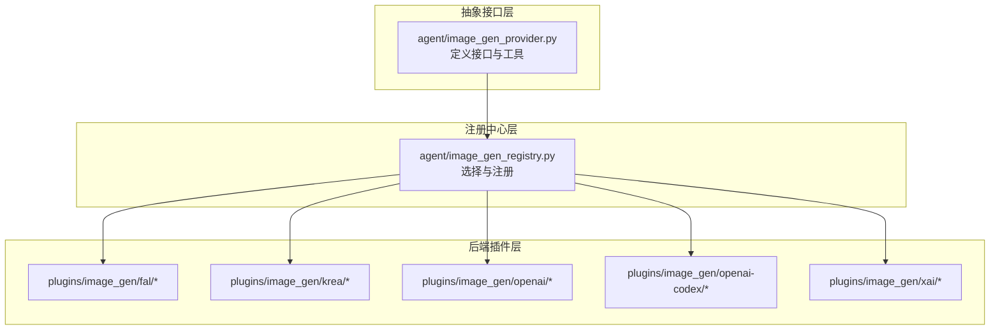
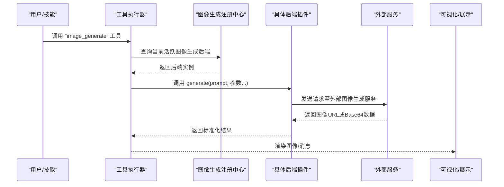
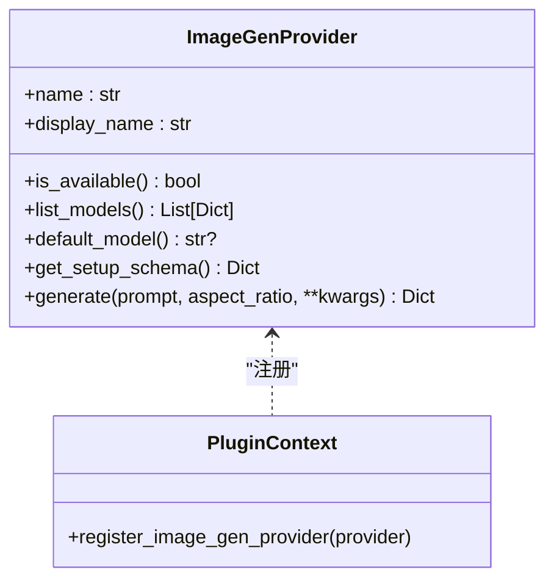
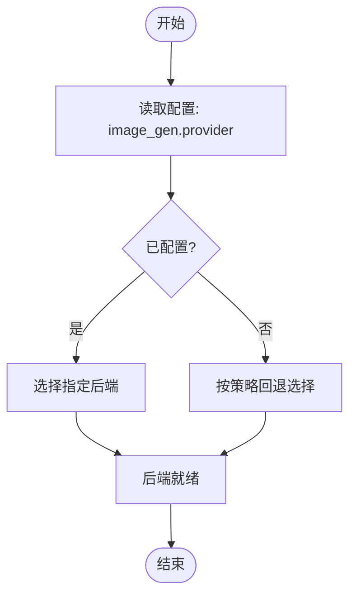
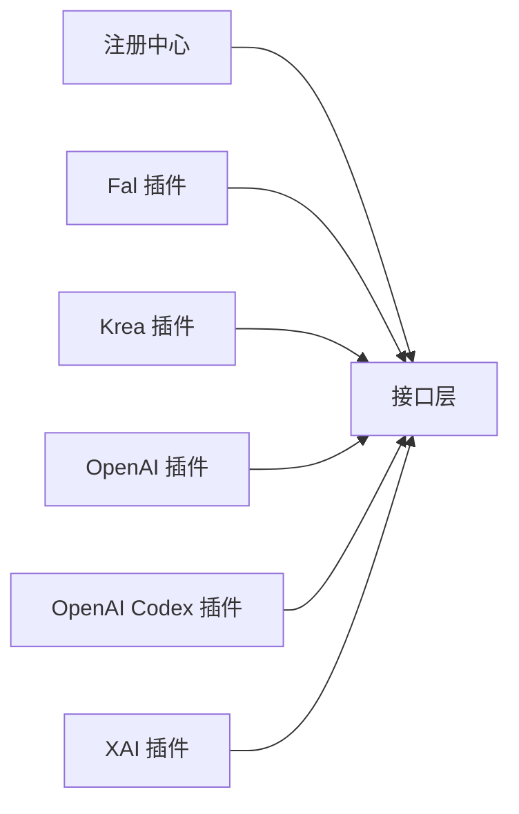

# 图像生成插件

<cite>
**本文引用的文件**
- [agent/image_gen_provider.py](file://agent/image_gen_provider.py)
- [agent/image_gen_registry.py](file://agent/image_gen_registry.py)
- [plugins/image_gen/fal/plugin.yaml](file://plugins/image_gen/fal/plugin.yaml)
- [plugins/image_gen/krea/plugin.yaml](file://plugins/image_gen/krea/plugin.yaml)
- [plugins/image_gen/openai/plugin.yaml](file://plugins/image_gen/openai/plugin.yaml)
- [plugins/image_gen/openai-codex/plugin.yaml](file://plugins/image_gen/openai-codex/plugin.yaml)
- [plugins/image_gen/xai/plugin.yaml](file://plugins/image_gen/xai/plugin.yaml)
- [plugins/image_gen/fal/__init__.py](file://plugins/image_gen/fal/__init__.py)
- [plugins/image_gen/krea/__init__.py](file://plugins/image_gen/krea/__init__.py)
- [plugins/image_gen/openai/__init__.py](file://plugins/image_gen/openai/__init__.py)
- [plugins/image_gen/openai-codex/__init__.py](file://plugins/image_gen/openai-codex/__init__.py)
- [plugins/image_gen/xai/__init__.py](file://plugins/image_gen/xai/__init__.py)
- [tests/plugins/image_gen/test_fal_provider.py](file://tests/plugins/image_gen/test_fal_provider.py)
- [tests/plugins/image_gen/test_krea_provider.py](file://tests/plugins/image_gen/test_krea_provider.py)
- [tests/plugins/image_gen/test_openai_codex_provider.py](file://tests/plugins/image_gen/test_openai_codex_provider.py)
- [tests/agent/test_image_gen_registry.py](file://tests/agent/test_image_gen_registry.py)
- [tests/hermes_cli/test_image_gen_picker.py](file://tests/hermes_cli/test_image_gen_picker.py)
- [website/docs/developer-guide/image-gen-provider-plugin.md](file://website/docs/developer-guide/image-gen-provider-plugin.md)
</cite>

## 目录
1. [简介](#简介)
2. [项目结构](#项目结构)
3. [核心组件](#核心组件)
4. [架构总览](#架构总览)
5. [详细组件分析](#详细组件分析)
6. [依赖关系分析](#依赖关系分析)
7. [性能与成本考量](#性能与成本考量)
8. [故障排查指南](#故障排查指南)
9. [结论](#结论)
10. [附录](#附录)

## 简介
本技术文档面向Hermes Agent的图像生成插件体系，系统性说明图像生成后端插件的接口规范、注册机制、配置方式与使用场景，并对Fal、Krea、OpenAI、OpenAI Codex与XAI五类插件进行功能特性、参数配置、质量控制与成本管理的对比分析。同时提供插件开发、测试与部署流程指导，帮助用户在不同业务目标下做出合理选择。

## 项目结构
图像生成能力由“抽象接口 + 插件注册 + 具体后端插件”三层构成：
- 抽象接口层：定义统一的图像生成后端接口与通用工具函数
- 注册中心层：负责加载与选择当前活跃的图像生成后端
- 后端插件层：各云厂商或第三方服务的具体实现（Fal、Krea、OpenAI、OpenAI Codex、XAI）

**图表来源**
- [agent/image_gen_provider.py](file://agent/image_gen_provider.py)
- [agent/image_gen_registry.py](file://agent/image_gen_registry.py)
- [plugins/image_gen/fal/__init__.py](file://plugins/image_gen/fal/__init__.py)
- [plugins/image_gen/krea/__init__.py](file://plugins/image_gen/krea/__init__.py)
- [plugins/image_gen/openai/__init__.py](file://plugins/image_gen/openai/__init__.py)
- [plugins/image_gen/openai-codex/__init__.py](file://plugins/image_gen/openai-codex/__init__.py)
- [plugins/image_gen/xai/__init__.py](file://plugins/image_gen/xai/__init__.py)

**章节来源**
- [agent/image_gen_provider.py](file://agent/image_gen_provider.py)
- [agent/image_gen_registry.py](file://agent/image_gen_registry.py)

## 核心组件
- 接口与工具
  - 定义了图像生成后端的抽象基类、通用响应结构、错误处理、尺寸解析与图片保存等工具函数
  - 提供统一的生成入口与可选的模型列表、默认模型、可用性检测与设置模式
- 注册与选择
  - 通过配置项选择当前活跃后端；支持运行时注册新后端并进行可用性校验
  - 作为工具调用的分发器，将“图像生成”请求路由到具体后端实现

**章节来源**
- [agent/image_gen_provider.py](file://agent/image_gen_provider.py)
- [agent/image_gen_registry.py](file://agent/image_gen_registry.py)

## 架构总览
从调用到渲染的完整链路如下：

**图表来源**
- [agent/image_gen_registry.py](file://agent/image_gen_registry.py)
- [plugins/image_gen/fal/__init__.py](file://plugins/image_gen/fal/__init__.py)
- [plugins/image_gen/krea/__init__.py](file://plugins/image_gen/krea/__init__.py)
- [plugins/image_gen/openai/__init__.py](file://plugins/image_gen/openai/__init__.py)
- [plugins/image_gen/openai-codex/__init__.py](file://plugins/image_gen/openai-codex/__init__.py)
- [plugins/image_gen/xai/__init__.py](file://plugins/image_gen/xai/__init__.py)

## 详细组件分析

### 接口与工具（ImageGenProvider）
- 角色定位：所有图像生成后端必须实现的抽象接口
- 关键职责
  - 唯一强制实现：名称标识与生成方法
  - 可选扩展：模型列表、默认模型、可用性检测、设置模式（环境变量提示）
  - 工具函数：统一的成功/失败响应、尺寸解析、图片保存（Base64转本地路径）
- 设计要点
  - 统一的返回结构便于上层工具与UI一致化处理
  - 支持两种输出形态：URL字符串或Base64数据，后者自动落盘缓存

**图表来源**
- [agent/image_gen_provider.py](file://agent/image_gen_provider.py)

**章节来源**
- [agent/image_gen_provider.py](file://agent/image_gen_provider.py)
- [website/docs/developer-guide/image-gen-provider-plugin.md](file://website/docs/developer-guide/image-gen-provider-plugin.md)

### 注册中心（ImageGenRegistry）
- 角色定位：后端选择与分发
- 关键职责
  - 读取配置选择当前活跃后端
  - 提供注册新后端的能力
  - 对工具调用进行路由与错误兜底
- 行为特征
  - 当未显式配置时，按策略回退
  - 保证后端可用性检测与异常隔离

**图表来源**
- [agent/image_gen_registry.py](file://agent/image_gen_registry.py)

**章节来源**
- [agent/image_gen_registry.py](file://agent/image_gen_registry.py)

### Fal 插件
- 功能特性
  - 作为图像生成后端插件，遵循统一接口规范
  - 通过插件清单暴露后端元信息与可用性
- 使用场景
  - 需要特定模型或服务特性的场景
  - 对延迟与质量有明确要求的工作流
- 配置与参数
  - 通过插件清单定义后端标识与环境变量需求
  - 生成参数遵循统一的尺寸解析与响应格式
- 测试与验证
  - 单元测试覆盖后端可用性与生成流程

**章节来源**
- [plugins/image_gen/fal/plugin.yaml](file://plugins/image_gen/fal/plugin.yaml)
- [plugins/image_gen/fal/__init__.py](file://plugins/image_gen/fal/__init__.py)
- [tests/plugins/image_gen/test_fal_provider.py](file://tests/plugins/image_gen/test_fal_provider.py)

### Krea 插件
- 功能特性
  - 遵循统一接口，提供模型列表与默认模型
  - 通过清单声明后端元数据与环境变量
- 使用场景
  - 快速原型与迭代场景
  - 对性价比敏感的批量生成任务
- 配置与参数
  - 通过清单与环境变量完成初始化
  - 生成参数与尺寸解析遵循通用约定

**章节来源**
- [plugins/image_gen/krea/plugin.yaml](file://plugins/image_gen/krea/plugin.yaml)
- [plugins/image_gen/krea/__init__.py](file://plugins/image_gen/krea/__init__.py)

### OpenAI 插件
- 功能特性
  - 标准化图像生成后端，提供模型目录与默认模型
  - 通过清单声明后端元信息与环境变量
- 使用场景
  - 对视觉质量与一致性要求较高的场景
  - 与对话/多模态工作流深度集成
- 配置与参数
  - 通过清单与环境变量完成认证与初始化
  - 生成参数遵循统一约定，支持尺寸与模型选择

**章节来源**
- [plugins/image_gen/openai/plugin.yaml](file://plugins/image_gen/openai/plugin.yaml)
- [plugins/image_gen/openai/__init__.py](file://plugins/image_gen/openai/__init__.py)

### OpenAI Codex 插件
- 功能特性
  - 作为图像生成后端插件，遵循统一接口
  - 通过清单声明后端元信息与环境变量
- 使用场景
  - 需要与代码/工程上下文结合的图像生成任务
  - 对生成速度与成本有平衡需求的场景
- 配置与参数
  - 通过清单与环境变量完成初始化
  - 生成参数遵循统一约定

**章节来源**
- [plugins/image_gen/openai-codex/plugin.yaml](file://plugins/image_gen/openai-codex/plugin.yaml)
- [plugins/image_gen/openai-codex/__init__.py](file://plugins/image_gen/openai-codex/__init__.py)
- [tests/plugins/image_gen/test_openai_codex_provider.py](file://tests/plugins/image_gen/test_openai_codex_provider.py)

### XAI 插件
- 功能特性
  - 作为图像生成后端插件，遵循统一接口
  - 通过清单声明后端元信息与环境变量
- 使用场景
  - 对隐私与合规有严格要求的场景
  - 需要本地化或私有化部署的服务
- 配置与参数
  - 通过清单与环境变量完成初始化
  - 生成参数遵循统一约定

**章节来源**
- [plugins/image_gen/xai/plugin.yaml](file://plugins/image_gen/xai/plugin.yaml)
- [plugins/image_gen/xai/__init__.py](file://plugins/image_gen/xai/__init__.py)

## 依赖关系分析
- 组件耦合
  - 注册中心仅依赖接口层，不直接依赖具体后端，保持高内聚低耦合
  - 各后端插件独立实现接口，互不影响
- 外部依赖
  - 各后端插件依赖对应服务的SDK或HTTP客户端
  - 统一的错误处理与响应格式降低外部差异带来的复杂度
- 潜在风险
  - 环境变量缺失或网络异常可能导致生成失败
  - 不同后端的模型与定价差异较大，需在配置中明确选择

**图表来源**
- [agent/image_gen_registry.py](file://agent/image_gen_registry.py)
- [agent/image_gen_provider.py](file://agent/image_gen_provider.py)
- [plugins/image_gen/fal/__init__.py](file://plugins/image_gen/fal/__init__.py)
- [plugins/image_gen/krea/__init__.py](file://plugins/image_gen/krea/__init__.py)
- [plugins/image_gen/openai/__init__.py](file://plugins/image_gen/openai/__init__.py)
- [plugins/image_gen/openai-codex/__init__.py](file://plugins/image_gen/openai-codex/__init__.py)
- [plugins/image_gen/xai/__init__.py](file://plugins/image_gen/xai/__init__.py)

**章节来源**
- [agent/image_gen_registry.py](file://agent/image_gen_registry.py)
- [agent/image_gen_provider.py](file://agent/image_gen_provider.py)

## 性能与成本考量
- 性能维度
  - 生成耗时：不同后端与模型存在显著差异，可通过模型目录中的速度标注参考
  - 响应时间：受网络与服务端负载影响，建议在高并发场景下启用缓存与重试
- 成本维度
  - 按次计费：不同后端与模型的单价不同，可在模型目录中标注价格信息
  - 批量优化：对重复任务可考虑缓存结果或复用相同参数
- 质量控制
  - 尺寸与比例：统一的尺寸解析确保跨后端一致性
  - 输出形态：支持URL与Base64两种形态，Base64会自动落盘缓存，便于后续复用
- 选择建议
  - 追求速度：优先选择速度快的模型与后端
  - 追求质量：优先选择高质量模型与更稳定的后端
  - 成本敏感：优先选择性价比高的模型与后端

**章节来源**
- [agent/image_gen_provider.py](file://agent/image_gen_provider.py)
- [plugins/image_gen/openai/plugin.yaml](file://plugins/image_gen/openai/plugin.yaml)
- [plugins/image_gen/openai-codex/plugin.yaml](file://plugins/image_gen/openai-codex/plugin.yaml)
- [plugins/image_gen/krea/plugin.yaml](file://plugins/image_gen/krea/plugin.yaml)
- [plugins/image_gen/fal/plugin.yaml](file://plugins/image_gen/fal/plugin.yaml)
- [plugins/image_gen/xai/plugin.yaml](file://plugins/image_gen/xai/plugin.yaml)

## 故障排查指南
- 常见问题
  - 环境变量缺失：导致后端不可用或初始化失败
  - 网络异常：外部服务不可达或超时
  - 输入非法：提示为空或参数不合法
- 排查步骤
  - 检查后端可用性：确认环境变量与依赖是否满足
  - 查看日志：关注注册中心与后端插件的错误信息
  - 校验参数：确保提示词、尺寸与模型参数符合预期
- 相关测试
  - 注册中心行为测试：验证后端选择与回退逻辑
  - 工具选择器测试：验证后端选择器在CLI中的表现
  - 各后端单测：验证可用性与生成流程

**章节来源**
- [tests/agent/test_image_gen_registry.py](file://tests/agent/test_image_gen_registry.py)
- [tests/hermes_cli/test_image_gen_picker.py](file://tests/hermes_cli/test_image_gen_picker.py)
- [tests/plugins/image_gen/test_fal_provider.py](file://tests/plugins/image_gen/test_fal_provider.py)
- [tests/plugins/image_gen/test_krea_provider.py](file://tests/plugins/image_gen/test_krea_provider.py)
- [tests/plugins/image_gen/test_openai_codex_provider.py](file://tests/plugins/image_gen/test_openai_codex_provider.py)

## 结论
Hermes Agent的图像生成插件体系以统一接口为核心，通过注册中心实现灵活切换与扩展。Fal、Krea、OpenAI、OpenAI Codex与XAI五类插件分别面向不同场景与需求，用户可根据性能、质量与成本目标进行选择。建议在生产环境中结合缓存、重试与参数校验机制，确保稳定性与可观测性。

## 附录

### 开发者指南（自定义后端）
- 实现步骤
  - 继承统一接口，实现名称与生成方法
  - 提供模型列表、默认模型与可用性检测
  - 在清单中声明环境变量与元信息
  - 在插件入口注册后端实例
- 参考示例
  - 官方开发者文档提供了完整的实现模板与最佳实践

**章节来源**
- [website/docs/developer-guide/image-gen-provider-plugin.md](file://website/docs/developer-guide/image-gen-provider-plugin.md)