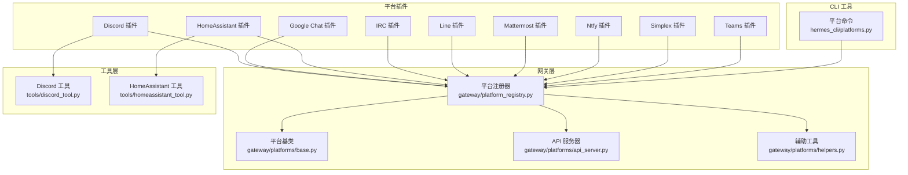
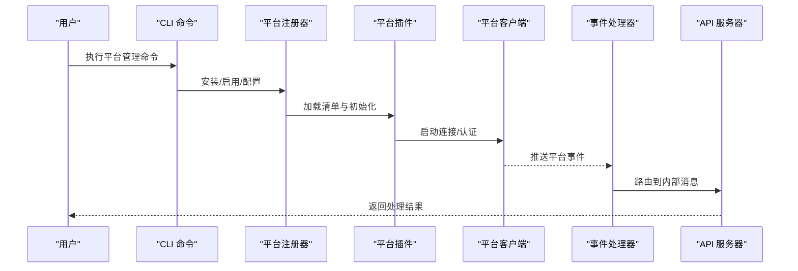
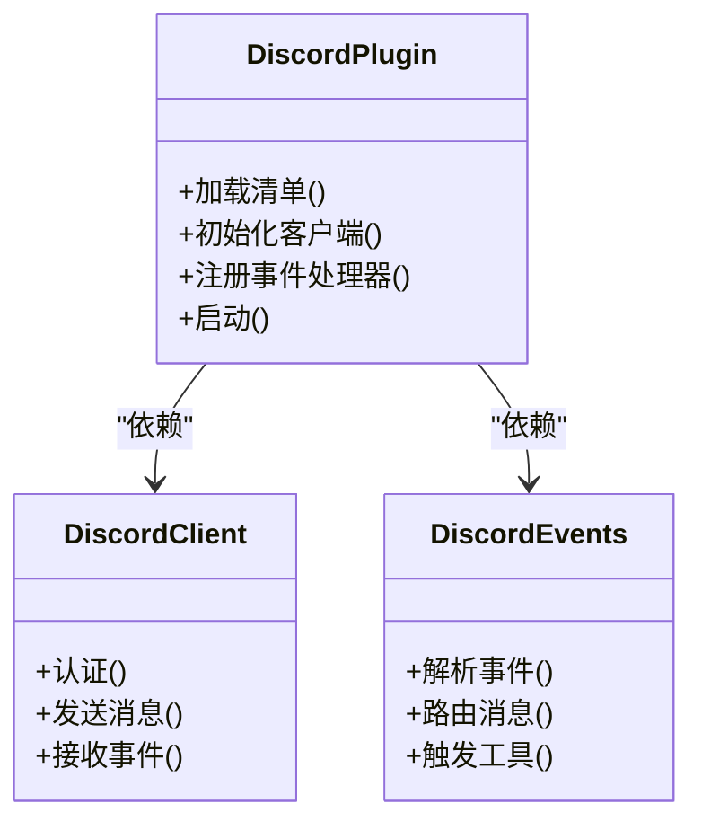
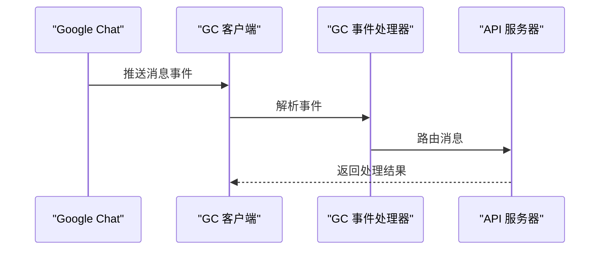
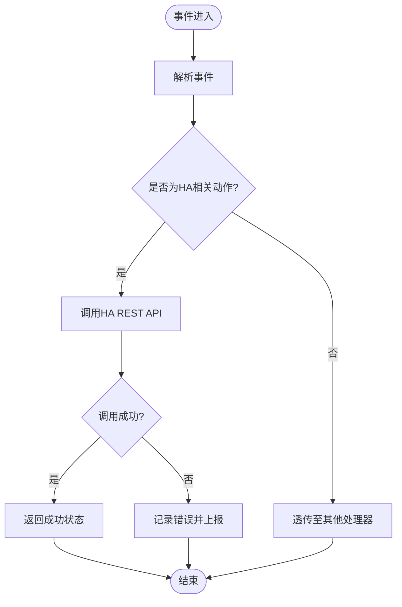
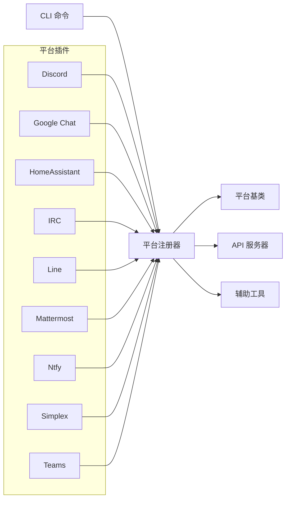

# 平台插件

<cite>
**本文引用的文件**
- [README.md](file://README.md)
- [plugins/platforms/discord/plugin.yaml](file://plugins/platforms/discord/plugin.yaml)
- [plugins/platforms/discord/__init__.py](file://plugins/platforms/discord/__init__.py)
- [plugins/platforms/discord/client.py](file://plugins/platforms/discord/client.py)
- [plugins/platforms/discord/events.py](file://plugins/platforms/discord/events.py)
- [plugins/platforms/google_chat/plugin.yaml](file://plugins/platforms/google_chat/plugin.yaml)
- [plugins/platforms/google_chat/__init__.py](file://plugins/platforms/google_chat/__init__.py)
- [plugins/platforms/google_chat/client.py](file://plugins/platforms/google_chat/client.py)
- [plugins/platforms/google_chat/events.py](file://plugins/platforms/google_chat/events.py)
- [plugins/platforms/homeassistant/plugin.yaml](file://plugins/platforms/homeassistant/plugin.yaml)
- [plugins/platforms/homeassistant/__init__.py](file://plugins/platforms/homeassistant/__init__.py)
- [plugins/platforms/homeassistant/client.py](file://plugins/platforms/homeassistant/client.py)
- [plugins/platforms/irc/plugin.yaml](file://plugins/platforms/irc/plugin.yaml)
- [plugins/platforms/irc/__init__.py](file://plugins/platforms/irc/__init__.py)
- [plugins/platforms/irc/client.py](file://plugins/platforms/irc/client.py)
- [plugins/platforms/line/plugin.yaml](file://plugins/platforms/line/plugin.yaml)
- [plugins/platforms/line/__init__.py](file://plugins/platforms/line/__init__.py)
- [plugins/platforms/line/client.py](file://plugins/platforms/line/client.py)
- [plugins/platforms/mattermost/plugin.yaml](file://plugins/platforms/mattermost/plugin.yaml)
- [plugins/platforms/mattermost/__init__.py](file://plugins/platforms/mattermost/__init__.py)
- [plugins/platforms/mattermost/client.py](file://plugins/platforms/mattermost/client.py)
- [plugins/platforms/ntfy/plugin.yaml](file://plugins/platforms/ntfy/plugin.yaml)
- [plugins/platforms/ntfy/__init__.py](file://plugins/platforms/ntfy/__init__.py)
- [plugins/platforms/ntfy/client.py](file://plugins/platforms/ntfy/client.py)
- [plugins/platforms/simplex/plugin.yaml](file://plugins/platforms/simplex/plugin.yaml)
- [plugins/platforms/simplex/__init__.py](file://plugins/platforms/simplex/__init__.py)
- [plugins/platforms/simplex/client.py](file://plugins/platforms/simplex/client.py)
- [plugins/platforms/teams/plugin.yaml](file://plugins/platforms/teams/plugin.yaml)
- [plugins/platforms/teams/__init__.py](file://plugins/platforms/teams/__init__.py)
- [plugins/platforms/teams/client.py](file://plugins/platforms/teams/client.py)
- [gateway/platform_registry.py](file://gateway/platform_registry.py)
- [gateway/platforms/base.py](file://gateway/platforms/base.py)
- [gateway/platforms/api_server.py](file://gateway/platforms/api_server.py)
- [gateway/platforms/helpers.py](file://gateway/platforms/helpers.py)
- [hermes_cli/platforms.py](file://hermes_cli/platforms.py)
- [tools/discord_tool.py](file://tools/discord_tool.py)
- [tools/homeassistant_tool.py](file://tools/homeassistant_tool.py)
</cite>

## 目录
1. [简介](#简介)
2. [项目结构](#项目结构)
3. [核心组件](#核心组件)
4. [架构总览](#架构总览)
5. [详细组件分析](#详细组件分析)
6. [依赖关系分析](#依赖关系分析)
7. [性能考量](#性能考量)
8. [故障排除指南](#故障排除指南)
9. [结论](#结论)
10. [附录](#附录)

## 简介
本技术文档面向Hermes Agent平台的“平台插件”模块，系统性说明各消息平台插件的功能特性、API集成方式与配置方法，并给出认证、消息路由与事件处理机制的实现要点。文档覆盖以下平台插件：Discord、Google Chat、HomeAssistant、IRC、Line、Mattermost、Ntfy、Simplex、Teams。同时提供平台选择指南、集成步骤与故障排除方法，并总结平台插件的开发、测试与维护流程。

## 项目结构
平台插件位于plugins/platforms目录下，每个平台一个子目录，包含插件清单(plugin.yaml)、初始化入口(__init__.py)、客户端(client.py)与事件处理器(events.py)等关键文件。平台插件通过网关层(gateway)注册与调度，CLI工具(hermes_cli)提供安装与管理命令，工具层(tools)提供与平台交互的工具函数。

**图表来源**
- [gateway/platform_registry.py](file://gateway/platform_registry.py)
- [gateway/platforms/base.py](file://gateway/platforms/base.py)
- [gateway/platforms/api_server.py](file://gateway/platforms/api_server.py)
- [gateway/platforms/helpers.py](file://gateway/platforms/helpers.py)
- [hermes_cli/platforms.py](file://hermes_cli/platforms.py)
- [tools/discord_tool.py](file://tools/discord_tool.py)
- [tools/homeassistant_tool.py](file://tools/homeassistant_tool.py)

**章节来源**
- [README.md](file://README.md)
- [plugins/platforms/discord/plugin.yaml](file://plugins/platforms/discord/plugin.yaml)
- [plugins/platforms/google_chat/plugin.yaml](file://plugins/platforms/google_chat/plugin.yaml)
- [plugins/platforms/homeassistant/plugin.yaml](file://plugins/platforms/homeassistant/plugin.yaml)
- [plugins/platforms/irc/plugin.yaml](file://plugins/platforms/irc/plugin.yaml)
- [plugins/platforms/line/plugin.yaml](file://plugins/platforms/line/plugin.yaml)
- [plugins/platforms/mattermost/plugin.yaml](file://plugins/platforms/mattermost/plugin.yaml)
- [plugins/platforms/ntfy/plugin.yaml](file://plugins/platforms/ntfy/plugin.yaml)
- [plugins/platforms/simplex/plugin.yaml](file://plugins/platforms/simplex/plugin.yaml)
- [plugins/platforms/teams/plugin.yaml](file://plugins/platforms/teams/plugin.yaml)

## 核心组件
- 平台插件清单(plugin.yaml)：定义插件元数据、能力声明、依赖与运行参数。
- 初始化入口(__init__.py)：负责加载配置、注册事件处理器、启动客户端。
- 客户端(client.py)：封装平台API调用、认证、消息发送与接收。
- 事件处理器(events.py)：解析平台事件、转换为内部消息格式、触发路由与工具执行。
- 网关注册器(platform_registry.py)：统一注册与发现平台插件，协调生命周期。
- 平台基类(base.py)：抽象出平台通用接口，确保一致性。
- API服务器(api_server.py)：对外暴露HTTP接口，供外部系统或Webhook接入。
- CLI命令(hermes_cli/platforms.py)：提供安装、启用、禁用、配置等管理操作。
- 工具函数(tools)：提供常用平台交互能力，如发送消息、查询状态等。

**章节来源**
- [gateway/platform_registry.py](file://gateway/platform_registry.py)
- [gateway/platforms/base.py](file://gateway/platforms/base.py)
- [gateway/platforms/api_server.py](file://gateway/platforms/api_server.py)
- [hermes_cli/platforms.py](file://hermes_cli/platforms.py)

## 架构总览
平台插件采用“插件化+网关层”的架构设计。平台插件通过清单文件声明自身能力，由注册器集中管理；客户端负责与平台API交互；事件处理器将平台事件映射为内部消息；API服务器提供HTTP入口；CLI用于运维管理；工具层提供跨平台通用能力。

**图表来源**
- [hermes_cli/platforms.py](file://hermes_cli/platforms.py)
- [gateway/platform_registry.py](file://gateway/platform_registry.py)
- [gateway/platforms/api_server.py](file://gateway/platforms/api_server.py)

## 详细组件分析

### Discord 插件
- 功能特性
  - 支持文本消息收发、频道与私聊路由。
  - 事件驱动的消息处理，支持富媒体与附件。
  - 可扩展为机器人权限管理与命令解析。
- 认证与配置
  - 使用Bot Token进行OAuth-like认证。
  - 在插件清单中配置bot_token、intents与默认频道。
- 消息路由与事件处理
  - 事件处理器将平台事件转换为内部消息，触发工具链。
  - 支持多频道路由与用户上下文识别。
- 使用场景
  - 团队协作、自动化通知、技能编排与工作流触发。

**图表来源**
- [plugins/platforms/discord/__init__.py](file://plugins/platforms/discord/__init__.py)
- [plugins/platforms/discord/client.py](file://plugins/platforms/discord/client.py)
- [plugins/platforms/discord/events.py](file://plugins/platforms/discord/events.py)

**章节来源**
- [plugins/platforms/discord/plugin.yaml](file://plugins/platforms/discord/plugin.yaml)
- [plugins/platforms/discord/__init__.py](file://plugins/platforms/discord/__init__.py)
- [plugins/platforms/discord/client.py](file://plugins/platforms/discord/client.py)
- [plugins/platforms/discord/events.py](file://plugins/platforms/discord/events.py)

### Google Chat 插件
- 功能特性
  - 支持空间(Space)与直接(Direct)消息。
  - Webhook与App认证结合，适合企业级集成。
- 认证与配置
  - 使用服务账号或OAuth进行认证。
  - 配置app_name、service_account、默认空间ID。
- 消息路由与事件处理
  - 将平台事件标准化为内部消息，支持富文本与附件。
- 使用场景
  - 企业聊天室自动化、智能助手、会议通知。

**图表来源**
- [plugins/platforms/google_chat/client.py](file://plugins/platforms/google_chat/client.py)
- [plugins/platforms/google_chat/events.py](file://plugins/platforms/google_chat/events.py)
- [gateway/platforms/api_server.py](file://gateway/platforms/api_server.py)

**章节来源**
- [plugins/platforms/google_chat/plugin.yaml](file://plugins/platforms/google_chat/plugin.yaml)
- [plugins/platforms/google_chat/__init__.py](file://plugins/platforms/google_chat/__init__.py)
- [plugins/platforms/google_chat/client.py](file://plugins/platforms/google_chat/client.py)
- [plugins/platforms/google_chat/events.py](file://plugins/platforms/google_chat/events.py)

### HomeAssistant 插件
- 功能特性
  - 通过REST API与Home Assistant交互，支持实体控制与状态查询。
  - 适合作为智能家居中枢的自动化触发器。
- 认证与配置
  - 使用Long-Lived Access Token进行认证。
  - 配置base_url与默认区域(entity_id前缀)。
- 消息路由与事件处理
  - 将平台事件映射为HA服务调用，返回状态反馈。
- 使用场景
  - 智能家居联动、环境监控、语音/消息触发自动化。

**图表来源**
- [plugins/platforms/homeassistant/client.py](file://plugins/platforms/homeassistant/client.py)
- [plugins/platforms/homeassistant/events.py](file://plugins/platforms/homeassistant/events.py)

**章节来源**
- [plugins/platforms/homeassistant/plugin.yaml](file://plugins/platforms/homeassistant/plugin.yaml)
- [plugins/platforms/homeassistant/__init__.py](file://plugins/platforms/homeassistant/__init__.py)
- [plugins/platforms/homeassistant/client.py](file://plugins/platforms/homeassistant/client.py)

### IRC 插件
- 功能特性
  - 支持加入频道与私聊，事件驱动的消息处理。
  - 适合开源社区与技术讨论群组。
- 认证与配置
  - 支持明文密码与SASL认证。
  - 配置服务器地址、端口、昵称与初始频道列表。
- 消息路由与事件处理
  - 将IRC事件标准化为内部消息，支持命令与富文本。
- 使用场景
  - 开源项目通知、技术问答、自动化脚本触发。

**章节来源**
- [plugins/platforms/irc/plugin.yaml](file://plugins/platforms/irc/plugin.yaml)
- [plugins/platforms/irc/__init__.py](file://plugins/platforms/irc/__init__.py)
- [plugins/platforms/irc/client.py](file://plugins/platforms/irc/client.py)

### Line 插件
- 功能特性
  - 支持文本、图片、视频与文件消息。
  - 适合日韩地区的企业与个人沟通。
- 认证与配置
  - 使用Channel Access Token进行认证。
  - 配置channel_id、channel_secret与默认群组。
- 消息路由与事件处理
  - 事件处理器支持多种消息类型与快速回复。
- 使用场景
  - 客服机器人、营销推送、内部协作。

**章节来源**
- [plugins/platforms/line/plugin.yaml](file://plugins/platforms/line/plugin.yaml)
- [plugins/platforms/line/__init__.py](file://plugins/platforms/line/__init__.py)
- [plugins/platforms/line/client.py](file://plugins/platforms/line/client.py)

### Mattermost 插件
- 功能特性
  - 支持公会(Guild)、团队与私聊频道。
  - 事件驱动，适合企业协作与合规审计。
- 认证与配置
  - 使用Personal Access Token进行认证。
  - 配置server_url、token与默认团队/频道。
- 消息路由与事件处理
  - 将平台事件映射为内部消息，支持富文本与附件。
- 使用场景
  - 企业协作、知识库集成、合规通知。

**章节来源**
- [plugins/platforms/mattermost/plugin.yaml](file://plugins/platforms/mattermost/plugin.yaml)
- [plugins/platforms/mattermost/__init__.py](file://plugins/platforms/mattermost/__init__.py)
- [plugins/platforms/mattermost/client.py](file://plugins/platforms/mattermost/client.py)

### Ntfy 插件
- 功能特性
  - 轻量级推送服务，支持主题订阅与消息发布。
  - 适合移动端与边缘设备通知。
- 认证与配置
  - 支持Basic Auth与Bearer Token。
  - 配置server_url、topic与默认优先级。
- 消息路由与事件处理
  - 事件处理器将平台事件转化为Ntfy消息。
- 使用场景
  - 移动端提醒、IoT设备告警、系统运维通知。

**章节来源**
- [plugins/platforms/ntfy/plugin.yaml](file://plugins/platforms/ntfy/plugin.yaml)
- [plugins/platforms/ntfy/__init__.py](file://plugins/platforms/ntfy/__init__.py)
- [plugins/platforms/ntfy/client.py](file://plugins/platforms/ntfy/client.py)

### Simplex 插件
- 功能特性
  - 基于去中心化通信协议的匿名消息通道。
  - 适合隐私敏感场景与安全通信。
- 认证与配置
  - 使用私钥与公钥对进行身份验证。
  - 配置endpoint与默认会话标识。
- 消息路由与事件处理
  - 事件处理器确保消息加密与匿名性。
- 使用场景
  - 匿名举报、安全通讯、隐私保护通知。

**章节来源**
- [plugins/platforms/simplex/plugin.yaml](file://plugins/platforms/simplex/plugin.yaml)
- [plugins/platforms/simplex/__init__.py](file://plugins/platforms/simplex/__init__.py)
- [plugins/platforms/simplex/client.py](file://plugins/platforms/simplex/client.py)

### Teams 插件
- 功能特性
  - 支持团队与会议消息，与Microsoft Graph深度集成。
  - 适合企业组织内的协作与会议通知。
- 认证与配置
  - 使用应用凭据(Azure AD)进行OAuth认证。
  - 配置tenant_id、client_id、client_secret与默认团队。
- 消息路由与事件处理
  - 事件处理器支持会议、任务与文件事件。
- 使用场景
  - 企业协作、会议纪要、任务分配与进度通知。

**章节来源**
- [plugins/platforms/teams/plugin.yaml](file://plugins/platforms/teams/plugin.yaml)
- [plugins/platforms/teams/__init__.py](file://plugins/platforms/teams/__init__.py)
- [plugins/platforms/teams/client.py](file://plugins/platforms/teams/client.py)

## 依赖关系分析
平台插件在网关层统一注册与调度，遵循平台基类接口，确保一致性与可扩展性。CLI工具负责插件生命周期管理，工具层提供通用能力。

**图表来源**
- [gateway/platform_registry.py](file://gateway/platform_registry.py)
- [gateway/platforms/base.py](file://gateway/platforms/base.py)
- [gateway/platforms/api_server.py](file://gateway/platforms/api_server.py)
- [gateway/platforms/helpers.py](file://gateway/platforms/helpers.py)
- [hermes_cli/platforms.py](file://hermes_cli/platforms.py)

**章节来源**
- [gateway/platform_registry.py](file://gateway/platform_registry.py)
- [gateway/platforms/base.py](file://gateway/platforms/base.py)
- [gateway/platforms/api_server.py](file://gateway/platforms/api_server.py)
- [gateway/platforms/helpers.py](file://gateway/platforms/helpers.py)
- [hermes_cli/platforms.py](file://hermes_cli/platforms.py)

## 性能考量
- 连接池与并发控制：平台客户端应复用连接、限制并发请求，避免触发平台速率限制。
- 事件批处理：对高频事件进行合并与延迟处理，减少API调用次数。
- 缓存策略：对静态资源与用户信息进行缓存，降低重复查询开销。
- 超时与重试：设置合理的超时与指数退避重试，提升稳定性。
- 日志与可观测性：记录关键路径耗时与错误码，便于定位性能瓶颈。

## 故障排除指南
- 认证失败
  - 检查Token/密钥是否正确、过期或权限不足。
  - 对照插件清单中的认证字段与平台开发者后台配置。
- 速率限制
  - 观察平台返回的限流头或错误码，调整请求频率或启用退避重试。
- 事件未到达
  - 确认事件处理器已注册且未被过滤。
  - 检查平台回调URL或Webhook配置是否正确。
- 消息发送异常
  - 校验目标ID(频道/用户/房间)是否存在。
  - 查看平台返回的错误详情，确认权限与格式。
- CLI管理问题
  - 使用CLI命令查看插件状态与日志，必要时重新安装或重置配置。

## 结论
Hermes Agent平台插件通过标准化的清单、客户端与事件处理机制，实现了对多平台的统一接入与管理。开发者可基于平台基类快速扩展新平台，结合网关层与CLI工具完成从开发到运维的全生命周期管理。建议在生产环境中重视认证安全、速率限制与可观测性，以获得稳定可靠的平台集成体验。

## 附录
- 平台选择指南
  - 团队协作：Discord、Mattermost、Google Chat、Teams。
  - 企业集成：Google Chat、Teams、HomeAssistant。
  - 移动与边缘：Ntfy、Line。
  - 隐私与匿名：Simplex。
  - 开源社区：IRC。
- 集成步骤
  - 在对应平台创建应用/机器人，获取凭证。
  - 在插件清单中填写凭证与默认参数。
  - 通过CLI安装并启用插件。
  - 配置事件路由与工具链。
  - 部署并监控运行状态。
- 开发、测试与维护流程
  - 开发：遵循平台基类接口，编写客户端与事件处理器。
  - 测试：使用平台沙盒或测试账号，覆盖正常与异常路径。
  - 维护：定期更新凭证、优化速率限制策略、完善日志与告警。