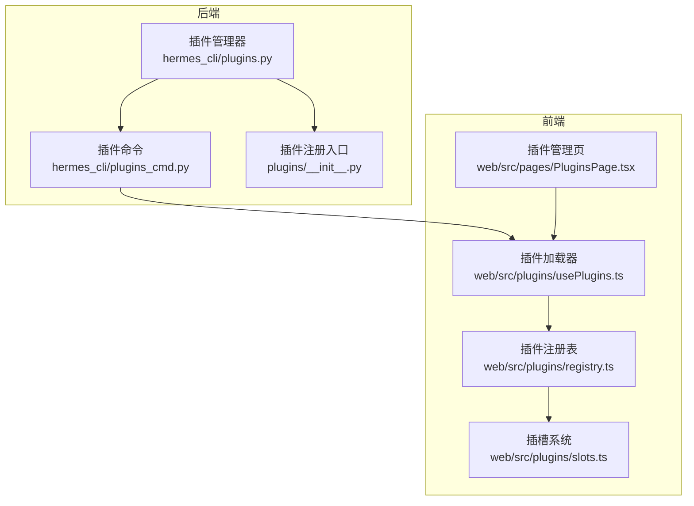
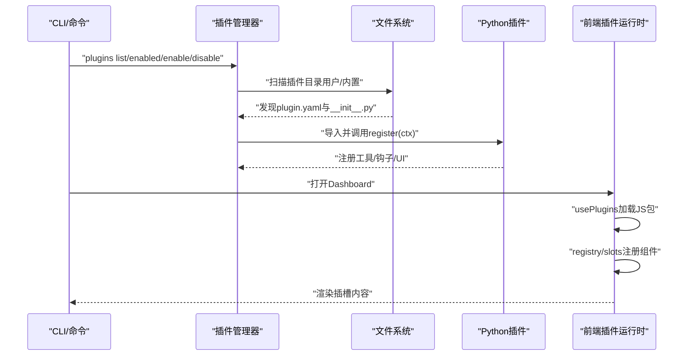
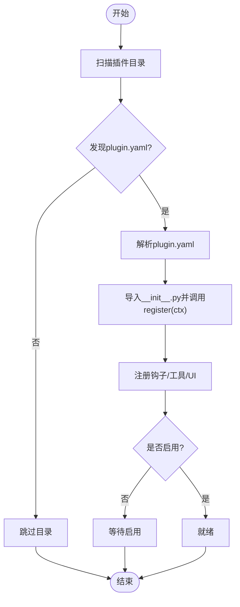
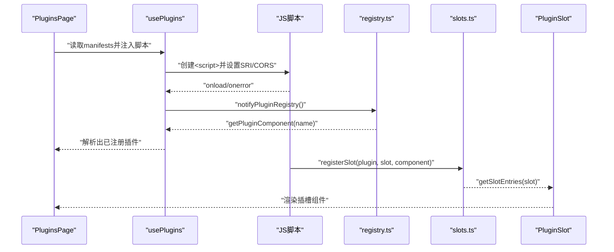
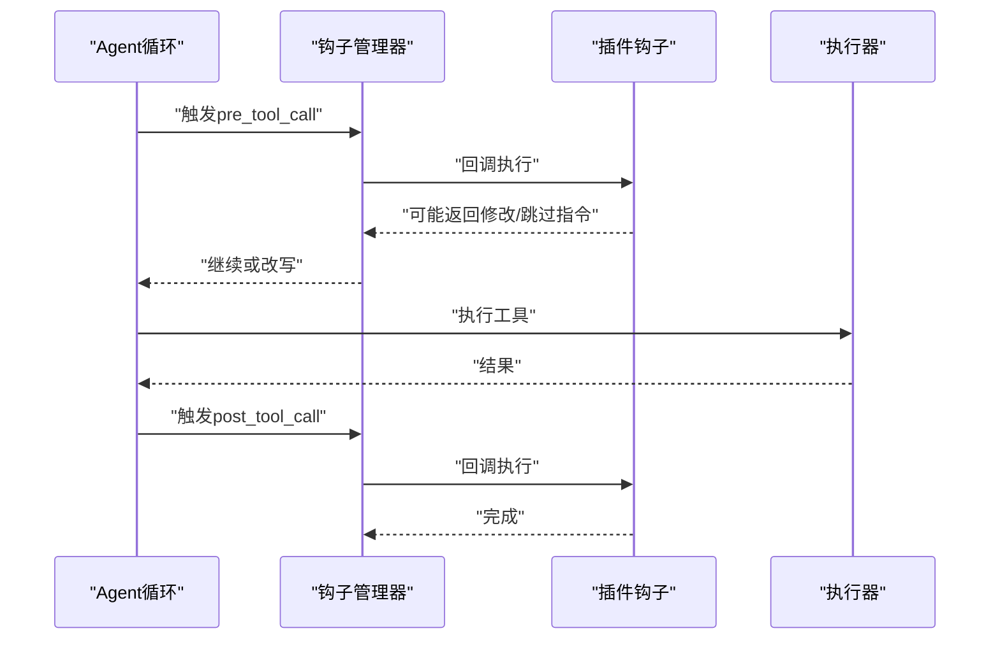
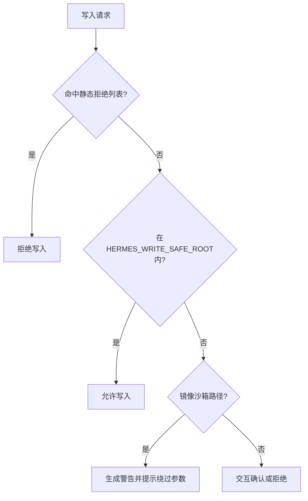
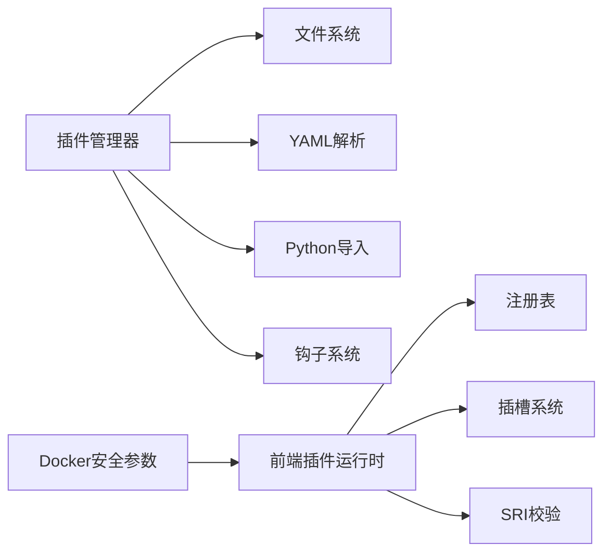

# 插件架构

<cite>
**本文引用的文件**
- [plugins.py](file://hermes_cli/plugins.py)
- [plugins_cmd.py](file://hermes_cli/plugins_cmd.py)
- [slots.ts](file://web/src/plugins/slots.ts)
- [registry.ts](file://web/src/plugins/registry.ts)
- [usePlugins.ts](file://web/src/plugins/usePlugins.ts)
- [PluginsPage.tsx](file://web/src/pages/PluginsPage.tsx)
- [build-a-hermes-plugin.md](file://website/docs/guides/build-a-hermes-plugin.md)
- [plugins.md](file://website/docs/user-guide/features/plugins.md)
- [extending-the-dashboard.md](file://website/i18n/zh-Hans/docusaurus-plugin-content-docs/current/user-guide/features/extending-the-dashboard.md)
- [adding-platform-adapters.md](file://website/i18n/zh-Hans/docusaurus-plugin-content-docs/current/developer-guide/adding-platform-adapters.md)
- [test_plugin_scanner_recursion.py](file://tests/hermes_cli/test_plugin_scanner_recursion.py)
- [test_plugins.py](file://tests/hermes_cli/test_plugins.py)
- [test_shell_hooks.py](file://tests/agent/test_shell_hooks.py)
- [docker.py](file://tools/environments/docker.py)
- [test_file_write_safety.py](file://tests/tools/test_file_write_safety.py)
- [test_write_deny.py](file://tests/tools/test_write_deny.py)
- [test_file_safety_sandbox_mirror.py](file://tests/agent/test_file_safety_sandbox_mirror.py)
- [__init__.py](file://plugins/__init__.py)
- [plugin.yaml](file://plugins/google_meet/plugin.yaml)
- [plugin.yaml](file://plugins/disk-cleanup/plugin.yaml)
- [plugin.yaml](file://plugins/security-guidance/plugin.yaml)
- [plugin.yaml](file://plugins/spotify/plugin.yaml)
- [plugin.yaml](file://plugins/teams_pipeline/plugin.yaml)
</cite>

## 目录
1. [引言](#引言)
2. [项目结构](#项目结构)
3. [核心组件](#核心组件)
4. [架构总览](#架构总览)
5. [组件详解](#组件详解)
6. [依赖关系分析](#依赖关系分析)
7. [性能考量](#性能考量)
8. [故障排查指南](#故障排查指南)
9. [结论](#结论)
10. [附录](#附录)

## 引言
本文件面向Hermes Agent的插件体系，系统化阐述其整体设计模式、注册与生命周期管理、发现与加载流程、配置与依赖、版本与兼容性策略、接口规范与钩子事件、以及安全模型与沙箱隔离。文档同时提供面向开发者的架构设计指南与最佳实践，帮助快速理解并构建高质量插件。

## 项目结构
Hermes的插件体系由“后端Python插件管理器”和“前端Web插件运行时”两部分组成：
- 后端：负责插件发现、加载、初始化、钩子注册与事件分发，位于 hermes_cli/plugins.py 与相关命令模块。
- 前端：负责插件JS包的动态注入、组件注册、插槽系统与UI集成，位于 web/src/plugins/* 与 PluginsPage 页面。

图表来源
- [plugins.py](file://hermes_cli/plugins.py)
- [plugins_cmd.py](file://hermes_cli/plugins_cmd.py)
- [__init__.py](file://plugins/__init__.py)
- [usePlugins.ts](file://web/src/plugins/usePlugins.ts)
- [registry.ts](file://web/src/plugins/registry.ts)
- [slots.ts](file://web/src/plugins/slots.ts)
- [PluginsPage.tsx](file://web/src/pages/PluginsPage.tsx)

章节来源
- [plugins.py](file://hermes_cli/plugins.py)
- [plugins_cmd.py](file://hermes_cli/plugins_cmd.py)
- [__init__.py](file://plugins/__init__.py)
- [usePlugins.ts](file://web/src/plugins/usePlugins.ts)
- [registry.ts](file://web/src/plugins/registry.ts)
- [slots.ts](file://web/src/plugins/slots.ts)
- [PluginsPage.tsx](file://web/src/pages/PluginsPage.tsx)

## 核心组件
- 插件管理器（后端）：负责扫描用户与内置插件目录、解析manifest、按需加载、注册钩子、维护插件状态与生命周期。
- 插件清单（plugin.yaml）：定义插件元数据、类型、版本、入口、资源等。
- 插件注册入口（__init__.py）：提供 register(ctx) 函数，完成工具、钩子、UI等注册。
- 前端插件注册表：记录已注入的JS组件，支持错误上报与变更通知。
- 插槽系统：允许插件在UI特定区域注册组件，实现可扩展的界面布局。
- 插件加载器：动态注入JS脚本，支持SRI完整性校验、超时与错误处理。
- 插件管理页：提供安装、启用/禁用、配置等UI操作。

章节来源
- [plugins.py](file://hermes_cli/plugins.py)
- [plugins_cmd.py](file://hermes_cli/plugins_cmd.py)
- [build-a-hermes-plugin.md](file://website/docs/guides/build-a-hermes-plugin.md)
- [registry.ts](file://web/src/plugins/registry.ts)
- [slots.ts](file://web/src/plugins/slots.ts)
- [usePlugins.ts](file://web/src/plugins/usePlugins.ts)
- [PluginsPage.tsx](file://web/src/pages/PluginsPage.tsx)

## 架构总览
下图展示从“发现与加载”到“运行时注册”的全链路：

图表来源
- [plugins.py](file://hermes_cli/plugins.py)
- [plugins_cmd.py](file://hermes_cli/plugins_cmd.py)
- [usePlugins.ts](file://web/src/plugins/usePlugins.ts)
- [registry.ts](file://web/src/plugins/registry.ts)
- [slots.ts](file://web/src/plugins/slots.ts)

## 组件详解

### 后端：插件发现、加载与初始化
- 发现规则
  - 用户插件：~/.hermes/plugins/<name>/plugin.yaml 或 ~/.hermes/plugins/<cat>/<name>/plugin.yaml（最多两级嵌套）。
  - 内置插件：仓库内 plugins/* 下的插件。
  - 递归深度限制：超过两级的目录不被发现；若父目录存在manifest，则停止继续递归。
- 加载流程
  - 解析plugin.yaml，读取入口、类型、版本等元数据。
  - 读取__init__.py中的register(ctx)函数，传入上下文对象进行注册。
  - 根据插件类型决定是否自动加载（如平台类需要显式声明kind: platform）。
- 生命周期
  - 初始化：加载与注册。
  - 运行期：按需调用工具、触发钩子。
  - 卸载/禁用：移除注册项与资源。
- 配置与启用
  - 通过配置文件中的plugins.enabled列表控制启用插件集合。
  - 测试与验证：提供测试用例覆盖发现深度、kind解析、启用逻辑等。

图表来源
- [plugins.py](file://hermes_cli/plugins.py)
- [test_plugin_scanner_recursion.py](file://tests/hermes_cli/test_plugin_scanner_recursion.py)
- [test_plugins.py](file://tests/hermes_cli/test_plugins.py)

章节来源
- [plugins.py](file://hermes_cli/plugins.py)
- [test_plugin_scanner_recursion.py](file://tests/hermes_cli/test_plugin_scanner_recursion.py)
- [test_plugins.py](file://tests/hermes_cli/test_plugins.py)

### 前端：插件注入、注册与插槽系统
- 注入与校验
  - 动态创建<script>并注入JS包，支持SRI完整性校验与跨域设置。
  - 加载失败或未注册时上报错误码，便于诊断。
- 注册表
  - 记录插件组件，监听注册变化并通知订阅者。
- 插槽系统
  - 插件通过window.__HERMES_PLUGINS__.registerSlot注册组件到指定槽位。
  - UI组件PluginSlot按槽位名渲染对应插件组件列表。
- 管理页
  - 提供安装输入框与保存按钮，支持通过标识符安装插件。

图表来源
- [usePlugins.ts](file://web/src/plugins/usePlugins.ts)
- [registry.ts](file://web/src/plugins/registry.ts)
- [slots.ts](file://web/src/plugins/slots.ts)
- [PluginsPage.tsx](file://web/src/pages/PluginsPage.tsx)

章节来源
- [usePlugins.ts](file://web/src/plugins/usePlugins.ts)
- [registry.ts](file://web/src/plugins/registry.ts)
- [slots.ts](file://web/src/plugins/slots.ts)
- [PluginsPage.tsx](file://web/src/pages/PluginsPage.tsx)

### 插件接口规范与钩子系统
- 接口契约
  - 插件必须提供plugin.yaml与__init__.py，并在register(ctx)中完成注册。
  - 工具schema与执行逻辑分离，便于LLM理解与安全执行。
- 钩子事件
  - 支持pre_tool_call、post_tool_call、pre_llm_call、post_llm_call、on_session_start、on_session_end、on_session_finalize、on_session_reset、subagent_stop、pre_gateway_dispatch等。
  - 钩子可返回指令（如rewrite/allow/skip）影响流程。
- Shell钩子
  - 支持通过配置注册shell命令作为钩子，具备去重与匹配器组合能力。

图表来源
- [plugins.py](file://hermes_cli/plugins.py)
- [test_shell_hooks.py](file://tests/agent/test_shell_hooks.py)
- [plugins.md](file://website/docs/user-guide/features/plugins.md)

章节来源
- [plugins.py](file://hermes_cli/plugins.py)
- [test_shell_hooks.py](file://tests/agent/test_shell_hooks.py)
- [plugins.md](file://website/docs/user-guide/features/plugins.md)

### 配置文件格式与依赖管理
- plugin.yaml字段要点
  - name/label/version/description/author等元数据。
  - kind：standalone/backend/exclusive等，决定加载与路由方式。
  - requires_env/optional_env：在配置UI中暴露环境变量。
  - dashboard.tab/css/api/entry/slots等前端扩展字段。
- 依赖与版本
  - 通过requirements/约束文件管理Python依赖。
  - 版本遵循语义化版本，manifest.version用于显示与兼容性提示。
- 配置生效
  - 用户在config.yaml中启用插件；平台适配器需声明kind: platform。

章节来源
- [build-a-hermes-plugin.md](file://website/docs/guides/build-a-hermes-plugin.md)
- [extending-the-dashboard.md](file://website/i18n/zh-Hans/docusaurus-plugin-content-docs/current/user-guide/features/extending-the-dashboard.md)
- [adding-platform-adapters.md](file://website/i18n/zh-Hans/docusaurus-plugin-content-docs/current/developer-guide/adding-platform-adapters.md)

### 安全模型、沙箱与权限控制
- 文件写入安全
  - 写入拒绝白名单（如/etc/shadow、~/.ssh/id_rsa）。
  - HERMES_WRITE_SAFE_ROOT可限定安全写入根目录。
  - 对镜像沙箱路径进行识别与警告，强调防御纵深而非硬边界。
- Docker沙箱
  - 使用tmpfs、noexec等加固参数，必要时对/run放行exec。
  - GUI打包场景对chrome-sandbox进行严格校验与拒绝符号链接。
- 插件注入安全
  - SRI完整性校验，防止中间人替换JS包。
  - 加载失败与未注册检测，避免静默失败。

图表来源
- [test_file_write_safety.py](file://tests/tools/test_file_write_safety.py)
- [test_write_deny.py](file://tests/tools/test_write_deny.py)
- [test_file_safety_sandbox_mirror.py](file://tests/agent/test_file_safety_sandbox_mirror.py)
- [docker.py](file://tools/environments/docker.py)
- [usePlugins.ts](file://web/src/plugins/usePlugins.ts)

章节来源
- [test_file_write_safety.py](file://tests/tools/test_file_write_safety.py)
- [test_write_deny.py](file://tests/tools/test_write_deny.py)
- [test_file_safety_sandbox_mirror.py](file://tests/agent/test_file_safety_sandbox_mirror.py)
- [docker.py](file://tools/environments/docker.py)
- [usePlugins.ts](file://web/src/plugins/usePlugins.ts)

## 依赖关系分析
- 后端耦合
  - 插件管理器依赖文件系统扫描、YAML解析、Python导入机制。
  - 钩子系统与事件分发紧密耦合，确保生命周期可控。
- 前端耦合
  - usePlugins依赖registry与slots；registry与slots相互独立但共同服务UI。
- 外部依赖
  - Docker运行时参数、浏览器SRI校验、系统路径前缀构建等。

图表来源
- [plugins.py](file://hermes_cli/plugins.py)
- [usePlugins.ts](file://web/src/plugins/usePlugins.ts)
- [docker.py](file://tools/environments/docker.py)

章节来源
- [plugins.py](file://hermes_cli/plugins.py)
- [usePlugins.ts](file://web/src/plugins/usePlugins.ts)
- [docker.py](file://tools/environments/docker.py)

## 性能考量
- 插件加载
  - 延迟注入与超时控制，避免阻塞主界面渲染。
  - SRI校验与错误快速反馈，减少无效重试。
- 执行效率
  - 钩子回调尽量轻量，避免长阻塞操作。
  - 工具调用与LLM交互应采用异步与节流策略。
- 资源隔离
  - Docker tmpfs与noexec提升安全性，降低I/O风险。
  - 写入安全根限制写入范围，减少副作用。

## 故障排查指南
- 插件未出现
  - 检查是否启用（plugins enabled）。
  - 检查目录层级（最多两级），是否存在plugin.yaml与__init__.py。
  - 检查kind字段是否正确（平台适配器需platform）。
- 前端插件未加载
  - 查看Network面板与控制台错误（LOAD_FAILED/NO_REGISTER）。
  - 确认SRI完整性与CORS设置。
- 钩子未生效
  - 确认命令是否被接受（HERMES_ACCEPT_HOOKS）。
  - 检查去重键（事件+匹配器+命令）是否重复。
- 写入被拒
  - 检查是否在安全根内，或是否命中拒绝列表。
  - 镜像沙箱路径会触发警告，按提示调整。

章节来源
- [build-a-hermes-plugin.md](file://website/docs/guides/build-a-hermes-plugin.md)
- [usePlugins.ts](file://web/src/plugins/usePlugins.ts)
- [test_shell_hooks.py](file://tests/agent/test_shell_hooks.py)
- [test_file_write_safety.py](file://tests/tools/test_file_write_safety.py)
- [test_write_deny.py](file://tests/tools/test_write_deny.py)
- [test_file_safety_sandbox_mirror.py](file://tests/agent/test_file_safety_sandbox_mirror.py)

## 结论
Hermes插件架构通过“后端管理器+前端运行时”的双层设计，实现了插件的可发现、可加载、可注册与可扩展。配合严格的钩子与事件机制、安全的沙箱与权限控制，以及清晰的配置与依赖管理，为生态扩展提供了稳健基础。开发者可依据本文档的规范与最佳实践，快速构建高质量插件并融入生态。

## 附录

### 插件清单字段速查
- 必填：name、label、kind（平台适配器为platform）
- 常用：version、description、author、requires_env/optional_env
- 前端：dashboard.tab（path/position/override/hidden）、entry、css、api、slots

章节来源
- [extending-the-dashboard.md](file://website/i18n/zh-Hans/docusaurus-plugin-content-docs/current/user-guide/features/extending-the-dashboard.md)
- [adding-platform-adapters.md](file://website/i18n/zh-Hans/docusaurus-plugin-content-docs/current/developer-guide/adding-platform-adapters.md)

### 示例清单参考
- 平台适配器示例：google_meet/plugin.yaml
- 工具型插件示例：disk-cleanup/plugin.yaml
- 安全指导插件示例：security-guidance/plugin.yaml
- 媒体/视频/网页搜索等插件示例：spotify/teams_pipeline 等

章节来源
- [plugin.yaml](file://plugins/google_meet/plugin.yaml)
- [plugin.yaml](file://plugins/disk-cleanup/plugin.yaml)
- [plugin.yaml](file://plugins/security-guidance/plugin.yaml)
- [plugin.yaml](file://plugins/spotify/plugin.yaml)
- [plugin.yaml](file://plugins/teams_pipeline/plugin.yaml)