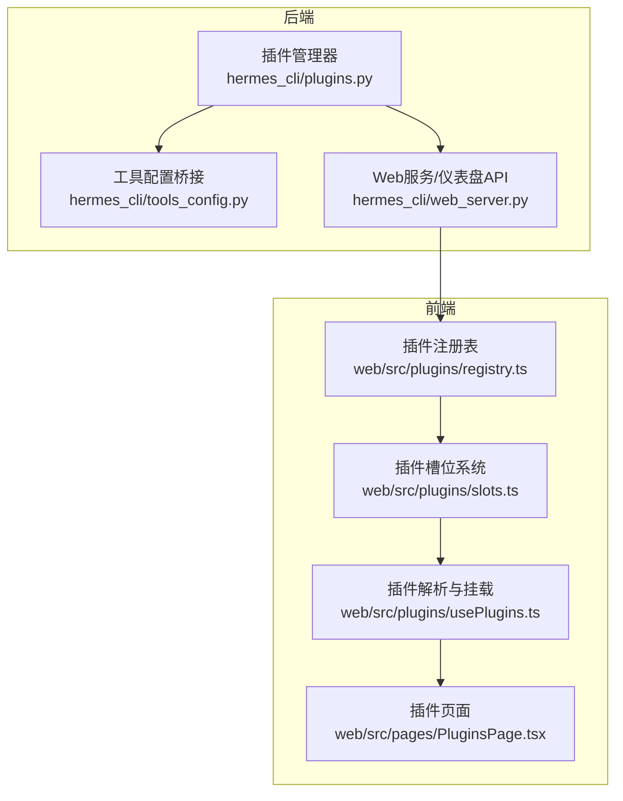
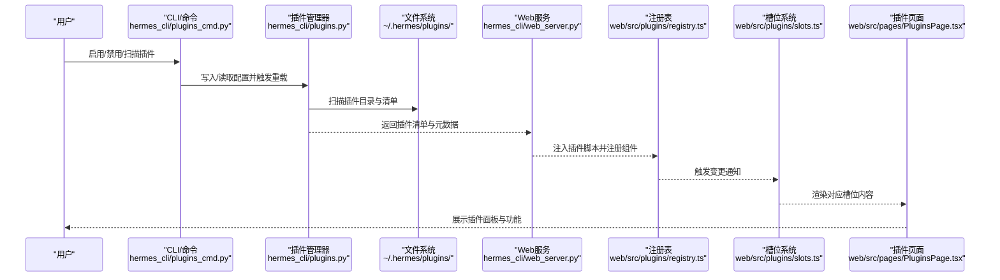
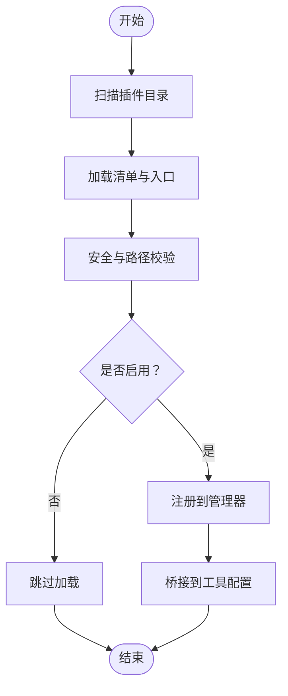
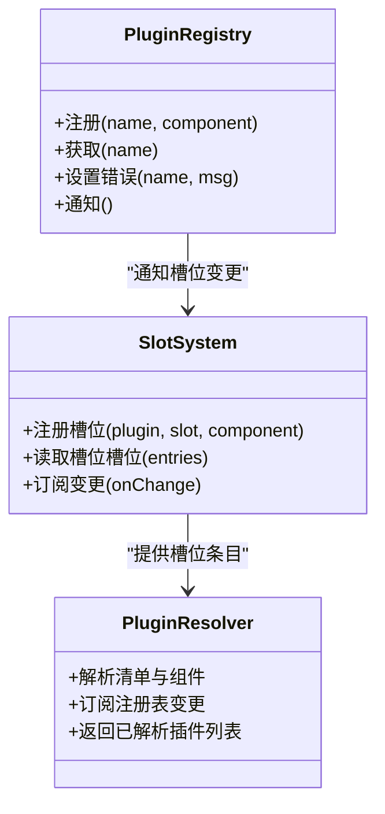
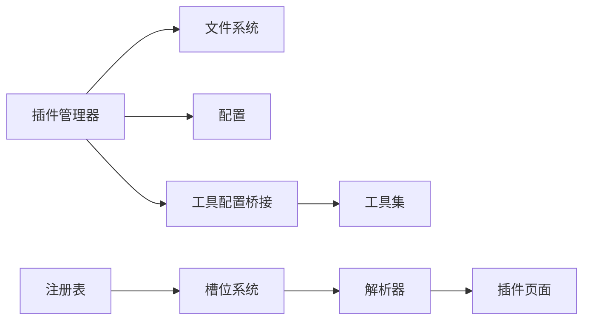

# 插件系统

<cite>
**本文引用的文件**
- [plugins.py](file://hermes_cli/plugins.py)
- [tools_config.py](file://hermes_cli/tools_config.py)
- [plugins_cmd.py](file://hermes_cli/plugins_cmd.py)
- [web_server.py](file://hermes_cli/web_server.py)
- [registry.ts](file://web/src/plugins/registry.ts)
- [slots.ts](file://web/src/plugins/slots.ts)
- [usePlugins.ts](file://web/src/plugins/usePlugins.ts)
- [PluginsPage.tsx](file://web/src/pages/PluginsPage.tsx)
- [plugin-llm-access.md](file://website/docs/developer-guide/plugin-llm-access.md)
- [plugins.md](file://website/docs/user-guide/features/plugins.md)
- [test_plugins.py](file://tests/hermes_cli/test_plugins.py)
- [test_security_guidance_plugin.py](file://tests/plugins/test_security_guidance_plugin.py)
- [test_project_plugin_rce_bypass.py](file://tests/hermes_cli/test_project_plugin_rce_bypass.py)
- [test_browser_provider_plugins.py](file://tests/plugins/browser/test_browser_provider_plugins.py)
- [check_parity_vs_main.py](file://tests/plugins/browser/check_parity_vs_main.py)
- [__init__.py](file://plugins/__init__.py)
- [plugin.yaml](file://plugins/disk-cleanup/plugin.yaml)
- [plugin.yaml](file://plugins/google_meet/plugin.yaml)
- [plugin.yaml](file://plugins/security-guidance/plugin.yaml)
- [plugin.yaml](file://plugins/spotify/plugin.yaml)
- [plugin.yaml](file://plugins/teams_pipeline/plugin.yaml)
- [plugin.yaml](file://plugins/web/firecrawl/plugin.yaml)
- [plugin.yaml](file://plugins/memory/holographic/plugin.yaml)
- [plugin.yaml](file://plugins/platforms/discord/plugin.yaml)
- [plugin.yaml](file://plugins/model-providers/openai/plugin.yaml)
- [plugin.yaml](file://plugins/image_gen/openai/plugin.yaml)
- [plugin.yaml](file://plugins/video_gen/xai/plugin.yaml)
- [plugin.yaml](file://plugins/context_engine/plugin.yaml)
- [plugin.yaml](file://plugins/dashboard_auth/basic/plugin.yaml)
- [plugin.yaml](file://plugins/observability/langfuse/plugin.yaml)
- [plugin.yaml](file://plugins/kanban/dashboard/plugin.yaml)
- [plugin.yaml](file://plugins/hermes-achievements/dashboard/plugin.yaml)
</cite>

## 目录
1. [简介](#简介)
2. [项目结构](#项目结构)
3. [核心组件](#核心组件)
4. [架构总览](#架构总览)
5. [详细组件分析](#详细组件分析)
6. [依赖关系分析](#依赖关系分析)
7. [性能考量](#性能考量)
8. [故障排查指南](#故障排查指南)
9. [结论](#结论)
10. [附录](#附录)

## 简介
本文件面向Hermes Agent插件系统的开发者与使用者，系统性阐述插件架构、注册机制、依赖管理与安全控制，并覆盖工具类、平台类、内存类、LLM接入类等插件类型。文档同时提供插件开发指南、自定义插件创建流程、测试方法、配置选项、性能与安全最佳实践，以及插件市场、分发与社区贡献建议。

## 项目结构
Hermes插件体系由“后端插件管理器”和“前端插件注册表/槽位系统”两部分组成：
- 后端（Python）：负责插件发现、加载、启用/禁用、配置解析与安全校验。
- 前端（TypeScript）：负责插件脚本注入、组件注册、槽位渲染与UI集成。

图表来源
- [plugins.py](file://hermes_cli/plugins.py)
- [tools_config.py](file://hermes_cli/tools_config.py)
- [web_server.py](file://hermes_cli/web_server.py)
- [registry.ts](file://web/src/plugins/registry.ts)
- [slots.ts](file://web/src/plugins/slots.ts)
- [usePlugins.ts](file://web/src/plugins/usePlugins.ts)
- [PluginsPage.tsx](file://web/src/pages/PluginsPage.tsx)

章节来源
- [plugins.py](file://hermes_cli/plugins.py)
- [tools_config.py](file://hermes_cli/tools_config.py)
- [web_server.py](file://hermes_cli/web_server.py)
- [registry.ts](file://web/src/plugins/registry.ts)
- [slots.ts](file://web/src/plugins/slots.ts)
- [usePlugins.ts](file://web/src/plugins/usePlugins.ts)
- [PluginsPage.tsx](file://web/src/pages/PluginsPage.tsx)

## 核心组件
- 插件管理器（后端）
  - 负责扫描、发现、加载插件清单与入口，维护启用/禁用状态，处理安全与路径校验。
- 工具配置桥接（后端）
  - 将插件能力映射到工具集、浏览器提供者等运行期配置。
- Web服务（后端）
  - 提供仪表盘插件列表、API路由与安全校验。
- 插件注册表（前端）
  - 记录已加载的插件组件，支持变更通知。
- 插件槽位系统（前端）
  - 定义插件向UI注入内容的“槽位”，按插件名与顺序渲染。
- 插件解析与挂载（前端）
  - 将清单与已注册组件进行匹配，驱动UI更新。

章节来源
- [plugins.py](file://hermes_cli/plugins.py)
- [tools_config.py](file://hermes_cli/tools_config.py)
- [web_server.py](file://hermes_cli/web_server.py)
- [registry.ts](file://web/src/plugins/registry.ts)
- [slots.ts](file://web/src/plugins/slots.ts)
- [usePlugins.ts](file://web/src/plugins/usePlugins.ts)

## 架构总览
下图展示从“插件清单”到“前端渲染”的完整链路：

图表来源
- [plugins_cmd.py](file://hermes_cli/plugins_cmd.py)
- [plugins.py](file://hermes_cli/plugins.py)
- [web_server.py](file://hermes_cli/web_server.py)
- [registry.ts](file://web/src/plugins/registry.ts)
- [slots.ts](file://web/src/plugins/slots.ts)
- [PluginsPage.tsx](file://web/src/pages/PluginsPage.tsx)

## 详细组件分析

### 后端：插件管理器与工具配置桥接
- 插件发现与加载
  - 通过扫描用户与内置插件目录，读取每个插件的清单文件，解析入口与能力。
  - 支持“自动迁移”与“强制重扫”，确保新旧版本行为一致。
- 启用/禁用与配置
  - 通过配置文件控制插件启用列表；对项目级插件提供环境开关以规避RCE风险。
- 安全与路径校验
  - 对仪表盘API路径进行白盒校验，拒绝绝对路径与越界访问；严格清理异常清单字段。
- 工具配置桥接
  - 将插件提供的浏览器提供者、工具能力等映射到运行期工具集，保证向后兼容。

图表来源
- [plugins.py](file://hermes_cli/plugins.py)
- [tools_config.py](file://hermes_cli/tools_config.py)
- [test_project_plugin_rce_bypass.py](file://tests/hermes_cli/test_project_plugin_rce_bypass.py)

章节来源
- [plugins.py](file://hermes_cli/plugins.py)
- [tools_config.py](file://hermes_cli/tools_config.py)
- [test_project_plugin_rce_bypass.py](file://tests/hermes_cli/test_project_plugin_rce_bypass.py)

### 前端：插件注册表与槽位系统
- 注册表
  - 维护插件名到React组件的映射，记录加载错误并通知订阅者。
- 槽位系统
  - 以“插件名+槽位名”为键，按注册顺序覆盖式插入，支持订阅变更并渲染。
- 插件解析与挂载
  - 将清单与已注册组件进行匹配，避免重复加载，支持开发态热替换。

图表来源
- [registry.ts](file://web/src/plugins/registry.ts)
- [slots.ts](file://web/src/plugins/slots.ts)
- [usePlugins.ts](file://web/src/plugins/usePlugins.ts)

章节来源
- [registry.ts](file://web/src/plugins/registry.ts)
- [slots.ts](file://web/src/plugins/slots.ts)
- [usePlugins.ts](file://web/src/plugins/usePlugins.ts)

### 插件清单与类型
- 清单字段
  - 名称、版本、描述、入口脚本、仪表盘API、能力声明等。
- 类型概览
  - 工具类：如磁盘清理、浏览器提供者、网络搜索等。
  - 平台类：如Discord、Teams等消息平台。
  - 内存类：如Holographic、Mem0等记忆体提供者。
  - LLM接入类：如OpenAI、Anthropic等模型提供者。
  - 可观测性类：如Langfuse等链路追踪。
  - 仪表盘认证类：如Basic、Nous等认证方案。
  - 其他：如Achievements、Kanban、Spotify、Teams Pipeline等。

章节来源
- [plugin.yaml](file://plugins/disk-cleanup/plugin.yaml)
- [plugin.yaml](file://plugins/google_meet/plugin.yaml)
- [plugin.yaml](file://plugins/security-guidance/plugin.yaml)
- [plugin.yaml](file://plugins/spotify/plugin.yaml)
- [plugin.yaml](file://plugins/teams_pipeline/plugin.yaml)
- [plugin.yaml](file://plugins/web/firecrawl/plugin.yaml)
- [plugin.yaml](file://plugins/memory/holographic/plugin.yaml)
- [plugin.yaml](file://plugins/platforms/discord/plugin.yaml)
- [plugin.yaml](file://plugins/model-providers/openai/plugin.yaml)
- [plugin.yaml](file://plugins/image_gen/openai/plugin.yaml)
- [plugin.yaml](file://plugins/video_gen/xai/plugin.yaml)
- [plugin.yaml](file://plugins/context_engine/plugin.yaml)
- [plugin.yaml](file://plugins/dashboard_auth/basic/plugin.yaml)
- [plugin.yaml](file://plugins/observability/langfuse/plugin.yaml)
- [plugin.yaml](file://plugins/kanban/dashboard/plugin.yaml)
- [plugin.yaml](file://plugins/hermes-achievements/dashboard/plugin.yaml)

### 插件开发指南
- 创建步骤
  - 在插件根目录编写清单文件，声明名称、入口与能力。
  - 实现后端入口函数以注册钩子或工具；实现前端组件并通过全局注册接口注入。
  - 如需仪表盘API，确保路径相对且安全，避免绝对路径与越界。
- 开发与调试
  - 使用开发模式下的热替换与注册表通知，快速迭代。
  - 通过测试用例验证清单解析、安全校验与工具桥接。
- 分发与安装
  - 用户可通过CLI启用/禁用插件；仪表盘提供统一入口。
  - 项目级插件默认关闭，需显式开启以降低风险。

章节来源
- [test_plugins.py](file://tests/hermes_cli/test_plugins.py)
- [registry.ts](file://web/src/plugins/registry.ts)
- [slots.ts](file://web/src/plugins/slots.ts)
- [plugins_cmd.py](file://hermes_cli/plugins_cmd.py)

### 插件测试方法
- 行为一致性
  - 对比迁移前后行为差异，确保浏览器提供者等关键路径保持一致。
- 安全测试
  - 验证路径 sanitizer、RCE绕过防护、仪表盘API白名单。
- 功能测试
  - 验证插件启用后工具配置桥接、槽位渲染与UI交互。

章节来源
- [check_parity_vs_main.py](file://tests/plugins/browser/check_parity_vs_main.py)
- [test_project_plugin_rce_bypass.py](file://tests/hermes_cli/test_project_plugin_rce_bypass.py)
- [test_security_guidance_plugin.py](file://tests/plugins/test_security_guidance_plugin.py)
- [test_browser_provider_plugins.py](file://tests/plugins/browser/test_browser_provider_plugins.py)

### 插件配置选项
- 启用/禁用
  - 通过配置文件控制插件启用列表；支持“自动迁移”与“强制重扫”。
- LLM接入门控
  - 可限制插件对provider/model/agent/profile的覆盖权限，防止越权调用。
- 仪表盘API
  - 仅接受相对路径，拒绝绝对路径与越界访问；异常路径将被清理。

章节来源
- [plugins.md](file://website/docs/user-guide/features/plugins.md)
- [plugin-llm-access.md](file://website/docs/developer-guide/plugin-llm-access.md)
- [test_project_plugin_rce_bypass.py](file://tests/hermes_cli/test_project_plugin_rce_bypass.py)

## 依赖关系分析
- 后端耦合
  - 插件管理器依赖文件系统与配置；与工具配置桥接共享插件能力。
- 前端耦合
  - 注册表与槽位系统相互协作，解析器订阅两者以驱动UI。
- 外部依赖
  - 插件清单与入口脚本；浏览器提供者与工具集；平台适配器与传输层。

图表来源
- [plugins.py](file://hermes_cli/plugins.py)
- [tools_config.py](file://hermes_cli/tools_config.py)
- [registry.ts](file://web/src/plugins/registry.ts)
- [slots.ts](file://web/src/plugins/slots.ts)
- [usePlugins.ts](file://web/src/plugins/usePlugins.ts)

章节来源
- [plugins.py](file://hermes_cli/plugins.py)
- [tools_config.py](file://hermes_cli/tools_config.py)
- [registry.ts](file://web/src/plugins/registry.ts)
- [slots.ts](file://web/src/plugins/slots.ts)
- [usePlugins.ts](file://web/src/plugins/usePlugins.ts)

## 性能考量
- 加载优化
  - 采用延迟解析与增量通知，避免全量重绘。
- 渲染优化
  - 槽位按序渲染，组件最小化更新；开发态支持热替换。
- 运行期开销
  - 插件工具调用应遵循输出限制与超时策略，避免阻塞主回路。

## 故障排查指南
- 插件未显示
  - 检查是否启用、清单是否有效、前端是否成功注册。
- 仪表盘API不可用
  - 确认API路径为相对路径且未越界；查看安全校验日志。
- 工具桥接异常
  - 核对工具配置桥接逻辑与清单能力声明是否一致。
- 安全告警
  - 关注RCE绕过防护与路径 sanitizer 的拦截记录。

章节来源
- [test_project_plugin_rce_bypass.py](file://tests/hermes_cli/test_project_plugin_rce_bypass.py)
- [test_browser_provider_plugins.py](file://tests/plugins/browser/test_browser_provider_plugins.py)
- [registry.ts](file://web/src/plugins/registry.ts)

## 结论
Hermes插件系统通过“后端管理器+前端注册表/槽位”的双层架构实现了高扩展性与强隔离。通过严格的清单校验、路径安全与门控策略，系统在开放生态与安全边界之间取得平衡。开发者可基于清单与钩子快速扩展工具、平台与记忆体能力；用户可在仪表盘中统一管理与启用插件。

## 附录
- 社区贡献
  - 新增插件请遵循清单规范与安全要求；提供测试用例与文档说明。
- 插件市场
  - 通过官方渠道发布与分发，遵循许可与合规要求。