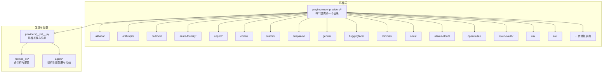
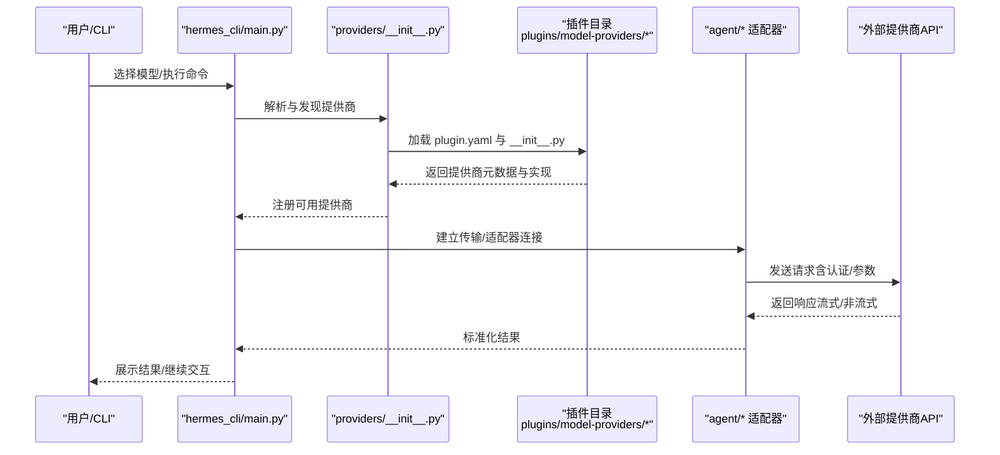
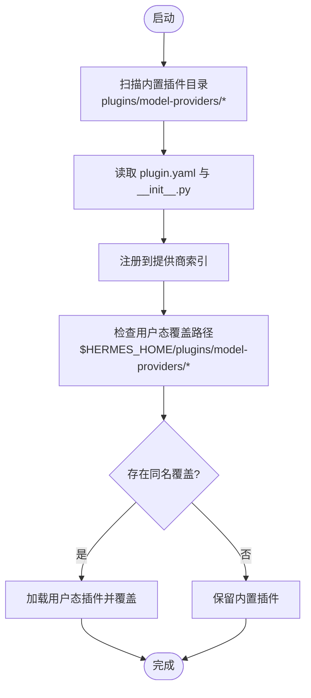
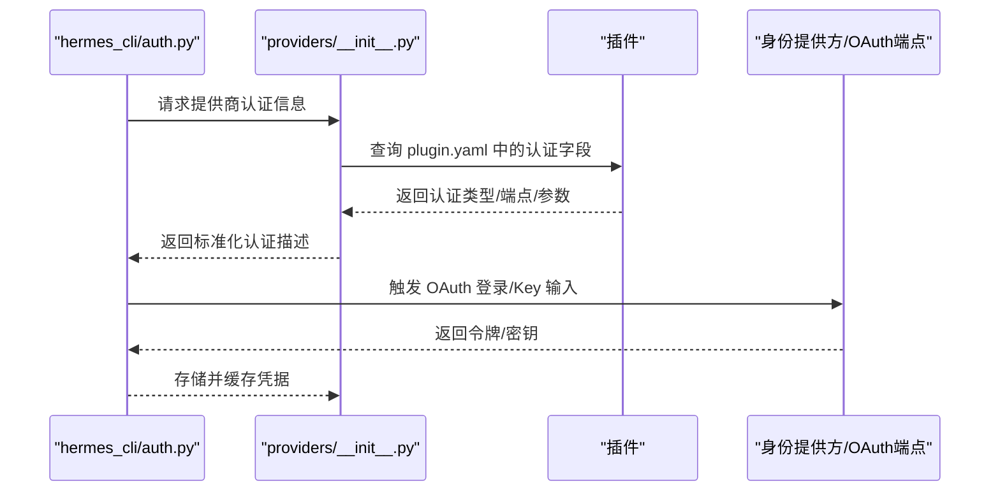
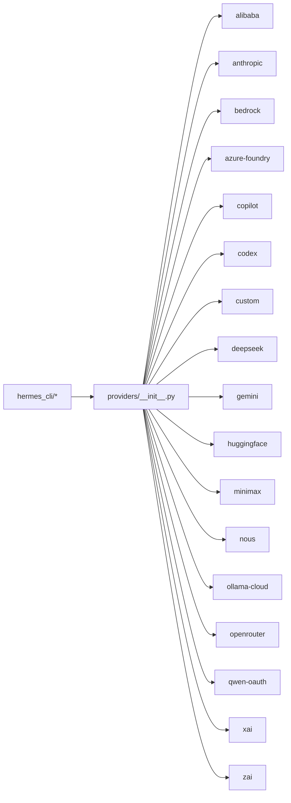

# 模型提供商插件

<cite>
**本文引用的文件**
- [providers/__init__.py](file://providers/__init__.py)
- [plugins/model-providers/README.md](file://plugins/model-providers/README.md)
- [plugins/model-providers/alibaba/plugin.yaml](file://plugins/model-providers/alibaba/plugin.yaml)
- [plugins/model-providers/anthropic/plugin.yaml](file://plugins/model-providers/anthropic/plugin.yaml)
- [plugins/model-providers/arcee/plugin.yaml](file://plugins/model-providers/arcee/plugin.yaml)
- [plugins/model-providers/azure-foundry/plugin.yaml](file://plugins/model-providers/azure-foundry/plugin.yaml)
- [plugins/model-providers/bedrock/plugin.yaml](file://plugins/model-providers/bedrock/plugin.yaml)
- [plugins/model-providers/copilot/plugin.yaml](file://plugins/model-providers/copilot/plugin.yaml)
- [plugins/model-providers/codex/plugin.yaml](file://plugins/model-providers/codex/plugin.yaml)
- [plugins/model-providers/custom/plugin.yaml](file://plugins/model-providers/custom/plugin.yaml)
- [plugins/model-providers/deepseek/plugin.yaml](file://plugins/model-providers/deepseek/plugin.yaml)
- [plugins/model-providers/gemini/plugin.yaml](file://plugins/model-providers/gemini/plugin.yaml)
- [plugins/model-providers/gmi/plugin.yaml](file://plugins/model-providers/gmi/plugin.yaml)
- [plugins/model-providers/huggingface/plugin.yaml](file://plugins/model-providers/huggingface/plugin.yaml)
- [plugins/model-providers/kilocode/plugin.yaml](file://plugins/model-providers/kilocode/plugin.yaml)
- [plugins/model-providers/kimi-coding/plugin.yaml](file://plugins/model-providers/kimi-coding/plugin.yaml)
- [plugins/model-providers/minimax/plugin.yaml](file://plugins/model-providers/minimax/plugin.yaml)
- [plugins/model-providers/nous/plugin.yaml](file://plugins/model-providers/nous/plugin.yaml)
- [plugins/model-providers/novita/plugin.yaml](file://plugins/model-providers/novita/plugin.yaml)
- [plugins/model-providers/nvidia/plugin.yaml](file://plugins/model-providers/nvidia/plugin.yaml)
- [plugins/model-providers/ollama-cloud/plugin.yaml](file://plugins/model-providers/ollama-cloud/plugin.yaml)
- [plugins/model-providers/openai-codex/plugin.yaml](file://plugins/model-providers/openai-codex/plugin.yaml)
- [plugins/model-providers/opencode-zen/plugin.yaml](file://plugins/model-providers/opencode-zen/plugin.yaml)
- [plugins/model-providers/openrouter/plugin.yaml](file://plugins/model-providers/openrouter/plugin.yaml)
- [plugins/model-providers/qwen-oauth/plugin.yaml](file://plugins/model-providers/qwen-oauth/plugin.yaml)
- [plugins/model-providers/stepfun/plugin.yaml](file://plugins/model-providers/stepfun/plugin.yaml)
- [plugins/model-providers/xai/plugin.yaml](file://plugins/model-providers/xai/plugin.yaml)
- [plugins/model-providers/xiaomi/plugin.yaml](file://plugins/model-providers/xiaomi/plugin.yaml)
- [plugins/model-providers/zai/plugin.yaml](file://plugins/model-providers/zai/plugin.yaml)
- [plugins/model-providers/alibaba/__init__.py](file://plugins/model-providers/alibaba/__init__.py)
- [plugins/model-providers/anthropic/__init__.py](file://plugins/model-providers/anthropic/__init__.py)
- [plugins/model-providers/azure-foundry/__init__.py](file://plugins/model-providers/azure-foundry/__init__.py)
- [plugins/model-providers/bedrock/__init__.py](file://plugins/model-providers/bedrock/__init__.py)
- [plugins/model-providers/copilot/__init__.py](file://plugins/model-providers/copilot/__init__.py)
- [plugins/model-providers/codex/__init__.py](file://plugins/model-providers/codex/__init__.py)
- [plugins/model-providers/custom/__init__.py](file://plugins/model-providers/custom/__init__.py)
- [plugins/model-providers/deepseek/__init__.py](file://plugins/model-providers/deepseek/__init__.py)
- [plugins/model-providers/gemini/__init__.py](file://plugins/model-providers/gemini/__init__.py)
- [plugins/model-providers/gmi/__init__.py](file://plugins/model-providers/gmi/__init__.py)
- [plugins/model-providers/huggingface/__init__.py](file://plugins/model-providers/huggingface/__init__.py)
- [plugins/model-providers/kilocode/__init__.py](file://plugins/model-providers/kilocode/__init__.py)
- [plugins/model-providers/kimi-coding/__init__.py](file://plugins/model-providers/kimi-coding/__init__.py)
- [plugins/model-providers/minimax/__init__.py](file://plugins/model-providers/minimax/__init__.py)
- [plugins/model-providers/nous/__init__.py](file://plugins/model-providers/nous/__init__.py)
- [plugins/model-providers/novita/__init__.py](file://plugins/model-providers/novita/__init__.py)
- [plugins/model-providers/nvidia/__init__.py](file://plugins/model-providers/nvidia/__init__.py)
- [plugins/model-providers/ollama-cloud/__init__.py](file://plugins/model-providers/ollama-cloud/__init__.py)
- [plugins/model-providers/openai-codex/__init__.py](file://plugins/model-providers/openai-codex/__init__.py)
- [plugins/model-providers/opencode-zen/__init__.py](file://plugins/model-providers/opencode-zen/__init__.py)
- [plugins/model-providers/openrouter/__init__.py](file://plugins/model-providers/openrouter/__init__.py)
- [plugins/model-providers/qwen-oauth/__init__.py](file://plugins/model-providers/qwen-oauth/__init__.py)
- [plugins/model-providers/stepfun/__init__.py](file://plugins/model-providers/stepfun/__init__.py)
- [plugins/model-providers/xai/__init__.py](file://plugins/model-providers/xai/__init__.py)
- [plugins/model-providers/xiaomi/__init__.py](file://plugins/model-providers/xiaomi/__init__.py)
- [plugins/model-providers/zai/__init__.py](file://plugins/model-providers/zai/__init__.py)
- [agent/transports/chat_completions.py](file://agent/transports/chat_completions.py)
- [hermes_cli/main.py](file://hermes_cli/main.py)
- [hermes_cli/models.py](file://hermes_cli/models.py)
- [hermes_cli/auth.py](file://hermes_cli/auth.py)
- [hermes_cli/doctor.py](file://hermes_cli/doctor.py)
- [hermes_cli/plugins.py](file://hermes_cli/plugins.py)
- [tests/providers/test_plugin_discovery.py](file://tests/providers/test_plugin_discovery.py)
- [tests/hermes_cli/test_api_key_providers.py](file://tests/hermes_cli/test_api_key_providers.py)
- [tests/agent/test_anthropic_adapter.py](file://tests/agent/test_anthropic_adapter.py)
- [tests/agent/test_bedrock_adapter.py](file://tests/agent/test_bedrock_adapter.py)
- [tests/agent/test_azure_identity_adapter.py](file://tests/agent/test_azure_identity_adapter.py)
- [tests/agent/test_copilot_acp_client.py](file://tests/agent/test_copilot_acp_client.py)
- [tests/agent/test_custom_provider_extra_body.py](file://tests/agent/test_custom_provider_extra_body.py)
- [tests/agent/test_direct_provider_url_detection.py](file://tests/agent/test_direct_provider_url_detection.py)
- [tests/agent/test_auxiliary_named_custom_providers.py](file://tests/agent/test_auxiliary_named_custom_providers.py)
- [tests/agent/test_auxiliary_transport_autodetect.py](file://tests/agent/test_auxiliary_transport_autodetect.py)
- [tests/agent/test_auxiliary_client_anthropic_custom.py](file://tests/agent/test_auxiliary_client_anthropic_custom.py)
- [tests/agent/test_auxiliary_client_azure_foundry.py](file://tests/agent/test_auxiliary_client_azure_foundry.py)
- [tests/agent/test_auxiliary_client_xai_oauth_recovery.py](file://tests/agent/test_auxiliary_client_xai_oauth_recovery.py)
- [tests/agent/test_auxiliary_client_xai_oauth_recovery.py](file://tests/agent/test_auxiliary_client_xai_oauth_recovery.py)
- [tests/agent/test_bedrock_integration.py](file://tests/agent/test_bedrock_integration.py)
- [tests/agent/test_bedrock_1m_context.py](file://tests/agent/test_bedrock_1m_context.py)
- [tests/agent/test_minimax_model_validation.py](file://tests/agent/test_minimax_model_validation.py)
- [tests/agent/test_minimax_oauth.py](file://tests/agent/test_minimax_oauth.py)
- [tests/agent/test_ollama_num_ctx.py](file://tests/agent/test_ollama_num_ctx.py)
- [tests/agent/test_deepseek_anthropic_thinking.py](file://tests/agent/test_deepseek_anthropic_thinking.py)
- [tests/agent/test_codex_cloudflare_headers.py](file://tests/agent/test_codex_cloudflare_headers.py)
- [tests/agent/test_codex_responses_adapter.py](file://tests/agent/test_codex_responses_adapter.py)
- [tests/agent/test_codex_ttfb_watchdog.py](file://tests/agent/test_codex_ttfb_watchdog.py)
- [tests/agent/test_arcee_trinity_overrides.py](file://tests/agent/test_arcee_trinity_overrides.py)
- [tests/agent/test_auxiliary_config_bridge.py](file://tests/agent/test_auxiliary_config_bridge.py)
- [tests/agent/test_auxiliary_main_first.py](file://tests/agent/test_auxiliary_main_first.py)
- [tests/agent/test_auxiliary_transport_autodetect.py](file://tests/agent/test_auxiliary_transport_autodetect.py)
- [tests/agent/test_auxiliary_named_custom_providers.py](file://tests/agent/test_auxiliary_named_custom_providers.py)
- [tests/agent/test_auxiliary_client_anthropic_custom.py](file://tests/agent/test_auxiliary_client_anthropic_custom.py)
- [tests/agent/test_auxiliary_client_azure_foundry.py](file://tests/agent/test_auxiliary_client_azure_foundry.py)
- [tests/agent/test_auxiliary_client_xai_oauth_recovery.py](file://tests/agent/test_auxiliary_client_xai_oauth_recovery.py)
</cite>

## 目录
1. [简介](#简介)
2. [项目结构](#项目结构)
3. [核心组件](#核心组件)
4. [架构总览](#架构总览)
5. [详细组件分析](#详细组件分析)
6. [依赖关系分析](#依赖关系分析)
7. [性能考虑](#性能考虑)
8. [故障排查指南](#故障排查指南)
9. [结论](#结论)
10. [附录](#附录)

## 简介
本文件面向 Hermes Agent 的“模型提供商插件”体系，系统性说明如何在 Hermes 中接入与使用各类 AI 模型提供商（如 Alibaba、Anthropic、Arcee、Azure Foundry、Bedrock、Copilot、Custom、DeepSeek、Gemini、GMI、HuggingFace、Kilocode、Kimi Coding、Minimax、Nous、Novita、NVIDIA、Ollama Cloud、OpenAI Codex、Opencode Zen、OpenRouter、Qwen OAuth、Stepfun、XAI、Xiaomi、Zai）。内容覆盖插件发现机制、认证与配置、API 集成方式、参数与性能优化、模型选择建议、开发与维护流程等。

## 项目结构
模型提供商插件位于 plugins/model-providers 下，每个提供商一个子目录，包含 plugin.yaml 和 __init__.py。系统通过 providers/__init__.py 发现并加载这些插件；CLI 与运行时通过 hermes_cli/* 与 agent/* 组件对接插件能力。

**图表来源**
- [providers/__init__.py:140-170](file://providers/__init__.py#L140-L170)
- [plugins/model-providers/README.md](file://plugins/model-providers/README.md)

**章节来源**
- [providers/__init__.py:1-200](file://providers/__init__.py#L1-L200)
- [plugins/model-providers/README.md](file://plugins/model-providers/README.md)

## 核心组件
- 插件发现与注册：providers/__init__.py 负责扫描内置与用户态插件目录，构建提供商索引，并支持用户自定义覆盖。
- CLI 集成：hermes_cli/* 提供命令行入口，自动识别并调度各提供商的认证与模型选择逻辑。
- 运行时适配：agent/* 提供针对不同提供商的传输层与适配器，处理请求路由、流式输出、错误重试等。
- 测试保障：tests/providers/test_plugin_discovery.py 等用例确保插件发现与行为符合预期。

**章节来源**
- [providers/__init__.py:1-200](file://providers/__init__.py#L1-L200)
- [hermes_cli/main.py:2400-2500](file://hermes_cli/main.py#L2400-L2500)
- [hermes_cli/auth.py:440-460](file://hermes_cli/auth.py#L440-L460)
- [tests/providers/test_plugin_discovery.py:1-60](file://tests/providers/test_plugin_discovery.py#L1-L60)

## 架构总览
下图展示从 CLI 到插件再到具体提供商的调用链路，以及关键的认证与配置路径。

**图表来源**
- [providers/__init__.py:140-170](file://providers/__init__.py#L140-L170)
- [hermes_cli/main.py:2400-2500](file://hermes_cli/main.py#L2400-L2500)
- [agent/transports/chat_completions.py:380-400](file://agent/transports/chat_completions.py#L380-L400)

## 详细组件分析

### 插件发现与加载机制
- 内置与用户态插件：同时支持仓库内置与用户家目录下的插件覆盖，后者优先级更高。
- 插件目录规范：每个提供商目录需包含 plugin.yaml 与 __init__.py，否则会被视为不完整。
- CLI 自动识别：CLI 在启动时会扫描并注册所有可用提供商，无需手动配置。

**图表来源**
- [providers/__init__.py:140-170](file://providers/__init__.py#L140-L170)
- [tests/providers/test_plugin_discovery.py:1-60](file://tests/providers/test_plugin_discovery.py#L1-L60)

**章节来源**
- [providers/__init__.py:1-200](file://providers/__init__.py#L1-L200)
- [tests/providers/test_plugin_discovery.py:1-60](file://tests/providers/test_plugin_discovery.py#L1-L60)

### 认证与配置要点
- API Key 与 OAuth：多数提供商通过 API Key 或 OAuth 授权；CLI 会在发现插件后自动注入对应的认证流程。
- 配置桥接：部分插件支持在主配置与插件配置之间进行桥接，以保证兼容性。
- 多环境与别名：CLI 支持为提供商设置别名与扩展映射，便于统一管理。

**图表来源**
- [hermes_cli/auth.py:440-460](file://hermes_cli/auth.py#L440-L460)
- [hermes_cli/auth.py:1500-1520](file://hermes_cli/auth.py#L1500-L1520)
- [plugins/model-providers/anthropic/plugin.yaml](file://plugins/model-providers/anthropic/plugin.yaml)
- [plugins/model-providers/qwen-oauth/plugin.yaml](file://plugins/model-providers/qwen-oauth/plugin.yaml)

**章节来源**
- [hermes_cli/auth.py:440-460](file://hermes_cli/auth.py#L440-L460)
- [hermes_cli/auth.py:1500-1520](file://hermes_cli/auth.py#L1500-L1520)
- [hermes_cli/doctor.py:350-370](file://hermes_cli/doctor.py#L350-L370)

### 各提供商插件概览与使用场景
以下按字母顺序列出主要提供商插件的用途与典型场景。每个条目均指向其 plugin.yaml 与 __init__.py，便于进一步查阅具体实现。

- Alibaba（阿里云百炼）：适用于需要国内合规与高并发的中文场景，适合企业内部知识问答与代码生成。
  - 参考：[plugins/model-providers/alibaba/plugin.yaml](file://plugins/model-providers/alibaba/plugin.yaml)，[__init__.py](file://plugins/model-providers/alibaba/__init__.py)

- Anthropic（Claude）：适合长上下文、安全与伦理导向的对话与写作任务。
  - 参考：[plugins/model-providers/anthropic/plugin.yaml](file://plugins/model-providers/anthropic/plugin.yaml)，[__init__.py](file://plugins/model-providers/anthropic/__init__.py)

- Arcee（Trinity）：面向推理与思维链优化的模型，适合复杂问题分解与多步推理。
  - 参考：[plugins/model-providers/arcee/plugin.yaml](file://plugins/model-providers/arcee/plugin.yaml)，[__init__.py](file://plugins/model-providers/arcee/__init__.py)

- Azure Foundry：Azure 生态内的企业级模型服务，适合已采用 Azure 的组织。
  - 参考：[plugins/model-providers/azure-foundry/plugin.yaml](file://plugins/model-providers/azure-foundry/plugin.yaml)，[__init__.py](file://plugins/model-providers/azure-foundry/__init__.py)

- Bedrock（AWS）：适合 AWS 基础设施内使用多种模型，支持多厂商模型聚合。
  - 参考：[plugins/model-providers/bedrock/plugin.yaml](file://plugins/model-providers/bedrock/plugin.yaml)，[__init__.py](file://plugins/model-providers/bedrock/__init__.py)

- Copilot（GitHub）：面向开发者的一体化代码补全与协作助手。
  - 参考：[plugins/model-providers/copilot/plugin.yaml](file://plugins/model-providers/copilot/plugin.yaml)，[__init__.py](file://plugins/model-providers/copilot/__init__.py)

- OpenAI Codex：面向代码场景的专用模型，适合代码生成与理解。
  - 参考：[plugins/model-providers/openai-codex/plugin.yaml](file://plugins/model-providers/openai-codex/plugin.yaml)，[__init__.py](file://plugins/model-providers/openai-codex/__init__.py)

- Custom（自定义）：允许直接指定基础 URL 与请求体，适合私有部署或实验性模型。
  - 参考：[plugins/model-providers/custom/plugin.yaml](file://plugins/model-providers/custom/plugin.yaml)，[__init__.py](file://plugins/model-providers/custom/__init__.py)

- DeepSeek：专注代码与推理的开源模型系列，适合成本敏感与可定制场景。
  - 参考：[plugins/model-providers/deepseek/plugin.yaml](file://plugins/model-providers/deepseek/plugin.yaml)，[__init__.py](file://plugins/model-providers/deepseek/__init__.py)

- Gemini（Google）：适合多模态与跨语言任务，生态丰富。
  - 参考：[plugins/model-providers/gemini/plugin.yaml](file://plugins/model-providers/gemini/plugin.yaml)，[__init__.py](file://plugins/model-providers/gemini/__init__.py)

- GMI：面向特定行业或区域的定制模型，适合垂直领域应用。
  - 参考：[plugins/model-providers/gmi/plugin.yaml](file://plugins/model-providers/gmi/plugin.yaml)，[__init__.py](file://plugins/model-providers/gmi/__init__.py)

- HuggingFace：开源生态首选，适合研究与快速原型。
  - 参考：[plugins/model-providers/huggingface/plugin.yaml](file://plugins/model-providers/huggingface/plugin.yaml)，[__init__.py](file://plugins/model-providers/huggingface/__init__.py)

- Kilocode：面向代码与工程的专用模型，适合大规模代码任务。
  - 参考：[plugins/model-providers/kilocode/plugin.yaml](file://plugins/model-providers/kilocode/plugin.yaml)，[__init__.py](file://plugins/model-providers/kilocode/__init__.py)

- Kimi Coding：面向中文场景的代码助手，适合中文开发者生态。
  - 参考：[plugins/model-providers/kimi-coding/plugin.yaml](file://plugins/model-providers/kimi-coding/plugin.yaml)，[__init__.py](file://plugins/model-providers/kimi-coding/__init__.py)

- Minimax：适合中文对话与创意写作，具备较强的文化适应性。
  - 参考：[plugins/model-providers/minimax/plugin.yaml](file://plugins/model-providers/minimax/plugin.yaml)，[__init__.py](file://plugins/model-providers/minimax/__init__.py)

- Nous：面向推理与哲学思考的模型，适合深度对话与概念探索。
  - 参考：[plugins/model-providers/nous/plugin.yaml](file://plugins/model-providers/nous/plugin.yaml)，[__init__.py](file://plugins/model-providers/nous/__init__.py)

- Novita：面向多语言与多模态的通用模型，适合国际化场景。
  - 参考：[plugins/model-providers/novita/plugin.yaml](file://plugins/model-providers/novita/plugin.yaml)，[__init__.py](file://plugins/model-providers/novita/__init__.py)

- NVIDIA：面向高性能推理与多模态任务，适合算力充足的场景。
  - 参考：[plugins/model-providers/nvidia/plugin.yaml](file://plugins/model-providers/nvidia/plugin.yaml)，[__init__.py](file://plugins/model-providers/nvidia/__init__.py)

- Ollama Cloud：面向本地化与私有化的模型分发，适合离线或低延迟需求。
  - 参考：[plugins/model-providers/ollama-cloud/plugin.yaml](file://plugins/model-providers/ollama-cloud/plugin.yaml)，[__init__.py](file://plugins/model-providers/ollama-cloud/__init__.py)

- Opencode Zen：面向开源与协作的代码模型，适合社区驱动项目。
  - 参考：[plugins/model-providers/opencode-zen/plugin.yaml](file://plugins/model-providers/opencode-zen/plugin.yaml)，[__init__.py](file://plugins/model-providers/opencode-zen/__init__.py)

- OpenRouter：聚合多家模型的路由与统一路由接口，适合多供应商策略。
  - 参考：[plugins/model-providers/openrouter/plugin.yaml](file://plugins/model-providers/openrouter/plugin.yaml)，[__init__.py](file://plugins/model-providers/openrouter/__init__.py)

- Qwen OAuth：通义千问的 OAuth 授权模式，适合企业 SSO 场景。
  - 参考：[plugins/model-providers/qwen-oauth/plugin.yaml](file://plugins/model-providers/qwen-oauth/plugin.yaml)，[__init__.py](file://plugins/model-providers/qwen-oauth/__init__.py)

- Stepfun：面向中文与创意写作的模型，适合内容创作与文案生成。
  - 参考：[plugins/model-providers/stepfun/plugin.yaml](file://plugins/model-providers/stepfun/plugin.yaml)，[__init__.py](file://plugins/model-providers/stepfun/__init__.py)

- XAI：面向高智能与推理的模型，适合复杂任务与专业应用。
  - 参考：[plugins/model-providers/xai/plugin.yaml](file://plugins/model-providers/xai/plugin.yaml)，[__init__.py](file://plugins/model-providers/xai/__init__.py)

- Xiaomi：面向生态与本地化的模型，适合小米生态内的应用。
  - 参考：[plugins/model-providers/xiaomi/plugin.yaml](file://plugins/model-providers/xiaomi/plugin.yaml)，[__init__.py](file://plugins/model-providers/xiaomi/__init__.py)

- Zai：面向中文与多模态的任务，适合内容与服务场景。
  - 参考：[plugins/model-providers/zai/plugin.yaml](file://plugins/model-providers/zai/plugin.yaml)，[__init__.py](file://plugins/model-providers/zai/__init__.py)

**章节来源**
- [plugins/model-providers/README.md](file://plugins/model-providers/README.md)
- [plugins/model-providers/alibaba/plugin.yaml](file://plugins/model-providers/alibaba/plugin.yaml)
- [plugins/model-providers/anthropic/plugin.yaml](file://plugins/model-providers/anthropic/plugin.yaml)
- [plugins/model-providers/arcee/plugin.yaml](file://plugins/model-providers/arcee/plugin.yaml)
- [plugins/model-providers/azure-foundry/plugin.yaml](file://plugins/model-providers/azure-foundry/plugin.yaml)
- [plugins/model-providers/bedrock/plugin.yaml](file://plugins/model-providers/bedrock/plugin.yaml)
- [plugins/model-providers/copilot/plugin.yaml](file://plugins/model-providers/copilot/plugin.yaml)
- [plugins/model-providers/codex/plugin.yaml](file://plugins/model-providers/codex/plugin.yaml)
- [plugins/model-providers/custom/plugin.yaml](file://plugins/model-providers/custom/plugin.yaml)
- [plugins/model-providers/deepseek/plugin.yaml](file://plugins/model-providers/deepseek/plugin.yaml)
- [plugins/model-providers/gemini/plugin.yaml](file://plugins/model-providers/gemini/plugin.yaml)
- [plugins/model-providers/gmi/plugin.yaml](file://plugins/model-providers/gmi/plugin.yaml)
- [plugins/model-providers/huggingface/plugin.yaml](file://plugins/model-providers/huggingface/plugin.yaml)
- [plugins/model-providers/kilocode/plugin.yaml](file://plugins/model-providers/kilocode/plugin.yaml)
- [plugins/model-providers/kimi-coding/plugin.yaml](file://plugins/model-providers/kimi-coding/plugin.yaml)
- [plugins/model-providers/minimax/plugin.yaml](file://plugins/model-providers/minimax/plugin.yaml)
- [plugins/model-providers/nous/plugin.yaml](file://plugins/model-providers/nous/plugin.yaml)
- [plugins/model-providers/novita/plugin.yaml](file://plugins/model-providers/novita/plugin.yaml)
- [plugins/model-providers/nvidia/plugin.yaml](file://plugins/model-providers/nvidia/plugin.yaml)
- [plugins/model-providers/ollama-cloud/plugin.yaml](file://plugins/model-providers/ollama-cloud/plugin.yaml)
- [plugins/model-providers/openai-codex/plugin.yaml](file://plugins/model-providers/openai-codex/plugin.yaml)
- [plugins/model-providers/opencode-zen/plugin.yaml](file://plugins/model-providers/opencode-zen/plugin.yaml)
- [plugins/model-providers/openrouter/plugin.yaml](file://plugins/model-providers/openrouter/plugin.yaml)
- [plugins/model-providers/qwen-oauth/plugin.yaml](file://plugins/model-providers/qwen-oauth/plugin.yaml)
- [plugins/model-providers/stepfun/plugin.yaml](file://plugins/model-providers/stepfun/plugin.yaml)
- [plugins/model-providers/xai/plugin.yaml](file://plugins/model-providers/xai/plugin.yaml)
- [plugins/model-providers/xiaomi/plugin.yaml](file://plugins/model-providers/xiaomi/plugin.yaml)
- [plugins/model-providers/zai/plugin.yaml](file://plugins/model-providers/zai/plugin.yaml)

### 参数配置与性能优化
- 模型选择：CLI 提供模型选择界面，插件通过 plugin.yaml 暴露可用模型清单与默认参数。
- 上下文长度与采样：根据提供商限制调整 max_tokens、temperature 等参数，避免超限。
- 流式输出：优先启用流式传输以提升交互体验，注意缓冲与错误恢复。
- 超时与重试：为网络波动与模型侧限流设置合理的超时与指数退避策略。
- 缓存与复用：对重复提示词与常用上下文进行缓存，减少往返时间。
- 代理与直连：根据网络环境选择直连或代理，确保稳定访问。

**章节来源**
- [hermes_cli/models.py:940-950](file://hermes_cli/models.py#L940-L950)
- [agent/transports/chat_completions.py:380-400](file://agent/transports/chat_completions.py#L380-L400)

## 依赖关系分析
- 插件耦合度：各提供商插件彼此独立，仅通过统一的插件接口与 providers/__init__.py 协作。
- 外部依赖：各插件依赖其提供商的 API 文档与 SDK/HTTP 客户端；CLI 与 agent 层负责抽象与适配。
- 循环依赖：插件目录结构清晰，无循环依赖风险。
- 版本与兼容：CLI 与运行时对插件版本与字段变更保持向后兼容，必要时提供迁移指引。

**图表来源**
- [providers/__init__.py:140-170](file://providers/__init__.py#L140-L170)
- [hermes_cli/plugins.py:1080-1100](file://hermes_cli/plugins.py#L1080-L1100)

**章节来源**
- [providers/__init__.py:1-200](file://providers/__init__.py#L1-L200)
- [hermes_cli/plugins.py:1080-1100](file://hermes_cli/plugins.py#L1080-L1100)

## 性能考虑
- 传输层优化：优先使用流式传输，降低首字节延迟；合理设置缓冲大小与刷新频率。
- 模型侧优化：根据任务类型选择合适模型；对长文本任务启用上下文压缩与摘要。
- 并发与限流：遵循提供商速率限制，必要时引入队列与令牌桶控制。
- 缓存策略：对静态提示词与常见查询结果进行缓存，显著降低重复请求。
- 网络与代理：在不稳定网络环境下启用重试与降级策略，确保稳定性。

## 故障排查指南
- 插件未被发现：确认插件目录包含 plugin.yaml 与 __init__.py；检查是否被用户态覆盖。
  - 参考：[tests/providers/test_plugin_discovery.py:1-60](file://tests/providers/test_plugin_discovery.py#L1-L60)

- 认证失败：核对 API Key/OAuth 配置；检查 CLI 是否正确注入认证信息。
  - 参考：[hermes_cli/auth.py:440-460](file://hermes_cli/auth.py#L440-L460)

- 模型不可用或参数错误：检查 plugin.yaml 中的模型清单与默认参数；确认运行时传参是否越界。
  - 参考：[plugins/model-providers/*/plugin.yaml](file://plugins/model-providers/alibaba/plugin.yaml)

- 运行时异常：查看 agent/* 适配器日志；关注流式传输与错误恢复逻辑。
  - 参考：[agent/transports/chat_completions.py:380-400](file://agent/transports/chat_completions.py#L380-L400)

- 特定提供商问题：
  - Bedrock：检查 IAM 权限与区域配置；验证模型端点可用性。
    - 参考：[tests/agent/test_bedrock_adapter.py](file://tests/agent/test_bedrock_adapter.py)
  - Azure Foundry：确认租户与订阅权限；检查客户端注册与证书。
    - 参考：[tests/agent/test_azure_identity_adapter.py](file://tests/agent/test_azure_identity_adapter.py)
  - Copilot ACP：关注弃用提示与迁移路径。
    - 参考：[tests/agent/test_copilot_acp_client.py](file://tests/agent/test_copilot_acp_client.py)
  - Custom Provider：核对额外请求体与基础 URL。
    - 参考：[tests/agent/test_custom_provider_extra_body.py](file://tests/agent/test_custom_provider_extra_body.py)
  - Minimax：OAuth 与模型校验。
    - 参考：[tests/agent/test_minimax_oauth.py](file://tests/agent/test_minimax_oauth.py)，[tests/agent/test_minimax_model_validation.py](file://tests/agent/test_minimax_model_validation.py)
  - Ollama：上下文长度参数 num_ctx。
    - 参考：[tests/agent/test_ollama_num_ctx.py](file://tests/agent/test_ollama_num_ctx.py)
  - DeepSeek：与 Anthropic 思维链模型的兼容性。
    - 参考：[tests/agent/test_deepseek_anthropic_thinking.py](file://tests/agent/test_deepseek_anthropic_thinking.py)
  - OpenAI Codex：Cloudflare 相关头部与 TTFB 监控。
    - 参考：[tests/agent/test_codex_cloudflare_headers.py](file://tests/agent/test_codex_cloudflare_headers.py)，[tests/agent/test_codex_ttfb_watchdog.py](file://tests/agent/test_codex_ttfb_watchdog.py)
  - Arcee：Trinity 覆盖与参数映射。
    - 参考：[tests/agent/test_arcee_trinity_overrides.py](file://tests/agent/test_arcee_trinity_overrides.py)

**章节来源**
- [tests/providers/test_plugin_discovery.py:1-60](file://tests/providers/test_plugin_discovery.py#L1-L60)
- [hermes_cli/auth.py:440-460](file://hermes_cli/auth.py#L440-L460)
- [agent/transports/chat_completions.py:380-400](file://agent/transports/chat_completions.py#L380-L400)
- [tests/agent/test_bedrock_adapter.py](file://tests/agent/test_bedrock_adapter.py)
- [tests/agent/test_azure_identity_adapter.py](file://tests/agent/test_azure_identity_adapter.py)
- [tests/agent/test_copilot_acp_client.py](file://tests/agent/test_copilot_acp_client.py)
- [tests/agent/test_custom_provider_extra_body.py](file://tests/agent/test_custom_provider_extra_body.py)
- [tests/agent/test_minimax_oauth.py](file://tests/agent/test_minimax_oauth.py)
- [tests/agent/test_minimax_model_validation.py](file://tests/agent/test_minimax_model_validation.py)
- [tests/agent/test_ollama_num_ctx.py](file://tests/agent/test_ollama_num_ctx.py)
- [tests/agent/test_deepseek_anthropic_thinking.py](file://tests/agent/test_deepseek_anthropic_thinking.py)
- [tests/agent/test_codex_cloudflare_headers.py](file://tests/agent/test_codex_cloudflare_headers.py)
- [tests/agent/test_codex_ttfb_watchdog.py](file://tests/agent/test_codex_ttfb_watchdog.py)
- [tests/agent/test_arcee_trinity_overrides.py](file://tests/agent/test_arcee_trinity_overrides.py)

## 结论
Hermes 的模型提供商插件体系通过标准化的插件接口与发现机制，实现了对多家模型提供商的统一接入与管理。借助 CLI 与运行时适配器，用户可以便捷地切换与配置不同提供商，满足从个人开发到企业级部署的多样化需求。建议在生产环境中结合性能监控与限流策略，持续优化模型选择与参数配置。

## 附录
- 开发新提供商插件步骤
  - 在 plugins/model-providers 下创建目录与 plugin.yaml、__init__.py。
  - 实现认证与请求适配逻辑，确保与 agent/* 传输层兼容。
  - 编写单元测试与集成测试，覆盖认证、错误与边界条件。
  - 在 hermes_cli 中补充必要的 CLI 交互与诊断逻辑。
  - 提交 PR 并通过 CI/CD 流程，确保与现有插件生态一致。

- 维护与升级
  - 关注提供商 API 变更与废弃策略，及时更新插件实现。
  - 对外发版本前进行回归测试，确保兼容性。
  - 通过 tests/* 与 hermes_cli/* 的诊断工具定位问题。