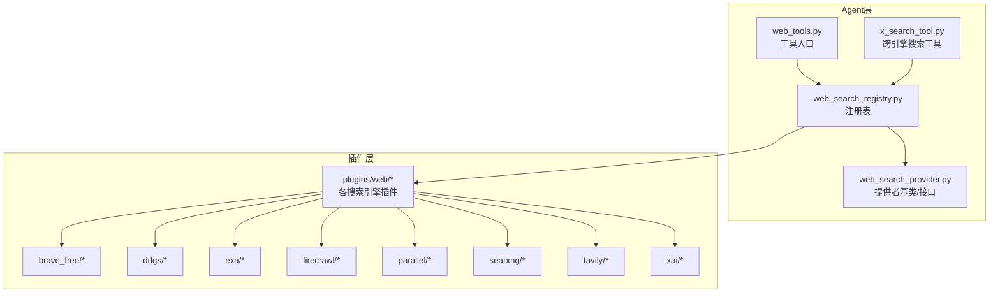
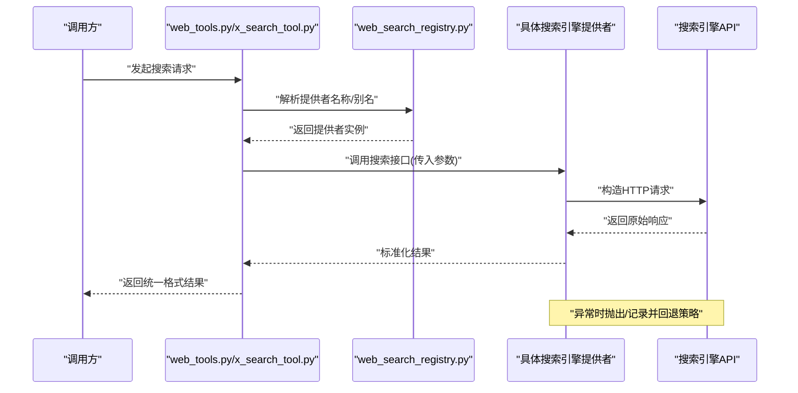
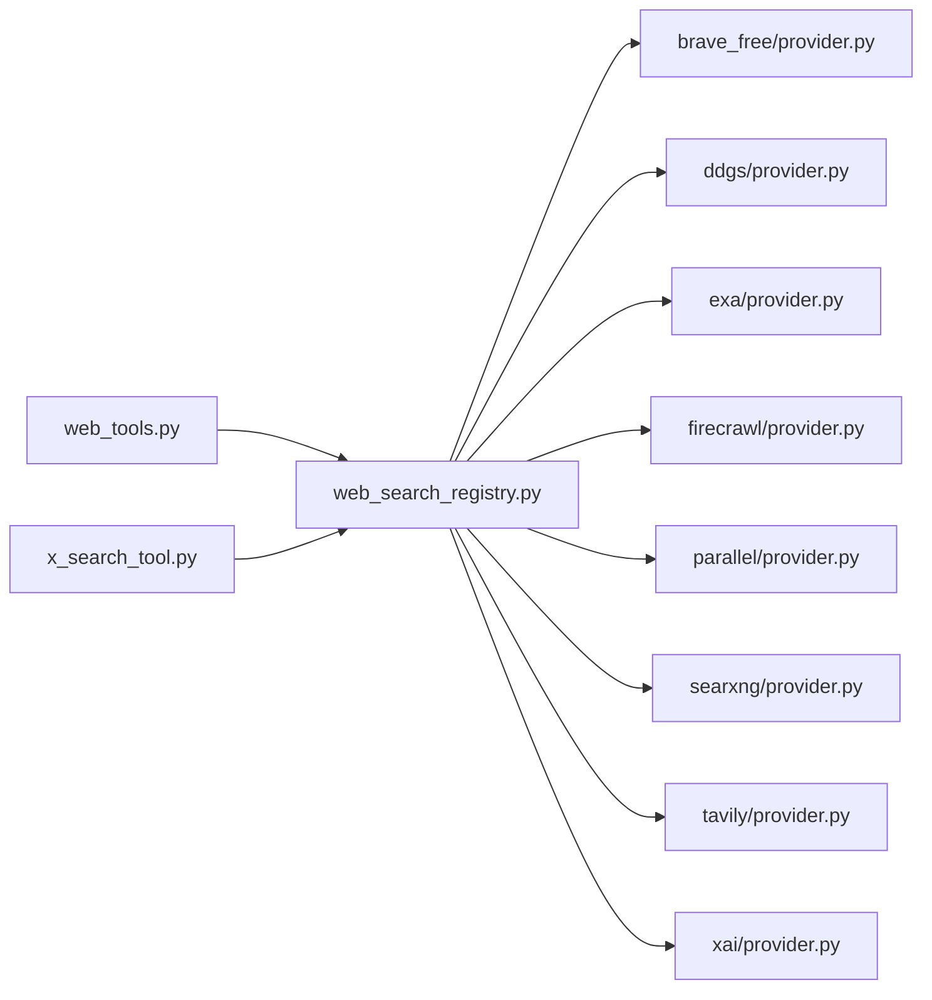

# 网络搜索插件

<cite>
**本文引用的文件**
- [agent/web_search_provider.py](file://agent/web_search_provider.py)
- [agent/web_search_registry.py](file://agent/web_search_registry.py)
- [plugins/web/__init__.py](file://plugins/web/__init__.py)
- [plugins/web/brave_free/plugin.yaml](file://plugins/web/brave_free/plugin.yaml)
- [plugins/web/brave_free/provider.py](file://plugins/web/brave_free/provider.py)
- [plugins/web/ddgs/plugin.yaml](file://plugins/web/ddgs/plugin.yaml)
- [plugins/web/ddgs/provider.py](file://plugins/web/ddgs/provider.py)
- [plugins/web/exa/plugin.yaml](file://plugins/web/exa/plugin.yaml)
- [plugins/web/exa/provider.py](file://plugins/web/exa/provider.py)
- [plugins/web/firecrawl/plugin.yaml](file://plugins/web/firecrawl/plugin.yaml)
- [plugins/web/firecrawl/provider.py](file://plugins/web/firecrawl/provider.py)
- [plugins/web/parallel/plugin.yaml](file://plugins/web/parallel/plugin.yaml)
- [plugins/web/parallel/provider.py](file://plugins/web/parallel/provider.py)
- [plugins/web/searxng/plugin.yaml](file://plugins/web/searxng/plugin.yaml)
- [plugins/web/searxng/provider.py](file://plugins/web/searxng/provider.py)
- [plugins/web/tavily/plugin.yaml](file://plugins/web/tavily/plugin.yaml)
- [plugins/web/tavily/provider.py](file://plugins/web/tavily/provider.py)
- [plugins/web/xai/plugin.yaml](file://plugins/web/xai/plugin.yaml)
- [plugins/web/xai/provider.py](file://plugins/web/xai/provider.py)
- [tools/web_tools.py](file://tools/web_tools.py)
- [tools/x_search_tool.py](file://tools/x_search_tool.py)
- [tests/plugins/web/test_web_search_provider_plugins.py](file://tests/plugins/web/test_web_search_provider_plugins.py)
</cite>

## 目录
1. [简介](#简介)
2. [项目结构](#项目结构)
3. [核心组件](#核心组件)
4. [架构总览](#架构总览)
5. [详细组件分析](#详细组件分析)
6. [依赖关系分析](#依赖关系分析)
7. [性能考量](#性能考量)
8. [故障排查指南](#故障排查指南)
9. [结论](#结论)
10. [附录](#附录)

## 简介
本文件面向Hermes Agent的网络搜索插件体系，系统性说明各搜索引擎插件的功能特性、API集成方式与配置要点，并给出参数配置、结果处理与错误处理机制的实现思路。同时提供插件选型建议、性能对比维度与使用建议，以及开发、测试与维护流程的最佳实践。

## 项目结构
Hermes Agent的网络搜索能力由“注册表 + 提供者”两层抽象构成：注册表负责统一管理可用的搜索提供者；提供者封装具体搜索引擎的API调用与结果解析。插件目录下包含多个搜索引擎的具体实现，每个实现均遵循一致的接口契约，便于在运行时按需加载与切换。

图表来源
- [agent/web_search_registry.py](file://agent/web_search_registry.py)
- [agent/web_search_provider.py](file://agent/web_search_provider.py)
- [plugins/web/__init__.py](file://plugins/web/__init__.py)
- [tools/web_tools.py](file://tools/web_tools.py)
- [tools/x_search_tool.py](file://tools/x_search_tool.py)

章节来源
- [agent/web_search_registry.py](file://agent/web_search_registry.py)
- [agent/web_search_provider.py](file://agent/web_search_provider.py)
- [plugins/web/__init__.py](file://plugins/web/__init__.py)
- [tools/web_tools.py](file://tools/web_tools.py)
- [tools/x_search_tool.py](file://tools/x_search_tool.py)

## 核心组件
- 注册表（web_search_registry.py）：集中声明可用的搜索提供者，定义默认提供者与别名映射，支持按名称检索与实例化。
- 提供者（web_search_provider.py）：定义统一的搜索接口规范（如查询参数、结果结构、错误类型），确保不同搜索引擎实现的一致性。
- 插件入口（plugins/web/__init__.py）：聚合各搜索引擎插件，暴露统一的加载与初始化逻辑。
- 工具入口（web_tools.py、x_search_tool.py）：对外提供可直接调用的搜索工具，内部通过注册表解析目标提供者并执行搜索。

章节来源
- [agent/web_search_registry.py](file://agent/web_search_registry.py)
- [agent/web_search_provider.py](file://agent/web_search_provider.py)
- [plugins/web/__init__.py](file://plugins/web/__init__.py)
- [tools/web_tools.py](file://tools/web_tools.py)
- [tools/x_search_tool.py](file://tools/x_search_tool.py)

## 架构总览
下图展示从工具调用到具体搜索引擎提供者的端到端流程，包括参数传递、结果转换与异常处理路径。

图表来源
- [tools/web_tools.py](file://tools/web_tools.py)
- [tools/x_search_tool.py](file://tools/x_search_tool.py)
- [agent/web_search_registry.py](file://agent/web_search_registry.py)
- [agent/web_search_provider.py](file://agent/web_search_provider.py)

## 详细组件分析

### Brave Free 搜索插件
- 功能定位：提供基于Brave Search的免费搜索能力，适合对隐私与去中心化有要求的场景。
- 配置要点：通过插件配置文件声明API端点、认证方式与默认参数；提供者实现负责参数拼装与响应解析。
- 使用场景：隐私优先、无需付费额度、对结果质量与速度有中等要求的通用搜索任务。
- 错误处理：网络超时、API限流、无效参数等异常需捕获并转换为统一错误类型，便于上层重试或降级。

章节来源
- [plugins/web/brave_free/plugin.yaml](file://plugins/web/brave_free/plugin.yaml)
- [plugins/web/brave_free/provider.py](file://plugins/web/brave_free/provider.py)

### DuckDuckGo (DDGS) 搜索插件
- 功能定位：利用DuckDuckGo的搜索服务，强调隐私保护与无追踪特性。
- 配置要点：设置查询参数（语言、地区、时间范围等）与结果数量上限；提供者负责将参数映射到搜索引擎期望的格式。
- 使用场景：注重隐私、避免个性化推荐、需要稳定结果来源的场景。
- 错误处理：针对API变更与临时不可用进行幂等重试与降级提示。

章节来源
- [plugins/web/ddgs/plugin.yaml](file://plugins/web/ddgs/plugin.yaml)
- [plugins/web/ddgs/provider.py](file://plugins/web/ddgs/provider.py)

### Exa 搜索插件
- 功能定位：面向开发者与研究场景的高质量搜索，强调结果相关性与可解释性。
- 配置要点：支持高级过滤器（媒体类型、日期范围、语言等）与排序选项；提供者需严格校验过滤条件并进行参数转义。
- 使用场景：学术研究、技术问答、内容发现与事实核查。
- 错误处理：对非法过滤器与超出配额的情况进行明确报错与用户提示。

章节来源
- [plugins/web/exa/plugin.yaml](file://plugins/web/exa/plugin.yaml)
- [plugins/web/exa/provider.py](file://plugins/web/exa/provider.py)

### Firecrawl 搜索插件
- 功能定位：提供网页抓取与内容提取能力，适合需要从网页中抽取结构化信息的场景。
- 配置要点：支持深度抓取、排除规则、输出字段控制；提供者负责构建抓取任务并解析返回的页面内容。
- 使用场景：内容聚合、知识库构建、网页内容二次加工。
- 错误处理：对抓取失败、链接失效、内容解析异常进行分类处理与日志记录。

章节来源
- [plugins/web/firecrawl/plugin.yaml](file://plugins/web/firecrawl/plugin.yaml)
- [plugins/web/firecrawl/provider.py](file://plugins/web/firecrawl/provider.py)

### Parallel 搜索插件
- 功能定位：并行化多源搜索以提升召回率与覆盖度，适合需要综合多引擎结果的场景。
- 配置要点：定义上游提供者列表、并发策略与合并策略；提供者负责调度与结果去重/排序。
- 使用场景：综合搜索、竞品分析、跨域内容发现。
- 错误处理：单源失败不影响整体流程，需记录失败原因并保证结果完整性。

章节来源
- [plugins/web/parallel/plugin.yaml](file://plugins/web/parallel/plugin.yaml)
- [plugins/web/parallel/provider.py](file://plugins/web/parallel/provider.py)

### Searxng 搜索插件
- 功能定位：自托管/私有化的元搜索引擎，支持多后端聚合与隐私可控。
- 配置要点：配置后端列表、权重与过滤规则；提供者负责将查询路由至合适的后端并聚合结果。
- 使用场景：企业内网搜索、隐私敏感环境、需要自定义后端的场景。
- 错误处理：后端不可用时自动切换与降级，保证服务连续性。

章节来源
- [plugins/web/searxng/plugin.yaml](file://plugins/web/searxng/plugin.yaml)
- [plugins/web/searxng/provider.py](file://plugins/web/searxng/provider.py)

### Tavily 搜索插件
- 功能定位：面向应用与产品集成的搜索API，强调易用性与稳定性。
- 配置要点：设置返回字段、结果数量、是否启用摘要与图片等；提供者负责参数映射与结果清洗。
- 使用场景：应用内搜索、智能助手、内容推荐。
- 错误处理：对API限流、鉴权失败与参数错误进行快速失败与重试策略。

章节来源
- [plugins/web/tavily/plugin.yaml](file://plugins/web/tavily/plugin.yaml)
- [plugins/web/tavily/provider.py](file://plugins/web/tavily/provider.py)

### XAI 搜索插件
- 功能定位：基于XAI平台的搜索能力，适合需要与XAI生态集成的场景。
- 配置要点：根据平台要求设置认证头、请求体字段与返回格式；提供者负责与平台API的对接。
- 使用场景：XAI生态内的搜索与内容发现。
- 错误处理：对平台侧错误码进行映射与用户提示，必要时触发告警。

章节来源
- [plugins/web/xai/plugin.yaml](file://plugins/web/xai/plugin.yaml)
- [plugins/web/xai/provider.py](file://plugins/web/xai/provider.py)

## 依赖关系分析
- 组件耦合：工具层仅依赖注册表，注册表再依赖具体提供者，形成清晰的解耦结构。
- 外部依赖：各提供者依赖对应搜索引擎的HTTP API，需关注网络延迟、限流与协议变更风险。
- 可能的循环依赖：当前结构为单向依赖（工具→注册表→提供者），未见循环依赖迹象。

图表来源
- [tools/web_tools.py](file://tools/web_tools.py)
- [tools/x_search_tool.py](file://tools/x_search_tool.py)
- [agent/web_search_registry.py](file://agent/web_search_registry.py)
- [plugins/web/brave_free/provider.py](file://plugins/web/brave_free/provider.py)
- [plugins/web/ddgs/provider.py](file://plugins/web/ddgs/provider.py)
- [plugins/web/exa/provider.py](file://plugins/web/exa/provider.py)
- [plugins/web/firecrawl/provider.py](file://plugins/web/firecrawl/provider.py)
- [plugins/web/parallel/provider.py](file://plugins/web/parallel/provider.py)
- [plugins/web/searxng/provider.py](file://plugins/web/searxng/provider.py)
- [plugins/web/tavily/provider.py](file://plugins/web/tavily/provider.py)
- [plugins/web/xai/provider.py](file://plugins/web/xai/provider.py)

章节来源
- [agent/web_search_registry.py](file://agent/web_search_registry.py)
- [tools/web_tools.py](file://tools/web_tools.py)
- [tools/x_search_tool.py](file://tools/x_search_tool.py)
- [plugins/web/brave_free/provider.py](file://plugins/web/brave_free/provider.py)
- [plugins/web/ddgs/provider.py](file://plugins/web/ddgs/provider.py)
- [plugins/web/exa/provider.py](file://plugins/web/exa/provider.py)
- [plugins/web/firecrawl/provider.py](file://plugins/web/firecrawl/provider.py)
- [plugins/web/parallel/provider.py](file://plugins/web/parallel/provider.py)
- [plugins/web/searxng/provider.py](file://plugins/web/searxng/provider.py)
- [plugins/web/tavily/provider.py](file://plugins/web/tavily/provider.py)
- [plugins/web/xai/provider.py](file://plugins/web/xai/provider.py)

## 性能考量
- 并发与超时：合理设置请求超时与并发数，避免阻塞主线程；对慢源进行隔离与熔断。
- 结果合并：并行提供者需实现高效去重与排序算法，减少下游处理成本。
- 缓存策略：对热点查询结果进行短期缓存，降低重复请求与外部依赖压力。
- 资源配额：监控各搜索引擎的配额与计费项，设置阈值告警与自动降级。
- 网络优化：在多区域部署时选择就近节点，减少跨地域延迟。

## 故障排查指南
- 参数校验失败：检查查询参数是否符合提供者约束，确认必填字段与枚举值。
- 网络异常：验证代理设置、DNS解析与防火墙策略；对偶发网络波动实施指数退避重试。
- API限流：识别限流信号并触发节流策略，必要时切换备用提供者或降级为轻量模式。
- 结果为空：确认关键词是否过于宽泛或受限；尝试调整过滤器或扩大搜索范围。
- 日志与可观测性：为每个提供者开启独立的日志通道，记录请求ID、耗时与错误码，便于定位问题。

章节来源
- [tests/plugins/web/test_web_search_provider_plugins.py](file://tests/plugins/web/test_web_search_provider_plugins.py)

## 结论
Hermes Agent的网络搜索插件体系通过统一的注册表与提供者接口，实现了多搜索引擎的无缝集成与灵活切换。各插件在隐私、性能与功能之间提供了差异化选择，配合完善的错误处理与可观测性，能够满足多样化的搜索需求。建议在生产环境中结合业务场景选择合适插件组合，并建立完善的监控与应急预案。

## 附录

### 插件选择指南
- 隐私优先：Brave Free、DDGS、Searxng
- 开发者研究：Exa、Tavily
- 内容抓取：Firecrawl
- 综合覆盖：Parallel
- 平台集成：XAI

### 性能对比维度
- 响应时间：平均与P95延迟
- 结果质量：相关性、去重效果、摘要准确性
- 成本与配额：请求次数、字符数、并发限制
- 可靠性：可用性、错误率、自动重试成功率

### 开发、测试与维护流程
- 开发流程
  - 在插件目录新增子目录与配置文件，实现provider.py中的接口方法。
  - 在注册表中注册新提供者，确保名称唯一且语义清晰。
  - 在工具层补充必要的参数映射与默认值。
- 测试流程
  - 单元测试：覆盖正常路径、边界条件与异常分支。
  - 集成测试：模拟真实API响应，验证结果转换与错误处理。
  - 回归测试：在每次更新后运行全量测试集，确保兼容性。
- 维护流程
  - 监控：建立SLA指标与告警，定期评估性能与成本。
  - 迭代：根据用户反馈与业务变化调整参数与策略。
  - 文档：同步更新插件说明与配置示例，保持内外一致。