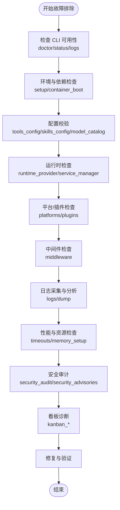
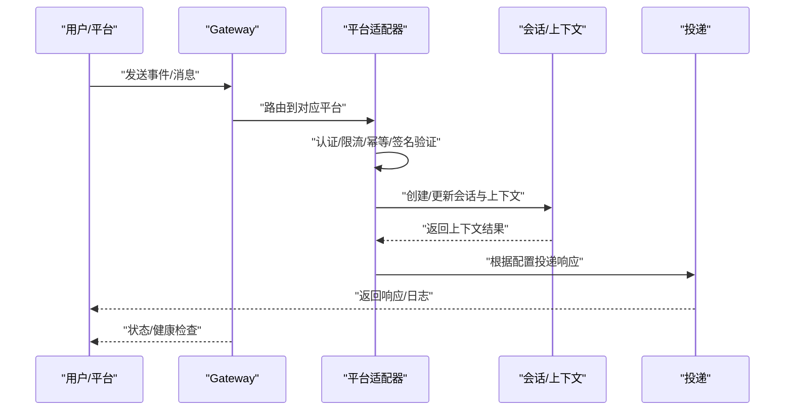
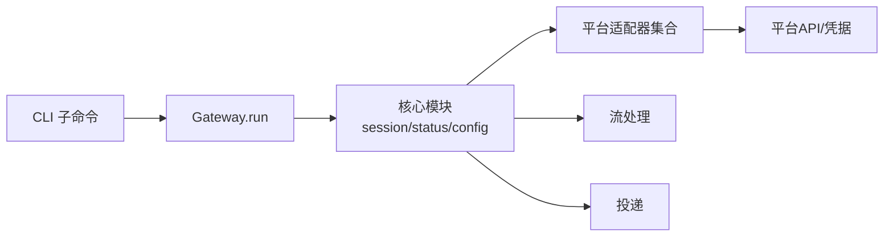

# 故障排除

<cite>
**本文引用的文件**
- [hermes_cli/doctor.py](file://hermes_cli/doctor.py)
- [hermes_cli/debug.py](file://hermes_cli/debug.py)
- [hermes_cli/logs.py](file://hermes_cli/logs.py)
- [hermes_cli/dump.py](file://hermes_cli/dump.py)
- [hermes_cli/main.py](file://hermes_cli/main.py)
- [hermes_cli/status.py](file://hermes_cli/status.py)
- [hermes_cli/setup.py](file://hermes_cli/setup.py)
- [hermes_cli/container_boot.py](file://hermes_cli/container_boot.py)
- [hermes_cli/migrate.py](file://hermes_cli/migrate.py)
- [hermes_cli/backup.py](file://hermes_cli/backup.py)
- [hermes_cli/uninstall.py](file://hermes_cli/uninstall.py)
- [hermes_cli/runtime_provider.py](file://hermes_cli/runtime_provider.py)
- [hermes_cli/service_manager.py](file://hermes_cli/service_manager.py)
- [hermes_cli/cron.py](file://hermes_cli/cron.py)
- [hermes_cli/model_switch.py](file://hermes_cli/model_switch.py)
- [hermes_cli/model_catalog.py](file://hermes_cli/model_catalog.py)
- [hermes_cli/tools_config.py](file://hermes_cli/tools_config.py)
- [hermes_cli/skills_config.py](file://hermes_cli/skills_config.py)
- [hermes_cli/platforms.py](file://hermes_cli/platforms.py)
- [hermes_cli/plugins.py](file://hermes_cli/plugins.py)
- [hermes_cli/middleware.py](file://hermes_cli/middleware.py)
- [hermes_cli/timeouts.py](file://hermes_cli/timeouts.py)
- [hermes_cli/memory_setup.py](file://hermes_cli/memory_setup.py)
- [hermes_cli/security_audit.py](file://hermes_cli/security_audit.py)
- [hermes_cli/security_advisories.py](file://hermes_cli/security_advisories.py)
- [hermes_cli/kanban_diagnostics.py](file://hermes_cli/kanban_diagnostics.py)
- [hermes_cli/kanban.py](file://hermes_cli/kanban.py)
- [hermes_cli/kanban_db.py](file://hermes_cli/kanban_db.py)
- [hermes_cli/kanban_swarm.py](file://hermes_cli/kanban_swarm.py)
- [hermes_cli/kanban_specify.py](file://hermes_cli/kanban_specify.py)
- [hermes_cli/kanban_decompose.py](file://hermes_cli/kanban_decompose.py)
- [hermes_cli/kanban.py](file://hermes_cli/kanban.py)
- [gateway/run.py](file://gateway/run.py)
- [gateway/status.py](file://gateway/status.py)
- [gateway/shutdown_forensics.py](file://gateway/shutdown_forensics.py)
- [gateway/display_config.py](file://gateway/display_config.py)
- [gateway/channel_directory.py](file://gateway/channel_directory.py)
- [gateway/session.py](file://gateway/session.py)
- [gateway/session_context.py](file://gateway/session_context.py)
- [gateway/pairing.py](file://gateway/pairing.py)
- [gateway/platform_registry.py](file://gateway/platform_registry.py)
- [gateway/hooks.py](file://gateway/hooks.py)
- [gateway/mirror.py](file://gateway/mirror.py)
- [gateway/stream_dispatch.py](file://gateway/stream_dispatch.py)
- [gateway/stream_consumer.py](file://gateway/stream_consumer.py)
- [gateway/stream_events.py](file://gateway/stream_events.py)
- [gateway/delivery.py](file://gateway/delivery.py)
- [gateway/restart.py](file://gateway/restart.py)
- [gateway/config.py](file://gateway/config.py)
- [gateway/display_config.py](file://gateway/display_config.py)
- [gateway/status.py](file://gateway/status.py)
- [gateway/shutdown_forensics.py](file://gateway/shutdown_forensics.py)
- [gateway/platforms/api_server.py](file://gateway/platforms/api_server.py)
- [gateway/platforms/base.py](file://gateway/platforms/base.py)
- [gateway/platforms/slack.py](file://gateway/platforms/slack.py)
- [gateway/platforms/telegram.py](file://gateway/platforms/telegram.py)
- [gateway/platforms/email.py](file://gateway/platforms/email.py)
- [gateway/platforms/whatsapp.py](file://gateway/platforms/whatsapp.py)
- [gateway/platforms/matrix.py](file://gateway/platforms/matrix.py)
- [gateway/platforms/signal.py](file://gateway/platforms/signal.py)
- [gateway/platforms/sms.py](file://gateway/platforms/sms.py)
- [gateway/platforms/dingtalk.py](file://gateway/platforms/dingtalk.py)
- [gateway/platforms/feishu.py](file://gateway/platforms/feishu.py)
- [gateway/platforms/wecom.py](file://gateway/platforms/wecom.py)
- [gateway/platforms/weixin.py](file://gateway/platforms/weixin.py)
- [gateway/platforms/bluebubbles.py](file://gateway/platforms/bluebubbles.py)
- [gateway/platforms/yuanbao.py](file://gateway/platforms/yuanbao.py)
- [gateway/platforms/yuanbao_media.py](file://gateway/platforms/yuanbao_media.py)
- [gateway/platforms/yuanbao_proto.py](file://gateway/platforms/yuanbao_proto.py)
- [gateway/platforms/yuanbao_sticker.py](file://gateway/platforms/yuanbao_sticker.py)
- [gateway/platforms/webhook.py](file://gateway/platforms/webhook.py)
- [gateway/platforms/msgraph_webhook.py](file://gateway/platforms/msgraph_webhook.py)
- [gateway/platforms/qqbot.py](file://gateway/platforms/qqbot.py)
- [gateway/platforms/helpers.py](file://gateway/platforms/helpers.py)
- [gateway/platforms/_http_client_limits.py](file://gateway/platforms/_http_client_limits.py)
- [gateway/platforms/feishu_comment.py](file://gateway/platforms/feishu_comment.py)
- [gateway/platforms/feishu_comment_rules.py](file://gateway/platforms/feishu_comment_rules.py)
- [gateway/platforms/feishu_meeting_invite.py](file://gateway/platforms/feishu_meeting_invite.py)
- [gateway/platforms/whatsapp_identity.py](file://gateway/platforms/whatsapp_identity.py)
- [gateway/platforms/telegram_network.py](file://gateway/platforms/telegram_network.py)
- [gateway/platforms/signal_rate_limit.py](file://gateway/platforms/signal_rate_limit.py)
- [gateway/platforms/msgraph_webhook.py](file://gateway/platforms/msgraph_webhook.py)
- [gateway/platforms/qqbot.py](file://gateway/platforms/qqbot.py)
- [gateway/platforms/helpers.py](file://gateway/platforms/helpers.py)
- [gateway/platforms/_http_client_limits.py](file://gateway/platforms/_http_client_limits.py)
- [gateway/platforms/feishu_comment.py](file://gateway/platforms/feishu_comment.py)
- [gateway/platforms/feishu_comment_rules.py](file://gateway/platforms/feishu_comment_rules.py)
- [gateway/platforms/feishu_meeting_invite.py](file://gateway/platforms/feishu_meeting_invite.py)
- [gateway/platforms/whatsapp_identity.py](file://gateway/platforms/whatsapp_identity.py)
- [gateway/platforms/telegram_network.py](file://gateway/platforms/telegram_network.py)
- [gateway/platforms/signal_rate_limit.py](file://gateway/platforms/signal_rate_limit.py)
- [gateway/platforms/msgraph_webhook.py](file://gateway/platforms/msgraph_webhook.py)
- [gateway/platforms/qqbot.py](file://gateway/platforms/qqbot.py)
- [gateway/platforms/helpers.py](file://gateway/platforms/helpers.py)
- [gateway/platforms/_http_client_limits.py](file://gateway/platforms/_http_client_limits.py)
- [gateway/platforms/feishu_comment.py](file://gateway/platforms/feishu_comment.py)
- [gateway/platforms/feishu_comment_rules.py](file://gateway/platforms/feishu_comment_rules.py)
- [gateway/platforms/feishu_meeting_invite.py](file://gateway/platforms/feishu_meeting_invite.py)
- [gateway/platforms/whatsapp_identity.py](file://gateway/platforms/whatsapp_identity.py)
- [gateway/platforms/telegram_network.py](file://gateway/platforms/telegram_network.py)
- [gateway/platforms/signal_rate_limit.py](file://gateway/platforms/signal_rate_limit.py)
- [gateway/platforms/msgraph_webhook.py](file://gateway/platforms/msgraph_webhook.py)
- [gateway/platforms/qqbot.py](file://gateway/platforms/qqbot.py)
- [gateway/platforms/helpers.py](file://gateway/platforms/helpers.py)
- [gateway/platforms/_http_client_limits.py](file://gateway/platforms/_http_client_limits.py)
- [gateway/platforms/feishu_comment.py](file://gateway/platforms/feishu_comment.py)
- [gateway/platforms/feishu_comment_rules.py](file://gateway/platforms/feishu_comment_rules.py)
- [gateway/platforms/feishu_meeting_invite.py](file://gateway/platforms/feishu_meeting_invite.py)
- [gateway/platforms/whatsapp_identity.py](file://gateway/platforms/whatsapp_identity.py)
- [gateway/platforms/telegram_network.py](file://gateway/platforms/telegram_network.py)
- [gateway/platforms/signal_rate_limit.py](file://gateway/platforms/signal_rate_limit.py)
- [gateway/platforms/msgraph_webhook.py](file://gateway/platforms/msgraph_webhook.py)
- [gateway/platforms/qqbot.py](file://gateway/platforms/qqbot.py)
- [gateway/platforms/helpers.py](file://gateway/platforms/helpers.py)
- [gateway/platforms/_http_client_limits.py](file://gateway/platforms/_http_client_limits.py)
- [gateway/platforms/feishu_comment.py](file://gateway/platforms/feishu_comment.py)
- [gateway/platforms/feishu_comment_rules.py](file://gateway/platforms/feishu_comment_rules.py)
- [gateway/platforms/feishu_meeting_invite.py](file://gateway/platforms/feishu_meeting_invite.py)
- [gateway/platforms/whatsapp_identity.py](file://gateway/platforms/whatsapp_identity.py)
- [gateway/platforms/telegram_network.py](file://gateway/platforms/telegram_network.py)
- [gateway/platforms/signal_rate_limit.py](file://gateway/platforms/signal_rate_limit.py)
- [gateway/platforms/msgraph_webhook.py](file://gateway/platforms/msgraph_webhook.py)
- [gateway/platforms/qqbot.py](file://gateway/platforms/qqbot.py)
- [gateway/platforms/helpers.py](file://gateway/platforms/helpers.py)
- [gateway/platforms/_http_client_limits.py](file://gateway/platforms/_http_client_limits.py)
- [gateway/platforms/feishu_comment.py](file://gateway/platforms/feishu_comment.py)
- [gateway/platforms/feishu_comment_rules.py](file://gateway/platforms/feishu_comment_rules.py)
- [gateway/platforms/feishu_meeting_invite.py](file://gateway/platforms/feishu_meeting_invite.py)
- [gateway/platforms/whatsapp_identity.py](file://gateway/platforms/whatsapp_identity.py)
- [gateway/platforms/telegram_network.py](file://gateway/platforms/telegram_network.py)
- [gateway/platforms/signal_rate_limit.py](file://gateway/platforms/signal_rate_limit.py)
- [gateway/platforms/msgraph_webhook.py](file://gateway/platforms/msgraph_webhook.py)
- [gateway/platforms/qqbot.py](file://gateway/platforms/qqbot.py)
- [gateway/platforms/helpers.py](file://gateway/platforms/helpers.py)
- [gateway/platforms/_http_client_limits.py](file://gateway/platforms/_http_client_limits.py)
- [gateway/platforms/feishu_comment.py](file://gateway/platforms/feishu_comment.py)
- [gateway/platforms/feishu_comment_rules.py](file://gateway/platforms/feishu_comment_rules.py)
- [gateway/platforms/feishu_meeting_invite.py](file://gateway/platforms/feishu_meeting_invite.py)
- [gateway/platforms/whatsapp_identity.py](file://gateway/platforms/whatsapp_identity......)
</cite>

## 目录
1. 引言
2. 项目结构
3. 核心组件
4. 架构总览
5. 详细组件分析
6. 依赖关系分析
7. 性能考量
8. 故障排除指南
9. 结论
10. 附录

## 引言
本指南面向使用者与运维人员，提供Hermes Agent在安装、运行、性能与集成方面的系统化故障排除流程。内容覆盖常见症状、根因分析、解决步骤、调试工具使用、日志分析与性能分析技巧，并包含紧急处置、回滚策略与数据恢复建议。文档同时给出可视化图示，帮助快速定位问题。

## 项目结构
Hermes Agent由CLI、Gateway平台适配层、插件与技能生态、以及容器/桌面运行时组成。故障排除涉及以下关键路径：
- CLI诊断与维护：doctor、debug、logs、dump、status、setup、container_boot、migrate、backup、uninstall、runtime_provider、service_manager、cron、model_switch、model_catalog、tools_config、skills_config、platforms、plugins、middleware、timeouts、memory_setup、security_audit、security_advisories、kanban系列
- Gateway运行与平台：run、status、shutdown_forensics、display_config、channel_directory、session、session_context、pairing、platform_registry、hooks、mirror、stream_dispatch、stream_consumer、stream_events、delivery、restart、config、platforms/*（api_server、base、slack、telegram、email、whatsapp、matrix、signal、sms、dingtalk、feishu、wecom、weixin、bluebubbles、yuanbao、webhook、msgraph_webhook、qqbot、helpers、_http_client_limits、feishu_comment、feishu_comment_rules、feishu_meeting_invite、whatsapp_identity、telegram_network、signal_rate_limit）

```mermaid
graph TB
subgraph "CLI 故障排除"
D["doctor.py"]
DBG["debug.py"]
LG["logs.py"]
DP["dump.py"]
ST["status.py"]
SU["setup.py"]
CB["container_boot.py"]
MG["migrate.py"]
BK["backup.py"]
UN["uninstall.py"]
RP["runtime_provider.py"]
SM["service_manager.py"]
CR["cron.py"]
MS["model_switch.py"]
MC["model_catalog.py"]
TC["tools_config.py"]
SC["skills_config.py"]
PF["platforms.py"]
PL["plugins.py"]
MW["middleware.py"]
TM["timeouts.py"]
ME["memory_setup.py"]
SA["security_audit.py"]
SD["security_advisories.py"]
KD["kanban_diagnostics.py"]
K["kanban.py"]
KDB["kanban_db.py"]
KS["kanban_swarm.py"]
KSP["kanban_specify.py"]
KDC["kanban_decompose.py"]
end
subgraph "Gateway 运行与平台"
RUN["run.py"]
STAT["status.py"]
SF["shutdown_forensics.py"]
DC["display_config.py"]
CD["channel_directory.py"]
SESS["session.py"]
SCTX["session_context.py"]
PAIR["pairing.py"]
REG["platform_registry.py"]
HK["hooks.py"]
MR["mirror.py"]
SDP["stream_dispatch.py"]
SCR["stream_consumer.py"]
EVT["stream_events.py"]
DEL["delivery.py"]
RST["restart.py"]
CFG["config.py"]
PBASE["platforms/base.py"]
PAPI["platforms/api_server.py"]
PSLK["platforms/slack.py"]
PTEG["platforms/telegram.py"]
PEM["platforms/email.py"]
PWA["platforms/whatsapp.py"]
PMX["platforms/matrix.py"]
PSI["platforms/signal.py"]
PSMS["platforms/sms.py"]
PDT["platforms/dingtalk.py"]
PFS["platforms/feishu.py"]
PWC["platforms/wecom.py"]
PWX["platforms/weixin.py"]
PBL["platforms/bluebubbles.py"]
PYB["platforms/yuanbao.py"]
PWEB["platforms/webhook.py"]
PMS["platforms/msgraph_webhook.py"]
PQQ["platforms/qqbot.py"]
PH["platforms/helpers.py"]
PHL["platforms/_http_client_limits.py"]
PFC["platforms/feishu_comment.py"]
PFCS["platforms/feishu_comment_rules.py"]
PFMI["platforms/feishu_meeting_invite.py"]
PWI["platforms/whatsapp_identity.py"]
PTN["platforms/telegram_network.py"]
PSR["platforms/signal_rate_limit.py"]
end
D --> RUN
DBG --> RUN
LG --> RUN
DP --> RUN
ST --> RUN
SU --> RUN
CB --> RUN
MG --> RUN
BK --> RUN
UN --> RUN
RP --> RUN
SM --> RUN
CR --> RUN
MS --> RUN
MC --> RUN
TC --> RUN
SC --> RUN
PF --> RUN
PL --> RUN
MW --> RUN
TM --> RUN
ME --> RUN
SA --> RUN
SD --> RUN
KD --> RUN
K --> RUN
KDB --> RUN
KS --> RUN
KSP --> RUN
KDC --> RUN
RUN --> PBASE
RUN --> PAPI
RUN --> PSLK
RUN --> PTEG
RUN --> PEM
RUN --> PWA
RUN --> PMX
RUN --> PSI
RUN --> PSMS
RUN --> PDT
RUN --> PFS
RUN --> PWC
RUN --> PWX
RUN --> PBL
RUN --> PYB
RUN --> PWEB
RUN --> PMS
RUN --> PQQ
RUN --> PH
RUN --> PHL
RUN --> PFC
RUN --> PFCS
RUN --> PFMI
RUN --> PWI
RUN --> PTN
RUN --> PSR
```

图表来源
- [hermes_cli/doctor.py](file://hermes_cli/doctor.py)
- [gateway/run.py](file://gateway/run.py)
- [gateway/platforms/base.py](file://gateway/platforms/base.py)
- [gateway/platforms/api_server.py](file://gateway/platforms/api_server.py)

章节来源
- [hermes_cli/main.py](file://hermes_cli/main.py)
- [gateway/run.py](file://gateway/run.py)

## 核心组件
- CLI诊断与维护：提供系统健康检查、日志采集、状态查询、迁移备份、卸载、运行时与服务管理、定时任务、模型切换与目录、工具与技能配置、平台与插件管理、中间件、超时与内存设置、安全审计与公告、看板诊断与数据库等能力。
- Gateway运行与平台：负责启动、状态、停机取证、显示配置、通道目录、会话与上下文、配对、平台注册、钩子、镜像、流分发与消费、事件、投递、重启、配置、平台适配器（Slack、Telegram、Email、WhatsApp、Matrix、Signal、SMS、DingTalk、Feishu、WeCom、WeChat、BlueBubbles、Yuanbao、Webhook、MSGraph Webhook、QQBot等）、辅助工具与网络限流、评论与会议邀请、身份与网络策略等。

章节来源
- [hermes_cli/doctor.py](file://hermes_cli/doctor.py)
- [hermes_cli/logs.py](file://hermes_cli/logs.py)
- [hermes_cli/status.py](file://hermes_cli/status.py)
- [gateway/run.py](file://gateway/run.py)
- [gateway/platforms/base.py](file://gateway/platforms/base.py)

## 架构总览
下图展示CLI与Gateway之间的交互关系，以及Gateway内部平台适配器的职责分工。通过该图可快速定位问题发生在CLI侧（配置/环境/依赖）还是Gateway侧（平台连通性/投递/幂等性/签名）。

```mermaid
graph TB
CLI["Hermes CLI<br/>doctor/logs/status/migrate/backup/..."]
GW_RUN["Gateway 运行时<br/>run.py"]
GW_CFG["Gateway 配置<br/>config.py"]
GW_STAT["Gateway 状态<br/>status.py"]
GW_SHUT["停机取证<br/>shutdown_forensics.py"]
GW_DISP["显示配置<br/>display_config.py"]
GW_CHAN["通道目录<br/>channel_directory.py"]
GW_SESS["会话/上下文<br/>session.py / session_context.py"]
GW_PAIR["配对<br/>pairing.py"]
GW_REG["平台注册<br/>platform_registry.py"]
GW_HOOK["钩子<br/>hooks.py"]
GW_MIRR["镜像<br/>mirror.py"]
GW_STRD["流分发<br/>stream_dispatch.py"]
GW_STRC["流消费<br/>stream_consumer.py"]
GW_STRE["流事件<br/>stream_events.py"]
GW_DEL["投递<br/>delivery.py"]
GW_RESTART["重启<br/>restart.py"]
subgraph "平台适配器"
P_ALL["全部平台<br/>base/api_server/slack/telegram/email/..."]
P_WEB["Webhook<br/>webhook.py"]
P_MS["MSGraph Webhook<br/>msgraph_webhook.py"]
P_QQ["QQBot<br/>qqbot.py"]
P_HELP["helpers/_http_client_limits"]
P_FEI["Feishu 评论/规则/会议"]
P_WA["WhatsApp 身份"]
P_TG["Telegram 网络"]
P_SIG["Signal 限流"]
end
CLI --> GW_RUN
GW_RUN --> GW_CFG
GW_RUN --> GW_STAT
GW_RUN --> GW_SHUT
GW_RUN --> GW_DISP
GW_RUN --> GW_CHAN
GW_RUN --> GW_SESS
GW_RUN --> GW_PAIR
GW_RUN --> GW_REG
GW_RUN --> GW_HOOK
GW_RUN --> GW_MIRR
GW_RUN --> GW_STRD
GW_RUN --> GW_STRC
GW_RUN --> GW_STRE
GW_RUN --> GW_DEL
GW_RUN --> GW_RESTART
GW_RUN --> P_ALL
P_ALL --> P_WEB
P_ALL --> P_MS
P_ALL --> P_QQ
P_ALL --> P_HELP
P_ALL --> P_FEI
P_ALL --> P_WA
P_ALL --> P_TG
P_ALL --> P_SIG
```

图表来源
- [gateway/run.py](file://gateway/run.py)
- [gateway/config.py](file://gateway/config.py)
- [gateway/status.py](file://gateway/status.py)
- [gateway/shutdown_forensics.py](file://gateway/shutdown_forensics.py)
- [gateway/display_config.py](file://gateway/display_config.py)
- [gateway/channel_directory.py](file://gateway/channel_directory.py)
- [gateway/session.py](file://gateway/session.py)
- [gateway/session_context.py](file://gateway/session_context.py)
- [gateway/pairing.py](file://gateway/pairing.py)
- [gateway/platform_registry.py](file://gateway/platform_registry.py)
- [gateway/hooks.py](file://gateway/hooks.py)
- [gateway/mirror.py](file://gateway/mirror.py)
- [gateway/stream_dispatch.py](file://gateway/stream_dispatch.py)
- [gateway/stream_consumer.py](file://gateway/stream_consumer.py)
- [gateway/stream_events.py](file://gateway/stream_events.py)
- [gateway/delivery.py](file://gateway/delivery.py)
- [gateway/restart.py](file://gateway/restart.py)
- [gateway/platforms/base.py](file://gateway/platforms/base.py)
- [gateway/platforms/api_server.py](file://gateway/platforms/api_server.py)
- [gateway/platforms/webhook.py](file://gateway/platforms/webhook.py)
- [gateway/platforms/msgraph_webhook.py](file://gateway/platforms/msgraph_webhook.py)
- [gateway/platforms/qqbot.py](file://gateway/platforms/qqbot.py)
- [gateway/platforms/helpers.py](file://gateway/platforms/helpers.py)
- [gateway/platforms/_http_client_limits.py](file://gateway/platforms/_http_client_limits.py)
- [gateway/platforms/feishu_comment.py](file://gateway/platforms/feishu_comment.py)
- [gateway/platforms/feishu_comment_rules.py](file://gateway/platforms/feishu_comment_rules.py)
- [gateway/platforms/feishu_meeting_invite.py](file://gateway/platforms/feishu_meeting_invite.py)
- [gateway/platforms/whatsapp_identity.py](file://gateway/platforms/whatsapp_identity.py)
- [gateway/platforms/telegram_network.py](file://gateway/platforms/telegram_network.py)
- [gateway/platforms/signal_rate_limit.py](file://gateway/platforms/signal_rate_limit.py)

## 详细组件分析

### CLI 故障排除组件
- doctor：系统健康检查，扫描环境、依赖、配置与运行时状态，输出可修复建议。
- debug：启用调试模式，输出更详细的运行轨迹与变量快照。
- logs：收集并过滤日志，支持按时间范围、级别、模块筛选。
- dump：导出当前运行态快照（配置、会话、工具定义、技能清单等），便于离线分析。
- status：查询Gateway与平台连通性、会话状态、资源占用与健康指标。
- setup：引导式安装与环境初始化，检查Python、uv、浏览器、权限等。
- container_boot：容器内引导流程，确保环境变量、工作目录、进程生命周期正确。
- migrate：配置迁移与版本升级，避免破坏性变更。
- backup：备份用户数据、配置与会话，支持增量与全量。
- uninstall：安全卸载，清理残留文件与注册信息。
- runtime_provider：选择与切换运行时后端（如桌面/容器/云）。
- service_manager：管理后台服务（开机自启、自动重启、日志轮转）。
- cron：定时任务调度与执行监控。
- model_switch/model_catalog：模型切换与目录校验，避免无效模型导致的推理失败。
- tools_config/skills_config：工具与技能配置校验，定位“工具未找到”类错误。
- platforms/plugins：平台与插件安装/更新/禁用，排查第三方适配器问题。
- middleware：中间件链路诊断，定位请求拦截与转换异常。
- timeouts/memory_setup：超时与内存参数调整，缓解长尾请求与OOM。
- security_audit/security_advisories：安全扫描与公告，识别已知漏洞与弱配置。
- kanban_*：看板相关诊断与数据库一致性检查。

图表来源
- [hermes_cli/doctor.py](file://hermes_cli/doctor.py)
- [hermes_cli/setup.py](file://hermes_cli/setup.py)
- [hermes_cli/container_boot.py](file://hermes_cli/container_boot.py)
- [hermes_cli/tools_config.py](file://hermes_cli/tools_config.py)
- [hermes_cli/skills_config.py](file://hermes_cli/skills_config.py)
- [hermes_cli/runtime_provider.py](file://hermes_cli/runtime_provider.py)
- [hermes_cli/service_manager.py](file://hermes_cli/service_manager.py)
- [hermes_cli/platforms.py](file://hermes_cli/platforms.py)
- [hermes_cli/plugins.py](file://hermes_cli/plugins.py)
- [hermes_cli/middleware.py](file://hermes_cli/middleware.py)
- [hermes_cli/logs.py](file://hermes_cli/logs.py)
- [hermes_cli/dump.py](file://hermes_cli/dump.py)
- [hermes_cli/timeouts.py](file://hermes_cli/timeouts.py)
- [hermes_cli/memory_setup.py](file://hermes_cli/memory_setup.py)
- [hermes_cli/security_audit.py](file://hermes_cli/security_audit.py)
- [hermes_cli/security_advisories.py](file://hermes_cli/security_advisories.py)
- [hermes_cli/kanban_diagnostics.py](file://hermes_cli/kanban_diagnostics.py)

章节来源
- [hermes_cli/doctor.py](file://hermes_cli/doctor.py)
- [hermes_cli/debug.py](file://hermes_cli/debug.py)
- [hermes_cli/logs.py](file://hermes_cli/logs.py)
- [hermes_cli/dump.py](file://hermes_cli/dump.py)
- [hermes_cli/status.py](file://hermes_cli/status.py)
- [hermes_cli/setup.py](file://hermes_cli/setup.py)
- [hermes_cli/container_boot.py](file://hermes_cli/container_boot.py)
- [hermes_cli/migrate.py](file://hermes_cli/migrate.py)
- [hermes_cli/backup.py](file://hermes_cli/backup.py)
- [hermes_cli/uninstall.py](file://hermes_cli/uninstall.py)
- [hermes_cli/runtime_provider.py](file://hermes_cli/runtime_provider.py)
- [hermes_cli/service_manager.py](file://hermes_cli/service_manager.py)
- [hermes_cli/cron.py](file://hermes_cli/cron.py)
- [hermes_cli/model_switch.py](file://hermes_cli/model_switch.py)
- [hermes_cli/model_catalog.py](file://hermes_cli/model_catalog.py)
- [hermes_cli/tools_config.py](file://hermes_cli/tools_config.py)
- [hermes_cli/skills_config.py](file://hermes_cli/skills_config.py)
- [hermes_cli/platforms.py](file://hermes_cli/platforms.py)
- [hermes_cli/plugins.py](file://hermes_cli/plugins.py)
- [hermes_cli/middleware.py](file://hermes_cli/middleware.py)
- [hermes_cli/timeouts.py](file://hermes_cli/timeouts.py)
- [hermes_cli/memory_setup.py](file://hermes_cli/memory_setup.py)
- [hermes_cli/security_audit.py](file://hermes_cli/security_audit.py)
- [hermes_cli/security_advisories.py](file://hermes_cli/security_advisories.py)
- [hermes_cli/kanban_diagnostics.py](file://hermes_cli/kanban_diagnostics.py)

### Gateway 平台适配器与运行时
- 运行与状态：run.py负责启动流程；status.py提供健康检查；shutdown_forensics.py在异常退出时收集现场信息。
- 显示与会话：display_config.py控制界面显示；session.py/session_context.py管理会话生命周期与上下文。
- 平台注册与适配：platform_registry.py集中管理平台；base.py定义通用协议；api_server.py提供HTTP入口。
- 流式处理：stream_dispatch.py与stream_consumer.py负责流式事件分发与消费；stream_events.py记录事件。
- 投递与重启：delivery.py决定响应去向；restart.py处理优雅重启。
- 平台适配器：各平台实现独立逻辑，包含认证、限流、幂等、签名验证、网络策略等。

图表来源
- [gateway/run.py](file://gateway/run.py)
- [gateway/status.py](file://gateway/status.py)
- [gateway/platforms/base.py](file://gateway/platforms/base.py)
- [gateway/platforms/api_server.py](file://gateway/platforms/api_server.py)
- [gateway/session.py](file://gateway/session.py)
- [gateway/session_context.py](file://gateway/session_context.py)
- [gateway/delivery.py](file://gateway/delivery.py)

章节来源
- [gateway/run.py](file://gateway/run.py)
- [gateway/status.py](file://gateway/status.py)
- [gateway/shutdown_forensics.py](file://gateway/shutdown_forensics.py)
- [gateway/display_config.py](file://gateway/display_config.py)
- [gateway/channel_directory.py](file://gateway/channel_directory.py)
- [gateway/session.py](file://gateway/session.py)
- [gateway/session_context.py](file://gateway/session_context.py)
- [gateway/pairing.py](file://gateway/pairing.py)
- [gateway/platform_registry.py](file://gateway/platform_registry.py)
- [gateway/hooks.py](file://gateway/hooks.py)
- [gateway/mirror.py](file://gateway/mirror.py)
- [gateway/stream_dispatch.py](file://gateway/stream_dispatch.py)
- [gateway/stream_consumer.py](file://gateway/stream_consumer.py)
- [gateway/stream_events.py](file://gateway/stream_events.py)
- [gateway/delivery.py](file://gateway/delivery.py)
- [gateway/restart.py](file://gateway/restart.py)
- [gateway/platforms/base.py](file://gateway/platforms/base.py)
- [gateway/platforms/api_server.py](file://gateway/platforms/api_server.py)

## 依赖关系分析
- CLI与Gateway：CLI通过命令行驱动Gateway运行；Gateway内部模块高度内聚，平台适配器相对独立，耦合度低。
- 平台适配器：各自依赖平台特定API与凭据，共享基础协议与通用工具（helpers、限流）。
- 外部依赖：容器/桌面运行时、浏览器、第三方平台API、网络与存储。

图表来源
- [hermes_cli/main.py](file://hermes_cli/main.py)
- [gateway/run.py](file://gateway/run.py)

章节来源
- [hermes_cli/main.py](file://hermes_cli/main.py)
- [gateway/run.py](file://gateway/run.py)

## 性能考量
- 资源与超时：通过timeouts与memory_setup调整请求超时与内存上限，避免长尾阻塞与OOM。
- 流式处理：合理配置流分发与消费，避免背压与丢帧。
- 平台限流：利用平台自带限流与重试策略，降低外部依赖抖动影响。
- 日志采样：在高负载场景下减少日志写入频率，保留关键指标。

## 故障排除指南

### 一、安装问题
- 症状
  - CLI不可用或命令找不到
  - 安装脚本报错（权限/依赖缺失/网络）
  - 容器内引导失败
- 诊断步骤
  - 使用doctor检查环境与依赖
  - 使用setup重新初始化环境
  - 使用container_boot检查容器引导流程
  - 查看安装脚本日志与回滚记录
- 解决方案
  - 安装缺失依赖（Python、uv、浏览器、权限）
  - 清理环境后重新执行setup
  - 在容器内检查工作目录与进程生命周期
  - 如需回滚，使用migrate与backup恢复到上一版本

章节来源
- [hermes_cli/doctor.py](file://hermes_cli/doctor.py)
- [hermes_cli/setup.py](file://hermes_cli/setup.py)
- [hermes_cli/container_boot.py](file://hermes_cli/container_boot.py)
- [hermes_cli/migrate.py](file://hermes_cli/migrate.py)
- [hermes_cli/backup.py](file://hermes_cli/backup.py)

### 二、运行时错误
- 症状
  - Gateway启动失败或崩溃
  - 平台连通性异常
  - 工具未找到（如read_file）
  - 投递失败或重复响应
- 诊断步骤
  - 使用status检查Gateway与平台状态
  - 使用logs收集最近日志，定位异常堆栈
  - 使用dump导出运行态快照
  - 检查平台适配器的认证、限流、幂等与签名
- 解决方案
  - 修复配置错误（模型、工具、技能、平台凭据）
  - 调整超时与内存参数
  - 重试或降级投递策略
  - 如出现工具未找到，检查tools_config与技能加载

章节来源
- [hermes_cli/status.py](file://hermes_cli/status.py)
- [hermes_cli/logs.py](file://hermes_cli/logs.py)
- [hermes_cli/dump.py](file://hermes_cli/dump.py)
- [gateway/status.py](file://gateway/status.py)
- [gateway/platforms/webhook.py](file://gateway/platforms/webhook.py)
- [gateway/platforms/msgraph_webhook.py](file://gateway/platforms/msgraph_webhook.py)
- [gateway/platforms/qqbot.py](file://gateway/platforms/qqbot.py)
- [gateway/platforms/helpers.py](file://gateway/platforms/helpers.py)
- [gateway/platforms/_http_client_limits.py](file://gateway/platforms/_http_client_limits.py)
- [gateway/platforms/feishu_comment.py](file://gateway/platforms/feishu_comment.py)
- [gateway/platforms/feishu_comment_rules.py](file://gateway/platforms/feishu_comment_rules.py)
- [gateway/platforms/feishu_meeting_invite.py](file://gateway/platforms/feishu_meeting_invite.py)
- [gateway/platforms/whatsapp_identity.py](file://gateway/platforms/whatsapp_identity.py)
- [gateway/platforms/telegram_network.py](file://gateway/platforms/telegram_network.py)
- [gateway/platforms/signal_rate_limit.py](file://gateway/platforms/signal_rate_limit.py)

### 三、性能问题
- 症状
  - 响应延迟高、CPU/内存占用异常
  - 流式渲染卡顿或丢帧
  - 平台请求频繁超时
- 诊断步骤
  - 使用timeouts与memory_setup调整参数
  - 分析平台限流与重试策略
  - 检查流分发/消费链路是否存在背压
- 解决方案
  - 优化模型与上下文长度
  - 降低并发与批大小
  - 启用/调整限流与重试
  - 优化平台适配器实现

章节来源
- [hermes_cli/timeouts.py](file://hermes_cli/timeouts.py)
- [hermes_cli/memory_setup.py](file://hermes_cli/memory_setup.py)
- [gateway/platforms/_http_client_limits.py](file://gateway/platforms/_http_client_limits.py)
- [gateway/stream_dispatch.py](file://gateway/stream_dispatch.py)
- [gateway/stream_consumer.py](file://gateway/stream_consumer.py)

### 四、集成故障
- 症状
  - Webhook未到达、签名验证失败、事件被忽略、Agent未响应、重复响应
- 诊断步骤
  - 校验端口与防火墙、URL路径与健康端点
  - 核对路由secret与签名算法
  - 检查事件类型与投递ID缓存
  - 确认投递目标已配置并连接
- 解决方案
  - 修正secret与签名头
  - 调整事件过滤与投递策略
  - 在公网暴露时启用沙箱隔离

章节来源
- [website/docs/user-guide/messaging/webhooks.md](file://website/docs/user-guide/messaging/webhooks.md)
- [website/i18n/zh-Hans/docusaurus-plugin-content-docs/current/user-guide/messaging/webhooks.md](file://website/i18n/zh-Hans/docusaurus-plugin-content-docs/current/user-guide/messaging/webhooks.md)
- [gateway/platforms/webhook.py](file://gateway/platforms/webhook.py)
- [gateway/platforms/msgraph_webhook.py](file://gateway/platforms/msgraph_webhook.py)

### 五、调试工具与日志分析
- doctor：系统健康检查，输出修复建议
- debug：启用详细调试输出
- logs：按模块/级别/时间过滤日志
- dump：导出运行态快照，便于离线分析
- status：查询Gateway与平台状态
- 使用建议
  - 在问题复现时开启debug，收集完整调用链
  - 使用logs筛选器定位异常模块
  - 使用dump保存现场，配合后续分析

章节来源
- [hermes_cli/doctor.py](file://hermes_cli/doctor.py)
- [hermes_cli/debug.py](file://hermes_cli/debug.py)
- [hermes_cli/logs.py](file://hermes_cli/logs.py)
- [hermes_cli/dump.py](file://hermes_cli/dump.py)
- [hermes_cli/status.py](file://hermes_cli/status.py)

### 六、系统检查、配置验证与依赖排查
- 系统检查：使用doctor与status核对环境、依赖、配置与运行状态
- 配置验证：tools_config、skills_config、model_catalog、platforms、plugins
- 依赖排查：container_boot、runtime_provider、service_manager
- 建议流程
  - 先doctor后status，再逐项验证配置
  - 逐一禁用可疑插件/平台，缩小范围
  - 使用migrate与backup进行版本回退

章节来源
- [hermes_cli/doctor.py](file://hermes_cli/doctor.py)
- [hermes_cli/status.py](file://hermes_cli/status.py)
- [hermes_cli/tools_config.py](file://hermes_cli/tools_config.py)
- [hermes_cli/skills_config.py](file://hermes_cli/skills_config.py)
- [hermes_cli/model_catalog.py](file://hermes_cli/model_catalog.py)
- [hermes_cli/platforms.py](file://hermes_cli/platforms.py)
- [hermes_cli/plugins.py](file://hermes_cli/plugins.py)
- [hermes_cli/container_boot.py](file://hermes_cli/container_boot.py)
- [hermes_cli/runtime_provider.py](file://hermes_cli/runtime_provider.py)
- [hermes_cli/service_manager.py](file://hermes_cli/service_manager.py)
- [hermes_cli/migrate.py](file://hermes_cli/migrate.py)
- [hermes_cli/backup.py](file://hermes_cli/backup.py)

### 七、紧急情况处理、回滚策略与数据恢复
- 紧急处置
  - 快速停止Gateway（使用restart或平台信号）
  - 采集shutdown_forensics现场信息
  - 临时关闭可疑平台/插件
- 回滚策略
  - 使用migrate回退到上一稳定版本
  - 使用backup恢复配置与数据
- 数据恢复
  - 优先恢复配置与会话目录
  - 使用kanban_db与kanban_diagnostics检查数据库一致性
  - 如需完全重建，结合backup与setup

章节来源
- [gateway/restart.py](file://gateway/restart.py)
- [gateway/shutdown_forensics.py](file://gateway/shutdown_forensics.py)
- [hermes_cli/migrate.py](file://hermes_cli/migrate.py)
- [hermes_cli/backup.py](file://hermes_cli/backup.py)
- [hermes_cli/kanban_db.py](file://hermes_cli/kanban_db.py)
- [hermes_cli/kanban_diagnostics.py](file://hermes_cli/kanban_diagnostics.py)

## 结论
本指南提供了从安装到运行、从性能到集成的全链路故障排除方法。建议在日常运维中定期使用doctor与status进行巡检，出现问题时按“诊断—定位—修复—验证”的流程推进，并结合backup与migrate建立可靠的回滚与恢复机制。

## 附录
- 常用命令参考
  - doctor：系统健康检查
  - logs：日志采集与过滤
  - dump：运行态快照导出
  - status：状态查询
  - setup：环境初始化
  - container_boot：容器引导
  - migrate/backup：迁移与备份
  - uninstall：卸载
  - runtime_provider/service_manager：运行时与服务管理
  - cron：定时任务
  - model_switch/model_catalog：模型切换与目录
  - tools_config/skills_config：工具与技能配置
  - platforms/plugins：平台与插件管理
  - middleware：中间件诊断
  - timeouts/memory_setup：超时与内存
  - security_audit/security_advisories：安全审计
  - kanban_*：看板诊断与数据库