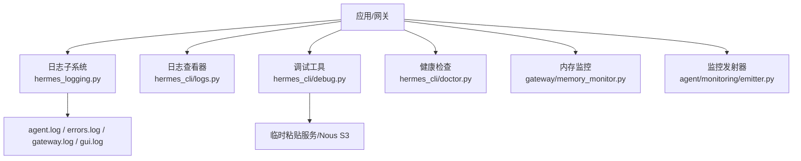
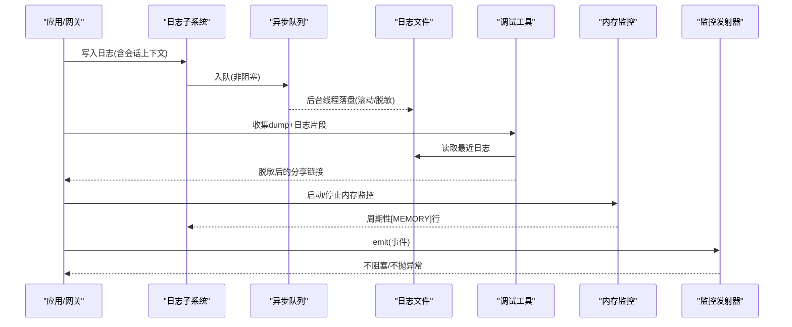
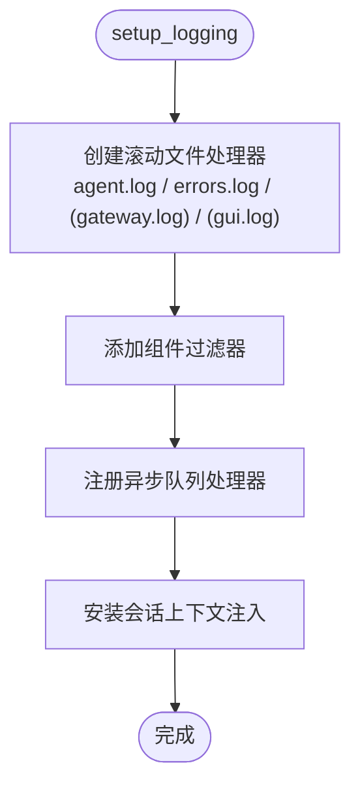
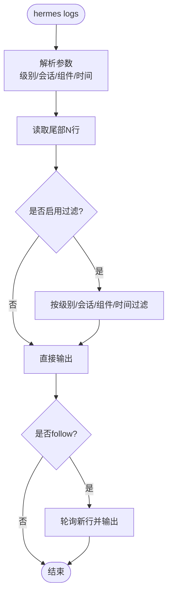
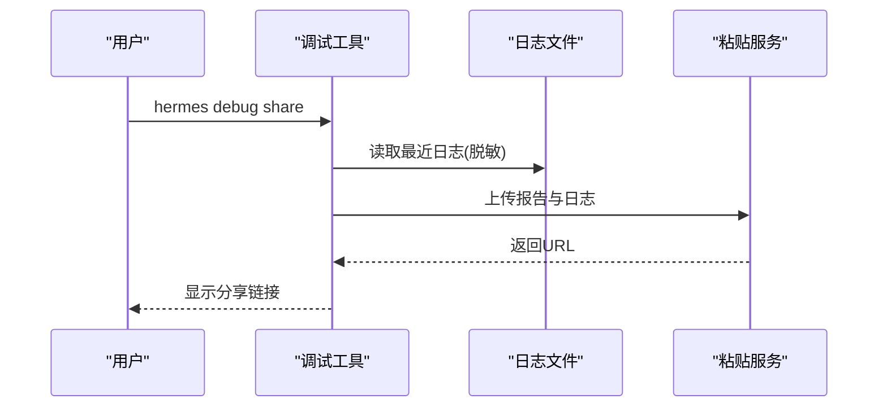
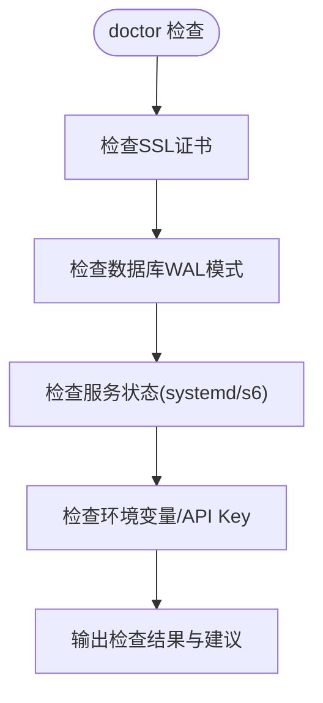
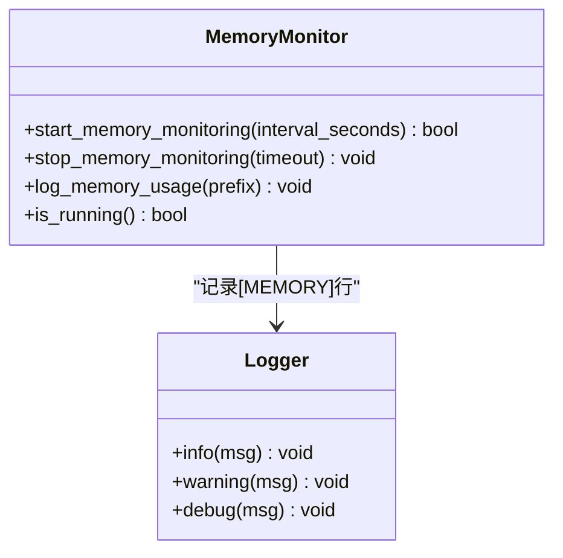
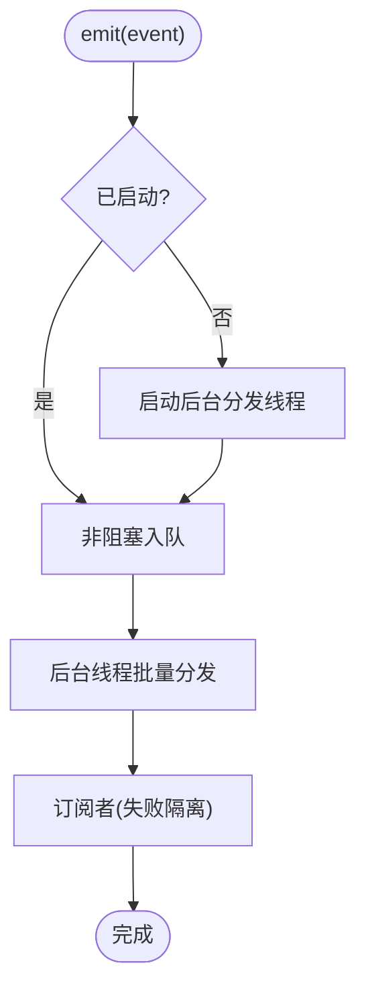
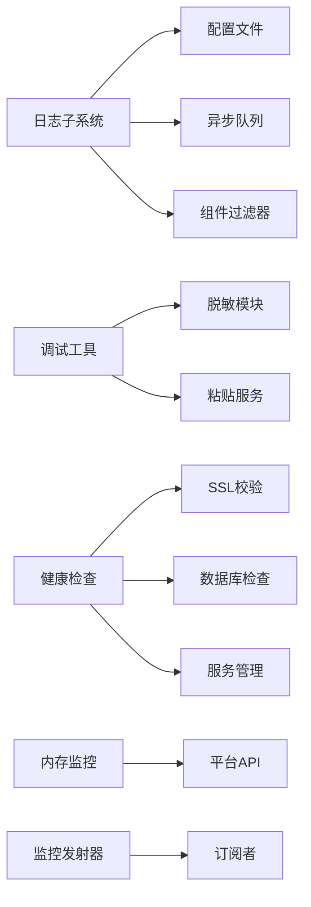

# 故障排除

<cite>
**本文引用的文件**
- [hermes_logging.py](file://hermes_logging.py)
- [logs.py](file://hermes_cli/logs.py)
- [debug.py](file://hermes_cli/debug.py)
- [doctor.py](file://hermes_cli/doctor.py)
- [memory_monitor.py](file://gateway/memory_monitor.py)
- [emitter.py](file://agent/monitoring/emitter.py)
- [errors.py](file://agent/errors.py)
</cite>

## 目录
1. [简介](#简介)
2. [项目结构](#项目结构)
3. [核心组件](#核心组件)
4. [架构总览](#架构总览)
5. [详细组件分析](#详细组件分析)
6. [依赖关系分析](#依赖关系分析)
7. [性能注意事项](#性能注意事项)
8. [故障排除指南](#故障排除指南)
9. [结论](#结论)
10. [附录](#附录)

## 简介
本指南面向用户与运维人员，提供覆盖安装、配置、网络、权限等常见问题的诊断方法；涵盖日志分析、错误追踪、性能瓶颈识别；并给出平台特定（Windows、Linux、macOS、移动端）的排障建议。文档同时说明调试工具的使用方法与输出解读，以及性能调优、资源优化与内存管理策略，并提供社区支持与问题报告模板建议，帮助快速定位和解决问题。

## 项目结构
Hermes Agent 将可观测性、诊断与监控能力分散在多个模块中：
- 日志子系统：集中式日志设置、滚动、按组件分流、会话上下文注入、异步队列落盘，避免阻塞事件循环。
- 日志查看器：支持 tail、follow、级别过滤、会话过滤、组件过滤、相对时间范围。
- 调试工具：收集系统信息、最近日志片段，脱敏后上传到临时粘贴服务或内部存储，便于协作排查。
- 健康检查：doctor 命令检测证书、数据库模式、服务状态、环境变量等。
- 内存监控：周期性记录进程 RSS、GC 计数、线程数，辅助发现内存泄漏。
- 监控发射器：热路径非阻塞的事件分发，隔离失败，不影响主流程。

**图表来源**
- [hermes_logging.py:259-376](file://hermes_logging.py#L259-L376)
- [logs.py:31-41](file://hermes_cli/logs.py#L31-L41)
- [debug.py:358-557](file://hermes_cli/debug.py#L358-L557)
- [doctor.py:646-730](file://hermes_cli/doctor.py#L646-L730)
- [memory_monitor.py:83-193](file://gateway/memory_monitor.py#L83-L193)
- [emitter.py:36-117](file://agent/monitoring/emitter.py#L36-L117)

**章节来源**
- [hermes_logging.py:1-800](file://hermes_logging.py#L1-L800)
- [logs.py:1-398](file://hermes_cli/logs.py#L1-L398)
- [debug.py:1-800](file://hermes_cli/debug.py#L1-L800)
- [doctor.py:1-800](file://hermes_cli/doctor.py#L1-L800)
- [memory_monitor.py:1-231](file://gateway/memory_monitor.py#L1-L231)
- [emitter.py:1-212](file://agent/monitoring/emitter.py#L1-L212)

## 核心组件
- 日志子系统：统一入口 setup_logging，创建 agent.log、errors.log，并在 gateway/gui 模式下生成专用日志；使用 RotatingFileHandler 与 RedactingFormatter 防止密钥落盘；通过 QueueListener 异步写盘，避免阻塞事件循环；Windows 下使用并发日志处理器解决锁竞争导致的旋转失败。
- 日志查看器：tail/follow、级别/会话/组件/时间过滤，便于快速定位问题。
- 调试工具：采集 dump 与日志片段，强制脱敏后上传至公共粘贴服务或内部存储，自动生成分享链接。
- 健康检查：验证 SSL CA 包、SQLite WAL 模式、systemd linger、s6 监督状态、API Key 连通性等。
- 内存监控：后台线程每 N 分钟记录 RSS/GC/线程数，启动时 baseline，关闭时 shutdown 快照。
- 监控发射器：emit 必须 O(微秒)、不阻塞、不抛异常；队列满则丢弃最旧事件；批量分发到订阅者，失败隔离。

**章节来源**
- [hermes_logging.py:259-376](file://hermes_logging.py#L259-L376)
- [hermes_logging.py:415-547](file://hermes_logging.py#L415-L547)
- [hermes_logging.py:550-760](file://hermes_logging.py#L550-L760)
- [logs.py:145-254](file://hermes_cli/logs.py#L145-L254)
- [debug.py:583-711](file://hermes_cli/debug.py#L583-L711)
- [doctor.py:646-730](file://hermes_cli/doctor.py#L646-L730)
- [memory_monitor.py:83-193](file://gateway/memory_monitor.py#L83-L193)
- [emitter.py:36-117](file://agent/monitoring/emitter.py#L36-L117)

## 架构总览
下图展示从应用/网关到日志、调试、监控的数据流与职责边界。

**图表来源**
- [hermes_logging.py:259-376](file://hermes_logging.py#L259-L376)
- [hermes_logging.py:550-760](file://hermes_logging.py#L550-L760)
- [debug.py:583-711](file://hermes_cli/debug.py#L583-L711)
- [memory_monitor.py:139-193](file://gateway/memory_monitor.py#L139-L193)
- [emitter.py:53-117](file://agent/monitoring/emitter.py#L53-L117)

## 详细组件分析

### 日志子系统
- 目标：为 CLI、Gateway、GUI、Cron 等提供统一的日志能力，确保关键信息可检索、敏感信息不落盘、跨进程安全旋转。
- 关键点：
  - 多文件输出：agent.log（全量）、errors.log（警告及以上）、gateway.log（仅 gateway 组件）、gui.log（仅 GUI 组件）。
  - 会话上下文：set_session_context/clear_session_context 注入 session_tag，便于关联同一会话。
  - 异步写盘：QueueListener + QueueHandler，避免事件循环被磁盘 I/O 阻塞。
  - Windows 兼容：使用并发日志处理器处理跨进程旋转锁冲突；对已知锁超时进行静默处理。
  - 外部旋转恢复：ManagedRotatingFileHandler 检测 inode 变化并重新打开文件，避免写到旧文件。

**图表来源**
- [hermes_logging.py:259-376](file://hermes_logging.py#L259-L376)
- [hermes_logging.py:183-212](file://hermes_logging.py#L183-L212)
- [hermes_logging.py:550-760](file://hermes_logging.py#L550-L760)

**章节来源**
- [hermes_logging.py:1-800](file://hermes_logging.py#L1-L800)

### 日志查看器
- 功能：tail、follow、级别过滤、会话过滤、组件过滤、相对时间范围。
- 适用场景：快速定位错误、跟踪会话、观察实时输出。
- 注意：当存在过滤器时会读取更多原始行以确保足够匹配结果。

**图表来源**
- [logs.py:145-254](file://hermes_cli/logs.py#L145-L254)
- [logs.py:256-363](file://hermes_cli/logs.py#L256-L363)

**章节来源**
- [logs.py:1-398](file://hermes_cli/logs.py#L1-L398)

### 调试工具
- 功能：收集系统 dump 与最近日志片段，强制脱敏后上传到公共粘贴服务或内部存储，返回分享链接；支持自动清理过期粘贴。
- 隐私保护：上传前强制脱敏敏感文本，邮件地址也会被替换；本地文件不被修改。
- 使用建议：优先使用 --local 预览内容；对外共享时使用默认脱敏；必要时使用 --no-redact 仅用于内部私有通道。

**图表来源**
- [debug.py:583-711](file://hermes_cli/debug.py#L583-L711)
- [debug.py:754-800](file://hermes_cli/debug.py#L754-L800)

**章节来源**
- [debug.py:1-800](file://hermes_cli/debug.py#L1-L800)

### 健康检查（Doctor）
- 功能：验证 SSL CA 包、SQLite WAL 模式、systemd linger、s6 监督状态、API Key 连通性等，并提供修复建议。
- 典型用例：
  - SSL 证书损坏：提示运行修复命令或手动重装 certifi。
  - SQLite WAL 暴露风险：提示升级 SQLite 或执行修复步骤。
  - systemd linger 未启用：提示启用以保障服务存活。

**图表来源**
- [doctor.py:646-730](file://hermes_cli/doctor.py#L646-L730)
- [doctor.py:121-199](file://hermes_cli/doctor.py#L121-L199)
- [doctor.py:598-644](file://hermes_cli/doctor.py#L598-L644)

**章节来源**
- [doctor.py:1-800](file://hermes_cli/doctor.py#L1-L800)

### 内存监控
- 功能：后台线程周期性记录 RSS、GC 计数、线程数；启动时 baseline，关闭时 shutdown 快照。
- 平台差异：优先使用 resource.getrusage（Linux/macOS），回退到 psutil（Windows）。
- 使用建议：在长时间运行的 Gateway 中开启，定期 grep “[MEMORY]” 分析趋势。

**图表来源**
- [memory_monitor.py:83-193](file://gateway/memory_monitor.py#L83-L193)
- [memory_monitor.py:196-231](file://gateway/memory_monitor.py#L196-L231)

**章节来源**
- [memory_monitor.py:1-231](file://gateway/memory_monitor.py#L1-L231)

### 监控发射器
- 设计原则：emit 必须 O(微秒)、不阻塞、不抛异常；队列满则丢弃最旧事件；批量分发到订阅者，失败隔离。
- 适用场景：遥测、指标、日志外发；任何失败不得影响主流程。

**图表来源**
- [emitter.py:36-117](file://agent/monitoring/emitter.py#L36-L117)
- [emitter.py:167-188](file://agent/monitoring/emitter.py#L167-L188)

**章节来源**
- [emitter.py:1-212](file://agent/monitoring/emitter.py#L1-L212)

## 依赖关系分析
- 日志子系统依赖：
  - 配置文件：logging.level、max_size_mb、backup_count。
  - 组件过滤器：按 logger 名前缀路由到不同日志文件。
  - 异步队列：QueueListener + QueueHandler，避免阻塞事件循环。
- 调试工具依赖：
  - 日志文件位置：~/.hermes/logs/*.log。
  - 脱敏模块：agent.redact。
  - 粘贴服务：paste.rs/dpaste.com 或 Nous S3。
- 健康检查依赖：
  - SSL 校验：agent.ssl_guard.verify_ca_bundle_with_fallback。
  - 数据库：SQLite WAL 模式检测与修复建议。
  - 服务管理：systemd/s6 状态探测。
- 内存监控依赖：
  - 平台 API：resource.getrusage 或 psutil。
  - 日志：记录结构化 [MEMORY] 行。
- 监控发射器依赖：
  - 队列：ring buffer，容量有限，满则丢弃最旧。
  - 订阅者：OTLP 流式导出器等。

**图表来源**
- [hermes_logging.py:259-376](file://hermes_logging.py#L259-L376)
- [debug.py:425-439](file://hermes_cli/debug.py#L425-L439)
- [doctor.py:646-730](file://hermes_cli/doctor.py#L646-L730)
- [memory_monitor.py:52-80](file://gateway/memory_monitor.py#L52-L80)
- [emitter.py:36-117](file://agent/monitoring/emitter.py#L36-L117)

**章节来源**
- [hermes_logging.py:259-376](file://hermes_logging.py#L259-L376)
- [debug.py:425-439](file://hermes_cli/debug.py#L425-L439)
- [doctor.py:646-730](file://hermes_cli/doctor.py#L646-L730)
- [memory_monitor.py:52-80](file://gateway/memory_monitor.py#L52-L80)
- [emitter.py:36-117](file://agent/monitoring/emitter.py#L36-L117)

## 性能注意事项
- 日志写盘不应阻塞事件循环：使用异步队列与后台监听器，避免 WebSocket 客户端掉线。
- Windows 日志旋转锁竞争：使用并发日志处理器，并对已知锁超时进行静默处理，避免干扰桌面聊天输出。
- 大日志文件读取：日志查看器对大文件采用从尾部分块读取，减少内存占用。
- 内存监控：周期性记录 RSS/GC/线程数，便于发现缓慢泄漏；在 Gateway 中开启以获得时间序列。
- 监控发射器：保证热路径不阻塞，队列满时丢弃最旧事件，避免影响主流程。

**章节来源**
- [hermes_logging.py:415-547](file://hermes_logging.py#L415-L547)
- [hermes_logging.py:550-760](file://hermes_logging.py#L550-L760)
- [logs.py:285-338](file://hermes_cli/logs.py#L285-L338)
- [memory_monitor.py:139-193](file://gateway/memory_monitor.py#L139-L193)
- [emitter.py:53-117](file://agent/monitoring/emitter.py#L53-L117)

## 故障排除指南

### 常见问题解答
- 安装问题
  - 症状：首次运行时报 SSL 错误或无法访问外部服务。
  - 诊断：运行 doctor 检查证书包；若损坏，执行修复命令或手动重装 certifi。
  - 参考：[doctor.py:646-730](file://hermes_cli/doctor.py#L646-L730)
- 配置错误
  - 症状：日志级别无效、组件名未知、since 格式错误。
  - 诊断：使用 logs 命令的错误提示；确认 logging.* 配置项。
  - 参考：[logs.py:185-207](file://hermes_cli/logs.py#L185-L207)
- 网络连接
  - 症状：平台适配器连接失败或重连失败。
  - 诊断：检查 adapter.connect 签名是否接受 is_reconnect；查看 gateway.log 中的重试与错误。
  - 参考：[tests/gateway/test_adapter_connect_is_reconnect_contract.py:1-145](file://tests/gateway/test_adapter_connect_is_reconnect_contract.py#L1-L145)
- 权限问题
  - 症状：无法读取日志文件或数据库。
  - 诊断：检查 ~./hermes/logs 权限；在 Linux 上确认组权限与 managed mode 下的 chmod。
  - 参考：[hermes_logging.py:415-547](file://hermes_logging.py#L415-L547)

**章节来源**
- [doctor.py:646-730](file://hermes_cli/doctor.py#L646-L730)
- [logs.py:185-207](file://hermes_cli/logs.py#L185-L207)
- [tests/gateway/test_adapter_connect_is_reconnect_contract.py:1-145](file://tests/gateway/test_adapter_connect_is_reconnect_contract.py#L1-L145)
- [hermes_logging.py:415-547](file://hermes_logging.py#L415-L547)

### 调试技巧
- 使用 logs 命令：
  - 查看最近错误：hermes logs errors
  - 跟踪会话：hermes logs --session <id>
  - 过滤组件：hermes logs --component tools
  - 实时跟随：hermes logs -f
- 使用 debug 工具：
  - 收集报告：hermes debug share
  - 本地预览：hermes debug share --local
  - 禁用脱敏（仅限内部私有通道）：hermes debug share --no-redact
- 使用 memory monitor：
  - 在 Gateway 中开启，定期 grep “[MEMORY]” 分析趋势。

**章节来源**
- [logs.py:145-254](file://hermes_cli/logs.py#L145-L254)
- [debug.py:583-711](file://hermes_cli/debug.py#L583-L711)
- [memory_monitor.py:139-193](file://gateway/memory_monitor.py#L139-L193)

### 性能调优
- 日志大小与保留：调整 max_size_mb 与 backup_count，避免磁盘占满。
- 日志级别：生产环境使用 INFO 或 WARNING，开发调试使用 DEBUG。
- 内存监控：在 Gateway 中开启，观察 RSS 增长与 GC 频率。
- 监控发射器：确保订阅者高效处理，避免慢消费者导致队列堆积。

**章节来源**
- [hermes_logging.py:259-376](file://hermes_logging.py#L259-L376)
- [memory_monitor.py:139-193](file://gateway/memory_monitor.py#L139-L193)
- [emitter.py:53-117](file://agent/monitoring/emitter.py#L53-L117)

### 资源优化与内存管理
- 资源获取：优先使用 resource.getrusage（Linux/macOS），回退到 psutil（Windows）。
- GC 统计：记录每代 GC 计数，作为垃圾创建量的代理。
- 线程数：记录活跃线程数，辅助发现线程泄漏。
- 关闭时快照：记录 shutdown 时的 RSS，便于对比基线与退出点。

**章节来源**
- [memory_monitor.py:52-80](file://gateway/memory_monitor.py#L52-L80)
- [memory_monitor.py:83-127](file://gateway/memory_monitor.py#L83-L127)
- [memory_monitor.py:196-231](file://gateway/memory_monitor.py#L196-L231)

### 平台特定问题
- Windows
  - 日志旋转锁竞争：使用并发日志处理器，避免 WinError 32。
  - 控制台编码：stderr 包装为 UTF-8，避免 UnicodeEncodeError。
  - 参考：[hermes_logging.py:42-69](file://hermes_logging.py#L42-L69)
- Linux/macOS
  - 资源 API：使用 resource.getrusage 获取 RSS。
  - 文件权限：managed mode 下确保组可写权限。
  - 参考：[memory_monitor.py:52-80](file://gateway/memory_monitor.py#L52-L80)
  - 参考：[hermes_logging.py:415-547](file://hermes_logging.py#L415-L547)
- 移动端（Termux）
  - 安装建议：使用 termux-all 扩展，排除不可用额外项。
  - 语音转文本：使用 Groq Whisper 或 OpenAI Whisper 作为回退。
  - 参考：[doctor.py:209-227](file://hermes_cli/doctor.py#L209-L227)

**章节来源**
- [hermes_logging.py:42-69](file://hermes_logging.py#L42-L69)
- [memory_monitor.py:52-80](file://gateway/memory_monitor.py#L52-L80)
- [hermes_logging.py:415-547](file://hermes_logging.py#L415-L547)
- [doctor.py:209-227](file://hermes_cli/doctor.py#L209-L227)

### 日志分析与错误追踪
- 日志文件：
  - agent.log：所有活动日志。
  - errors.log：警告及以上，快速排查。
  - gateway.log：仅 gateway 组件。
  - gui.log：仅 GUI 组件。
- 会话上下文：使用 set_session_context 注入 session_id，便于关联同一会话。
- 错误类型：
  - SSLConfigurationError：SSL/TLS 证书配置失败。
  - EmptyStreamError：提供者关闭流但未返回响应。
  - MoAPresetNotFoundError：持久化预设不存在。
- 参考：
  - [hermes_logging.py:165-212](file://hermes_logging.py#L165-L212)
  - [errors.py:1-14](file://agent/errors.py#L1-L14)

**章节来源**
- [hermes_logging.py:165-212](file://hermes_logging.py#L165-L212)
- [errors.py:1-14](file://agent/errors.py#L1-L14)

### 社区支持与问题报告
- 使用 debug share 生成报告与日志片段，脱敏后分享给社区或支持团队。
- 报告模板建议：
  - 系统信息：hermes dump 输出。
  - 最近日志：agent.log、errors.log、gateway.log、gui.log 的尾部。
  - 错误信息：具体错误类型与堆栈（已脱敏）。
  - 复现步骤：最小化复现场景。
- 求助技巧：
  - 明确平台与环境（Windows/Linux/macOS/移动端）。
  - 提供 logs 命令的输出与过滤条件。
  - 附上 doctor 检查结果。

**章节来源**
- [debug.py:583-711](file://hermes_cli/debug.py#L583-L711)
- [logs.py:145-254](file://hermes_cli/logs.py#L145-L254)
- [doctor.py:646-730](file://hermes_cli/doctor.py#L646-L730)

## 结论
通过统一的日志子系统、健壮的调试工具、全面的健康检查、持续的内存监控与非阻塞的监控发射器，Hermes Agent 提供了完整的故障诊断与解决工具箱。用户与运维人员可借助这些能力快速定位安装、配置、网络、权限等问题，并进行性能调优与资源优化。结合社区支持与问题报告模板，可进一步提升协作效率与问题解决速度。

## 附录
- 常用命令速查：
  - 查看日志：hermes logs
  - 实时跟随：hermes logs -f
  - 健康检查：hermes doctor
  - 调试分享：hermes debug share
  - 内存监控：在 Gateway 中开启，grep “[MEMORY]”
- 配置文件键：
  - logging.level、logging.max_size_mb、logging.backup_count
  - logging.memory_monitor.interval_seconds（如适用）

**章节来源**
- [hermes_logging.py:259-376](file://hermes_logging.py#L259-L376)
- [memory_monitor.py:139-193](file://gateway/memory_monitor.py#L139-L193)