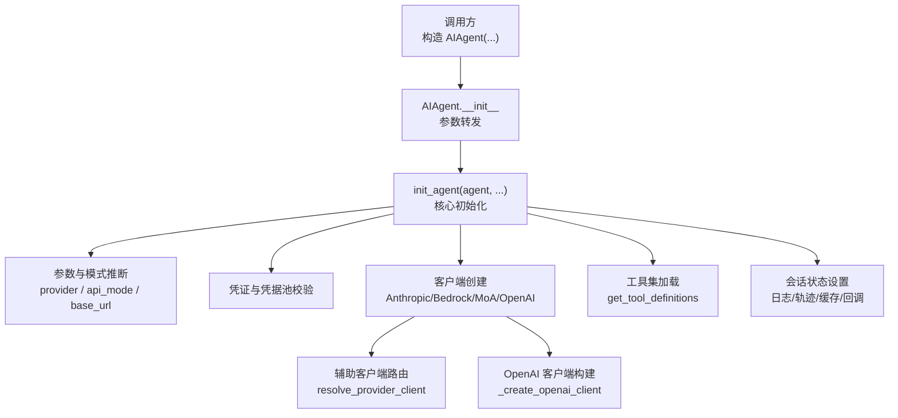
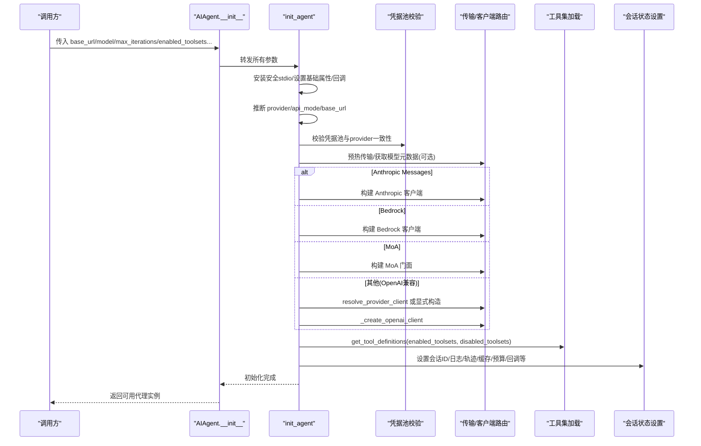
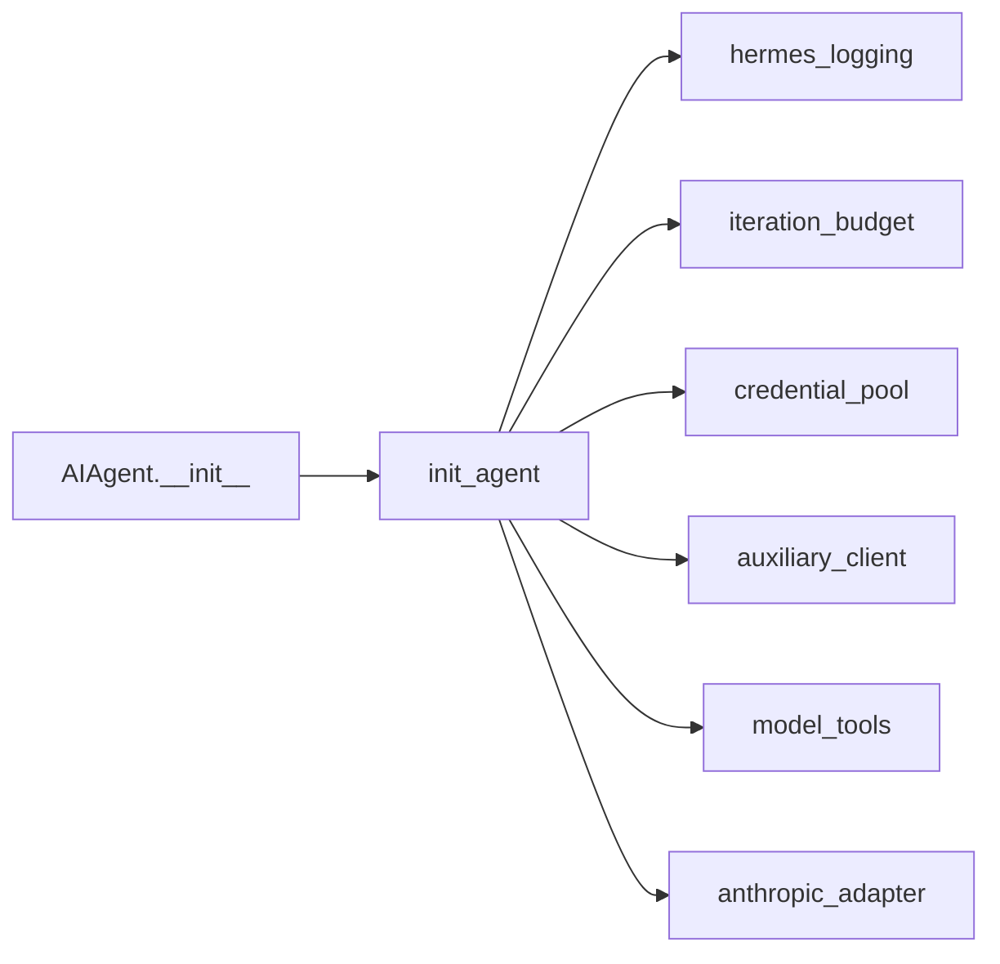

# 代理初始化流程

<cite>
**本文引用的文件**
- [run_agent.py](file://run_agent.py)
- [agent_init.py](file://agent/agent_init.py)
- [model_tools.py](file://model_tools.py)
- [auxiliary_client.py](file://agent/auxiliary_client.py)
- [anthropic_adapter.py](file://agent/anthropic_adapter.py)
- [hermes_logging.py](file://hermes_logging.py)
- [iteration_budget.py](file://agent/iteration_budget.py)
- [credential_pool.py](file://agent/credential_pool.py)
</cite>

## 目录
1. [简介](#简介)
2. [项目结构](#项目结构)
3. [核心组件](#核心组件)
4. [架构总览](#架构总览)
5. [详细组件分析](#详细组件分析)
6. [依赖关系分析](#依赖关系分析)
7. [性能考量](#性能考量)
8. [故障排查指南](#故障排查指南)
9. [结论](#结论)
10. [附录：配置与示例](#附录：配置与示例)

## 简介
本文件聚焦 Hermes Agent 的代理初始化流程，深入解析 AIAgent 类的初始化过程与 init_agent 函数的实现逻辑。重点覆盖参数校验、配置加载、工具集初始化、模型客户端创建与会话状态设置；并说明 base_url、model、max_iterations、enabled_toolsets 等关键参数的处理路径。文档同时给出初始化阶段的错误处理机制、依赖检查与环境准备建议，帮助开发者理解启动每个步骤及可能的故障点。

## 项目结构
- AIAgent 类定义在入口模块中，其 __init__ 仅做参数转发，实际初始化逻辑集中在 agent/agent_init.py 的 init_agent 函数。
- 工具集加载通过 model_tools.get_tool_definitions 完成，支持 enabled_toolsets/disabled_toolsets 过滤。
- 模型客户端创建由 init_agent 根据 provider/api_mode/base_url 选择不同路径（Anthropic Messages、Bedrock、MoA、OpenAI 兼容等），并通过辅助客户端路由或显式构造 OpenAI 兼容客户端。
- 会话状态（日志、轨迹、缓存、迭代预算、回调等）在 init_agent 中集中设置。

图表来源
- [run_agent.py:435-596](file://run_agent.py#L435-L596)
- [agent_init.py:459-1599](file://agent/agent_init.py#L459-L1599)

章节来源
- [run_agent.py:435-596](file://run_agent.py#L435-L596)
- [agent_init.py:459-1599](file://agent/agent_init.py#L459-L1599)

## 核心组件
- AIAgent：对外暴露的代理类，__init__ 将参数透传给 init_agent，保持接口简洁且便于测试打桩。
- init_agent：承担全部初始化职责，包括：
  - 安全标准输入输出安装
  - 基础属性与回调注入
  - provider 与 api_mode 自动推断
  - 凭据池匹配校验
  - 客户端预热与模型元数据预取
  - 按 provider 分支创建 Anthropic/Bedrock/MoA/OpenAI 客户端
  - 工具集加载与需求检查
  - 会话 ID、日志目录、轨迹开关、提示词缓存策略、迭代预算、速率限制、积分追踪等状态初始化

章节来源
- [run_agent.py:435-596](file://run_agent.py#L435-L596)
- [agent_init.py:459-1599](file://agent/agent_init.py#L459-L1599)

## 架构总览
下图展示从构造 AIAgent 到完成初始化的主流程，涵盖参数验证、配置加载、工具集初始化、模型客户端创建与会话状态设置。

图表来源
- [run_agent.py:435-596](file://run_agent.py#L435-L596)
- [agent_init.py:459-1599](file://agent/agent_init.py#L459-L1599)

## 详细组件分析

### AIAgent 初始化与参数转发
- AIAgent.__init__ 接收大量参数（base_url、api_key、provider、api_mode、model、max_iterations、enabled_toolsets、disabled_toolsets、各种回调、会话相关字段等），并进行兼容性告警（如 tool_delay 已废弃）。
- 随后调用 agent.agent_init.init_agent(self, ...) 完成真实初始化。

章节来源
- [run_agent.py:435-596](file://run_agent.py#L435-L596)

### init_agent 主流程概览
- 安全 IO 安装与基础属性设置：确保进程级 stdio 安全，设置平台、用户标识、日志前缀、静默模式、系统提示等。
- provider 与 api_mode 推断：基于 provider、base_url 主机名、已知端点特征进行自动识别（如 anthropic.com、bedrock-runtime.*、openai-codex、x.ai 等），并在必要时将 chat_completions 升级为 codex_responses。
- 凭据池校验：若传入 credential_pool，则校验其与当前 provider/base_url 是否匹配，不匹配则丢弃以避免误用。
- 传输预热与模型元数据预取：尝试预热传输缓存以尽早暴露导入错误；对 OpenRouter 场景后台预热模型元数据以降低首请求延迟。
- 客户端创建：
  - Anthropic Messages：原生或 Bedrock + Anthropic SDK，支持 OAuth token 提供者（如 MiniMax OAuth 短期令牌）与 Azure Foundry Entra ID 令牌提供者。
  - Bedrock Converse：读取区域与 guardrail 配置，直接走 boto3 路径。
  - MoA：使用门面封装参考模型聚合。
  - 其他（OpenAI 兼容）：优先使用 resolve_provider_client 路由，否则显式构造 OpenAI 客户端；针对特定域名注入默认头（OpenRouter、NVIDIA NIM、Kimi、Qwen Portal、ChatGPT、X.AI 等）。
- 工具集加载：调用 get_tool_definitions 并按 enabled_toolsets/disabled_toolsets 过滤，记录有效工具名集合，打印加载结果与过滤信息。
- 会话状态设置：生成 session_id、设置日志目录、轨迹保存开关、提示词缓存策略、迭代预算、活动跟踪、速率限制、积分追踪、流式去重、会话数据库句柄等。

章节来源
- [agent_init.py:459-1599](file://agent/agent_init.py#L459-L1599)

### 关键参数处理
- base_url
  - 用于推断 provider 与 api_mode，影响客户端构建与默认头注入。
  - 对 OpenRouter、NVIDIA NIM、Kimi、Qwen Portal、ChatGPT、X.AI 等域名会注入相应默认头。
  - 自定义提供商 TLS/额外头会在客户端构建前后应用。
- model
  - 参与 provider 路由、Responses API 升级判断、以及部分提供商的模型适配。
  - 对 Codex gpt-5.x 系列可能触发上下文压缩阈值调整通知。
- max_iterations
  - 决定迭代预算上限，控制 LLM 调用次数与“预算耗尽”注入时机。
  - 与子代理共享同一 IterationBudget 实例。
- enabled_toolsets / disabled_toolsets
  - 控制工具集启用/禁用，最终通过 get_tool_definitions 生成 tools 列表。
  - 初始化时打印启用的工具集与禁用的工具集，便于调试。

章节来源
- [agent_init.py:459-1599](file://agent/agent_init.py#L459-L1599)
- [model_tools.py:305-369](file://model_tools.py#L305-L369)

### 工具集初始化与依赖检查
- 工具集加载：
  - 调用 get_tool_definitions(enabled_toolsets, disabled_toolsets, quiet_mode)。
  - 记录 valid_tool_names 集合，供后续工具调用校验。
  - 非静默模式下输出加载的工具数量与名称，以及启用/禁用的工具集信息。
- 依赖检查：
  - 调用 check_toolset_requirements() 检测缺失依赖并输出警告。
- 快照与并发刷新：
  - 捕获 registry 的 generation 号，以便后续并发刷新时避免覆盖更新后的快照。

章节来源
- [agent_init.py:1432-1478](file://agent/agent_init.py#L1432-L1478)
- [model_tools.py:305-369](file://model_tools.py#L305-L369)

### 模型客户端创建与认证
- Anthropic Messages：
  - 原生 Anthropic 或 Bedrock + Anthropic SDK。
  - 支持 OAuth 短生命周期令牌（MiniMax）与 Entra ID 令牌提供者。
  - 设置 _is_anthropic_oauth 标记，避免第三方兼容端点误入 OAuth 路径。
- Bedrock Converse：
  - 解析 region，读取 guardrail 配置，直接走 boto3。
- MoA：
  - 构建门面，复用工具进度回调，统一事件流。
- OpenAI 兼容：
  - 优先 resolve_provider_client 路由；若无凭据且指定了非 auto/openrouter/custom 的 provider，则快速失败并提示设置环境变量或切换模型。
  - 显式构造 OpenAI 客户端时，按域名注入默认头，并应用自定义提供商 TLS/额外头。
  - 对 OpenRouter + Claude 组合注入细粒度工具流 beta 头，避免上游代理超时。

章节来源
- [agent_init.py:1018-1399](file://agent/agent_init.py#L1018-L1399)
- [auxiliary_client.py:1172-1932](file://agent/auxiliary_client.py#L1172-L1932)

### 会话状态设置
- 会话 ID：优先使用传入 session_id，否则生成时间戳+短 UUID。
- 日志与轨迹：设置 logs_dir、轨迹保存开关、JSON 快照开关。
- 提示词缓存：根据 provider 与协议能力决定是否启用 Anthropic 提示词缓存及 TTL。
- 迭代预算：设置 IterationBudget，控制最大调用次数与耗尽时的注入行为。
- 活动跟踪与速率限制：维护最后活动时间、描述、来源；记录速率限制状态。
- 积分追踪：首次看到响应头后锁定会话起始微秒数，累计消耗。
- 流式输出保护：单写者锁与令牌，防止旧流与新流交错写入。
- 会话数据库：可注入外部 session_db，管理持久化与关闭所有权。

章节来源
- [agent_init.py:893-1599](file://agent/agent_init.py#L893-L1599)

### 错误处理与异常路径
- 凭据池不匹配：丢弃 credential_pool，避免误用。
- 传输预热失败：忽略异常，允许后续按需加载。
- 无提供商配置：当未配置任何 provider 且未找到凭据时，抛出 RuntimeError 提示运行 hermes model/setup。
- 显式 provider 但缺少密钥：提示设置对应环境变量或切换到其他 provider。
- OpenAI 客户端构建失败：包装为 RuntimeError 并向上抛出。
- 自定义提供商 TLS/头应用失败：记录调试日志，不影响主流程。

章节来源
- [agent_init.py:681-699](file://agent/agent_init.py#L681-L699)
- [agent_init.py:1242-1315](file://agent/agent_init.py#L1242-L1315)
- [agent_init.py:1375-1399](file://agent/agent_init.py#L1375-L1399)

## 依赖关系分析
- AIAgent.__init__ 依赖 agent.agent_init.init_agent 完成核心初始化。
- init_agent 依赖：
  - hermes_logging.setup_logging 与 setup_verbose_logging 进行日志初始化。
  - iteration_budget.IterationBudget 管理调用预算。
  - credential_pool.credential_pool_matches_provider 校验凭据池。
  - auxiliary_client.resolve_provider_client 与 OpenAI 客户端构建。
  - model_tools.get_tool_definitions 与 check_toolset_requirements 加载工具与检查依赖。
  - anthropic_adapter.build_anthropic_client/build_anthropic_bedrock_client 构建 Anthropic 客户端。

图表来源
- [run_agent.py:435-596](file://run_agent.py#L435-L596)
- [agent_init.py:459-1599](file://agent/agent_init.py#L459-L1599)

章节来源
- [run_agent.py:435-596](file://run_agent.py#L435-L596)
- [agent_init.py:459-1599](file://agent/agent_init.py#L459-L1599)

## 性能考量
- 传输缓存预热：在 init 阶段尝试预热传输缓存，使导入错误尽早暴露，减少对话中途失败风险。
- OpenRouter 元数据预取：后台线程预热模型元数据，降低首请求定价估算的网络开销。
- 提示词缓存：对 Anthropic 协议启用提示词缓存，显著降低多轮对话输入成本；TTL 可配置。
- 工具集快照：捕获 registry generation，避免并发刷新导致的陈旧覆盖。
- 流式单写者保护：防止旧流与新流交错写入，保证输出一致性。

[本节提供通用指导，无需具体文件引用]

## 故障排查指南
- 无法启动/无提供商配置
  - 现象：初始化抛出“未配置 LLM 提供商”的错误。
  - 处理：运行 hermes model 选择提供商，或执行 hermes setup 完成首次配置。
- 显式 provider 但缺少密钥
  - 现象：提示未找到 API Key，需设置对应环境变量。
  - 处理：根据提示设置环境变量，或切换到其他 provider。
- 凭据池不匹配
  - 现象：传入的 credential_pool 与当前 provider/base_url 不一致被丢弃。
  - 处理：确保凭据池与目标 provider 一致，或移除该参数。
- 工具不可用或缺少依赖
  - 现象：初始化输出“某些工具可能因缺少依赖而无法工作”。
  - 处理：按提示安装缺失依赖，或调整 enabled_toolsets/disabled_toolsets。
- 客户端构建失败
  - 现象：OpenAI 客户端构建抛出运行时错误。
  - 处理：检查 base_url、api_key、默认头与 TLS 配置，确认网络可达与证书有效。

章节来源
- [agent_init.py:1242-1315](file://agent/agent_init.py#L1242-L1315)
- [agent_init.py:1375-1399](file://agent/agent_init.py#L1375-L1399)
- [agent_init.py:681-699](file://agent/agent_init.py#L681-L699)

## 结论
Hermes Agent 的初始化流程通过 AIAgent.__init__ 与 init_agent 的清晰分层，实现了参数校验、配置加载、工具集初始化、模型客户端创建与会话状态设置的完整闭环。init_agent 在 provider 与 api_mode 推断、凭据池校验、客户端构建、工具集加载等方面具备完善的错误处理与降级策略，确保在不同环境与提供商下稳定启动。开发者可通过合理配置 base_url、model、max_iterations、enabled_toolsets 等参数，结合日志与提示信息快速定位问题并完成代理部署。

[本节总结性内容，无需具体文件引用]

## 附录：配置与示例
- 基本用法
  - 通过 AIAgent 构造函数传入 base_url、model、max_iterations、enabled_toolsets 等参数，即可启动代理。
  - 示例路径：[run_agent.py:16-20](file://run_agent.py#L16-L20)
- 关键配置项
  - base_url：模型 API 的基础地址，影响 provider 推断与默认头注入。
  - model：要使用的模型名称，影响 Responses API 升级与提供商适配。
  - max_iterations：最大工具调用迭代次数，控制预算与耗尽行为。
  - enabled_toolsets/disabled_toolsets：启用/禁用工具集，控制可用工具范围。
  - 回调：tool_progress_callback、status_callback、thinking_callback 等，用于集成 UI 与监控。
- 常见场景
  - 使用 OpenRouter：自动注入默认头与细粒度工具流 beta 头，提升稳定性。
  - 使用 Anthropic Messages：支持 OAuth 与 Entra ID 令牌提供者，适合企业环境。
  - 使用 Bedrock：读取区域与 guardrail 配置，直接走 AWS 路径。
  - 使用 MoA：聚合多个参考模型输出，统一事件流。

章节来源
- [run_agent.py:16-20](file://run_agent.py#L16-L20)
- [agent_init.py:459-1599](file://agent/agent_init.py#L459-L1599)