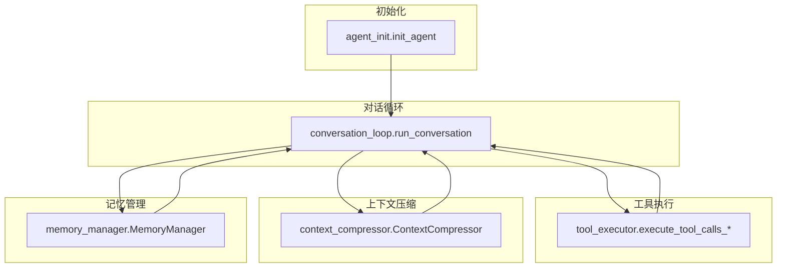
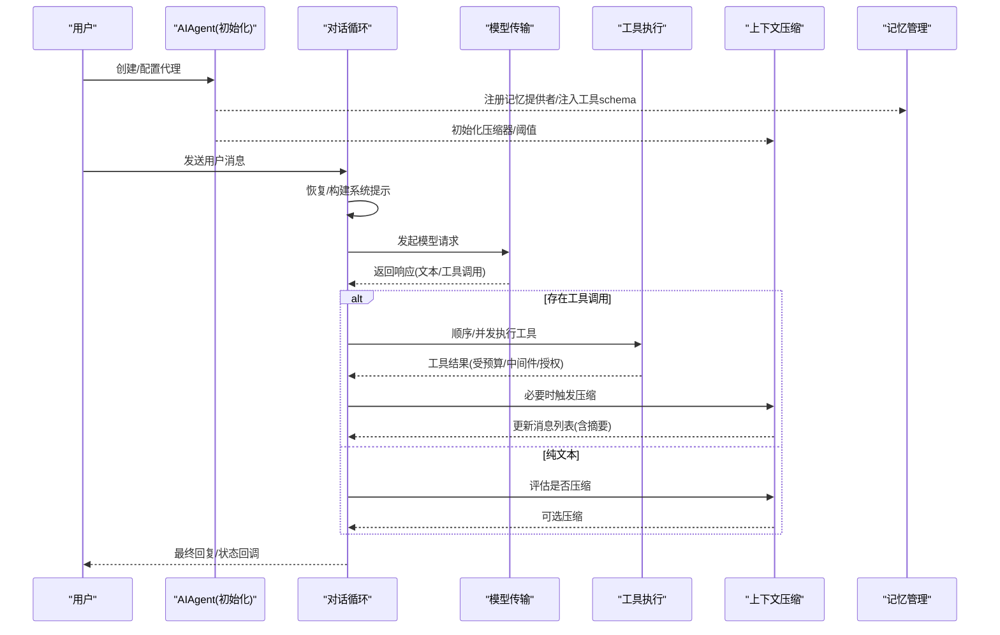
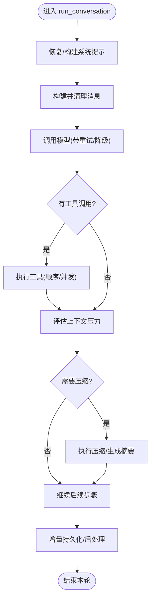
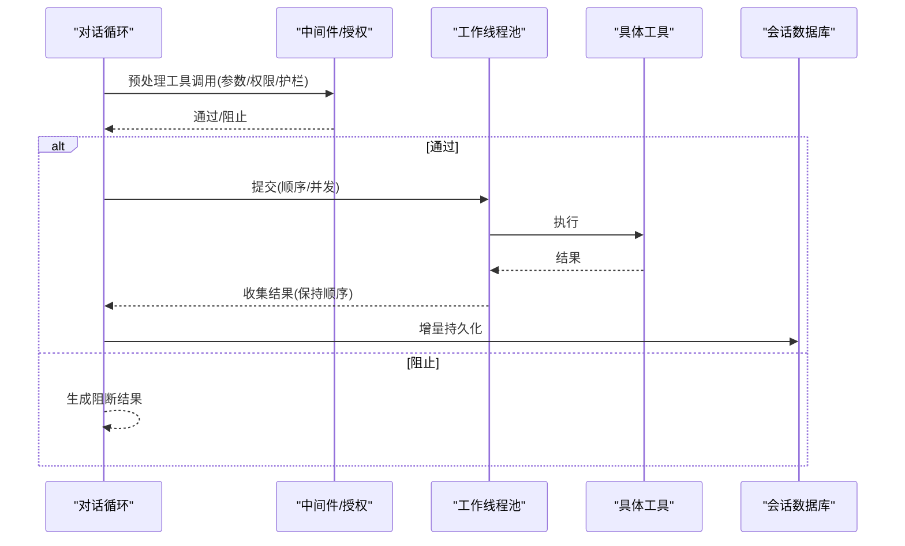
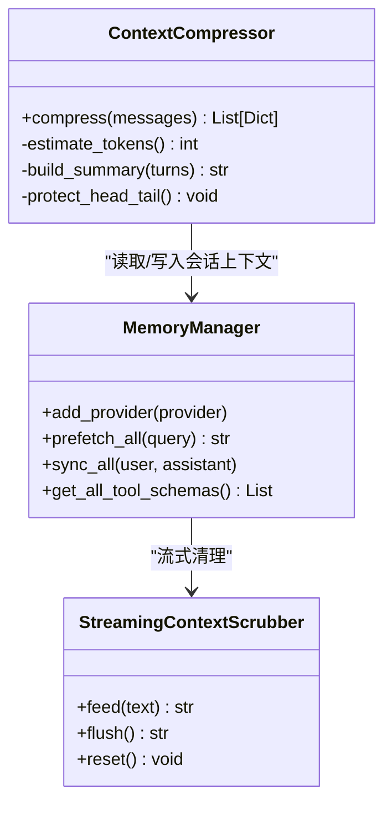
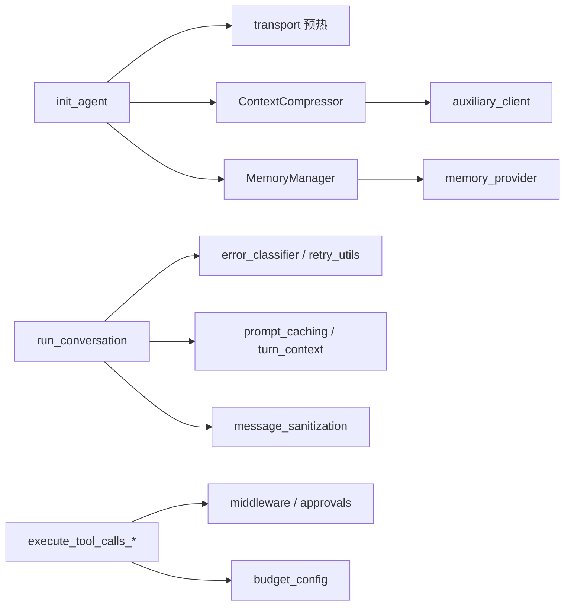

# 代理核心引擎

<cite>
**本文引用的文件**
- [agent_init.py](file://agent/agent_init.py)
- [conversation_loop.py](file://agent/conversation_loop.py)
- [tool_executor.py](file://agent/tool_executor.py)
- [context_compressor.py](file://agent/context_compressor.py)
- [memory_manager.py](file://agent/memory_manager.py)
</cite>

## 目录
1. [简介](#简介)
2. [项目结构](#项目结构)
3. [核心组件](#核心组件)
4. [架构总览](#架构总览)
5. [详细组件分析](#详细组件分析)
6. [依赖关系分析](#依赖关系分析)
7. [性能考量](#性能考量)
8. [故障排查指南](#故障排查指南)
9. [结论](#结论)
10. [附录：配置与使用示例](#附录配置与使用示例)

## 简介
本文件面向 Hermes Agent 的“代理核心引擎”，聚焦 AIAgent 的设计与实现，覆盖对话循环管理、工具调用处理、会话状态管理、错误恢复机制，以及初始化流程、模型配置、工具集管理与回调系统。文档还解释对话生命周期、工具执行策略、上下文压缩与记忆集成，并提供关键参数（如 max_iterations、tool_progress_mode、reasoning_config）的作用说明，帮助开发者深入理解内部工作原理与扩展点。

## 项目结构
围绕代理核心引擎的关键模块如下：
- 初始化与运行时装配：负责解析模型、提供者、凭据、传输层、工具集、回调、上下文压缩器、迭代预算等。
- 对话循环：驱动单轮用户请求的完整生命周期，包括消息构建、模型调用、重试/降级、压缩、后处理与持久化。
- 工具执行：顺序与并发执行工具调用，包含授权门控、中间件、结果预算控制、进度与回调。
- 上下文压缩：自动压缩长对话历史，保护首尾关键信息，生成可重入的摘要并处理技能/工具输出裁剪。
- 记忆管理：统一接入内置与外部记忆提供者，提供预取、同步、系统提示注入与流式清理。

图表来源
- [agent_init.py:459-800](file://agent/agent_init.py#L459-L800)
- [conversation_loop.py:1-120](file://agent/conversation_loop.py#L1-L120)
- [tool_executor.py:1-120](file://agent/tool_executor.py#L1-L120)
- [context_compressor.py:1-120](file://agent/context_compressor.py#L1-L120)
- [memory_manager.py:1-60](file://agent/memory_manager.py#L1-L60)

章节来源
- [agent_init.py:459-800](file://agent/agent_init.py#L459-L800)
- [conversation_loop.py:1-120](file://agent/conversation_loop.py#L1-L120)
- [tool_executor.py:1-120](file://agent/tool_executor.py#L1-L120)
- [context_compressor.py:1-120](file://agent/context_compressor.py#L1-L120)
- [memory_manager.py:1-60](file://agent/memory_manager.py#L1-L60)

## 核心组件
- 初始化器 init_agent：完成 AIAgent 的全量装配，包括模型/提供者识别、API 模式选择、凭据池校验、传输预热、OpenRouter 元数据预热、回调注册、中断与安全护栏、迭代预算、上下文压缩器、记忆管理器、工具集范围等。
- 对话循环 run_conversation：单轮主流程，负责消息组装、系统提示恢复/缓存、模型调用、重试与降级、上下文压缩、工具调度、结果分类与持久化、后处理钩子。
- 工具执行 tool_executor：顺序/并发执行工具调用，支持授权门控、中间件链、结果预算、进度回调、取消与中断、增量持久化。
- 上下文压缩 context_compressor：基于辅助模型的滚动/批量压缩，保护头尾、工具输出裁剪、技能指令防丢失、摘要边界与回退策略。
- 记忆管理 memory_manager：统一注册/路由记忆提供者，提供系统提示块、预取、异步同步、流式上下文清洗、工具 schema 注入。

章节来源
- [agent_init.py:459-800](file://agent/agent_init.py#L459-L800)
- [conversation_loop.py:1-120](file://agent/conversation_loop.py#L1-L120)
- [tool_executor.py:1-120](file://agent/tool_executor.py#L1-L120)
- [context_compressor.py:1-120](file://agent/context_compressor.py#L1-L120)
- [memory_manager.py:1-60](file://agent/memory_manager.py#L1-L60)

## 架构总览
下图展示从初始化到一轮对话的核心交互：初始化阶段装配各子系统；对话循环在每轮中协调模型调用、工具执行、压缩与记忆；工具执行通过中间件与授权门控保证安全与一致性；压缩在需要时触发，保障上下文窗口稳定；记忆在前后端参与系统提示与上下文注入。

图表来源
- [agent_init.py:459-800](file://agent/agent_init.py#L459-L800)
- [conversation_loop.py:1-120](file://agent/conversation_loop.py#L1-L120)
- [tool_executor.py:758-800](file://agent/tool_executor.py#L758-L800)
- [context_compressor.py:1-120](file://agent/context_compressor.py#L1-L120)
- [memory_manager.py:364-420](file://agent/memory_manager.py#L364-L420)

## 详细组件分析

### 初始化流程与模型配置
- 模型与提供者：支持显式 provider/model/base_url，或基于 URL/提供者特征自动推断 API 模式（chat_completions、codex_responses、anthropic_messages、bedrock_converse）。对特定模型族（如 gpt-5.x）自动升级到 Responses API，除非 Azure OpenAI 或明确指定。
- 凭据与路由：校验 credential_pool 与 provider/base_url 匹配；为 OpenRouter 预取模型元数据以加速定价估算。
- 回调系统：注册 tool_progress/start/complete、thinking/reasoning、clarify、read_terminal/read_preview、step/stream_delta、interim_assistant、status/notice/event/reaction/tool_gen 等回调，供上层 UI/平台消费。
- 迭代预算与最大迭代：max_iterations 默认值用于构造 IterationBudget，贯穿父/子代理共享消耗。
- 上下文压缩：初始化 ContextCompressor 与相关阈值；根据模型上下文窗口与全局阈值计算有效阈值，必要时触发“自动提升”策略。
- 记忆集成：MemoryManager 仅允许一个外部提供者，内置提供者始终优先；注入记忆工具 schema 并维护命名冲突防护。
- 安全与中断：设置 _interrupt_requested/_hard_interrupt_requested、_tool_guardrails、_supports_active_turn_redirect 等，确保强中断与工具护栏。

章节来源
- [agent_init.py:459-800](file://agent/agent_init.py#L459-L800)

### 对话循环管理
- 系统提示恢复：优先从会话数据库恢复上次系统提示，若运行时身份（模型/提供者/平台/工作目录）变化则重建；首次会话触发 on_session_start 钩子与冷启动积分种子。
- 消息构建与清理：对用户消息进行结构化与清理，处理多模态内容、非 ASCII 字符、图像剥离等。
- 模型调用与重试：封装重试与退避，按错误类型分类（速率限制、计费耗尽、凭证过期、本地处理错误），对 Copilot/Nous 等特殊提供者做专属处理。
- 压缩与续写：当上下文接近上限或出现截断/流超时，触发压缩；必要时追加“继续”提示，避免重复或死循环。
- 后处理与持久化：将 assistant 与 tool 消息增量写入会话数据库，失败时记录原因；最终由 turn_finalizer 收尾。

图表来源
- [conversation_loop.py:548-684](file://agent/conversation_loop.py#L548-L684)
- [conversation_loop.py:762-800](file://agent/conversation_loop.py#L762-L800)

章节来源
- [conversation_loop.py:548-684](file://agent/conversation_loop.py#L548-L684)
- [conversation_loop.py:762-800](file://agent/conversation_loop.py#L762-L800)

### 工具调用处理与执行策略
- 中间件与授权：所有工具调用先经 request_middleware 与 execution_middleware 链，再进入 pre_tool_block 与 guardrail 决策；支持并发授权门控，避免审批提示交错。
- 顺序与并发：根据工具批大小与类型（如 image_generate）动态决定并发度；支持开始顺序门限与授权等待排除，防止饥饿。
- 结果预算：按上下文窗口缩放工具结果预算，避免单次大结果撑爆上下文；支持分段提交与聚合预算检查。
- 进度与回调：工具开始/完成事件通过 tool_progress_callback/tool_start_callback 上报；支持终端后调用钩子。
- 取消与中断：支持用户中断、硬中断、任务级取消；被取消的工具返回标准化结果并记录原因。
- 增量持久化：工具执行过程中及时刷新会话数据库，确保破坏性操作后的可恢复性。

图表来源
- [tool_executor.py:482-663](file://agent/tool_executor.py#L482-L663)
- [tool_executor.py:758-800](file://agent/tool_executor.py#L758-L800)

章节来源
- [tool_executor.py:482-663](file://agent/tool_executor.py#L482-L663)
- [tool_executor.py:758-800](file://agent/tool_executor.py#L758-L800)

### 上下文压缩与记忆集成
- 压缩策略：保护头部与尾部（最近消息/工具输出），对中间段进行摘要；支持滚动微压缩与批量压缩；对技能指令进行防丢失标记与回填。
- 摘要边界：严格区分“参考摘要”与“活跃任务”，避免模型误将历史任务当作新指令；合并到尾部时保留分隔符与前文。
- 失败回退：当辅助模型不可用或配额不足时，采用确定性裁剪与最小化摘要，保证会话连续性。
- 记忆集成：MemoryManager 提供系统提示块、预取上下文、异步同步；流式场景下使用 StreamingContextScrubber 过滤 <memory-context> 片段，避免泄露内部上下文。

图表来源
- [context_compressor.py:100-180](file://agent/context_compressor.py#L100-L180)
- [memory_manager.py:182-362](file://agent/memory_manager.py#L182-L362)
- [memory_manager.py:364-420](file://agent/memory_manager.py#L364-L420)

章节来源
- [context_compressor.py:100-180](file://agent/context_compressor.py#L100-L180)
- [memory_manager.py:182-362](file://agent/memory_manager.py#L182-L362)
- [memory_manager.py:364-420](file://agent/memory_manager.py#L364-L420)

## 依赖关系分析
- 初始化依赖：init_agent 依赖 model_metadata、iteration_budget、context_compressor、memory_manager、tool_guardrails、credential_pool、providers 等；通过 _get_transport 预热传输层。
- 对话循环依赖：conversation_loop 依赖 error_classifier、retry_utils、model_metadata、prompt_caching、turn_context、message_sanitization、trajectory、usage_pricing 等。
- 工具执行依赖：tool_executor 依赖 display、tool_dispatch_helpers、tools.registry、tools.budget_config、hermes_cli.middleware、tools.approval 等。
- 压缩与记忆：context_compressor 依赖 auxiliary_client、error_classifier、model_metadata、redact；memory_manager 依赖 memory_provider、tools.registry、hermes_cli.lifecycle。

图表来源
- [agent_init.py:459-800](file://agent/agent_init.py#L459-L800)
- [conversation_loop.py:1-120](file://agent/conversation_loop.py#L1-L120)
- [tool_executor.py:1-120](file://agent/tool_executor.py#L1-L120)
- [context_compressor.py:1-120](file://agent/context_compressor.py#L1-L120)
- [memory_manager.py:1-60](file://agent/memory_manager.py#L1-L60)

章节来源
- [agent_init.py:459-800](file://agent/agent_init.py#L459-L800)
- [conversation_loop.py:1-120](file://agent/conversation_loop.py#L1-L120)
- [tool_executor.py:1-120](file://agent/tool_executor.py#L1-L120)
- [context_compressor.py:1-120](file://agent/context_compressor.py#L1-L120)
- [memory_manager.py:1-60](file://agent/memory_manager.py#L1-L60)

## 性能考量
- 传输预热与元数据预取：在初始化阶段预热传输缓存与 OpenRouter 模型元数据，减少首请求延迟。
- 工具并发与节流：根据工具类型（如图片生成）动态调整并发度，避免后端突发导致失败；授权门控与开始顺序门限防止饥饿。
- 上下文压缩阈值：结合模型上下文窗口与全局阈值，对小窗口模型提高触发比例，减少频繁压缩带来的开销。
- 记忆异步化：预取与同步走后台线程/执行器，避免阻塞主对话路径；外部预取具备超时与去重。
- 增量持久化：工具执行期间及时落盘，降低崩溃损失；失败时记录原因以便诊断。

[本节为通用性能建议，不直接分析具体文件]

## 故障排查指南
- 模型/提供者不匹配：检查 base_url/provider 与 credential_pool 的匹配；确认 API 模式是否正确推断（尤其是 Codex/Responses 升级路径）。
- 工具被阻止：查看 tool_progress_mode 与 tool_progress_callback 的输出；检查 pre_tool_block 与 guardrail 决策；确认授权门控是否超时。
- 上下文溢出/截断：关注压缩日志与摘要前缀；必要时调低 compression.threshold 或增大模型上下文；检查 Ollama 的 num_ctx 是否足够。
- 记忆提供者异常：确认仅注册一个外部提供者；检查 prefetch/sync 超时与错误；验证工具 schema 名称不与核心工具冲突。
- 会话持久化失败：查看增量持久化失败原因；确认会话数据库可用性与锁竞争情况。

章节来源
- [conversation_loop.py:160-183](file://agent/conversation_loop.py#L160-L183)
- [context_compressor.py:73-95](file://agent/context_compressor.py#L73-L95)
- [memory_manager.py:404-470](file://agent/memory_manager.py#L404-L470)
- [tool_executor.py:178-207](file://agent/tool_executor.py#L178-L207)

## 结论
Hermes Agent 的代理核心引擎通过清晰的初始化装配、健壮的对话循环、安全的工具执行管线、智能的上下文压缩与统一的记忆管理，实现了高可靠、可扩展的 AI 代理运行环境。开发者可通过回调、中间件、记忆提供者与压缩策略等扩展点进行定制，同时利用迭代预算、工具进度与错误分类等机制保障稳定性与可观测性。

[本节为总结，不直接分析具体文件]

## 附录：配置与使用示例
以下示例展示如何配置和使用代理核心，重点说明关键参数的作用。为避免泄露实现细节，此处仅提供配置要点与调用路径指引，具体代码请参考对应文件的函数签名与注释。

- 基本初始化
  - 调用路径：agent/agent_init.py 中的 init_agent
  - 关键参数：
    - model：选择的模型标识
    - provider/base_url：提供者与端点地址
    - max_iterations：最大工具调用迭代次数，控制一轮对话的最大尝试轮数
    - enabled_toolsets/disabled_toolsets：启用/禁用工具集，控制可用工具范围
    - reasoning_config：推理配置（例如关闭思考或调整努力级别），影响模型推理行为
    - tool_progress_mode：工具进度输出模式（如 all/off），控制进度信息的可见性
    - prefill_messages：预填充消息，用于注入少样本或引导风格
    - platform：平台标识（cli/desktop/gateway 等），影响系统提示注入
    - skip_context_files/load_soul_identity：控制是否加载项目上下文与灵魂文件
  - 回调注册：tool_progress_callback、tool_start_callback、thinking_callback、reasoning_callback、status_callback 等，用于上层 UI/平台消费事件

- 工具执行与进度
  - 调用路径：agent/tool_executor.py 中的 execute_tool_calls_concurrent/_run_agent_tool_execution_middleware
  - 关键点：
    - 中间件链与授权门控：确保工具调用前的策略与审批
    - 并发度与超时：根据工具类型与环境变量调整并发与超时
    - 结果预算：按上下文窗口缩放，避免单次结果过大
    - 进度回调：tool_progress_callback 接收 tool.started 等事件

- 上下文压缩
  - 调用路径：agent/context_compressor.py 中的压缩逻辑
  - 关键点：
    - 阈值与自动提升：结合全局阈值与模型特性，必要时自动提高触发比例
    - 摘要前缀与边界：确保模型正确区分历史摘要与活跃任务
    - 失败回退：在辅助模型不可用时降级为确定性裁剪

- 记忆集成
  - 调用路径：agent/memory_manager.py 中的 MemoryManager
  - 关键点：
    - 提供者注册：仅允许一个外部提供者，内置提供者优先
    - 系统提示注入：build_system_prompt 合并各提供者提示块
    - 预取与同步：prefetch_all 与 sync_all 支持异步与超时控制
    - 流式清理：StreamingContextScrubber 过滤 <memory-context> 片段

章节来源
- [agent_init.py:459-800](file://agent/agent_init.py#L459-L800)
- [tool_executor.py:482-663](file://agent/tool_executor.py#L482-L663)
- [context_compressor.py:100-180](file://agent/context_compressor.py#L100-L180)
- [memory_manager.py:364-420](file://agent/memory_manager.py#L364-L420)