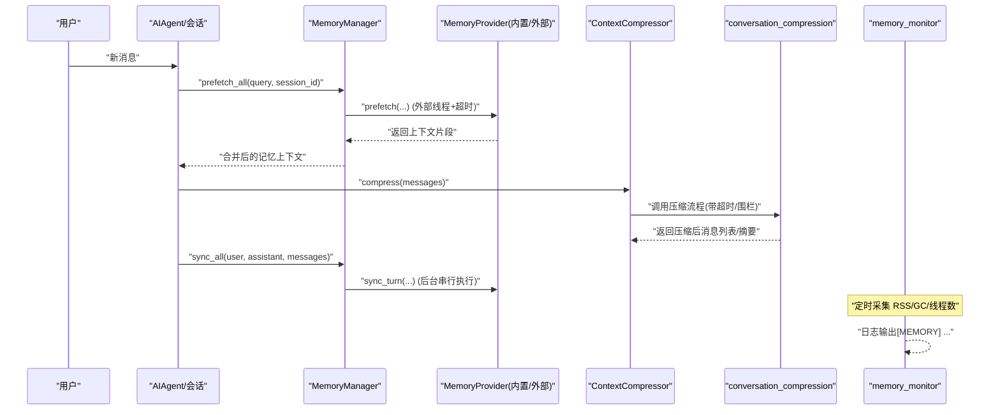
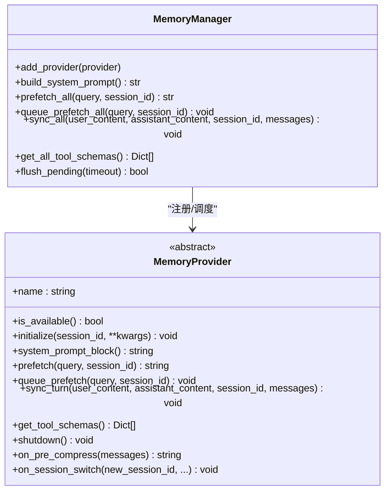
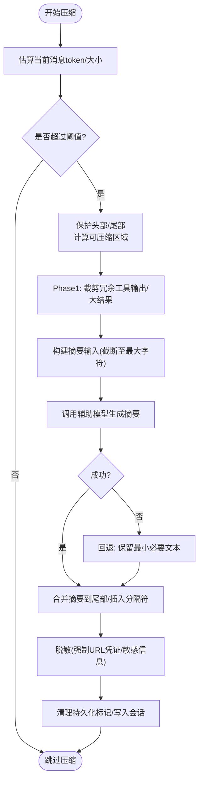
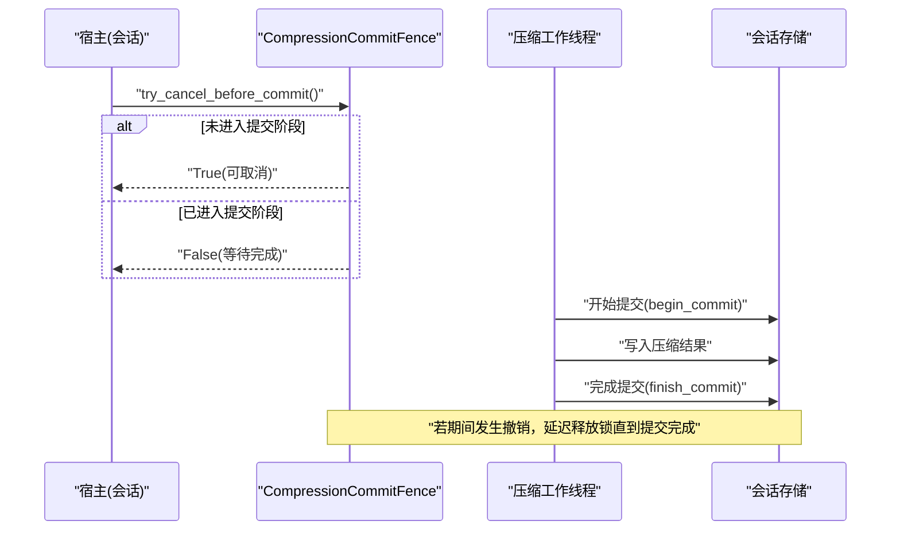
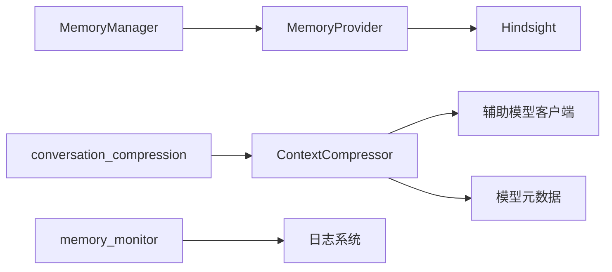

# 会话内存管理

<cite>
**本文引用的文件**
- [agent/memory_manager.py](file://agent/memory_manager.py)
- [agent/memory_provider.py](file://agent/memory_provider.py)
- [agent/context_compressor.py](file://agent/context_compressor.py)
- [agent/conversation_compression.py](file://agent/conversation_compression.py)
- [gateway/memory_monitor.py](file://gateway/memory_monitor.py)
- [plugins/memory/hindsight/__init__.py](file://plugins/memory/hindsight/__init__.py)
- [hermes_cli/subcommands/memory.py](file://hermes_cli/subcommands/memory.py)
</cite>

## 目录
1. [简介](#简介)
2. [项目结构](#项目结构)
3. [核心组件](#核心组件)
4. [架构总览](#架构总览)
5. [详细组件分析](#详细组件分析)
6. [依赖关系分析](#依赖关系分析)
7. [性能考量](#性能考量)
8. [故障排查指南](#故障排查指南)
9. [结论](#结论)
10. [附录](#附录)

## 简介
本文件聚焦 Hermes Agent 的“会话内存管理”，围绕以下目标展开：
- 会话内存分配策略：消息缓存、上下文窗口管理与内存使用优化。
- 会话压缩机制：对话历史压缩、冗余信息去除与关键信息保留策略。
- 内存泄漏检测与处理：对象引用管理、资源释放与垃圾回收优化。
- 高效实现示例：大会话处理、流式加载与分页显示技术。
- 监控与调优：内存使用监控与性能调优方法，以及面向开发者的最佳实践。

Hermes 通过 MemoryManager 统一编排内置与外部记忆提供者；通过 ContextCompressor 与 conversation_compression 对长对话进行自动压缩，保护头部/尾部并生成可复用的摘要；通过 gateway/memory_monitor 周期性记录进程 RSS/GC/线程数，辅助发现内存泄漏；并通过插件（如 Hindsight）提供可扩展的长期记忆能力。

## 项目结构
与“会话内存管理”直接相关的代码分布在 agent、gateway、plugins 与 hermes_cli 四个层次：
- agent：MemoryManager/MemoryProvider 抽象与实现、上下文压缩器与压缩流程编排。
- gateway：进程级内存监控（RSS/GC/线程）。
- plugins/memory：外部记忆提供者（以 Hindsight 为例）。
- hermes_cli：记忆子命令入口，用于配置/状态查看/重置等。

```mermaid
graph TB
subgraph "Agent"
MM["MemoryManager"]
MP["MemoryProvider(抽象)"]
CC["ContextCompressor"]
CConv["conversation_compression"]
end
subgraph "Gateway"
MemMon["memory_monitor"]
end
subgraph "Plugins"
Hindsight["Hindsight 插件"]
end
subgraph "CLI"
CLI["memory 子命令"]
end
MM --> MP
MP --> Hindsight
CConv --> CC
MemMon --> MM
CLI --> MM
```

图表来源
- [agent/memory_manager.py:364-800](file://agent/memory_manager.py#L364-L800)
- [agent/memory_provider.py:81-190](file://agent/memory_provider.py#L81-L190)
- [agent/context_compressor.py:1-180](file://agent/context_compressor.py#L1-L180)
- [agent/conversation_compression.py:1-120](file://agent/conversation_compression.py#L1-L120)
- [gateway/memory_monitor.py:1-120](file://gateway/memory_monitor.py#L1-L120)
- [plugins/memory/hindsight/__init__.py:1-120](file://plugins/memory/hindsight/__init__.py#L1-L120)
- [hermes_cli/subcommands/memory.py:12-54](file://hermes_cli/subcommands/memory.py#L12-L54)

章节来源
- [agent/memory_manager.py:364-800](file://agent/memory_manager.py#L364-L800)
- [agent/memory_provider.py:81-190](file://agent/memory_provider.py#L81-L190)
- [agent/context_compressor.py:1-180](file://agent/context_compressor.py#L1-L180)
- [agent/conversation_compression.py:1-120](file://agent/conversation_compression.py#L1-L120)
- [gateway/memory_monitor.py:1-120](file://gateway/memory_monitor.py#L1-L120)
- [plugins/memory/hindsight/__init__.py:1-120](file://plugins/memory/hindsight/__init__.py#L1-L120)
- [hermes_cli/subcommands/memory.py:12-54](file://hermes_cli/subcommands/memory.py#L12-L54)

## 核心组件
- MemoryManager：统一注册/调度记忆提供者，负责系统提示注入、预取（prefetch）、同步（sync）与工具模式注入，屏蔽外部提供者的阻塞风险。
- MemoryProvider：抽象接口，定义生命周期钩子（initialize/system_prompt_block/prefetch/sync_turn/get_tool_schemas/shutdown 等），支持可选扩展点（on_pre_compress/on_session_switch 等）。
- ContextCompressor：自动上下文压缩，保护头尾、剔除冗余、生成结构化摘要，支持微压缩、回退策略与失败冷却。
- conversation_compression：压缩流程编排，含超时控制、提交围栏（CompressionCommitFence）、并发池限制、状态持久化与恢复。
- memory_monitor：周期记录进程 RSS、GC 计数、线程数，便于定位内存泄漏。
- Hindsight 插件：外部长期记忆提供者，支持云端/本地模式、嵌入守护进程、健康检查与版本探测。
- CLI memory 子命令：配置/状态/关闭/重置记忆相关能力。

章节来源
- [agent/memory_manager.py:364-800](file://agent/memory_manager.py#L364-L800)
- [agent/memory_provider.py:81-190](file://agent/memory_provider.py#L81-L190)
- [agent/context_compressor.py:1-180](file://agent/context_compressor.py#L1-L180)
- [agent/conversation_compression.py:445-692](file://agent/conversation_compression.py#L445-L692)
- [gateway/memory_monitor.py:83-127](file://gateway/memory_monitor.py#L83-L127)
- [plugins/memory/hindsight/__init__.py:1-120](file://plugins/memory/hindsight/__init__.py#L1-L120)
- [hermes_cli/subcommands/memory.py:12-54](file://hermes_cli/subcommands/memory.py#L12-L54)

## 架构总览
下图展示了从用户消息到记忆预取、对话压缩、外部记忆写入与监控的全链路交互。



图表来源
- [agent/memory_manager.py:525-694](file://agent/memory_manager.py#L525-L694)
- [agent/context_compressor.py:1-180](file://agent/context_compressor.py#L1-L180)
- [agent/conversation_compression.py:445-692](file://agent/conversation_compression.py#L445-L692)
- [gateway/memory_monitor.py:129-193](file://gateway/memory_monitor.py#L129-L193)

## 详细组件分析

### MemoryManager：记忆编排与异步安全
- 单实例管理多个 MemoryProvider，但仅允许一个外部提供者，避免工具 schema 膨胀与冲突。
- 预取（prefetch）对外部提供者使用独立线程与超时，防止慢/卡死提供者阻塞主对话。
- 同步（sync）在后台单工作线程中串行执行，保证 turn N 先于 turn N+1 落地，避免竞态。
- 工具注入：将记忆提供者的工具 schema 注入到模型可用工具集，同时过滤保留核心工具名。
- 流式上下文清洗：StreamingContextScrubber 在流式输出中剥离 <memory-context> 块，避免泄露内部上下文。



图表来源
- [agent/memory_manager.py:364-800](file://agent/memory_manager.py#L364-L800)
- [agent/memory_provider.py:81-190](file://agent/memory_provider.py#L81-L190)

章节来源
- [agent/memory_manager.py:364-800](file://agent/memory_manager.py#L364-L800)
- [agent/memory_provider.py:81-190](file://agent/memory_provider.py#L81-L190)

### ContextCompressor：上下文压缩与关键信息保留
- 保护头部与尾部：基于 token 预算与消息数量阈值，确保最近对话与系统提示不被丢弃。
- 中间段压缩：使用辅助模型生成结构化摘要，包含任务快照、待办、历史问题追踪等。
- 冗余去除：工具结果裁剪、图片估算成本、技能指令去重与“幽灵技能”标记恢复。
- 失败与冷却：摘要失败冷却、重试上限、回退策略（最小字符保留），避免反复触发无效压缩。
- 元数据与边界：为压缩摘要添加不可见元数据键，避免严格网关拒绝；明确摘要结束标记，防止被误认为新指令。



图表来源
- [agent/context_compressor.py:100-180](file://agent/context_compressor.py#L100-L180)
- [agent/context_compressor.py:417-453](file://agent/context_compressor.py#L417-L453)
- [agent/context_compressor.py:764-782](file://agent/context_compressor.py#L764-L782)

章节来源
- [agent/context_compressor.py:100-180](file://agent/context_compressor.py#L100-L180)
- [agent/context_compressor.py:417-453](file://agent/context_compressor.py#L417-L453)
- [agent/context_compressor.py:764-782](file://agent/context_compressor.py#L764-L782)

### conversation_compression：压缩流程编排与超时围栏
- 进度感知超时：在压缩过程中跟踪流式摘要的“前进进度”，避免误杀慢模型。
- 提交围栏（CompressionCommitFence）：确保取消发生在会话变更之前，或在已开始的提交完成后才放行，避免部分写入导致的状态不一致。
- 并发池限制：限制压缩任务并发度，防止全部工作者卡死导致队列无限增长。
- 状态快照与恢复：捕获压缩尝试的可序列化状态，在取消时回滚，保持持久化一致性。



图表来源
- [agent/conversation_compression.py:445-692](file://agent/conversation_compression.py#L445-L692)

章节来源
- [agent/conversation_compression.py:445-692](file://agent/conversation_compression.py#L445-L692)

### 外部记忆提供者：Hindsight 插件
- 支持云端与本地模式，具备健康检查、端口健康宽限、版本探测与最小客户端版本校验。
- 通过 MemoryProvider 接口接入，遵循统一的 initialize/prefetch/sync_turn/lifecycle 约定。
- 可配置请求超时与守护进程空闲超时，避免长时间占用资源。

章节来源
- [plugins/memory/hindsight/__init__.py:1-120](file://plugins/memory/hindsight/__init__.py#L1-L120)
- [agent/memory_provider.py:81-190](file://agent/memory_provider.py#L81-L190)

### CLI 记忆子命令
- 提供交互式配置、状态查看、禁用外部提供者、重置内置记忆等能力。
- 强调同一时间仅能激活一个外部提供者，内置记忆始终可用。

章节来源
- [hermes_cli/subcommands/memory.py:12-54](file://hermes_cli/subcommands/memory.py#L12-L54)

## 依赖关系分析
- MemoryManager 依赖 MemoryProvider 抽象，运行时动态选择内置或外部提供者。
- ContextCompressor 依赖辅助模型客户端与模型元数据，结合 conversation_compression 提供的超时与围栏保障。
- memory_monitor 独立运行，不阻塞主流程，仅输出结构化日志供诊断。
- Hindsight 作为外部提供者，需满足最低版本与依赖可用性，否则降级为不可用。



图表来源
- [agent/memory_manager.py:364-800](file://agent/memory_manager.py#L364-L800)
- [agent/context_compressor.py:1-180](file://agent/context_compressor.py#L1-L180)
- [agent/conversation_compression.py:445-692](file://agent/conversation_compression.py#L445-L692)
- [gateway/memory_monitor.py:129-193](file://gateway/memory_monitor.py#L129-L193)
- [plugins/memory/hindsight/__init__.py:1-120](file://plugins/memory/hindsight/__init__.py#L1-L120)

章节来源
- [agent/memory_manager.py:364-800](file://agent/memory_manager.py#L364-L800)
- [agent/context_compressor.py:1-180](file://agent/context_compressor.py#L1-L180)
- [agent/conversation_compression.py:445-692](file://agent/conversation_compression.py#L445-L692)
- [gateway/memory_monitor.py:129-193](file://gateway/memory_monitor.py#L129-L193)
- [plugins/memory/hindsight/__init__.py:1-120](file://plugins/memory/hindsight/__init__.py#L1-L120)

## 性能考量
- 预取隔离：外部提供者 prefetch 使用独立线程与超时，避免阻塞主对话路径。
- 同步串行化：sync 通过单工作线程串行执行，保证顺序且降低竞争开销。
- 压缩预算：按 token 与字符上限约束摘要输入，避免辅助模型上下文溢出。
- 并发限制：压缩任务池限定最大并发，防止全量卡死导致队列堆积。
- 流式进度：压缩过程跟踪流式 token 到达，区分“慢模型”与“卡死”，减少误杀。
- 监控指标：RSS/GC/线程数定期输出，便于发现缓慢泄漏与线程泄漏。

章节来源
- [agent/memory_manager.py:525-694](file://agent/memory_manager.py#L525-L694)
- [agent/context_compressor.py:417-453](file://agent/context_compressor.py#L417-L453)
- [agent/conversation_compression.py:693-773](file://agent/conversation_compression.py#L693-L773)
- [gateway/memory_monitor.py:83-127](file://gateway/memory_monitor.py#L83-L127)

## 故障排查指南
- 外部提供者超时：观察 MemoryManager 的外部预取超时日志，必要时调整超时或禁用该提供者。
- 压缩失败/冷却：关注摘要失败冷却与回退策略，避免频繁触发无效压缩；检查辅助模型可用性。
- 提交围栏卡住：若 begin_commit 长时间未完成，检查数据库写入是否阻塞；利用围栏的“提交进行中”标志位判断。
- 内存泄漏：通过 memory_monitor 的 [MEMORY] 行追踪 RSS 趋势；结合 GC 计数与线程数变化定位异常。
- 工具 schema 污染：确认 MemoryManager 对工具名称的去重与核心工具保护，避免覆盖内置工具。

章节来源
- [agent/memory_manager.py:547-595](file://agent/memory_manager.py#L547-L595)
- [agent/context_compressor.py:73-95](file://agent/context_compressor.py#L73-L95)
- [agent/conversation_compression.py:445-692](file://agent/conversation_compression.py#L445-L692)
- [gateway/memory_monitor.py:129-193](file://gateway/memory_monitor.py#L129-L193)

## 结论
Hermes 的会话内存管理通过 MemoryManager 统一编排记忆提供者，借助 ContextCompressor 与 conversation_compression 实现稳健的上下文压缩与关键信息保留；配合 memory_monitor 的进程级监控，形成从“预取—压缩—写入—监控”的闭环。对外部提供者的超时与隔离、对压缩过程的超时与围栏、以及对冗余信息的裁剪与脱敏，共同保障了长会话下的稳定性与性能。

## 附录
- 最佳实践
  - 合理设置外部提供者超时与预算，避免拖慢主对话。
  - 启用压缩并关注摘要失败冷却，避免无效循环。
  - 开启 memory_monitor，定期巡检 RSS/GC/线程数。
  - 谨慎自定义 MemoryProvider，遵循生命周期与线程安全约定。
- 参考路径
  - 预取与同步：[agent/memory_manager.py:525-694](file://agent/memory_manager.py#L525-L694)
  - 压缩流程与围栏：[agent/conversation_compression.py:445-692](file://agent/conversation_compression.py#L445-L692)
  - 摘要生成与脱敏：[agent/context_compressor.py:100-180](file://agent/context_compressor.py#L100-L180), [agent/context_compressor.py:764-782](file://agent/context_compressor.py#L764-L782)
  - 进程监控：[gateway/memory_monitor.py:129-193](file://gateway/memory_monitor.py#L129-L193)
  - 外部提供者：[plugins/memory/hindsight/__init__.py:1-120](file://plugins/memory/hindsight/__init__.py#L1-L120)
  - CLI 记忆命令：[hermes_cli/subcommands/memory.py:12-54](file://hermes_cli/subcommands/memory.py#L12-L54)