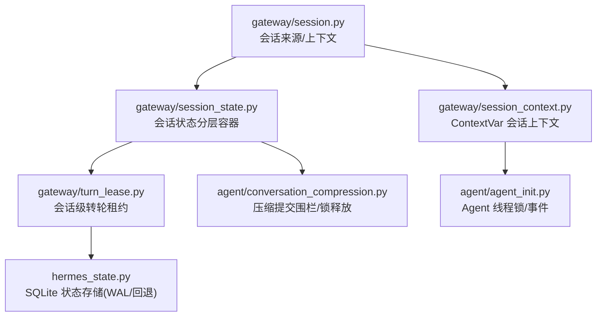
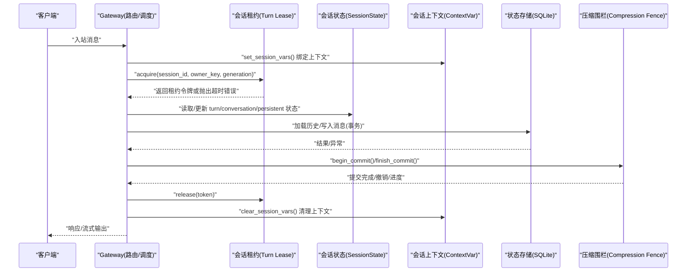
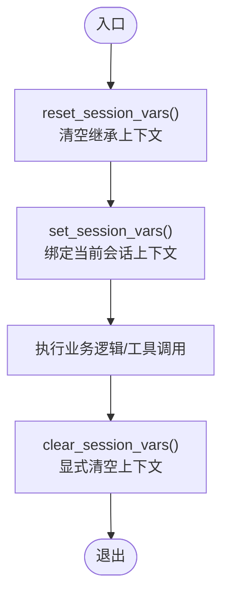
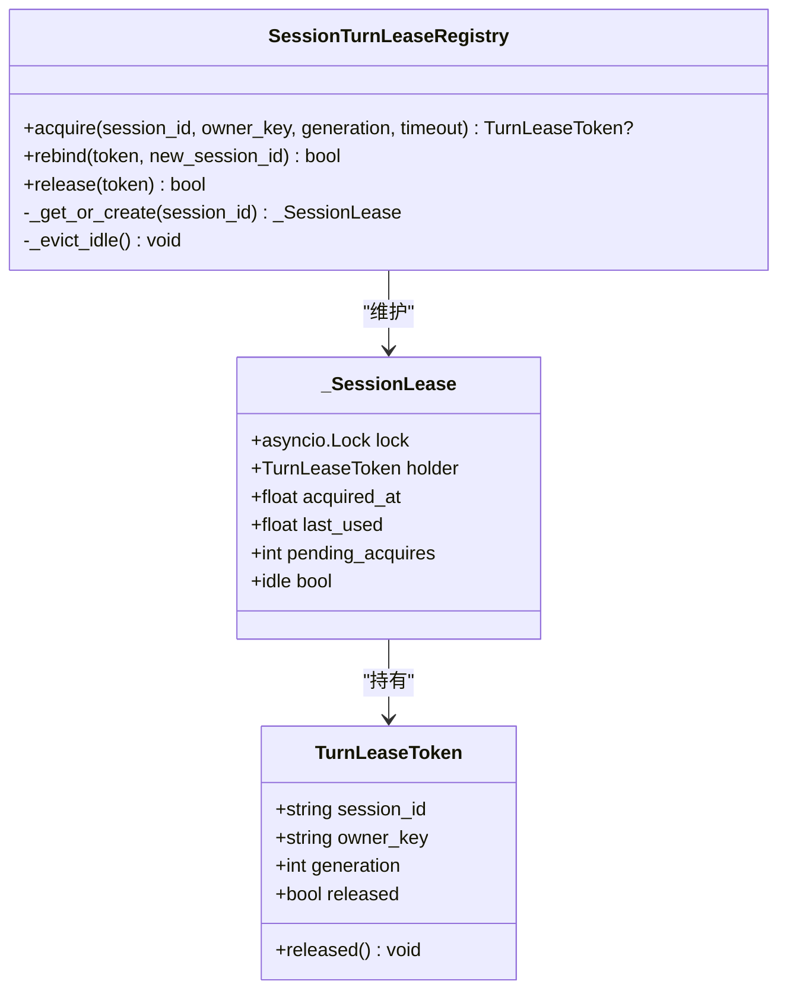
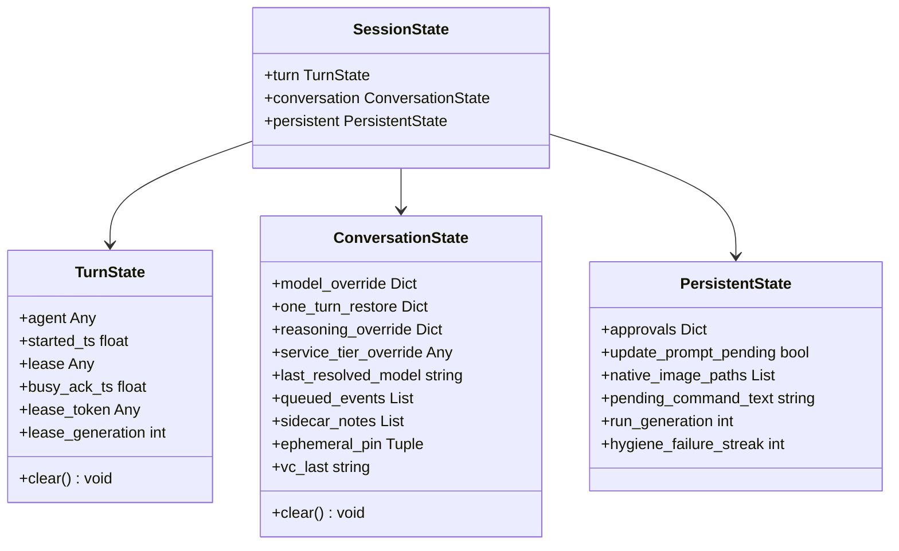
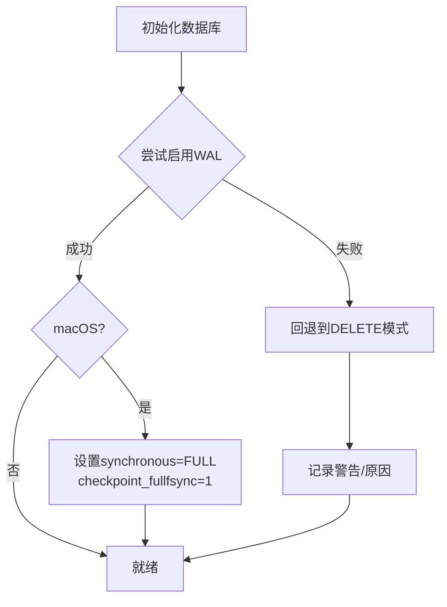
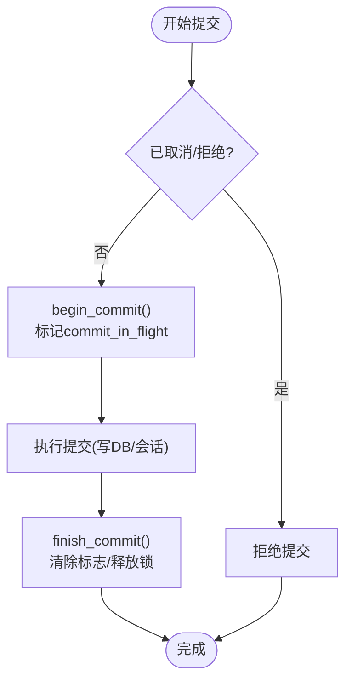
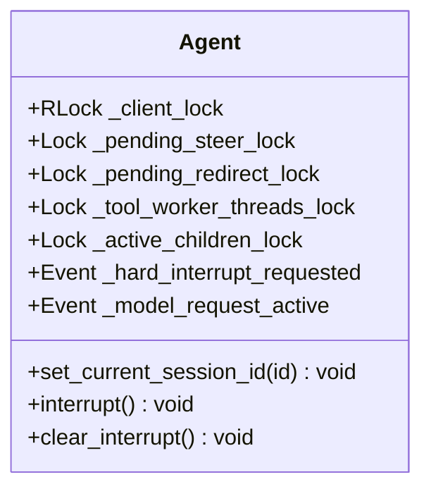
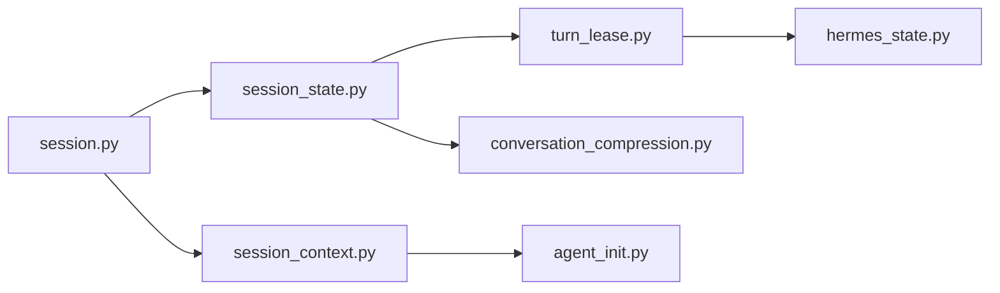

# 会话并发控制

<cite>
**本文引用的文件**
- [gateway/session.py](file://gateway/session.py)
- [gateway/session_context.py](file://gateway/session_context.py)
- [gateway/session_state.py](file://gateway/session_state.py)
- [gateway/turn_lease.py](file://gateway/turn_lease.py)
- [hermes_state.py](file://hermes_state.py)
- [agent/conversation_compression.py](file://agent/conversation_compression.py)
- [agent/agent_init.py](file://agent/agent_init.py)
</cite>

## 目录
1. [简介](#简介)
2. [项目结构](#项目结构)
3. [核心组件](#核心组件)
4. [架构总览](#架构总览)
5. [详细组件分析](#详细组件分析)
6. [依赖关系分析](#依赖关系分析)
7. [性能考量](#性能考量)
8. [故障排查指南](#故障排查指南)
9. [结论](#结论)
10. [附录](#附录)

## 简介
本文件聚焦 Hermes Agent 在网关与代理运行时的“会话并发控制”，覆盖多进程、多线程与异步任务环境下的访问控制机制。重点包括：
- 会话上下文隔离（ContextVar）避免跨任务泄漏
- 会话级串行化（Turn Lease）保证同一会话的“加载历史→执行→落盘”原子性
- 持久层并发（SQLite WAL/回退策略）与压缩锁（Compression Lock）协作
- 状态同步与一致性（会话切换、压缩旋转、路由键到会话ID的多对一映射）
- 并发安全设计模式（读写锁、乐观锁、悲观锁）的应用场景与取舍
- 高并发下资源竞争检测与冲突解决策略
- 性能监控与故障诊断方法，以及面向开发者的实现指南

## 项目结构
围绕会话并发控制的关键模块分布如下：
- gateway/session.py：会话来源、上下文构建、会话条目等
- gateway/session_context.py：基于 ContextVar 的会话上下文变量，替代进程全局环境变量
- gateway/session_state.py：按生命周期分层的会话状态容器（turn/conversation/persistent）
- gateway/turn_lease.py：按会话ID的异步租约，序列化转轮（load/run/flush）
- hermes_state.py：SQLite 状态存储，WAL 模式与兼容性回退、压缩锁持有者存活探测
- agent/conversation_compression.py：压缩流程中的提交围栏、锁释放守卫、进度追踪
- agent/agent_init.py：Agent 内部线程锁集合（RLock/Lock/Event），用于工具执行、流式输出、中断等

**图表来源**
- [gateway/session.py:1-120](file://gateway/session.py#L1-L120)
- [gateway/session_context.py:1-120](file://gateway/session_context.py#L1-L120)
- [gateway/session_state.py:1-180](file://gateway/session_state.py#L1-L180)
- [gateway/turn_lease.py:1-160](file://gateway/turn_lease.py#L1-L160)
- [hermes_state.py:1-120](file://hermes_state.py#L1-L120)
- [agent/conversation_compression.py:450-649](file://agent/conversation_compression.py#L450-L649)
- [agent/agent_init.py:790-830](file://agent/agent_init.py#L790-L830)

**章节来源**
- [gateway/session.py:1-120](file://gateway/session.py#L1-L120)
- [gateway/session_context.py:1-120](file://gateway/session_context.py#L1-L120)
- [gateway/session_state.py:1-180](file://gateway/session_state.py#L1-L180)
- [gateway/turn_lease.py:1-160](file://gateway/turn_lease.py#L1-L160)
- [hermes_state.py:1-120](file://hermes_state.py#L1-L120)
- [agent/conversation_compression.py:450-649](file://agent/conversation_compression.py#L450-L649)
- [agent/agent_init.py:790-830](file://agent/agent_init.py#L790-L830)

## 核心组件
- 会话上下文隔离（ContextVar）
  - 使用 contextvars.ContextVar 为每个 asyncio 任务提供独立的会话上下文，避免 os.environ 的全局污染与跨任务泄漏
  - 支持显式绑定/清理/重置，兼容 CLI/cron 的遗留环境变量路径
- 会话级转轮租约（Turn Lease）
  - 以 session_id 为单位串行化“加载历史→运行→落盘”区域，防止多路由键映射到同一会话导致的并发写入
  - 带超时失败关闭、生成号校验、可重绑定（压缩旋转）能力
- 会话状态分层容器（SessionState）
  - 将 turn/conversation/persistent 三类状态集中管理，统一生命周期清理，避免边界漂移与整体重置竞态
- SQLite 持久层并发（WAL/回退）
  - 默认 WAL 模式提升并发读；在不兼容文件系统上自动回退至 DELETE 模式
  - 针对 macOS 强化 fsync 与 checkpoint_fullfsync，降低关机时损坏风险
- 压缩提交围栏（Commit Fence）
  - 通过锁+事件+无锁标志组合，确保提交边界确定性与取消安全
  - 支持“拒绝未来提交”、“延迟释放锁”、“进度心跳”等高级语义
- Agent 内部线程锁
  - RLock/Lock/Event 保护客户端请求、工具执行线程、流式输出、中断传播等关键临界区

**章节来源**
- [gateway/session_context.py:1-120](file://gateway/session_context.py#L1-L120)
- [gateway/turn_lease.py:1-160](file://gateway/turn_lease.py#L1-L160)
- [gateway/session_state.py:1-180](file://gateway/session_state.py#L1-L180)
- [hermes_state.py:486-540](file://hermes_state.py#L486-L540)
- [agent/conversation_compression.py:450-649](file://agent/conversation_compression.py#L450-L649)
- [agent/agent_init.py:790-830](file://agent/agent_init.py#L790-L830)

## 架构总览
下图展示一次消息进入网关后，会话并发控制的调用链与数据流：

**图表来源**
- [gateway/session_context.py:206-313](file://gateway/session_context.py#L206-L313)
- [gateway/turn_lease.py:191-264](file://gateway/turn_lease.py#L191-L264)
- [gateway/session_state.py:172-179](file://gateway/session_state.py#L172-L179)
- [hermes_state.py:486-540](file://hermes_state.py#L486-L540)
- [agent/conversation_compression.py:537-573](file://agent/conversation_compression.py#L537-L573)

## 详细组件分析

### 组件A：会话上下文隔离（ContextVar）
- 设计要点
  - 用 ContextVar 替代进程全局环境变量，确保每个 asyncio 任务拥有独立会话上下文
  - 提供 set_session_vars/clear_session_vars/reset_session_vars 三套接口，分别对应绑定、清理、重置
  - 兼容 CLI/cron 的遗留环境变量读取路径（get_session_env）
- 并发安全
  - 任务局部可见，避免 Message A/B 并发时互相覆盖
  - reset_session_vars 消除跨任务继承泄漏窗口（新任务先清空再绑定自身上下文）
- 典型用法
  - 网关每处理一条消息前调用 set_session_vars，结束时 clear_session_vars
  - 子代理/委托子进程通过 is_delegated_child_context 判断是否跳过写进程环境变量

**图表来源**
- [gateway/session_context.py:315-360](file://gateway/session_context.py#L315-L360)
- [gateway/session_context.py:206-313](file://gateway/session_context.py#L206-L313)

**章节来源**
- [gateway/session_context.py:1-120](file://gateway/session_context.py#L1-L120)
- [gateway/session_context.py:206-313](file://gateway/session_context.py#L206-L313)
- [gateway/session_context.py:315-360](file://gateway/session_context.py#L315-L360)

### 组件B：会话级转轮租约（Turn Lease）
- 设计要点
  - 以 session_id 为单位串行化“加载历史→运行→落盘”区域，防止多路由键映射到同一会话导致并发写入
  - 支持超时失败关闭（Fail-closed on timeout），避免并发绕过
  - 生成号校验与身份检查，确保释放只作用于当前持有者
  - 支持 rebind：压缩旋转时将租约从旧 session_id 迁移到新 session_id
- 并发安全
  - 使用 asyncio.Lock 保证单事件循环内的互斥
  - pending_acquires 计数避免在 lock.release() 瞬间被误驱逐
  - 日志记录争用情况，便于监控与排障
- 典型用法
  - 在 switch_session/tip-walk 之后、转轮开始前 acquire
  - 在 finally 中 release，确保任何退出路径都释放

**图表来源**
- [gateway/turn_lease.py:97-160](file://gateway/turn_lease.py#L97-L160)
- [gateway/turn_lease.py:126-190](file://gateway/turn_lease.py#L126-L190)
- [gateway/turn_lease.py:191-353](file://gateway/turn_lease.py#L191-L353)

**章节来源**
- [gateway/turn_lease.py:1-160](file://gateway/turn_lease.py#L1-L160)
- [gateway/turn_lease.py:191-353](file://gateway/turn_lease.py#L191-L353)

### 组件C：会话状态分层容器（SessionState）
- 设计要点
  - 将状态按生命周期分为三层：
    - turn：每次运行转轮的状态（如 agent 实例、开始时间、租约等）
    - conversation：跨转轮但随会话边界重置的状态（模型覆盖、队列、侧边笔记等）
    - persistent：自有生命周期的状态（审批、图片路径、运行代数等）
  - 提供 clear() 统一清理，避免边界漂移与遗漏
- 并发安全
  - 通过对象字段而非全局字典减少整体替换竞态
  - legacy dict view 保持测试兼容，生产代码通过属性访问
- 典型用法
  - 转轮结束调用 TurnState.clear()
  - 会话边界调用 ConversationState.clear()
  - persistent 字段按需单独清理

**图表来源**
- [gateway/session_state.py:51-179](file://gateway/session_state.py#L51-L179)

**章节来源**
- [gateway/session_state.py:1-180](file://gateway/session_state.py#L1-L180)

### 组件D：SQLite 持久层并发（WAL/回退）
- 设计要点
  - 默认启用 WAL 模式以提升并发读；在不兼容文件系统（NFS/SMB/FUSE/ZFS）上自动回退至 DELETE 模式
  - macOS 平台强制 synchronous=FULL 与 checkpoint_fullfsync，降低关机时损坏风险
  - 检测 SQLite WAL-reset bug 并在新库上拒绝启用 WAL
- 并发安全
  - 通过 PRAGMA 与平台特定设置保障崩溃恢复与数据一致性
  - 记录最近初始化错误，便于用户提示与诊断
- 典型用法
  - 启动时尝试启用 WAL，失败则降级并记录原因
  - 在 /resume 等命令中显示不可用原因

**图表来源**
- [hermes_state.py:486-540](file://hermes_state.py#L486-L540)
- [hermes_state.py:718-780](file://hermes_state.py#L718-L780)

**章节来源**
- [hermes_state.py:486-540](file://hermes_state.py#L486-L540)
- [hermes_state.py:718-780](file://hermes_state.py#L718-L780)

### 组件E：压缩提交围栏（Compression Fence）
- 设计要点
  - 通过锁+事件+无锁标志组合，确保提交边界确定性与取消安全
  - begin_commit/finish_commit 包裹提交过程，cancel_before_commit 可在边界前取消或等待
  - revoke_commit_admission 允许在任何 unwind 路径拒绝未来提交，并延迟释放锁直到提交完成
  - touch_progress/seconds_since_progress 提供进度心跳，区分慢模型与卡死
- 并发安全
  - 无锁读取 commit_in_flight，避免阻塞主机
  - 持有者限定的锁释放钩子，防止 ABA 问题
- 典型用法
  - 压缩工作线程在提交前后调用 begin_commit/finish_commit
  - 主机在取消/超时时调用 revoke_commit_admission 并等待 finish_commit

**图表来源**
- [agent/conversation_compression.py:537-573](file://agent/conversation_compression.py#L537-L573)
- [agent/conversation_compression.py:591-630](file://agent/conversation_compression.py#L591-L630)

**章节来源**
- [agent/conversation_compression.py:450-649](file://agent/conversation_compression.py#L450-L649)

### 组件F：Agent 内部线程锁
- 设计要点
  - 使用 RLock/Lock/Event 保护客户端请求、工具执行线程、流式输出、中断传播等关键临界区
  - 支持工具线程跟踪，以便中断信号正确分发
  - 支持活跃转轮重定向与软引导（steer）注入
- 并发安全
  - 线程安全的 Event 使辅助流轮询器能原子感知硬取消
  - 工具线程集合与锁确保中断能广播到所有工作线程
- 典型用法
  - 在工具执行前后加锁，确保状态一致
  - 在流式输出时加锁，避免并发写入冲突

**图表来源**
- [agent/agent_init.py:790-830](file://agent/agent_init.py#L790-L830)

**章节来源**
- [agent/agent_init.py:790-830](file://agent/agent_init.py#L790-L830)

## 依赖关系分析
- gateway/session.py 依赖 gateway/session_context.py 提供上下文隔离
- gateway/session_state.py 提供结构化状态容器，供网关与代理使用
- gateway/turn_lease.py 依赖 asyncio 锁，提供会话级串行化
- hermes_state.py 提供持久层，受 WAL/回退策略影响
- agent/conversation_compression.py 与 hermes_state.py 协作，确保压缩提交的原子性
- agent/agent_init.py 提供 Agent 内部线程锁，与上层并发控制配合

**图表来源**
- [gateway/session.py:1-120](file://gateway/session.py#L1-L120)
- [gateway/session_context.py:1-120](file://gateway/session_context.py#L1-L120)
- [gateway/session_state.py:1-180](file://gateway/session_state.py#L1-L180)
- [gateway/turn_lease.py:1-160](file://gateway/turn_lease.py#L1-L160)
- [hermes_state.py:1-120](file://hermes_state.py#L1-L120)
- [agent/conversation_compression.py:450-649](file://agent/conversation_compression.py#L450-L649)
- [agent/agent_init.py:790-830](file://agent/agent_init.py#L790-L830)

**章节来源**
- [gateway/session.py:1-120](file://gateway/session.py#L1-L120)
- [gateway/session_context.py:1-120](file://gateway/session_context.py#L1-L120)
- [gateway/session_state.py:1-180](file://gateway/session_state.py#L1-L180)
- [gateway/turn_lease.py:1-160](file://gateway/turn_lease.py#L1-L160)
- [hermes_state.py:1-120](file://hermes_state.py#L1-L120)
- [agent/conversation_compression.py:450-649](file://agent/conversation_compression.py#L450-L649)
- [agent/agent_init.py:790-830](file://agent/agent_init.py#L790-L830)

## 性能考量
- 上下文隔离（ContextVar）
  - 优势：任务局部可见，避免全局变量竞争
  - 注意：频繁 set/clear 有轻微开销，应在消息边界批量操作
- 转轮租约（Turn Lease）
  - 优势：防止并发写入，保证顺序一致性
  - 注意：高争用时可能超时，需监控日志并调整超时阈值
- SQLite WAL
  - 优势：提升并发读性能
  - 注意：在不兼容文件系统上回退至 DELETE 模式，性能下降但稳定性提升
- 压缩围栏（Compression Fence）
  - 优势：确保提交原子性，支持取消与进度心跳
  - 注意：长提交可能阻塞后续操作，需监控进度与超时

[本节为通用指导，无需具体文件引用]

## 故障排查指南
- 常见问题
  - 会话上下文泄漏：检查是否在消息边界正确调用 reset/set/clear
  - 转轮超时：查看 turn lease 争用日志，确认是否存在多路由键映射到同一会话
  - SQLite 不可用：检查 WAL 兼容性，查看初始化错误信息
  - 压缩卡死：监控进度心跳，必要时撤销提交并释放锁
- 诊断步骤
  - 启用详细日志，关注上下文绑定/清理、租约获取/释放、WAL 回退、压缩围栏状态
  - 使用 get_last_init_error 获取最近初始化错误
  - 检查压缩围栏的 commit_in_flight 与 seconds_since_progress

**章节来源**
- [gateway/session_context.py:315-360](file://gateway/session_context.py#L315-L360)
- [gateway/turn_lease.py:212-255](file://gateway/turn_lease.py#L212-L255)
- [hermes_state.py:520-540](file://hermes_state.py#L520-L540)
- [agent/conversation_compression.py:574-589](file://agent/conversation_compression.py#L574-L589)

## 结论
Hermes Agent 的会话并发控制通过多层机制协同工作：
- ContextVar 确保上下文隔离，避免跨任务泄漏
- Turn Lease 保证会话级串行化，防止并发写入
- SessionState 提供结构化状态管理，避免边界漂移
- SQLite WAL/回退策略平衡性能与稳定性
- Compression Fence 确保压缩提交的原子性与可取消性
- Agent 内部线程锁保护关键临界区

这些机制共同实现了高并发下的数据一致性与完整性，为开发者提供了可靠的并发安全基础。

[本节为总结，无需具体文件引用]

## 附录
- 并发安全设计模式应用
  - 读写锁：适用于读多写少场景，如会话元数据读取与更新
  - 乐观锁：适用于冲突较少场景，如版本号校验
  - 悲观锁：适用于冲突频繁场景，如转轮租约
- 高并发场景示例
  - 多路由键映射到同一会话：通过 Turn Lease 串行化
  - 压缩旋转：通过 rebind 迁移租约
  - 上下文泄漏防护：通过 reset/set/clear 严格边界
- 性能监控建议
  - 监控上下文绑定/清理耗时
  - 监控转轮租约争用与超时
  - 监控 SQLite WAL 回退频率
  - 监控压缩围栏进度与超时

[本节为补充内容，无需具体文件引用]