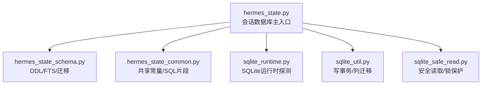
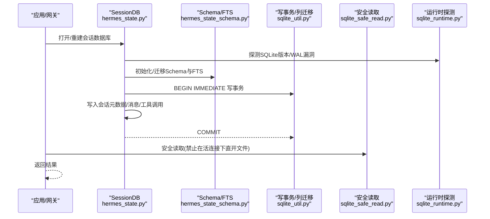
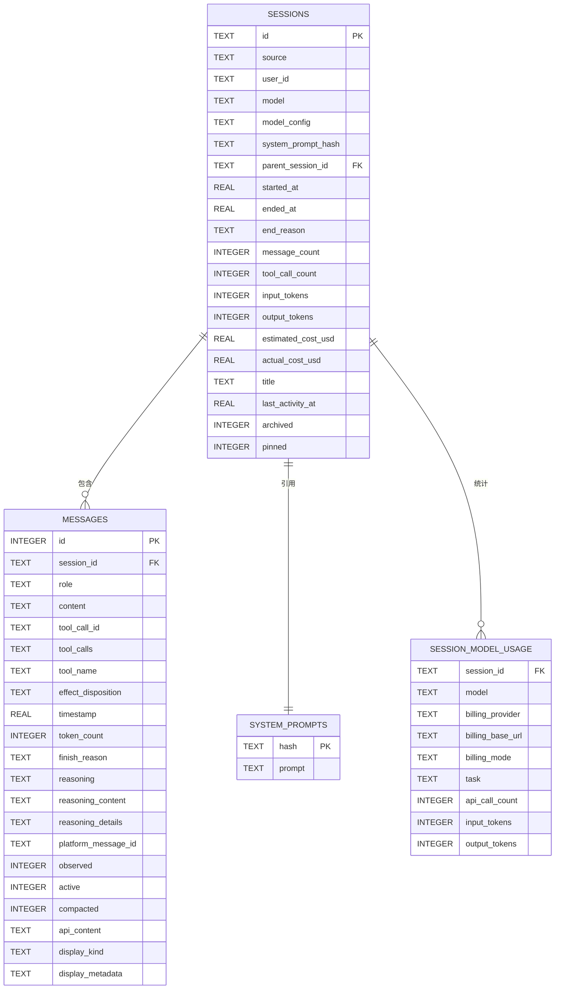
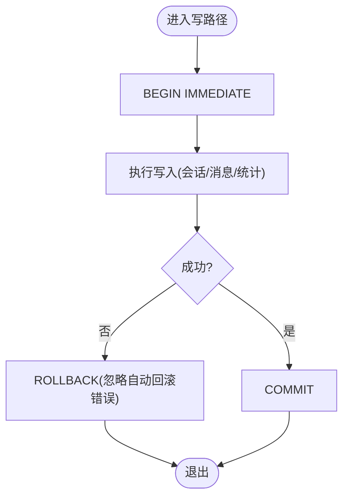
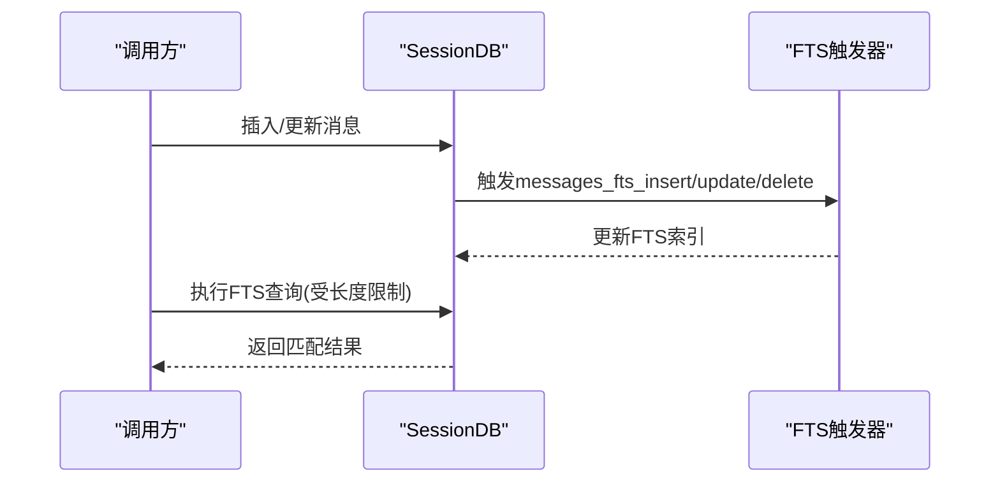
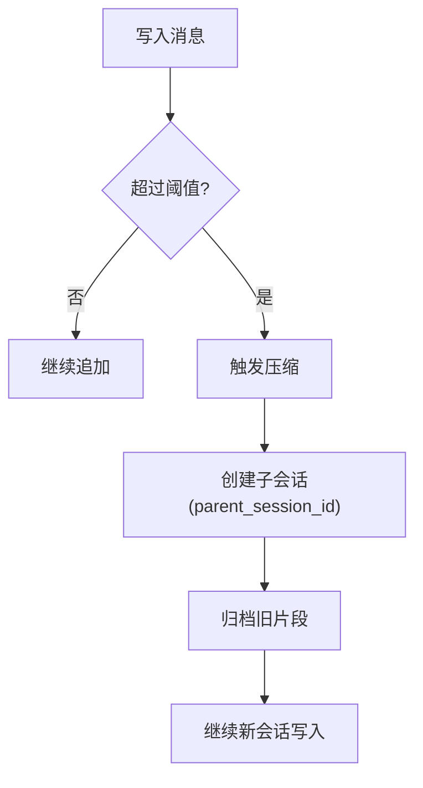
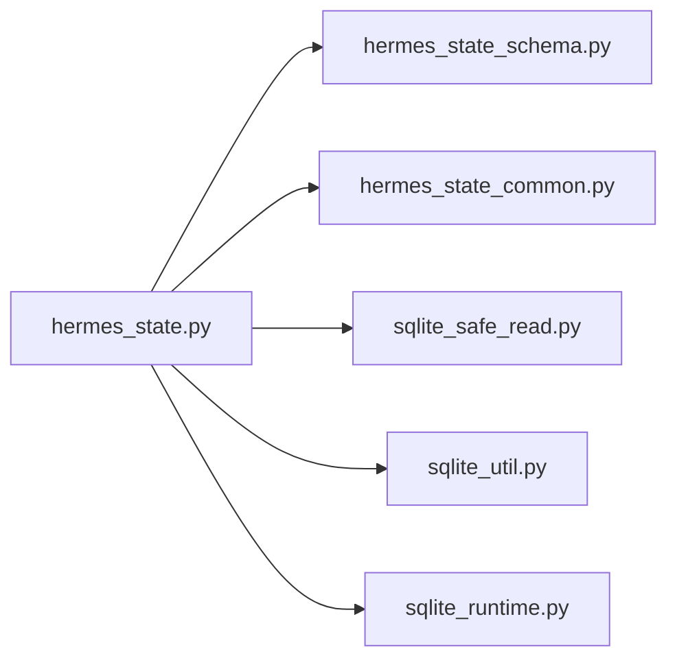

# 会话数据存储

<cite>
**本文引用的文件**
- [hermes_state.py](file://hermes_state.py)
- [hermes_state_schema.py](file://hermes_state_schema.py)
- [hermes_state_common.py](file://hermes_state_common.py)
- [sqlite_runtime.py](file://hermes_cli/sqlite_runtime.py)
- [sqlite_util.py](file://hermes_cli/sqlite_util.py)
- [sqlite_safe_read.py](file://hermes_cli/sqlite_safe_read.py)
</cite>

## 目录
1. [简介](#简介)
2. [项目结构](#项目结构)
3. [核心组件](#核心组件)
4. [架构总览](#架构总览)
5. [详细组件分析](#详细组件分析)
6. [依赖关系分析](#依赖关系分析)
7. [性能考量](#性能考量)
8. [故障排查指南](#故障排查指南)
9. [结论](#结论)
10. [附录](#附录)

## 简介
本文件面向 Hermes Agent 的“会话数据存储层”，系统性说明基于 SQLite 的会话持久化方案，包括：表结构与数据模型、WAL 模式与并发控制、事务机制、索引与查询优化、FTS5 全文检索、压缩/拆分策略、备份恢复与迁移、以及高效读写实践。目标是帮助开发者理解并安全地扩展该存储层。

## 项目结构
Hermes 将会话状态持久化能力集中在 hermes_state 系列模块中，并通过 CLI 层的 SQLite 工具进行运行时探测、安全读取与写事务封装。关键文件职责如下：
- hermes_state.py：会话数据库主入口，定义 WAL 模式、会话生命周期、消息写入、搜索、压缩与导出等高层逻辑。
- hermes_state_schema.py：DDL 与 FTS 触发器管理、列对齐与迁移、FTS 布局版本演进。
- hermes_state_common.py：共享常量（表结构 SQL、预览片段生成、FTS 相关常量、SQL 表达式）。
- sqlite_runtime.py：进程内 SQLite 运行时信息探测与 WAL 重置漏洞检测。
- sqlite_util.py：幂等列添加与 IMMEDIATE 写事务上下文。
- sqlite_safe_read.py：防止在存在活动连接时直接打开数据库文件导致 POSIX 锁失效的安全读取工具。

图表来源
- [hermes_state.py:1-80](file://hermes_state.py#L1-L80)
- [hermes_state_schema.py:1-35](file://hermes_state_schema.py#L1-L35)
- [hermes_state_common.py:1-30](file://hermes_state_common.py#L1-L30)
- [sqlite_runtime.py:1-55](file://hermes_cli/sqlite_runtime.py#L1-L55)
- [sqlite_util.py:1-50](file://hermes_cli/sqlite_util.py#L1-L50)
- [sqlite_safe_read.py:1-60](file://hermes_cli/sqlite_safe_read.py#L1-L60)

章节来源
- [hermes_state.py:1-80](file://hermes_state.py#L1-L80)
- [hermes_state_schema.py:1-35](file://hermes_state_schema.py#L1-L35)
- [hermes_state_common.py:1-30](file://hermes_state_common.py#L1-L30)
- [sqlite_runtime.py:1-55](file://hermes_cli/sqlite_runtime.py#L1-L55)
- [sqlite_util.py:1-50](file://hermes_cli/sqlite_util.py#L1-L50)
- [sqlite_safe_read.py:1-60](file://hermes_cli/sqlite_safe_read.py#L1-L60)

## 核心组件
- 会话数据库主类（SessionDB）：负责连接管理、WAL 配置、Schema 初始化与迁移、消息写入、会话元数据维护、FTS 同步、压缩与拆分、导出与恢复。
- Schema 与 FTS 管理：集中处理表结构、索引、FTS 虚拟表与触发器的创建/升级/回退兼容。
- 共享常量与 SQL 片段：统一预览文本生成、会话活跃时间计算、列表过滤条件、FTS 查询限制等。
- SQLite 运行时与安全访问：探测 SQLite 版本与 WAL 重置漏洞；提供安全的只读探测与原子化的连接注册/注销，避免破坏其他进程的 POSIX 锁。
- 写事务与列迁移：统一的 IMMEDIATE 事务边界与幂等的 ALTER TABLE 操作，确保多进程/多线程并发下的正确性。

章节来源
- [hermes_state.py:1-120](file://hermes_state.py#L1-L120)
- [hermes_state_schema.py:83-200](file://hermes_state_schema.py#L83-L200)
- [hermes_state_common.py:167-185](file://hermes_state_common.py#L167-L185)
- [sqlite_runtime.py:18-55](file://hermes_cli/sqlite_runtime.py#L18-L55)
- [sqlite_util.py:14-50](file://hermes_cli/sqlite_util.py#L14-L50)
- [sqlite_safe_read.py:121-274](file://hermes_cli/sqlite_safe_read.py#L121-L274)

## 架构总览
下图展示了会话存储的核心交互：上层业务通过 SessionDB 发起读写；Schema 层保证表结构与 FTS 一致；CLI 工具提供安全连接与事务封装；运行时探测用于规避已知 SQLite 问题。

图表来源
- [hermes_state.py:1-80](file://hermes_state.py#L1-L80)
- [hermes_state_schema.py:107-200](file://hermes_state_schema.py#L107-L200)
- [sqlite_util.py:31-50](file://hermes_cli/sqlite_util.py#L31-L50)
- [sqlite_safe_read.py:347-382](file://hermes_cli/sqlite_safe_read.py#L347-L382)
- [sqlite_runtime.py:24-55](file://hermes_cli/sqlite_runtime.py#L24-L55)

## 详细组件分析

### 数据模型与表结构
- sessions：会话元数据，包含来源、用户标识、聊天上下文、模型与配置、系统提示、父子会话链、开始/结束时间、统计指标（token、成本）、标题、最近活动、归档/置顶标记、压缩失败冷却等。
- messages：消息历史，包含角色、内容、工具调用 ID/名称/参数、效果处置、时间戳、token 计数、完成原因、推理内容与细节、平台消息 ID、是否观察/激活/已压缩、API 原始内容、显示类型与元数据。
- system_prompts：去重的系统提示内容表，按哈希键引用，减少冗余。
- session_model_usage：按会话与模型维度记录计费与用量统计。

图表来源
- [hermes_state_common.py:197-300](file://hermes_state_common.py#L197-L300)

章节来源
- [hermes_state_common.py:197-300](file://hermes_state_common.py#L197-L300)

### 索引与查询优化
- 会话“最近活跃”计算：使用子查询取 messages 的最大时间戳与 sessions.last_activity_at 比较，再回退到 started_at，保证 UI 列表排序准确。
- 预览片段：对技能脚手架消息做特殊截取拼接，兼顾预算与可读性。
- FTS 查询长度限制：对用户输入的 FTS 查询进行上限控制，避免恶意或异常输入导致性能退化。
- 延迟索引：通过 DEFERRED_INDEX_SQL 在合适时机构建索引，降低初始写入开销。

章节来源
- [hermes_state_common.py:117-165](file://hermes_state_common.py#L117-L165)
- [hermes_state_common.py:181-185](file://hermes_state_common.py#L181-L185)
- [hermes_state_common.py:187-194](file://hermes_state_common.py#L187-L194)

### WAL 模式与并发控制
- WAL 模式：启用 Write-Ahead Logging，允许多读一写，适合网关多平台并发场景。
- 写事务：使用 IMMEDIATE 事务，确保同一时刻只有一个写者，避免竞争；异常路径显式 ROLLBACK 以覆盖 SQLite 自动回滚可能带来的二次错误。
- 安全读取：禁止在有活动连接的情况下直接打开数据库文件，避免 close() 取消 POSIX 锁导致“数据库镜像损坏”。通过 connect_tracked 注册/注销连接，read_header_bytes_preopen 仅允许在无连接时读取头部字节。

图表来源
- [sqlite_util.py:31-50](file://hermes_cli/sqlite_util.py#L31-L50)

章节来源
- [sqlite_util.py:31-50](file://hermes_cli/sqlite_util.py#L31-L50)
- [sqlite_safe_read.py:1-60](file://hermes_cli/sqlite_safe_read.py#L1-L60)
- [sqlite_safe_read.py:347-382](file://hermes_cli/sqlite_safe_read.py#L347-L382)

### FTS5 全文搜索
- FTS 虚拟表与触发器：为 messages 内容建立 FTS 索引，并在插入/更新/删除时同步维护；支持 trigram 与 CJK 扩展。
- 触发器窄化：将宽泛的 AFTER UPDATE 替换为 AFTER UPDATE OF，仅在必要列变更时触发，提升写入性能。
- 存储布局版本：独立于 schema_version 的 fts_storage_version，用于外部内容布局演进，需显式优化才会升级到新版本。
- 查询限制：MAX_FTS5_QUERY_CHARS 限制用户查询长度，配合清洗与正则处理，保障稳定性。

图表来源
- [hermes_state_schema.py:107-200](file://hermes_state_schema.py#L107-L200)
- [hermes_state_common.py:187-194](file://hermes_state_common.py#L187-L194)
- [hermes_state_common.py:181-185](file://hermes_state_common.py#L181-L185)

章节来源
- [hermes_state_schema.py:107-200](file://hermes_state_schema.py#L107-L200)
- [hermes_state_common.py:181-194](file://hermes_state_common.py#L181-L194)

### 压缩、拆分与备份恢复
- 压缩与拆分：当会话过长时触发压缩，并将压缩后的片段作为子会话链接（parent_session_id），形成链式结构；压缩失败有冷却期与重试计数。
- 恢复限制：为避免内存压力，resume/export 设置最大消息数限制，超出则抛出明确错误。
- 备份恢复：通过安全读取工具在离线模式下拷贝数据库与 WAL/SHM 侧车文件，避免破坏活动连接锁。

图表来源
- [hermes_state.py:160-200](file://hermes_state.py#L160-L200)
- [hermes_state_common.py:83-114](file://hermes_state_common.py#L83-L114)

章节来源
- [hermes_state.py:160-200](file://hermes_state.py#L160-L200)
- [hermes_state_common.py:83-114](file://hermes_state_common.py#L83-L114)
- [sqlite_safe_read.py:388-416](file://hermes_cli/sqlite_safe_read.py#L388-L416)

### 迁移策略
- Schema 版本：SCHEMA_VERSION 驱动迁移；read-only 打开时通过预编译探针语句快速检测缺失表/列，必要时引导修复。
- FTS 布局版本：独立跟踪，需显式优化才升级；旧布局仍可用但性能与行为不同。
- 列幂等添加：add_column_if_missing 在并发迁移中安全添加列，吞掉重复列错误。

章节来源
- [hermes_state_schema.py:35-80](file://hermes_state_schema.py#L35-L80)
- [hermes_state_common.py:167-178](file://hermes_state_common.py#L167-L178)
- [sqlite_util.py:14-29](file://hermes_cli/sqlite_util.py#L14-L29)

### 高效读写示例（代码片段路径）
- 安全连接与追踪：[connect_tracked:210-274](file://hermes_cli/sqlite_safe_read.py#L210-L274)
- 写事务边界：[write_txn:31-50](file://hermes_cli/sqlite_util.py#L31-L50)
- 幂等列迁移：[add_column_if_missing:14-29](file://hermes_cli/sqlite_util.py#L14-L29)
- 会话写入与预览生成：[预览SQL片段](file://hermes_state_common.py:55-68)
- FTS 查询限制与触发器：[FTS常量/触发器](file://hermes_state_common.py:181-194), [FTS可用性检测](file://hermes_state_schema.py:107-116)

章节来源
- [sqlite_safe_read.py:210-274](file://hermes_cli/sqlite_safe_read.py#L210-L274)
- [sqlite_util.py:14-50](file://hermes_cli/sqlite_util.py#L14-L50)
- [hermes_state_common.py:55-68](file://hermes_state_common.py#L55-L68)
- [hermes_state_schema.py:107-116](file://hermes_state_schema.py#L107-L116)
- [hermes_state_common.py:181-194](file://hermes_state_common.py#L181-L194)

## 依赖关系分析
- hermes_state.py 依赖 hermes_state_schema.py、hermes_state_common.py、hermes_state_portability.py、hermes_state_search.py，以及 CLI 层的 sqlite_runtime.py、sqlite_util.py、sqlite_safe_read.py。
- 耦合点：
  - Schema/FTS 由 schema 模块统一管理，避免在主模块硬编码 DDL。
  - 写事务与列迁移通过 CLI 工具抽象，便于跨模块复用。
  - 安全读取通过连接注册表与锁保护，避免跨进程/线程的锁竞争问题。

图表来源
- [hermes_state.py:43-79](file://hermes_state.py#L43-L79)
- [hermes_state_schema.py:17-29](file://hermes_state_schema.py#L17-L29)
- [sqlite_safe_read.py:121-274](file://hermes_cli/sqlite_safe_read.py#L121-L274)
- [sqlite_util.py:14-50](file://hermes_cli/sqlite_util.py#L14-L50)
- [sqlite_runtime.py:18-55](file://hermes_cli/sqlite_runtime.py#L18-L55)

章节来源
- [hermes_state.py:43-79](file://hermes_state.py#L43-L79)
- [hermes_state_schema.py:17-29](file://hermes_state_schema.py#L17-L29)
- [sqlite_safe_read.py:121-274](file://hermes_cli/sqlite_safe_read.py#L121-L274)
- [sqlite_util.py:14-50](file://hermes_cli/sqlite_util.py#L14-L50)
- [sqlite_runtime.py:18-55](file://hermes_cli/sqlite_runtime.py#L18-L55)

## 性能考量
- WAL 模式：提高并发读性能，减少写阻塞；注意 WAL 文件体积增长，定期检查与清理。
- 触发器窄化：AFTER UPDATE OF 减少不必要触发，提升高频更新性能。
- 查询限制：FTS 查询长度限制与预览截取控制内存与 CPU 消耗。
- 索引策略：延迟索引与按需构建，平衡启动时间与写入吞吐。
- 安全读取：避免破坏 POSIX 锁导致的“数据库镜像损坏”，间接提升整体稳定性与性能。

章节来源
- [hermes_state_schema.py:142-200](file://hermes_state_schema.py#L142-L200)
- [hermes_state_common.py:181-194](file://hermes_state_common.py#L181-L194)
- [sqlite_safe_read.py:1-60](file://hermes_cli/sqlite_safe_read.py#L1-L60)

## 故障排查指南
- WAL 重置漏洞：使用 is_sqlite_wal_reset_vulnerable 检测 SQLite 版本，必要时降级或升级。
- 数据库损坏：若出现“数据库镜像损坏”，检查是否存在在活连接下直接 open() 数据库文件的行为；改用 page_count_bytes 或 read_header_bytes_preopen。
- 触发器性能退化：确认 FTS 触发器是否为 AFTER UPDATE OF；如为宽泛 AFTER UPDATE，执行迁移替换。
- 迁移失败：通过 schema_read_probe_statements 快速定位缺失表/列，再引导修复。

章节来源
- [sqlite_runtime.py:24-55](file://hermes_cli/sqlite_runtime.py#L24-L55)
- [sqlite_safe_read.py:297-344](file://hermes_cli/sqlite_safe_read.py#L297-L344)
- [hermes_state_schema.py:142-200](file://hermes_state_schema.py#L142-L200)
- [hermes_state_schema.py:35-80](file://hermes_state_schema.py#L35-L80)

## 结论
Hermes 的会话数据存储层以 SQLite 为核心，结合 WAL 模式、IMMEDIATE 事务、FTS5 全文检索与安全读取机制，提供了高并发、可迁移、可扩展的会话持久化能力。通过明确的表结构、索引与查询优化、压缩拆分策略以及完善的迁移与故障排查工具，开发者可以安全高效地读写与管理会话数据。

## 附录
- 常用常量与 SQL 片段路径：
  - 预览片段生成：[预览SQL](file://hermes_state_common.py:55-68)
  - 会话活跃时间计算：[last_active表达式](file://hermes_state_common.py:117-165)
  - FTS 触发器与版本：[FTS常量](file://hermes_state_common.py:181-194)
  - 写事务与列迁移：[写事务](file://hermes_cli/sqlite_util.py:31-50), [列迁移](file://hermes_cli/sqlite_util.py:14-29)
  - 安全读取与连接追踪：[连接追踪](file://hermes_cli/sqlite_safe_read.py:210-274), [头部读取](file://hermes_cli/sqlite_safe_read.py:347-382)