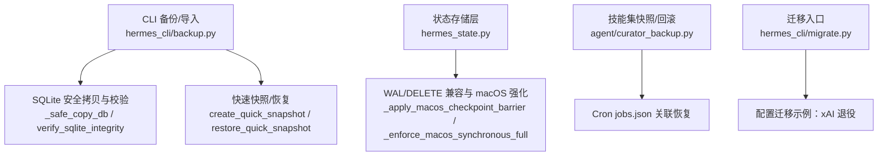
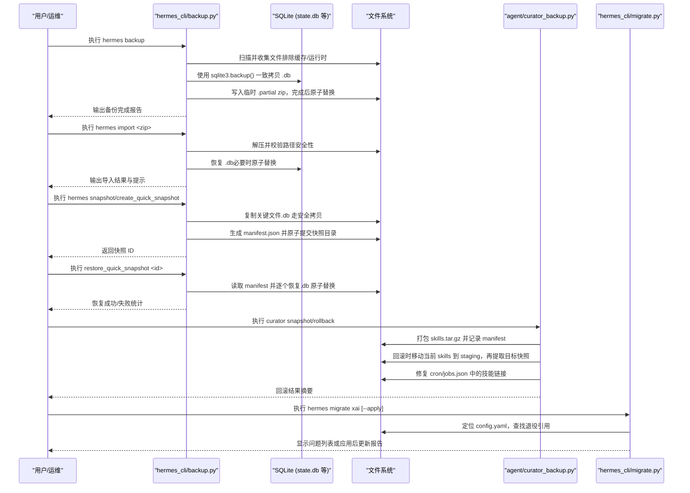
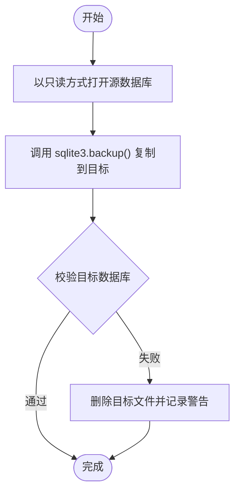
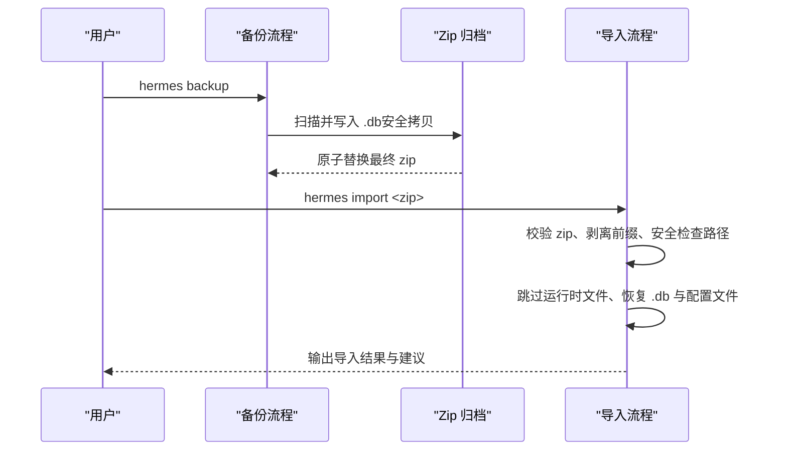
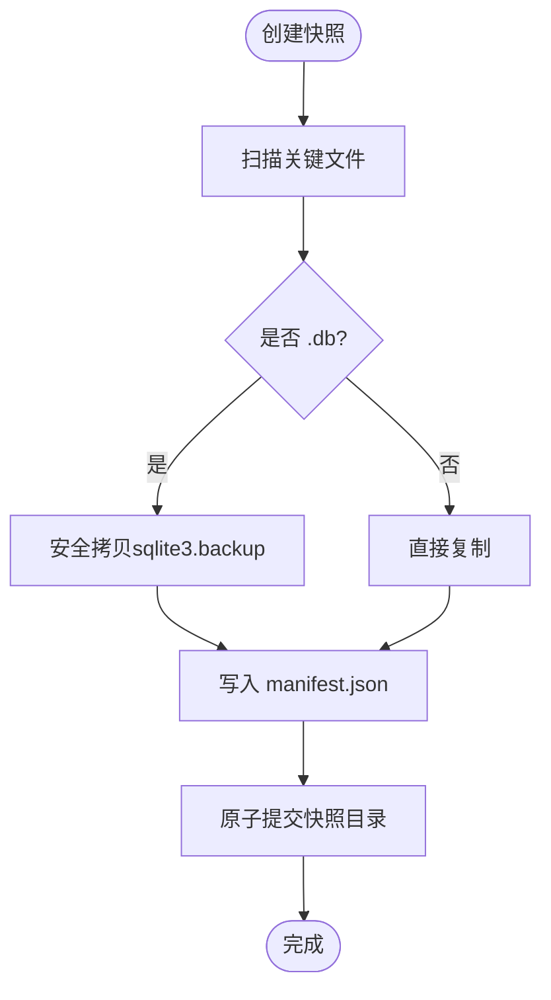
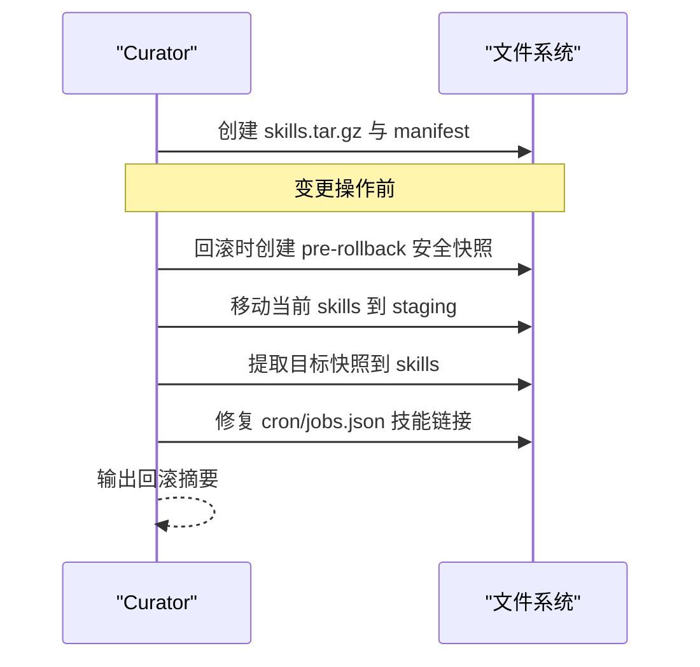
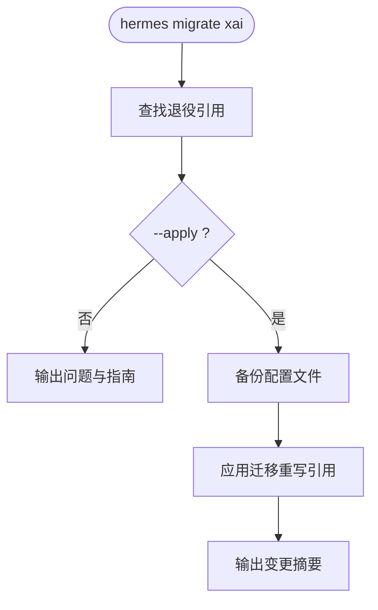
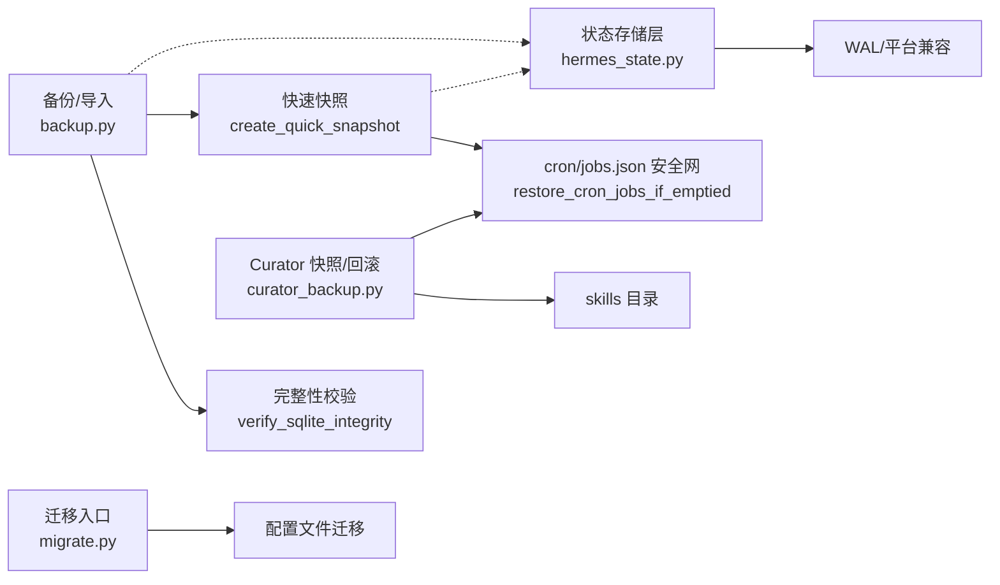

# 备份恢复与迁移

<cite>
**本文引用的文件**
- [hermes_cli/backup.py](file://hermes_cli/backup.py)
- [hermes_cli/migrate.py](file://hermes_cli/migrate.py)
- [agent/curator_backup.py](file://agent/curator_backup.py)
- [hermes_state.py](file://hermes_state.py)
- [hermes_state_common.py](file://hermes_state_common.py)
- [hermes_cli/sqlite_util.py](file://hermes_cli/sqlite_util.py)
</cite>

## 目录
1. [简介](#简介)
2. [项目结构](#项目结构)
3. [核心组件](#核心组件)
4. [架构总览](#架构总览)
5. [详细组件分析](#详细组件分析)
6. [依赖关系分析](#依赖关系分析)
7. [性能考量](#性能考量)
8. [故障排查指南](#故障排查指南)
9. [结论](#结论)
10. [附录](#附录)

## 简介
本文件面向 Hermes Agent 的会话数据存储（SQLite）提供完整的备份、恢复与迁移方案，覆盖热备份、冷备份与增量备份策略；说明灾难恢复、数据损坏修复与历史版本回滚机制；给出数据库迁移框架与 schema 升级实践；并提供跨平台兼容性、大数据库优化与自动化运维脚本建议。文档以仓库中现有实现为依据，结合可落地的最佳实践，帮助开发者与运维人员构建可靠的数据持久化保障体系。

## 项目结构
围绕备份恢复与迁移的关键代码分布在以下模块：
- CLI 层：完整备份/导入、快速快照、校验与恢复
- 状态存储层：WAL 模式、完整性校验、跨平台兼容与 WAL 降级
- 技能集快照与回滚：Curator 对 skills 目录的快照与回滚
- 迁移入口：配置级迁移（如 xAI 模型退役迁移）

**图表来源**
- [hermes_cli/backup.py:342-574](file://hermes_cli/backup.py#L342-L574)
- [hermes_cli/backup.py:1125-1468](file://hermes_cli/backup.py#L1125-L1468)
- [hermes_state.py:718-780](file://hermes_state.py#L718-L780)
- [agent/curator_backup.py:217-291](file://agent/curator_backup.py#L217-L291)
- [hermes_cli/migrate.py:16-108](file://hermes_cli/migrate.py#L16-L108)

**章节来源**
- [hermes_cli/backup.py:342-574](file://hermes_cli/backup.py#L342-L574)
- [hermes_cli/backup.py:1125-1468](file://hermes_cli/backup.py#L1125-L1468)
- [hermes_state.py:718-780](file://hermes_state.py#L718-L780)
- [agent/curator_backup.py:217-291](file://agent/curator_backup.py#L217-L291)
- [hermes_cli/migrate.py:16-108](file://hermes_cli/migrate.py#L16-L108)

## 核心组件
- 全量备份与导入
  - 使用 zip 归档 HERMES_HOME，排除缓存与运行时状态，避免重复与不安全路径
  - SQLite 通过 sqlite3.backup() 进行一致性拷贝，跳过 WAL/SHM/JOURNAL 等瞬态侧文件
  - 导入时跳过易造成跨主机不一致的运行时文件（如 gateway_state.json、进程 PID 等）
- 快速快照与恢复
  - 针对关键状态文件（state.db、cron/jobs.json、配对信息等）创建原子快照
  - 支持按保留数量自动清理旧快照，并在更新前做安全快照
- 完整性校验
  - 头部检查 + PRAGMA integrity_check（大库走轻量结构探测）
  - 检测“零填充”异常签名，辅助诊断
- 技能集快照与回滚
  - 在变更操作前对 skills 目录打 tar.gz 快照，并可选捕获 cron/jobs.json
  - 回滚时先保存当前状态为“安全快照”，再替换为目标快照，并修复 cron 技能链接
- 迁移框架
  - CLI 迁移入口，支持子命令（如 xAI 退役迁移），默认 dry-run，应用时自动备份配置文件

**章节来源**
- [hermes_cli/backup.py:342-574](file://hermes_cli/backup.py#L342-L574)
- [hermes_cli/backup.py:801-1069](file://hermes_cli/backup.py#L801-L1069)
- [hermes_cli/backup.py:1125-1468](file://hermes_cli/backup.py#L1125-L1468)
- [agent/curator_backup.py:217-291](file://agent/curator_backup.py#L217-L291)
- [agent/curator_backup.py:572-730](file://agent/curator_backup.py#L572-L730)
- [hermes_cli/migrate.py:16-108](file://hermes_cli/migrate.py#L16-L108)

## 架构总览
下图展示备份恢复与迁移的整体流程与交互关系。

**图表来源**
- [hermes_cli/backup.py:597-795](file://hermes_cli/backup.py#L597-L795)
- [hermes_cli/backup.py:852-1069](file://hermes_cli/backup.py#L852-L1069)
- [hermes_cli/backup.py:1125-1468](file://hermes_cli/backup.py#L1125-L1468)
- [agent/curator_backup.py:217-291](file://agent/curator_backup.py#L217-L291)
- [agent/curator_backup.py:572-730](file://agent/curator_backup.py#L572-L730)
- [hermes_cli/migrate.py:16-108](file://hermes_cli/migrate.py#L16-L108)

## 详细组件分析

### 组件一：SQLite 安全备份与完整性校验
- 安全拷贝
  - 使用只读连接打开源库，调用 sqlite3.backup() 将数据复制到目标库，确保 WAL 模式下的一致性快照
  - 忽略 .db-wal/.db-shm/.db-journal 等瞬态文件，避免恢复时出现混合状态
- 完整性校验
  - 优先检查文件头 magic 字节
  - 对小库执行 PRAGMA integrity_check；对超大库采用轻量结构探测（schema_version、sqlite_master 计数）以避免长时间 CPU 占用
  - 检测“零填充”异常签名，便于引导式恢复
- 复制并验证
  - 复制成功后立即校验，失败则删除目标文件并告警

**图表来源**
- [hermes_cli/backup.py:342-374](file://hermes_cli/backup.py#L342-L374)
- [hermes_cli/backup.py:416-574](file://hermes_cli/backup.py#L416-L574)

**章节来源**
- [hermes_cli/backup.py:342-374](file://hermes_cli/backup.py#L342-L374)
- [hermes_cli/backup.py:416-574](file://hermes_cli/backup.py#L416-L574)

### 组件二：全量备份与导入
- 备份
  - 锁定备份槽（跨进程互斥），避免并发备份导致竞争
  - 遍历 HERMES_HOME，排除缓存、虚拟环境、git 目录、运行时状态等
  - 对 .db 文件走安全拷贝；外部记忆提供者声明的路径（如 ~/.honcho）以 _external/ 前缀归档
  - 使用原子输出路径（.partial -> 最终 zip）保证产物完整性
- 导入
  - 校验 zip 是否为有效备份（包含 config.yaml/.env/state.db 等标记）
  - 自动识别并剥离常见前缀（如 .hermes/）
  - 跳过易造成跨主机不一致的运行时文件（gateway_state.json、PID 文件等）
  - 对敏感文件设置严格权限（0600）
  - 恢复后尝试重建 profile wrapper 脚本与别名

**图表来源**
- [hermes_cli/backup.py:597-795](file://hermes_cli/backup.py#L597-L795)
- [hermes_cli/backup.py:852-1069](file://hermes_cli/backup.py#L852-L1069)

**章节来源**
- [hermes_cli/backup.py:597-795](file://hermes_cli/backup.py#L597-L795)
- [hermes_cli/backup.py:852-1069](file://hermes_cli/backup.py#L852-L1069)

### 组件三：快速快照与恢复
- 快速快照
  - 仅备份关键状态文件（state.db、cron/jobs.json、配对信息、kanban 等）
  - 对 .db 文件统一走安全拷贝；支持最大文件大小限制，避免大库阻塞更新流程
  - 原子提交快照目录，附带 manifest.json（含文件清单、大小、失败项）
  - 自动清理旧快照（可配置保留数），在不完整时抑制清理以保留可用恢复点
- 恢复
  - 根据 manifest 逐项恢复，.db 采用原子替换（临时文件 -> 目标）
  - 路径安全校验，防止穿越与绝对路径注入

**图表来源**
- [hermes_cli/backup.py:1125-1366](file://hermes_cli/backup.py#L1125-L1366)
- [hermes_cli/backup.py:1395-1468](file://hermes_cli/backup.py#L1395-L1468)

**章节来源**
- [hermes_cli/backup.py:1125-1366](file://hermes_cli/backup.py#L1125-L1366)
- [hermes_cli/backup.py:1395-1468](file://hermes_cli/backup.py#L1395-L1468)

### 组件四：技能集快照与回滚（Curator）
- 快照
  - 在变更前对 skills 目录打包为 tar.gz，并记录 manifest（时间、原因、技能文件数、cron 捕获情况）
  - 可选捕获 cron/jobs.json，以便回滚时修复技能链接
  - 定期清理旧快照，保护正在使用的快照不被误删
- 回滚
  - 先对当前 skills 目录创建“安全快照”（可撤销）
  - 将当前 skills 移动到 staging，再提取目标快照
  - 修复 cron/jobs.json 中与技能相关的字段（仅匹配存在且变化的 job）
  - 失败时尽力恢复 staging 内容，保持可手工恢复能力

**图表来源**
- [agent/curator_backup.py:217-291](file://agent/curator_backup.py#L217-L291)
- [agent/curator_backup.py:572-730](file://agent/curator_backup.py#L572-L730)

**章节来源**
- [agent/curator_backup.py:217-291](file://agent/curator_backup.py#L217-L291)
- [agent/curator_backup.py:572-730](file://agent/curator_backup.py#L572-L730)

### 组件五：迁移框架（配置级）
- 入口
  - hermes_cli/migrate.py 提供子命令分发（当前示例为 xAI 退役迁移）
- 流程
  - 解析配置，查找退役模型引用
  - 默认 dry-run 模式，列出问题与迁移指南
  - 应用模式自动备份配置文件，修改后输出变更摘要

**图表来源**
- [hermes_cli/migrate.py:16-108](file://hermes_cli/migrate.py#L16-L108)

**章节来源**
- [hermes_cli/migrate.py:16-108](file://hermes_cli/migrate.py#L16-L108)

### 组件六：状态存储层（WAL 兼容与 macOS 强化）
- WAL 兼容
  - 在 NFS/SMB/FUSE/ZFS 等网络或特殊文件系统上，若 WAL 不可用则回退到 DELETE 模式，保证功能可用
  - 对已知 WAL-reset 漏洞版本，禁止对新库启用 WAL，避免多进程 WAL 损坏风险
- macOS 强化
  - 启用 checkpoint_fullfsync 与 synchronous=FULL，确保 fsync 屏障生效，降低关机/重启时的 WAL 损坏概率
- 测试隔离
  - 阻止测试进程意外打开生产 state.db，避免污染真实数据

**章节来源**
- [hermes_state.py:486-518](file://hermes_state.py#L486-L518)
- [hermes_state.py:718-780](file://hermes_state.py#L718-L780)
- [hermes_state.py:783-795](file://hermes_state.py#L783-L795)

### 组件七：通用事务与列迁移工具
- IMMEDIATE 写事务
  - 提供上下文管理器，确保同一时刻只有一个写者，异常时回滚并避免掩盖原始错误
- 幂等列添加
  - 处理并发迁移导致的重复列名错误，保证迁移幂等性

**章节来源**
- [hermes_cli/sqlite_util.py:14-50](file://hermes_cli/sqlite_util.py#L14-L50)

## 依赖关系分析
- 备份/导入依赖 SQLite 安全拷贝与完整性校验
- 快速快照依赖关键文件集合与 manifest 管理
- Curator 快照/回滚依赖 skills 目录结构与 cron/jobs.json 的协同
- 迁移入口依赖配置加载与具体迁移逻辑（示例：xAI 退役）
- 状态存储层提供 WAL/平台兼容性保障，影响备份一致性与恢复可靠性

**图表来源**
- [hermes_cli/backup.py:416-574](file://hermes_cli/backup.py#L416-L574)
- [hermes_cli/backup.py:1125-1366](file://hermes_cli/backup.py#L1125-L1366)
- [agent/curator_backup.py:217-291](file://agent/curator_backup.py#L217-L291)
- [hermes_cli/migrate.py:16-108](file://hermes_cli/migrate.py#L16-L108)
- [hermes_state.py:486-518](file://hermes_state.py#L486-L518)

**章节来源**
- [hermes_cli/backup.py:416-574](file://hermes_cli/backup.py#L416-L574)
- [hermes_cli/backup.py:1125-1366](file://hermes_cli/backup.py#L1125-L1366)
- [agent/curator_backup.py:217-291](file://agent/curator_backup.py#L217-L291)
- [hermes_cli/migrate.py:16-108](file://hermes_cli/migrate.py#L16-L108)
- [hermes_state.py:486-518](file://hermes_state.py#L486-L518)

## 性能考量
- 大数据库完整性检查
  - 超过阈值时跳过 PRAGMA integrity_check，改用 O(1) 结构探测，避免长时间 CPU 占用
- 快照大小控制
  - 快速快照支持 max_file_size 限制，跳过过大 .db，避免阻塞更新流程
- WAL 模式与文件系统
  - 在网络或特殊文件系统上回退到 DELETE 模式，保证可用性
- macOS 同步屏障
  - 启用 checkpoint_fullfsync 与 synchronous=FULL，提升关机/重启场景下的数据安全性

[本节为通用指导，不直接分析具体文件]

## 故障排查指南
- 备份失败
  - 检查 .db 是否被锁定或损坏；查看日志中的“SQLite safe copy failed”与“CRITICAL: could not snapshot DB file(s)”
  - 确认 ZIP 产物是否原子写入完成（.partial 是否存在）
- 导入失败
  - 校验 zip 是否为有效备份；检查路径穿越防护是否拦截了非法路径
  - 确认跳过的运行时文件是否合理（gateway_state.json、PID 等）
- 快速快照不完整
  - 关注 manifest 中的 failed_dbs 与 oversized_skipped；必要时调整 max_file_size
- 技能集回滚失败
  - 检查 staging 目录是否残留；查看 pre-rollback 安全快照是否可用
  - 核对 cron/jobs.json 修复报告（restored/skipped_missing/unchanged）
- 迁移失败
  - 确认配置文件路径正确；查看迁移指引与错误输出

**章节来源**
- [hermes_cli/backup.py:1291-1306](file://hermes_cli/backup.py#L1291-L1306)
- [hermes_cli/backup.py:801-825](file://hermes_cli/backup.py#L801-L825)
- [agent/curator_backup.py:572-730](file://agent/curator_backup.py#L572-L730)
- [hermes_cli/migrate.py:72-108](file://hermes_cli/migrate.py#L72-L108)

## 结论
Hermes Agent 的备份恢复与迁移体系以 SQLite 安全拷贝为核心，结合完整性校验、快速快照与技能集快照/回滚，提供了从日常备份到灾难恢复的全链路保障。通过 WAL 兼容与 macOS 强化，系统在跨平台环境下具备更高的稳定性。迁移框架以配置级迁移为切入点，便于后续扩展更多 schema 与数据格式转换。建议在生产环境中结合定时任务与监控告警，形成自动化运维闭环。

[本节为总结，不直接分析具体文件]

## 附录

### 备份策略对照表
- 热备份
  - 使用 sqlite3.backup() 在线拷贝，适用于运行中数据库
  - 参考：[hermes_cli/backup.py:342-374](file://hermes_cli/backup.py#L342-L374)
- 冷备份
  - 停止服务后直接复制 .db 文件（本仓库未强制要求停服，但可通过快照/导入实现离线恢复）
- 增量备份
  - 快速快照按关键文件粒度创建，适合高频、小范围恢复
  - 参考：[hermes_cli/backup.py:1125-1366](file://hermes_cli/backup.py#L1125-L1366)

### 恢复机制要点
- 灾难恢复
  - 使用全量 zip 导入或快速快照恢复关键文件
  - 参考：[hermes_cli/backup.py:852-1069](file://hermes_cli/backup.py#L852-L1069)、[hermes_cli/backup.py:1395-1468](file://hermes_cli/backup.py#L1395-L1468)
- 数据损坏修复
  - 通过完整性校验定位问题；必要时回滚到最近的健康快照
  - 参考：[hermes_cli/backup.py:416-574](file://hermes_cli/backup.py#L416-L574)
- 历史版本回滚
  - 技能集回滚提供安全的“安全快照 + 替换”流程
  - 参考：[agent/curator_backup.py:572-730](file://agent/curator_backup.py#L572-L730)

### 迁移框架实践
- Schema 版本升级
  - 使用幂等列添加与 IMMEDIATE 事务，确保迁移安全与可重入
  - 参考：[hermes_cli/sqlite_util.py:14-50](file://hermes_cli/sqlite_util.py#L14-L50)
- 数据格式转换
  - 通过迁移入口（如 xAI 退役）演示配置级迁移流程，可扩展至其他格式转换
  - 参考：[hermes_cli/migrate.py:16-108](file://hermes_cli/migrate.py#L16-L108)

### 跨平台与大数据库优化
- 跨平台
  - WAL 兼容与 macOS 同步屏障，确保不同文件系统与平台行为一致
  - 参考：[hermes_state.py:486-518](file://hermes_state.py#L486-L518)、[hermes_state.py:718-780](file://hermes_state.py#L718-L780)
- 大数据库
  - 完整性检查阈值与快速快照大小限制，避免长时间阻塞
  - 参考：[hermes_cli/backup.py:416-574](file://hermes_cli/backup.py#L416-L574)、[hermes_cli/backup.py:1125-1366](file://hermes_cli/backup.py#L1125-L1366)

### 自动化运维脚本建议
- 定时备份
  - 每日全量备份 + 每小时快速快照，保留 N 份
- 更新前快照
  - 在执行 hermes update 前调用 create_quick_snapshot，并在更新后检查 cron/jobs.json 是否丢失
- 健康检查
  - 定期运行 verify_sqlite_integrity，发现异常及时告警

[本节为通用指导，不直接分析具体文件]