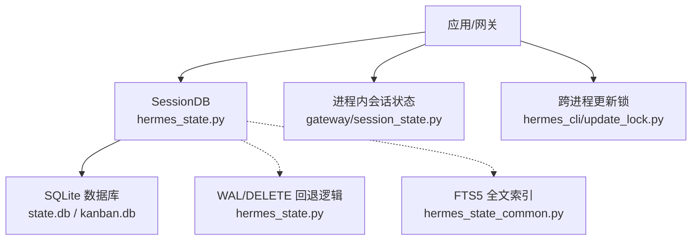
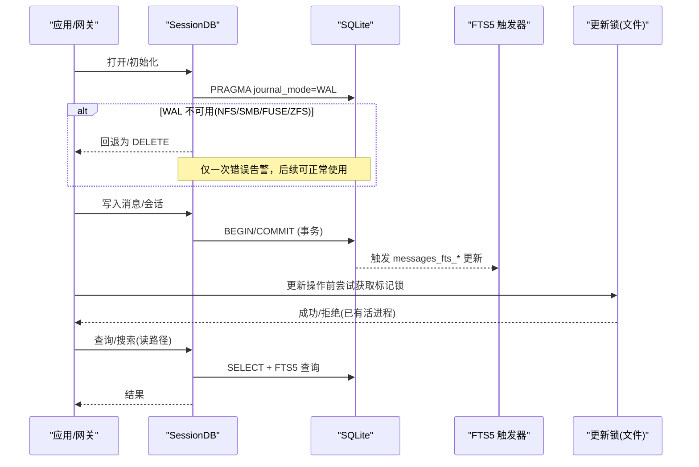
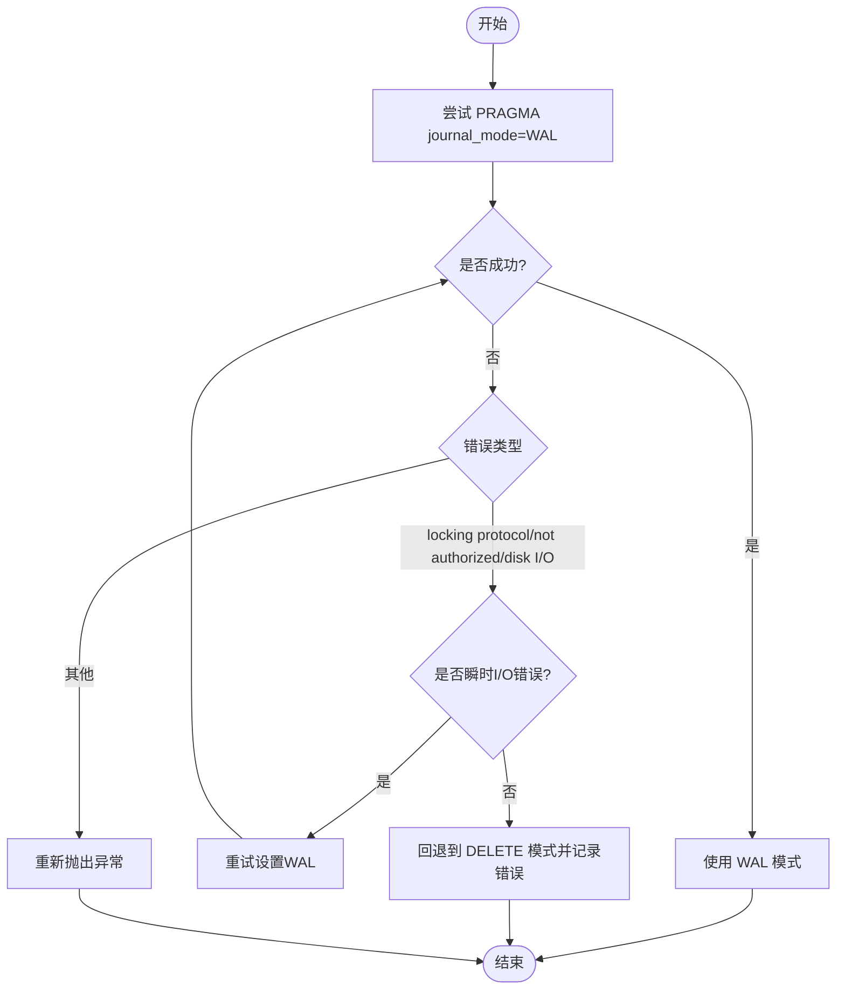
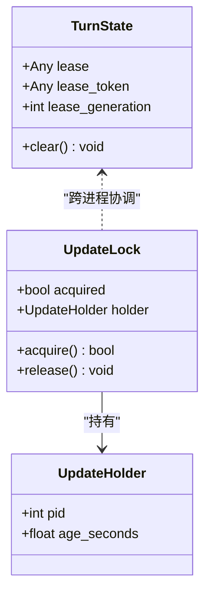
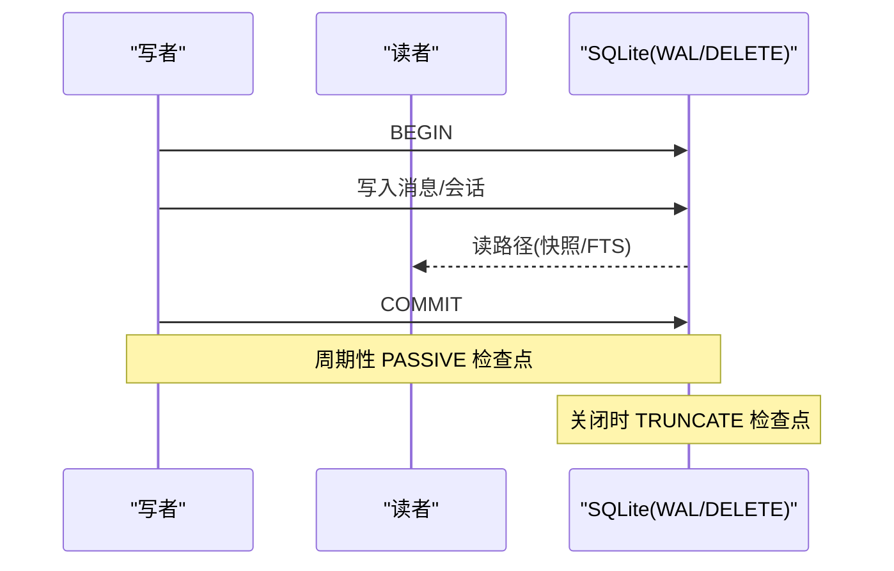
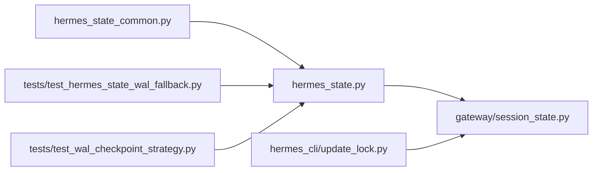

# 并发访问控制

<cite>
**本文引用的文件**
- [hermes_state.py](file://hermes_state.py)
- [hermes_state_common.py](file://hermes_state_common.py)
- [gateway/session_state.py](file://gateway/session_state.py)
- [hermes_cli/update_lock.py](file://hermes_cli/update_lock.py)
- [tests/test_hermes_state_wal_fallback.py](file://tests/test_hermes_state_wal_fallback.py)
- [tests/test_wal_checkpoint_strategy.py](file://tests/test_wal_checkpoint_strategy.py)
</cite>

## 目录
1. [简介](#简介)
2. [项目结构](#项目结构)
3. [核心组件](#核心组件)
4. [架构总览](#架构总览)
5. [详细组件分析](#详细组件分析)
6. [依赖关系分析](#依赖关系分析)
7. [性能考量](#性能考量)
8. [故障排除指南](#故障排除指南)
9. [结论](#结论)
10. [附录](#附录)

## 简介
本文件聚焦 Hermes Agent 会话数据存储的并发访问控制，围绕 SQLite WAL（预写日志）模式、多进程锁管理、读写分离策略、事务隔离与死锁预防、连接池与资源清理，以及 NFS/SMB 网络文件系统上的降级方案进行系统化说明。目标是帮助开发者在高并发场景下安全地进行会话状态存储与检索，并具备问题定位与优化能力。

## 项目结构
Hermes 的状态持久化以 SQLite 为核心，通过 hermes_state 模块提供 SessionDB 抽象；网关层在 gateway/session_state.py 中维护进程内会话级状态与租约；跨进程更新互斥由 hermes_cli/update_lock.py 实现；WAL 兼容性与检查点策略由 hermes_state 及其测试覆盖。

图表来源
- [hermes_state.py:1-120](file://hermes_state.py#L1-L120)
- [hermes_state_common.py:197-373](file://hermes_state_common.py#L197-L373)
- [gateway/session_state.py:51-178](file://gateway/session_state.py#L51-L178)
- [hermes_cli/update_lock.py:220-290](file://hermes_cli/update_lock.py#L220-L290)

章节来源
- [hermes_state.py:1-120](file://hermes_state.py#L1-L120)
- [hermes_state_common.py:197-373](file://hermes_state_common.py#L197-L373)
- [gateway/session_state.py:51-178](file://gateway/session_state.py#L51-L178)
- [hermes_cli/update_lock.py:220-290](file://hermes_cli/update_lock.py#L220-L290)

## 核心组件
- 会话数据库 SessionDB：封装 SQLite 连接、WAL 启用与回退、压缩/分支子会话处理、FTS5 索引、错误记录与用户提示。
- 进程内会话状态：TurnState/ConversationState/PersistentState 三层次数据类，统一生命周期管理与清理。
- 跨进程更新锁：基于标记文件的原子获取与过期回收，支持父子进程协作避免自死锁。
- WAL 兼容与检查点：自动探测 WAL 可用性，NFS/SMB/FUSE/ZFS 等环境回退到 DELETE；周期性 PASSIVE 检查点，关闭时 TRUNCATE。

章节来源
- [hermes_state.py:1-120](file://hermes_state.py#L1-L120)
- [gateway/session_state.py:51-178](file://gateway/session_state.py#L51-L178)
- [hermes_cli/update_lock.py:220-290](file://hermes_cli/update_lock.py#L220-L290)
- [tests/test_wal_checkpoint_strategy.py:28-139](file://tests/test_wal_checkpoint_strategy.py#L28-L139)

## 架构总览
下图展示从请求到落盘的完整路径，包括 WAL 启用/回退、FTS 触发器、进程内状态与跨进程锁的交互。

图表来源
- [hermes_state.py:485-538](file://hermes_state.py#L485-L538)
- [hermes_state_common.py:415-534](file://hermes_state_common.py#L415-L534)
- [hermes_cli/update_lock.py:220-290](file://hermes_cli/update_lock.py#L220-L290)

## 详细组件分析

### WAL 模式与回退机制
- 设计目标：默认启用 WAL 以获得“多读一写”的高并发读取能力；在网络文件系统或特殊存储上不可用时，自动回退到 DELETE 模式以保证功能可用。
- 关键行为：
  - 尝试设置 journal_mode=WAL；若抛出锁定协议错误或静默拒绝（返回 delete），则记录一次错误并回退。
  - 对已处于 WAL 的文件，不主动降级，避免与其他进程产生不一致的日志模式。
  - 对磁盘 I/O 错误进行重试后再决定是否降级，避免误判瞬时抖动。
  - macOS 平台额外开启 checkpoint_fullfsync 与 synchronous=FULL，增强关机/重启时的数据一致性。
- 配置要点：
  - 默认 require_wal=False，保证 NFS/SMB 环境可用。
  - 需要强并发读的场景可通过 require_wal=True 强制失败，便于上层决策。

图表来源
- [tests/test_hermes_state_wal_fallback.py:107-227](file://tests/test_hermes_state_wal_fallback.py#L107-L227)
- [hermes_state.py:485-538](file://hermes_state.py#L485-L538)

章节来源
- [tests/test_hermes_state_wal_fallback.py:107-227](file://tests/test_hermes_state_wal_fallback.py#L107-L227)
- [hermes_state.py:485-538](file://hermes_state.py#L485-L538)

### 多进程锁管理（文件级锁、内存锁、进程间通信）
- 文件级锁（更新锁）：
  - 通过 HERMES_HOME 下的标记文件协调多个更新入口（CLI、Dashboard、桌面安装器）。
  - 持有者包含 PID 与启动时间；超过最大年龄或进程死亡即视为过期，自动清理。
  - 支持父子进程协作：若当前进程是持有者的祖先或收到 handoff pid，则视为同一流程，避免自阻塞。
- 内存锁（进程内）：
  - 网关进程内通过 TurnState.lease_token/lease_generation 管理单会话的轮次租约，防止重复执行。
  - 配合 SessionFieldView/TurnLeaseTokenView 提供向后兼容的字典视图，简化测试与旧代码迁移。
- 进程间通信：
  - 通过环境变量传递父进程 PID（HANDOFF_PID_ENV），结合 psutil 祖先链检测，确保分布式更新流程的一致性。

图表来源
- [hermes_cli/update_lock.py:163-290](file://hermes_cli/update_lock.py#L163-L290)
- [gateway/session_state.py:51-178](file://gateway/session_state.py#L51-L178)

章节来源
- [hermes_cli/update_lock.py:163-290](file://hermes_cli/update_lock.py#L163-L290)
- [gateway/session_state.py:51-178](file://gateway/session_state.py#L51-L178)

### 读写分离策略与事务隔离级别
- 读写分离：
  - 默认 WAL 模式下，SQLite 允许多个读者同时读取，而只有一个写者提交变更；当 WAL 不可用时回退到 DELETE，并发读受限但功能可用。
  - 通过 FTS5 触发器将内容变更同步到全文索引，读路径可使用 FTS5 加速文本检索。
- 事务隔离：
  - 使用 SQLite 默认隔离级别（READ COMMITTED），通过 BEGIN/COMMIT 包裹写操作，保证一致性。
  - 对于大规模写入，采用周期性 PASSIVE 检查点减少 WAL 增长，关闭时使用 TRUNCATE 释放空间。

图表来源
- [tests/test_wal_checkpoint_strategy.py:28-139](file://tests/test_wal_checkpoint_strategy.py#L28-L139)
- [hermes_state_common.py:415-534](file://hermes_state_common.py#L415-L534)

章节来源
- [tests/test_wal_checkpoint_strategy.py:28-139](file://tests/test_wal_checkpoint_strategy.py#L28-L139)
- [hermes_state_common.py:415-534](file://hermes_state_common.py#L415-L534)

### 死锁预防机制
- 避免多进程同时更新同一安装树：通过更新锁文件确保单一更新持有者，超时/死亡后自动回收。
- 避免自死锁：父子进程协作识别，允许子进程复用父进程的锁持有。
- 避免 WAL/DELETE 混用：对已 WAL 的文件不降级，防止不同进程采用不同日志模式导致损坏。
- 进程内租约：每会话仅一个活跃租约，按 generation 匹配释放，防止陈旧释放导致的竞态。

章节来源
- [hermes_cli/update_lock.py:220-290](file://hermes_cli/update_lock.py#L220-L290)
- [tests/test_hermes_state_wal_fallback.py:229-316](file://tests/test_hermes_state_wal_fallback.py#L229-L316)
- [gateway/session_state.py:299-367](file://gateway/session_state.py#L299-L367)

### 连接池管理与资源清理策略
- 连接管理：
  - SessionDB 负责连接生命周期，提供 close() 方法；关闭时执行 TRUNCATE 检查点以收缩 WAL。
  - 对 WAL 检查点失败采用 best-effort 日志，不影响主流程。
- 资源清理：
  - 更新锁在 release() 中校验当前进程仍为持有者才删除标记文件，避免误删他人锁。
  - 进程内 TurnState.clear() 在每轮结束时重置 agent、started_ts、lease、busy_ack_ts，防止状态泄漏。

章节来源
- [tests/test_wal_checkpoint_strategy.py:76-110](file://tests/test_wal_checkpoint_strategy.py#L76-L110)
- [hermes_cli/update_lock.py:265-290](file://hermes_cli/update_lock.py#L265-L290)
- [gateway/session_state.py:77-88](file://gateway/session_state.py#L77-L88)

### NFS/SMB 网络文件系统特殊处理与降级方案
- 现象：WAL 依赖共享内存与字节范围锁，NFS/SMB/FUSE/Wsl1 等网络文件系统可能不支持或表现不稳定。
- 处理：
  - 捕获 locking protocol、not authorized、disk I/O error 等错误，回退到 DELETE 模式。
  - 对静默拒绝（返回 delete 但不抛错）也进行检测与告警，避免误报 WAL 可用。
  - 对 ZFS 等 CoW 文件系统，避免并发连接导致的 SHM 损坏；必要时回退。
- 用户提示：
  - 当 state.db 不可用时，提供明确原因与 NFS/SMB 相关文档链接，指导用户调整部署。

章节来源
- [hermes_state.py:485-538](file://hermes_state.py#L485-L538)
- [tests/test_hermes_state_wal_fallback.py:117-169](file://tests/test_hermes_state_wal_fallback.py#L117-L169)

### 高并发场景下的最佳实践
- 优先使用 WAL 模式以获得高并发读；在 NFS/SMB 环境下接受回退到 DELETE，并评估业务影响。
- 批量写入时利用事务边界，减少频繁提交带来的开销。
- 合理设置检查点频率，避免 WAL 无限增长；关闭时执行 TRUNCATE 检查点释放空间。
- 使用更新锁保护安装树变更，避免并发更新导致源文件损坏。
- 监控 last_init_error 与日志中的 WAL 回退告警，及时发现问题。

[本节为通用指导，无需具体文件引用]

### 安全并发读写示例（代码片段路径）
- WAL 启用与回退调用位置：
  - [apply_wal_with_fallback 测试用例:107-227](file://tests/test_hermes_state_wal_fallback.py#L107-L227)
- 检查点策略（PASSIVE/TRUNCATE）：
  - [检查点策略测试:28-139](file://tests/test_wal_checkpoint_strategy.py#L28-L139)
- 进程内会话状态清理：
  - [TurnState.clear:77-88](file://gateway/session_state.py#L77-L88)
- 跨进程更新锁获取与释放：
  - [UpdateLock.acquire/release:235-290](file://hermes_cli/update_lock.py#L235-L290)

章节来源
- [tests/test_hermes_state_wal_fallback.py:107-227](file://tests/test_hermes_state_wal_fallback.py#L107-L227)
- [tests/test_wal_checkpoint_strategy.py:28-139](file://tests/test_wal_checkpoint_strategy.py#L28-L139)
- [gateway/session_state.py:77-88](file://gateway/session_state.py#L77-L88)
- [hermes_cli/update_lock.py:235-290](file://hermes_cli/update_lock.py#L235-L290)

## 依赖关系分析
- hermes_state 依赖 hermes_state_common 提供的 FTS5 与索引定义。
- gateway/session_state 提供进程内会话状态，与 SessionDB 协同完成状态读写。
- hermes_cli/update_lock 独立于数据库，通过文件系统协调更新流程。
- 测试文件验证 WAL 回退与检查点策略的正确性。

图表来源
- [hermes_state_common.py:197-373](file://hermes_state_common.py#L197-L373)
- [hermes_state.py:1-120](file://hermes_state.py#L1-L120)
- [gateway/session_state.py:51-178](file://gateway/session_state.py#L51-L178)
- [hermes_cli/update_lock.py:220-290](file://hermes_cli/update_lock.py#L220-L290)
- [tests/test_hermes_state_wal_fallback.py:107-227](file://tests/test_hermes_state_wal_fallback.py#L107-L227)
- [tests/test_wal_checkpoint_strategy.py:28-139](file://tests/test_wal_checkpoint_strategy.py#L28-L139)

章节来源
- [hermes_state_common.py:197-373](file://hermes_state_common.py#L197-L373)
- [hermes_state.py:1-120](file://hermes_state.py#L1-L120)
- [gateway/session_state.py:51-178](file://gateway/session_state.py#L51-L178)
- [hermes_cli/update_lock.py:220-290](file://hermes_cli/update_lock.py#L220-L290)
- [tests/test_hermes_state_wal_fallback.py:107-227](file://tests/test_hermes_state_wal_fallback.py#L107-L227)
- [tests/test_wal_checkpoint_strategy.py:28-139](file://tests/test_wal_checkpoint_strategy.py#L28-L139)

## 性能考量
- WAL 模式提升读并发，但需关注检查点频率以避免 WAL 膨胀。
- NFS/SMB 回退到 DELETE 会降低读并发，建议将 state.db 置于本地盘以提升性能。
- FTS5 索引带来额外写入开销，可按需优化（如外部内容布局、trigram 索引）。
- 关闭时 TRUNCATE 检查点有助于快速释放空间，适合批处理任务结束后执行。

[本节为通用指导，无需具体文件引用]

## 故障排除指南
- 症状：/resume、/title、/history、/branch 等功能不可用。
  - 检查 last_init_error 是否记录了 WAL 不可用原因。
  - 查看日志中是否有 WAL 回退告警。
- 症状：state.db 损坏或 WAL 不一致。
  - 确认未在不同进程间混用 WAL 与 DELETE 模式。
  - 检查是否存在 ZFS/APFS-CoW 导致的 SHM 损坏，必要时回退。
- 症状：更新卡住或“Hermes is still running”。
  - 检查更新锁文件是否过期或被僵尸进程持有，系统应自动清理。
  - 确认父子进程协作是否正确（handoff pid 或祖先链检测）。

章节来源
- [hermes_state.py:520-565](file://hermes_state.py#L520-L565)
- [tests/test_hermes_state_wal_fallback.py:428-486](file://tests/test_hermes_state_wal_fallback.py#L428-L486)
- [hermes_cli/update_lock.py:171-203](file://hermes_cli/update_lock.py#L171-L203)

## 结论
Hermes 通过 WAL 模式与智能回退机制，在保证数据一致性的前提下最大化并发读性能；结合进程内会话状态与跨进程更新锁，实现了稳健的多进程并发控制。针对 NFS/SMB 等特殊文件系统提供了降级方案与用户友好提示。遵循本文的最佳实践与故障排除指南，可在高并发场景中稳定运行并快速定位问题。

[本节为总结，无需具体文件引用]

## 附录
- 术语表：
  - WAL：Write-Ahead Logging，预写日志模式。
  - FTS5：Full-Text Search v5，SQLite 全文搜索扩展。
  - 检查点：将 WAL 中的数据合并到主数据库文件，减少 WAL 体积。
- 参考文档：
  - SQLite WAL 文档与已知问题（含 WAL-reset bug）。
  - NFS/SMB 文件系统对 WAL 的限制说明。

[本节为补充信息，无需具体文件引用]