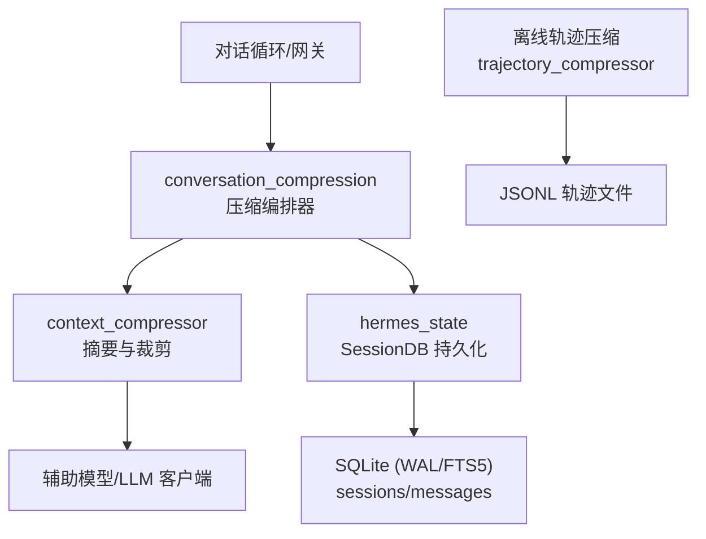
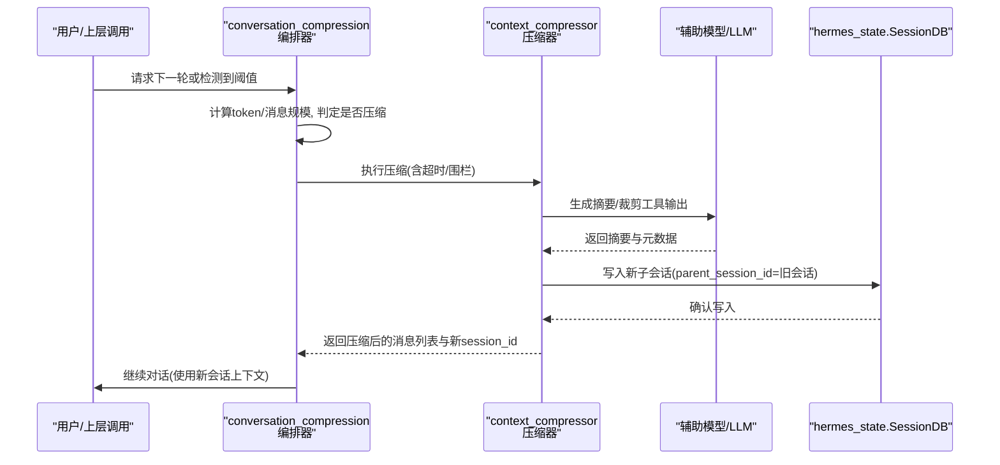
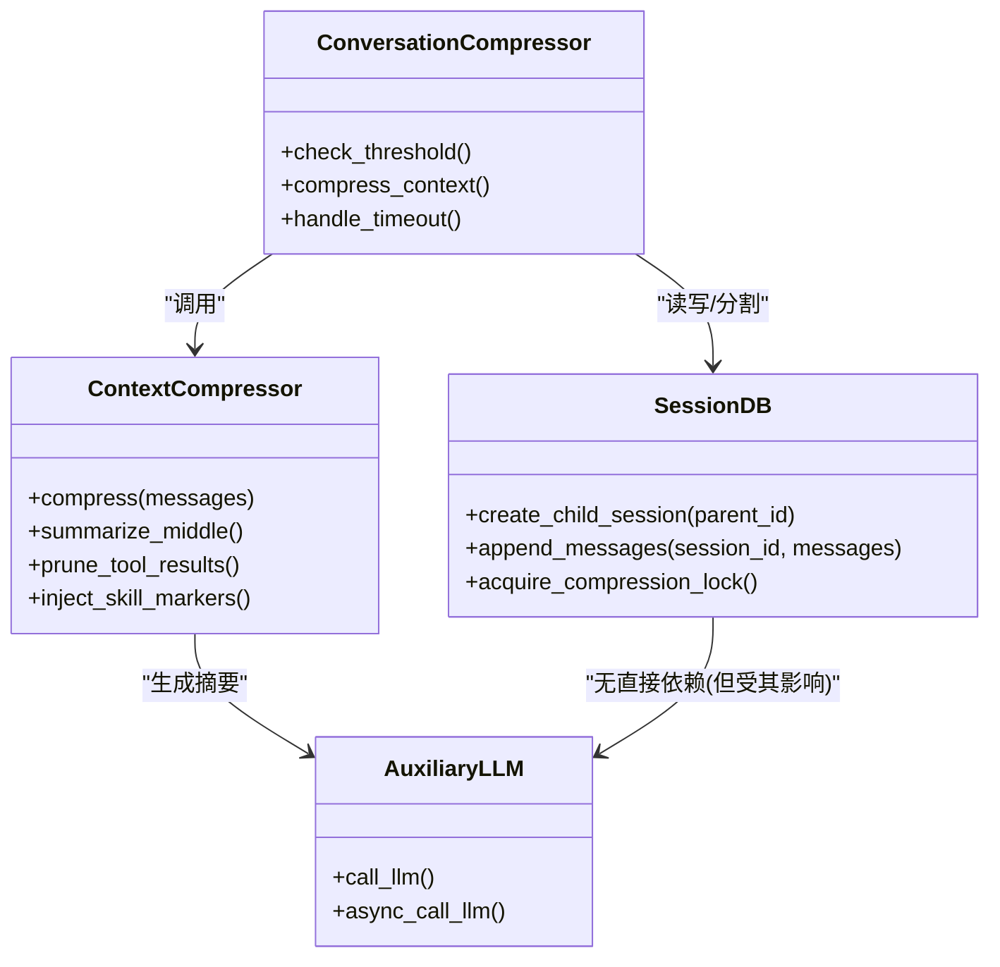
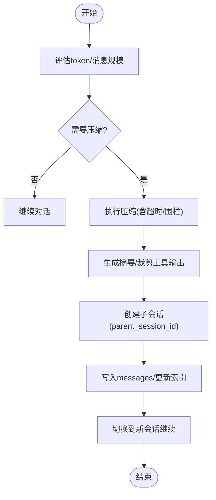

# 数据压缩与存储优化

<cite>
**本文引用的文件**
- [conversation_compression.py](file://agent/conversation_compression.py)
- [context_compressor.py](file://agent/context_compressor.py)
- [hermes_state.py](file://hermes_state.py)
- [trajectory_compressor.py](file://trajectory_compressor.py)
</cite>

## 目录
1. [简介](#简介)
2. [项目结构](#项目结构)
3. [核心组件](#核心组件)
4. [架构总览](#架构总览)
5. [详细组件分析](#详细组件分析)
6. [依赖关系分析](#依赖关系分析)
7. [性能考量](#性能考量)
8. [故障排查指南](#故障排查指南)
9. [结论](#结论)
10. [附录](#附录)

## 简介
本文件面向 Hermes Agent 的会话数据存储与压缩优化，系统性说明：
- 会话消息的压缩算法、触发条件与压缩率优化策略
- 文本与二进制数据的编码/处理要点，以及元数据优化
- 基于 parent_session_id 链的会话分割机制（历史归档）
- 存储配额管理、自动清理策略与性能监控指标
- 实现高效压缩/解压缩的代码级参考路径与数据完整性保证

目标是帮助开发者在长会话场景下稳定地控制上下文大小、降低模型调用成本并保障可恢复性。

## 项目结构
围绕“压缩与存储”的关键模块分布如下：
- agent/conversation_compression.py：编排压缩流程、超时与提交围栏、状态回滚、阈值与冷却等
- agent/context_compressor.py：具体压缩实现（摘要生成、工具输出裁剪、技能指令保留、元数据标记等）
- hermes_state.py：SQLite 会话持久化、WAL/兼容性、parent_session_id 链、压缩锁与并发安全
- trajectory_compressor.py：离线轨迹压缩（训练/回放用），保护首尾、中间区域摘要替换

图表来源
- [conversation_compression.py:1-120](file://agent/conversation_compression.py#L1-L120)
- [context_compressor.py:1-180](file://agent/context_compressor.py#L1-L180)
- [hermes_state.py:1-16](file://hermes_state.py#L1-L16)
- [trajectory_compressor.py:1-31](file://trajectory_compressor.py#L1-L31)

章节来源
- [conversation_compression.py:1-120](file://agent/conversation_compression.py#L1-L120)
- [context_compressor.py:1-180](file://agent/context_compressor.py#L1-L180)
- [hermes_state.py:1-16](file://hermes_state.py#L1-L16)
- [trajectory_compressor.py:1-31](file://trajectory_compressor.py#L1-L31)

## 核心组件
- 压缩编排器（conversation_compression.py）
  - 负责压缩触发判断、进度感知超时、提交围栏（CompressionCommitFence）、失败冷却与重试、状态快照/回滚、与上下文引擎/记忆提供者的协调
- 压缩执行器（context_compressor.py）
  - 负责消息分块、工具结果裁剪、技能指令保留、摘要生成、元数据标记（如压缩摘要标记）、合并尾部消息、去重与边界处理
- 会话存储（hermes_state.py）
  - SQLite 持久化、WAL 模式与兼容回退、parent_session_id 链式分割、压缩锁（避免并发冲突）、FTS5 全文检索
- 离线轨迹压缩（trajectory_compressor.py）
  - 对已完成轨迹进行批处理压缩，保护首尾、仅压缩中间区域，并以单条人类摘要替代被压缩区域

章节来源
- [conversation_compression.py:1-120](file://agent/conversation_compression.py#L1-L120)
- [context_compressor.py:1-180](file://agent/context_compressor.py#L1-L180)
- [hermes_state.py:1-16](file://hermes_state.py#L1-L16)
- [trajectory_compressor.py:1-31](file://trajectory_compressor.py#L1-L31)

## 架构总览
下图展示一次在线压缩从触发到落库的端到端流程，包括父会话链的创建与切换。

图表来源
- [conversation_compression.py:445-690](file://agent/conversation_compression.py#L445-L690)
- [context_compressor.py:100-180](file://agent/context_compressor.py#L100-L180)
- [hermes_state.py:1-16](file://hermes_state.py#L1-L16)

## 详细组件分析

### 压缩触发条件与节流
- 触发信号
  - 预API压缩：接近上下文/输出限制时主动压缩
  - 预检查压缩：达到配置的阈值（按模型上下文窗口自适应下调）
  - 空闲后恢复：长时间空闲后再次进入对话，先压缩再继续
  - 重试压缩：上下文过大或消息过多时的重试路径
- 节流与防抖
  - 失败冷却：摘要失败后进入冷却期，避免频繁重试
  - 反抖动：连续无效压缩计数与恢复期限，防止反复无意义压缩
  - 执行器饱和：共享线程池有最大并发数，超限时快速失败，不阻塞主流程

章节来源
- [conversation_compression.py:125-180](file://agent/conversation_compression.py#L125-L180)
- [conversation_compression.py:776-800](file://agent/conversation_compression.py#L776-L800)
- [context_compressor.py:713-750](file://agent/context_compressor.py#L713-L750)

### 压缩算法与数据格式
- 文本压缩
  - 通过辅助模型对中间对话段生成结构化摘要，保留头部与尾部关键信息
  - 对工具输出进行裁剪与占位替换，减少冗余
  - 对技能指令进行“幽灵技能”防护，必要时注入提示以重新加载
- 二进制数据编码
  - 图片过大时尝试重新编码为更小尺寸，以满足提供商上限
- 元数据优化
  - 压缩摘要消息携带专用元数据键，便于前端识别与过滤
  - 微压缩标记用于滚动压缩，区分批量压缩标记，避免误删
  - 持久化标记在组装阶段剥离，确保新会话写入正确

章节来源
- [context_compressor.py:100-180](file://agent/context_compressor.py#L100-L180)
- [context_compressor.py:230-267](file://agent/context_compressor.py#L230-L267)
- [context_compressor.py:417-453](file://agent/context_compressor.py#L417-L453)

### 会话分割与 parent_session_id 链
- 分割时机
  - 当压缩完成且需要旋转会话时，创建新的子会话行，并将旧会话ID作为 parent_session_id 记录在新行中
- 链式历史
  - 通过 parent_session_id 形成历史链，支持回溯与导出；查询时可沿链聚合
- 并发与锁
  - 压缩过程持有分布式/进程内锁，避免多进程同时压缩同一会话导致竞争
  - 锁持有者包含PID信息，异常退出后可由TTL或存活检测回收

章节来源
- [hermes_state.py:1-16](file://hermes_state.py#L1-L16)
- [hermes_state.py:160-213](file://hermes_state.py#L160-L213)

### 提交围栏与数据完整性
- 提交围栏（CompressionCommitFence）
  - 将“取消”和“提交”边界严格分离，确保要么在提交前成功取消，要么等待已开始的提交完成
  - 支持“拒绝未来提交”的无锁撤销，避免悬挂任务污染状态
  - 进度感知：记录最近进展时间，区分慢速模型与卡死
- 数据完整性
  - 摘要前后均进行敏感信息脱敏，避免凭证泄露
  - 剥离持久化标记，避免重复写入或跳过写入
  - 失败冷却与回滚：在提交前失败可恢复到压缩前的状态

章节来源
- [conversation_compression.py:445-690](file://agent/conversation_compression.py#L445-L690)
- [context_compressor.py:764-783](file://agent/context_compressor.py#L764-L783)

### 离线轨迹压缩（训练/回放）
- 策略
  - 保护系统/首轮人类/首轮助手/首轮工具与最后N轮
  - 仅压缩中间区域，用单条人类摘要替代被压缩部分
  - 统计指标：原始/压缩token、节省量、压缩比、摘要调用次数与错误率
- 适用场景
  - 批量处理历史轨迹，控制训练样本大小，保持关键信号

章节来源
- [trajectory_compressor.py:1-31](file://trajectory_compressor.py#L1-L31)
- [trajectory_compressor.py:82-124](file://trajectory_compressor.py#L82-L124)
- [trajectory_compressor.py:182-329](file://trajectory_compressor.py#L182-L329)

## 依赖关系分析

图表来源
- [conversation_compression.py:445-690](file://agent/conversation_compression.py#L445-L690)
- [context_compressor.py:100-180](file://agent/context_compressor.py#L100-L180)
- [hermes_state.py:1-16](file://hermes_state.py#L1-L16)

章节来源
- [conversation_compression.py:445-690](file://agent/conversation_compression.py#L445-L690)
- [context_compressor.py:100-180](file://agent/context_compressor.py#L100-L180)
- [hermes_state.py:1-16](file://hermes_state.py#L1-L16)

## 性能考量
- 压缩率优化
  - 根据模型上下文窗口动态下调阈值，避免小窗口模型频繁压缩
  - 对工具输出进行裁剪与占位，减少无用信息
  - 摘要预算按比例分配，设置绝对上限，避免摘要本身成为压力源
- 存储与I/O
  - WAL 模式提升并发读性能；在不兼容文件系统上自动回退到 DELETE 模式
  - 批量写入与FTS5索引维护，避免频繁重建
- 并发与资源
  - 共享线程池限制最大并发，避免队列无限增长
  - 提交围栏与锁释放钩子，防止悬挂任务占用资源
- 监控指标建议
  - 压缩触发次数、成功率、平均耗时、摘要失败冷却时长
  - 压缩前后token/消息数量、压缩比
  - 子会话数量与父链长度、存储占用趋势
  - 执行器饱和次数、超时次数、提交围栏拒绝次数

[本节为通用指导，不直接分析具体文件]

## 故障排查指南
- 常见问题
  - 压缩超时：检查进度感知超时配置与模型响应速度；关注提交围栏是否拒绝未来提交
  - 摘要失败：查看失败冷却与重试次数；检查认证/配额错误分类
  - 存储不可用：检查WAL兼容性与文件系统；读取初始化错误信息
  - 锁争用：确认是否有僵尸锁；检查PID存活检测与TTL
- 定位方法
  - 观察压缩状态模板与日志标记（例如“正在压缩上下文”）
  - 检查会话链（parent_session_id）是否按预期创建
  - 校验元数据标记是否正确写入/剥离

章节来源
- [conversation_compression.py:125-180](file://agent/conversation_compression.py#L125-L180)
- [context_compressor.py:73-95](file://agent/context_compressor.py#L73-L95)
- [hermes_state.py:485-538](file://hermes_state.py#L485-L538)

## 结论
Hermes Agent 的压缩与存储体系通过“编排+执行+持久化”的分层设计，实现了：
- 高可靠的压缩流程（超时、围栏、冷却、回滚）
- 精细的数据处理（文本/二进制/元数据）
- 稳健的会话分割（parent_session_id 链）
- 可扩展的性能与监控能力

建议在生产环境中结合业务负载调优阈值、冷却与并发参数，并持续跟踪压缩比与存储占用，以获得最佳性价比。

[本节为总结，不直接分析具体文件]

## 附录

### 代码示例路径（实现高效压缩/解压缩）
- 在线压缩入口与编排
  - [conversation_compression.py:445-690](file://agent/conversation_compression.py#L445-L690)
  - [conversation_compression.py:776-800](file://agent/conversation_compression.py#L776-L800)
- 压缩执行与摘要生成
  - [context_compressor.py:100-180](file://agent/context_compressor.py#L100-L180)
  - [context_compressor.py:764-783](file://agent/context_compressor.py#L764-L783)
- 会话分割与持久化
  - [hermes_state.py:1-16](file://hermes_state.py#L1-L16)
  - [hermes_state.py:160-213](file://hermes_state.py#L160-L213)
- 离线轨迹压缩
  - [trajectory_compressor.py:743-800](file://trajectory_compressor.py#L743-L800)
  - [trajectory_compressor.py:182-329](file://trajectory_compressor.py#L182-L329)

### 压缩流程图（在线）

图表来源
- [conversation_compression.py:445-690](file://agent/conversation_compression.py#L445-L690)
- [context_compressor.py:100-180](file://agent/context_compressor.py#L100-L180)
- [hermes_state.py:1-16](file://hermes_state.py#L1-L16)