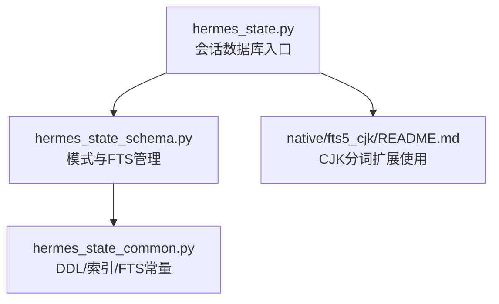
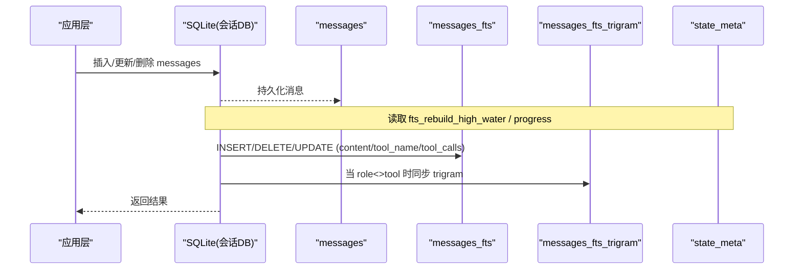
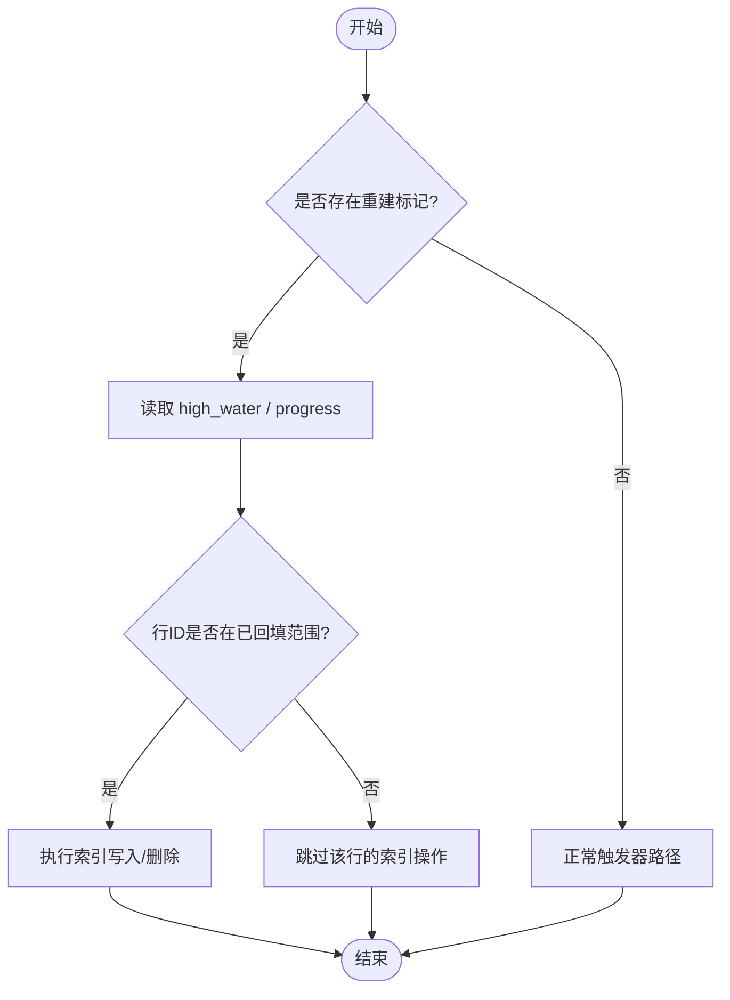
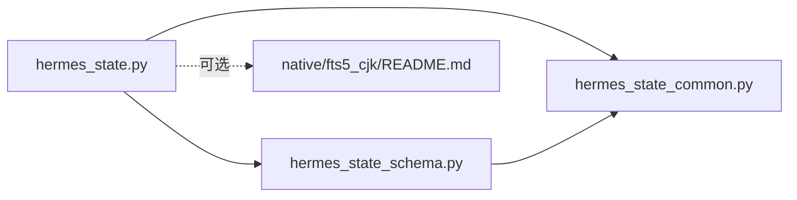

# 数据库架构设计

<cite>
**本文引用的文件**
- [hermes_state.py](file://hermes_state.py)
- [hermes_state_common.py](file://hermes_state_common.py)
- [hermes_state_schema.py](file://hermes_state_schema.py)
- [native/fts5_cjk/README.md](file://native/fts5_cjk/README.md)
</cite>

## 目录
1. [简介](#简介)
2. [项目结构](#项目结构)
3. [核心组件](#核心组件)
4. [架构总览](#架构总览)
5. [详细组件分析](#详细组件分析)
6. [依赖关系分析](#依赖关系分析)
7. [性能考量](#性能考量)
8. [故障排查指南](#故障排查指南)
9. [结论](#结论)
10. [附录](#附录)

## 简介
本文件面向 Hermes Agent 的会话数据存储，聚焦 SQLite 数据库表结构设计、FTS5 全文检索、CJK 语言支持、触发器与索引策略、数据完整性保证、版本迁移与向后兼容，以及面向开发者的数据库设计规范与最佳实践。文档以仓库中实际实现的 DDL、触发器、迁移与运行时行为为依据，提供可追溯的源码引用。

## 项目结构
Hermes 的状态存储由一组 Python 模块协同实现：
- hermes_state_common.py：集中定义 SCHEMA_SQL、FTS_SQL、FTS_TRIGRAM_SQL、DEFERRED_INDEX_SQL、SCHEMA_VERSION、FTS_STORAGE_VERSION 等“单一事实源”常量，以及预览、子会话判定等共享 SQL 片段。
- hermes_state_schema.py：负责模式初始化、列对齐（reconcile）、FTS 可用性探测、触发器修复与重建、历史主键修复等。
- hermes_state.py：SessionDB 主入口，封装 WAL/PRAGMA 设置、WAL 兼容性回退、测试隔离保护、压缩锁、消息清理、导出限制等。
- native/fts5_cjk/README.md：说明如何构建并启用 CJK FTS5 分词扩展，用于提升 CJK 子串搜索质量。

图表来源
- [hermes_state.py:1-80](file://hermes_state.py#L1-L80)
- [hermes_state_schema.py:1-35](file://hermes_state_schema.py#L1-L35)
- [hermes_state_common.py:167-393](file://hermes_state_common.py#L167-L393)
- [native/fts5_cjk/README.md:1-25](file://native/fts5_cjk/README.md#L1-L25)

章节来源
- [hermes_state.py:1-80](file://hermes_state.py#L1-L80)
- [hermes_state_common.py:167-393](file://hermes_state_common.py#L167-L393)
- [hermes_state_schema.py:1-35](file://hermes_state_schema.py#L1-L35)
- [native/fts5_cjk/README.md:1-25](file://native/fts5_cjk/README.md#L1-L25)

## 核心组件
- 会话与会话元数据表 sessions：记录会话生命周期、模型配置、计费信息、工作区绑定、归档/置顶状态、活动心跳等。
- 消息表 messages：持久化每条消息内容、工具调用、时间戳、可见性标记、是否参与压缩等。
- FTS5 虚拟表 messages_fts：外部内容模式，索引 content/tool_name/tool_calls，配合触发器保持增量同步。
- FTS5 trigram 虚拟表 messages_fts_trigram：基于 trigram 分词，支持 CJK 子串匹配；通过视图排除 role='tool' 以降低索引体积。
- 辅助表：schema_version、system_prompts、state_meta、gateway_routing、compression_locks、async_delegations、session_model_usage。
- 索引：针对会话列表、消息查询、路由、异步委托、使用统计等高频路径建立复合/部分索引。

章节来源
- [hermes_state_common.py:197-373](file://hermes_state_common.py#L197-L373)
- [hermes_state_common.py:415-534](file://hermes_state_common.py#L415-L534)
- [hermes_state_common.py:376-393](file://hermes_state_common.py#L376-L393)

## 架构总览
下图展示会话写入到 FTS 索引的端到端流程，包括标准 FTS 与 trigram FTS 两条路径，以及“重建期”的高水位/进度门控。

图表来源
- [hermes_state_common.py:415-462](file://hermes_state_common.py#L415-L462)
- [hermes_state_common.py:479-534](file://hermes_state_common.py#L479-L534)

章节来源
- [hermes_state_common.py:415-534](file://hermes_state_common.py#L415-L534)

## 详细组件分析

### 表结构与字段定义
- sessions
  - 主键 id（TEXT），自描述会话标识。
  - 来源与平台字段：source、user_id、session_key、chat_id、chat_type、thread_id。
  - 显示与来源：display_name、origin_json、expiry_finalized。
  - 模型与系统提示：model、model_config、system_prompt、system_prompt_hash（外键指向 system_prompts）。
  - 会话树：parent_session_id（自引用外键）。
  - 时间线：started_at、ended_at、end_reason、last_activity_at。
  - 用量与成本：message_count、tool_call_count、input_tokens、output_tokens、cache_read_tokens、cache_write_tokens、reasoning_tokens、api_call_count、estimated_cost_usd、actual_cost_usd、cost_status、cost_source、pricing_version。
  - 工作区：cwd、git_branch、git_repo_root。
  - 交互状态：handoff_state、handoff_platform、handoff_error。
  - 压缩相关：compression_failure_cooldown_until、compression_failure_error、compression_fallback_streak、compression_ineffective_count。
  - 其他：profile_name、rewind_count、archived、pinned、last_read_at。
  - 外键约束：parent_session_id → sessions(id)，system_prompt_hash → system_prompts(hash)。

- messages
  - 主键 id（INTEGER AUTOINCREMENT）。
  - 关联 session_id（外键 REFERENCES sessions(id)）。
  - 角色与内容：role、content。
  - 工具调用：tool_call_id、tool_calls、tool_name。
  - 效果与可见性：effect_disposition、observed、active、compacted。
  - 时间与用量：timestamp、token_count、finish_reason。
  - 推理与平台：reasoning、reasoning_content、reasoning_details、codex_reasoning_items、codex_message_items、platform_message_id。
  - 展示增强：api_content、display_kind、display_metadata。

- 辅助表
  - schema_version(version INTEGER NOT NULL)：当前模式版本。
  - system_prompts(hash TEXT PRIMARY KEY, prompt TEXT NOT NULL)：系统提示内容地址化存储。
  - state_meta(key TEXT PRIMARY KEY, value TEXT)：运行期元数据（如 FTS 重建高水位/进度、CJK 陈旧标记等）。
  - gateway_routing(scope, session_key, entry_json, updated_at)：网关路由条目，复合主键 (scope, session_key)。
  - compression_locks(session_id, holder, acquired_at, expires_at)：压缩锁。
  - async_delegations：异步委托事件与交付状态。
  - session_model_usage：按模型维度的用量与成本统计，复合主键包含 task。

章节来源
- [hermes_state_common.py:197-373](file://hermes_state_common.py#L197-L373)

### 主外键关系与数据完整性
- sessions.parent_session_id → sessions.id：会话父子关系（分支/压缩链）。
- sessions.system_prompt_hash → system_prompts.hash：系统提示去重与共享。
- messages.session_id → sessions.id：消息归属会话。
- 通过外键与 CHECK/NOT NULL/DEFAULT 约束保障一致性；对 legacy 主键不匹配场景提供自愈逻辑（见后文迁移）。

章节来源
- [hermes_state_common.py:197-373](file://hermes_state_common.py#L197-L373)

### 索引策略
- 会话索引：source、source+id、parent_session_id、started_at DESC、session_key+started_at DESC、多平台联合查询索引、handoff_state、system_prompt_hash。
- 消息索引：session_id+timestamp、session_id+id、role='assistant'且tool_calls IS NOT NULL 的部分索引、session_id+active+timestamp、active IS NULL 的部分索引。
- 其他：compression_locks(expires_at)、session_model_usage(session_id/model)、async_delegations(delivery_state, completed_at)。

章节来源
- [hermes_state_common.py:354-373](file://hermes_state_common.py#L354-L373)
- [hermes_state_common.py:376-393](file://hermes_state_common.py#L376-L393)

### FTS5 全文检索与 CJK 支持
- 标准 FTS（messages_fts）
  - 外部内容模式，索引 content、tool_name、tool_calls，映射到 messages 表的 id。
  - 触发器：INSERT/DELETE/UPDATE OF content, tool_name, tool_calls 保持索引一致。
  - 重建期门控：通过 state_meta 中的 fts_rebuild_high_water 与 fts_rebuild_progress 控制哪些行进入索引，避免重建期间误删或遗漏。

- Trigram FTS（messages_fts_trigram）
  - 使用 tokenize='trigram'，适合 CJK 子串匹配。
  - 通过视图 messages_fts_trigram_src 排除 role='tool'，降低索引体积与噪声。
  - 触发器在 role 变化时也需重新计算，确保视图一致性。

- CJK 扩展（可选）
  - 通过 native/fts5_cjk 提供的 cjk_unicode61 分词扩展，改善 1-2 字符 CJK 术语漏检问题。
  - 安装后可创建 messages_fts_cjk 索引；可通过配置开关与环境变量控制。

章节来源
- [hermes_state_common.py:415-534](file://hermes_state_common.py#L415-L534)
- [native/fts5_cjk/README.md:1-25](file://native/fts5_cjk/README.md#L1-L25)

### 触发器与重建流程
- 触发器集合：messages_fts_insert/delete/update、messages_fts_trigram_insert/delete/update、（可选）messages_fts_cjk_*。
- 重建流程：
  - 清空并重建 messages_fts 与 messages_fts_trigram 的倒排索引。
  - 使用 high_water 与 progress 两个水位键，将“旧索引丢弃点”和“已回填进度”持久化，触发器据此判断是否应写/删索引项。
  - 重建完成后清除重建进度键，避免重复回填。

图表来源
- [hermes_state_common.py:415-462](file://hermes_state_common.py#L415-L462)
- [hermes_state_common.py:479-534](file://hermes_state_common.py#L479-L534)

章节来源
- [hermes_state_common.py:415-534](file://hermes_state_common.py#L415-L534)

### 模式版本迁移与向后兼容
- 声明式列对齐：启动时解析 SCHEMA_SQL，对比 PRAGMA table_info，自动 ADD COLUMN 缺失列，消除版本化迁移链对新增列的需求。
- 历史主键修复：
  - gateway_routing：若主键仍为旧版（仅 session_key），则重命名为 _legacy_pk 并重建带 (scope, session_key) 的主键，保留数据。
  - session_model_usage：若主键缺少 task 维度，同样重建为主键包含 task 的新表，并补齐索引。
- FTS 迁移：
  - v23 引入外部内容布局与 trigram 视图；对遗留 inline 布局提供 LEGACY_FTS_SQL 以保持兼容。
  - 提供 rebuild 命令统一重建两类 FTS 表，并清理重建进度键。
- 安全降级：
  - 当 FTS5 不可用时，移除触发器但保留核心持久化能力，待未来具备 FTS5 环境再恢复。
  - CJK 不可用或迁移失败时，设置 fts_cjk_stale 标记，禁止服务 CJK 搜索结果直到显式优化。

章节来源
- [hermes_state_schema.py:83-263](file://hermes_state_schema.py#L83-L263)
- [hermes_state_schema.py:265-320](file://hermes_state_schema.py#L265-L320)
- [hermes_state_schema.py:382-425](file://hermes_state_schema.py#L382-L425)
- [hermes_state_schema.py:426-618](file://hermes_state_schema.py#L426-L618)
- [hermes_state_schema.py:619-713](file://hermes_state_schema.py#L619-L713)
- [hermes_state_common.py:167-178](file://hermes_state_common.py#L167-L178)
- [hermes_state_common.py:551-614](file://hermes_state_common.py#L551-L614)

### WAL 模式与跨平台兼容性
- 默认启用 WAL 以提升并发读性能；在 NFS/SMB/FUSE/ZFS 等网络/特殊文件系统上可能失败，代码会回退至 journal_mode=DELETE 以保证可用。
- macOS 下强制 synchronous=FULL 并在 checkpoint 时使用 fullfsync，防止关机/重启导致 WAL 损坏。
- 检测 SQLite 库的 WAL-reset bug 版本，避免在不安全库上启用 WAL。

章节来源
- [hermes_state.py:485-538](file://hermes_state.py#L485-L538)
- [hermes_state.py:697-780](file://hermes_state.py#L697-L780)
- [hermes_state.py:783-800](file://hermes_state.py#L783-L800)

## 依赖关系分析
- 模块耦合
  - hermes_state.py 依赖 hermes_state_common 的 DDL/索引/FTS 常量，以及 hermes_state_schema 的模式管理方法。
  - hermes_state_schema.py 仅依赖 hermes_state_common 的常量，避免循环导入。
  - native/fts5_cjk 作为可选扩展，通过配置与环境变量接入。
- 外部依赖
  - SQLite 引擎与 FTS5 扩展；可选 CJK 分词扩展。
  - 平台文件系统特性（WAL 支持、fsync 语义）。

图表来源
- [hermes_state.py:1-80](file://hermes_state.py#L1-L80)
- [hermes_state_schema.py:1-35](file://hermes_state_schema.py#L1-L35)
- [hermes_state_common.py:167-393](file://hermes_state_common.py#L167-L393)
- [native/fts5_cjk/README.md:1-25](file://native/fts5_cjk/README.md#L1-L25)

章节来源
- [hermes_state.py:1-80](file://hermes_state.py#L1-L80)
- [hermes_state_schema.py:1-35](file://hermes_state_schema.py#L1-L35)
- [hermes_state_common.py:167-393](file://hermes_state_common.py#L167-L393)
- [native/fts5_cjk/README.md:1-25](file://native/fts5_cjk/README.md#L1-L25)

## 性能考量
- 写入路径优化
  - 使用 AFTER UPDATE OF 精确触发，避免非内容列变更引发 FTS I/O。
  - 重建期通过 high_water/progress 门控减少无效索引操作。
- 索引选择
  - 对 role='assistant' 且 tool_calls IS NOT NULL 的场景使用部分索引，缩小索引体积。
  - 会话列表与消息时序查询使用复合索引加速。
- 存储布局
  - 标准 FTS 与 trigram FTS 分离，后者通过视图排除大量机器噪声（role='tool'），显著降低索引大小。
- 平台适配
  - 在不可靠文件系统上自动回退到 DELETE 日志模式，牺牲并发换取稳定性。
  - macOS 强化 fsync 与 checkpoint_fullfsync，降低断电/重启风险。

章节来源
- [hermes_state_common.py:415-534](file://hermes_state_common.py#L415-L534)
- [hermes_state_common.py:354-393](file://hermes_state_common.py#L354-L393)
- [hermes_state.py:485-538](file://hermes_state.py#L485-L538)
- [hermes_state.py:697-780](file://hermes_state.py#L697-L780)

## 故障排查指南
- 无法启用 WAL
  - 现象：journal_mode=WAL 报错（locking protocol/disk i/o error/not authorized）。
  - 处理：自动回退到 DELETE 模式；检查文件系统类型（NFS/SMB/FUSE/ZFS）。
- FTS5 不可用
  - 现象：创建 FTS5 失败或访问虚拟表报错。
  - 处理：移除触发器保持写入可用；升级 SQLite 或启用扩展后再恢复。
- CJK 搜索异常
  - 现象：CJK 子串匹配不准确或退化到 LIKE 全表扫描。
  - 处理：安装 cjk_unicode61 扩展；必要时运行 optimize-storage 重建索引；检查 fts_cjk_stale 标记。
- 重建卡住或索引不一致
  - 现象：messages_fts/messages_fts_trigram 与 messages 不同步。
  - 处理：确认 state_meta 中 fts_rebuild_high_water/progress 是否正确；必要时执行 rebuild。
- 主键不匹配导致写入失败
  - 现象：gateway_routing/session_model_usage 写入报 UNIQUE 冲突。
  - 处理：启动时会自动修复主键；若仍失败，检查是否有残留 _legacy_pk 表。

章节来源
- [hermes_state.py:485-538](file://hermes_state.py#L485-L538)
- [hermes_state_schema.py:107-127](file://hermes_state_schema.py#L107-L127)
- [hermes_state_schema.py:426-618](file://hermes_state_schema.py#L426-L618)
- [hermes_state_common.py:415-534](file://hermes_state_common.py#L415-L534)
- [native/fts5_cjk/README.md:1-25](file://native/fts5_cjk/README.md#L1-L25)

## 结论
Hermes 的会话数据存储采用“声明式 DDL + 运行时列对齐 + 选择性重建”的组合策略，在保证向后兼容的同时，持续演进 FTS 与索引布局。通过严格的触发器粒度控制、重建期水位门控与平台级 WAL 回退机制，系统在跨平台与复杂存储环境下保持稳定与高性能。开发者应遵循“以 SCHEMA_SQL 为唯一事实源”的原则进行变更，并通过现有自愈与重建工具完成平滑升级。

## 附录

### 建表语句参考（节选）
- 会话与会话元数据
  - schema_version、sessions、messages、system_prompts、state_meta、gateway_routing、compression_locks、async_delegations、session_model_usage
  - 参考位置：[hermes_state_common.py:197-373](file://hermes_state_common.py#L197-L373)

- FTS5 虚拟表与触发器
  - messages_fts（外部内容，content/tool_name/tool_calls）
  - messages_fts_trigram（trigram 分词，role<>tool 视图）
  - 触发器：insert/delete/update（含 UPDATE OF 精确触发）
  - 参考位置：[hermes_state_common.py:415-534](file://hermes_state_common.py#L415-L534)

- 延迟索引（依赖后续列）
  - idx_messages_session_active、idx_messages_active_null、idx_sessions_* 等
  - 参考位置：[hermes_state_common.py:376-393](file://hermes_state_common.py#L376-L393)

### 迁移与兼容性要点
- 列新增：无需手写迁移，启动时自动 ADD COLUMN。
- 主键修复：gateway_routing、session_model_usage 会在启动时识别并重建。
- FTS 布局：v23 外部内容布局；遗留 inline 布局通过 LEGACY_FTS_SQL 兼容。
- CJK：可选扩展，支持配置开关与手动优化。

章节来源
- [hermes_state_schema.py:382-425](file://hermes_state_schema.py#L382-L425)
- [hermes_state_schema.py:426-618](file://hermes_state_schema.py#L426-L618)
- [hermes_state_common.py:167-178](file://hermes_state_common.py#L167-L178)
- [hermes_state_common.py:551-614](file://hermes_state_common.py#L551-L614)
- [native/fts5_cjk/README.md:1-25](file://native/fts5_cjk/README.md#L1-L25)