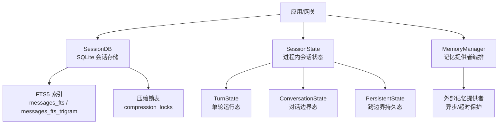
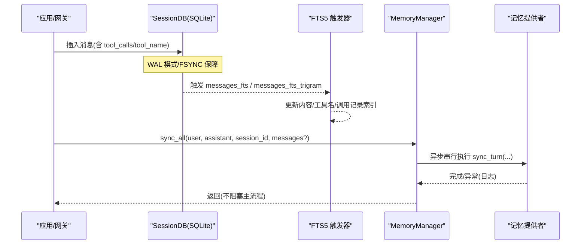
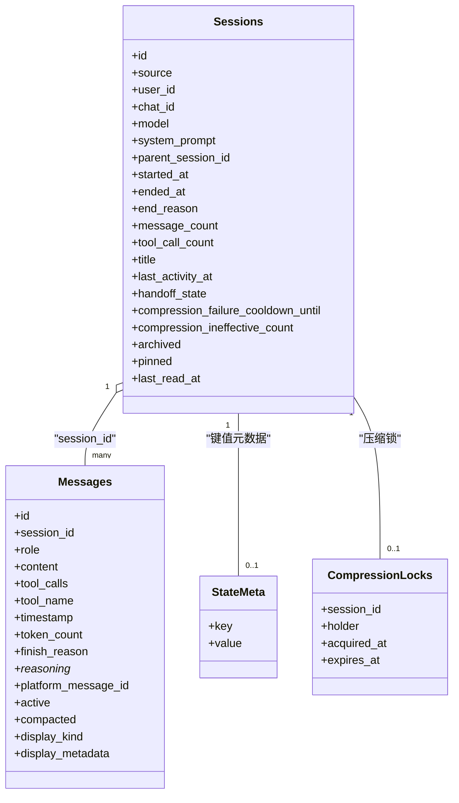
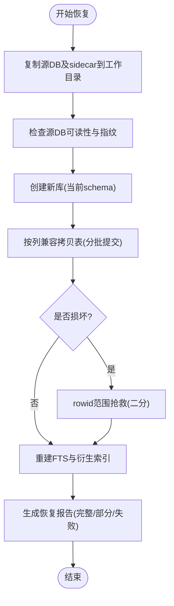
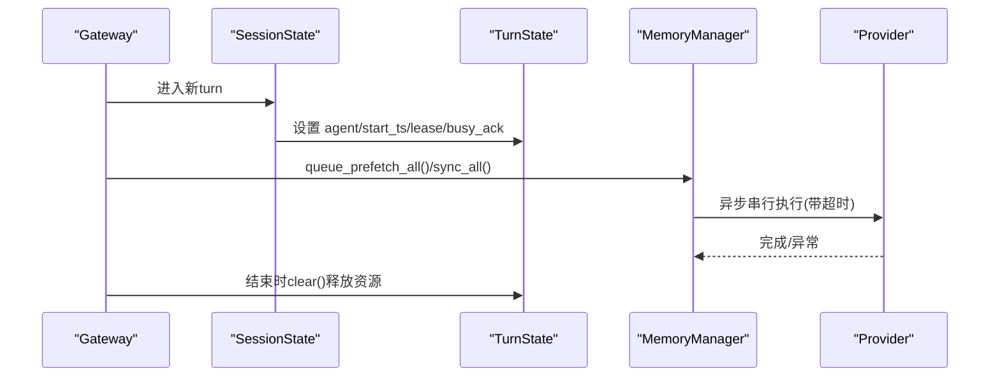
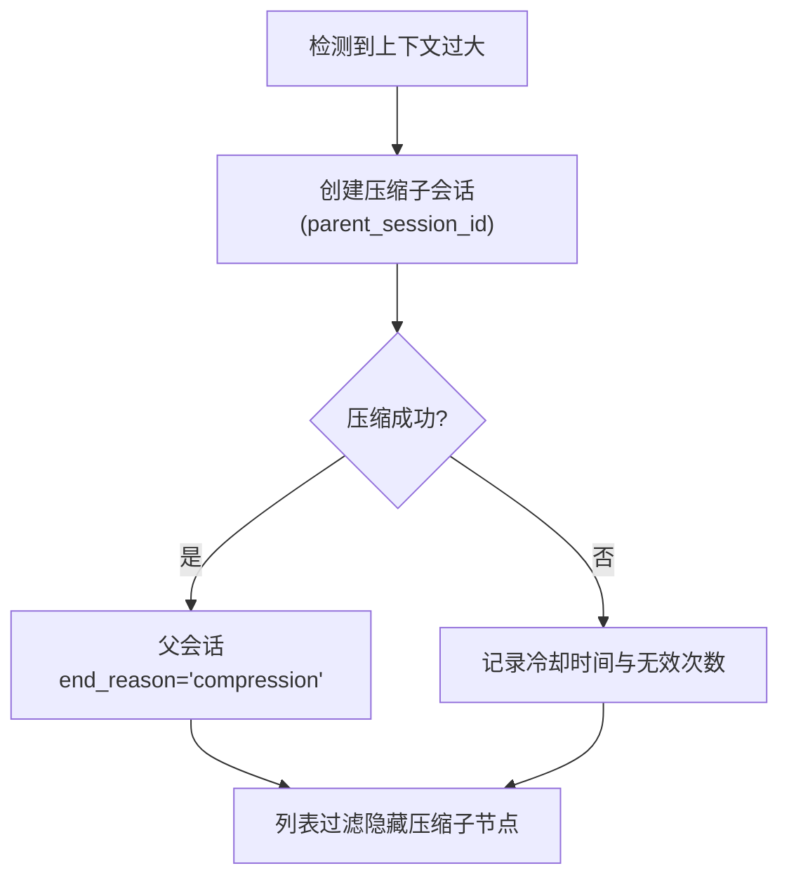
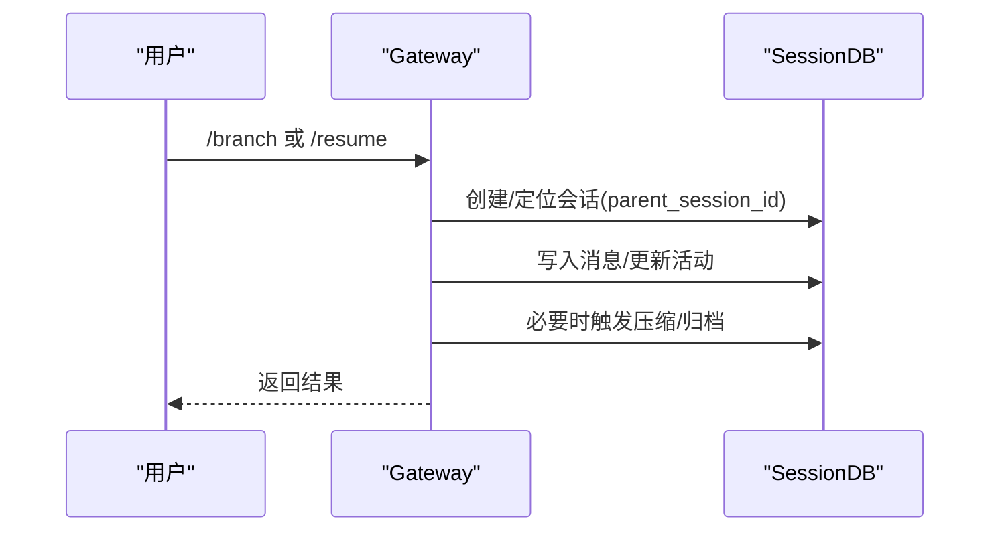
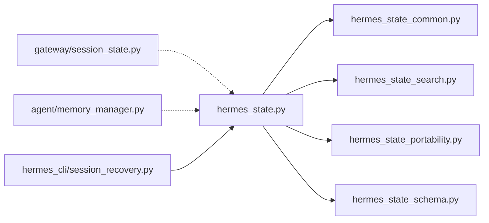

# 会话状态管理

<cite>
**本文引用的文件**
- [hermes_state.py](file://hermes_state.py)
- [hermes_state_common.py](file://hermes_state_common.py)
- [gateway/session_state.py](file://gateway/session_state.py)
- [agent/memory_manager.py](file://agent/memory_manager.py)
- [hermes_cli/session_recovery.py](file://hermes_cli/session_recovery.py)
</cite>

## 目录
1. [简介](#简介)
2. [项目结构](#项目结构)
3. [核心组件](#核心组件)
4. [架构总览](#架构总览)
5. [详细组件分析](#详细组件分析)
6. [依赖关系分析](#依赖关系分析)
7. [性能考虑](#性能考虑)
8. [故障排查指南](#故障排查指南)
9. [结论](#结论)
10. [附录](#附录)

## 简介
本文件面向 Hermes Agent 的“会话状态管理”，围绕会话生命周期（创建、持久化、恢复、清理）、数据结构设计（消息历史、工具调用记录、用户与元数据）、存储机制（SQLite 为主，JSON/导出为辅）、并发访问控制、备份恢复策略以及性能优化（上下文压缩、记忆缓存、垃圾回收）进行系统化说明。文档同时提供代码级图示与操作指引，帮助开发者正确实现和扩展会话能力。

## 项目结构
Hermes 的会话状态由三层协同完成：
- 持久层：基于 SQLite 的 SessionDB，负责会话元数据、消息历史、FTS 全文检索、压缩锁等。
- 网关运行时层：SessionState/TurnState/ConversationState/PersistentState，封装进程内会话运行态，按作用域隔离并集中清理。
- 记忆与上下文层：MemoryManager 提供记忆提供者编排、预取与同步，配合上下文压缩与清理。

图表来源
- [hermes_state.py:1-120](file://hermes_state.py#L1-L120)
- [hermes_state_common.py:197-373](file://hermes_state_common.py#L197-L373)
- [gateway/session_state.py:51-178](file://gateway/session_state.py#L51-L178)
- [agent/memory_manager.py:364-757](file://agent/memory_manager.py#L364-L757)

章节来源
- [hermes_state.py:1-120](file://hermes_state.py#L1-L120)
- [hermes_state_common.py:197-373](file://hermes_state_common.py#L197-L373)
- [gateway/session_state.py:51-178](file://gateway/session_state.py#L51-L178)
- [agent/memory_manager.py:364-757](file://agent/memory_manager.py#L364-L757)

## 核心组件
- SessionDB（SQLite 会话存储）
  - 会话元数据：source、user_id、chat_id、model、system_prompt、parent_session_id、started_at/ended_at、end_reason、title、last_activity_at、handoff_*、压缩相关字段、profile_name、rewind_count、archived/pinned、last_read_at 等。
  - 消息历史：role、content、tool_calls、tool_name、effect_disposition、timestamp、token_count、finish_reason、reasoning_*、platform_message_id、observed、active、compacted、api_content、display_kind/display_metadata。
  - 使用统计：session_model_usage（按 session/model/billing/task 维度）。
  - 辅助表：state_meta、gateway_routing、compression_locks、async_delegations。
  - 全文检索：messages_fts（标准分词）与 messages_fts_trigram（CJK trigram），通过触发器维护。
  - WAL 模式与兼容性回退、macOS fsync 强化、WAL-reset 漏洞防护。
- Gateway SessionState（进程内会话状态）
  - TurnState：单轮运行态（agent、started_ts、lease、busy_ack_ts、lease_token/lease_generation）。
  - ConversationState：对话边界态（模型/推理/服务等级覆盖、队列事件、侧车备注、临时 pin、语音通道上下文）。
  - PersistentState：跨边界持久态（审批、更新提示、原生图片路径、待处理命令文本、run_generation、卫生压缩失败连击计数）。
  - 遗留字典视图适配，保证测试兼容。
- MemoryManager（记忆管理器）
  - 注册/路由记忆提供者，注入工具 schema。
  - 预取（prefetch）与同步（sync_all）在后台串行执行，避免阻塞主流程。
  - 外部提供者超时保护与线程池管理。
  - 流式上下文清洗（StreamingContextScrubber）防止内存上下文泄漏到 UI。
- 离线恢复（SessionRecovery）
  - 非破坏性恢复：复制源数据库及其 sidecar，重建目标库与 FTS，不直接打开原库。
  - 行级抢救：rowid 范围二分拷贝，跳过损坏页，输出可审计报告。

章节来源
- [hermes_state_common.py:197-373](file://hermes_state_common.py#L197-L373)
- [gateway/session_state.py:51-178](file://gateway/session_state.py#L51-L178)
- [agent/memory_manager.py:364-757](file://agent/memory_manager.py#L364-L757)
- [hermes_cli/session_recovery.py:1-120](file://hermes_cli/session_recovery.py#L1-L120)

## 架构总览
下图展示一次典型“写入消息 + 记忆同步”的端到端流程，涵盖 SQLite 持久化、FTS 触发器、记忆提供者异步同步。

图表来源
- [hermes_state.py:415-462](file://hermes_state.py#L415-L462)
- [hermes_state_common.py:415-534](file://hermes_state_common.py#L415-L534)
- [agent/memory_manager.py:638-694](file://agent/memory_manager.py#L638-L694)

## 详细组件分析

### 会话数据结构与生命周期
- 会话创建
  - 新建 sessions 行，记录 source/user_id/chat_id 等标识，model/system_prompt 配置，started_at 时间戳。
  - 可选 parent_session_id 表示分支/子代理；end_reason 用于分支或压缩标记。
- 消息写入
  - messages 表追加 role/content/tool_calls 等；active 标记活跃消息；compacted 标记压缩后归档。
  - 通过 FTS5 触发器自动维护全文索引，支持 CJK 子串搜索。
- 会话恢复
  - 支持从父会话链恢复，限制最大安全恢复消息数，避免超大上下文导致 OOM。
  - 对历史遗留的“后台审查 harness”与“残留工具调用标记”消息进行清理后再回放。
- 会话合并/分支
  - 通过 parent_session_id 与 end_reason 表达分支与压缩延续；列表查询仅显示根与会话分支，隐藏压缩子节点。
- 会话清理
  - 删除委托子会话（_delegate_from 标记链），级联清理其消息；孤儿会话 parent 置空。
  - 压缩失败冷却与无效次数统计，避免频繁重试。

图表来源
- [hermes_state_common.py:197-373](file://hermes_state_common.py#L197-L373)

章节来源
- [hermes_state.py:87-157](file://hermes_state.py#L87-L157)
- [hermes_state.py:285-329](file://hermes_state.py#L285-L329)
- [hermes_state_common.py:83-114](file://hermes_state_common.py#L83-L114)

### 会话存储机制（SQLite、JSON/导出）
- SQLite 主存储
  - WAL 模式提升并发读性能；在 NFS/SMB/FUSE/ZFS 等文件系统上自动回退为 DELETE 模式，确保可用性。
  - macOS 下强制 synchronous=FULL 与 checkpoint_fullfsync，降低关机/重启时 WAL 损坏风险。
  - 检测 SQLite WAL-reset 漏洞版本，拒绝在新库启用 WAL，避免多进程 WAL 损坏。
- JSON/导出
  - 提供会话导出能力（Markdown/HTML），受最大消息数限制，避免内存溢出。
  - 导出前会剥离后台审查 harness 与残留工具标记，保证回放一致性。
- 备份与恢复
  - 离线恢复工具将源 DB 及 sidecar 复制到工作目录，重建当前 schema 与 FTS，不直接打开原库。
  - 支持 rowid 范围抢救，跳过损坏页，输出详细报告（包含跳过的 rowid 区间）。

图表来源
- [hermes_cli/session_recovery.py:240-355](file://hermes_cli/session_recovery.py#L240-L355)
- [hermes_cli/session_recovery.py:380-445](file://hermes_cli/session_recovery.py#L380-L445)
- [hermes_cli/session_recovery.py:508-663](file://hermes_cli/session_recovery.py#L508-L663)

章节来源
- [hermes_state.py:486-518](file://hermes_state.py#L486-L518)
- [hermes_state.py:577-671](file://hermes_state.py#L577-L671)
- [hermes_cli/session_recovery.py:240-355](file://hermes_cli/session_recovery.py#L240-L355)
- [hermes_cli/session_recovery.py:508-663](file://hermes_cli/session_recovery.py#L508-L663)

### 并发访问控制
- SQLite 并发
  - 默认 WAL 模式允许多读一写；在不可靠文件系统上降级为 DELETE 模式，牺牲并发换取稳定。
  - macOS 平台额外开启 FULL fsync 与 checkpoint barrier，增强断电/重启安全性。
- 进程内并发
  - Gateway SessionState 将状态按 turn/conversation/persistent 三作用域组织，边界处统一 clear()，避免脏状态扩散。
  - TurnState 持有 turn 级租约与 busy 确认时间戳，避免重复执行与竞态。
- 记忆提供者并发
  - MemoryManager 使用单 worker 线程串行执行 sync/prefetch，避免提供者内部竞争；外部提供者 prefetch 带超时保护。
  - 后台任务在关闭阶段有超时等待，避免进程挂起。

图表来源
- [gateway/session_state.py:51-178](file://gateway/session_state.py#L51-L178)
- [agent/memory_manager.py:597-694](file://agent/memory_manager.py#L597-L694)

章节来源
- [hermes_state.py:486-518](file://hermes_state.py#L486-L518)
- [gateway/session_state.py:51-178](file://gateway/session_state.py#L51-L178)
- [agent/memory_manager.py:597-694](file://agent/memory_manager.py#L597-L694)

### 上下文压缩、记忆缓存与垃圾回收
- 上下文压缩
  - 通过 parent_session_id 与 end_reason='compression' 建立压缩子会话链；列表过滤隐藏压缩子节点。
  - 压缩失败冷却与无效次数统计，避免频繁重试；压缩锁表 compression_locks 协调多进程压缩。
- 记忆缓存
  - MemoryManager 对外部提供者 prefetch 做超时保护，避免慢提供者阻塞；后台串行执行保证顺序。
  - 流式上下文清洗（StreamingContextScrubber）防止 <memory-context> 片段跨块泄露。
- 垃圾回收
  - 删除委托子会话时级联清理消息，并将孤儿 parent_session_id 置空。
  - 会话导出/恢复限制最大消息数，防止内存压力。

图表来源
- [hermes_state_common.py:83-114](file://hermes_state_common.py#L83-L114)
- [hermes_state.py:167-213](file://hermes_state.py#L167-L213)
- [agent/memory_manager.py:182-361](file://agent/memory_manager.py#L182-L361)

章节来源
- [hermes_state_common.py:83-114](file://hermes_state_common.py#L83-L114)
- [hermes_state.py:167-213](file://hermes_state.py#L167-L213)
- [agent/memory_manager.py:182-361](file://agent/memory_manager.py#L182-L361)

### 会话切换、合并与清理机制
- 会话切换
  - 通过 parent_session_id 与 end_reason 表达分支；/new、/resume、过期、压缩耗尽等边界重置 conversation 状态。
- 会话合并
  - 压缩子会话作为“延续”存在，读取时可通过父链回溯；列表仅显示根与分支，保持界面简洁。
- 清理机制
  - 委托子会话（_delegate_from 标记）级联删除；孤儿 parent 置空。
  - 后台审查 harness 与残留工具标记在恢复时清理，避免污染回放。

图表来源
- [hermes_state_common.py:83-114](file://hermes_state_common.py#L83-L114)
- [hermes_state.py:285-329](file://hermes_state.py#L285-L329)

章节来源
- [hermes_state.py:285-329](file://hermes_state.py#L285-L329)
- [hermes_state_common.py:83-114](file://hermes_state_common.py#L83-L114)

## 依赖关系分析
- 模块耦合
  - hermes_state 依赖 hermes_state_common（DDL/常量）、hermes_state_search/portability/schema 混入。
  - gateway/session_state 独立于持久层，仅关注进程内状态与作用域清理。
  - agent/memory_manager 与工具集/提供者解耦，通过 schema 注入与异步调度协作。
  - hermes_cli/session_recovery 依赖 hermes_state 提供的常量与校验能力。
- 外部依赖
  - SQLite（WAL/FTS5/trigram）、psutil（进程存活探测）、系统 fsync（macOS）。
- 潜在循环与风险
  - 通过 common 常量拆分避免导入循环。
  - WAL 回退与 macOS 强化避免跨平台不一致导致的损坏。

图表来源
- [hermes_state.py:48-79](file://hermes_state.py#L48-L79)
- [hermes_state_common.py:1-7](file://hermes_state_common.py#L1-L7)
- [hermes_cli/session_recovery.py:23-28](file://hermes_cli/session_recovery.py#L23-L28)

章节来源
- [hermes_state.py:48-79](file://hermes_state.py#L48-L79)
- [hermes_state_common.py:1-7](file://hermes_state_common.py#L1-L7)
- [hermes_cli/session_recovery.py:23-28](file://hermes_cli/session_recovery.py#L23-L28)

## 性能考虑
- 存储与索引
  - 使用 FTS5 与 trigram 索引加速全文检索；trigram 排除 role='tool' 以降低体积与开销。
  - 延迟索引（DEFERRED_INDEX_SQL）在迁移后创建，避免旧库建索引失败。
- 并发与稳定性
  - WAL 模式+macOS fsync 强化；NFS/SMB 回退 DELETE 模式；WAL-reset 漏洞检测。
  - 压缩锁与冷却机制减少重复压缩带来的抖动。
- 内存与吞吐
  - 恢复/导出限制最大消息数，避免大会话 OOM。
  - MemoryManager 后台串行执行，外部提供者 prefetch 超时保护，避免长尾阻塞。
- 建议
  - 定期优化存储（如 FTS 重建）以减小索引体积。
  - 监控压缩失败连击与无效次数，调整阈值。
  - 在高并发场景优先使用 WAL 并确保文件系统兼容。

[本节为通用性能指导，无需特定文件引用]

## 故障排查指南
- 会话数据库不可用
  - 现象：/resume、/title、/history、/branch 报错“会话数据库不可用”。
  - 原因：WAL 协议错误（NFS/SMB/FUSE/ZFS）、WAL-reset 漏洞、权限问题。
  - 处理：查看最后初始化错误信息；必要时切换到本地磁盘或修复文件系统；对受损库使用离线恢复。
- 恢复失败或部分恢复
  - 现象：恢复报告 partial/failed，包含 rowid 范围跳过。
  - 处理：检查磁盘空间与工作目录；尝试不同 work/output 路径；根据报告定位损坏范围。
- 记忆提供者阻塞
  - 现象：会话长时间处于“运行中”，后续消息触发中断。
  - 处理：检查外部提供者超时与后台任务；必要时禁用或替换提供者。

章节来源
- [hermes_state.py:520-565](file://hermes_state.py#L520-L565)
- [hermes_state.py:674-694](file://hermes_state.py#L674-L694)
- [hermes_cli/session_recovery.py:164-237](file://hermes_cli/session_recovery.py#L164-L237)
- [agent/memory_manager.py:697-757](file://agent/memory_manager.py#L697-L757)

## 结论
Hermes 的会话状态管理以 SQLite 为核心，结合 FTS5 全文检索、严格的并发与稳定性保障、完善的离线恢复与记忆提供者编排，形成了高可用、可扩展的会话体系。通过 SessionState 的作用域化设计与 MemoryManager 的异步调度，系统在大规模并发与长会话场景下仍能保持稳定与高效。建议在生产环境中关注文件系统兼容性、压缩策略与记忆提供者健康度，并结合恢复工具进行定期巡检。

[本节为总结性内容，无需特定文件引用]

## 附录
- 关键表与字段速查
  - sessions：会话元数据、父子关系、活动与计费信息。
  - messages：消息历史、工具调用、推理与显示元数据。
  - state_meta：键值型元数据（FTS 版本、重建水位等）。
  - compression_locks：压缩锁（会话、持有者、获取/过期时间）。
  - async_delegations：异步委托任务状态与投递信息。
- 常用操作参考
  - 创建会话：插入 sessions，记录 source/user_id/chat_id 等。
  - 写入消息：插入 messages，FTS 触发器自动更新索引。
  - 恢复会话：通过父链加载，限制消息数量，清理历史遗留消息。
  - 压缩/归档：创建压缩子会话，隐藏子节点，记录失败冷却。
  - 备份恢复：使用离线恢复工具，复制 sidecar，重建 FTS，输出报告。

[本节为补充说明，无需特定文件引用]