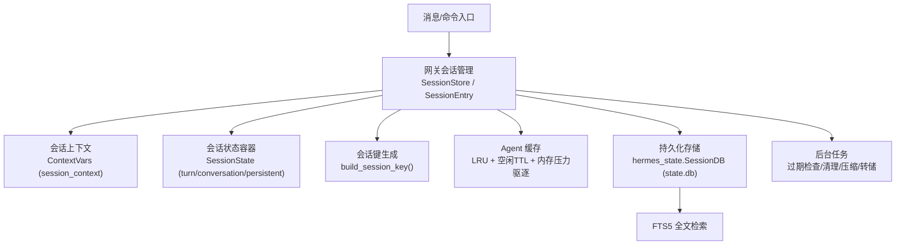
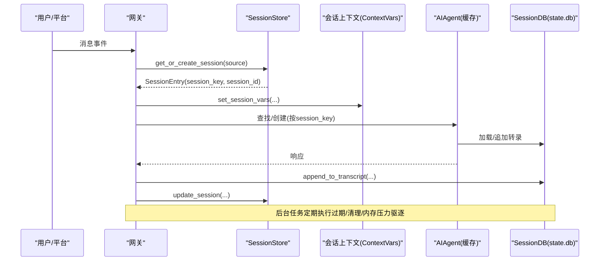
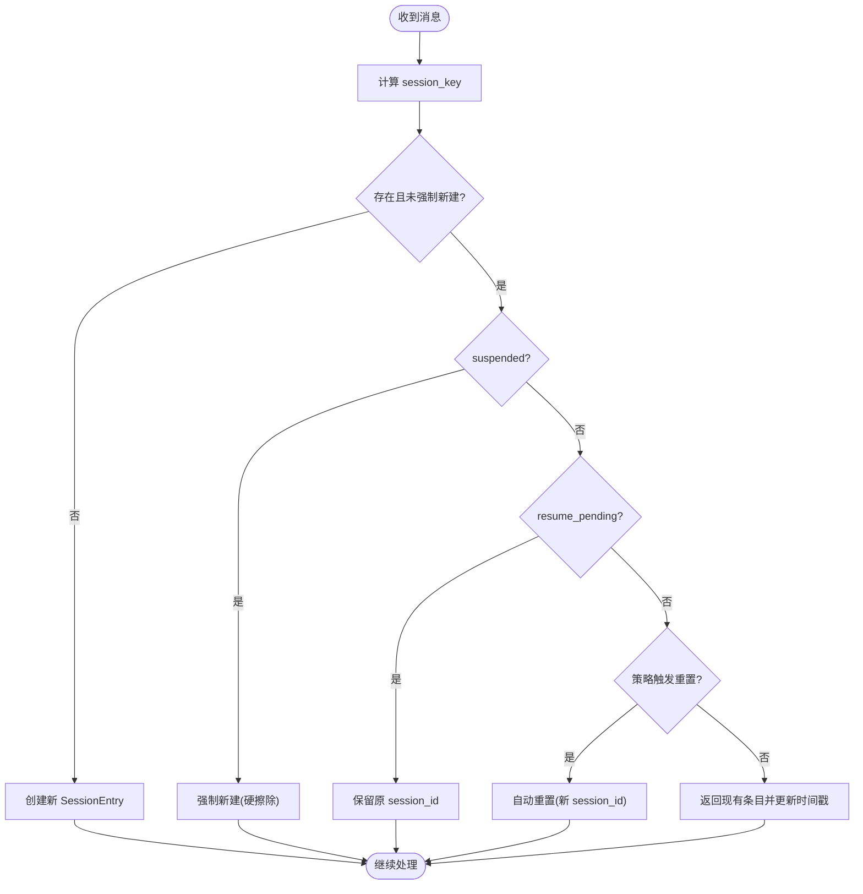
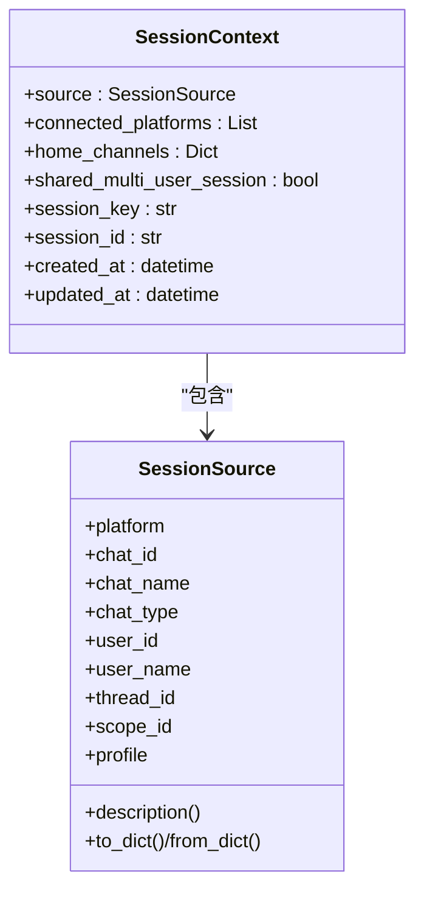
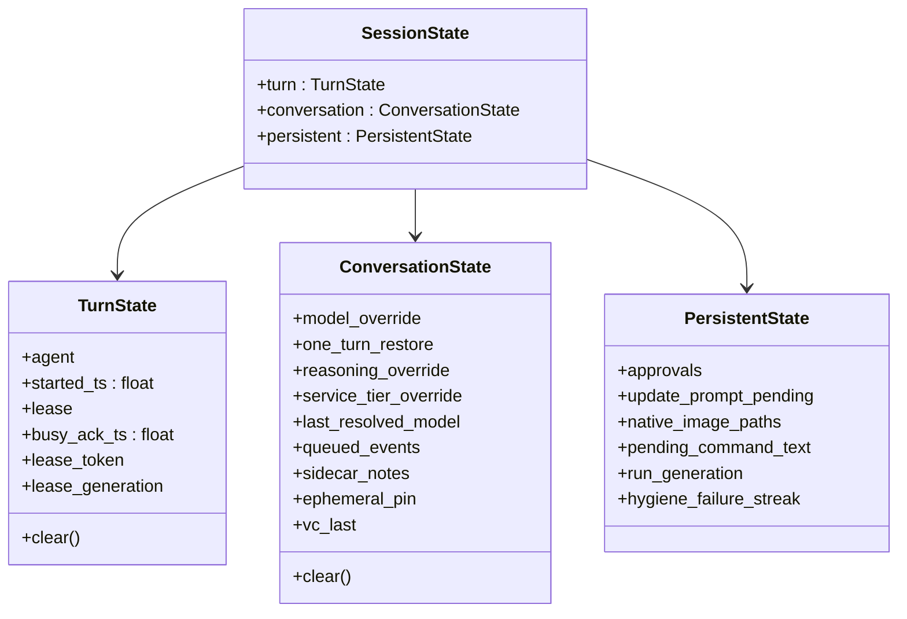
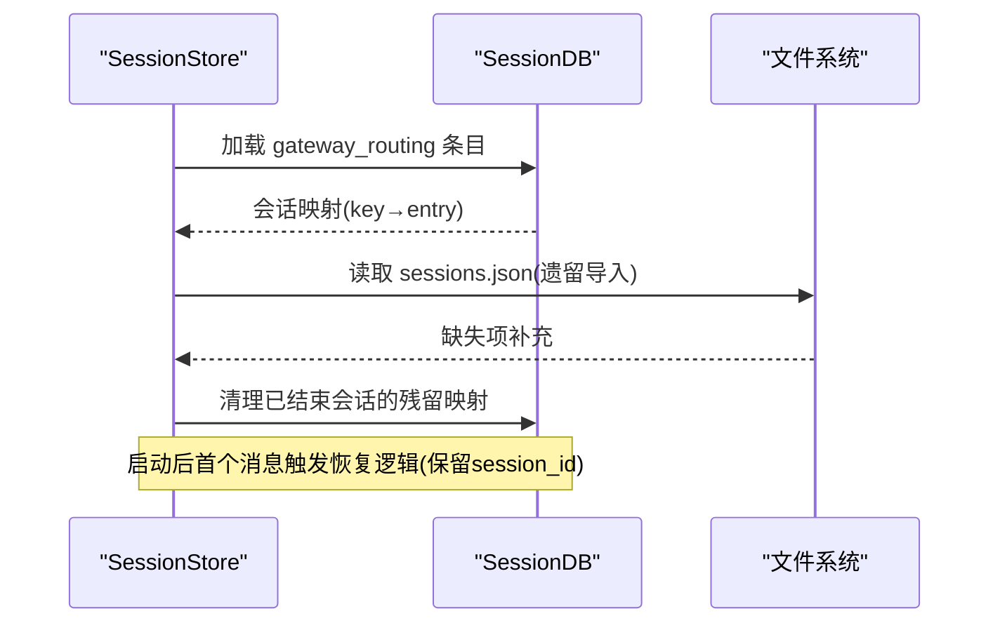
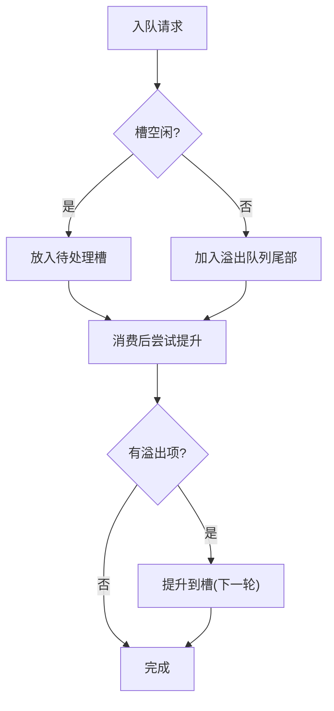
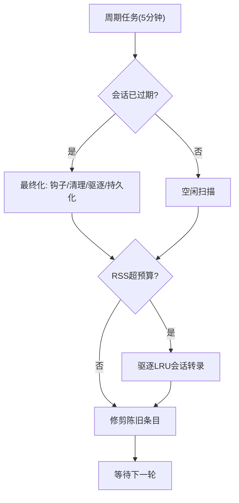
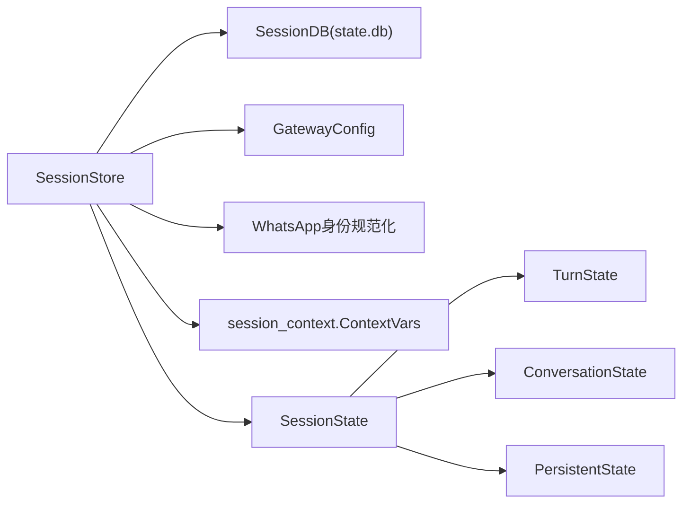

# 会话生命周期管理

<cite>
**本文引用的文件**
- [docs/session-lifecycle.md](file://docs/session-lifecycle.md)
- [gateway/session.py](file://gateway/session.py)
- [gateway/session_state.py](file://gateway/session_state.py)
- [gateway/session_context.py](file://gateway/session_context.py)
- [hermes_state.py](file://hermes_state.py)
</cite>

## 目录
1. [简介](#简介)
2. [项目结构](#项目结构)
3. [核心组件](#核心组件)
4. [架构总览](#架构总览)
5. [详细组件分析](#详细组件分析)
6. [依赖关系分析](#依赖关系分析)
7. [性能考量](#性能考量)
8. [故障排查指南](#故障排查指南)
9. [结论](#结论)
10. [附录](#附录)

## 简介
本文件系统性阐述 Hermes Agent 的会话生命周期管理，覆盖从创建、初始化、激活、暂停、恢复到销毁的全流程；解释活跃会话、历史会话、归档会话等状态的管理机制；说明基于用户输入、定时任务或平台消息的会话生成策略；提供持久化、上下文保存与恢复的实现要点；并给出清理策略（内存释放、文件清理、资源回收）与最佳实践。

## 项目结构
Hermes 的会话生命周期由网关层与状态存储层协同实现：
- 网关层负责会话路由、状态机、缓存与后台维护（过期、内存压力、队列）。
- 状态存储层负责会话元数据与消息转录的持久化（SQLite + FTS5），并提供恢复与搜索能力。

图表来源
- [gateway/session.py:1235-1599](file://gateway/session.py#L1235-L1599)
- [gateway/session_state.py:51-178](file://gateway/session_state.py#L51-L178)
- [gateway/session_context.py:74-148](file://gateway/session_context.py#L74-L148)
- [hermes_state.py:1-15](file://hermes_state.py#L1-L15)

章节来源
- [docs/session-lifecycle.md:1-20](file://docs/session-lifecycle.md#L1-L20)
- [gateway/session.py:1235-1599](file://gateway/session.py#L1235-L1599)
- [gateway/session_state.py:51-178](file://gateway/session_state.py#L51-L178)
- [gateway/session_context.py:74-148](file://gateway/session_context.py#L74-L148)
- [hermes_state.py:1-15](file://hermes_state.py#L1-L15)

## 核心组件
- 会话源与会话上下文
  - SessionSource：描述消息来源（平台、聊天ID、线程、用户等），用于路由与上下文注入。
  - SessionContext：构建系统提示所需的上下文信息（连接平台、家庭频道、是否多用户共享等）。
- 会话条目与会话存储
  - SessionEntry：会话元数据与状态标志（是否自动重置、是否挂起、是否待恢复等）。
  - SessionStore：会话索引与操作（创建/获取、重置、切换、挂起、恢复标记、清理、转录读写）。
- 会话状态容器
  - SessionState：按作用域组织状态（turn、conversation、persistent），统一生命周期边界。
- 会话上下文变量
  - ContextVar 集合：以任务局部的方式绑定平台、聊天、用户、会话键/ID、消息ID等，避免并发污染。
- 持久化存储
  - hermes_state.SessionDB：SQLite 存储会话元数据与消息转录，支持 FTS5 全文检索、压缩拆分链、WAL 模式与兼容性回退。

章节来源
- [gateway/session.py:148-347](file://gateway/session.py#L148-L347)
- [gateway/session.py:773-1003](file://gateway/session.py#L773-L1003)
- [gateway/session.py:1235-1599](file://gateway/session.py#L1235-L1599)
- [gateway/session_state.py:51-178](file://gateway/session_state.py#L51-L178)
- [gateway/session_context.py:74-148](file://gateway/session_context.py#L74-L148)
- [hermes_state.py:1-15](file://hermes_state.py#L1-L15)

## 架构总览
下图展示一次消息进入后的关键路径：会话键生成 → 获取/创建会话 → 上下文绑定 → 运行对话 → 转录写入 → 缓存更新 → 后台维护。

图表来源
- [gateway/session.py:1235-1599](file://gateway/session.py#L1235-L1599)
- [gateway/session_context.py:206-271](file://gateway/session_context.py#L206-L271)
- [hermes_state.py:1-15](file://hermes_state.py#L1-L15)

## 详细组件分析

### 会话创建与状态机
- 会话键生成
  - 依据平台、聊天类型、聊天ID、线程ID、参与者ID以及可选的多用户隔离策略，生成确定性键。
  - DM 始终私有；群组/频道默认按用户隔离；线程默认共享（可配置）。
- 获取/创建会话
  - 优先级：挂起(suspended)强制新建 → 待恢复(resume_pending)保留原会话ID → 策略触发自动重置 → 返回现有条目并更新时间戳。
  - 自动重置会结束旧会话、生成新ID、记录原因并在首次消息时注入上下文提示。
- 多用户共享策略
  - 根据 chat_type、thread_id 与配置决定是否为共享会话，影响系统提示中用户标识的注入方式。

图表来源
- [docs/session-lifecycle.md:99-141](file://docs/session-lifecycle.md#L99-L141)
- [gateway/session.py:1087-1208](file://gateway/session.py#L1087-L1208)
- [gateway/session.py:773-1003](file://gateway/session.py#L773-L1003)

章节来源
- [docs/session-lifecycle.md:23-141](file://docs/session-lifecycle.md#L23-L141)
- [gateway/session.py:1087-1208](file://gateway/session.py#L1087-L1208)
- [gateway/session.py:773-1003](file://gateway/session.py#L773-L1003)

### 会话上下文与上下文变量
- 会话上下文构建
  - 收集已连接平台、家庭频道、是否多用户共享，并附加会话元数据（key/id/时间戳）。
  - 动态系统提示段可开启PII脱敏（对安全平台进行哈希替换）。
- 上下文变量
  - 使用 ContextVar 将平台、聊天、用户、会话键/ID、消息ID等绑定到当前任务，避免并发污染。
  - 提供设置、清除、重置接口，确保任务边界内上下文正确隔离。

图表来源
- [gateway/session.py:148-347](file://gateway/session.py#L148-L347)
- [gateway/session_context.py:74-148](file://gateway/session_context.py#L74-L148)

章节来源
- [gateway/session.py:314-347](file://gateway/session.py#L314-L347)
- [gateway/session_context.py:74-148](file://gateway/session_context.py#L74-L148)

### 会话状态容器与作用域
- TurnState：单次运行的会话轮次状态（agent实例、开始时间、租约、忙确认等），在每轮结束时清理。
- ConversationState：跨轮次但会话边界内有效的状态（模型覆盖、推理覆盖、服务层级、队列溢出、侧车备注、临时固定、语音频道上下文等），在会话边界清理。
- PersistentState：独立生命周期的状态（审批、更新提示、原生图片路径、待处理命令文本、运行代数、卫生压缩失败计数等），不随轮次/边界整体重置。

图表来源
- [gateway/session_state.py:51-178](file://gateway/session_state.py#L51-L178)

章节来源
- [gateway/session_state.py:51-178](file://gateway/session_state.py#L51-L178)

### 持久化与恢复
- 存储布局
  - SQLite（state.db）为主存储，承载会话元数据与消息转录，启用 WAL 模式与 FTS5 全文检索。
  - sessions.json 作为路由索引镜像（可配置关闭），启动时从 DB 加载并合并遗留条目。
- 启动恢复
  - 若无干净退出标记，则标记最近活跃的会话为“待恢复”，并在下次访问时保留原会话ID继续转录。
  - 检测卡住循环（连续多次重启仍活跃）并强制挂起，防止无限恢复。
- 转录与回溯
  - 支持追加、重写、回溯（软删除保留审计轨迹）、导出限制与保护。

图表来源
- [gateway/session.py:1316-1425](file://gateway/session.py#L1316-L1425)
- [hermes_state.py:1-15](file://hermes_state.py#L1-L15)

章节来源
- [docs/session-lifecycle.md:345-440](file://docs/session-lifecycle.md#L345-L440)
- [gateway/session.py:1316-1425](file://gateway/session.py#L1316-L1425)
- [hermes_state.py:1-15](file://hermes_state.py#L1-L15)

### 消息队列与FIFO
- 单槽待处理 + 溢出队列
  - 同一会话仅一个“下一个”消息槽，重复发送折叠为一次。
  - 溢出队列保证每个 /queue 命令产生完整一轮代理响应，顺序严格 FIFO。
- 入队/出队/提升
  - 入队：若槽空闲则放入；否则加入溢出尾。
  - 出队：消费后若有溢出项，按序提升；无适配器可用时退回溢出队列。

图表来源
- [docs/session-lifecycle.md:443-500](file://docs/session-lifecycle.md#L443-L500)

章节来源
- [docs/session-lifecycle.md:443-500](file://docs/session-lifecycle.md#L443-L500)

### 后台维护：过期、清理与内存压力
- 过期检查
  - 周期性任务评估会话是否达到空闲/每日重置阈值，调用插件钩子、清理缓存、终止工具资源、提升状态行结束原因。
- 缓存清理
  - LRU 缓存上限与空闲 TTL；内存压力下按最少近期使用驱逐，必要时执行 malloc_trim 归还内存。
- 陈旧条目修剪
  - 按配置天数清理 sessions.json 中的陈旧条目，防止膨胀。

图表来源
- [docs/session-lifecycle.md:539-651](file://docs/session-lifecycle.md#L539-L651)

章节来源
- [docs/session-lifecycle.md:539-651](file://docs/session-lifecycle.md#L539-L651)

### 会话清理策略与最佳实践
- 内存释放
  - 通过过期最终化与内存压力驱逐释放 AIAgent 及其转录占用；必要时调用系统级内存回收。
- 文件清理
  - 定期修剪 sessions.json 中的陈旧条目；SQLite 主存储通过结束原因与压缩拆分链管理历史。
- 资源回收
  - 会话最终化阶段关闭工具资源、停止内存提供者、清空每会话覆盖配置。
- 最佳实践
  - 明确会话键生成规则与多用户隔离策略，避免上下文泄漏。
  - 合理设置空闲/每日重置策略，平衡用户体验与成本。
  - 利用恢复机制保障中断会话连续性，同时防范卡住循环。
  - 监控内存压力与缓存命中率，调整上限与TTL。

章节来源
- [docs/session-lifecycle.md:294-343](file://docs/session-lifecycle.md#L294-L343)
- [docs/session-lifecycle.md:539-651](file://docs/session-lifecycle.md#L539-L651)
- [gateway/session.py:1235-1599](file://gateway/session.py#L1235-L1599)

## 依赖关系分析
- 模块耦合
  - SessionStore 依赖 hermes_state.SessionDB 进行持久化；依赖 GatewayConfig 进行策略判断；依赖平台与WhatsApp身份规范化。
  - SessionState 聚合 turn/conversation/persistent 三类状态，减少分散字典带来的边界漂移。
  - session_context 提供任务局部上下文，避免并发下的环境变量污染。
- 外部依赖
  - SQLite WAL 模式与兼容回退；FTS5 全文检索；psutil 进程存活探测（压缩锁持有者）。

图表来源
- [gateway/session.py:1235-1599](file://gateway/session.py#L1235-L1599)
- [gateway/session_state.py:51-178](file://gateway/session_state.py#L51-L178)
- [gateway/session_context.py:74-148](file://gateway/session_context.py#L74-L148)
- [hermes_state.py:1-15](file://hermes_state.py#L1-L15)

章节来源
- [gateway/session.py:1235-1599](file://gateway/session.py#L1235-L1599)
- [gateway/session_state.py:51-178](file://gateway/session_state.py#L51-L178)
- [gateway/session_context.py:74-148](file://gateway/session_context.py#L74-L148)
- [hermes_state.py:1-15](file://hermes_state.py#L1-L15)

## 性能考量
- 缓存策略
  - LRU 上限与空闲 TTL 控制 AIAgent 数量与驻留时间；内存压力下按 MRU 保护最近会话，逐步驱逐较冷会话转录。
- 转录与搜索
  - SQLite WAL 提高并发读性能；FTS5 加速全文检索；压缩拆分链避免单会话过大。
- 文件系统与数据库
  - NFS/SMB/ZFS 等场景可能触发 WAL 回退至 DELETE 模式；macOS 下启用 checkpoint_fullfsync 与 synchronous=FULL 增强一致性。
- 队列与吞吐
  - 单槽+溢出队列设计降低并发冲突，保证 FIFO 语义；批量写入与原子替换减少竞争。

章节来源
- [docs/session-lifecycle.md:578-651](file://docs/session-lifecycle.md#L578-L651)
- [hermes_state.py:486-795](file://hermes_state.py#L486-L795)

## 故障排查指南
- 启动恢复异常
  - 检查 .clean_shutdown 标记是否存在；查看最近活跃会话是否被标记为 resume_pending；确认卡住循环检测是否触发挂起。
- 会话无法恢复
  - 验证 state.db 中对应 session_id 的 end_reason；检查 sessions.json 映射是否指向已结束会话；必要时手动修复或重建。
- 内存压力过高
  - 调整 agent.agent_cache.memory_high_mb、max_size、idle_ttl_secs；观察 RSS 与驱逐次数；必要时增加保护最近会话数。
- 数据库不可用
  - 关注 WAL 兼容性与错误信息；在 NFS/SMB/ZFS 环境考虑回退 journal_mode；macOS 下确保同步参数正确。

章节来源
- [docs/session-lifecycle.md:345-440](file://docs/session-lifecycle.md#L345-L440)
- [hermes_state.py:674-795](file://hermes_state.py#L674-L795)

## 结论
Hermes 的会话生命周期管理通过清晰的键生成、稳健的状态机、可靠的持久化与恢复、精细的缓存与清理策略，实现了高可用、可扩展的会话处理能力。开发者应遵循上述最佳实践，结合业务场景调优策略与资源配置，以获得稳定高效的体验。

## 附录
- 关键配置参考
  - 会话重置策略：mode（none/idle/daily/both）、at_hour、idle_minutes、notify。
  - 缓存与内存：max_size、idle_ttl_secs、memory_high_mb、max_evictions_per_pass、protect_recent。
  - 其他：group_sessions_per_user、thread_sessions_per_user、session_store_max_age_days、gateway_auto_continue_freshness、gateway_timeout。

章节来源
- [docs/session-lifecycle.md:654-680](file://docs/session-lifecycle.md#L654-L680)