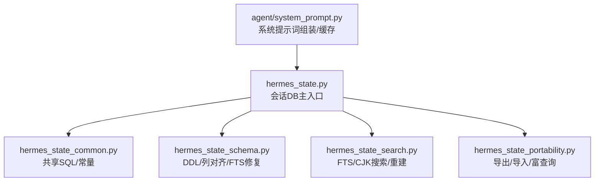
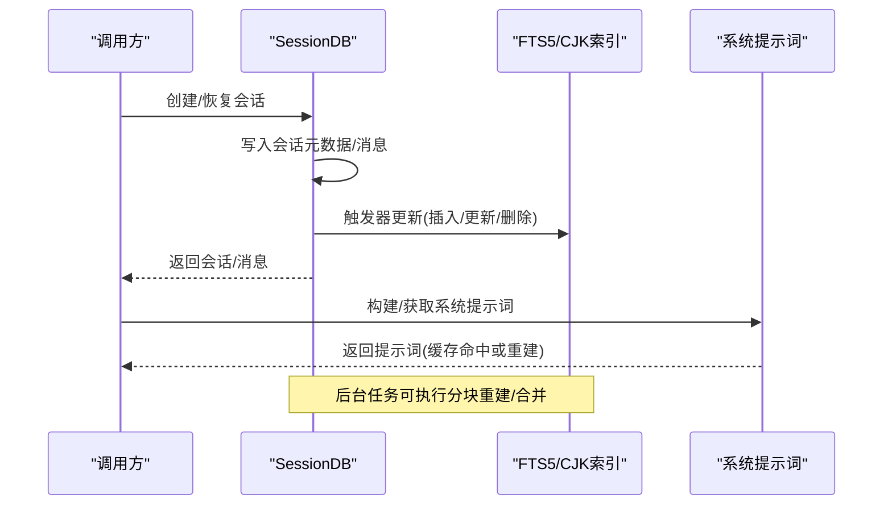
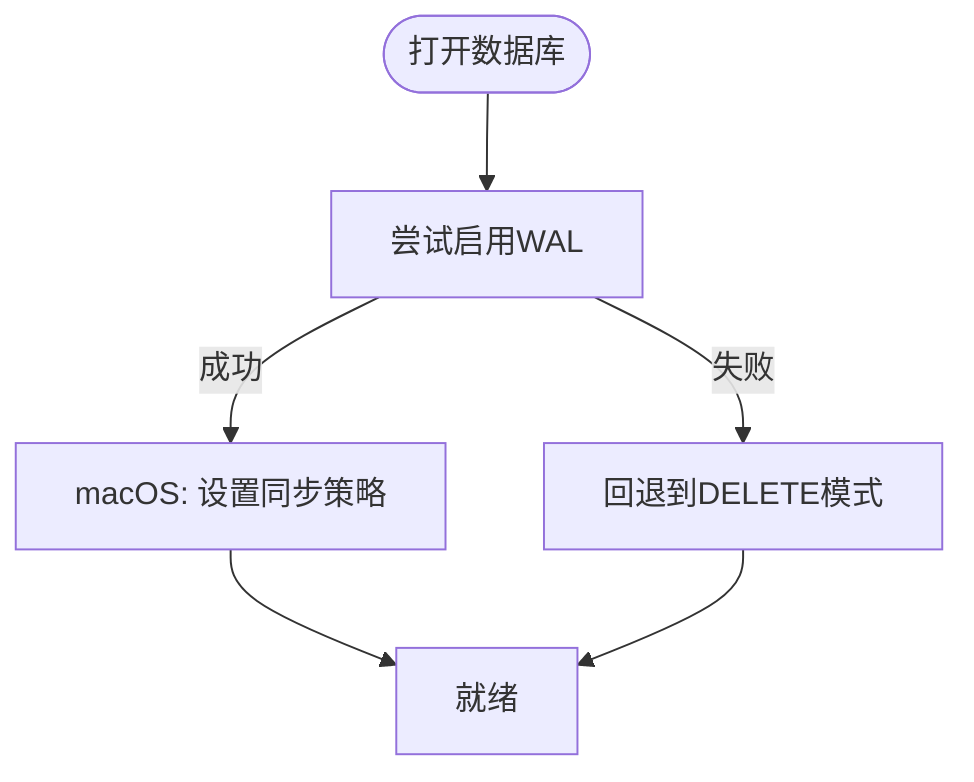
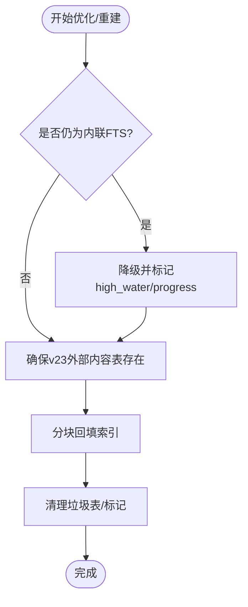
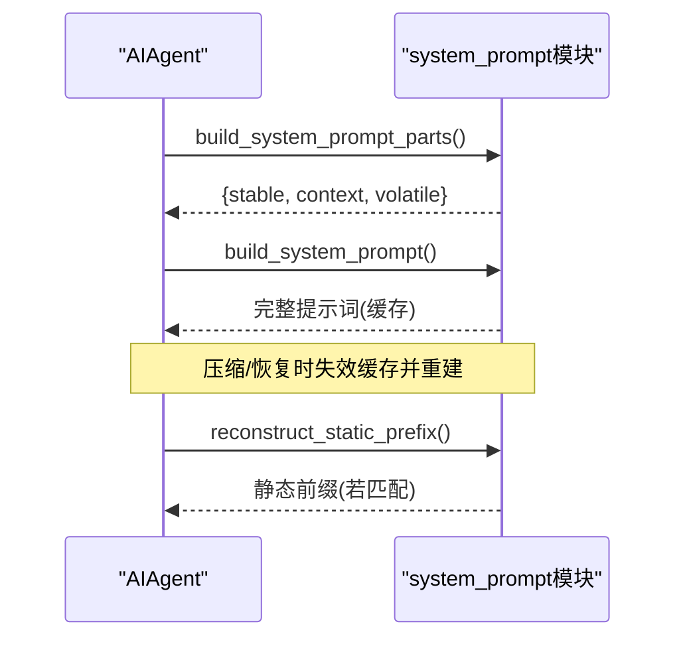
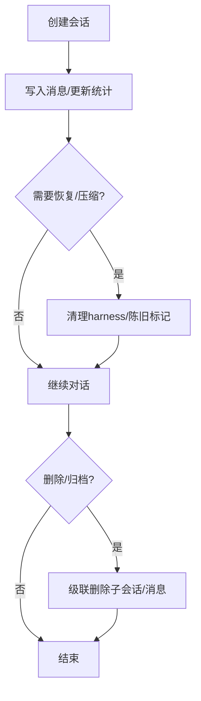
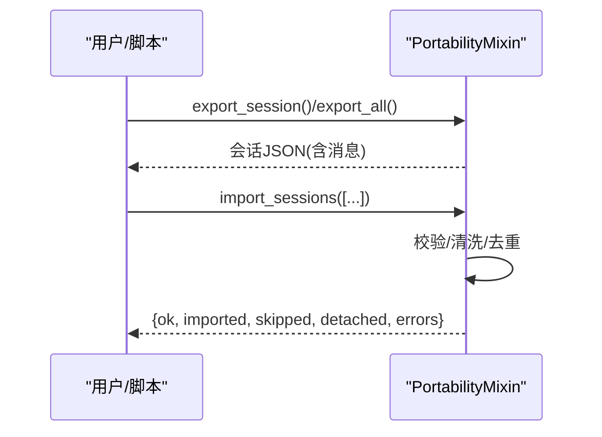
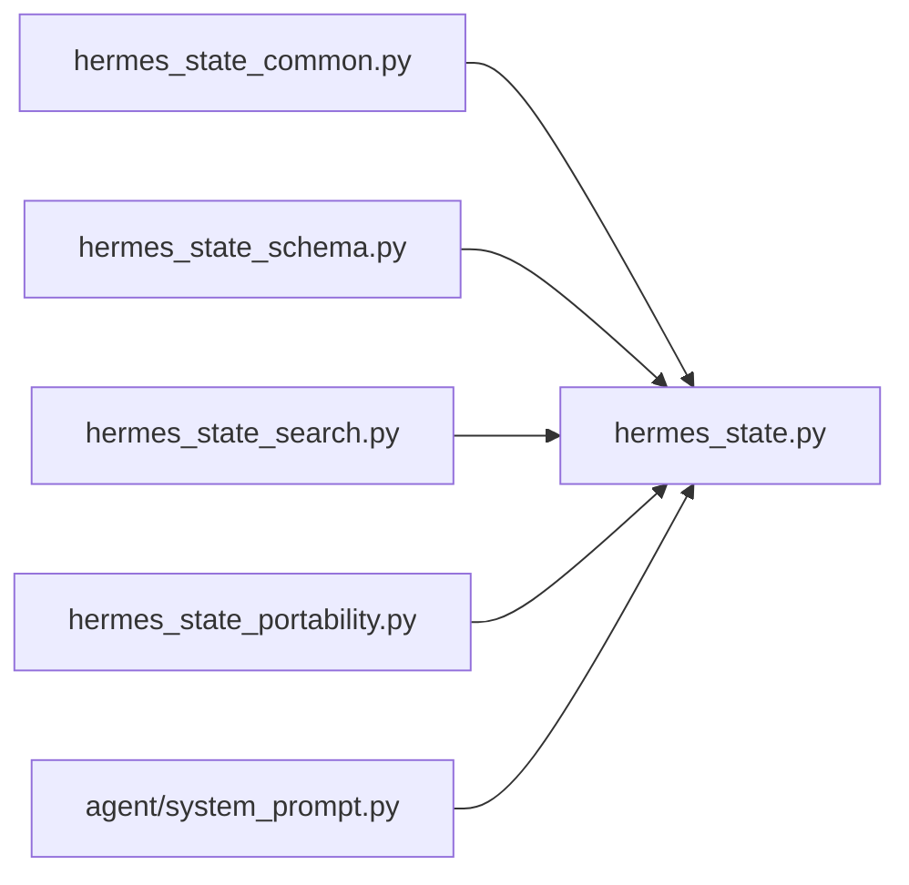

# 会话状态管理

<cite>
**本文引用的文件**
- [hermes_state.py](file://hermes_state.py)
- [hermes_state_common.py](file://hermes_state_common.py)
- [hermes_state_schema.py](file://hermes_state_schema.py)
- [hermes_state_search.py](file://hermes_state_search.py)
- [hermes_state_portability.py](file://hermes_state_portability.py)
- [agent/system_prompt.py](file://agent/system_prompt.py)
</cite>

## 目录
1. [简介](#简介)
2. [项目结构](#项目结构)
3. [核心组件](#核心组件)
4. [架构总览](#架构总览)
5. [详细组件分析](#详细组件分析)
6. [依赖关系分析](#依赖关系分析)
7. [性能考虑](#性能考虑)
8. [故障排查指南](#故障排查指南)
9. [结论](#结论)
10. [附录](#附录)

## 简介
本文件系统性阐述 Hermes Agent 的会话状态管理机制，重点覆盖：
- SQLite 持久化存储、WAL/DELETE 模式兼容与回退策略
- 全文检索（FTS5）与 CJK 三元索引的构建、重建与版本管理
- 系统提示词（system prompt）的缓存、重建与兼容性检查
- 会话生命周期：创建、保存、恢复、清理与分支/压缩链管理
- 数据迁移、备份与恢复流程
- 性能优化：批量操作、索引优化、内存与并发控制
- 扩展点与最佳实践

## 项目结构
Hermes 的状态层由一组可复用的 Mixin 组成，围绕一个统一的 SessionDB 宿主类组织：
- hermes_state.py：主入口，定义默认数据库路径、WAL 兼容、测试隔离保护、错误信息格式化等
- hermes_state_common.py：共享常量与 SQL（表结构、索引、FTS DDL、预览计算等）
- hermes_state_schema.py：DDL 与列对齐、FTS 触发器修复、历史 PK 修复、初始化流程
- hermes_state_search.py：FTS/CJK 搜索、增量合并、分块重建、垃圾表清理、优化入口
- hermes_state_portability.py：导出/导入、富查询行、技能脚手架会话查询等
- agent/system_prompt.py：系统提示词组装、分层缓存、重建与静态前缀恢复

图表来源
- [hermes_state.py:1-120](file://hermes_state.py#L1-L120)
- [hermes_state_common.py:197-393](file://hermes_state_common.py#L197-L393)
- [hermes_state_schema.py:619-700](file://hermes_state_schema.py#L619-L700)
- [hermes_state_search.py:625-800](file://hermes_state_search.py#L625-L800)
- [hermes_state_portability.py:266-715](file://hermes_state_portability.py#L266-L715)
- [agent/system_prompt.py:152-595](file://agent/system_prompt.py#L152-L595)

章节来源
- [hermes_state.py:1-120](file://hermes_state.py#L1-L120)
- [hermes_state_common.py:197-393](file://hermes_state_common.py#L197-L393)

## 核心组件
- 会话数据库（SessionDB）：基于 SQLite，支持 WAL 模式与跨平台并发；提供消息写入、会话元数据、模型配置、使用统计、路由与异步委托等能力。
- 全文检索（FTS5）：标准文本索引 + CJK 三元索引，支持外部内容表、触发器、分块重建与垃圾表清理。
- 系统提示词：三层拼装（稳定/上下文/易变），按会话缓存，压缩或恢复时重建，并维护静态前缀以最大化上游提示缓存命中。
- 可移植性：导出/导入会话及消息，校验字段类型与大小限制，处理父子会话关系与循环检测。

章节来源
- [hermes_state.py:1-120](file://hermes_state.py#L1-L120)
- [hermes_state_common.py:197-393](file://hermes_state_common.py#L197-L393)
- [hermes_state_search.py:625-800](file://hermes_state_search.py#L625-L800)
- [hermes_state_portability.py:266-715](file://hermes_state_portability.py#L266-L715)
- [agent/system_prompt.py:152-595](file://agent/system_prompt.py#L152-L595)

## 架构总览
下图展示会话状态在运行时的关键交互：应用调用 SessionDB 进行会话读写，FTS 通过触发器与后台任务维护索引，系统提示词在会话内缓存并在必要时重建。

图表来源
- [hermes_state.py:1-120](file://hermes_state.py#L1-L120)
- [hermes_state_search.py:625-800](file://hermes_state_search.py#L625-L800)
- [agent/system_prompt.py:152-595](file://agent/system_prompt.py#L152-L595)

## 详细组件分析

### SQLite 存储与 WAL 兼容
- 默认数据库路径解析与测试隔离保护，防止在 pytest 环境下误写生产 state.db。
- WAL 模式优先，但在 NFS/SMB/FUSE/ZFS 等文件系统上遇到锁协议或 I/O 错误时自动回退到 DELETE 模式，保证功能可用。
- macOS 下启用 checkpoint_fullfsync 与 synchronous=FULL，降低关机/重启导致的 WAL 损坏风险。
- 记录最近一次初始化失败原因，便于 /resume 等命令输出友好错误信息。

图表来源
- [hermes_state.py:485-565](file://hermes_state.py#L485-L565)
- [hermes_state.py:718-780](file://hermes_state.py#L718-L780)

章节来源
- [hermes_state.py:333-565](file://hermes_state.py#L333-L565)
- [hermes_state.py:718-780](file://hermes_state.py#L718-L780)

### 表结构与索引
- 核心表：sessions、messages、session_model_usage、state_meta、gateway_routing、compression_locks、async_delegations。
- 索引：按 source、parent_session_id、started_at、session_id+timestamp、active 等维度优化常见查询。
- 延迟索引：针对新增列（如 active）的索引在列对齐后创建，避免旧库 DDL 失败。

章节来源
- [hermes_state_common.py:197-393](file://hermes_state_common.py#L197-L393)
- [hermes_state_schema.py:619-700](file://hermes_state_schema.py#L619-L700)

### 全文检索（FTS5）与 CJK 索引
- v23 外部内容表：messages_fts 与 messages_fts_trigram（CJK 三元），通过触发器保持与 messages 一致。
- 分块重建：通过 state_meta 中的 high_water/progress 标记实现断点续传，避免长时间锁定。
- 垃圾表清理：v22 内联 FTS 降级为普通表并分块删除，释放空间。
- CJK 重建：当 tokenizer 不可用导致触发器被丢弃时，标记 stale 并重建。

图表来源
- [hermes_state_search.py:625-800](file://hermes_state_search.py#L625-L800)
- [hermes_state_common.py:415-534](file://hermes_state_common.py#L415-L534)

章节来源
- [hermes_state_search.py:69-160](file://hermes_state_search.py#L69-L160)
- [hermes_state_search.py:264-331](file://hermes_state_search.py#L264-L331)
- [hermes_state_search.py:332-421](file://hermes_state_search.py#L332-L421)
- [hermes_state_search.py:625-800](file://hermes_state_search.py#L625-L800)
- [hermes_state_common.py:415-534](file://hermes_state_common.py#L415-L534)

### 系统提示词管理与 _restore_or_build_system_prompt
- 三层拼装：stable（身份/工具指导/环境提示）、context（工作区快照/上下文文件）、volatile（技能索引/记忆快照/时间戳）。
- 会话级缓存：build_system_prompt 将完整提示词缓存于 agent，仅在压缩/恢复等事件重建。
- 静态前缀恢复：reconstruct_static_prefix 在恢复已存储提示词时重建 stable 前缀，若匹配则复用上游提示缓存。
- 兼容性检查：仅当存储提示词确实以当前 stable 前缀开头时才采用，否则回退到传统布局，避免改写提示词。

图表来源
- [agent/system_prompt.py:152-595](file://agent/system_prompt.py#L152-L595)
- [agent/system_prompt.py:598-662](file://agent/system_prompt.py#L598-L662)

章节来源
- [agent/system_prompt.py:152-595](file://agent/system_prompt.py#L152-L595)
- [agent/system_prompt.py:598-662](file://agent/system_prompt.py#L598-L662)

### 会话生命周期管理
- 创建：生成 session id、source、model、model_config、system_prompt_hash 等元数据，写入 sessions 表。
- 保存：消息写入 messages 表，FTS 触发器同步更新；统计 token 计数与成本。
- 恢复：从 sessions/messages 加载历史，必要时清理背景审查 harness 消息与陈旧工具调用标记。
- 清理：删除子会话（包括委托子代理）及其消息，维护 parent_session_id 与归档/分支语义。

图表来源
- [hermes_state.py:577-671](file://hermes_state.py#L577-L671)
- [hermes_state.py:285-329](file://hermes_state.py#L285-L329)

章节来源
- [hermes_state.py:577-671](file://hermes_state.py#L577-L671)
- [hermes_state.py:285-329](file://hermes_state.py#L285-L329)

### 数据迁移与版本管理
- 列对齐：_reconcile_columns 对比 SCHEMA_SQL 与真实表结构，自动 ADD COLUMN，消除版本门控迁移对列添加的需求。
- 历史 PK 修复：gateway_routing 与 session_model_usage 的主键变更通过重建表修复，保留数据并去重。
- FTS 版本：FTS_STORAGE_VERSION 独立跟踪存储布局；optimize_fts_storage 将内联 FTS 迁移至外部内容表并重建索引。

章节来源
- [hermes_state_schema.py:382-425](file://hermes_state_schema.py#L382-L425)
- [hermes_state_schema.py:426-618](file://hermes_state_schema.py#L426-L618)
- [hermes_state_search.py:734-800](file://hermes_state_search.py#L734-L800)
- [hermes_state_common.py:167-178](file://hermes_state_common.py#L167-L178)

### 备份与恢复（导出/导入）
- 导出：export_session/export_all 将会话与消息序列化为字典列表，支持 lineage 聚合。
- 导入：import_sessions 严格校验字段类型、大小限制与 JSON 合法性；处理父子关系与循环检测；重置活动状态以避免残留“工作中”标签。
- 安全：跳过重复 session id，限制单次导入总量与单会话消息数，保障稳定性。

图表来源
- [hermes_state_portability.py:266-715](file://hermes_state_portability.py#L266-L715)

章节来源
- [hermes_state_portability.py:266-715](file://hermes_state_portability.py#L266-L715)

## 依赖关系分析
- 模块耦合：hermes_state 作为宿主，组合 schema/search/portability 三个 Mixin；common 提供共享 SQL/常量，避免循环导入。
- 外部依赖：SQLite（FTS5、trigram 可选）、psutil（进程存活探测）、hermes_constants（HERMES_HOME）。
- 集成点：gateway/web_server/cli 通过 SessionDB 访问状态；agent/system_prompt 与 AIAgent 协作维持提示词缓存。

图表来源
- [hermes_state.py:1-120](file://hermes_state.py#L1-L120)
- [hermes_state_common.py:1-15](file://hermes_state_common.py#L1-L15)
- [hermes_state_schema.py:1-33](file://hermes_state_schema.py#L1-L33)
- [hermes_state_search.py:1-33](file://hermes_state_search.py#L1-L33)
- [hermes_state_portability.py:1-29](file://hermes_state_portability.py#L1-L29)
- [agent/system_prompt.py:1-24](file://agent/system_prompt.py#L1-L24)

章节来源
- [hermes_state.py:1-120](file://hermes_state.py#L1-L120)
- [hermes_state_common.py:1-15](file://hermes_state_common.py#L1-L15)

## 性能考虑
- 批量操作：富查询批量获取会话（_get_session_rich_rows_batch）按 900 条分片，避免 SQLite 变量上限；导入会话批量写入并统计总数。
- 索引优化：按 session_id、timestamp、active、source、handoff_state 等高频条件建立索引；部分索引延迟创建以兼容旧库。
- 内存管理：导出/恢复限制最大消息数与总字节数；FTS 重建分块推进，避免长事务与大对象驻留。
- 并发与锁：WAL 模式提升并发读；写路径使用锁与 BEGIN IMMEDIATE 事务；FTS 重建步骤原子提交进度。
- 平台特性：macOS 强制 FULL fsync 与 checkpoint_fullfsync，降低崩溃后损坏概率；NFS/SMB 回退 DELETE 模式保证可用性。

章节来源
- [hermes_state_portability.py:146-210](file://hermes_state_portability.py#L146-L210)
- [hermes_state_portability.py:376-715](file://hermes_state_portability.py#L376-L715)
- [hermes_state_search.py:264-331](file://hermes_state_search.py#L264-L331)
- [hermes_state.py:485-565](file://hermes_state.py#L485-L565)
- [hermes_state.py:718-780](file://hermes_state.py#L718-L780)

## 故障排查指南
- 会话数据库不可用：使用 format_session_db_unavailable 输出具体原因（如 NFS/SMB 锁协议错误），并给出建议。
- FTS 不可用：_sqlite_supports_fts5 探测 FTS5/trigram 可用性；不可用时降级搜索或标记 stale。
- 重建中断：fts_rebuild_status/fts_cjk_rebuild_status 查看进度；fts_rebuild_step/fts_cjk_rebuild_step 继续分块回填。
- 垃圾表残留：_fts_teardown_trash_step 分块删除旧 FTS 影子表，最终 DROP。
- 测试隔离：pytest 下禁止打开生产 state.db，避免污染真实数据。

章节来源
- [hermes_state.py:674-695](file://hermes_state.py#L674-L695)
- [hermes_state_schema.py:107-127](file://hermes_state_schema.py#L107-L127)
- [hermes_state_search.py:83-160](file://hermes_state_search.py#L83-L160)
- [hermes_state_search.py:161-263](file://hermes_state_search.py#L161-L263)
- [hermes_state.py:460-484](file://hermes_state.py#L460-L484)

## 结论
Hermes 的会话状态管理以 SQLite 为核心，结合 FTS5/CJK 索引、严格的列对齐与版本管理、健壮的系统提示词缓存与重建机制，提供了高可靠、高性能且可扩展的会话持久化方案。通过分块重建、批量操作与平台适配，系统在复杂部署环境中保持稳定与高效。开发者可基于 Mixin 扩展新能力，遵循现有契约与约束，确保向后兼容与可维护性。

## 附录
- 示例路径（不直接展示代码内容）：
  - 会话创建与消息写入：[hermes_state.py:1-120](file://hermes_state.py#L1-L120)
  - FTS 重建入口与状态：[hermes_state_search.py:625-800](file://hermes_state_search.py#L625-L800)
  - 系统提示词组装与缓存：[agent/system_prompt.py:152-595](file://agent/system_prompt.py#L152-L595)
  - 导出/导入会话：[hermes_state_portability.py:266-715](file://hermes_state_portability.py#L266-L715)
  - 表结构与索引定义：[hermes_state_common.py:197-393](file://hermes_state_common.py#L197-L393)