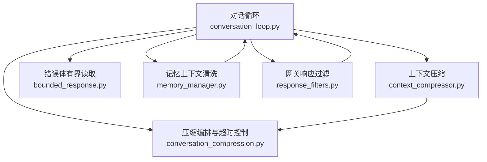
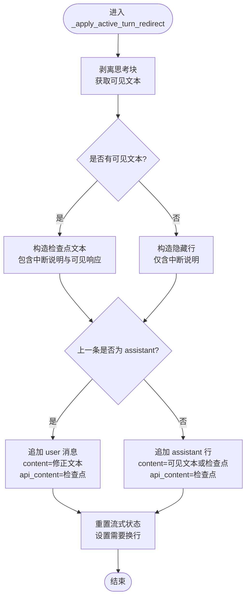
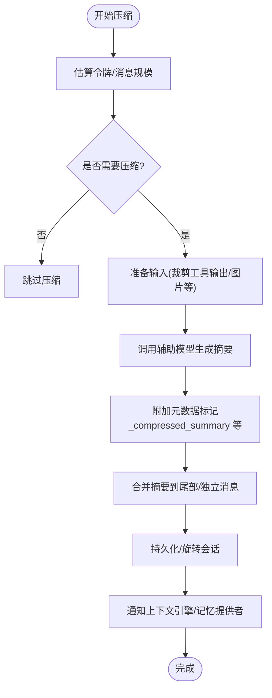
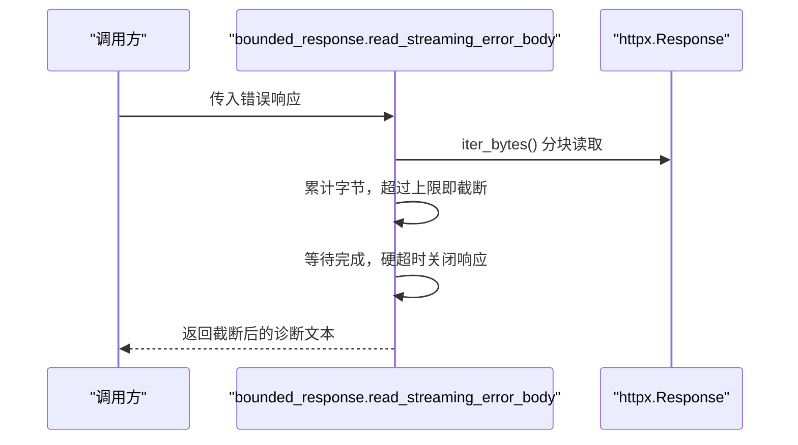
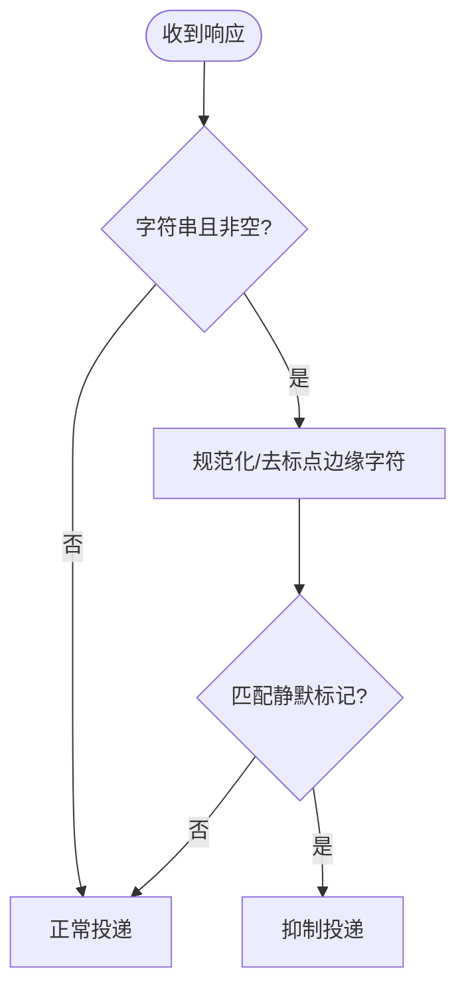
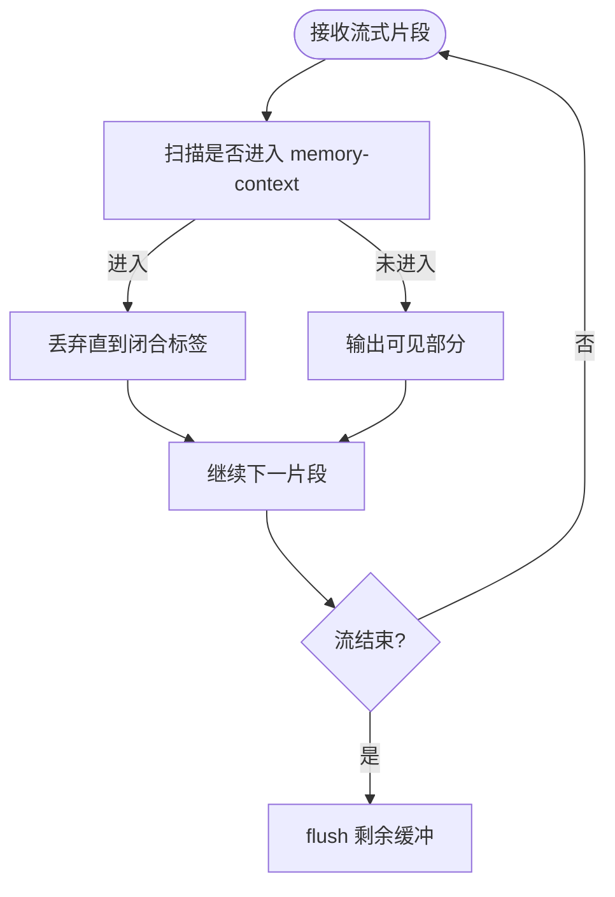
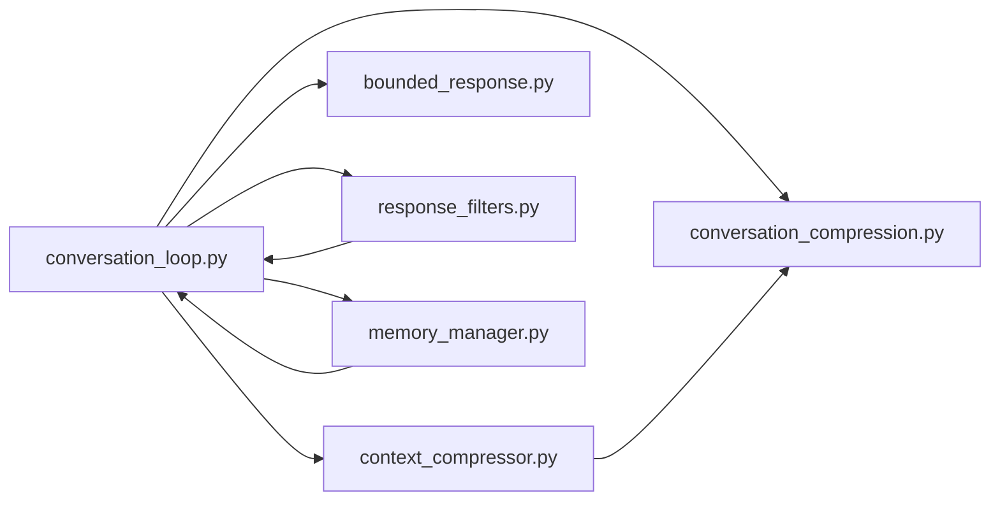

# 响应生成机制

<cite>
**本文引用的文件**
- [conversation_loop.py](file://agent/conversation_loop.py)
- [context_compressor.py](file://agent/context_compressor.py)
- [conversation_compression.py](file://agent/conversation_compression.py)
- [bounded_response.py](file://agent/bounded_response.py)
- [response_filters.py](file://gateway/response_filters.py)
- [memory_manager.py](file://agent/memory_manager.py)
</cite>

## 目录
1. [简介](#简介)
2. [项目结构](#项目结构)
3. [核心组件](#核心组件)
4. [架构总览](#架构总览)
5. [详细组件分析](#详细组件分析)
6. [依赖关系分析](#依赖关系分析)
7. [性能考量](#性能考量)
8. [故障排查指南](#故障排查指南)
9. [结论](#结论)
10. [附录](#附录)

## 简介
本文件聚焦 Hermes Agent 的“响应生成机制”，围绕 AI 模型响应的接收、提取与格式化，重点解释中断/修正场景的处理、可见响应与 API 内容的分离策略，以及上下文压缩与内存管理。文档还给出流式处理、平台适配（CLI/Web/移动端）与扩展自定义输出的实践要点，帮助开发者理解内部工作原理并安全地扩展输出格式。

## 项目结构
围绕响应生成的关键代码分布在以下模块：
- 对话循环与中断修正：agent/conversation_loop.py
- 上下文压缩与摘要：agent/context_compressor.py、agent/conversation_compression.py
- 错误体读取与资源保护：agent/bounded_response.py
- 网关侧响应过滤与静默标记：gateway/response_filters.py
- 记忆系统对响应流的清洗与注入：agent/memory_manager.py



图表来源
- [conversation_loop.py:195-274](file://agent/conversation_loop.py#L195-L274)
- [context_compressor.py:100-179](file://agent/context_compressor.py#L100-L179)
- [conversation_compression.py:91-148](file://agent/conversation_compression.py#L91-L148)
- [bounded_response.py:56-125](file://agent/bounded_response.py#L56-L125)
- [response_filters.py:56-148](file://gateway/response_filters.py#L56-L148)
- [memory_manager.py:182-361](file://agent/memory_manager.py#L182-L361)

章节来源
- [conversation_loop.py:195-274](file://agent/conversation_loop.py#L195-L274)
- [context_compressor.py:100-179](file://agent/context_compressor.py#L100-L179)
- [conversation_compression.py:91-148](file://agent/conversation_compression.py#L91-L148)
- [bounded_response.py:56-125](file://agent/bounded_response.py#L56-L125)
- [response_filters.py:56-148](file://gateway/response_filters.py#L56-L148)
- [memory_manager.py:182-361](file://agent/memory_manager.py#L182-L361)

## 核心组件
- 对话循环与中断修正：负责在用户主动纠正或中断时，将“可见响应”与“供模型重放用的 API 内容”分离，并以 provider-safe 的方式插入检查点与修正消息，避免破坏角色交替与缓存一致性。
- 上下文压缩：通过辅助模型对历史进行摘要，保留头部与尾部关键信息，使用结构化模板与元数据标记，确保摘要不被误认为活跃指令。
- 错误体有界读取：在流式错误响应下限制读取字节与超时，防止内存膨胀与无限阻塞。
- 网关响应过滤：识别“有意沉默”的响应标记，决定是否向聊天投递结果。
- 记忆上下文清洗：在流式响应中剥离内部记忆块与系统提示，保证 UI 仅展示可见内容。

章节来源
- [conversation_loop.py:195-274](file://agent/conversation_loop.py#L195-L274)
- [context_compressor.py:100-179](file://agent/context_compressor.py#L100-L179)
- [conversation_compression.py:91-148](file://agent/conversation_compression.py#L91-L148)
- [bounded_response.py:56-125](file://agent/bounded_response.py#L56-L125)
- [response_filters.py:56-148](file://gateway/response_filters.py#L56-L148)
- [memory_manager.py:182-361](file://agent/memory_manager.py#L182-L361)

## 架构总览
下图展示了从模型流式响应到最终可见输出的关键路径，包括中断修正、压缩、过滤与记忆清洗。

```mermaid
sequenceDiagram
participant User as "用户"
participant Loop as "对话循环<br/>conversation_loop.py"
participant Comp as "上下文压缩<br/>context_compressor.py"
participant Mem as "记忆清洗<br/>memory_manager.py"
participant Gate as "网关过滤<br/>response_filters.py"
participant Err as "错误体读取<br/>bounded_response.py"
User->>Loop : 发送消息
Loop->>Loop : 构建请求/调用模型
Loop-->>Loop : 接收流式片段
alt 用户中断/修正
Loop->>Loop : _apply_active_turn_redirect()
Note over Loop : 分离可见响应与API内容<br/>插入检查点与修正
end
Loop->>Comp : 触发压缩(必要时)
Comp-->>Loop : 返回压缩后消息与摘要
Loop->>Mem : 清洗记忆块/系统提示
Mem-->>Loop : 仅可见文本
Loop->>Gate : 判断是否有意沉默
Gate-->>Loop : 决定投递/抑制
opt 流式错误
Loop->>Err : 读取错误体(限字节/限时)
Err-->>Loop : 诊断文本
end
Loop-->>User : 输出可见响应
```

图表来源
- [conversation_loop.py:195-274](file://agent/conversation_loop.py#L195-L274)
- [context_compressor.py:100-179](file://agent/context_compressor.py#L100-L179)
- [conversation_compression.py:91-148](file://agent/conversation_compression.py#L91-L148)
- [memory_manager.py:182-361](file://agent/memory_manager.py#L182-L361)
- [response_filters.py:56-148](file://gateway/response_filters.py#L56-L148)
- [bounded_response.py:56-125](file://agent/bounded_response.py#L56-L125)

## 详细组件分析

### 组件A：_apply_active_turn_redirect（中断与修正）
该函数用于在用户中断或修正时，将“可见响应”与“供模型重放用的 API 内容”分离，并插入 provider-safe 的检查点与修正消息，保持角色交替与缓存一致性。关键点：
- 仅保留可见文本（已去除思考块），作为 content；将带注释的检查点放入 api_content，供模型重放。
- 若上一条为 assistant，则将检查点与修正合并为用户消息，避免 assistant→assistant 连续。
- 若无可见内容，则整行隐藏显示但保留给模型重放。
- 重置流式状态，确保后续流正确换行。



图表来源
- [conversation_loop.py:195-274](file://agent/conversation_loop.py#L195-L274)

章节来源
- [conversation_loop.py:195-274](file://agent/conversation_loop.py#L195-L274)

### 组件B：上下文压缩与摘要生成
压缩流程由 context_compressor.py 与 conversation_compression.py 协作完成：
- 使用辅助模型对中间历史进行摘要，保留头尾关键信息。
- 摘要前缀明确声明“参考信息，非活跃指令”，避免模型误执行历史任务。
- 使用元数据键（如下划线前缀）区分压缩摘要，避免被下游严格网关拒绝。
- 提供失败回退与冷却期，避免频繁压缩导致抖动。
- 支持滚动微压缩与批量压缩，维护会话稳定性。



图表来源
- [context_compressor.py:100-179](file://agent/context_compressor.py#L100-L179)
- [conversation_compression.py:91-148](file://agent/conversation_compression.py#L91-L148)

章节来源
- [context_compressor.py:100-179](file://agent/context_compressor.py#L100-L179)
- [conversation_compression.py:91-148](file://agent/conversation_compression.py#L91-L148)

### 组件C：流式错误体读取与资源保护
当模型以流式返回错误时，需限制读取大小与时间，避免内存爆炸与挂起：
- 使用线程守护读取器，按字节上限截断，并在硬超时关闭响应。
- 返回解码后的诊断文本，便于上层构建错误信息。
- 不抛出异常，确保错误路径稳定。



图表来源
- [bounded_response.py:56-125](file://agent/bounded_response.py#L56-L125)

章节来源
- [bounded_response.py:56-125](file://agent/bounded_response.py#L56-L125)

### 组件D：网关响应过滤与静默标记
网关层根据响应内容判断是否为“有意沉默”，决定是否投递：
- 支持精确匹配与宽松匹配（自动任务场景）。
- 流式阶段基于前缀判断，避免过早显示可能最终被抑制的标记。



图表来源
- [response_filters.py:56-148](file://gateway/response_filters.py#L56-L148)

章节来源
- [response_filters.py:56-148](file://gateway/response_filters.py#L56-L148)

### 组件E：记忆上下文清洗（流式）
记忆系统在流式响应中注入内部上下文块，需在 UI 层剥离：
- 使用 StreamingContextScrubber 跨 delta 状态机识别并丢弃 <memory-context> 块。
- 同时移除系统提示行，确保仅可见内容输出。
- flush 时丢弃未闭合块，避免泄露内部上下文。



图表来源
- [memory_manager.py:182-361](file://agent/memory_manager.py#L182-L361)

章节来源
- [memory_manager.py:182-361](file://agent/memory_manager.py#L182-L361)

## 依赖关系分析
- 对话循环依赖上下文压缩、记忆清洗、错误体读取与网关过滤，形成“接收—处理—过滤—输出”的闭环。
- 压缩模块依赖辅助模型与会话存储，承担历史信息的长期记忆与预算控制。
- 记忆模块通过流式清洗保障 UI 纯净，同时不影响模型侧的完整上下文。
- 网关过滤确保静默响应不被误投递，提升用户体验。



图表来源
- [conversation_loop.py:195-274](file://agent/conversation_loop.py#L195-L274)
- [context_compressor.py:100-179](file://agent/context_compressor.py#L100-L179)
- [conversation_compression.py:91-148](file://agent/conversation_compression.py#L91-L148)
- [bounded_response.py:56-125](file://agent/bounded_response.py#L56-L125)
- [response_filters.py:56-148](file://gateway/response_filters.py#L56-L148)
- [memory_manager.py:182-361](file://agent/memory_manager.py#L182-L361)

章节来源
- [conversation_loop.py:195-274](file://agent/conversation_loop.py#L195-L274)
- [context_compressor.py:100-179](file://agent/context_compressor.py#L100-L179)
- [conversation_compression.py:91-148](file://agent/conversation_compression.py#L91-L148)
- [bounded_response.py:56-125](file://agent/bounded_response.py#L56-L125)
- [response_filters.py:56-148](file://gateway/response_filters.py#L56-L148)
- [memory_manager.py:182-361](file://agent/memory_manager.py#L182-L361)

## 性能考量
- 流式错误体读取采用线程守护与硬超时，避免内存与阻塞风险。
- 上下文压缩使用辅助模型与预算控制，减少主模型压力；提供冷却期与回退策略，避免抖动。
- 记忆清洗在流式阶段增量处理，降低 UI 渲染开销。
- 网关过滤快速判定静默响应，减少不必要的数据传输与渲染。

[本节为通用性能指导，无需特定文件引用]

## 故障排查指南
- 如果用户看到“响应被中断”或“修正后行为异常”，检查 _apply_active_turn_redirect 是否正确分离可见与 API 内容，并确保角色交替未被破坏。
- 如果会话持续变长且无摘要，查看上下文压缩是否被阻止（冷却期/失败计数），确认辅助模型可用性与预算阈值。
- 如果错误信息不完整或进程卡住，检查 bounded_response 的字节上限与超时配置，确认响应体读取是否正常关闭。
- 如果静默响应被投递，检查 response_filters 的标记匹配逻辑与流式前缀判断。
- 如果 UI 出现内部记忆块或系统提示，检查 memory_manager 的 StreamingContextScrubber 是否正确识别并丢弃 <memory-context> 块。

章节来源
- [conversation_loop.py:195-274](file://agent/conversation_loop.py#L195-L274)
- [context_compressor.py:100-179](file://agent/context_compressor.py#L100-L179)
- [conversation_compression.py:91-148](file://agent/conversation_compression.py#L91-L148)
- [bounded_response.py:56-125](file://agent/bounded_response.py#L56-L125)
- [response_filters.py:56-148](file://gateway/response_filters.py#L56-L148)
- [memory_manager.py:182-361](file://agent/memory_manager.py#L182-L361)

## 结论
Hermes Agent 的响应生成机制通过“对话循环—压缩—过滤—清洗”的分层设计，实现了稳健的流式处理、安全的错误恢复与高效的上下文管理。_apply_active_turn_redirect 确保了中断与修正场景下的可重放性与一致性；上下文压缩保障了长会话的可扩展性；网关过滤与记忆清洗提升了用户体验与安全性。开发者可在此基础上扩展自定义输出格式，遵循可见与 API 内容分离的原则，并保持 provider-replay 的稳定性。

[本节为总结性内容，无需特定文件引用]

## 附录
- 平台适配要点
  - CLI：关注流式刷新与左对齐刷新，确保终端体验流畅。
  - Web：注意流式事件分发与节流，避免频繁重绘。
  - 移动端：考虑带宽与电量，合理设置压缩阈值与错误体读取上限。
- 自定义输出扩展建议
  - 在可见响应中仅展示用户可读内容，将内部结构放入 api_content。
  - 如需新增静默标记，统一纳入 response_filters 的标记集合，避免漂移。
  - 扩展记忆上下文时，确保 StreamingContextScrubber 能识别新块边界。

[本节为概念性指导，无需特定文件引用]