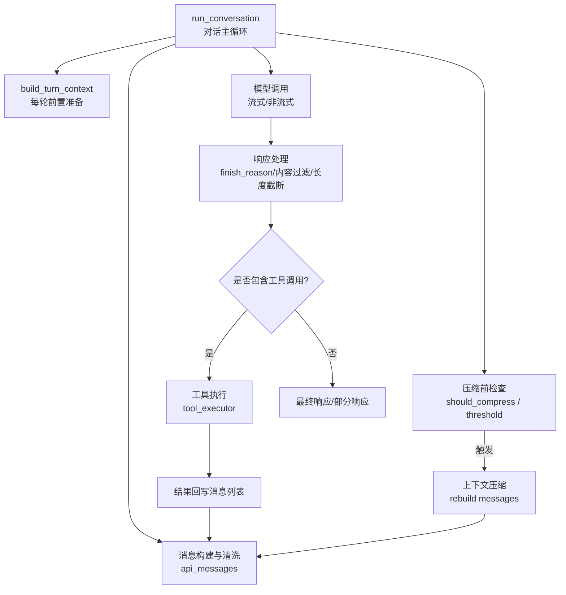
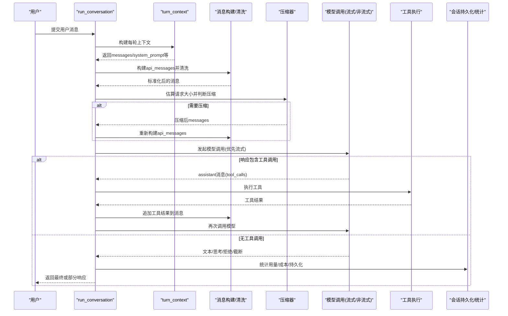
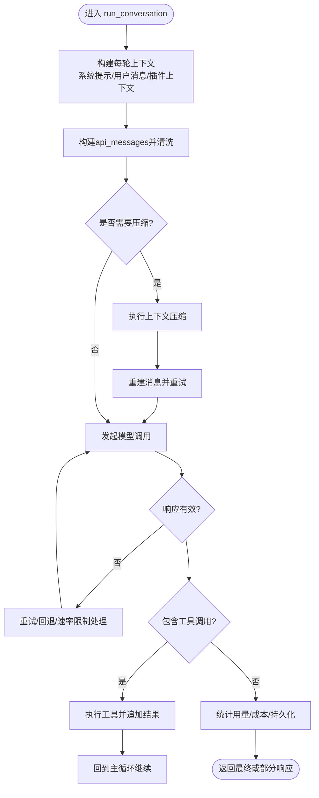
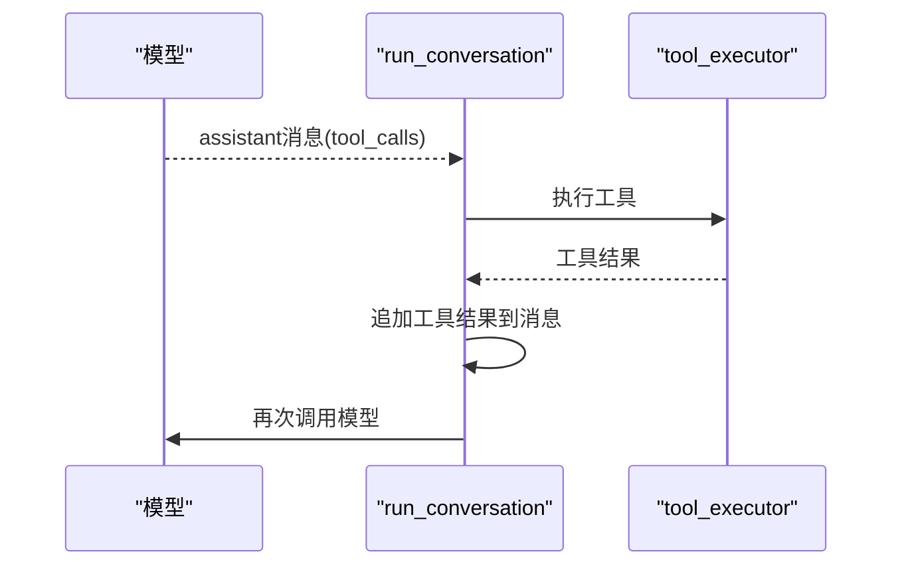
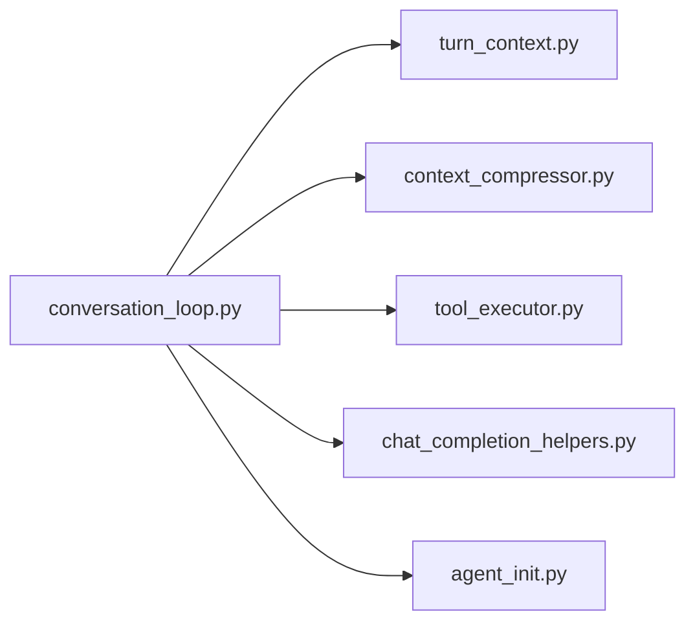

# 对话循环管理

<cite>
**本文引用的文件**
- [conversation_loop.py](file://agent/conversation_loop.py)
- [turn_context.py](file://agent/turn_context.py)
- [agent_init.py](file://agent/agent_init.py)
- [tool_executor.py](file://agent/tool_executor.py)
- [context_compressor.py](file://agent/context_compressor.py)
- [chat_completion_helpers.py](file://agent/chat_completion_helpers.py)
</cite>

## 目录
1. [简介](#简介)
2. [项目结构](#项目结构)
3. [核心组件](#核心组件)
4. [架构总览](#架构总览)
5. [详细组件分析](#详细组件分析)
6. [依赖关系分析](#依赖关系分析)
7. [性能考量](#性能考量)
8. [故障排查指南](#故障排查指南)
9. [结论](#结论)
10. [附录](#附录)

## 简介
本文件聚焦 Hermes Agent 的“对话循环管理”，围绕 `run_conversation` 方法展开，系统性解释其实现架构与内部工作流：用户输入处理、消息构建与清洗、模型调用（含流式与非流式）、工具调用协调、响应生成、会话状态更新、压缩与上下文管理、错误恢复、超时与中断支持，以及迭代控制机制。同时给出关键参数（如 `reasoning_config`、`tool_progress_mode`）的作用说明，并提供多轮复杂对话场景的处理思路与扩展点指引。

## 项目结构
Hermes Agent 将对话主循环从入口模块中抽离到独立文件，便于测试与维护。核心文件与职责如下：
- conversation_loop.py：实现 `run_conversation` 主循环，负责一轮用户请求的完整生命周期。
- turn_context.py：封装每轮对话的前置准备（系统提示恢复、消息组装、外部记忆预取、插件钩子等）。
- agent_init.py：初始化 Agent 配置，包括最大迭代次数、工具进度模式、推理配置等。
- tool_executor.py：执行工具并输出进度（受 `tool_progress_mode` 控制）。
- context_compressor.py：上下文压缩策略与阈值判断。
- chat_completion_helpers.py：与模型交互的辅助逻辑（如达到最大迭代时的摘要引导）。

**图表来源**
- [conversation_loop.py:1371-2169](file://agent/conversation_loop.py#L1371-L2169)
- [conversation_loop.py:2170-2969](file://agent/conversation_loop.py#L2170-L2969)
- [conversation_loop.py:2970-3769](file://agent/conversation_loop.py#L2970-L3769)
- [turn_context.py:相关函数](file://agent/turn_context.py)
- [context_compressor.py:阈值与压缩](file://agent/context_compressor.py)

**章节来源**
- [conversation_loop.py:1371-2169](file://agent/conversation_loop.py#L1371-L2169)
- [conversation_loop.py:2170-2969](file://agent/conversation_loop.py#L2170-L2969)
- [conversation_loop.py:2970-3769](file://agent/conversation_loop.py#L2970-L3769)

## 核心组件
- run_conversation：单轮对话的主控制器，维护迭代计数、预算、压缩尝试、重试、回退链、中断与重定向、流式响应收集、工具调用循环、最终结果返回。
- build_turn_context：每轮前置准备，包括系统提示恢复、用户消息清理、插件上下文注入、外部记忆预取、任务ID与显示元数据设置。
- 消息构建与清洗：复制历史消息为发送副本，剥离内部字段，注入临时上下文，规范化空白与工具调用JSON，移除不兼容字段，必要时裁剪思考-only 段落。
- 压缩前检查：估算请求大小，结合阈值与冷却期决定是否进行压缩；若压缩成功则重建消息并重试。
- 模型调用：优先使用流式路径以获得健康检查与细粒度中断；对不支持流式的后端自动降级；通过中间件与钩子记录请求与追踪。
- 响应处理：校验响应形状，识别拒绝（content_filter）、长度截断（length）、不完整（incomplete）等；按策略继续或回退。
- 工具调用循环：当响应包含工具调用时，执行工具并将结果追加到消息列表，回到主循环继续下一轮。
- 最终化：在 turn 结束时持久化会话、统计用量、成本估算、清理资源。

**章节来源**
- [conversation_loop.py:1371-2169](file://agent/conversation_loop.py#L1371-L2169)
- [conversation_loop.py:2170-2969](file://agent/conversation_loop.py#L2170-L2969)
- [conversation_loop.py:2970-3769](file://agent/conversation_loop.py#L2970-L3769)

## 架构总览
下图展示一轮对话从用户输入到最终响应的端到端流程，包括压缩、模型调用、工具调用、错误恢复与中断。

**图表来源**
- [conversation_loop.py:1371-2169](file://agent/conversation_loop.py#L1371-L2169)
- [conversation_loop.py:2170-2969](file://agent/conversation_loop.py#L2170-L2969)
- [conversation_loop.py:2970-3769](file://agent/conversation_loop.py#L2970-L3769)

## 详细组件分析

### 运行主循环：run_conversation
- 入口参数与返回值：接收用户消息、系统提示、历史消息、任务ID、流回调、持久化元数据等；返回包含最终响应、消息历史、API调用计数、完成/失败/部分标记的结构。
- 每轮前置：调用 `build_turn_context` 完成系统提示恢复、用户消息清理、插件上下文注入、外部记忆预取、任务ID与显示元数据设置。
- 主循环条件：基于 `max_iterations` 与 `iteration_budget.remaining` 控制迭代；支持一次“宽限调用”以尽力完成。
- 压缩前检查：估算请求大小，结合阈值、冷却期与“最近真实用量”防抖，决定是否压缩；压缩成功后重建消息并继续。
- 模型调用：优先流式，具备健康检查与中断能力；对不支持流式的后端自动降级；通过中间件与钩子记录请求与追踪。
- 响应处理：校验响应形状，识别拒绝（content_filter）、长度截断（length）、不完整（incomplete）等；按策略继续或回退。
- 工具调用循环：当响应包含工具调用时，执行工具并将结果追加到消息列表，回到主循环继续下一轮。
- 最终化：在 turn 结束时持久化会话、统计用量、成本估算、清理资源。

**图表来源**
- [conversation_loop.py:1371-2169](file://agent/conversation_loop.py#L1371-L2169)
- [conversation_loop.py:2170-2969](file://agent/conversation_loop.py#L2170-L2969)
- [conversation_loop.py:2970-3769](file://agent/conversation_loop.py#L2970-L3769)

**章节来源**
- [conversation_loop.py:1371-2169](file://agent/conversation_loop.py#L1371-L2169)
- [conversation_loop.py:2170-2969](file://agent/conversation_loop.py#L2170-L2969)
- [conversation_loop.py:2970-3769](file://agent/conversation_loop.py#L2970-L3769)

### 消息处理流程
- 历史消息克隆为发送副本，剥离内部字段（如 `_row_id`、`display_kind`），避免污染提供者协议。
- 注入当前轮次的用户消息上下文（外部记忆预取、插件 `pre_llm_call` 目标为 `user_message` 的上下文）。
- 规范化空白与工具调用 JSON，确保跨轮次前缀稳定，利于缓存命中。
- 移除不兼容字段（如 `finish_reason`、`reasoning` 等），保留必要的 reasoning 字段用于多轮推理连续性。
- 对仅含思考的助手消息进行裁剪，防止某些提供商拒绝“thinking-only”结尾。

**章节来源**
- [conversation_loop.py:1730-1843](file://agent/conversation_loop.py#L1730-L1843)
- [conversation_loop.py:1952-1976](file://agent/conversation_loop.py#L1952-L1976)

### 工具调用协调
- 当模型返回包含工具调用的助手消息时，进入工具执行路径。
- 工具执行由 `tool_executor` 负责，支持进度模式控制（见下文 `tool_progress_mode`）。
- 工具结果追加到消息列表后，回到主循环继续下一轮模型调用，直到不再包含工具调用或达到终止条件。

**图表来源**
- [conversation_loop.py:2970-3769](file://agent/conversation_loop.py#L2970-L3769)
- [tool_executor.py:进度模式控制](file://agent/tool_executor.py)

**章节来源**
- [conversation_loop.py:2970-3769](file://agent/conversation_loop.py#L2970-L3769)
- [tool_executor.py:相关行](file://agent/tool_executor.py)

### 响应生成与最终结果
- 响应有效性校验：不同 API 模式（chat_completions、anthropic_messages、bedrock_converse、codex_responses）有各自的验证与归一化逻辑。
- 内容策略拒绝：识别 `content_filter`，尝试一次回退，否则返回明确的用户提示。
- 长度截断：检测 `length`，支持最多4次续写；若仍截断，返回部分响应并清理续写片段。
- 思考预算耗尽：当模型将所有输出令牌用于推理且无可见响应时，直接返回友好提示，避免浪费重试。
- 最终结果：若无工具调用，统计用量、成本估算、持久化会话，返回最终或部分响应。

**章节来源**
- [conversation_loop.py:2970-3769](file://agent/conversation_loop.py#L2970-L3769)

### 会话状态更新
- 每轮结束后持久化会话，更新 token 计数与成本估算。
- 支持 MoA（多顾问聚合）的引用与聚合用量合并，确保成本与 token 统计准确。
- 清理任务资源，确保会话一致性。

**章节来源**
- [conversation_loop.py:3447-3657](file://agent/conversation_loop.py#L3447-L3657)

### 迭代控制机制（max_iterations）
- 主循环条件：`api_call_count < agent.max_iterations` 且 `iteration_budget.remaining > 0`，或存在一次“宽限调用”。
- 达到最大迭代：通过 `handle_max_iterations` 引导模型生成摘要，避免无限循环。
- 预算消耗：每次迭代消耗预算；若预算耗尽且无宽限，退出循环并记录原因。

**章节来源**
- [conversation_loop.py:1558-1593](file://agent/conversation_loop.py#L1558-L1593)
- [chat_completion_helpers.py:handle_max_iterations](file://agent/chat_completion_helpers.py)

### 错误恢复策略
- 无效响应：识别空响应、格式错误、状态码异常，尝试回退链（fallback chain），否则返回错误。
- 速率限制：针对特定提供商（如 Nous Portal）进行速率限制保护，必要时切换到备用提供商。
- Unicode 编码错误：自动清理代理字符或 ASCII 编码问题，最多两次修复尝试。
- 内容策略拒绝：识别安全拒绝，尝试一次回退，否则返回明确提示。
- 长度截断：最多4次续写，超过则返回部分响应并清理续写片段。

**章节来源**
- [conversation_loop.py:2757-2929](file://agent/conversation_loop.py#L2757-L2929)
- [conversation_loop.py:2983-3083](file://agent/conversation_loop.py#L2983-L3083)
- [conversation_loop.py:3085-3445](file://agent/conversation_loop.py#L3085-L3445)

### 超时处理与中断支持
- 流式调用：优先使用流式路径，具备健康检查与细粒度中断；对不支持流式的后端自动降级。
- 中断处理：捕获 `InterruptedError`，保留已流式输出的助手文本，记录中断原因并返回部分响应。
- 重定向：支持运行时重定向（如用户纠正），在 API 调用前后注入纠正信息，保持会话一致性。

**章节来源**
- [conversation_loop.py:2514-2657](file://agent/conversation_loop.py#L2514-L2657)
- [conversation_loop.py:3707-3739](file://agent/conversation_loop.py#L3707-L3739)

### 关键参数说明
- reasoning_config：推理配置，用于控制模型的推理行为（如 OpenRouter 的 effort 级别）。在初始化时设置，并在切换模型时重新解析与应用。
- tool_progress_mode：工具进度模式，控制工具执行的进度输出（如 all、new、verbose、off）。影响 CLI/TUI 的工具执行反馈。

**章节来源**
- [agent_init.py:470-594](file://agent/agent_init.py#L470-L594)
- [agent_init.py:846-894](file://agent/agent_init.py#L846-L894)
- [tool_executor.py:相关行](file://agent/tool_executor.py)

## 依赖关系分析
- conversation_loop.py 依赖 turn_context.py 进行每轮前置准备。
- 依赖 context_compressor.py 进行上下文压缩决策与执行。
- 依赖 tool_executor.py 执行工具并控制进度输出。
- 依赖 chat_completion_helpers.py 处理最大迭代时的摘要引导。
- 依赖 agent_init.py 提供的配置（max_iterations、tool_progress_mode、reasoning_config）。

**图表来源**
- [conversation_loop.py:1371-2169](file://agent/conversation_loop.py#L1371-L2169)
- [conversation_loop.py:2170-2969](file://agent/conversation_loop.py#L2170-L2969)
- [conversation_loop.py:2970-3769](file://agent/conversation_loop.py#L2970-L3769)

**章节来源**
- [conversation_loop.py:1371-2169](file://agent/conversation_loop.py#L1371-L2169)
- [conversation_loop.py:2170-2969](file://agent/conversation_loop.py#L2170-L2969)
- [conversation_loop.py:2970-3769](file://agent/conversation_loop.py#L2970-L3769)

## 性能考量
- 流式调用优先：提升健康检查与中断响应能力，减少长时间阻塞。
- 上下文压缩：在请求过大时主动压缩，避免溢出与失败。
- 缓存优化：规范化消息与前缀稳定，提高 KV 缓存命中率。
- 用量统计：精确统计 token 与成本，支持 MoA 引用与聚合。
- 重试与回退：智能重试与回退链，提升鲁棒性。

[本节提供一般性指导，无需具体文件分析]

## 故障排查指南
- 无效响应：检查响应形状与状态码，查看回退链是否激活。
- 速率限制：关注提供商速率限制提示，必要时切换备用提供商。
- Unicode 编码错误：确认消息是否包含代理字符或 ASCII 编码问题。
- 内容策略拒绝：查看拒绝原因，调整提示或模型。
- 长度截断：增加 max_tokens 或优化提示，避免过度推理。
- 中断与重定向：确认中断信号是否正确处理，重定向是否注入成功。

**章节来源**
- [conversation_loop.py:2757-2929](file://agent/conversation_loop.py#L2757-L2929)
- [conversation_loop.py:2983-3083](file://agent/conversation_loop.py#L2983-L3083)
- [conversation_loop.py:3085-3445](file://agent/conversation_loop.py#L3085-L3445)

## 结论
`run_conversation` 是 Hermes Agent 对话循环的核心，实现了从用户输入到最终响应的完整生命周期管理。通过消息构建与清洗、上下文压缩、模型调用（流式/非流式）、工具调用协调、错误恢复、超时与中断支持，以及迭代控制机制，确保了对话的稳定性和鲁棒性。开发者可基于此架构扩展自定义工具、压缩策略与错误处理逻辑，以满足复杂的多轮对话场景需求。

[本节总结性内容，无需具体文件分析]

## 附录
- 多轮复杂对话场景示例：
  - 用户提出一个需要多个工具调用的任务（如读取文件、执行命令、生成报告）。
  - 模型返回工具调用，Agent 执行工具并追加结果，继续调用模型直到完成任务。
  - 若遇到长度截断，自动续写；若内容被拒绝，尝试回退；若中断，保留部分响应。
- 扩展点：
  - 自定义工具：在 `tool_executor` 中注册新工具。
  - 压缩策略：在 `context_compressor` 中调整阈值与策略。
  - 错误处理：在 `conversation_loop` 中添加新的错误恢复逻辑。
  - 进度模式：通过 `tool_progress_mode` 控制工具执行反馈。

[本节提供概念性内容，无需具体文件分析]