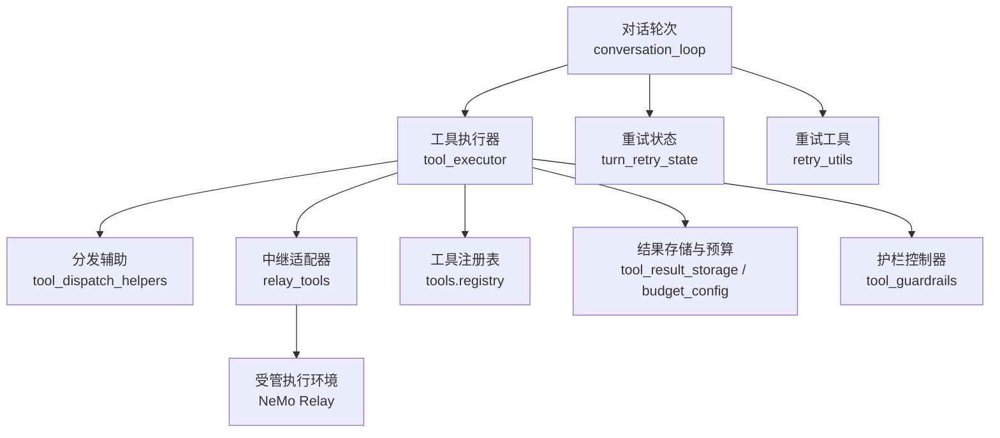
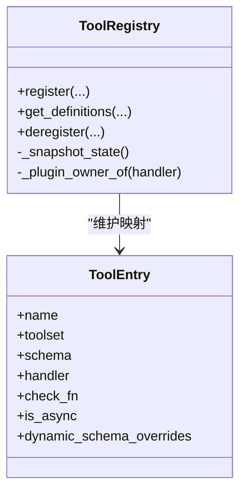
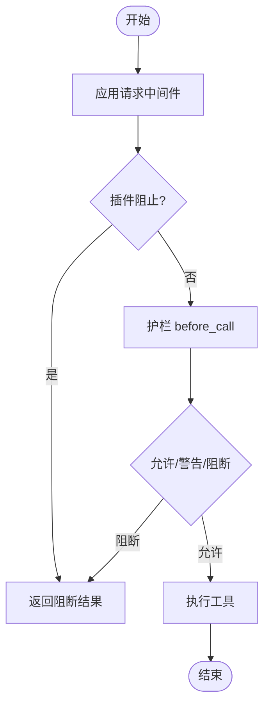
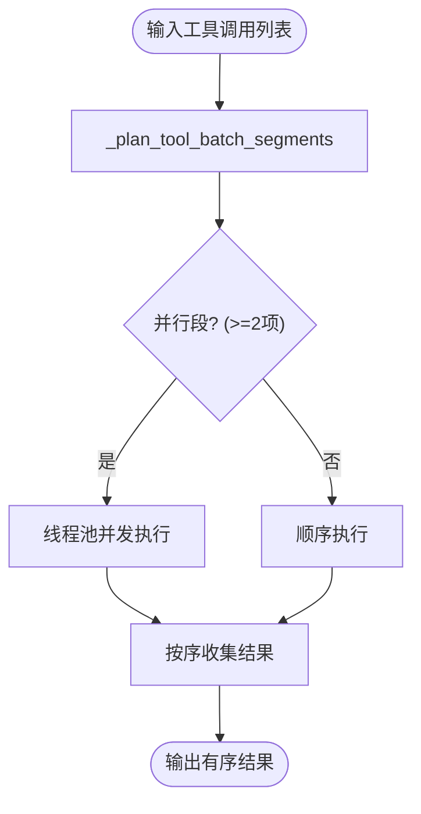
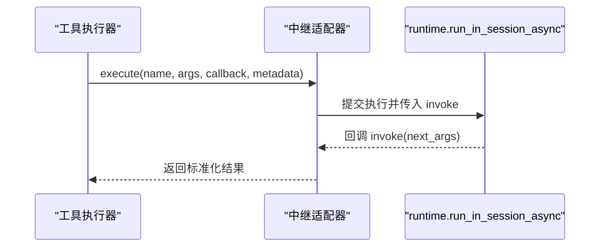
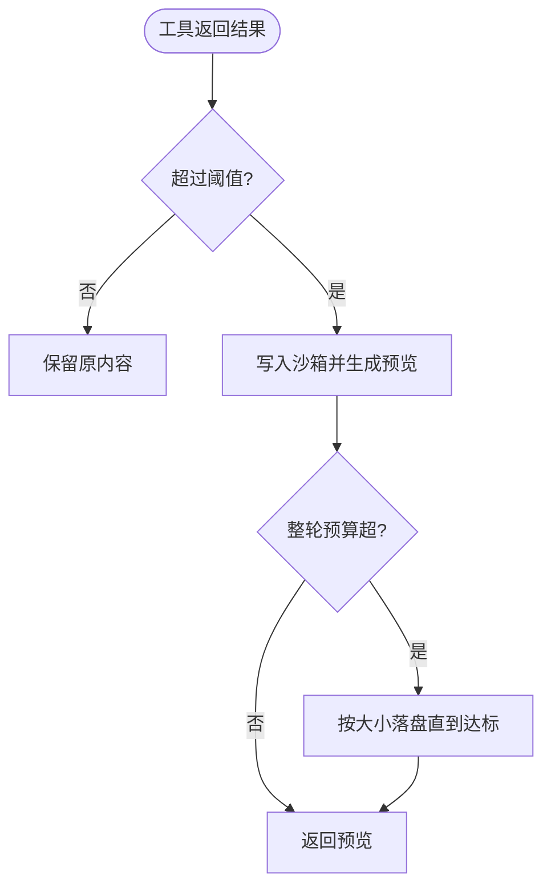
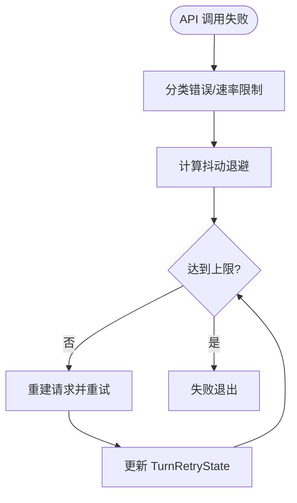
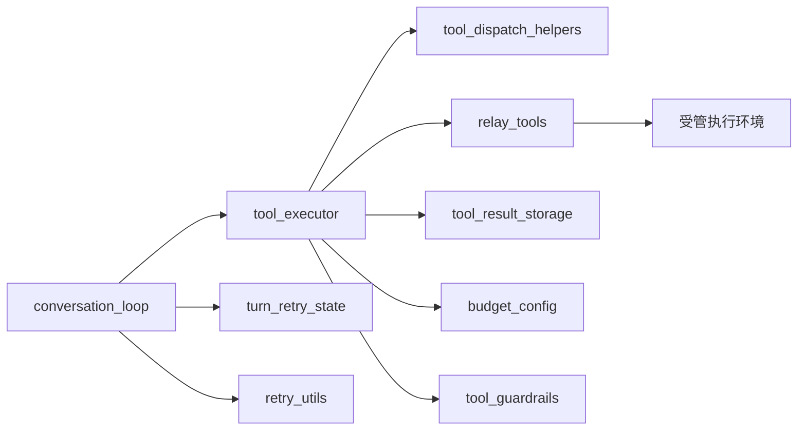

# 工具调用循环

<cite>
**本文引用的文件**
- [conversation_loop.py](file://agent/conversation_loop.py)
- [tool_executor.py](file://agent/tool_executor.py)
- [relay_tools.py](file://agent/relay_tools.py)
- [registry.py](file://tools/registry.py)
- [tool_dispatch_helpers.py](file://agent/tool_dispatch_helpers.py)
- [turn_retry_state.py](file://agent/turn_retry_state.py)
- [retry_utils.py](file://agent/retry_utils.py)
- [tool_result_storage.py](file://tools/tool_result_storage.py)
- [budget_config.py](file://tools/budget_config.py)
- [tool_guardrails.py](file://agent/tool_guardrails.py)
</cite>

## 目录
1. [简介](#简介)
2. [项目结构](#项目结构)
3. [核心组件](#核心组件)
4. [架构总览](#架构总览)
5. [详细组件分析](#详细组件分析)
6. [依赖关系分析](#依赖关系分析)
7. [性能考量](#性能考量)
8. [故障排查指南](#故障排查指南)
9. [结论](#结论)
10. [附录](#附录)

## 简介
本文件系统性梳理 Hermes Agent 的工具调用循环：从工具发现、参数校验、安全与权限控制、并发调度、异步执行、结果持久化，到重试、超时与错误恢复策略。文档同时给出扩展指南与优化建议，帮助开发者理解并安全地扩展工具系统。

## 项目结构
围绕“工具调用循环”的关键模块分布如下：
- 对话轮次主循环：负责模型调用、工具分发、压缩与恢复、最终化等
- 工具执行器：顺序/并发执行、批处理分段、授权门控、进度与预算
- 中继适配器：将工具调用路由到受管执行环境（NeMo Relay）
- 工具注册表：工具元数据、动态 schema、可用性探测缓存
- 分发辅助：并行安全判定、路径冲突检测、多模态结果封装
- 重试状态：单轮内各恢复分支的“一次性”标记
- 重试工具：抖动退避、速率限制自适应、特定供应商过载识别
- 结果存储与预算：三层保护（工具内截断、落盘、整轮聚合预算）
- 护栏控制器：防重复失败、无进展、越权/超限等防护



图表来源
- [conversation_loop.py:1-120](file://agent/conversation_loop.py#L1-L120)
- [tool_executor.py:1-120](file://agent/tool_executor.py#L1-L120)
- [relay_tools.py:18-84](file://agent/relay_tools.py#L18-L84)
- [registry.py:414-764](file://tools/registry.py#L414-L764)
- [tool_dispatch_helpers.py:116-248](file://agent/tool_dispatch_helpers.py#L116-L248)
- [turn_retry_state.py:32-88](file://agent/turn_retry_state.py#L32-L88)
- [retry_utils.py:90-209](file://agent/retry_utils.py#L90-L209)
- [tool_result_storage.py:144-255](file://tools/tool_result_storage.py#L144-L255)
- [budget_config.py:22-115](file://tools/budget_config.py#L22-L115)
- [tool_guardrails.py:273-518](file://agent/tool_guardrails.py#L273-L518)

章节来源
- [conversation_loop.py:1-120](file://agent/conversation_loop.py#L1-L120)
- [tool_executor.py:1-120](file://agent/tool_executor.py#L1-L120)

## 核心组件
- 工具发现与注册：通过 AST 扫描自动发现并导入自注册工具模块；维护 ToolEntry 元数据、schema、check_fn 可用性与动态覆盖；提供线程安全的快照与版本计数以支持并发读取与动态刷新。
- 工具分发与安全：在每次调用前经过请求中间件、pre_tool_call 插件、护栏控制器 before_call，再进入实际执行；支持范围阻断（如 scope_block）、守卫策略拒绝。
- 并发与批处理：按工具类型与路径冲突规划为“并行段/顺序段”，使用线程池与最大工作线程上限；对图像生成等特殊工具限制并发度；授权门控序列化审批提示并从批截止时间中排除人类等待时间。
- 执行环境隔离：通过 NeMo Relay 在会话上下文中执行工具，支持异步回调与上下文变量传播；当未启用托管执行时回退到本地直接调用。
- 结果处理与预算：三层保护——工具内截断、超大结果落盘（沙箱）、整轮聚合预算强制落盘；支持预览与引用读取。
- 重试与恢复：每轮独立的重试状态对象记录各恢复分支是否已尝试；结合抖动退避与供应商特定过载策略进行自适应重试；支持上下文压缩、长度续写、格式修复等分支。
- 安全与权限：插件覆盖内置工具的白名单策略；高危工具输出包裹“不可信数据”标签；终端命令破坏性启发式检查与 checkpoint 前置；权限门控与审批流。

章节来源
- [registry.py:108-159](file://tools/registry.py#L108-L159)
- [registry.py:201-231](file://tools/registry.py#L201-L231)
- [registry.py:414-764](file://tools/registry.py#L414-L764)
- [tool_executor.py:482-662](file://agent/tool_executor.py#L482-L662)
- [tool_executor.py:758-800](file://agent/tool_executor.py#L758-L800)
- [relay_tools.py:18-84](file://agent/relay_tools.py#L18-L84)
- [tool_result_storage.py:144-255](file://tools/tool_result_storage.py#L144-L255)
- [budget_config.py:22-115](file://tools/budget_config.py#L22-L115)
- [turn_retry_state.py:32-88](file://agent/turn_retry_state.py#L32-L88)
- [retry_utils.py:90-209](file://agent/retry_utils.py#L90-L209)
- [tool_guardrails.py:273-518](file://agent/tool_guardrails.py#L273-L518)

## 架构总览
下图展示一次工具调用的端到端流程：从对话轮次触发，经分发辅助规划并行/顺序段，进入执行器，通过中继适配器在受管环境中执行，最后统一结果处理与预算控制。

```mermaid
sequenceDiagram
participant Loop as "对话轮次"
participant Exec as "工具执行器"
participant Dispatch as "分发辅助"
participant Relay as "中继适配器"
participant Env as "受管执行环境"
participant Store as "结果存储/预算"
Loop->>Exec : 收到助手消息中的工具调用列表
Exec->>Dispatch : 规划并行/顺序段(路径冲突/安全规则)
Dispatch-->>Exec : 返回有序段
loop 每个段
Exec->>Relay : execute(tool_name, args, callback, metadata)
Relay->>Env : run_in_session_async(..., invoke)
Env-->>Relay : 执行完成/回调结果
Relay-->>Exec : 返回标准化结果
Exec->>Store : maybe_persist_tool_result / enforce_turn_budget
Store-->>Exec : 替换为预览或原内容
end
Exec-->>Loop : 追加工具结果消息
```

图表来源
- [tool_executor.py:758-800](file://agent/tool_executor.py#L758-L800)
- [tool_dispatch_helpers.py:116-248](file://agent/tool_dispatch_helpers.py#L116-L248)
- [relay_tools.py:18-84](file://agent/relay_tools.py#L18-L84)
- [tool_result_storage.py:144-255](file://tools/tool_result_storage.py#L144-L255)

## 详细组件分析

### 工具发现与注册
- 自动发现：通过 AST 扫描 tools/*.py，识别顶层 registry.register() 调用，避免误报；结果缓存于磁盘，基于 mtime+size 命中可跳过重读。
- 元数据管理：ToolEntry 保存名称、工具集、schema、处理器、check_fn、环境变量要求、是否异步、描述、emoji、最大结果大小、动态 schema 覆盖。
- 可用性探测缓存：check_fn 结果 TTL 约 30 秒，并在最近成功后的短窗口内抑制瞬态失败，避免后端抖动导致工具静默消失。
- 动态 schema 覆盖：允许运行时根据配置调整 schema（例如委托任务并发数），在 get_definitions 时合并。



图表来源
- [registry.py:201-231](file://tools/registry.py#L201-L231)
- [registry.py:414-764](file://tools/registry.py#L414-L764)

章节来源
- [registry.py:108-159](file://tools/registry.py#L108-L159)
- [registry.py:201-231](file://tools/registry.py#L201-L231)
- [registry.py:414-764](file://tools/registry.py#L414-L764)

### 工具分发与安全控制
- 请求中间件：apply_tool_request_middleware 与 run_tool_execution_middleware 串联，支持重写参数、追踪 trace。
- 预执行钩子：resolve_pre_tool_block 允许插件阻止调用；guardrail before_call 依据重复失败、无进展、超限等策略决定 warn/block/halt。
- 范围阻断：scope_block 可直接阻断某类工具调用（如受限工具集）。
- 输出安全：高危工具（web_extract/web_search/browser_*、mcp_*）的结果被包裹为“不可信数据”，防止间接提示注入。



图表来源
- [tool_executor.py:482-662](file://agent/tool_executor.py#L482-L662)
- [tool_guardrails.py:273-518](file://agent/tool_guardrails.py#L273-L518)
- [tool_dispatch_helpers.py:533-707](file://agent/tool_dispatch_helpers.py#L533-L707)

章节来源
- [tool_executor.py:482-662](file://agent/tool_executor.py#L482-L662)
- [tool_guardrails.py:273-518](file://agent/tool_guardrails.py#L273-L518)
- [tool_dispatch_helpers.py:533-707](file://agent/tool_dispatch_helpers.py#L533-L707)

### 并发执行与批处理规划
- 分段规划：将工具调用序列切分为“并行段”和“顺序段”，保证原始顺序不变且副作用边界一致。
- 路径冲突检测：read_file/search_files 与 write_file/patch 之间基于规范路径做读写冲突判断；search_files 默认根目录作为读者保留。
- 并发上限：默认最大工作线程 8；若包含 image_generate，则进一步限制并发度；授权门控串行化审批提示，并从批截止时间扣除人类等待时间。
- 中断与取消：用户中断会跳过剩余工具调用并写入取消结果。



图表来源
- [tool_dispatch_helpers.py:116-248](file://agent/tool_dispatch_helpers.py#L116-L248)
- [tool_executor.py:758-800](file://agent/tool_executor.py#L758-L800)

章节来源
- [tool_dispatch_helpers.py:116-248](file://agent/tool_dispatch_helpers.py#L116-L248)
- [tool_executor.py:758-800](file://agent/tool_executor.py#L758-L800)

### 异步执行与环境隔离（NeMo Relay）
- 执行上下文：解析 session_id 获取 runtime/session/parent，若未启用托管执行则直接回调本地执行。
- 回调包装：invoke 捕获异常并记录 raw_result，确保值与 JSON 化结果均可用。
- 异步兼容：若返回值是可等待对象，在无事件循环时运行；否则抛出明确错误以避免在活跃事件循环上同步阻塞。



图表来源
- [relay_tools.py:18-84](file://agent/relay_tools.py#L18-L84)

章节来源
- [relay_tools.py:18-84](file://agent/relay_tools.py#L18-L84)

### 结果处理与预算控制
- 三层保护：
  1) 工具内截断：工具自身控制输出大小
  2) 结果落盘：超过阈值写入沙箱，返回预览与路径
  3) 整轮预算：若一轮工具结果总字符超预算，优先落盘最大未持久化结果
- 预算配置：可按模型上下文窗口缩放 per-result/per-turn 预算，避免小模型被大结果撑爆上下文。



图表来源
- [tool_result_storage.py:144-255](file://tools/tool_result_storage.py#L144-L255)
- [budget_config.py:22-115](file://tools/budget_config.py#L22-L115)

章节来源
- [tool_result_storage.py:144-255](file://tools/tool_result_storage.py#L144-L255)
- [budget_config.py:22-115](file://tools/budget_config.py#L22-L115)

### 重试机制、超时与错误恢复
- 每轮重试状态：TurnRetryState 集中记录各恢复分支的一次性标志（认证刷新、压缩重启、长度续写、格式修复等），避免重复尝试。
- 抖动退避：jittered_backoff 提供指数退避加随机抖动，降低并发重试风暴。
- 供应商特定策略：Z.AI Coding Plan GLM-5.2 过载 429 采用短重试后切换长退避表（30/60/90/120s），并计算重试上限以保证所有档位可达。
- 超时与中止：并发工具执行设置默认超时；授权门控锁有超时保护，避免死锁饥饿。



图表来源
- [turn_retry_state.py:32-88](file://agent/turn_retry_state.py#L32-L88)
- [retry_utils.py:90-209](file://agent/retry_utils.py#L90-L209)

章节来源
- [turn_retry_state.py:32-88](file://agent/turn_retry_state.py#L32-L88)
- [retry_utils.py:90-209](file://agent/retry_utils.py#L90-L209)

### 安全控制与资源限制
- 插件覆盖策略：插件覆盖内置工具需显式 opt-in，否则拒绝；deregister 同样受所有权与策略约束。
- 审批与授权：授权门控串行化审批提示，避免并发交错；从批截止时间扣除人类等待时间，防止饥饿。
- 破坏性命令检查：terminal 命令启发式识别 rm/cp/sed -i 等危险操作，必要时创建 checkpoint。
- 输出污染防护：高危工具结果包裹不可信数据标签，防止间接提示注入。

章节来源
- [registry.py:562-711](file://tools/registry.py#L562-L711)
- [tool_executor.py:391-468](file://agent/tool_executor.py#L391-L468)
- [tool_executor.py:665-756](file://agent/tool_executor.py#L665-L756)
- [tool_dispatch_helpers.py:533-707](file://agent/tool_dispatch_helpers.py#L533-L707)

### 自定义工具注册与异常处理示例（代码片段路径）
- 注册自定义工具（声明 schema、处理器、可用性检查、工具集、描述等）：
  - [registry.py:562-644](file://tools/registry.py#L562-L644)
- 在工具处理器中返回结构化结果或字符串，并由注册表规范化：
  - [registry.py:770-800](file://tools/registry.py#L770-L800)
- 处理工具返回结果（多模态信封、文本摘要、风险标注）：
  - [tool_dispatch_helpers.py:348-406](file://agent/tool_dispatch_helpers.py#L348-L406)
  - [tool_dispatch_helpers.py:533-707](file://agent/tool_dispatch_helpers.py#L533-L707)
- 处理工具执行异常（中间件捕获、中继回调异常、结果截断）：
  - [relay_tools.py:36-84](file://agent/relay_tools.py#L36-L84)
  - [registry.py:29-69](file://tools/registry.py#L29-L69)

章节来源
- [registry.py:562-644](file://tools/registry.py#L562-L644)
- [registry.py:770-800](file://tools/registry.py#L770-L800)
- [tool_dispatch_helpers.py:348-406](file://agent/tool_dispatch_helpers.py#L348-L406)
- [tool_dispatch_helpers.py:533-707](file://agent/tool_dispatch_helpers.py#L533-L707)
- [relay_tools.py:36-84](file://agent/relay_tools.py#L36-L84)
- [registry.py:29-69](file://tools/registry.py#L29-L69)

## 依赖关系分析
- 低耦合设计：工具注册表与执行器解耦；分发辅助仅关注并行安全与路径冲突；中继适配器屏蔽执行环境差异。
- 关键依赖链：
  - conversation_loop → tool_executor → relay_tools → 受管执行环境
  - tool_executor → tool_dispatch_helpers（并行规划）
  - tool_executor → tool_result_storage/budget_config（结果与预算）
  - tool_executor → tool_guardrails（护栏）
  - conversation_loop → turn_retry_state/retry_utils（重试）



图表来源
- [conversation_loop.py:1-120](file://agent/conversation_loop.py#L1-L120)
- [tool_executor.py:1-120](file://agent/tool_executor.py#L1-L120)
- [relay_tools.py:18-84](file://agent/relay_tools.py#L18-L84)
- [tool_dispatch_helpers.py:116-248](file://agent/tool_dispatch_helpers.py#L116-L248)
- [tool_result_storage.py:144-255](file://tools/tool_result_storage.py#L144-L255)
- [budget_config.py:22-115](file://tools/budget_config.py#L22-L115)
- [tool_guardrails.py:273-518](file://agent/tool_guardrails.py#L273-L518)
- [turn_retry_state.py:32-88](file://agent/turn_retry_state.py#L32-L88)
- [retry_utils.py:90-209](file://agent/retry_utils.py#L90-L209)

章节来源
- [conversation_loop.py:1-120](file://agent/conversation_loop.py#L1-L120)
- [tool_executor.py:1-120](file://agent/tool_executor.py#L1-L120)

## 性能考量
- 并行执行：按工具类型与路径冲突智能分段，最大化并发安全；对图像生成等慢操作限制并发度，避免后端突发限流。
- 缓存机制：
  - 工具可用性 check_fn 结果 TTL 缓存，减少外部探测开销
  - 工具发现缓存基于文件 mtime+size，避免重复 AST 扫描
  - 注册表 generation 计数用于外部 caller 的 memoization
- 资源池管理：线程池上限与授权门控锁超时，防止饥饿与死锁；批截止时间扣除人类等待时间，提升吞吐。
- 结果预算：按模型上下文窗口缩放 per-result/per-turn 预算，避免小模型被大结果拖垮；超大结果落盘减少上下文压力。

[本节为通用性能讨论，不直接分析具体文件]

## 故障排查指南
- 工具不可用：检查 check_fn 缓存与可用性探测日志；确认工具集别名与动态 schema 覆盖是否正确。
- 并发卡住：查看授权门控锁超时与批截止时间；确认是否存在长时间审批或挂起的 pre_tool_call 插件。
- 结果过大：确认三层预算是否生效；检查沙箱写入是否成功；必要时调整预算配置。
- 重复失败/无进展：查看护栏告警与停止决策；调整工具参数或更换工具路径。
- 供应商过载：确认是否命中 Z.AI Coding Plan 过载策略；观察重试次数与退避档位。

章节来源
- [registry.py:233-380](file://tools/registry.py#L233-L380)
- [tool_executor.py:391-468](file://agent/tool_executor.py#L391-L468)
- [tool_result_storage.py:144-255](file://tools/tool_result_storage.py#L144-L255)
- [tool_guardrails.py:273-518](file://agent/tool_guardrails.py#L273-L518)
- [retry_utils.py:142-209](file://agent/retry_utils.py#L142-L209)

## 结论
Hermes 的工具调用循环以“安全、可控、可扩展”为核心目标：通过注册表统一管理工具元数据与可用性；通过分发辅助实现安全并行；通过中继适配器隔离执行环境；通过三层预算与护栏保障稳定性；通过重试状态与退避策略提升鲁棒性。开发者可据此安全扩展工具生态，并获得高性能与高可靠性的执行体验。

[本节为总结性内容，不直接分析具体文件]

## 附录
- 扩展开发指南（要点）
  - 在 tools/*.py 中通过 registry.register() 声明工具；确保 schema 清晰、check_fn 健壮
  - 遵循结果契约：字符串或多模态信封；避免返回不受支持的类型
  - 利用护栏与中间件：在 before_call 中实施业务策略；在中间件中重写参数或记录 trace
  - 合理设置 max_result_size_chars 与预算阈值，避免上下文溢出
  - 谨慎使用并发：仅在路径冲突与工具类型允许的情况下并行
  - 监控与诊断：关注护栏告警、重试日志、预算落盘日志

[本节为概念性指导，不直接分析具体文件]