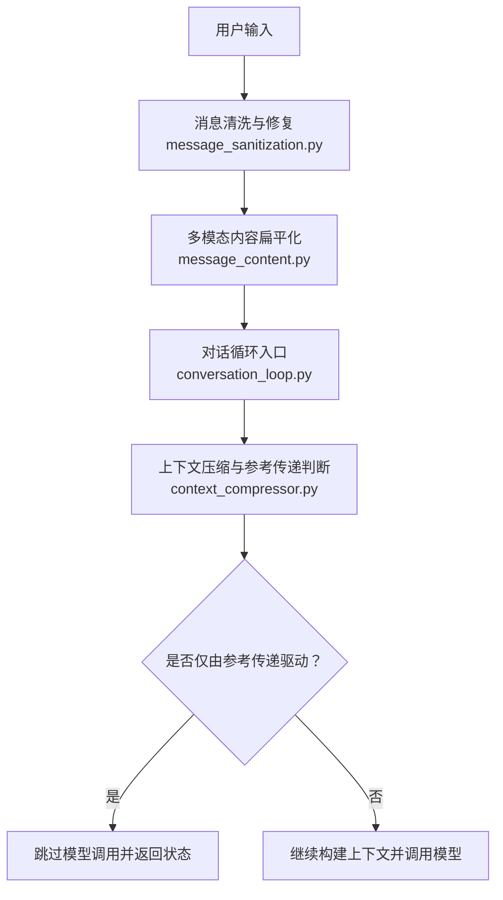
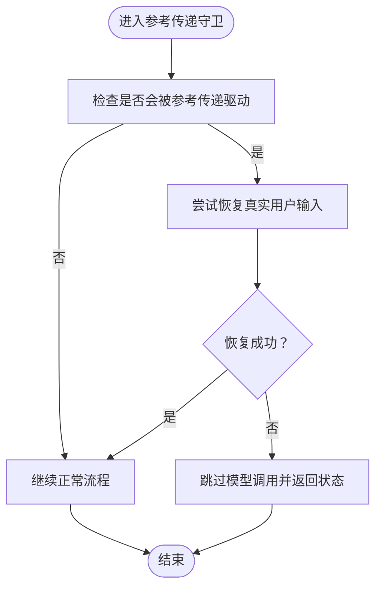
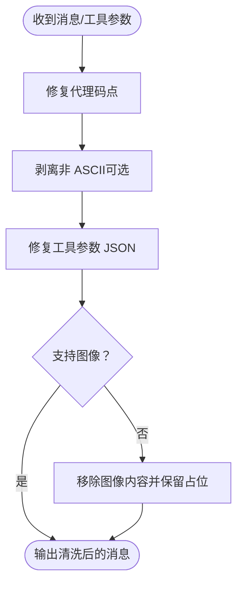
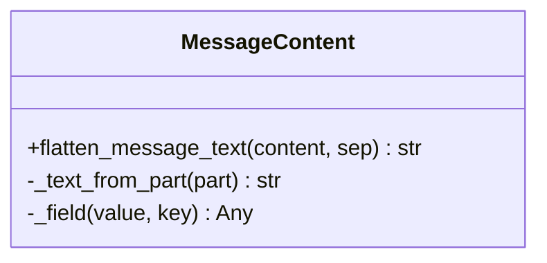
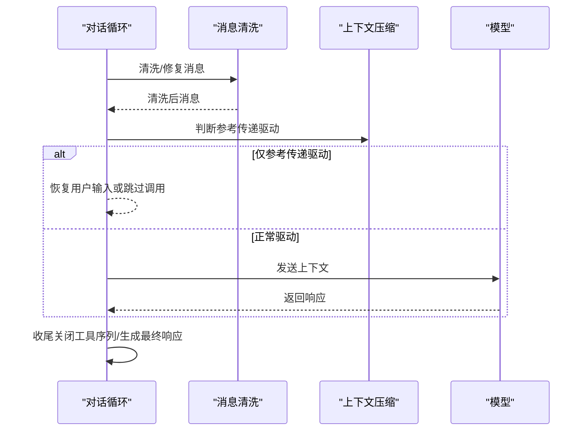
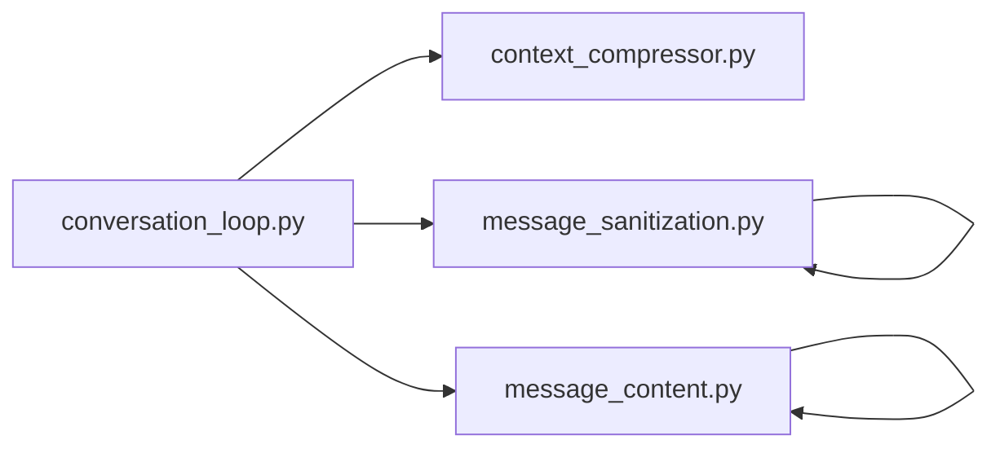

# 消息处理流程

<cite>
**本文引用的文件**
- [conversation_loop.py](file://agent/conversation_loop.py)
- [message_sanitization.py](file://agent/message_sanitization.py)
- [message_content.py](file://agent/message_content.py)
- [context_compressor.py](file://agent/context_compressor.py)
- [test_reference_handoff_active_turn.py](file://tests/agent/test_reference_handoff_active_turn.py)
</cite>

## 目录
1. [简介](#简介)
2. [项目结构](#项目结构)
3. [核心组件](#核心组件)
4. [架构总览](#架构总览)
5. [详细组件分析](#详细组件分析)
6. [依赖关系分析](#依赖关系分析)
7. [性能考量](#性能考量)
8. [故障排查指南](#故障排查指南)
9. [结论](#结论)
10. [附录](#附录)

## 简介
本文件聚焦 Hermes Agent 的消息处理流程，围绕用户输入进入对话循环后的验证、清洗、格式化与上下文构建展开。重点解释参考传递机制在压缩历史中的行为，以及 _restore_user_after_reference_handoff 与 _should_skip_model_call_for_reference_handoff 的作用；同时梳理消息清洗与修复工具（如 _sanitize_messages_non_ascii、_repair_tool_call_arguments）的使用场景，并给出多模态消息（文本、图片、文件）的标准化处理思路与生命周期管理要点，帮助开发者理解内部工作原理与扩展点。

## 项目结构
与消息处理直接相关的核心模块位于 agent 目录下：
- conversation_loop.py：对话主循环、参考传递守卫、中断恢复、最终响应等控制流
- message_sanitization.py：消息与工具参数的清洗、修复、非 ASCII 剥离、图像移除、reasoning_content 策略
- message_content.py：多模态内容到可见文本的扁平化提取
- context_compressor.py：上下文压缩与“参考传递”驱动判断（被对话循环引用）



图表来源
- [conversation_loop.py:101-157](file://agent/conversation_loop.py#L101-L157)
- [message_sanitization.py:328-446](file://agent/message_sanitization.py#L328-L446)
- [message_content.py:34-51](file://agent/message_content.py#L34-L51)
- [context_compressor.py](file://agent/context_compressor.py)

章节来源
- [conversation_loop.py:101-157](file://agent/conversation_loop.py#L101-L157)
- [message_sanitization.py:328-446](file://agent/message_sanitization.py#L328-L446)
- [message_content.py:34-51](file://agent/message_content.py#L34-L51)

## 核心组件
- 参考传递守卫
  - _restore_user_after_reference_handoff：当压缩后仅剩“参考传递”行时，尝试将本轮真实用户输入重新追加到消息末尾，避免后续模型调用被纯参考驱动。
  - _should_skip_model_call_for_reference_handoff：若下一轮将被“仅参考传递”驱动且无法通过恢复用户输入来改变驱动源，则跳过模型调用，直接返回友好状态。
- 消息清洗与修复
  - _sanitize_messages_surrogates / _sanitize_structure_surrogates：修复代理码点，防止 json.dumps 崩溃。
  - _repair_tool_call_arguments：修复模型产出的畸形 JSON 参数（截断、尾逗号、Python None、未转义控制字符等），失败时回退为空对象以保证会话不崩溃。
  - _sanitize_messages_non_ascii / _strip_images_from_messages：在 ASCII-only 环境或目标服务不支持图像时进行降级处理。
- 多模态内容扁平化
  - flatten_message_text：从 OpenAI/Responses 常见消息结构中抽取可见文本，忽略 image/audio 等非文本部分，便于预览、日志与提示词拼接。

章节来源
- [conversation_loop.py:101-157](file://agent/conversation_loop.py#L101-L157)
- [message_sanitization.py:32-141](file://agent/message_sanitization.py#L32-L141)
- [message_sanitization.py:195-293](file://agent/message_sanitization.py#L195-L293)
- [message_sanitization.py:328-446](file://agent/message_sanitization.py#L328-L446)
- [message_content.py:34-51](file://agent/message_content.py#L34-L51)

## 架构总览
下图展示一次典型的用户请求在对话循环中的流转，包括参考传递守卫、消息清洗、多模态扁平化与上下文压缩决策。

```mermaid
sequenceDiagram
participant U as "用户"
participant CL as "对话循环<br/>conversation_loop.py"
participant MS as "消息清洗<br/>message_sanitization.py"
participant MC as "内容扁平化<br/>message_content.py"
participant CC as "上下文压缩<br/>context_compressor.py"
participant M as "模型"
U->>CL : 提交用户消息
CL->>MS : 清洗/修复消息与工具参数
MS-->>CL : 清洗后的消息列表
CL->>MC : 提取可见文本用于预览/日志
MC-->>CL : 可见文本
CL->>CC : 判断是否会被“仅参考传递”驱动
alt 会被仅参考传递驱动
CL->>CL : 尝试恢复真实用户输入
opt 恢复成功
CL-->>U : 继续正常流程
else 无法恢复
CL-->>U : 返回“等待下一条消息”的状态
end
else 不会被仅参考传递驱动
CL->>M : 发送构建好的上下文
M-->>CL : 返回响应
CL-->>U : 输出结果
end
```

图表来源
- [conversation_loop.py:101-157](file://agent/conversation_loop.py#L101-L157)
- [message_sanitization.py:195-293](file://agent/message_sanitization.py#L195-L293)
- [message_content.py:34-51](file://agent/message_content.py#L34-L51)
- [context_compressor.py](file://agent/context_compressor.py)

## 详细组件分析

### 参考传递机制与对话守卫
- 触发条件
  - 上下文压缩后，最后一条消息可能是“参考传递”占位（例如指向已压缩的历史片段）。
  - 若该占位本身会驱动下一次模型调用，而当前轮次没有可行动的用户输入，则会导致“空转”。
- 保护逻辑
  - _restore_user_after_reference_handoff：若存在本轮的真实用户输入（字符串或非空列表），且尚未以相同内容作为 user 行存在，则将其追加到消息末尾，打破“仅参考传递驱动”的局面。
  - _should_skip_model_call_for_reference_handoff：若参考传递仍会驱动下一次调用且无法通过恢复用户输入来改变，则跳过模型调用，返回一个幂等的状态提示，避免无意义的 API 调用。
- 语义保障
  - 避免重复追加相同的 user 内容。
  - 保证角色交替不变（assistant/tool/user 顺序合法）。
  - 提供友好的最终响应，表明“上一轮回复已完成，等待下一条消息”。



图表来源
- [conversation_loop.py:101-157](file://agent/conversation_loop.py#L101-L157)
- [context_compressor.py](file://agent/context_compressor.py)

章节来源
- [conversation_loop.py:101-157](file://agent/conversation_loop.py#L101-L157)
- [test_reference_handoff_active_turn.py:25-127](file://tests/agent/test_reference_handoff_active_turn.py#L25-L127)

### 消息清洗与修复工具
- 代理码点修复
  - _sanitize_messages_surrogates：遍历消息的所有字符串字段（content/text/name/tool_calls.arguments 及 reasoning 等附加字段），替换非法代理码点，避免 SDK 序列化崩溃。
- 工具参数修复
  - _repair_tool_call_arguments：对模型输出的工具参数 JSON 进行多轮修复（去除尾逗号、补齐括号、转义控制字符等），失败时记录警告并以空对象回退，确保会话稳定。
- 非 ASCII 降级
  - _sanitize_messages_non_ascii：在 ASCII-only 环境中剥离非 ASCII 字符，覆盖 content、name、tool_calls.arguments 及附加字段。
- 图像移除
  - _strip_images_from_messages：当服务端声明不支持图像时，移除 image_url/image/input_image 等内容；对 tool 角色保留占位文本以维持 tool_call_id 配对。



图表来源
- [message_sanitization.py:32-141](file://agent/message_sanitization.py#L32-L141)
- [message_sanitization.py:195-293](file://agent/message_sanitization.py#L195-L293)
- [message_sanitization.py:328-446](file://agent/message_sanitization.py#L328-L446)

章节来源
- [message_sanitization.py:32-141](file://agent/message_sanitization.py#L32-L141)
- [message_sanitization.py:195-293](file://agent/message_sanitization.py#L195-L293)
- [message_sanitization.py:328-446](file://agent/message_sanitization.py#L328-L446)

### 多模态消息的标准化与可见文本提取
- 扁平化策略
  - flatten_message_text：从 OpenAI/Responses 常见结构中抽取可见文本，忽略 image/audio 等非文本部分，使用分隔符拼接，便于日志、预览与提示词拼接。
- 使用场景
  - 用户消息预览、错误信息摘要、调试日志、前端显示等。
- 注意事项
  - 非文本内容不会出现在可见文本中，但会在实际 API 调用中按原样发送（除非被 _strip_images_from_messages 移除）。



图表来源
- [message_content.py:7-51](file://agent/message_content.py#L7-L51)

章节来源
- [message_content.py:7-51](file://agent/message_content.py#L7-L51)

### 对话循环中的生命周期管理
- 输入阶段
  - 接收用户消息，执行消息清洗与修复，必要时移除图像内容。
- 上下文构建
  - 结合系统提示、工具定义、历史消息与当前输入构建完整上下文。
- 参考传递守卫
  - 判断是否会被“仅参考传递”驱动，若是则尝试恢复真实用户输入；否则跳过模型调用并返回状态。
- 模型调用与输出
  - 调用模型，处理流式响应，维护角色交替与工具调用序列完整性。
- 收尾阶段
  - 关闭中断的工具序列（如被停止导致尾部为 tool），生成最终响应，持久化转录。



图表来源
- [conversation_loop.py:101-157](file://agent/conversation_loop.py#L101-L157)
- [message_sanitization.py:296-325](file://agent/message_sanitization.py#L296-L325)

章节来源
- [conversation_loop.py:101-157](file://agent/conversation_loop.py#L101-L157)
- [message_sanitization.py:296-325](file://agent/message_sanitization.py#L296-L325)

## 依赖关系分析
- conversation_loop.py 依赖
  - context_compressor.reference_handoff_would_drive_next_model_call：判断压缩后是否仅由参考传递驱动。
  - message_sanitization：消息与工具参数清洗修复。
  - message_content：多模态内容扁平化。
- message_sanitization.py 提供
  - 代理码点修复、JSON 参数修复、非 ASCII 剥离、图像移除、reasoning_content 策略等能力。
- message_content.py 提供
  - 多模态内容到可见文本的提取。



图表来源
- [conversation_loop.py:101-157](file://agent/conversation_loop.py#L101-L157)
- [message_sanitization.py:195-293](file://agent/message_sanitization.py#L195-L293)
- [message_content.py:34-51](file://agent/message_content.py#L34-L51)

章节来源
- [conversation_loop.py:101-157](file://agent/conversation_loop.py#L101-L157)
- [message_sanitization.py:195-293](file://agent/message_sanitization.py#L195-L293)
- [message_content.py:34-51](file://agent/message_content.py#L34-L51)

## 性能考量
- 清洗与修复的开销
  - 代理码点与非 ASCII 剥离为线性扫描，通常开销较低。
  - 工具参数 JSON 修复可能涉及多次解析与正则替换，建议仅在必要时启用，并对超大参数进行长度限制与日志截断。
- 图像移除
  - 在服务端不支持图像时提前移除，可减少无效载荷传输。
- 参考传递守卫
  - 避免无意义的模型调用，显著降低延迟与成本。

[本节为通用指导，无需特定文件来源]

## 故障排查指南
- 现象：模型返回“仅参考传递驱动”的空转
  - 检查 _should_skip_model_call_for_reference_handoff 的判断路径，确认是否成功恢复真实用户输入。
  - 查看上下文压缩后的最后一条消息是否为“参考传递”占位。
- 现象：工具调用参数解析失败
  - 检查 _repair_tool_call_arguments 的修复日志，确认是否触发了尾逗号、未闭合结构或未转义控制字符修复。
  - 若最终回退为空对象，需定位上游模型输出问题。
- 现象：ASCII-only 环境报错
  - 启用 _sanitize_messages_non_ascii 进行降级处理，确保关键文本仍可传递。
- 现象：服务端不支持图像
  - 使用 _strip_images_from_messages 移除图像内容，并确保 tool 角色的占位文本保留以维持 tool_call_id 配对。

章节来源
- [conversation_loop.py:101-157](file://agent/conversation_loop.py#L101-L157)
- [message_sanitization.py:195-293](file://agent/message_sanitization.py#L195-L293)
- [message_sanitization.py:328-446](file://agent/message_sanitization.py#L328-L446)

## 结论
Hermes Agent 的消息处理流程通过严格的参考传递守卫、健壮的清洗修复机制与多模态内容扁平化，确保了对话循环的稳定性和可扩展性。开发者可在以下扩展点定制行为：
- 在参考传递守卫中增加更细粒度的恢复策略。
- 在消息清洗管道中注入自定义修复规则（如领域特定的 JSON 模式）。
- 在多模态扁平化中调整可见文本的拼接策略以满足不同展示需求。

[本节为总结，无需特定文件来源]

## 附录
- 关键函数路径参考
  - 参考传递恢复：[conversation_loop.py:101-130](file://agent/conversation_loop.py#L101-L130)
  - 参考传递跳过判断：[conversation_loop.py:133-157](file://agent/conversation_loop.py#L133-L157)
  - 工具参数修复：[message_sanitization.py:195-293](file://agent/message_sanitization.py#L195-L293)
  - 非 ASCII 剥离：[message_sanitization.py:328-393](file://agent/message_sanitization.py#L328-L393)
  - 图像移除：[message_sanitization.py:401-446](file://agent/message_sanitization.py#L401-L446)
  - 多模态扁平化：[message_content.py:34-51](file://agent/message_content.py#L34-L51)

[本节为附录，无需特定文件来源]