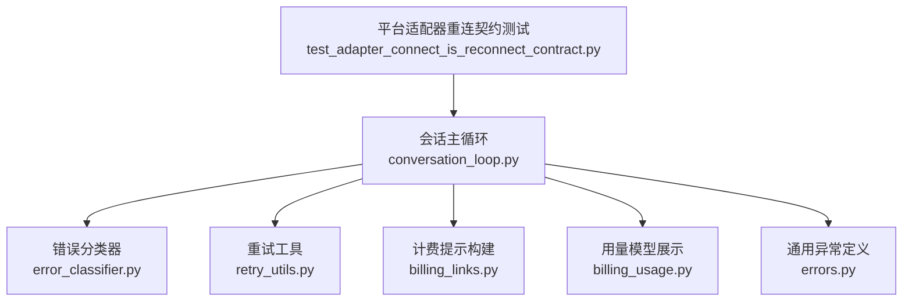
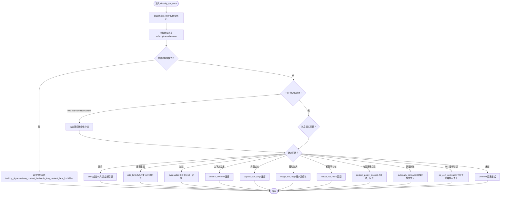
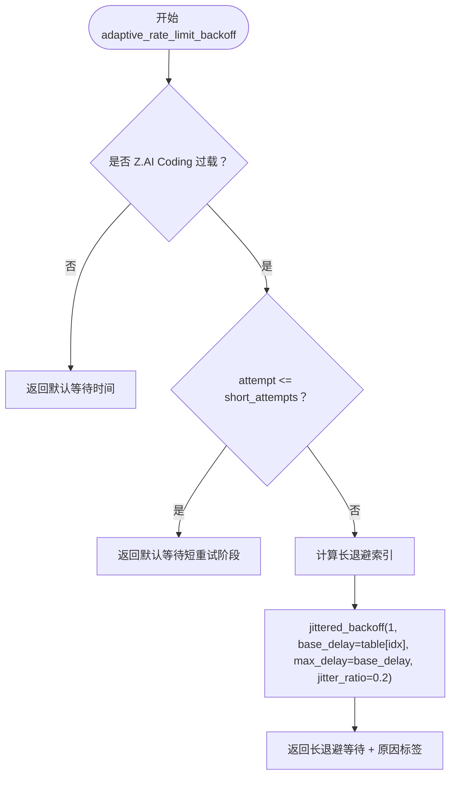
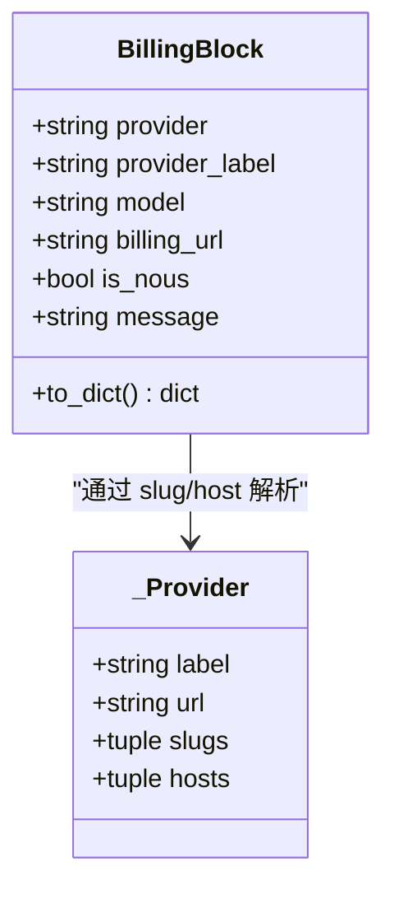
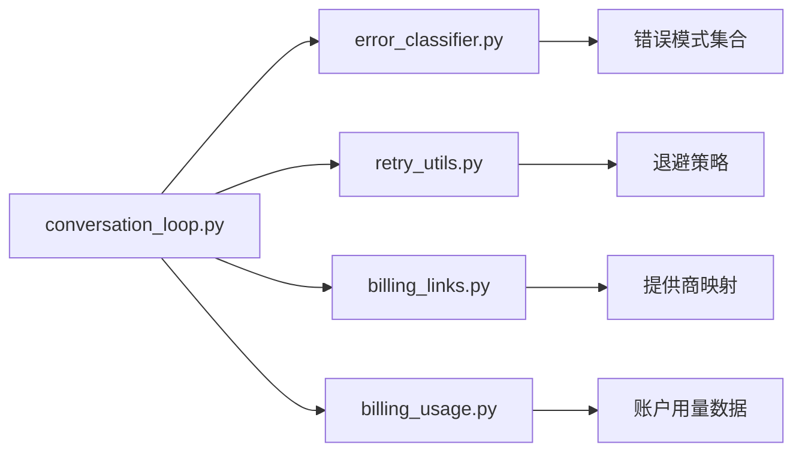

# 错误恢复机制

<cite>
**本文引用的文件**   
- [agent/error_classifier.py](file://agent/error_classifier.py)
- [agent/retry_utils.py](file://agent/retry_utils.py)
- [agent/billing_links.py](file://agent/billing_links.py)
- [agent/billing_usage.py](file://agent/billing_usage.py)
- [agent/errors.py](file://agent/errors.py)
- [agent/conversation_loop.py](file://agent/conversation_loop.py)
- [tests/gateway/test_adapter_connect_is_reconnect_contract.py](file://tests/gateway/test_adapter_connect_is_reconnect_contract.py)
</cite>

## 目录
1. [简介](#简介)
2. [项目结构](#项目结构)
3. [核心组件](#核心组件)
4. [架构总览](#架构总览)
5. [详细组件分析](#详细组件分析)
6. [依赖关系分析](#依赖关系分析)
7. [性能考量](#性能考量)
8. [故障排查指南](#故障排查指南)
9. [结论](#结论)
10. [附录](#附录)

## 简介
本文件系统性梳理 Hermes Agent 的错误恢复机制，覆盖错误分类、恢复策略、重试与退避、计费/配额相关处理、提供商特定逻辑、监控与告警、以及扩展自定义恢复逻辑的指南。目标是帮助开发者快速理解并安全地定制错误处理流程，同时保障系统在高并发和外部服务不稳定场景下的稳定性与可观测性。

## 项目结构
围绕错误恢复的核心模块集中在 agent 目录下：
- 错误分类：agent/error_classifier.py
- 重试与退避：agent/retry_utils.py
- 计费提示与跳转：agent/billing_links.py、agent/billing_usage.py
- 会话主循环（调用分类器与重试）：agent/conversation_loop.py
- 通用异常类型：agent/errors.py
- 平台适配器重连契约（网关侧）：tests/gateway/test_adapter_connect_is_reconnect_contract.py



**图表来源**
- [agent/conversation_loop.py:1-200](file://agent/conversation_loop.py#L1-L200)
- [agent/error_classifier.py:1-120](file://agent/error_classifier.py#L1-L120)
- [agent/retry_utils.py:1-209](file://agent/retry_utils.py#L1-L209)
- [agent/billing_links.py:1-125](file://agent/billing_links.py#L1-L125)
- [agent/billing_usage.py:1-324](file://agent/billing_usage.py#L1-L324)
- [agent/errors.py:1-14](file://agent/errors.py#L1-L14)
- [tests/gateway/test_adapter_connect_is_reconnect_contract.py:1-145](file://tests/gateway/test_adapter_connect_is_reconnect_contract.py#L1-L145)

**章节来源**
- [agent/conversation_loop.py:1-200](file://agent/conversation_loop.py#L1-L200)
- [agent/error_classifier.py:1-120](file://agent/error_classifier.py#L1-L120)
- [agent/retry_utils.py:1-209](file://agent/retry_utils.py#L1-L209)
- [agent/billing_links.py:1-125](file://agent/billing_links.py#L1-L125)
- [agent/billing_usage.py:1-324](file://agent/billing_usage.py#L1-L324)
- [agent/errors.py:1-14](file://agent/errors.py#L1-L14)
- [tests/gateway/test_adapter_connect_is_reconnect_contract.py:1-145](file://tests/gateway/test_adapter_connect_is_reconnect_contract.py#L1-L145)

## 核心组件
- 错误分类器：将 API 异常结构化归类为认证失败、计费耗尽、速率限制、上游限流、服务器过载、上下文溢出、负载过大、图片过大、模型不存在、内容策略拦截、格式错误、SSL/TLS 等，并附带是否可重试、是否需要压缩、是否轮换凭证、是否回退到其它模型/提供商的决策标志。
- 重试工具：提供抖动指数退避、Retry-After 解析、针对特定提供商（如 Z.AI Coding Plan GLM-5.2）的自适应长退避策略与最大重试次数上限计算。
- 计费提示：根据分类结果生成面向用户的结构化“计费墙”提示，包含提供商标签、跳转链接、是否为 Nous 内部路由等。
- 用量模型：从账户信息构建美元计量的用量视图，用于 TUI/CLI 展示订阅额度与充值余额，并在低余额时给出告警状态。
- 会话主循环：在每次 API 调用失败后，调用分类器决定恢复动作（重试、压缩、轮换凭证、回退），并结合重试工具计算等待时间；对计费类错误附加计费提示。
- 平台适配器重连契约：确保所有平台适配器的 connect() 支持 is_reconnect 参数，使网关重连路径能正确重试而不静默断开。

**章节来源**
- [agent/error_classifier.py:22-120](file://agent/error_classifier.py#L22-L120)
- [agent/retry_utils.py:38-209](file://agent/retry_utils.py#L38-L209)
- [agent/billing_links.py:19-125](file://agent/billing_links.py#L19-L125)
- [agent/billing_usage.py:88-224](file://agent/billing_usage.py#L88-L224)
- [agent/conversation_loop.py:40-98](file://agent/conversation_loop.py#L40-L98)
- [tests/gateway/test_adapter_connect_is_reconnect_contract.py:1-145](file://tests/gateway/test_adapter_connect_is_reconnect_contract.py#L1-L145)

## 架构总览
错误恢复的主流程由会话主循环驱动，结合错误分类器与重试工具，形成“检测—分类—决策—执行—反馈”的闭环。计费类错误会附加结构化提示，便于各前端（CLI/TUI/桌面）统一渲染。

```mermaid
sequenceDiagram
participant Loop as "会话主循环"
participant Classifier as "错误分类器"
participant Retry as "重试工具"
participant Billing as "计费提示"
participant Provider as "上游提供商"
Loop->>Provider : "发起 API 调用"
Provider-->>Loop : "返回错误或响应"
alt 发生错误
Loop->>Classifier : "classify_api_error(error, provider, model)"
Classifier-->>Loop : "ClassifiedError(原因+恢复建议)"
alt 需要重试
Loop->>Retry : "adaptive_rate_limit_backoff(...)"
Retry-->>Loop : "等待秒数 + 原因标签"
Loop->>Provider : "按策略重试可能压缩/轮换凭证/回退"
else 计费耗尽
Loop->>Billing : "build_billing_block(provider, base_url, model, message)"
Billing-->>Loop : "BillingBlock(提供商/链接/消息)"
Loop-->>用户 : "展示计费提示与跳转"
else 不可重试
Loop-->>用户 : "直接失败含引导信息"
end
else 成功
Loop-->>用户 : "正常响应"
end
```

**图表来源**
- [agent/conversation_loop.py:40-98](file://agent/conversation_loop.py#L40-L98)
- [agent/error_classifier.py:624-718](file://agent/error_classifier.py#L624-L718)
- [agent/retry_utils.py:162-209](file://agent/retry_utils.py#L162-L209)
- [agent/billing_links.py:104-125](file://agent/billing_links.py#L104-L125)

## 详细组件分析

### 错误分类器（error_classifier.py）
- 分类目标：将异常映射到 FailoverReason，并输出 ClassifiedError，包含 status_code、provider、model、message、error_context 以及 recovery hints（retryable、should_compress、should_rotate_credential、should_fallback）。
- 优先级流水线：
  - 提供商特定模式（如 Anthropic thinking block 签名、长上下文 tier gate、OAuth beta 禁用）
  - HTTP 状态码与消息体细化
  - 错误代码识别（来自 body）
  - 消息模式匹配（计费 vs 速率限制 vs 上下文溢出 vs 认证）
  - SSL/TLS 瞬态告警 → 作为超时重试
  - 服务端断开 + 大会话 → 上下文溢出压缩
  - 传输层错误启发式
  - 未知错误 → 带退避的重试
- 关键模式集合：
  - 计费耗尽：insufficient credits/quota/balance、payment required、out of funds、balance_depleted、model_not_supported_on_free_tier 等
  - 速率限制：rate limit/throttled/requests per minute、resource_exhausted、throttlingexception 等
  - 过载：overloaded/temporarily overloaded/at capacity 等
  - 上下文溢出：context length/token limit/too many tokens/exceeds the limit 等
  - 负载过大：request entity too large/payload too large/request_too_large
  - 图片过大：image exceeds/image too large/dimensions exceed max allowed size
  - 模型不存在：invalid model/model not found/no such model 等
  - 内容策略拦截：flagged for cybersecurity risk/violates usage policies/safety system 等
  - 认证失败：invalid api key/unauthorized/forbidden/token expired 等
  - SSL/TLS：certificate verify failed/self-signed certificate/ssl alert/tls alert 等
- 特殊处理：
  - OpenRouter 聚合器隐私策略导致无可用端点 → provider_policy_blocked
  - 请求格式错误（400/5xx 中的 invalid_request_body/unknown parameter）→ format_error，避免无效重试风暴
  - 空响应/超时信号（returned an empty response/timed out）→ 优先识别为超时或空响应，避免误入上下文压缩死循环



**图表来源**
- [agent/error_classifier.py:624-718](file://agent/error_classifier.py#L624-L718)
- [agent/error_classifier.py:103-341](file://agent/error_classifier.py#L103-L341)
- [agent/error_classifier.py:411-480](file://agent/error_classifier.py#L411-L480)
- [agent/error_classifier.py:481-619](file://agent/error_classifier.py#L481-L619)

**章节来源**
- [agent/error_classifier.py:22-120](file://agent/error_classifier.py#L22-L120)
- [agent/error_classifier.py:103-341](file://agent/error_classifier.py#L103-L341)
- [agent/error_classifier.py:411-480](file://agent/error_classifier.py#L411-L480)
- [agent/error_classifier.py:481-619](file://agent/error_classifier.py#L481-L619)
- [agent/error_classifier.py:624-718](file://agent/error_classifier.py#L624-L718)

### 重试与退避（retry_utils.py）
- 抖动指数退避：jittered_backoff(attempt, base_delay, max_delay, jitter_ratio)，通过时间与计数器混合种子产生随机抖动，避免多会话同时重试造成“惊群”。
- Retry-After 解析：parse_retry_after_seconds(value_or_headers)，支持数值、HTTP-date、头部字典等多种输入，返回非负秒数。
- 提供商自适应退避：adaptive_rate_limit_backoff(attempt, base_url, model, error, default_wait, short_attempts)，对 Z.AI Coding Plan GLM-5.2 的 429 过载采用短重试后切换至渐进长退避（30/60/90/120 秒），并控制抖动比例。
- 最大重试次数上限：zai_coding_overload_retry_ceiling(short_attempts)，保证长退避表的所有条目都能被执行。
- 过载识别：is_zai_coding_overload_error(base_url, model, error)，精确匹配 base_url、model、status_code 与消息体特征。



**图表来源**
- [agent/retry_utils.py:162-209](file://agent/retry_utils.py#L162-L209)
- [agent/retry_utils.py:90-129](file://agent/retry_utils.py#L90-L129)
- [agent/retry_utils.py:38-88](file://agent/retry_utils.py#L38-L88)

**章节来源**
- [agent/retry_utils.py:38-209](file://agent/retry_utils.py#L38-L209)

### 计费相关问题处理（_billing_or_entitlement_message 与 billing_links）
- 计费分类：当错误被分类为 billing（例如 insufficient credits、payment required、balance_depleted），会话主循环会在 turn 结果中携带结构化计费提示。
- 计费提示构建：build_billing_block(provider, base_url, model, message) 生成 BillingBlock，包含提供商标签、跳转链接、是否 Nous 内部路由、以及已组装的用户可见消息。
- 提供商映射：_PROVIDERS 维护 slug/host → 账单页面的映射；未知提供商降级为可读标签且不提供链接。
- 内部路由判断：is_nous_inference_route(provider, base_url) 识别 Nous 托管推理网关，优先使用门户内计费页面。



**图表来源**
- [agent/billing_links.py:19-125](file://agent/billing_links.py#L19-L125)

**章节来源**
- [agent/billing_links.py:19-125](file://agent/billing_links.py#L19-L125)
- [agent/error_classifier.py:103-144](file://agent/error_classifier.py#L103-L144)

### 用量模型与低余额告警（billing_usage.py）
- 用量模型：UsageModel 表示账户可用性与状态（free/low/healthy/depleted），并提供 plan_bar 与 topup_bar 两个独立进度条，分别展示月度订阅额度和充值余额。
- 低余额阈值：LOW_BALANCE_THRESHOLD_USD = 5.0，低于此值标记为 low，触发提醒。
- 数据源：从 NAS 账户信息中提取 subscription_credits_remaining、purchased_credits_remaining、total_usable_credits、monthly_credits、current_period_end。
- 容错：任何缺失或非有限数值都会降级显示，未登录或无法访问门户则 available=False。

**章节来源**
- [agent/billing_usage.py:1-324](file://agent/billing_usage.py#L1-L324)

### 会话主循环中的错误恢复（conversation_loop.py）
- 集成点：导入 error_classifier、retry_utils、turn_retry_state、compression 等，负责在 API 调用失败时调用分类器，并根据 ClassifiedError 的恢复建议执行相应动作（重试、压缩、轮换凭证、回退）。
- 本地处理错误隔离：通过 _LOCAL_PROCESSING_MODULES 与 _API_CALL_MODULES 区分本地处理错误与 API 调用错误，避免将确定性本地 bug 误判为可重试的网络问题。
- 中断与最终化：在等待模型响应时被中断会记录特定前缀的状态字符串，供上层界面识别取消；turn 结束时由 finalize_turn 完成收尾。

**章节来源**
- [agent/conversation_loop.py:1-200](file://agent/conversation_loop.py#L1-L200)

### 平台适配器重连契约（test_adapter_connect_is_reconnect_contract.py）
- 契约要求：所有平台适配器的 connect() 必须接受 is_reconnect 关键字参数，否则网关重连路径在首次重试时会抛出 TypeError 并静默断开。
- 静态检查：通过 AST 扫描 gateway/platforms 与 plugins/platforms 下的 adapter.py 或 *_adapter.py，验证 connect() 签名是否包含 is_reconnect 或 **kwargs。
- 回归防护：防止新增平台因缺少该参数导致重连失败。

**章节来源**
- [tests/gateway/test_adapter_connect_is_reconnect_contract.py:1-145](file://tests/gateway/test_adapter_connect_is_reconnect_contract.py#L1-L145)

## 依赖关系分析
- conversation_loop.py 依赖 error_classifier.py 进行错误分类，依赖 retry_utils.py 计算退避策略，依赖 billing_links.py 构建计费提示，依赖 billing_usage.py 获取用量模型以辅助 UI 展示。
- error_classifier.py 集中管理错误模式与分类逻辑，为上层提供统一的恢复建议。
- retry_utils.py 提供通用的退避与解析能力，并被 conversation_loop.py 与可能的其他重试路径复用。
- billing_links.py 与 billing_usage.py 解耦了“提示构建”和“用量展示”，便于在不同表面（CLI/TUI/桌面）复用。



**图表来源**
- [agent/conversation_loop.py:40-98](file://agent/conversation_loop.py#L40-L98)
- [agent/error_classifier.py:103-341](file://agent/error_classifier.py#L103-L341)
- [agent/retry_utils.py:90-209](file://agent/retry_utils.py#L90-L209)
- [agent/billing_links.py:48-125](file://agent/billing_links.py#L48-L125)
- [agent/billing_usage.py:143-224](file://agent/billing_usage.py#L143-L224)

**章节来源**
- [agent/conversation_loop.py:40-98](file://agent/conversation_loop.py#L40-L98)
- [agent/error_classifier.py:103-341](file://agent/error_classifier.py#L103-L341)
- [agent/retry_utils.py:90-209](file://agent/retry_utils.py#L90-L209)
- [agent/billing_links.py:48-125](file://agent/billing_links.py#L48-L125)
- [agent/billing_usage.py:143-224](file://agent/billing_usage.py#L143-L224)

## 性能考量
- 抖动退避降低“惊群效应”：jittered_backoff 通过随机抖动分散重试峰值，减少下游压力。
- 自适应长退避避免持续冲击：对 Z.AI Coding Plan GLM-5.2 的过载采用渐进长退避，保护用户体验与系统稳定性。
- 快速失败避免无效重试：SSL 证书验证失败、内容策略拦截、请求格式错误等确定性失败应立即失败并给出修复指引，避免浪费重试预算。
- 上下文压缩仅在必要时触发：上下文溢出与负载过大才触发压缩，避免对健康会话进行昂贵压缩。
- 用量模型容错：billing_usage 在数据缺失或网络异常时降级显示，不影响主流程。

[本节为通用指导，无需具体文件引用]

## 故障排查指南
- 认证失败：检查凭据是否过期或被撤销；若为 auth_permanent，需刷新或轮换凭证后重试。
- 计费耗尽：查看 BillingBlock 中的提供商标签与跳转链接，引导用户充值或调整计划；确认是否通过 Nous 内部路由。
- 速率限制/过载：观察 retry_utils 返回的原因标签（如 zai_coding_overload_short/long），调整重试间隔；对于过载，避免频繁轮换凭证。
- 上下文溢出/负载过大：检查消息长度与图片大小，启用压缩或缩小图片；确认 provider/model 的上下文窗口限制。
- SSL/TLS：证书验证失败应立即修复 CA 配置或代理设置；TLS 瞬态错误可重试但不应压缩上下文。
- 平台适配器重连：确保 connect() 支持 is_reconnect；若出现 TypeError，说明适配器未遵循契约，需修复签名。

**章节来源**
- [agent/error_classifier.py:22-120](file://agent/error_classifier.py#L22-L120)
- [agent/retry_utils.py:162-209](file://agent/retry_utils.py#L162-L209)
- [agent/billing_links.py:104-125](file://agent/billing_links.py#L104-L125)
- [tests/gateway/test_adapter_connect_is_reconnect_contract.py:1-145](file://tests/gateway/test_adapter_connect_is_reconnect_contract.py#L1-L145)

## 结论
Hermes Agent 的错误恢复机制通过集中化的错误分类、智能重试与退避、结构化计费提示与用量展示，实现了高可用的跨提供商调用体验。开发者可基于现有分类与恢复建议，快速扩展自定义处理器与监控指标，同时保持系统的稳定性与可观测性。

[本节为总结，无需具体文件引用]

## 附录
- 配置错误处理策略：
  - 在会话主循环中根据 ClassifiedError.reason 选择重试、压缩、轮换凭证或回退。
  - 使用 adaptive_rate_limit_backoff 与 jittered_backoff 控制退避行为。
- 自定义错误处理器：
  - 在 conversation_loop 中捕获特定 FailoverReason，注入自定义日志、告警或降级逻辑。
- 监控错误模式：
  - 统计各类 FailoverReason 的频率与持续时间，结合 billing_usage 的低余额告警，建立仪表盘与告警规则。
- 最佳实践：
  - 对确定性失败（SSL 证书、内容策略拦截、格式错误）立即失败并给出修复指引。
  - 对计费类错误提供清晰的用户引导与跳转链接。
  - 对速率限制与过载采用自适应退避，避免重试风暴。
  - 对上下文溢出与负载过大谨慎压缩，避免影响响应质量。

[本节为操作指南，无需具体文件引用]