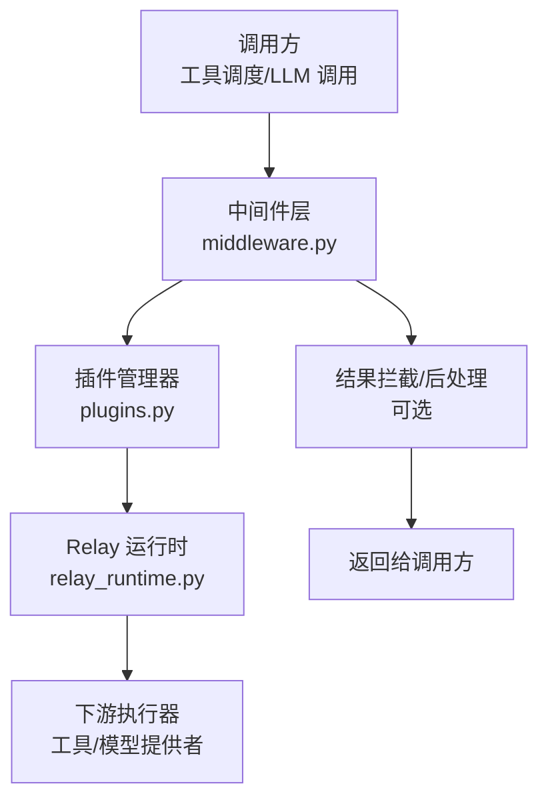
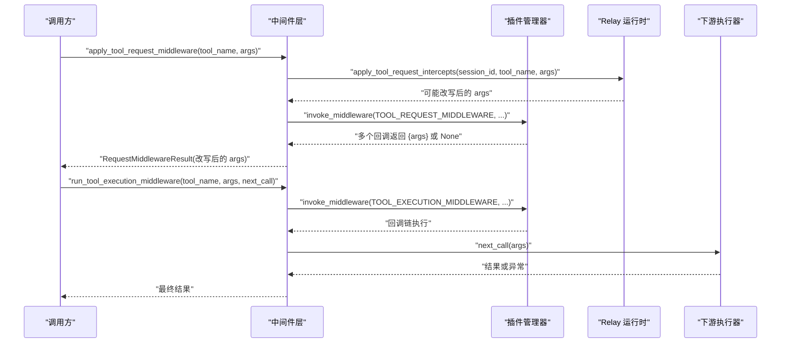
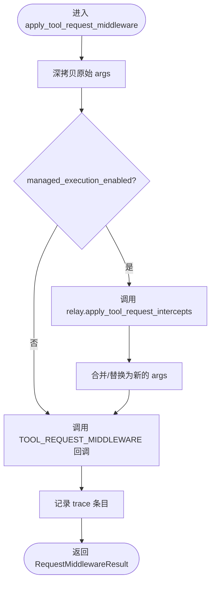
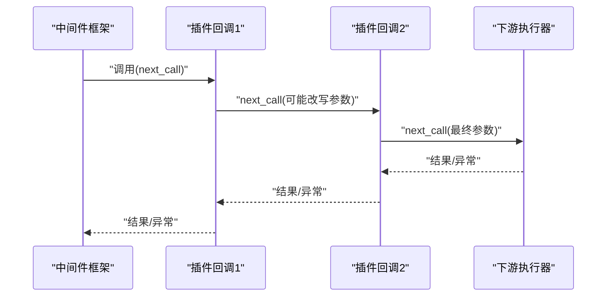
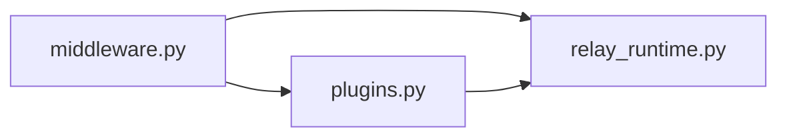

# 中间件管道

<cite>
**本文引用的文件**
- [hermes_cli/middleware.py](file://hermes_cli/middleware.py)
- [hermes_cli/plugins.py](file://hermes_cli/plugins.py)
- [agent/relay_runtime.py](file://agent/relay_runtime.py)
- [tests/tools/test_terminal_error_redaction.py](file://tests/tools/test_terminal_error_redaction.py)
</cite>

## 目录
1. [简介](#简介)
2. [项目结构](#项目结构)
3. [核心组件](#核心组件)
4. [架构总览](#架构总览)
5. [详细组件分析](#详细组件分析)
6. [依赖关系分析](#依赖关系分析)
7. [性能考量](#性能考量)
8. [故障排查指南](#故障排查指南)
9. [结论](#结论)
10. [附录：自定义中间件开发示例与最佳实践](#附录自定义中间件开发示例与最佳实践)

## 简介
本文件面向 Hermes Agent 的“工具调用中间件管道”，系统性说明请求预处理、执行链包裹、结果拦截与错误传播机制，覆盖注册方式、执行顺序、上下文共享、监控插桩（Relay）以及调试技巧。目标是帮助开发者安全、可观测地扩展工具执行流程，实现参数转换、日志记录、性能分析与策略拦截等能力。

## 项目结构
围绕中间件管道的关键代码分布在以下模块：
- hermes_cli/middleware.py：定义中间件类型、请求改写、执行链编排、异常处理与追踪。
- hermes_cli/plugins.py：插件系统，负责发现、加载插件并维护中间件回调注册表；提供 invoke_middleware 等接口。
- agent/relay_runtime.py：会话/轮次级 Relay 运行时，提供工具请求拦截（request_intercepts）、会话作用域与埋点。
- tests/tools/test_terminal_error_redaction.py：通过终端工具的测试用例展示错误脱敏与输出重写的行为，体现中间件/钩子对结果的最终影响。

图表来源
- [hermes_cli/middleware.py:77-176](file://hermes_cli/middleware.py#L77-L176)
- [hermes_cli/plugins.py:2148-2169](file://hermes_cli/plugins.py#L2148-L2169)
- [agent/relay_runtime.py:271-297](file://agent/relay_runtime.py#L271-L297)

章节来源
- [hermes_cli/middleware.py:1-328](file://hermes_cli/middleware.py#L1-L328)
- [hermes_cli/plugins.py:1-800](file://hermes_cli/plugins.py#L1-L800)
- [agent/relay_runtime.py:1-800](file://agent/relay_runtime.py#L1-L800)

## 核心组件
- 中间件类型与常量
  - 工具请求中间件：TOOL_REQUEST_MIDDLEWARE
  - 工具执行中间件：TOOL_EXECUTION_MIDDLEWARE
  - LLM 请求中间件：LLM_REQUEST_MIDDLEWARE
  - LLM 执行中间件：LLM_EXECUTION_MIDDLEWARE
  - 兼容别名：API_REQUEST_MIDDLEWARE、API_EXECUTION_MIDDLEWARE
- 请求改写与追踪
  - apply_tool_request_middleware：在工具执行前改写 args，并集成 Nemo Relay 的请求拦截。
  - apply_llm_request_middleware：在 LLM 发送前改写 request。
  - RequestMiddlewareResult：封装 payload、original_payload、changed 标志与 trace 列表。
- 执行链编排
  - run_tool_execution_middleware / run_llm_execution_middleware：将 next_call 包装进执行链，支持单用约束与异常透传。
  - _run_execution_chain：按注册顺序依次调用中间件回调，管理 next_call 生命周期与异常恢复。
- 插件注册与调用
  - PluginManager.invoke_middleware：遍历注册的中间件回调，隔离异常，收集非空返回值。
  - has_middleware / get_plugin_manager：查询与获取全局插件管理器。
- Relay 集成
  - apply_tool_request_intercepts：在受管执行模式下，调用 Relay 的工具请求拦截函数，实现更细粒度的请求重写。
  - 会话/轮次作用域：确保埋点与上下文在正确的会话栈中运行。

章节来源
- [hermes_cli/middleware.py:17-34](file://hermes_cli/middleware.py#L17-L34)
- [hermes_cli/middleware.py:77-176](file://hermes_cli/middleware.py#L77-L176)
- [hermes_cli/middleware.py:187-224](file://hermes_cli/middleware.py#L187-L224)
- [hermes_cli/middleware.py:236-316](file://hermes_cli/middleware.py#L236-L316)
- [hermes_cli/plugins.py:2148-2169](file://hermes_cli/plugins.py#L2148-L2169)
- [agent/relay_runtime.py:271-297](file://agent/relay_runtime.py#L271-L297)

## 架构总览
中间件管道由“请求阶段”和“执行阶段”组成，二者均支持多插件协作与可观测性。

图表来源
- [hermes_cli/middleware.py:120-176](file://hermes_cli/middleware.py#L120-L176)
- [hermes_cli/middleware.py:206-224](file://hermes_cli/middleware.py#L206-L224)
- [hermes_cli/plugins.py:2148-2169](file://hermes_cli/plugins.py#L2148-L2169)
- [agent/relay_runtime.py:271-297](file://agent/relay_runtime.py#L271-L297)

## 详细组件分析

### 工具请求中间件：参数转换与拦截
- 功能要点
  - 深拷贝原始参数，避免污染上游数据。
  - 先调用 Relay 的 request_intercepts（若启用），再调用已注册的 TOOL_REQUEST_MIDDLEWARE 回调。
  - 每个回调可返回 {"args": {...}} 以替换后续看到的参数；trace 记录来源（如 nemo_relay）。
- 数据流
  - 输入：tool_name, args, context（含 session_id、skip_relay 等）
  - 输出：RequestMiddlewareResult(payload=最终 args, original_payload=原始 args, changed, trace)
- 错误处理
  - 插件回调异常被捕获并记录警告，不影响其他回调。
  - 非 dict 或非 args 字段将被忽略，保证鲁棒性。

图表来源
- [hermes_cli/middleware.py:120-176](file://hermes_cli/middleware.py#L120-L176)
- [agent/relay_runtime.py:271-297](file://agent/relay_runtime.py#L271-L297)

章节来源
- [hermes_cli/middleware.py:120-176](file://hermes_cli/middleware.py#L120-L176)
- [agent/relay_runtime.py:271-297](file://agent/relay_runtime.py#L271-L297)

### 工具执行中间件：执行链与结果拦截
- 功能要点
  - 将 next_call 作为“终端调用”注入执行链，确保下游只执行一次。
  - 每个中间件回调接收 kwargs（包含 tool_name、args、original_args 等）与 next_call。
  - 回调可修改传入 next_call 的参数，从而改变下游实际执行内容。
- 执行顺序
  - 按插件管理器注册的顺序依次执行；最后一个回调之后调用 next_call。
- 异常与恢复
  - next_call 仅允许调用一次，重复调用会抛出运行时错误。
  - 回调内部异常会被捕获并记录；若 next_call 已成功执行，则返回其结果，否则尝试继续下游。
  - 下游异常会被解包并向上抛出，保持异常语义。

图表来源
- [hermes_cli/middleware.py:206-224](file://hermes_cli/middleware.py#L206-L224)
- [hermes_cli/middleware.py:254-316](file://hermes_cli/middleware.py#L254-L316)

章节来源
- [hermes_cli/middleware.py:206-224](file://hermes_cli/middleware.py#L206-L224)
- [hermes_cli/middleware.py:254-316](file://hermes_cli/middleware.py#L254-L316)

### LLM 请求与执行中间件
- 请求阶段
  - apply_llm_request_middleware：深拷贝 request，逐个回调可返回 {"request": {...}} 进行替换，trace 记录来源。
- 执行阶段
  - run_llm_execution_middleware：将 next_call 包装进执行链，传递 original_request 以便审计。
- 兼容性
  - 提供 API_* 别名以保持向后兼容。

章节来源
- [hermes_cli/middleware.py:77-117](file://hermes_cli/middleware.py#L77-L117)
- [hermes_cli/middleware.py:187-203](file://hermes_cli/middleware.py#L187-L203)
- [hermes_cli/middleware.py:227-233](file://hermes_cli/middleware.py#L227-L233)

### 插件系统与中间件注册
- 注册位置
  - 插件通过插件管理器维护中间件回调集合；每个 kind 对应一个回调列表。
- 调用入口
  - invoke_middleware(kind, **kwargs)：遍历回调，捕获异常，收集非空返回值。
  - has_middleware(kind)：判断是否存在该类型的中间件。
- 调试
  - HERMES_PLUGINS_DEBUG=1 可开启插件发现与加载的详细日志。

章节来源
- [hermes_cli/plugins.py:2148-2169](file://hermes_cli/plugins.py#L2148-L2169)
- [hermes_cli/plugins.py:2301-2315](file://hermes_cli/plugins.py#L2301-L2315)
- [hermes_cli/plugins.py:83-127](file://hermes_cli/plugins.py#L83-L127)

### 监控插桩与上下文共享（Relay）
- 会话与作用域
  - RelayRuntime.ensure_session/run_in_session：在正确的作用域栈中执行操作，支持异步与同步路径。
  - ConversationLease/RelayTurnContext：管理会话租约与轮次上下文，确保并发安全。
- 工具请求拦截
  - apply_tool_request_intercepts：在受管执行模式下，调用 Relay 的 tools.request_intercepts，实现集中式请求重写。
- 埋点与关闭
  - emit_mark/close_session：在会话结束时清理作用域并刷新订阅者。

章节来源
- [agent/relay_runtime.py:41-129](file://agent/relay_runtime.py#L41-L129)
- [agent/relay_runtime.py:191-247](file://agent/relay_runtime.py#L191-L247)
- [agent/relay_runtime.py:249-344](file://agent/relay_runtime.py#L249-L344)
- [agent/relay_runtime.py:455-800](file://agent/relay_runtime.py#L455-L800)

## 依赖关系分析
- 中间件层依赖插件管理器获取回调列表。
- 插件管理器维护中间件回调注册表，并在调用时隔离异常。
- 中间件层在工具请求阶段可选择性地调用 Relay 运行时进行请求拦截。
- Relay 运行时依赖会话与作用域机制，确保埋点与上下文正确。

图表来源
- [hermes_cli/middleware.py:236-251](file://hermes_cli/middleware.py#L236-L251)
- [hermes_cli/plugins.py:2148-2169](file://hermes_cli/plugins.py#L2148-L2169)
- [agent/relay_runtime.py:271-297](file://agent/relay_runtime.py#L271-L297)

章节来源
- [hermes_cli/middleware.py:236-251](file://hermes_cli/middleware.py#L236-L251)
- [hermes_cli/plugins.py:2148-2169](file://hermes_cli/plugins.py#L2148-L2169)
- [agent/relay_runtime.py:271-297](file://agent/relay_runtime.py#L271-L297)

## 性能考量
- 深拷贝开销：请求阶段使用深拷贝以避免污染上游；对于大型对象，注意潜在的性能影响。
- 执行链长度：中间件数量越多，调用栈越深；建议将轻量逻辑放入中间件，复杂逻辑下沉到专用服务。
- 单次 next_call 约束：防止重复执行导致的资源浪费与状态不一致。
- Relay 作用域切换：在高频路径上尽量减少不必要的上下文复制与切换。

[本节为通用指导，不直接分析具体文件]

## 故障排查指南
- 常见症状
  - 工具结果泄露敏感信息：检查是否启用了脱敏或命令感知的重写逻辑。
  - 中间件未生效：确认插件已加载且注册了对应 kind 的回调。
  - next_call 多次调用报错：检查中间件回调是否正确仅调用一次 next_call。
- 定位方法
  - 启用 HERMES_PLUGINS_DEBUG=1 查看插件发现与加载日志。
  - 检查 RequestMiddlewareResult.trace 中的 source 字段，确认改写来源（如 nemo_relay）。
  - 查看中间件回调异常日志，定位具体插件与回调名称。
- 参考用例
  - 终端工具的错误脱敏与输出重写行为可通过相关测试验证。

章节来源
- [tests/tools/test_terminal_error_redaction.py:1-154](file://tests/tools/test_terminal_error_redaction.py#L1-L154)
- [hermes_cli/plugins.py:83-127](file://hermes_cli/plugins.py#L83-L127)
- [hermes_cli/middleware.py:254-316](file://hermes_cli/middleware.py#L254-L316)

## 结论
Hermes Agent 的中间件管道通过清晰的请求/执行两阶段设计，结合插件系统与 Relay 运行时，提供了强大的可扩展性与可观测性。开发者可以安全地实现参数转换、日志记录、性能分析与策略拦截，同时借助 trace 与调试开关快速定位问题。遵循单次 next_call 与异常隔离原则，可确保系统的稳定性与一致性。

[本节为总结，不直接分析具体文件]

## 附录：自定义中间件开发示例与最佳实践

### 开发目标
- 参数转换：在工具执行前标准化或补充参数。
- 日志记录：记录工具调用的关键上下文与耗时。
- 性能分析：统计执行时间与资源占用。
- 策略拦截：基于规则阻止或升级审批。

### 步骤概览
- 在插件中注册中间件回调到指定 kind（如 TOOL_REQUEST_MIDDLEWARE 或 TOOL_EXECUTION_MIDDLEWARE）。
- 在回调中读取上下文（tool_name、args、original_args、session_id 等），必要时返回新的 args 或调用 next_call。
- 使用 RequestMiddlewareResult.trace 或日志记录变更来源。
- 严格遵守 next_call 单次调用约定，避免重复执行。

### 示例思路（以伪代码描述）
- 请求阶段：校验并规范化参数，记录入参快照，必要时拒绝或改写。
- 执行阶段：计时开始，调用 next_call，捕获结果与异常，记录耗时与指标，必要时改写结果。
- 与 Relay 集成：在受管执行模式下，利用 apply_tool_request_intercepts 进行集中式请求重写。

[本节为概念性指导，不直接分析具体文件]

### 最佳实践
- 幂等与健壮：中间件不应依赖外部副作用；对异常进行隔离与记录。
- 最小化拷贝：仅在必要时深拷贝请求负载。
- 明确职责：请求阶段专注参数与策略，执行阶段专注度量与结果处理。
- 可观测性：充分利用 trace、日志与 Relay 埋点，便于排障与优化。

[本节为通用指导，不直接分析具体文件]