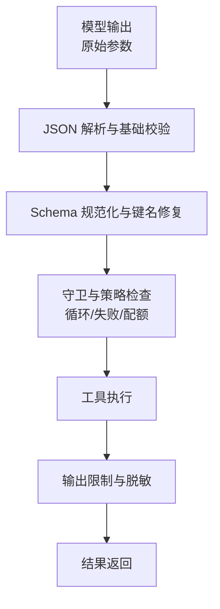
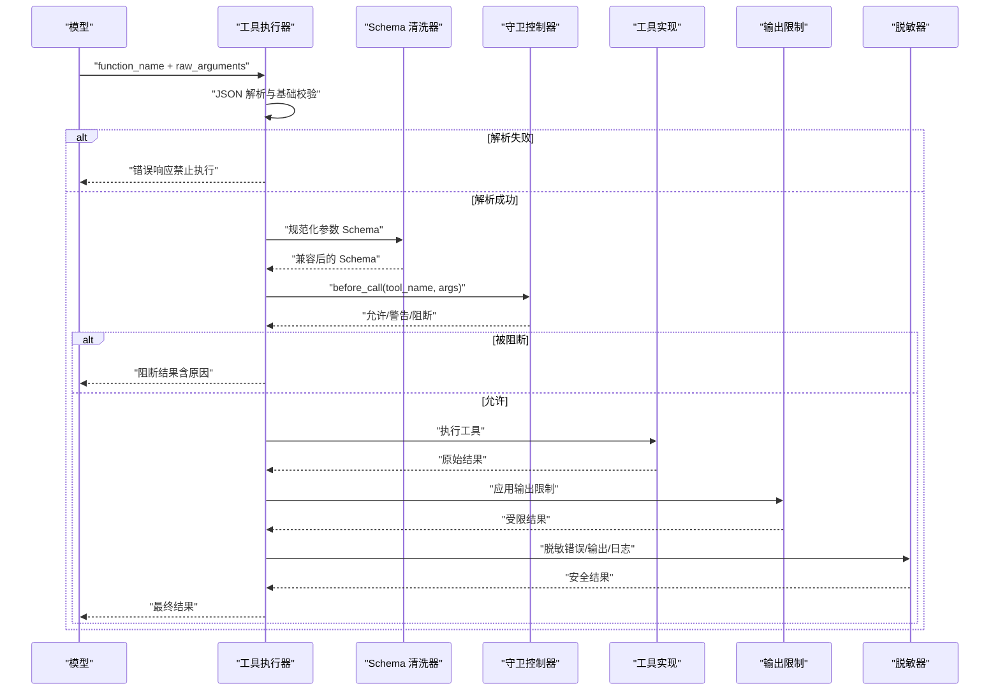
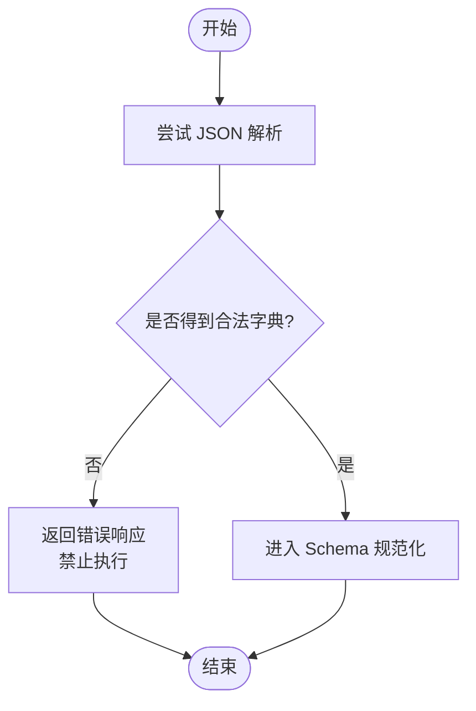
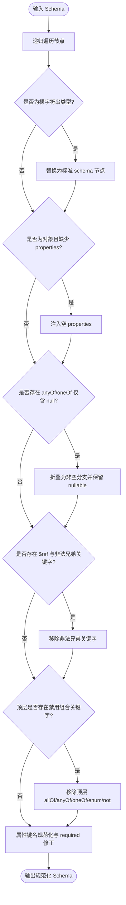
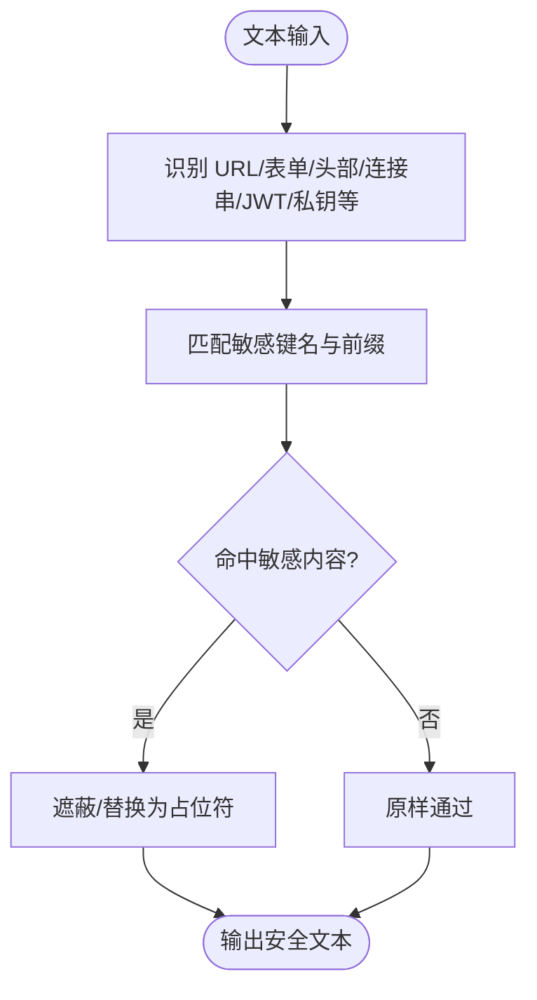
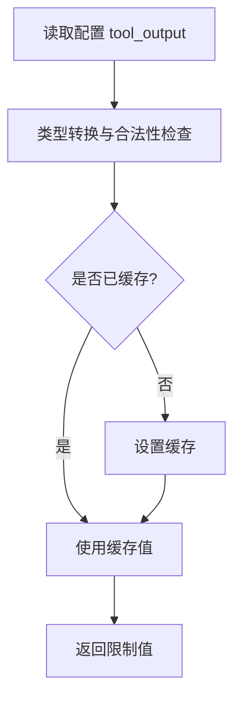
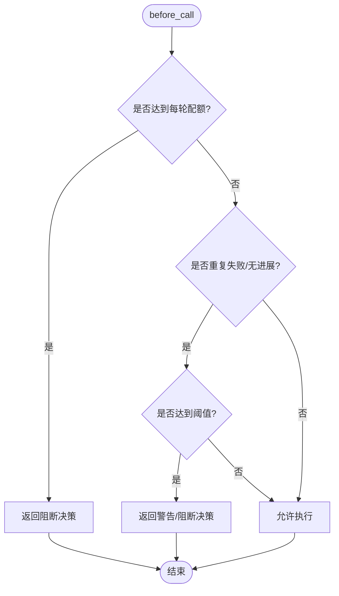
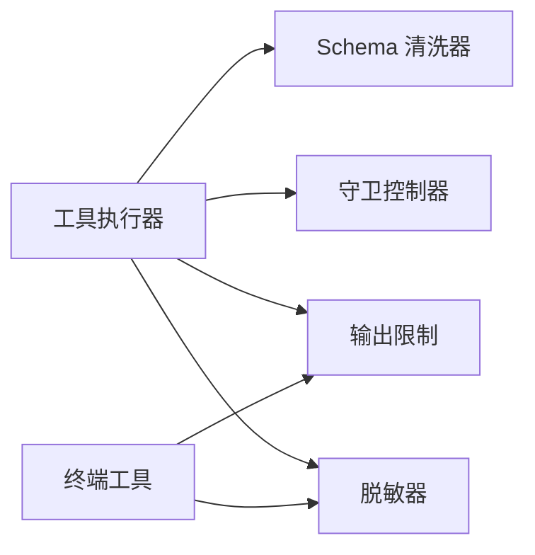

# 参数验证系统

<cite>
**本文引用的文件**
- [agent/tool_executor.py](file://agent/tool_executor.py)
- [tools/schema_sanitizer.py](file://tools/schema_sanitizer.py)
- [agent/redact.py](file://agent/redact.py)
- [tools/terminal_tool.py](file://tools/terminal_tool.py)
- [tools/tool_output_limits.py](file://tools/tool_output_limits.py)
- [agent/tool_guardrails.py](file://agent/tool_guardrails.py)
</cite>

## 目录
1. [简介](#简介)
2. [项目结构](#项目结构)
3. [核心组件](#核心组件)
4. [架构总览](#架构总览)
5. [详细组件分析](#详细组件分析)
6. [依赖关系分析](#依赖关系分析)
7. [性能考虑](#性能考虑)
8. [故障排查指南](#故障排查指南)
9. [结论](#结论)
10. [附录](#附录)

## 简介
本文件系统性说明 Hermes Agent 的参数验证系统，覆盖从工具参数的解析、校验到转换与输出安全的全链路。重点包括：
- JSON 参数解析与类型检查
- 工具输入 Schema 的兼容性与规范化
- 敏感信息脱敏与安全过滤
- 输入长度限制与输出截断
- 复杂参数结构（嵌套对象、数组、特殊数据类型）的处理策略
- 错误处理策略与用户友好的错误消息生成
- 配置选项与安全考量

该体系确保模型生成的工具调用在到达具体工具实现前，具备强约束、可观测、可恢复且安全的保障。

## 项目结构
围绕“参数验证”的关键模块与职责如下：
- 参数解析与执行编排：负责将模型输出的原始参数解析为结构化数据，并在执行前后进行安全与策略检查。
- Schema 规范化：对工具参数 Schema 做兼容性清洗，使不同后端都能正确消费。
- 敏感信息脱敏：在日志、错误、输出等边界统一进行脱敏，防止密钥泄露。
- 输出限制：集中管理工具输出大小、行数、行宽等限制，避免资源耗尽。
- 守卫与限流：基于每轮调用统计与阈值，阻止异常循环与过度调用。

**章节来源**
- [agent/tool_executor.py:141-157](file://agent/tool_executor.py#L141-L157)
- [tools/schema_sanitizer.py:120-174](file://tools/schema_sanitizer.py#L120-L174)
- [agent/tool_guardrails.py:273-348](file://agent/tool_guardrails.py#L273-L348)
- [tools/tool_output_limits.py:59-89](file://tools/tool_output_limits.py#L59-L89)
- [agent/redact.py:772-800](file://agent/redact.py#L772-L800)

## 核心组件
- 参数解析器：将字符串形式的参数解析为字典；若失败则返回明确的错误响应，阻止后续执行。
- Schema 清洗器：修复不兼容的 JSON Schema 片段（如 bare-string 类型、anyOf/oneOf 空分支、$ref 兄弟关键字等），并保证属性键符合目标后端要求。
- 安全脱敏器：在日志、错误、终端输出等出口处应用正则规则，屏蔽 API Key、JWT、数据库连接串、URL 查询参数中的敏感值等。
- 输出限制器：集中读取配置项，提供最大字节数、最大行数、单行最大长度等限制，默认值保持向后兼容。
- 守卫控制器：按轮次统计工具调用行为，检测重复失败、无进展、超限调用，并给出警告或阻断决策。

**章节来源**
- [agent/tool_executor.py:141-157](file://agent/tool_executor.py#L141-L157)
- [tools/schema_sanitizer.py:56-117](file://tools/schema_sanitizer.py#L56-L117)
- [agent/redact.py:772-800](file://agent/redact.py#L772-L800)
- [tools/tool_output_limits.py:59-89](file://tools/tool_output_limits.py#L59-L89)
- [agent/tool_guardrails.py:273-348](file://agent/tool_guardrails.py#L273-L348)

## 架构总览
下图展示了工具调用的完整参数处理流程，涵盖解析、Schema 清洗、守卫检查、执行、输出限制与脱敏。

**图表来源**
- [agent/tool_executor.py:141-157](file://agent/tool_executor.py#L141-L157)
- [tools/schema_sanitizer.py:120-174](file://tools/schema_sanitizer.py#L120-L174)
- [agent/tool_guardrails.py:273-348](file://agent/tool_guardrails.py#L273-L348)
- [tools/tool_output_limits.py:59-89](file://tools/tool_output_limits.py#L59-L89)
- [agent/redact.py:772-800](file://agent/redact.py#L772-L800)

## 详细组件分析

### 参数解析与基础校验
- 入口：工具执行器在收到模型发出的原始参数后，尝试将其作为 JSON 解析为字典。
- 失败处理：若解析失败或类型不符，直接返回包含错误信息的 JSON 字符串，明确告知“工具未执行”，避免进入后续流程。
- 设计要点：解析阶段不做任何“修复”或“强制转换”，保持严格性，确保下游 Schema 校验与守卫逻辑能准确工作。

**图表来源**
- [agent/tool_executor.py:141-157](file://agent/tool_executor.py#L141-L157)

**章节来源**
- [agent/tool_executor.py:141-157](file://agent/tool_executor.py#L141-L157)

### Schema 规范化与键名修复
- 目标：让工具参数 Schema 在不同后端（如 llama.cpp、xAI、Anthropic 等）中稳定可用。
- 主要修复：
  - 将裸字符串类型（如 "object"）转换为标准 schema 节点，必要时注入 properties。
  - 将 anyOf/oneOf 中仅用于表示可选 null 的分支折叠为非空分支，保留 nullable 提示。
  - 移除 $ref 节点的非法兄弟关键字（如 default）。
  - 去除顶层组合关键字（allOf/anyOf/oneOf/enum/not），避免严格后端拒绝。
  - 属性键名规范化：将不符合目标后端命名规范的键重命名为安全形式，并提供反向映射以还原模型返回的参数键。
- 复杂类型支持：递归处理 properties、items、additionalProperties、anyOf/oneOf/allOf、$defs/definitions 等。

**图表来源**
- [tools/schema_sanitizer.py:120-174](file://tools/schema_sanitizer.py#L120-L174)
- [tools/schema_sanitizer.py:240-302](file://tools/schema_sanitizer.py#L240-L302)
- [tools/schema_sanitizer.py:339-398](file://tools/schema_sanitizer.py#L339-L398)
- [tools/schema_sanitizer.py:401-540](file://tools/schema_sanitizer.py#L401-L540)

**章节来源**
- [tools/schema_sanitizer.py:56-117](file://tools/schema_sanitizer.py#L56-L117)
- [tools/schema_sanitizer.py:120-174](file://tools/schema_sanitizer.py#L120-L174)
- [tools/schema_sanitizer.py:240-302](file://tools/schema_sanitizer.py#L240-L302)
- [tools/schema_sanitizer.py:339-398](file://tools/schema_sanitizer.py#L339-L398)
- [tools/schema_sanitizer.py:401-540](file://tools/schema_sanitizer.py#L401-L540)

### 安全脱敏与敏感信息过滤
- 适用范围：日志、错误消息、终端输出、URL 查询参数、表单体、授权头、数据库连接串、JWT、私有密钥块等。
- 策略：
  - 通过多种正则模式识别常见密钥前缀与敏感键名，进行遮蔽或替换。
  - 对 URL 查询参数与 userinfo 进行严格脱敏，避免 OAuth 回调、预签名链接之外的场景泄露。
  - 控制字符分割的令牌也能被识别并遮蔽，防止绕过。
  - 提供开关与环境变量控制全局脱敏行为，默认开启。
- 终端工具集成：终端工具的错误信封在序列化前强制脱敏，确保错误与回溯不包含敏感信息。

**图表来源**
- [agent/redact.py:772-800](file://agent/redact.py#L772-L800)
- [tools/terminal_tool.py:57-61](file://tools/terminal_tool.py#L57-L61)

**章节来源**
- [agent/redact.py:772-800](file://agent/redact.py#L772-L800)
- [tools/terminal_tool.py:57-61](file://tools/terminal_tool.py#L57-L61)

### 输出限制与输入长度控制
- 配置来源：集中从配置文件读取 tool_output 相关限制项，缺失或无效时回退到内置默认值。
- 关键指标：
  - max_bytes：终端输出上限（字符/字节近似）。
  - max_lines：read_file 分页与截断上限。
  - max_line_length：单行最大长度，超出部分标记截断。
- 缓存机制：模块级缓存避免每次工具调用都读取配置，提升性能。

**图表来源**
- [tools/tool_output_limits.py:59-89](file://tools/tool_output_limits.py#L59-L89)

**章节来源**
- [tools/tool_output_limits.py:59-89](file://tools/tool_output_limits.py#L59-L89)

### 守卫与限流（循环保护与配额）
- 目标：防止工具调用陷入重复失败、无进展或无限循环，保护会话稳定性。
- 机制：
  - 每轮重置计数器，统计相同参数失败的次数、同工具失败次数、只读工具重复结果次数。
  - 针对高风险工具（如 web_search、delegate_task）设置每轮上限，超过即阻断。
  - 支持警告与硬停止两种策略，默认仅警告，硬停止需显式启用。
- 输出：当触发告警或阻断时，返回包含元数据的决策，便于上层展示与记录。

**图表来源**
- [agent/tool_guardrails.py:273-348](file://agent/tool_guardrails.py#L273-L348)
- [agent/tool_guardrails.py:447-507](file://agent/tool_guardrails.py#L447-L507)

**章节来源**
- [agent/tool_guardrails.py:273-348](file://agent/tool_guardrails.py#L273-L348)
- [agent/tool_guardrails.py:447-507](file://agent/tool_guardrails.py#L447-L507)

### 复杂参数结构的处理示例
- 嵌套对象：Schema 递归处理 properties 与 items，确保每个层级都被规范化；属性键名重命名与 required 列表同步修正。
- 数组：items 子 schema 同样被递归清洗；anyOf/oneOf 的多类型数组会被转换为 anyOf 的单类型分支集合，避免丢失分支。
- 特殊数据类型：
  - const 联合会被折叠为 enum，提高后端兼容性。
  - 空或全 null 的分支会被清理，必要时保留 nullable 提示。
  - 顶层禁用组合关键字会被移除，但嵌套层保留，兼顾提示与兼容性。

**章节来源**
- [tools/schema_sanitizer.py:240-302](file://tools/schema_sanitizer.py#L240-L302)
- [tools/schema_sanitizer.py:339-398](file://tools/schema_sanitizer.py#L339-L398)
- [tools/schema_sanitizer.py:401-540](file://tools/schema_sanitizer.py#L401-L540)

## 依赖关系分析
- 工具执行器依赖：
  - Schema 清洗器：在参数进入工具前进行兼容化处理。
  - 守卫控制器：在执行前进行策略检查，决定允许、警告或阻断。
  - 输出限制与脱敏：在结果返回前进行安全与容量控制。
- 终端工具依赖：
  - 脱敏器：错误信封强制脱敏，避免泄露。
  - 输出限制：终端输出受限于配置。
- 配置依赖：
  - 输出限制从配置加载，默认值保证向后兼容。
  - 脱敏可通过环境变量关闭（不推荐），但默认开启。

**图表来源**
- [agent/tool_executor.py:141-157](file://agent/tool_executor.py#L141-L157)
- [tools/schema_sanitizer.py:120-174](file://tools/schema_sanitizer.py#L120-L174)
- [agent/tool_guardrails.py:273-348](file://agent/tool_guardrails.py#L273-L348)
- [tools/tool_output_limits.py:59-89](file://tools/tool_output_limits.py#L59-L89)
- [agent/redact.py:772-800](file://agent/redact.py#L772-L800)
- [tools/terminal_tool.py:57-61](file://tools/terminal_tool.py#L57-L61)

**章节来源**
- [agent/tool_executor.py:141-157](file://agent/tool_executor.py#L141-L157)
- [tools/schema_sanitizer.py:120-174](file://tools/schema_sanitizer.py#L120-L174)
- [agent/tool_guardrails.py:273-348](file://agent/tool_guardrails.py#L273-L348)
- [tools/tool_output_limits.py:59-89](file://tools/tool_output_limits.py#L59-L89)
- [agent/redact.py:772-800](file://agent/redact.py#L772-L800)
- [tools/terminal_tool.py:57-61](file://tools/terminal_tool.py#L57-L61)

## 性能考虑
- Schema 清洗采用深度拷贝与递归遍历，复杂度与 Schema 树规模线性相关；仅在必要路径进行键名重映射与 required 修正。
- 输出限制读取配置后进行模块级缓存，避免频繁磁盘 I/O。
- 脱敏使用预编译正则与快速前缀匹配，减少回溯开销；对长文本采取保守匹配策略，避免灾难性回溯。
- 守卫控制器按轮次重置计数，避免跨轮累积导致的误判；配额检查在 before_call 阶段完成，尽早阻断高成本调用。

[本节为通用性能讨论，无需特定文件引用]

## 故障排查指南
- 参数解析失败：
  - 现象：工具未执行，返回“无效工具参数”的错误响应。
  - 排查：确认模型输出为合法的 JSON 对象；检查字段名称与类型是否符合工具定义。
  - 参考：[agent/tool_executor.py:141-157](file://agent/tool_executor.py#L141-L157)
- Schema 兼容性问题：
  - 现象：后端拒绝工具请求（如语法解析失败、顶层组合关键字不被接受）。
  - 排查：查看 Schema 清洗日志，确认是否移除了禁用关键字或折叠了空分支；必要时调整工具定义。
  - 参考：[tools/schema_sanitizer.py:120-174](file://tools/schema_sanitizer.py#L120-L174)
- 敏感信息泄露风险：
  - 现象：日志或错误中包含密钥、JWT、数据库连接串等。
  - 排查：确认脱敏器已启用；检查 URL 查询参数与表单体是否被正确识别；必要时增强正则规则。
  - 参考：[agent/redact.py:772-800](file://agent/redact.py#L772-L800)
- 输出过大导致性能问题：
  - 现象：终端或文件操作输出过长，影响响应时间。
  - 排查：调整 tool_output 配置中的 max_bytes、max_lines、max_line_length；观察截断效果。
  - 参考：[tools/tool_output_limits.py:59-89](file://tools/tool_output_limits.py#L59-L89)
- 工具调用陷入循环：
  - 现象：同一工具反复失败或返回相同结果。
  - 排查：查看守卫控制器告警或阻断决策；调整阈值或优化工具参数。
  - 参考：[agent/tool_guardrails.py:273-348](file://agent/tool_guardrails.py#L273-L348)

**章节来源**
- [agent/tool_executor.py:141-157](file://agent/tool_executor.py#L141-L157)
- [tools/schema_sanitizer.py:120-174](file://tools/schema_sanitizer.py#L120-L174)
- [agent/redact.py:772-800](file://agent/redact.py#L772-L800)
- [tools/tool_output_limits.py:59-89](file://tools/tool_output_limits.py#L59-L89)
- [agent/tool_guardrails.py:273-348](file://agent/tool_guardrails.py#L273-L348)

## 结论
Hermes Agent 的参数验证系统通过“解析—规范—守卫—执行—限制—脱敏”的分层设计，实现了高兼容性、高安全性与高可用性的工具调用流程。开发者应关注：
- 确保模型输出为合法 JSON 对象，避免解析失败。
- 合理定义工具参数 Schema，减少后端兼容性问题。
- 启用并维护脱敏规则，防止敏感信息泄露。
- 根据业务需求配置输出限制与守卫阈值，平衡用户体验与系统稳定性。
- 对复杂参数结构进行测试，确保嵌套对象、数组与特殊类型的正确处理。

[本节为总结性内容，无需特定文件引用]

## 附录
- 配置建议：
  - tool_output.max_bytes：根据终端输出预期调整，默认 50000。
  - tool_output.max_lines：根据文件读取分页需求调整，默认 2000。
  - tool_output.max_line_length：根据单行显示需求调整，默认 2000。
- 安全建议：
  - 保持脱敏器默认开启，避免在生产环境关闭。
  - 定期审查脱敏规则，覆盖新增的密钥格式与敏感键名。
  - 对工具参数进行最小权限原则设计，避免传递不必要的数据。

[本节为补充信息，无需特定文件引用]