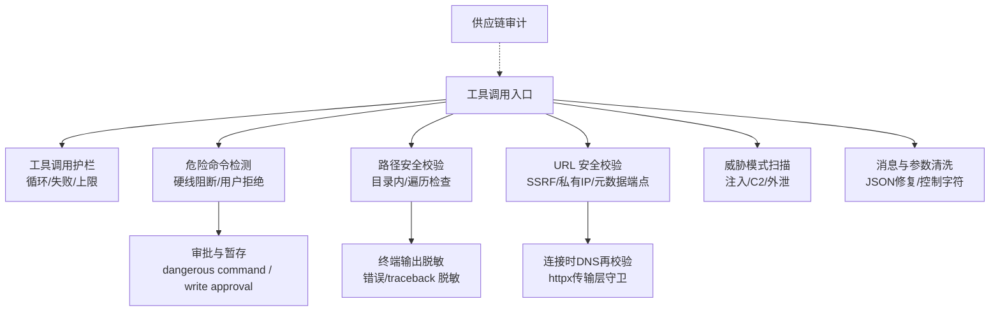
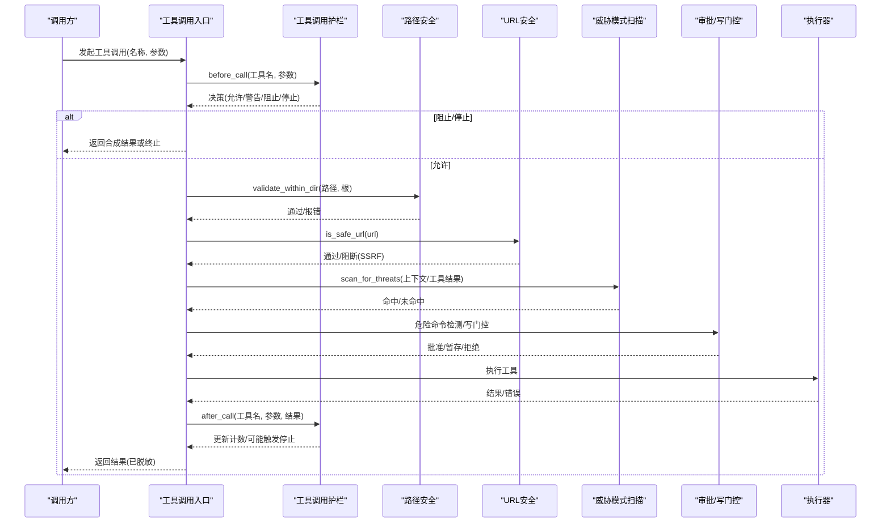
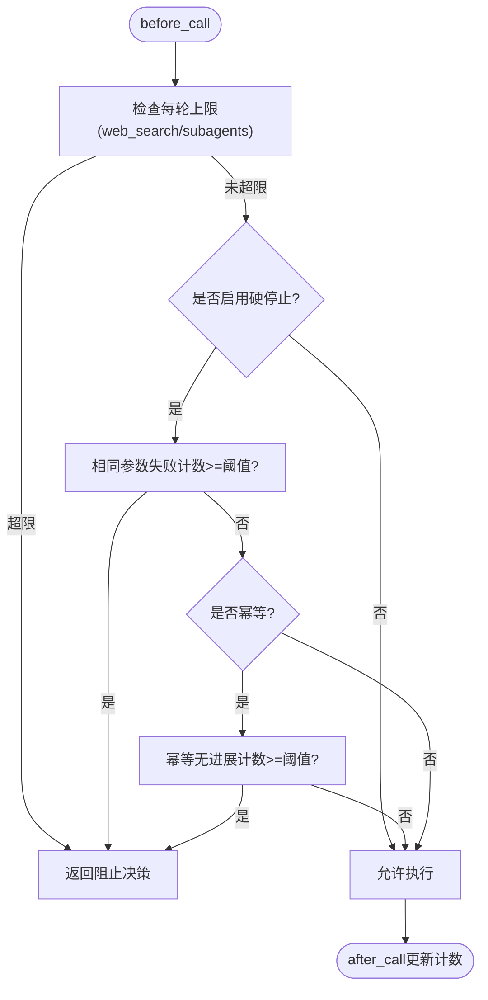
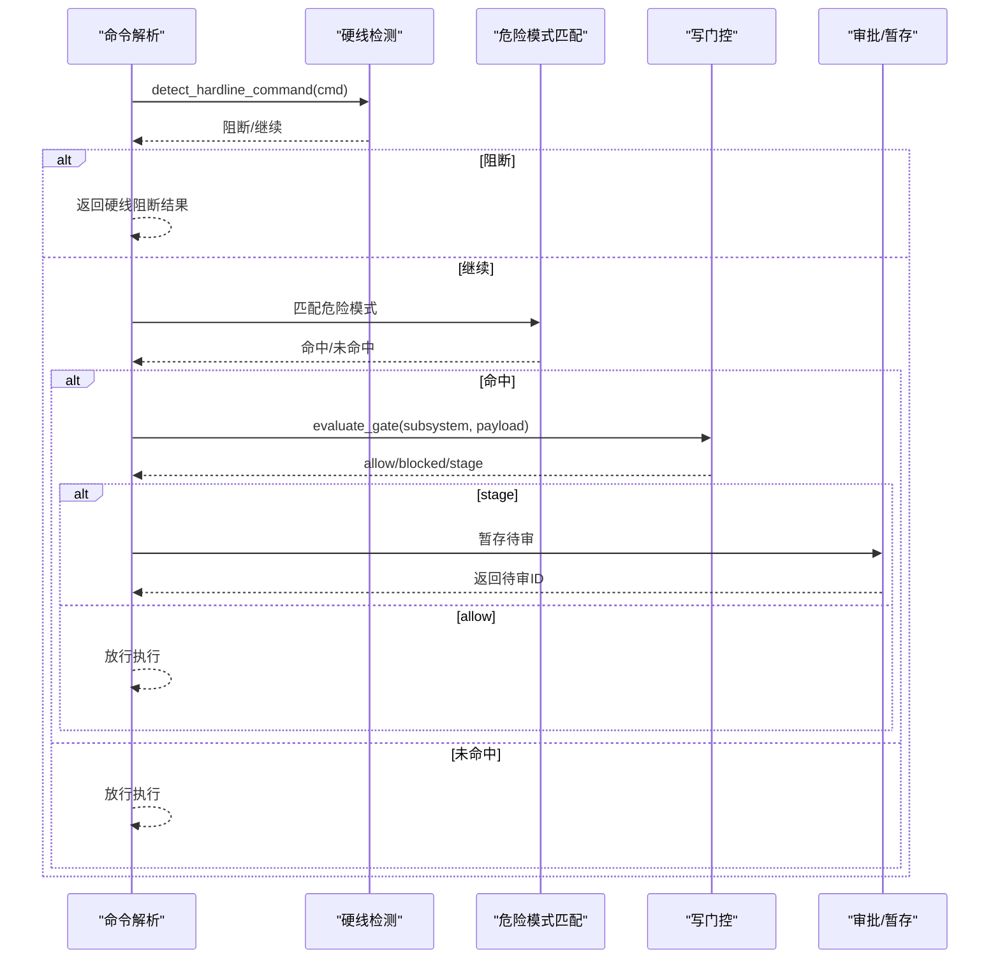
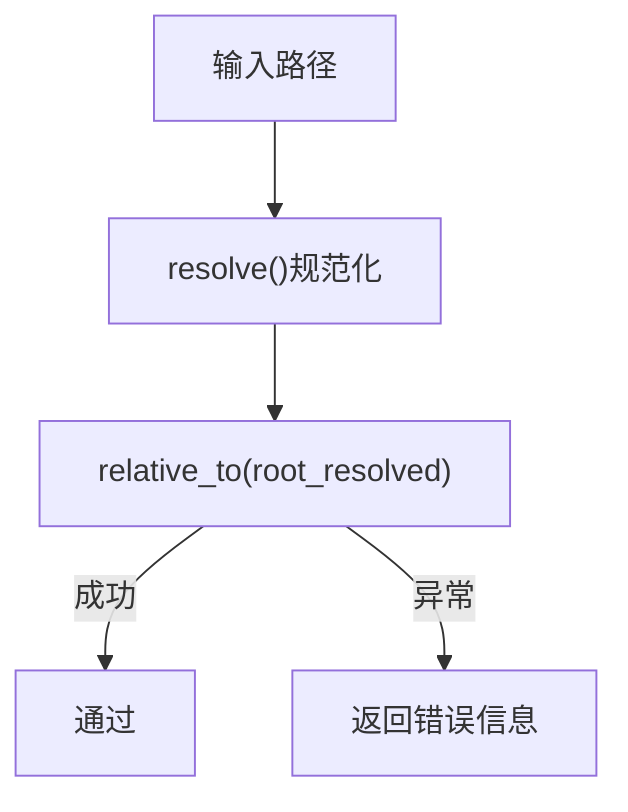
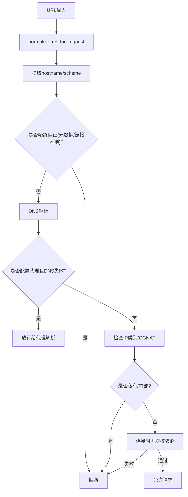
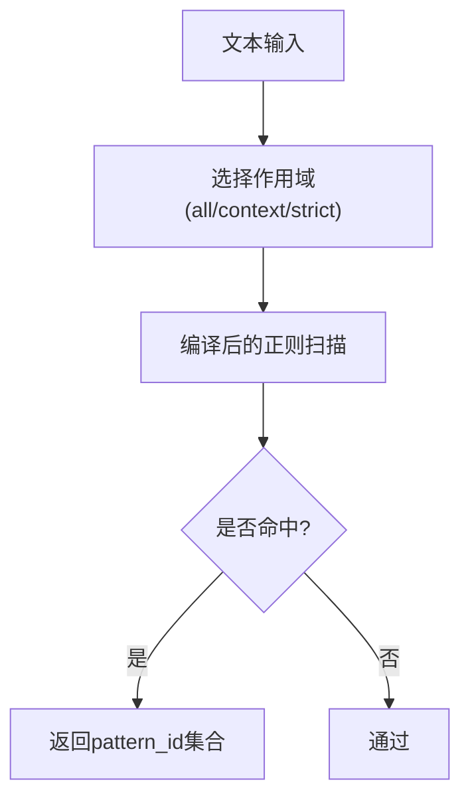
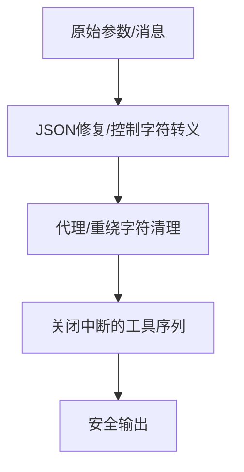
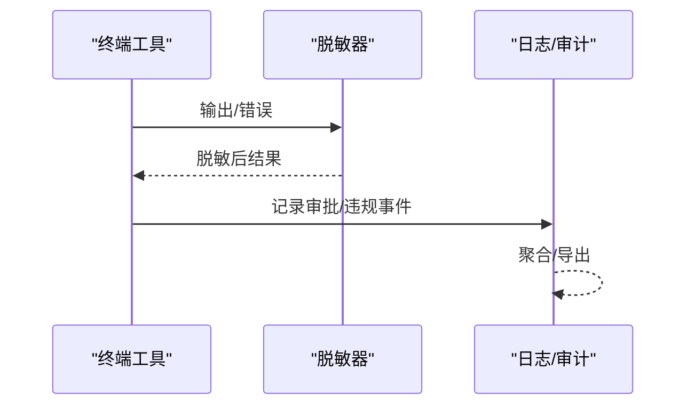
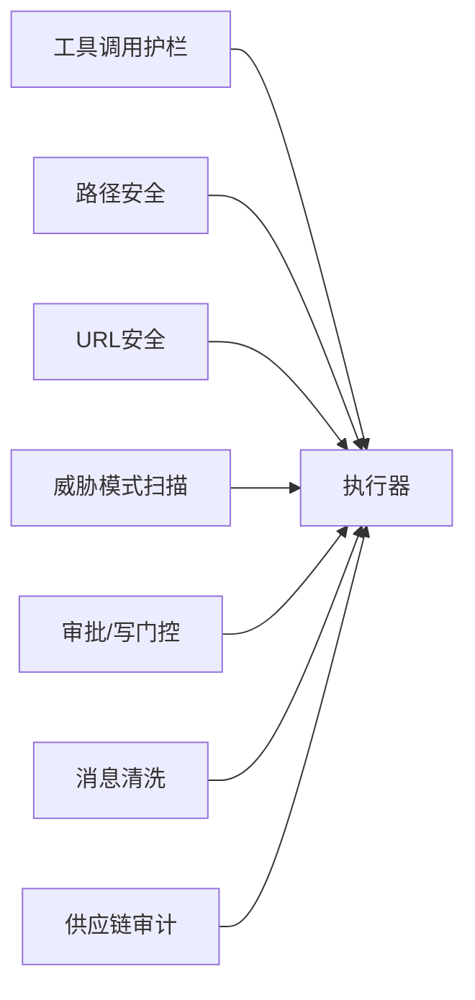

# 安全控制机制

<cite>
**本文引用的文件**
- [agent/tool_guardrails.py](file://agent/tool_guardrails.py)
- [tools/path_security.py](file://tools/path_security.py)
- [tools/url_safety.py](file://tools/url_safety.py)
- [tools/threat_patterns.py](file://tools/threat_patterns.py)
- [tools/approval.py](file://tools/approval.py)
- [tools/write_approval.py](file://tools/write_approval.py)
- [hermes_cli/security_audit.py](file://hermes_cli/security_audit.py)
- [agent/message_sanitization.py](file://agent/message_sanitization.py)
- [tests/tools/test_terminal_error_redaction.py](file://tests/tools/test_terminal_error_redaction.py)
</cite>

## 目录
1. [简介](#简介)
2. [项目结构](#项目结构)
3. [核心组件](#核心组件)
4. [架构总览](#架构总览)
5. [详细组件分析](#详细组件分析)
6. [依赖关系分析](#依赖关系分析)
7. [性能考量](#性能考量)
8. [故障排查指南](#故障排查指南)
9. [结论](#结论)
10. [附录](#附录)

## 简介
本文件系统性阐述 Hermes Agent 的安全控制机制，覆盖工具调用安全检查、权限验证与访问控制策略；危险命令检测、路径安全校验与输入清洗；审批流程、用户确认与撤销；以及安全策略配置、审计日志记录与违规处理。文档同时提供可操作的集成建议与安全最佳实践，帮助开发者在 Hermes Agent 中实现稳健的安全闭环。

## 项目结构
Hermes Agent 的安全能力由多个模块协同构成：
- 工具调用防护：循环/滥用保护、失败重试限制、每轮上限（web_search、子代理）等
- 网络与路径安全：URL SSRF 防护、私有/内部地址拦截、路径越界检查
- 威胁模式扫描：提示注入、C2/Brainworm、敏感信息外泄等正则规则集
- 审批与写操作门控：危险命令审批、持久化写入（memory/skills）暂存与审核
- 消息与参数清洗：JSON 修复、控制字符转义、代理/重定向安全
- 供应链审计：对 venv、插件、MCP 服务器进行漏洞扫描与报告

图表来源
- [agent/tool_guardrails.py:273-508](file://agent/tool_guardrails.py#L273-L508)
- [tools/approval.py:350-800](file://tools/approval.py#L350-L800)
- [tools/path_security.py:15-44](file://tools/path_security.py#L15-L44)
- [tools/url_safety.py:415-529](file://tools/url_safety.py#L415-L529)
- [tools/threat_patterns.py:207-255](file://tools/threat_patterns.py#L207-L255)
- [agent/message_sanitization.py:195-293](file://agent/message_sanitization.py#L195-L293)
- [hermes_cli/security_audit.py:433-481](file://hermes_cli/security_audit.py#L433-L481)

章节来源
- [agent/tool_guardrails.py:273-508](file://agent/tool_guardrails.py#L273-L508)
- [tools/approval.py:350-800](file://tools/approval.py#L350-L800)
- [tools/path_security.py:15-44](file://tools/path_security.py#L15-L44)
- [tools/url_safety.py:415-529](file://tools/url_safety.py#L415-L529)
- [tools/threat_patterns.py:207-255](file://tools/threat_patterns.py#L207-L255)
- [agent/message_sanitization.py:195-293](file://agent/message_sanitization.py#L195-L293)
- [hermes_cli/security_audit.py:433-481](file://hermes_cli/security_audit.py#L433-L481)

## 核心组件
- 工具调用护栏：按“允许/警告/阻止/停止”决策，支持每轮上限与失败重复检测
- 危险命令检测：硬线阻断不可恢复破坏性命令；其余进入审批流
- 路径安全：确保目标路径在允许根目录下，并检测“..”穿越
- URL 安全：阻止 SSRF、云元数据端点、私有/内部网络；连接时再次校验
- 威胁模式扫描：统一规则集，区分 all/context/strict 作用域
- 审批与写门控：危险命令审批、memory/skills 写入暂存与审核
- 消息与参数清洗：修复 JSON、转义控制字符、去代理/重绕过
- 供应链审计：扫描 venv、插件、MCP 依赖并上报 OSV 漏洞

章节来源
- [agent/tool_guardrails.py:63-126](file://agent/tool_guardrails.py#L63-L126)
- [tools/approval.py:350-800](file://tools/approval.py#L350-L800)
- [tools/path_security.py:15-44](file://tools/path_security.py#L15-L44)
- [tools/url_safety.py:163-211](file://tools/url_safety.py#L163-L211)
- [tools/threat_patterns.py:61-135](file://tools/threat_patterns.py#L61-L135)
- [tools/write_approval.py:74-103](file://tools/write_approval.py#L74-L103)
- [agent/message_sanitization.py:195-293](file://agent/message_sanitization.py#L195-L293)
- [hermes_cli/security_audit.py:433-481](file://hermes_cli/security_audit.py#L433-L481)

## 架构总览
下图展示一次典型工具调用从入口到执行的全链路安全控制：

图表来源
- [agent/tool_guardrails.py:295-440](file://agent/tool_guardrails.py#L295-L440)
- [tools/path_security.py:15-44](file://tools/path_security.py#L15-L44)
- [tools/url_safety.py:415-529](file://tools/url_safety.py#L415-L529)
- [tools/threat_patterns.py:207-255](file://tools/threat_patterns.py#L207-L255)
- [tools/approval.py:520-800](file://tools/approval.py#L520-L800)
- [tools/write_approval.py:253-312](file://tools/write_approval.py#L253-L312)

## 详细组件分析

### 工具调用护栏（循环/失败/上限）
- 功能要点
  - 识别幂等与变更型工具，统计相同参数失败次数、同工具失败次数、幂等无进展次数
  - 支持“警告”和“硬停止”两种策略，默认仅警告
  - 每轮上限：web_search、delegate_task（子代理）有独立计数器，达到阈值直接阻止
  - 决策对象包含动作码、计数、签名哈希，便于审计与下游处理
- 关键流程
  - before_call：先检查每轮上限，再根据配置决定是否阻止
  - after_call：根据失败分类更新计数，必要时发出警告或触发停止
  - 合成结果：阻止时生成结构化错误，附带护栏元数据

图表来源
- [agent/tool_guardrails.py:295-440](file://agent/tool_guardrails.py#L295-L440)
- [agent/tool_guardrails.py:447-508](file://agent/tool_guardrails.py#L447-L508)

章节来源
- [agent/tool_guardrails.py:63-126](file://agent/tool_guardrails.py#L63-L126)
- [agent/tool_guardrails.py:273-440](file://agent/tool_guardrails.py#L273-L440)
- [agent/tool_guardrails.py:447-508](file://agent/tool_guardrails.py#L447-L508)

### 危险命令检测与审批
- 功能要点
  - 硬线阻断：针对不可恢复的破坏性命令（如递归删除系统目录、格式化磁盘、关机重启、fork bomb 等），即使 YOLO 模式也不放行
  - 危险命令模式：递归删除、危险权限变更、SQL 破坏、远程内容管道执行、敏感路径重写等
  - sudo 输入守卫：禁止通过 stdin 猜测密码（sudo -S）
  - 审批流：非硬线危险命令进入审批；CLI 可交互确认，网关/后台则暂存待审
- 配置与持久化
  - approvals.deny：用户自定义黑名单，优先级高于 yolo 与 mode=off
  - 暂存区：pending/{memory,skills} 下以 JSON 记录，支持列表、查看、丢弃

图表来源
- [tools/approval.py:350-800](file://tools/approval.py#L350-L800)
- [tools/write_approval.py:253-312](file://tools/write_approval.py#L253-L312)

章节来源
- [tools/approval.py:350-800](file://tools/approval.py#L350-L800)
- [tools/write_approval.py:74-103](file://tools/write_approval.py#L74-L103)
- [tools/write_approval.py:253-312](file://tools/write_approval.py#L253-L312)

### 路径安全校验
- 功能要点
  - 使用 Path.resolve() + relative_to() 确保目标路径在允许根目录下
  - 快速检测“..”穿越组件，提前拦截明显越界尝试
- 使用方式
  - 工具实现中调用 validate_within_dir(user_path, allowed_root)，若返回错误则拒绝执行

图表来源
- [tools/path_security.py:15-44](file://tools/path_security.py#L15-L44)

章节来源
- [tools/path_security.py:15-44](file://tools/path_security.py#L15-L44)

### URL 安全与 SSRF 防护
- 功能要点
  - 始终阻止云元数据主机名与链接本地范围（169.254.x.x 等）
  - 阻止私有/环回/保留/多播/未指定地址及 CGNAT 段（100.64.0.0/10）
  - 支持全局开关 security.allow_private_urls 或环境变量 HERMES_ALLOW_PRIVATE_URLS
  - 连接时二次校验：httpx 传输层包装，在 TCP 连接前解析并校验 IP
  - 查询参数敏感键名检测与红字脱敏
- 代理与 DNS 重绑定缓解
  - 当检测到代理环境且 DNS 解析失败时，允许交由代理侧解析
  - 连接阶段重新解析并校验，缩小 TOCTOU 窗口

图表来源
- [tools/url_safety.py:58-103](file://tools/url_safety.py#L58-L103)
- [tools/url_safety.py:163-211](file://tools/url_safety.py#L163-L211)
- [tools/url_safety.py:415-529](file://tools/url_safety.py#L415-L529)
- [tools/url_safety.py:539-595](file://tools/url_safety.py#L539-L595)

章节来源
- [tools/url_safety.py:58-103](file://tools/url_safety.py#L58-L103)
- [tools/url_safety.py:163-211](file://tools/url_safety.py#L163-L211)
- [tools/url_safety.py:415-529](file://tools/url_safety.py#L415-L529)
- [tools/url_safety.py:539-595](file://tools/url_safety.py#L539-L595)

### 威胁模式扫描（提示注入/C2/外泄）
- 功能要点
  - 统一规则集，按作用域应用：all（通用）、context（上下文/工具结果）、strict（用户可控写入）
  - 检测提示注入、角色劫持、C2/Brainworm 行为、敏感信息外泄、持久化/SSH后门、硬编码密钥等
  - 支持不可见 Unicode 字符检测，防止混淆绕过
- 使用方式
  - 在上下文组装、记忆写入、技能安装等路径调用 scan_for_threats，根据命中采取告警或阻断

图表来源
- [tools/threat_patterns.py:61-135](file://tools/threat_patterns.py#L61-L135)
- [tools/threat_patterns.py:207-255](file://tools/threat_patterns.py#L207-L255)

章节来源
- [tools/threat_patterns.py:61-135](file://tools/threat_patterns.py#L61-L135)
- [tools/threat_patterns.py:207-255](file://tools/threat_patterns.py#L207-L255)

### 消息与参数清洗
- 功能要点
  - 修复不合法 JSON：去除尾随逗号、补全括号、转义控制字符
  - 清理代理/重绕过的非法字符（代理替换为替换字符）
  - 关闭中断时的工具序列闭合，避免角色交替违规
  - 去图片内容（服务端不支持图像时）
- 使用场景
  - 模型输出的 tool_call arguments、reasoning_content、tool results 等

图表来源
- [agent/message_sanitization.py:195-293](file://agent/message_sanitization.py#L195-L293)
- [agent/message_sanitization.py:296-325](file://agent/message_sanitization.py#L296-L325)

章节来源
- [agent/message_sanitization.py:195-293](file://agent/message_sanitization.py#L195-L293)
- [agent/message_sanitization.py:296-325](file://agent/message_sanitization.py#L296-L325)

### 终端输出脱敏与审计日志
- 功能要点
  - 终端工具的错误与回溯信息自动脱敏，防止泄露密钥形状字符串
  - 成功输出可选择关闭脱敏（用于调试或特定场景）
  - 命令感知脱敏：可根据命令上下文定制脱敏策略
- 审计与合规
  - 审批钩子：pre_approval_request/post_approval_response，携带会话/轮次/工具调用ID
  - 供应链审计：venv、插件、MCP 服务器依赖扫描，对接 OSV 获取漏洞详情

图表来源
- [tests/tools/test_terminal_error_redaction.py:41-154](file://tests/tools/test_terminal_error_redaction.py#L41-L154)
- [tools/approval.py:97-168](file://tools/approval.py#L97-L168)
- [hermes_cli/security_audit.py:433-481](file://hermes_cli/security_audit.py#L433-L481)

章节来源
- [tests/tools/test_terminal_error_redaction.py:41-154](file://tests/tools/test_terminal_error_redaction.py#L41-L154)
- [tools/approval.py:97-168](file://tools/approval.py#L97-L168)
- [hermes_cli/security_audit.py:433-481](file://hermes_cli/security_audit.py#L433-L481)

## 依赖关系分析
- 低耦合高内聚
  - 工具调用护栏独立于执行器，只负责决策与元数据
  - URL/路径安全作为纯函数库被各工具复用
  - 威胁模式扫描集中管理规则，按作用域分发
  - 审批与写门控解耦：危险命令审批与 memory/skills 写门控各自职责清晰
- 外部依赖
  - httpx 传输层守卫：通过替换网络后端实现连接时校验
  - OSV API：供应链审计查询漏洞详情
  - 配置读取：config.yaml 与环境变量组合决定策略开关

图表来源
- [agent/tool_guardrails.py:273-508](file://agent/tool_guardrails.py#L273-L508)
- [tools/url_safety.py:707-752](file://tools/url_safety.py#L707-L752)
- [hermes_cli/security_audit.py:433-481](file://hermes_cli/security_audit.py#L433-L481)

章节来源
- [agent/tool_guardrails.py:273-508](file://agent/tool_guardrails.py#L273-L508)
- [tools/url_safety.py:707-752](file://tools/url_safety.py#L707-L752)
- [hermes_cli/security_audit.py:433-481](file://hermes_cli/security_audit.py#L433-L481)

## 性能考量
- 预编译与缓存
  - 危险命令与威胁模式正则预编译，减少冷启动开销
  - URL 安全的全局开关缓存，避免每次读取配置
- 轻量级检查
  - 路径安全优先快速检测“..”，再执行完整 resolve
  - 每轮上限计数器仅在 turn 开始时重置，避免跨轮累积
- 异步友好
  - URL 安全提供 async_is_safe_url，避免阻塞事件循环
  - 连接时 DNS 解析放入线程池，降低主循环阻塞风险

[本节为通用指导，无需具体文件引用]

## 故障排查指南
- 常见问题
  - 工具调用频繁失败导致停止：检查 after_call 的失败分类与阈值，调整 exact_failure_warn_after/same_tool_failure_halt_after
  - web_search 或 delegate_task 被阻止：检查 loop_caps 上限，合理设置 max_web_searches/max_subagents
  - URL 请求被阻断：确认域名是否命中始终阻止清单或私有/内部网段；如需允许私有网段，配置 security.allow_private_urls 或环境变量
  - 危险命令被硬线阻断：确认是否为不可恢复破坏性命令；必要时在终端手动执行
  - 写入被暂存：检查 write_approval 配置，使用 /memory pending 或 /skills pending 审核
- 日志与审计
  - 审批钩子：观察 pre_approval_request/post_approval_response 事件，定位决策路径
  - 供应链审计：运行 hermes security audit，按严重级别处理漏洞

章节来源
- [agent/tool_guardrails.py:350-440](file://agent/tool_guardrails.py#L350-L440)
- [tools/url_safety.py:220-279](file://tools/url_safety.py#L220-L279)
- [tools/approval.py:520-800](file://tools/approval.py#L520-L800)
- [tools/write_approval.py:253-312](file://tools/write_approval.py#L253-L312)
- [hermes_cli/security_audit.py:539-590](file://hermes_cli/security_audit.py#L539-L590)

## 结论
Hermes Agent 的安全控制机制以“多层防御、最小权限、可观测可审计”为核心原则，覆盖工具调用、路径与网络、威胁模式、审批与写门控、消息清洗与供应链审计。通过配置化策略与严格的默认值，既保障安全性又兼顾可用性。开发者应遵循最佳实践，结合业务场景细化规则，持续监控与审计，及时响应漏洞与违规事件。

[本节为总结，无需具体文件引用]

## 附录
- 配置项速查
  - tool_loop_guardrails：warnings_enabled/hard_stop_enabled/exact_failure_*_after/same_tool_failure_*_after/no_progress_*_after/loop_caps
  - security.allow_private_urls 或 HERMES_ALLOW_PRIVATE_URLS：是否允许私有/内部网段
  - approvals.mode/yolo/deny：危险命令审批模式与黑名单
  - memory.write_approval/skills.write_approval：写操作门控开关
- 集成示例（路径参考）
  - 自定义安全规则：在 threat_patterns.py 中添加新规则并按作用域分发
  - 权限检查：在工具实现中调用 path_security.validate_within_dir 与 url_safety.is_safe_url
  - 审批回调：注册 pre_approval_request/post_approval_response 钩子，记录决策上下文
  - 审计日志：使用 hermes security audit 定期扫描依赖漏洞

章节来源
- [agent/tool_guardrails.py:63-126](file://agent/tool_guardrails.py#L63-L126)
- [tools/url_safety.py:220-279](file://tools/url_safety.py#L220-L279)
- [tools/approval.py:97-168](file://tools/approval.py#L97-L168)
- [tools/write_approval.py:74-103](file://tools/write_approval.py#L74-L103)
- [hermes_cli/security_audit.py:539-590](file://hermes_cli/security_audit.py#L539-L590)