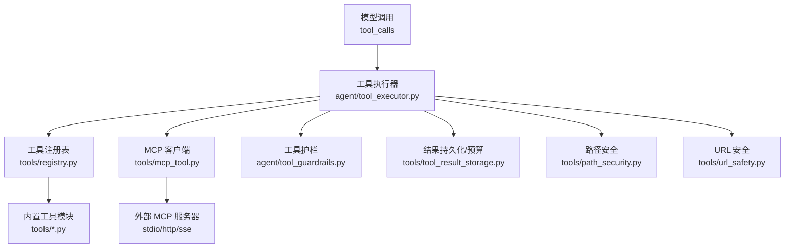
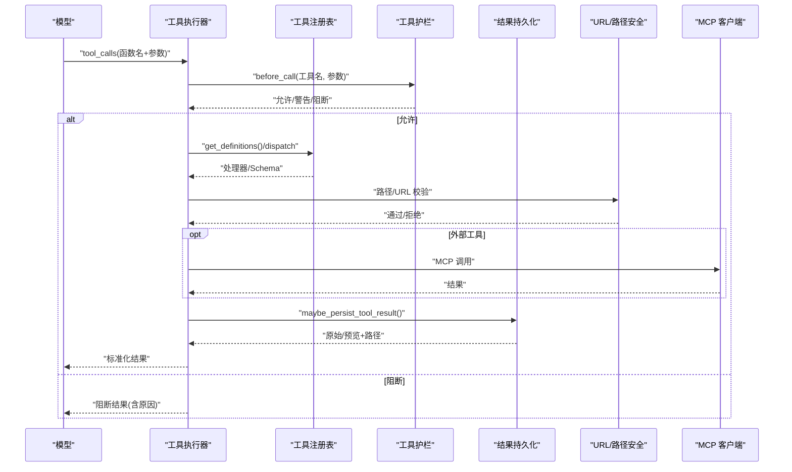
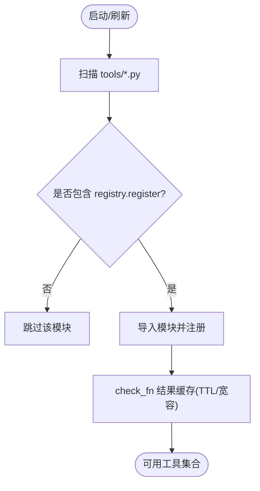
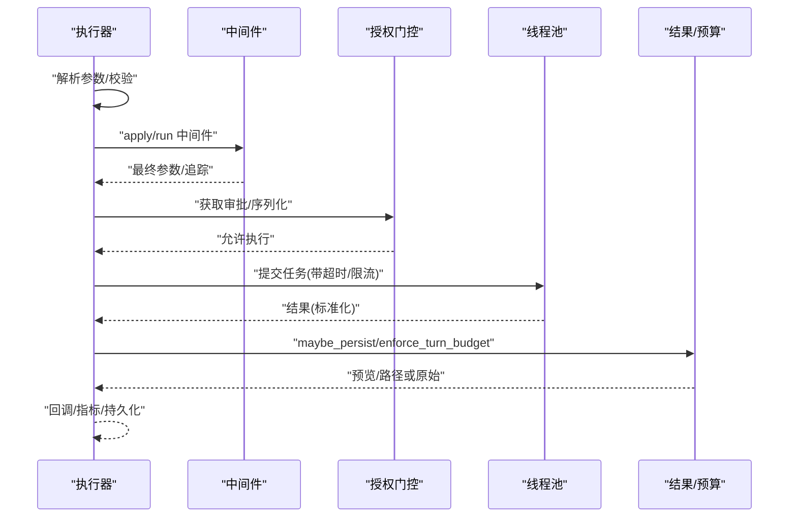
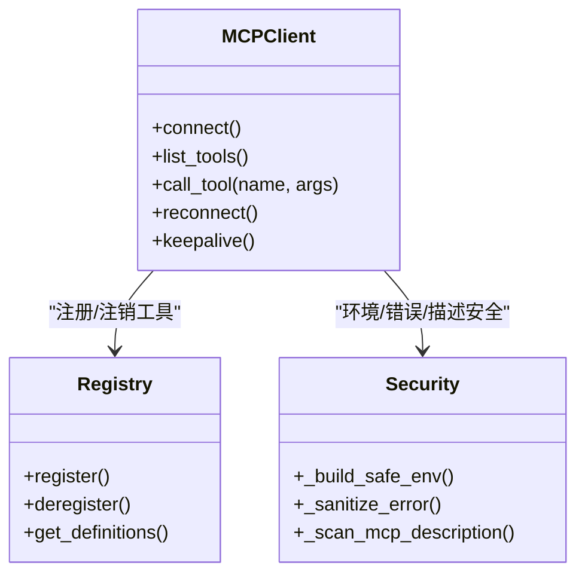
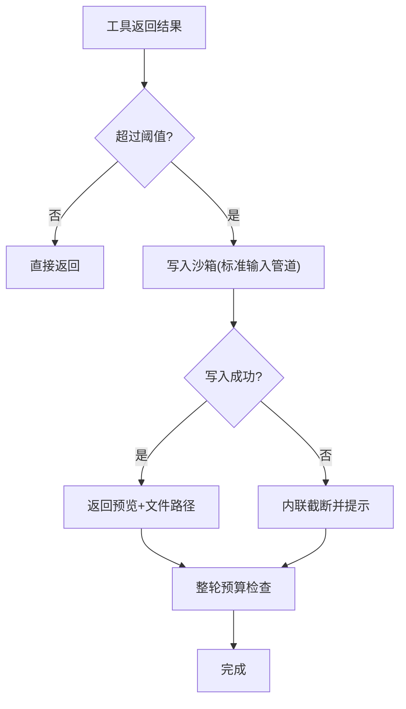
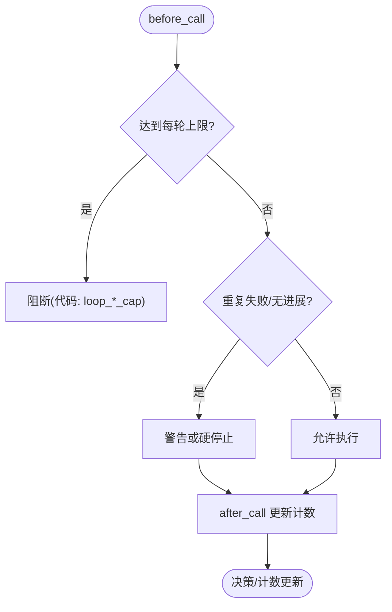
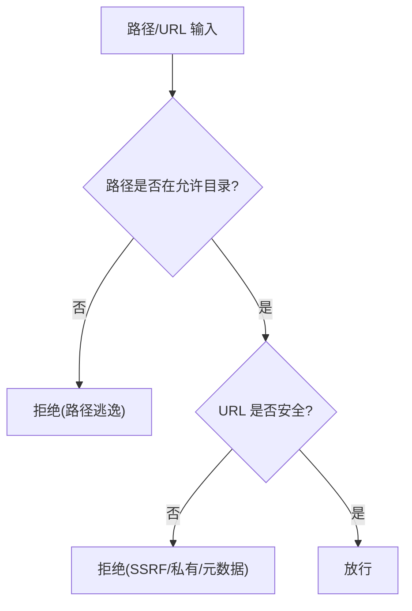
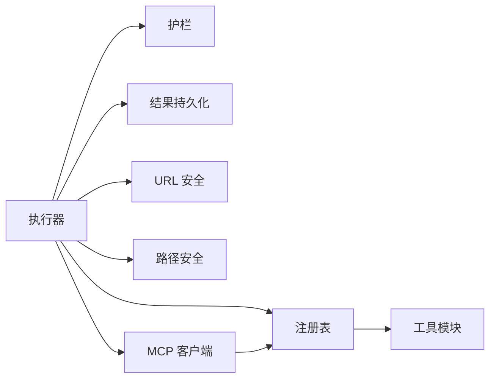

# 工具执行系统

<cite>
**本文引用的文件**
- [agent/tool_executor.py](file://agent/tool_executor.py)
- [tools/registry.py](file://tools/registry.py)
- [tools/mcp_tool.py](file://tools/mcp_tool.py)
- [tools/tool_result_storage.py](file://tools/tool_result_storage.py)
- [agent/tool_guardrails.py](file://agent/tool_guardrails.py)
- [tools/path_security.py](file://tools/path_security.py)
- [tools/url_safety.py](file://tools/url_safety.py)
- [hermes_constants.py](file://hermes_constants.py)
</cite>

## 目录
1. [简介](#简介)
2. [项目结构](#项目结构)
3. [核心组件](#核心组件)
4. [架构总览](#架构总览)
5. [详细组件分析](#详细组件分析)
6. [依赖关系分析](#依赖关系分析)
7. [性能考量](#性能考量)
8. [故障排查指南](#故障排查指南)
9. [结论](#结论)
10. [附录](#附录)

## 简介
本文件系统性阐述 Hermes Agent 的工具执行系统，覆盖工具发现、参数校验、安全检查、执行环境管理、注册机制、动态加载、权限控制、生命周期管理、资源清理、错误处理与性能监控。文档同时提供自定义工具开发指南、接口规范、参数传递与结果处理的最佳实践，并重点说明沙箱隔离、资源限制与输入验证等安全要点。

## 项目结构
围绕“工具执行”的关键模块分布如下：
- 工具注册与发现：tools/registry.py
- 工具执行编排（串行/并发、中间件、授权门控）：agent/tool_executor.py
- MCP 外部工具集成与动态发现：tools/mcp_tool.py
- 大输出持久化与轮次预算：tools/tool_result_storage.py
- 工具调用护栏（防循环/滥用）：agent/tool_guardrails.py
- 路径与 URL 安全校验：tools/path_security.py, tools/url_safety.py
- 运行时环境与配置常量：hermes_constants.py

图表来源
- [agent/tool_executor.py:758-800](file://agent/tool_executor.py#L758-L800)
- [tools/registry.py:108-159](file://tools/registry.py#L108-L159)
- [tools/mcp_tool.py:1-95](file://tools/mcp_tool.py#L1-L95)
- [tools/tool_result_storage.py:1-23](file://tools/tool_result_storage.py#L1-L23)
- [agent/tool_guardrails.py:273-348](file://agent/tool_guardrails.py#L273-L348)
- [tools/path_security.py:15-34](file://tools/path_security.py#L15-L34)
- [tools/url_safety.py:415-519](file://tools/url_safety.py#L415-L519)

章节来源
- [agent/tool_executor.py:758-800](file://agent/tool_executor.py#L758-L800)
- [tools/registry.py:108-159](file://tools/registry.py#L108-L159)
- [tools/mcp_tool.py:1-95](file://tools/mcp_tool.py#L1-L95)
- [tools/tool_result_storage.py:1-23](file://tools/tool_result_storage.py#L1-L23)
- [agent/tool_guardrails.py:273-348](file://agent/tool_guardrails.py#L273-L348)
- [tools/path_security.py:15-34](file://tools/path_security.py#L15-L34)
- [tools/url_safety.py:415-519](file://tools/url_safety.py#L415-L519)

## 核心组件
- 工具注册表（Registry）
  - 集中维护工具元数据（名称、工具集、Schema、处理器、可用性检查、异步标记、描述、表情、最大结果大小、动态 Schema 覆盖）。
  - 支持内置工具自动发现与导入；对 check_fn 做 TTL 缓存与瞬态失败宽容，避免抖动导致工具不可用。
  - 提供注册/注销、别名、按工具集查询、生成 OpenAI 格式工具定义等能力。
- 工具执行器（Tool Executor）
  - 负责解析参数、中间件管线、授权门控、并发调度、进度与预算、结果归一化与持久化、回调与指标上报。
  - 支持并发执行与顺序保障，具备中断与超时保护。
- MCP 客户端（MCP Tool）
  - 通过 stdio/HTTP/SSE 连接外部 MCP 服务器，动态发现工具并注册到统一注册表。
  - 提供安全的环境过滤、凭据脱敏、描述注入扫描、分页限制、重连退避、保活与回收策略。
- 结果持久化与预算（Tool Result Storage）
  - 三层防御：工具内截断、单结果持久化、整轮聚合预算。
  - 将超大结果写入沙箱临时目录，上下文仅保留预览与引用，模型可后续读取完整内容。
- 工具护栏（Guardrails）
  - 检测重复失败、无进展、同工具失败次数超限，以及 web_search/delegate_task 的每轮上限，防止失控循环。
  - 提供告警与硬停止决策，并可合成返回内容或附加指导信息。
- 路径与 URL 安全
  - 路径校验确保在允许目录内，拒绝穿越；URL 安全阻止 SSRF、私有/内部地址访问与云元数据端点。

章节来源
- [tools/registry.py:201-230](file://tools/registry.py#L201-L230)
- [tools/registry.py:414-441](file://tools/registry.py#L414-L441)
- [tools/registry.py:562-644](file://tools/registry.py#L562-L644)
- [tools/registry.py:717-764](file://tools/registry.py#L717-L764)
- [tools/registry.py:770-800](file://tools/registry.py#L770-L800)
- [agent/tool_executor.py:482-662](file://agent/tool_executor.py#L482-L662)
- [tools/mcp_tool.py:493-532](file://tools/mcp_tool.py#L493-L532)
- [tools/tool_result_storage.py:144-200](file://tools/tool_result_storage.py#L144-L200)
- [agent/tool_guardrails.py:273-348](file://agent/tool_guardrails.py#L273-L348)
- [tools/path_security.py:15-34](file://tools/path_security.py#L15-L34)
- [tools/url_safety.py:415-519](file://tools/url_safety.py#L415-L519)

## 架构总览
下图展示一次工具调用的端到端流程：从模型发起 tool_calls，经执行器中间件与护栏，进入注册表分发，必要时走 MCP 通道，最终产出受预算约束的结果。

图表来源
- [agent/tool_executor.py:482-662](file://agent/tool_executor.py#L482-L662)
- [tools/registry.py:717-764](file://tools/registry.py#L717-L764)
- [tools/tool_result_storage.py:144-200](file://tools/tool_result_storage.py#L144-L200)
- [tools/url_safety.py:415-519](file://tools/url_safety.py#L415-L519)
- [tools/path_security.py:15-34](file://tools/path_security.py#L15-L34)
- [tools/mcp_tool.py:1-95](file://tools/mcp_tool.py#L1-L95)

## 详细组件分析

### 工具注册与动态发现
- 内置工具发现：扫描 tools/*.py，识别顶层 register 调用，按需导入并注册。
- 动态 Schema 覆盖：支持运行时根据配置调整描述/字段，保证模型看到的限制与实际一致。
- check_fn 缓存：对外部状态探测（如 Docker/Playwright）进行 TTL 缓存与瞬态失败宽容，减少抖动影响。
- 插件覆盖策略：插件替换内置工具需显式授权，防止误覆盖。

图表来源
- [tools/registry.py:108-159](file://tools/registry.py#L108-L159)
- [tools/registry.py:233-380](file://tools/registry.py#L233-L380)
- [tools/registry.py:562-644](file://tools/registry.py#L562-L644)

章节来源
- [tools/registry.py:108-159](file://tools/registry.py#L108-L159)
- [tools/registry.py:233-380](file://tools/registry.py#L233-L380)
- [tools/registry.py:562-644](file://tools/registry.py#L562-L644)

### 工具执行流水线（中间件、授权、并发）
- 参数解析：严格解析 JSON 参数，非法则直接返回错误。
- 中间件管线：请求级与执行级中间件，支持重写、审计、追踪。
- 授权门控：序列化审批提示，排除人类等待时间对批处理截止的影响。
- 并发调度：线程池并行执行，按原序收集结果；图像生成等慢操作有独立并发上限。
- 进度与预算：记录开始/结束、回调、增量持久化、轮次预算强制。

图表来源
- [agent/tool_executor.py:141-157](file://agent/tool_executor.py#L141-L157)
- [agent/tool_executor.py:391-467](file://agent/tool_executor.py#L391-L467)
- [agent/tool_executor.py:482-662](file://agent/tool_executor.py#L482-L662)
- [tools/tool_result_storage.py:144-200](file://tools/tool_result_storage.py#L144-L200)

章节来源
- [agent/tool_executor.py:141-157](file://agent/tool_executor.py#L141-L157)
- [agent/tool_executor.py:391-467](file://agent/tool_executor.py#L391-L467)
- [agent/tool_executor.py:482-662](file://agent/tool_executor.py#L482-L662)
- [tools/tool_result_storage.py:144-200](file://tools/tool_result_storage.py#L144-L200)

### MCP 外部工具集成
- 传输方式：stdio、HTTP/Streamable HTTP、SSE。
- 动态发现：监听工具列表变更通知，动态注册/注销工具。
- 安全：环境变量白名单过滤、凭据脱敏、描述注入扫描、分页上限、重连退避、保活与回收。
- 并发：可按服务器启用并行工具调用。

图表来源
- [tools/mcp_tool.py:1-95](file://tools/mcp_tool.py#L1-L95)
- [tools/mcp_tool.py:493-532](file://tools/mcp_tool.py#L493-L532)
- [tools/mcp_tool.py:620-638](file://tools/mcp_tool.py#L620-L638)
- [tools/registry.py:646-711](file://tools/registry.py#L646-L711)

章节来源
- [tools/mcp_tool.py:1-95](file://tools/mcp_tool.py#L1-L95)
- [tools/mcp_tool.py:493-532](file://tools/mcp_tool.py#L493-L532)
- [tools/mcp_tool.py:620-638](file://tools/mcp_tool.py#L620-L638)
- [tools/registry.py:646-711](file://tools/registry.py#L646-L711)

### 结果持久化与轮次预算
- 三层防护：工具内截断、单结果持久化、整轮聚合预算。
- 持久化位置：沙箱临时目录（可通过 env.get_temp_dir 解析），回退为内联截断。
- 预算阈值：按工具与上下文窗口动态计算，避免单次或整轮溢出。

图表来源
- [tools/tool_result_storage.py:144-200](file://tools/tool_result_storage.py#L144-L200)
- [tools/tool_result_storage.py:203-255](file://tools/tool_result_storage.py#L203-L255)

章节来源
- [tools/tool_result_storage.py:144-200](file://tools/tool_result_storage.py#L144-L200)
- [tools/tool_result_storage.py:203-255](file://tools/tool_result_storage.py#L203-L255)

### 工具护栏（防循环/滥用）
- 检测维度：完全相同参数失败、同工具失败次数、幂等工具无进展。
- 每轮上限：web_search、delegate_task 的单轮调用上限。
- 动作：允许/警告/阻断/中止，并可合成结果或追加指导信息。

图表来源
- [agent/tool_guardrails.py:273-348](file://agent/tool_guardrails.py#L273-L348)
- [agent/tool_guardrails.py:447-507](file://agent/tool_guardrails.py#L447-L507)

章节来源
- [agent/tool_guardrails.py:273-348](file://agent/tool_guardrails.py#L273-L348)
- [agent/tool_guardrails.py:447-507](file://agent/tool_guardrails.py#L447-L507)

### 路径与 URL 安全
- 路径安全：resolve 后校验相对根目录，拒绝穿越；快速检测 “..” 组件。
- URL 安全：阻止私有/内部地址、环回、多播、CGNAT 与云元数据端点；支持代理与可信主机例外；连接时再次校验以缓解 DNS 重绑定。

图表来源
- [tools/path_security.py:15-34](file://tools/path_security.py#L15-L34)
- [tools/url_safety.py:415-519](file://tools/url_safety.py#L415-L519)
- [tools/url_safety.py:539-595](file://tools/url_safety.py#L539-L595)

章节来源
- [tools/path_security.py:15-34](file://tools/path_security.py#L15-L34)
- [tools/url_safety.py:415-519](file://tools/url_safety.py#L415-L519)
- [tools/url_safety.py:539-595](file://tools/url_safety.py#L539-L595)

## 依赖关系分析
- 执行器依赖注册表、护栏、结果持久化、URL/路径安全与 MCP 客户端。
- 注册表依赖工具模块的顶层注册调用，并通过 AST 扫描与缓存加速发现。
- MCP 客户端依赖注册表进行动态工具注册/注销，并依赖安全模块进行环境与错误处理。
- 结果持久化依赖预算配置与环境临时目录解析。

图表来源
- [agent/tool_executor.py:482-662](file://agent/tool_executor.py#L482-L662)
- [tools/registry.py:108-159](file://tools/registry.py#L108-L159)
- [tools/mcp_tool.py:1-95](file://tools/mcp_tool.py#L1-L95)
- [tools/tool_result_storage.py:144-200](file://tools/tool_result_storage.py#L144-L200)

章节来源
- [agent/tool_executor.py:482-662](file://agent/tool_executor.py#L482-L662)
- [tools/registry.py:108-159](file://tools/registry.py#L108-L159)
- [tools/mcp_tool.py:1-95](file://tools/mcp_tool.py#L1-L95)
- [tools/tool_result_storage.py:144-200](file://tools/tool_result_storage.py#L144-L200)

## 性能考量
- 并发与限流：最大工作线程数、图像生成并发上限、批处理截止时间与授权门控超时。
- 缓存：check_fn 结果 TTL 与瞬态失败宽容；工具发现缓存基于文件 mtime+size。
- 结果预算：按上下文窗口缩放预算，避免大结果阻塞模型；整轮聚合预算优先持久化最大项。
- 网络与 IO：MCP 重连退避、保活间隔、分页上限；URL 安全在连接时二次校验。

章节来源
- [agent/tool_executor.py:93-111](file://agent/tool_executor.py#L93-L111)
- [agent/tool_executor.py:209-246](file://agent/tool_executor.py#L209-L246)
- [tools/registry.py:233-380](file://tools/registry.py#L233-L380)
- [tools/tool_result_storage.py:144-200](file://tools/tool_result_storage.py#L144-L200)
- [tools/mcp_tool.py:338-374](file://tools/mcp_tool.py#L338-L374)
- [tools/url_safety.py:539-595](file://tools/url_safety.py#L539-L595)

## 故障排查指南
- 工具不可用：检查 check_fn 缓存与外部依赖（Docker/Playwright 等），必要时刷新缓存或重启进程。
- 工具被阻断：查看护栏决策（重复失败/无进展/每轮上限），调整参数或策略。
- 结果过大：确认持久化目录可写；若失败将回退为内联截断。
- 网络请求被拒：检查 URL 安全策略（私有/内部/云元数据），必要时配置代理或可信主机。
- MCP 连接问题：查看 stderr 日志、重连退避、保活间隔与分页限制；确认环境变量白名单。

章节来源
- [tools/registry.py:233-380](file://tools/registry.py#L233-L380)
- [agent/tool_guardrails.py:273-348](file://agent/tool_guardrails.py#L273-L348)
- [tools/tool_result_storage.py:144-200](file://tools/tool_result_storage.py#L144-L200)
- [tools/url_safety.py:415-519](file://tools/url_safety.py#L415-L519)
- [tools/mcp_tool.py:151-203](file://tools/mcp_tool.py#L151-L203)

## 结论
Hermes 工具执行系统通过“注册表 + 执行器 + 护栏 + 安全 + 持久化 + MCP”的分层设计，实现了高可靠、可扩展且安全的工具调用能力。其关键优势包括：
- 动态发现与注册，支持内置与外部工具统一接入。
- 强化的安全边界（路径/URL 校验、凭据脱敏、SSRF 防护）。
- 完善的执行治理（中间件、授权、并发、预算、护栏）。
- 健壮的错误处理与可观测性（回调、指标、日志）。

## 附录

### 自定义工具开发指南
- 注册接口
  - 在工具模块顶层调用注册器的 register，声明名称、工具集、Schema、处理器、可用性检查、异步标志、描述、表情、最大结果大小与动态 Schema 覆盖。
  - 如需替换内置工具，需显式授权 override。
- 参数与结果
  - 参数由执行器严格解析为 JSON 对象；处理器应返回字符串或受支持的 multimodal 信封。
  - 大结果将被持久化，上下文仅保留预览与路径；模型可后续读取。
- 安全与校验
  - 使用路径安全与 URL 安全模块校验输入，避免越权与 SSRF。
  - 对敏感信息进行脱敏，避免泄露到错误消息或日志。
- 生命周期与资源
  - 在 before/after 钩子中记录进度与指标；确保异常路径下释放资源。
  - 遵循轮次预算与工具集限制，避免过度消耗上下文或触发护栏。

章节来源
- [tools/registry.py:562-644](file://tools/registry.py#L562-L644)
- [tools/registry.py:770-800](file://tools/registry.py#L770-L800)
- [tools/tool_result_storage.py:144-200](file://tools/tool_result_storage.py#L144-L200)
- [tools/path_security.py:15-34](file://tools/path_security.py#L15-L34)
- [tools/url_safety.py:415-519](file://tools/url_safety.py#L415-L519)

### 工具接口规范与最佳实践
- 名称与工具集：保持唯一且语义清晰；合理划分工具集便于权限控制。
- Schema：明确必填/可选字段、类型与约束；必要时使用动态覆盖反映运行时限制。
- 处理器：幂等优先；失败时返回结构化错误；避免长时间阻塞。
- 结果：尽量小；超大结果使用持久化；避免在上下文中堆叠大文本。
- 安全：最小权限原则；输入校验；输出脱敏；禁止访问私有/内部地址。
- 可观测性：记录关键事件；上报指标；便于定位问题。

章节来源
- [tools/registry.py:201-230](file://tools/registry.py#L201-L230)
- [tools/registry.py:717-764](file://tools/registry.py#L717-L764)
- [tools/tool_result_storage.py:144-200](file://tools/tool_result_storage.py#L144-L200)
- [tools/url_safety.py:415-519](file://tools/url_safety.py#L415-L519)