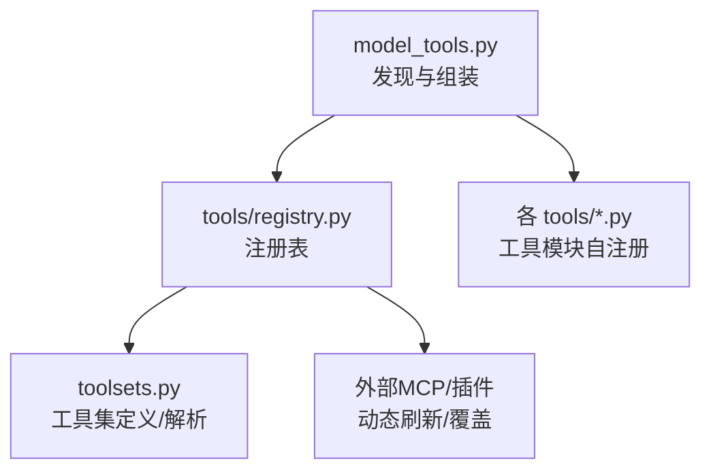
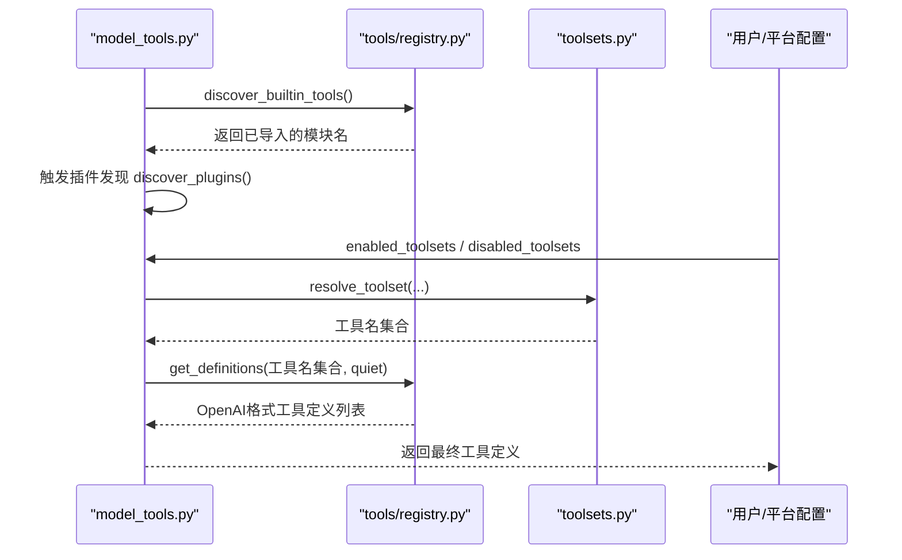
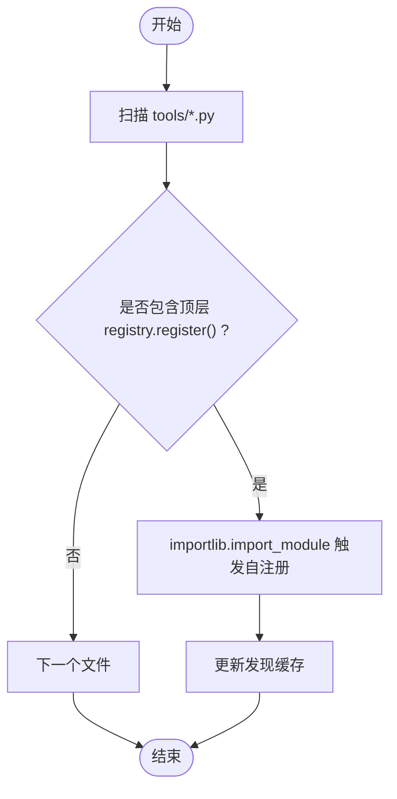
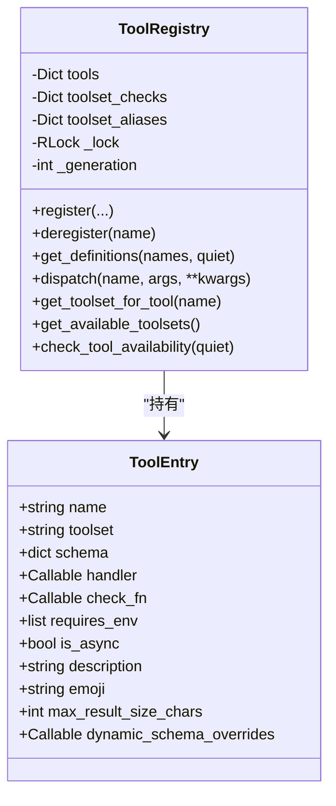
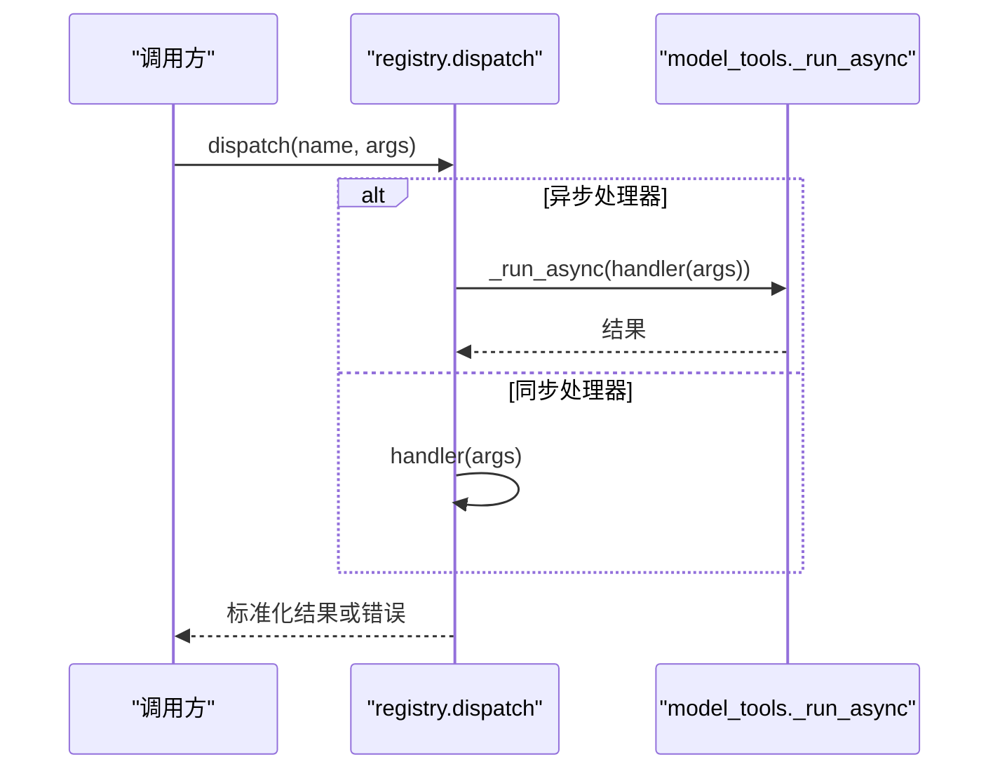
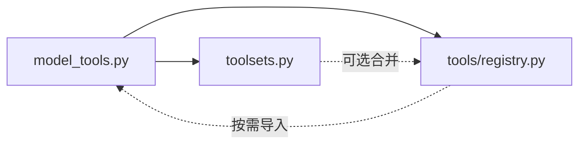

# 工具注册机制

<cite>
**本文引用的文件**
- [tools/registry.py](file://tools/registry.py)
- [model_tools.py](file://model_tools.py)
- [toolsets.py](file://toolsets.py)
- [hermes_constants.py](file://hermes_constants.py)
</cite>

## 目录
1. [简介](#简介)
2. [项目结构](#项目结构)
3. [核心组件](#核心组件)
4. [架构总览](#架构总览)
5. [详细组件分析](#详细组件分析)
6. [依赖关系分析](#依赖关系分析)
7. [性能考量](#性能考量)
8. [故障排查指南](#故障排查指南)
9. [结论](#结论)
10. [附录：自定义工具开发指南](#附录自定义工具开发指南)

## 简介
本文件系统性阐述 Hermes Agent 的工具注册机制，覆盖工具的发现、注册、生命周期管理、元数据处理、参数验证、分类与命名空间、权限控制与访问策略，以及配置选项与最佳实践。读者将了解如何通过声明式注册将工具纳入系统，如何在运行时动态加载与刷新工具，以及如何安全地扩展或替换内置工具。

## 项目结构
Hermes 的工具体系围绕“注册表 + 工具集 + 执行编排”三层组织：
- 注册表（tools/registry.py）：集中维护工具元数据、处理器、可用性检查、分发与查询接口。
- 工具集（toolsets.py）：定义工具分组、组合与平台默认集合，支持别名与动态解析。
- 执行编排（model_tools.py）：触发工具发现、组装模型可用的工具定义、参数类型转换与异步桥接、错误清洗等。

图表来源
- [model_tools.py:210-235](file://model_tools.py#L210-L235)
- [tools/registry.py:108-159](file://tools/registry.py#L108-L159)
- [toolsets.py:644-714](file://toolsets.py#L644-L714)

章节来源
- [model_tools.py:210-235](file://model_tools.py#L210-L235)
- [tools/registry.py:108-159](file://tools/registry.py#L108-L159)
- [toolsets.py:644-714](file://toolsets.py#L644-L714)

## 核心组件
- 工具条目 ToolEntry：封装工具名称、所属工具集、JSON Schema、处理器函数、可用性检查、环境变量要求、是否异步、描述、表情、结果大小上限、动态 Schema 覆盖等。
- 注册表 ToolRegistry：单例，提供注册、注销、查询、分发、工具集别名、生成器版本计数、线程安全快照等能力。
- 工具发现 discover_builtin_tools：扫描 tools 目录下模块，通过 AST 检测顶层调用 registry.register()，缓存判定结果并导入模块以触发自注册。
- 工具集 toolsets：集中定义工具分组、平台默认集合、别名与解析逻辑。
- 执行编排 model_tools：在模块加载时触发内置工具发现与插件发现；提供 get_tool_definitions 组装模型可用工具列表；handle_function_call 统一调度；coerce_tool_args 做参数类型转换；_run_async 处理同步/异步桥接。

章节来源
- [tools/registry.py:201-231](file://tools/registry.py#L201-L231)
- [tools/registry.py:414-436](file://tools/registry.py#L414-L436)
- [tools/registry.py:108-159](file://tools/registry.py#L108-L159)
- [toolsets.py:101-640](file://toolsets.py#L101-L640)
- [model_tools.py:210-235](file://model_tools.py#L210-L235)
- [model_tools.py:305-389](file://model_tools.py#L305-L389)
- [model_tools.py:734-800](file://model_tools.py#L734-L800)
- [model_tools.py:114-208](file://model_tools.py#L114-L208)

## 架构总览
下图展示了从启动到模型获取工具定义的完整流程，包括工具发现、注册、工具集过滤、Schema 组装与动态刷新。

图表来源
- [model_tools.py:210-235](file://model_tools.py#L210-L235)
- [model_tools.py:305-389](file://model_tools.py#L305-L389)
- [model_tools.py:391-611](file://model_tools.py#L391-L611)
- [tools/registry.py:108-159](file://tools/registry.py#L108-L159)
- [tools/registry.py:717-764](file://tools/registry.py#L717-L764)
- [toolsets.py:745-800](file://toolsets.py#L745-L800)

## 详细组件分析

### 工具发现与动态加载
- 自动发现：discover_builtin_tools 遍历 tools 目录，跳过特定文件，使用 AST 判断模块是否在顶层调用了 registry.register()，命中后记录模块名并 importlib.import_module 触发自注册。
- 发现缓存：基于文件 mtime+size 的磁盘缓存，避免重复 AST 解析；并发安全写入。
- 插件发现：model_tools 模块加载时尝试 discover_plugins()，将插件工具纳入同一注册表。

图表来源
- [tools/registry.py:84-106](file://tools/registry.py#L84-L106)
- [tools/registry.py:108-159](file://tools/registry.py#L108-L159)
- [model_tools.py:210-235](file://model_tools.py#L210-L235)

章节来源
- [tools/registry.py:84-106](file://tools/registry.py#L84-L106)
- [tools/registry.py:108-159](file://tools/registry.py#L108-L159)
- [model_tools.py:210-235](file://model_tools.py#L210-L235)

### 注册表工作原理与生命周期
- 注册 register：接收 name、toolset、schema、handler、check_fn、requires_env、is_async、description、emoji、max_result_size_chars、dynamic_schema_overrides、override。若同名工具已存在且来自不同工具集，需显式 override=True 才允许覆盖；否则拒绝以避免意外覆盖。
- 注销 deregister：清理工具条目，若无其他工具属于该工具集则清理工具集 check_fn 与别名映射；对非 MCP 工具集进行归属校验，防止跨插件误删。
- 版本与快照：每次变更递增 _generation，配合外部缓存键实现一致快照；内部使用 RLock 保证并发安全。
- 可用性检查缓存：check_fn 结果按 30s TTL 缓存，并在最近成功后的 60s 内出现失败视为瞬态抖动，服务上次成功值，避免偶发探测失败导致工具被静默移除。

图表来源
- [tools/registry.py:201-231](file://tools/registry.py#L201-L231)
- [tools/registry.py:414-436](file://tools/registry.py#L414-L436)
- [tools/registry.py:562-645](file://tools/registry.py#L562-L645)
- [tools/registry.py:646-711](file://tools/registry.py#L646-L711)
- [tools/registry.py:717-764](file://tools/registry.py#L717-L764)
- [tools/registry.py:801-835](file://tools/registry.py#L801-L835)

章节来源
- [tools/registry.py:201-231](file://tools/registry.py#L201-L231)
- [tools/registry.py:414-436](file://tools/registry.py#L414-L436)
- [tools/registry.py:562-645](file://tools/registry.py#L562-L645)
- [tools/registry.py:646-711](file://tools/registry.py#L646-L711)
- [tools/registry.py:717-764](file://tools/registry.py#L717-L764)
- [tools/registry.py:801-835](file://tools/registry.py#L801-L835)

### 工具元数据处理与 Schema 组装
- 元数据：ToolEntry 保存工具的描述、表情、最大结果长度、动态 Schema 覆盖函数等。
- Schema 组装：get_definitions 为每个工具添加 name 字段，应用 dynamic_schema_overrides（例如根据当前配置动态调整描述），并以 {"type":"function","function":schema} 形式返回。
- 动态 Schema：某些工具（如 execute_code、discord）会在 model_tools 中根据运行时状态重建 Schema，确保模型只看到真正可用的能力。

章节来源
- [tools/registry.py:201-231](file://tools/registry.py#L201-L231)
- [tools/registry.py:717-764](file://tools/registry.py#L717-L764)
- [model_tools.py:496-552](file://model_tools.py#L496-L552)

### 参数验证与类型转换
- 类型转换：coerce_tool_args 读取工具 JSON Schema，将 LLM 可能返回的字符串数字/布尔转换为正确类型，并将裸标量包裹为数组以满足 array 类型。
- 键名还原：支持将经过 Schema 清洗后的参数键还原回原始名称，再查找属性 Schema 进行转换。
- 异常保护：转换失败保留原值，避免破坏调用。

章节来源
- [model_tools.py:734-800](file://model_tools.py#L734-L800)

### 工具分类系统与命名空间
- 工具集：toolsets.py 定义了 web、terminal、browser、coding、hermes-cli 等工具集，支持组合 includes 与平台默认集合 _HERMES_CORE_TOOLS。
- 别名与解析：get_toolset 可合并注册表中的工具（插件/MCP 注册），resolve_toolset 递归展开 includes，支持 all/* 别名。
- 命名空间：工具通过 toolset 字段归属到命名空间；平台可通过 hermes-* 工具集聚合工具；MCP 工具集以 mcp-* 前缀区分。

章节来源
- [toolsets.py:31-88](file://toolsets.py#L31-L88)
- [toolsets.py:101-640](file://toolsets.py#L101-L640)
- [toolsets.py:644-714](file://toolsets.py#L644-L714)
- [toolsets.py:745-800](file://toolsets.py#L745-L800)

### 权限控制与访问策略
- 覆盖保护：register 时若目标工具来自不同工具集，必须显式 override=True；插件覆盖内置工具需 operator opt-in（allow_tool_override），否则抛出 PermissionError。
- 注销保护：deregister 对非 MCP 工具集进行归属校验，跨插件删除需 opt-in。
- 多租户隔离：check_fn 缓存支持 profile 维度隔离，避免多进程/多会话共享导致的误判。

章节来源
- [tools/registry.py:562-645](file://tools/registry.py#L562-L645)
- [tools/registry.py:646-711](file://tools/registry.py#L646-L711)
- [tools/registry.py:287-310](file://tools/registry.py#L287-L310)

### 执行与生命周期
- 分发 dispatch：根据 entry.is_async 选择同步或异步执行；统一规范化结果为字符串或多模态信封；捕获异常并清洗错误信息。
- 异步桥接：_run_async 在已有事件循环中创建独立线程运行协程，或在主线程复用持久事件循环，避免“Event loop is closed”问题；支持超时取消与线程上下文传播。
- 错误处理：工具错误统一通过 tool_error 输出结构化 JSON；异常路径经 _sanitize_tool_error 去除结构性标记并限制长度。

图表来源
- [tools/registry.py:801-835](file://tools/registry.py#L801-L835)
- [model_tools.py:114-208](file://model_tools.py#L114-L208)
- [model_tools.py:684-728](file://model_tools.py#L684-L728)

章节来源
- [tools/registry.py:801-835](file://tools/registry.py#L801-L835)
- [model_tools.py:114-208](file://model_tools.py#L114-L208)
- [model_tools.py:684-728](file://model_tools.py#L684-L728)

## 依赖关系分析
- model_tools 依赖 tools.registry 进行工具发现与定义获取，依赖 toolsets 进行工具集解析。
- tools.registry 不反向依赖 model_tools，保持无环导入；仅在 dispatch 异步桥接时按需导入 _run_async。
- toolsets 可读取 registry 以合并插件/MCP 工具，但静态视图可关闭 include_registry。

图表来源
- [model_tools.py:210-235](file://model_tools.py#L210-L235)
- [model_tools.py:305-389](file://model_tools.py#L305-L389)
- [tools/registry.py:801-835](file://tools/registry.py#L801-L835)
- [toolsets.py:644-714](file://toolsets.py#L644-L714)

章节来源
- [model_tools.py:210-235](file://model_tools.py#L210-L235)
- [model_tools.py:305-389](file://model_tools.py#L305-L389)
- [tools/registry.py:801-835](file://tools/registry.py#L801-L835)
- [toolsets.py:644-714](file://toolsets.py#L644-L714)

## 性能考量
- 工具发现缓存：基于文件 mtime+size 的磁盘缓存，减少 AST 解析开销。
- check_fn 缓存：30s TTL，结合 60s 容错窗口，降低频繁探测成本并抑制瞬态失败。
- 工具定义缓存：get_tool_definitions 在 quiet_mode 下启用多级缓存（参数指纹 + 配置 mtime + 注册表 generation），避免重复计算。
- 异步桥接优化：复用持久事件循环，避免频繁创建销毁导致的客户端连接问题。

章节来源
- [tools/registry.py:108-159](file://tools/registry.py#L108-L159)
- [tools/registry.py:257-310](file://tools/registry.py#L257-L310)
- [model_tools.py:276-389](file://model_tools.py#L276-L389)
- [model_tools.py:114-208](file://model_tools.py#L114-L208)

## 故障排查指南
- 工具不可用：检查对应工具的 check_fn 是否失败；查看日志中的“check_fn ... failed”提示；必要时调用 invalidate_check_fn_cache() 清除缓存。
- 工具被拒绝覆盖：确认是否设置 allow_tool_override；检查工具集冲突；查看注册日志中的拒绝原因。
- 工具定义未更新：确认配置变更后是否触发了缓存失效；检查 get_tool_definitions 的缓存键是否变化。
- 异步工具超时：关注 _run_async 的超时与取消逻辑；检查是否存在阻塞任务。

章节来源
- [tools/registry.py:257-310](file://tools/registry.py#L257-L310)
- [tools/registry.py:382-388](file://tools/registry.py#L382-L388)
- [tools/registry.py:562-645](file://tools/registry.py#L562-L645)
- [model_tools.py:114-208](file://model_tools.py#L114-L208)

## 结论
Hermes 的工具注册机制通过“自注册 + 工具集 + 注册表”实现了高内聚、低耦合的工具生态。其设计兼顾了安全性（覆盖保护、权限控制）、可扩展性（插件/MCP 动态刷新）、性能（多级缓存、异步桥接）与可观测性（丰富日志与诊断）。开发者可据此快速构建、注册与治理自定义工具。

## 附录：自定义工具开发指南
- 步骤概览
  - 在 tools 目录下新增工具模块，模块顶层调用 registry.register() 声明工具。
  - 定义 JSON Schema（parameters 与 properties），描述工具行为与参数约束。
  - 实现处理器函数（同步或异步），返回字符串或受支持的多模态信封。
  - 可选：提供 check_fn 用于环境探测（如 Docker、Playwright 等）。
  - 可选：提供 dynamic_schema_overrides 以根据运行时配置动态调整 Schema。
  - 将工具加入合适的工具集（toolsets.py），或通过平台配置启用。
- 关键要点
  - 命名规范：name 唯一；toolset 明确归属；避免跨工具集覆盖除非必要。
  - 权限与安全：如需覆盖内置工具，需 operator opt-in；遵循最小权限原则。
  - 性能：避免在 check_fn 中进行昂贵操作；利用缓存与批量探测。
  - 错误处理：使用 tool_error 返回结构化错误；避免过长错误文本。
  - 测试：编写单元测试覆盖注册、分发、参数转换与错误路径。

章节来源
- [tools/registry.py:562-645](file://tools/registry.py#L562-L645)
- [tools/registry.py:974-1002](file://tools/registry.py#L974-L1002)
- [model_tools.py:734-800](file://model_tools.py#L734-L800)
- [toolsets.py:644-714](file://toolsets.py#L644-L714)