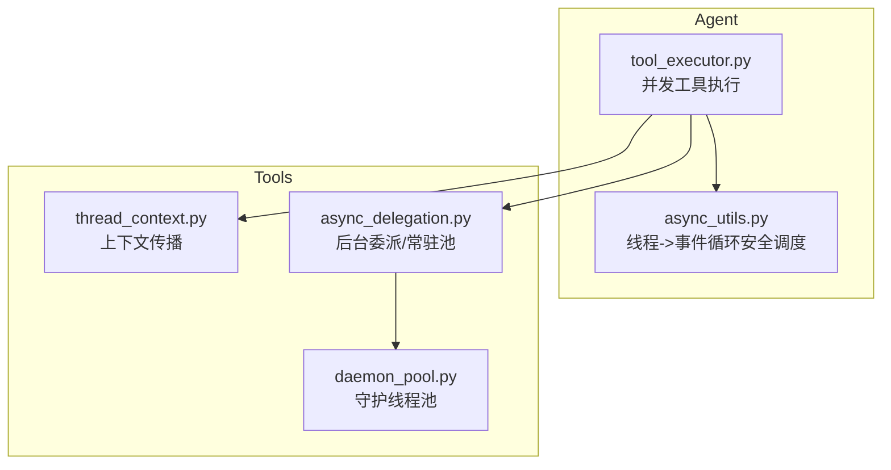
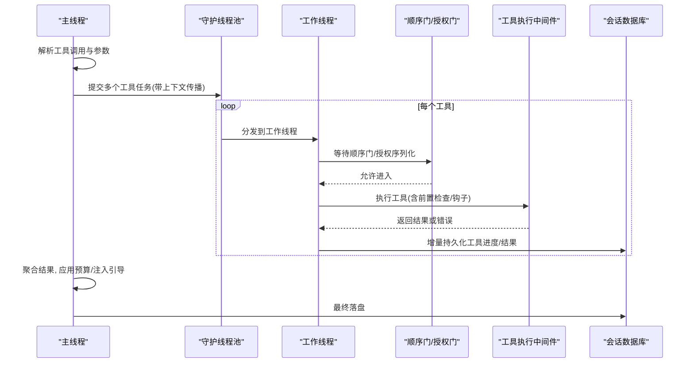
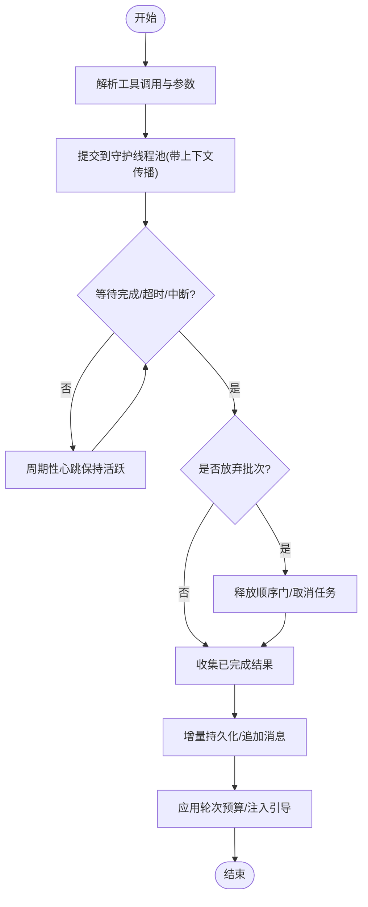
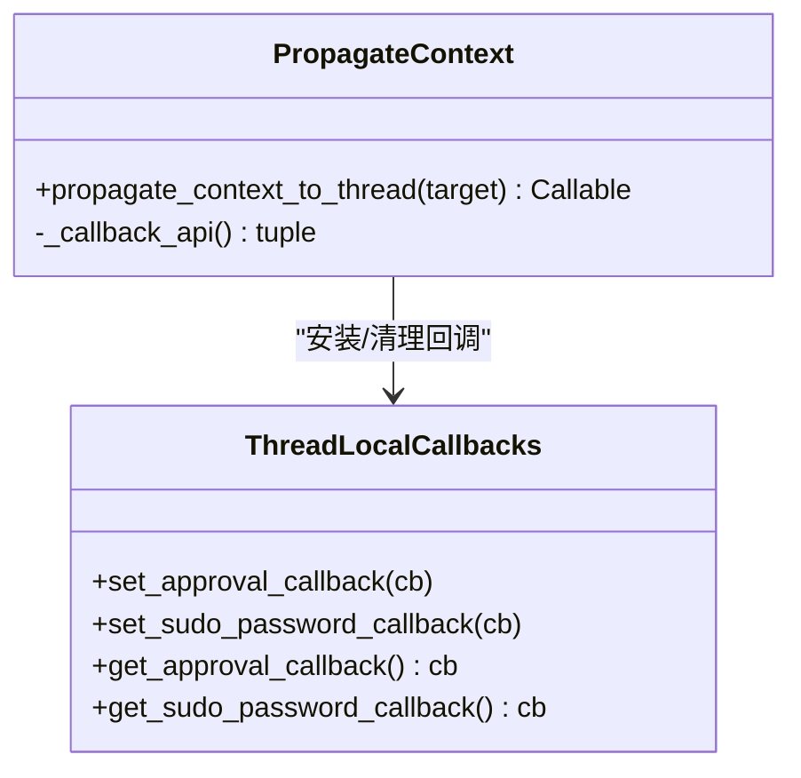
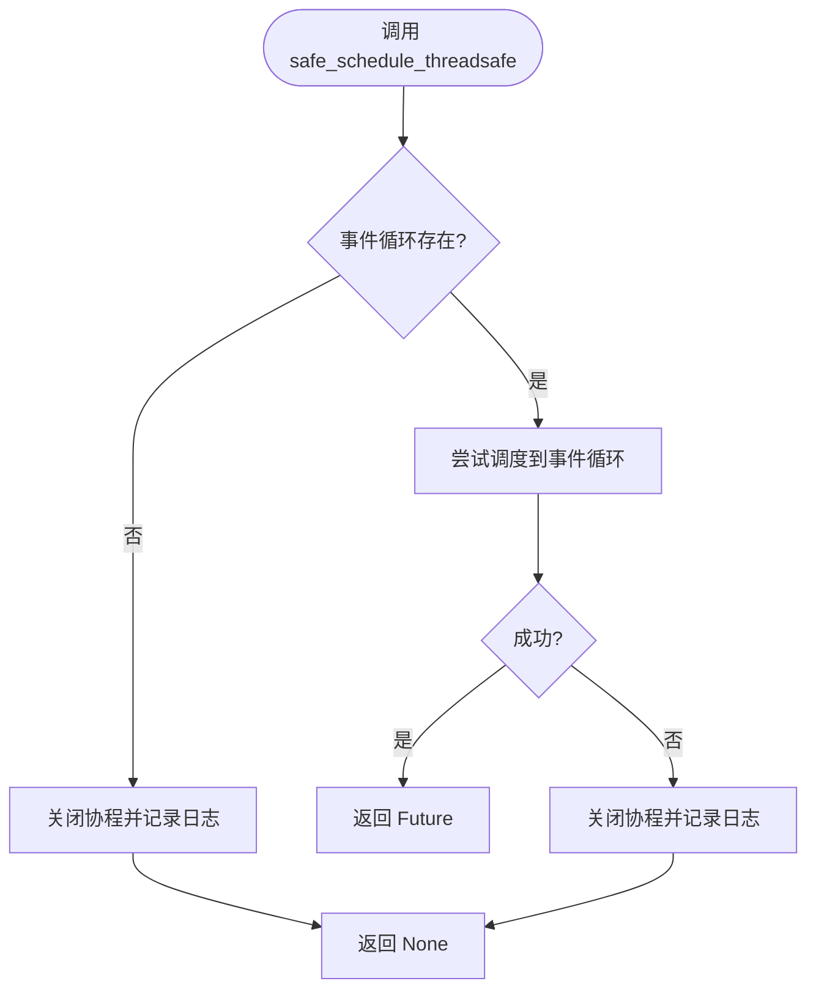
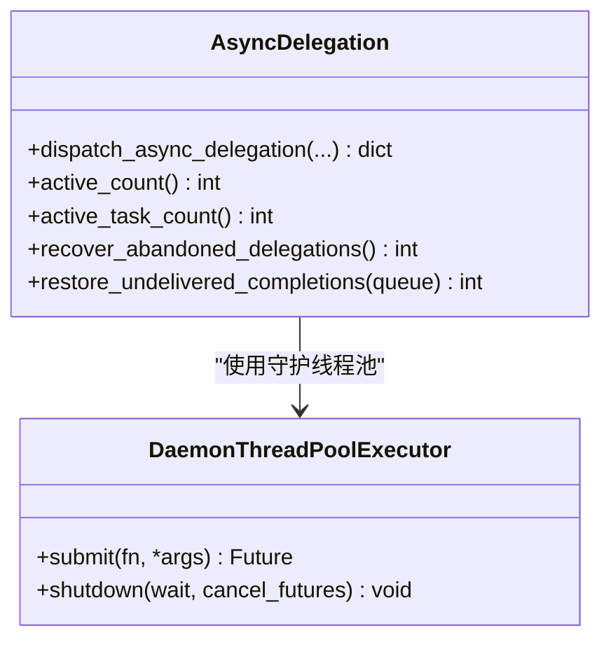
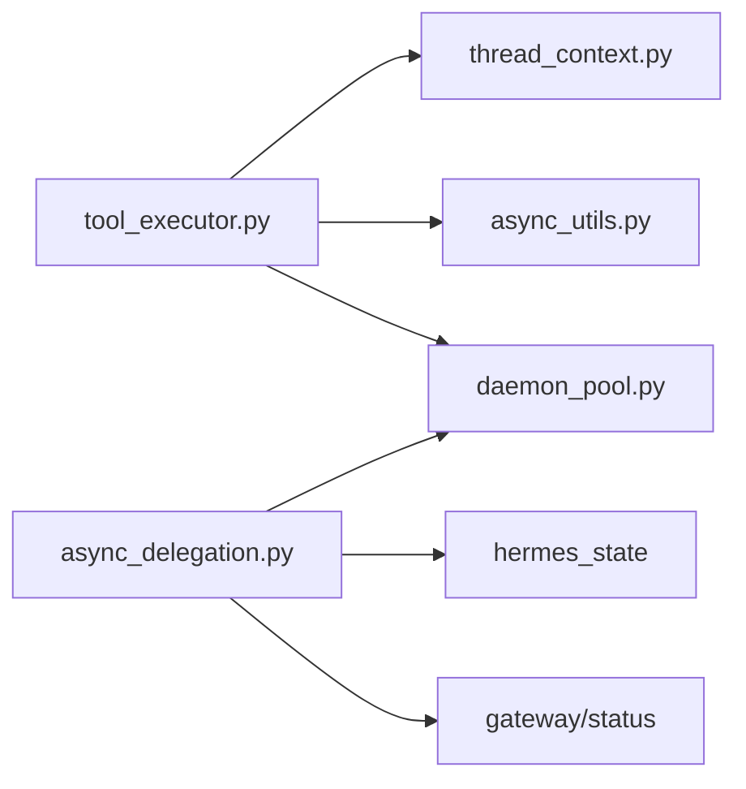

# 并发执行引擎

<cite>
**本文引用的文件**
- [agent/tool_executor.py](file://agent/tool_executor.py)
- [tools/thread_context.py](file://tools/thread_context.py)
- [agent/async_utils.py](file://agent/async_utils.py)
- [tools/async_delegation.py](file://tools/async_delegation.py)
- [tools/daemon_pool.py](file://tools/daemon_pool.py)
</cite>

## 目录
1. [简介](#简介)
2. [项目结构](#项目结构)
3. [核心组件](#核心组件)
4. [架构总览](#架构总览)
5. [详细组件分析](#详细组件分析)
6. [依赖关系分析](#依赖关系分析)
7. [性能考量](#性能考量)
8. [故障排查指南](#故障排查指南)
9. [结论](#结论)
10. [附录](#附录)

## 简介
本文件面向 Hermes Agent 的“工具调用并发执行引擎”，系统性说明以下主题：
- 工具调用的并行执行模型、线程池管理与任务调度机制
- 并发控制策略（批级超时、顺序门控、授权序列化）、资源竞争处理与死锁预防
- 批量工具执行、取消机制与上下文传播
- 状态同步与结果聚合
- 性能监控、调试技巧与故障诊断方法，帮助在高并发场景下优化执行效率

## 项目结构
围绕并发执行的关键代码集中在 agent 与 tools 两个子系统中：
- agent/tool_executor.py：实现并发工具执行主流程、批级调度、超时与取消、结果聚合与持久化
- tools/thread_context.py：将父线程的 ContextVars 与审批回调传播到工作线程，保证审批/权限上下文一致
- agent/async_utils.py：安全地将协程从工作线程调度到事件循环，避免泄漏与异常
- tools/async_delegation.py：后台异步委派（子代理）的常驻线程池、容量控制、持久化与恢复
- tools/daemon_pool.py：守护式线程池封装，确保进程退出时不阻塞

图表来源
- [agent/tool_executor.py:758-1599](file://agent/tool_executor.py#L758-L1599)
- [tools/thread_context.py:1-121](file://tools/thread_context.py#L1-L121)
- [agent/async_utils.py:1-85](file://agent/async_utils.py#L1-L85)
- [tools/async_delegation.py:1-800](file://tools/async_delegation.py#L1-L800)
- [tools/daemon_pool.py:1-200](file://tools/daemon_pool.py#L1-L200)

章节来源
- [agent/tool_executor.py:758-1599](file://agent/tool_executor.py#L758-L1599)
- [tools/thread_context.py:1-121](file://tools/thread_context.py#L1-L121)
- [agent/async_utils.py:1-85](file://agent/async_utils.py#L1-L85)
- [tools/async_delegation.py:1-800](file://tools/async_delegation.py#L1-L800)
- [tools/daemon_pool.py:1-200](file://tools/daemon_pool.py#L1-L200)

## 核心组件
- 并发工具执行器（tool_executor）
  - 使用守护线程池并行提交工具调用
  - 维护“开始顺序门”防止乱序导致的审批提示交错
  - 提供批级超时、用户中断、授权序列化等并发控制
  - 逐条聚合结果并写入会话数据库，支持增量持久化
- 上下文传播（thread_context）
  - 在提交到工作线程前捕获父线程 ContextVars 与审批回调
  - 在工作线程内安装并在退出时清理，避免泄露
- 异步调度安全桥（async_utils）
  - 包装 run_coroutine_threadsafe，失败时关闭协程，避免泄漏
- 后台委派与常驻池（async_delegation + daemon_pool）
  - 模块级守护线程池承载后台子代理
  - 容量限制、持久化、恢复、过期清理、停滞检测

章节来源
- [agent/tool_executor.py:758-1599](file://agent/tool_executor.py#L758-L1599)
- [tools/thread_context.py:1-121](file://tools/thread_context.py#L1-L121)
- [agent/async_utils.py:1-85](file://agent/async_utils.py#L1-L85)
- [tools/async_delegation.py:1-800](file://tools/async_delegation.py#L1-L800)

## 架构总览
下图展示一次“多工具并发执行”的主流程：解析参数、构建可运行项、通过守护线程池并行执行、顺序门控、授权序列化、批级超时/取消、结果聚合与持久化。

图表来源
- [agent/tool_executor.py:758-1599](file://agent/tool_executor.py#L758-L1599)
- [tools/thread_context.py:1-121](file://tools/thread_context.py#L1-L121)

## 详细组件分析

### 并发工具执行器（tool_executor）
- 并行执行模型
  - 使用守护线程池（DaemonThreadPoolExecutor）提交任务，避免解释器退出时被挂起
  - 最大并发受限于配置与工具类型（例如图像生成有独立上限）
- 任务调度与顺序门
  - 通过条件变量维护“开始顺序”，避免审批提示交错
  - 顺序门具备超时保护，防止单个工具卡住导致整批饥饿
- 授权序列化
  - 对需要人类审批的工具调用进行串行化，同时排除人类等待时间计入批超时
- 批级超时与取消
  - 批级超时由环境变量控制；到达超时时取消未完成的任务并释放顺序门
  - 用户中断会立即取消未开始的任务，并对已运行任务广播中断信号
- 结果聚合与持久化
  - 按原始顺序收集结果，追加到消息列表
  - 每完成一个工具即尝试增量持久化，提高崩溃恢复能力
  - 最后统一应用“轮次预算”和“/steer”注入

图表来源
- [agent/tool_executor.py:758-1599](file://agent/tool_executor.py#L758-L1599)

章节来源
- [agent/tool_executor.py:758-1599](file://agent/tool_executor.py#L758-L1599)

### 上下文传播（thread_context）
- 作用
  - 将父线程的 ContextVars（如审批会话键）与 CLI/Gateway 的审批/提权回调复制到工作线程
  - 在工作线程生命周期内安装，并在退出时清理，避免回收线程污染后续任务
- 关键设计
  - 失败关闭：若回调安装失败，则保持默认拒绝行为，确保安全
  - 使用 contextvars.copy_context 与 ctx.run 包裹目标函数

图表来源
- [tools/thread_context.py:1-121](file://tools/thread_context.py#L1-L121)

章节来源
- [tools/thread_context.py:1-121](file://tools/thread_context.py#L1-L121)

### 异步调度安全桥（async_utils）
- 作用
  - 从工作线程向事件循环调度协程时，若调度失败（如循环已关闭），关闭协程并返回 None，避免“从未 await”的警告与帧泄漏
- 典型用法
  - 包装 run_coroutine_threadsafe，统一日志与失败路径

图表来源
- [agent/async_utils.py:1-85](file://agent/async_utils.py#L1-L85)

章节来源
- [agent/async_utils.py:1-85](file://agent/async_utils.py#L1-L85)

### 后台委派与常驻池（async_delegation + daemon_pool）
- 常驻守护线程池
  - 模块级单例，懒创建且只增不减；线程名为守护线程，便于调试
- 容量控制
  - 限制同时运行的委派单元数量，超出时直接拒绝，避免无限堆积
- 持久化与恢复
  - 委派的生命周期（派发、完成、投递）持久化到 state.db
  - 进程重启后恢复未投递的完成事件，支持跨进程投递重试与去重
- 停滞检测
  - 基于进度令牌与“是否在工具中”判断，长时间无进展则标记为停滞并尝试优雅终止

图表来源
- [tools/async_delegation.py:1-800](file://tools/async_delegation.py#L1-L800)
- [tools/daemon_pool.py:1-200](file://tools/daemon_pool.py#L1-L200)

章节来源
- [tools/async_delegation.py:1-800](file://tools/async_delegation.py#L1-L800)
- [tools/daemon_pool.py:1-200](file://tools/daemon_pool.py#L1-L200)

## 依赖关系分析
- tool_executor 依赖
  - thread_context：上下文传播
  - async_utils：安全调度协程
  - daemon_pool：守护线程池
  - 工具中间件与显示层：用于前置检查、审计、进度反馈
- async_delegation 依赖
  - daemon_pool：常驻池
  - hermes_state：WAL 兼容的数据库访问
  - gateway/status：进程存活与启动时间信息

图表来源
- [agent/tool_executor.py:758-1599](file://agent/tool_executor.py#L758-L1599)
- [tools/async_delegation.py:1-800](file://tools/async_delegation.py#L1-L800)

章节来源
- [agent/tool_executor.py:758-1599](file://agent/tool_executor.py#L758-L1599)
- [tools/async_delegation.py:1-800](file://tools/async_delegation.py#L1-L800)

## 性能考量
- 并发度设置
  - 工具批次的最大并发受全局上限与工具类型限制（如图像生成有独立上限）
  - 建议根据后端速率限制与 TTFB 调整图像生成并发
- 超时与授权排除
  - 批级超时可通过环境变量配置；人类审批等待时间不计入批超时，避免合法交互被误杀
- 顺序门与授权序列化
  - 顺序门超时保护避免单点阻塞导致整批饥饿；授权序列化避免审批提示交错
- 增量持久化
  - 每完成一个工具即尝试落盘，降低崩溃丢失风险
- 后台委派容量
  - 限制同时运行的委派单元数量，避免后台任务无限堆积
- 心跳与活动上报
  - 并发执行期间周期性上报活动，避免网关/CLI 误判空闲而终止

[本节为通用性能指导，无需特定文件引用]

## 故障排查指南
- 常见问题定位
  - 工具未执行：检查解释器关闭时的提交错误路径，确认未提交的工具已被标记为错误
  - 批超时：查看超时阈值与授权排除逻辑，确认是否存在长耗时审批
  - 顺序门阻塞：关注顺序门超时日志，排查是否存在卡在审批或前置钩子的工具
  - 上下文丢失：确认使用 propagate_context_to_thread 包装任务目标
  - 协程泄漏：检查从工作线程调度协程是否使用了 safe_schedule_threadsafe
  - 后台委派堆积：检查 active_count/active_task_count 与容量限制
- 调试技巧
  - 启用 verbose_logging 观察工具耗时与结果摘要
  - 关注“concurrent tools running”心跳日志，评估长期运行任务的剩余量
  - 使用守护线程名（如 async-delegate）在堆栈中快速定位后台任务
- 恢复与健壮性
  - 进程重启后自动恢复未投递的委派完成事件
  - 对无法投递的委派，达到重试上限后标记为 dropped，避免无限回放

章节来源
- [agent/tool_executor.py:758-1599](file://agent/tool_executor.py#L758-L1599)
- [tools/async_delegation.py:1-800](file://tools/async_delegation.py#L1-L800)
- [agent/async_utils.py:1-85](file://agent/async_utils.py#L1-L85)

## 结论
Hermes Agent 的并发执行引擎通过守护线程池、顺序门、授权序列化、批级超时与取消、上下文传播以及增量持久化，实现了高并发下的可靠工具执行。配合后台委派的常驻池与持久化恢复机制，系统能够在复杂交互与长耗时任务中保持稳定与可观测性。合理配置并发度、超时与容量限制，并结合心跳与日志进行监控，可在生产环境中获得良好的吞吐与鲁棒性。

[本节为总结性内容，无需特定文件引用]

## 附录
- 配置要点（参考路径）
  - 并发工具超时：HERMES_CONCURRENT_TOOL_TIMEOUT_S
  - 图像生成并发上限：配置文件 image_gen.max_parallel_requests
  - 后台委派容量：配置 delegation.max_concurrent_children
- 关键入口与调用链
  - 并发执行入口：execute_tool_calls_concurrent
  - 上下文传播：propagate_context_to_thread
  - 安全调度：safe_schedule_threadsafe
  - 后台委派：dispatch_async_delegation

章节来源
- [agent/tool_executor.py:758-1599](file://agent/tool_executor.py#L758-L1599)
- [tools/thread_context.py:1-121](file://tools/thread_context.py#L1-L121)
- [agent/async_utils.py:1-85](file://agent/async_utils.py#L1-L85)
- [tools/async_delegation.py:1-800](file://tools/async_delegation.py#L1-L800)