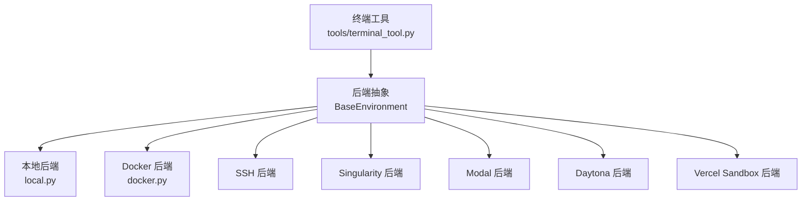
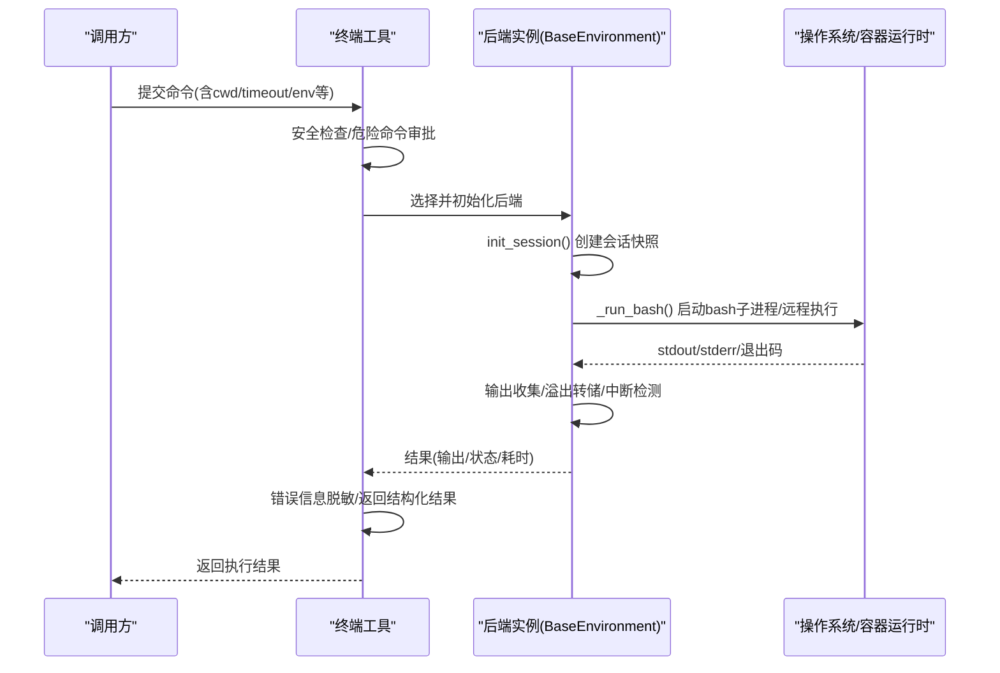
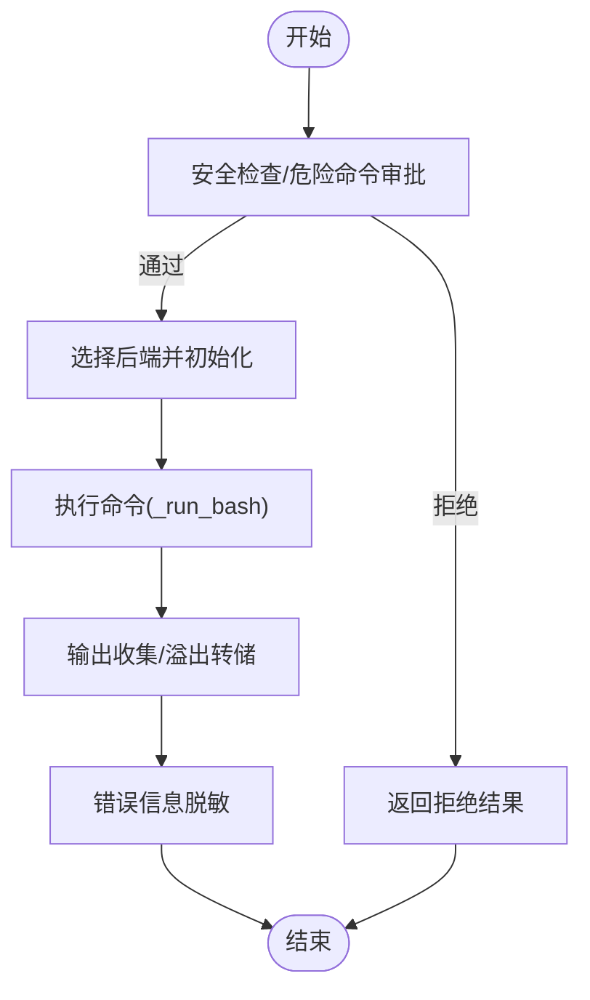
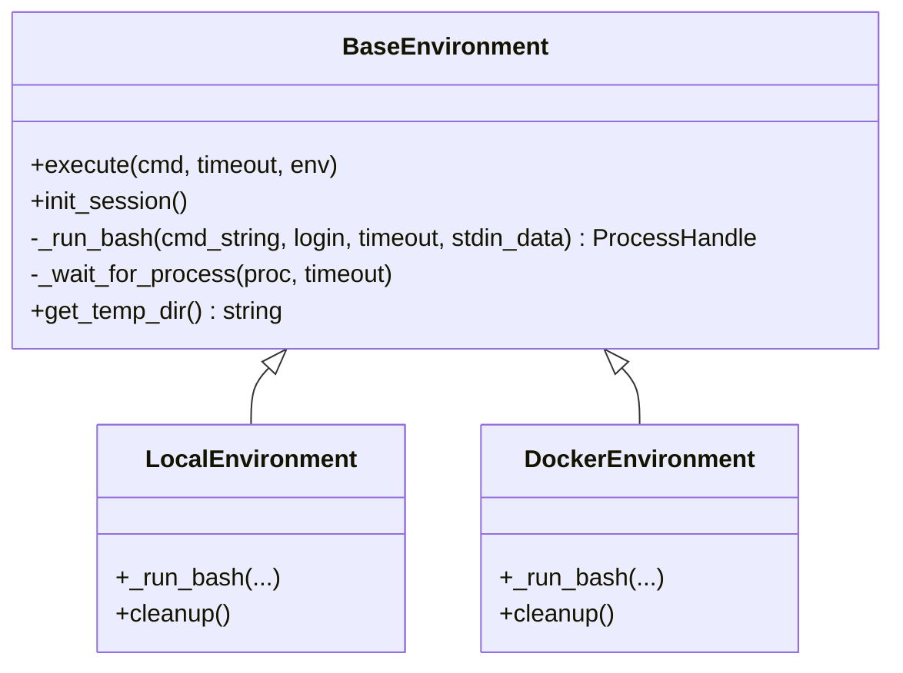
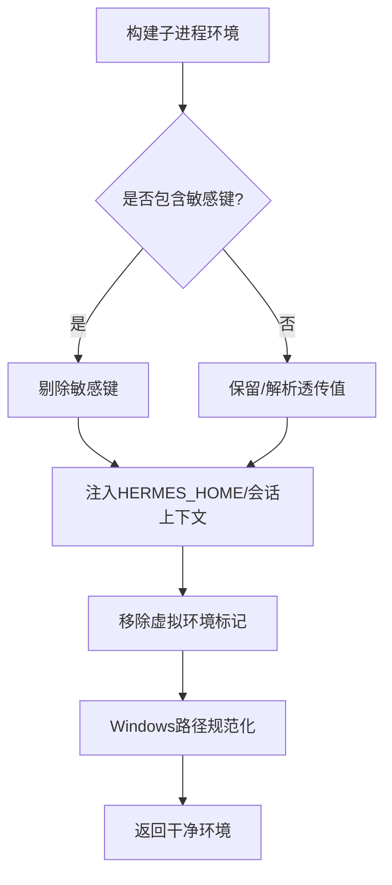
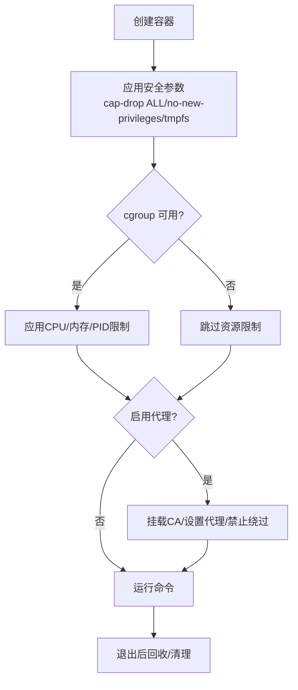
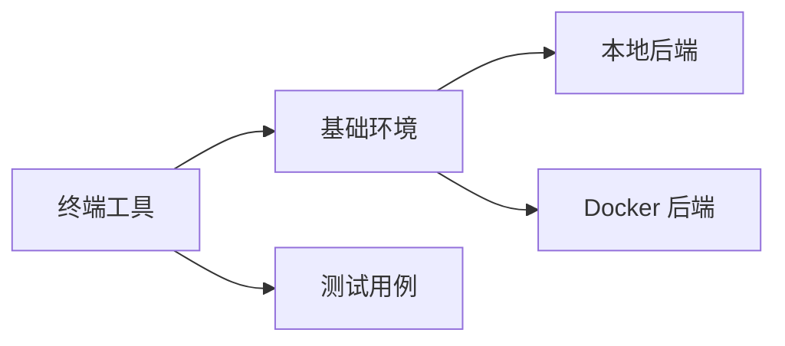

# 执行环境管理

<cite>
**本文引用的文件**
- [tools/terminal_tool.py](file://tools/terminal_tool.py)
- [tools/environments/base.py](file://tools/environments/base.py)
- [tools/environments/local.py](file://tools/environments/local.py)
- [tools/environments/docker.py](file://tools/environments/docker.py)
- [tools/environments/__init__.py](file://tools/environments/__init__.py)
- [tests/tools/test_terminal_error_redaction.py](file://tests/tools/test_terminal_error_redaction.py)
</cite>

## 目录
1. [简介](#简介)
2. [项目结构](#项目结构)
3. [核心组件](#核心组件)
4. [架构总览](#架构总览)
5. [详细组件分析](#详细组件分析)
6. [依赖关系分析](#依赖关系分析)
7. [性能考量](#性能考量)
8. [故障排查指南](#故障排查指南)
9. [结论](#结论)
10. [附录](#附录)

## 简介
本文件面向 Hermes Agent 的执行环境管理，聚焦工具执行的沙箱隔离、资源限制与环境变量管理。文档覆盖本地终端、Docker 容器与云端环境（Modal、Daytona、Vercel Sandbox）等执行后端的选择、配置与使用；并说明进程隔离、文件系统访问控制、网络权限管理、环境变量注入、工作目录设置、资源配额限制、监控日志与故障恢复机制，最后给出性能优化与安全加固建议，帮助开发者完成环境配置的完整闭环。

## 项目结构
Hermes 将“终端工具”与“执行环境后端”解耦：
- 终端工具负责命令入口、安全校验、错误脱敏、生命周期管理与后端选择。
- 执行环境后端提供统一接口 BaseEnvironment，实现不同运行上下文（本地、Docker、SSH、Singularity、Modal、Daytona、Vercel Sandbox）。
- 基础层提供会话快照、CWD 跟踪、中断处理、超时控制、输出收集与转储等通用能力。

图表来源
- [tools/terminal_tool.py:1-34](file://tools/terminal_tool.py#L1-L34)
- [tools/environments/__init__.py:1-15](file://tools/environments/__init__.py#L1-L15)

章节来源
- [tools/environments/__init__.py:1-15](file://tools/environments/__init__.py#L1-L15)

## 核心组件
- 终端工具（Terminal Tool）
  - 统一入口，支持多后端选择、后台任务、自动清理、危险命令审批、错误信息脱敏。
  - 通过环境变量与配置决定执行后端类型与工作目录、超时、镜像等参数。
- 基础环境（BaseEnvironment）
  - 定义 execute() 统一流程：会话快照、CWD 跟踪、中断与超时、输出收集与溢出转储。
  - 提供 _run_bash() 抽象，由具体后端实现进程或远程执行。
- 本地后端（LocalEnvironment）
  - 在宿主机以 bash 子进程执行，具备跨平台路径转换、安全 CWD 回退、敏感环境变量过滤、会话上下文注入。
- Docker 后端（DockerEnvironment）
  - 以容器为隔离边界，启用最小权限能力集、no-new-privileges、tmpfs 限制、可选 cgroup CPU/内存/PID 限制。
  - 支持 egress 代理强制、CA 证书挂载、网络策略、标签化与孤儿容器回收。

章节来源
- [tools/terminal_tool.py:1-34](file://tools/terminal_tool.py#L1-L34)
- [tools/environments/base.py:1-80](file://tools/environments/base.py#L1-L80)
- [tools/environments/local.py:1-120](file://tools/environments/local.py#L1-L120)
- [tools/environments/docker.py:1-120](file://tools/environments/docker.py#L1-L120)

## 架构总览
下图展示从调用到执行的端到端流程，包括安全校验、后端选择、会话快照、命令执行、输出收集与错误脱敏。

图表来源
- [tools/terminal_tool.py:57-62](file://tools/terminal_tool.py#L57-L62)
- [tools/environments/base.py:553-780](file://tools/environments/base.py#L553-L780)

## 详细组件分析

### 终端工具：命令入口与安全边界
- 功能要点
  - 多后端选择：根据配置/环境变量选择 local、docker、modal、vercel_sandbox 等。
  - 危险命令审批：委托统一守卫模块，结合 CLI 回调进行交互式审批。
  - 错误脱敏：对异常文本与回溯信息进行强制脱敏，避免密钥泄露。
  - 工作目录校验：白名单字符校验，防止注入。
  - 磁盘用量告警：缓存式扫描，避免频繁全量遍历。
- 关键行为
  - 前台超时上限可配置，磁盘告警阈值可配置。
  - sudo 密码交互与缓存按会话/回调/线程作用域隔离。
  - 背景任务启动失败时仍保证错误脱敏。

图表来源
- [tools/terminal_tool.py:375-420](file://tools/terminal_tool.py#L375-L420)
- [tools/terminal_tool.py:57-62](file://tools/terminal_tool.py#L57-L62)

章节来源
- [tools/terminal_tool.py:118-139](file://tools/terminal_tool.py#L118-L139)
- [tools/terminal_tool.py:205-244](file://tools/terminal_tool.py#L205-L244)
- [tools/terminal_tool.py:375-420](file://tools/terminal_tool.py#L375-L420)
- [tests/tools/test_terminal_error_redaction.py:47-154](file://tests/tools/test_terminal_error_redaction.py#L47-L154)

### 基础环境：统一执行流与会话快照
- 统一接口
  - execute() 封装了 init_session()、_run_bash()、_wait_for_process()、输出收集与超时控制。
  - 会话快照：捕获 export -p、函数、别名，原子写入后 source，确保后续命令复用一致环境。
  - CWD 跟踪：通过 in-band 标记或临时文件持久化工作目录。
  - 中断与心跳：支持 is_interrupted 轮询与活动回调上报。
- 输出收集
  - 头部+尾部窗口保留，溢出时写 spill 文件，避免内存膨胀且可恢复完整输出。
- 会话变量隔离
  - 排除 per-session 桥接变量，避免快照污染；支持 profile 作用域的 passthrough 名称排除。

图表来源
- [tools/environments/base.py:553-800](file://tools/environments/base.py#L553-L800)

章节来源
- [tools/environments/base.py:81-231](file://tools/environments/base.py#L81-L231)
- [tools/environments/base.py:474-545](file://tools/environments/base.py#L474-L545)
- [tools/environments/base.py:660-780](file://tools/environments/base.py#L660-L780)

### 本地后端：进程隔离、环境变量与路径处理
- 进程隔离
  - 以 bash 子进程执行，支持登录 shell 与非登录 shell 回退策略。
  - Windows 下 Git Bash/MSYS 路径转换与 ASLR 兼容处理。
- 环境变量管理
  - 构建子进程环境时，屏蔽 Hermes 内部密钥、提供商密钥、网关令牌等敏感项。
  - 注入 HERMES_HOME 覆盖、会话上下文变量，避免跨会话泄漏。
  - 移除 VIRTUAL_ENV/CONDA_PREFIX 等虚拟环境标记，防止污染其他项目。
- 工作目录
  - 解析绝对路径，不可用时回退至可用祖先目录或临时目录。
  - 安全校验工作目录字符，防止注入。

图表来源
- [tools/environments/local.py:225-337](file://tools/environments/local.py#L225-L337)
- [tools/environments/local.py:352-513](file://tools/environments/local.py#L352-L513)
- [tools/environments/local.py:574-719](file://tools/environments/local.py#L574-L719)

章节来源
- [tools/environments/local.py:53-90](file://tools/environments/local.py#L53-L90)
- [tools/environments/local.py:155-197](file://tools/environments/local.py#L155-L197)
- [tools/environments/local.py:722-800](file://tools/environments/local.py#L722-L800)

### Docker 后端：容器隔离、资源限制与网络出口控制
- 容器隔离与安全
  - 默认丢弃所有能力，仅添加必要 DAC_OVERRIDE/CHOWN/FOWNER，启用 no-new-privileges。
  - /tmp 与 /var/tmp 使用 tmpfs 限制大小与执行位；/run 根据镜像特性决定是否允许 exec。
  - 当容器以 root 启动且需降权时，附加 SETUID/SETGID 能力。
- 资源限制
  - 探测 cgroup 可用性，若支持则应用 --cpus/--memory/--pids-limit。
  - 共享内存 /dev/shm 默认放大以避免渲染/并行计算崩溃。
- 网络出口控制（egress）
  - 可选 iron-proxy 强制出站流量走代理，挂载 CA 证书，设置代理相关环境变量。
  - 检测冲突的 docker_extra_args（如覆盖代理/网络），必要时阻止启动或告警。
- 生命周期与清理
  - 标签化容器便于筛选与回收；定期清理长时间未使用的孤儿容器。
  - 发现 Docker/Podman 可执行文件，支持自定义二进制路径。

图表来源
- [tools/environments/docker.py:322-395](file://tools/environments/docker.py#L322-L395)
- [tools/environments/docker.py:397-555](file://tools/environments/docker.py#L397-L555)
- [tools/environments/docker.py:720-769](file://tools/environments/docker.py#L720-L769)
- [tools/environments/docker.py:148-239](file://tools/environments/docker.py#L148-L239)

章节来源
- [tools/environments/docker.py:1-120](file://tools/environments/docker.py#L1-120)
- [tools/environments/docker.py:277-319](file://tools/environments/docker.py#L277-L319)
- [tools/environments/docker.py:638-696](file://tools/environments/docker.py#L638-L696)

### 云端环境（Modal/Daytona/Vercel Sandbox）
- 选择与前置检查
  - 终端工具根据配置选择后端；云端后端需满足认证、运行时版本、依赖安装等要求。
  - Vercel Sandbox 对运行时与磁盘容量有严格约束，缺失依赖会直接报错。
- 执行模型
  - 通过 SDK 提供的执行函数包装为 ProcessHandle，适配统一的 wait/poll/kill 语义。
  - 输出通过管道收集，保持与本地/Docker一致的超时与中断处理。
- 注意事项
  - 云沙箱的文件系统持久性不保证长进程存活；需要幂等与可恢复设计。

章节来源
- [tools/terminal_tool.py:141-196](file://tools/terminal_tool.py#L141-L196)
- [tools/environments/base.py:400-467](file://tools/environments/base.py#L400-L467)

## 依赖关系分析
- 终端工具依赖后端抽象，并通过工厂方法选择具体实现。
- 基础环境被各后端复用，提供通用执行流与输出收集。
- 本地后端依赖系统 bash 与路径处理逻辑；Docker 后端依赖容器运行时与 cgroup。
- 测试用例验证错误脱敏与后端选择行为，保障安全性与稳定性。

图表来源
- [tools/environments/__init__.py:1-15](file://tools/environments/__init__.py#L1-L15)
- [tests/tools/test_terminal_error_redaction.py:1-154](file://tests/tools/test_terminal_error_redaction.py#L1-L154)

章节来源
- [tools/environments/__init__.py:1-15](file://tools/environments/__init__.py#L1-L15)
- [tests/tools/test_terminal_error_redaction.py:47-154](file://tests/tools/test_terminal_error_redaction.py#L47-L154)

## 性能考量
- 输出收集
  - 采用头尾窗口与溢出转储，既控制内存占用又保留可恢复的完整输出。
- 会话快照
  - 原子写入快照文件，避免并发 source 读到半截内容；减少重复登录开销。
- 资源限制
  - Docker 后端在可用时启用 CPU/内存/PID 限制，防止失控进程影响宿主。
- 磁盘用量告警
  - 缓存式扫描，降低频繁 rglob 带来的 I/O 压力。
- 网络出口
  - 代理强制与 CA 挂载减少误用外部网络的概率，同时避免额外 TLS 握手失败。

[本节为通用指导，无需特定文件引用]

## 故障排查指南
- 常见错误与定位
  - 后端不可达（SSH 断开、Docker 守护进程未运行、远端文件同步失败）：基础环境抛出连接类异常，终端工具将其转为结构化降级结果，提示重试。
  - Docker 未找到：后端预检失败并给出安装/修复指引。
  - 危险命令被拒：查看审批回调与守卫规则，调整命令或授权。
  - 错误信息泄露：确认错误脱敏生效，测试用例覆盖了异常与回溯脱敏场景。
- 恢复与自愈
  - 会话快照失败时回退为非登录 shell；Docker 后端在 cgroup 不可用时降级为无资源限制模式。
  - 孤儿容器回收：按标签与过期时间清理残留容器，释放资源。

章节来源
- [tools/environments/base.py:55-79](file://tools/environments/base.py#L55-L79)
- [tools/environments/docker.py:772-800](file://tools/environments/docker.py#L772-L800)
- [tools/environments/docker.py:148-239](file://tools/environments/docker.py#L148-L239)
- [tests/tools/test_terminal_error_redaction.py:47-154](file://tests/tools/test_terminal_error_redaction.py#L47-L154)

## 结论
Hermes 的执行环境管理通过“终端工具 + 统一后端抽象 + 多实现”的架构，实现了安全的沙箱隔离、严格的资源限制与可控的环境变量注入。本地、Docker 与云端后端各司其职，配合会话快照、输出收集、错误脱敏与清理回收机制，提供了稳定、可观测、可恢复的执行体验。生产部署建议优先使用 Docker 后端以获得强隔离与资源限制，并结合 egress 代理强化网络安全；本地后端适用于可信开发环境，需严格管控敏感环境变量与工作目录。

[本节为总结性内容，无需特定文件引用]

## 附录
- 配置与使用要点
  - 选择后端：通过终端工具配置或环境变量指定 local/docker/modal/vercel_sandbox 等。
  - 工作目录：设置 cwd，并确保路径合法且可访问；本地后端会在不可用时回退。
  - 环境变量：通过后端透传机制注入，注意敏感键会被过滤；云端后端需满足认证与运行时要求。
  - 资源限制：Docker 后端在可用时启用 CPU/内存/PID 限制；共享内存默认放大以提升稳定性。
  - 网络权限：启用 egress 代理强制出站流量，挂载 CA，避免绕过。
  - 监控与日志：利用活动回调与输出转储追踪长任务；关注磁盘用量告警。
  - 故障恢复：会话快照失败回退；孤儿容器回收；错误信息脱敏保护密钥。

[本节为操作指南，无需特定文件引用]