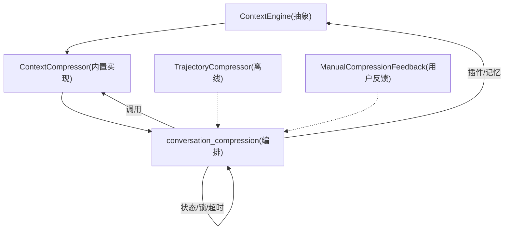
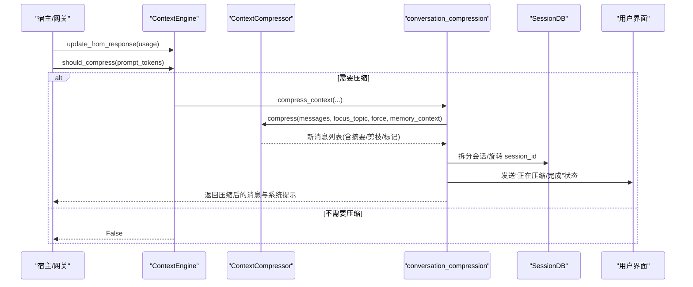
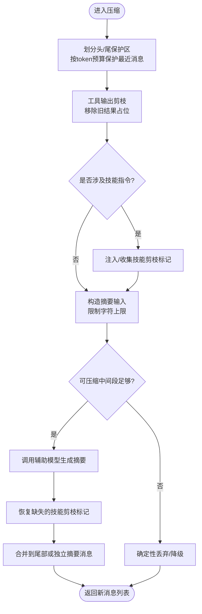
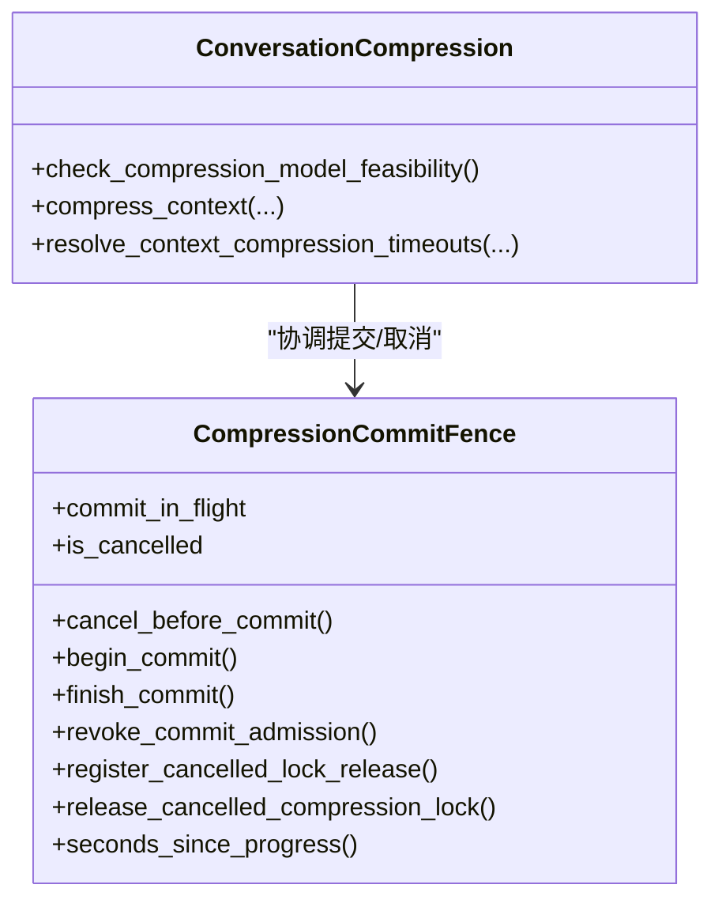
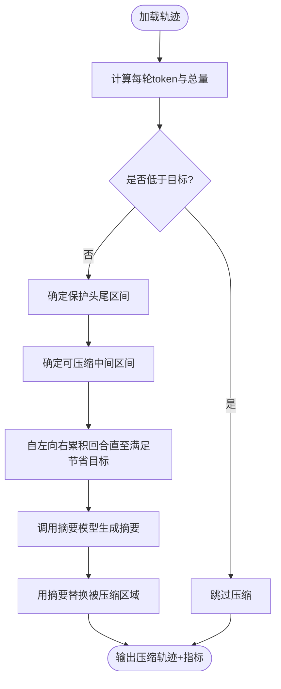
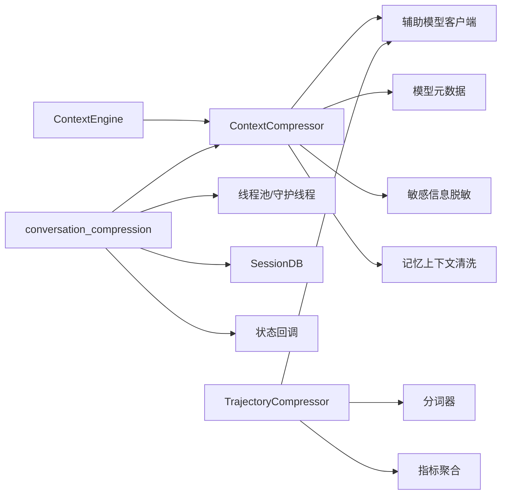

# 上下文压缩算法

<cite>
**本文引用的文件**
- [agent/context_compressor.py](file://agent/context_compressor.py)
- [agent/conversation_compression.py](file://agent/conversation_compression.py)
- [trajectory_compressor.py](file://trajectory_compressor.py)
- [agent/manual_compression_feedback.py](file://agent/manual_compression_feedback.py)
- [agent/context_engine.py](file://agent/context_engine.py)
</cite>

## 目录
1. [简介](#简介)
2. [项目结构](#项目结构)
3. [核心组件](#核心组件)
4. [架构总览](#架构总览)
5. [详细组件分析](#详细组件分析)
6. [依赖关系分析](#依赖关系分析)
7. [性能考量](#性能考量)
8. [故障排查指南](#故障排查指南)
9. [结论](#结论)
10. [附录：配置与使用示例](#附录：配置与使用示例)

## 简介
本文件系统性阐述 Hermes Agent 的上下文压缩算法，重点覆盖对话摘要生成、信息提取与重要性评估机制；详解 ConversationCompressor（内置压缩引擎）的工作原理，包括压缩策略选择、阈值控制与质量评估指标；并说明自动压缩、手动压缩与基于反馈的压缩三种模式。同时提供参数调优建议、效果评估方法以及流式处理、内存管理与并发控制等性能优化实践，帮助开发者扩展自定义压缩算法并进行性能调优。

## 项目结构
Hermes 的上下文压缩由“引擎抽象 + 内置实现 + 编排层 + 工具链”构成：
- 引擎抽象：ContextEngine 定义统一接口，决定何时触发压缩以及如何压缩。
- 内置实现：ContextCompressor 提供默认压缩策略，包含摘要模板、尾部保护、工具输出剪枝、技能指令防丢失等。
- 编排层：conversation_compression 负责调用具体压缩器、会话拆分、状态同步、超时/并发控制与用户可见状态。
- 工具链：trajectory_compressor 用于离线轨迹压缩，便于训练数据瘦身与评测。
- 用户反馈：manual_compression_feedback 提供 /compress 命令的用户提示与结果汇总。

图表来源
- [agent/context_engine.py:89-190](file://agent/context_engine.py#L89-L190)
- [agent/context_compressor.py:1-180](file://agent/context_compressor.py#L1-L180)
- [agent/conversation_compression.py:1-120](file://agent/conversation_compression.py#L1-L120)
- [trajectory_compressor.py:1-120](file://trajectory_compressor.py#L1-L120)
- [agent/manual_compression_feedback.py:1-121](file://agent/manual_compression_feedback.py#L1-L121)

章节来源
- [agent/context_engine.py:1-200](file://agent/context_engine.py#L1-L200)
- [agent/context_compressor.py:1-180](file://agent/context_compressor.py#L1-L180)
- [agent/conversation_compression.py:1-120](file://agent/conversation_compression.py#L1-L120)
- [trajectory_compressor.py:1-120](file://trajectory_compressor.py#L1-L120)
- [agent/manual_compression_feedback.py:1-121](file://agent/manual_compression_feedback.py#L1-L121)

## 核心组件
- ContextEngine（抽象）：定义 should_compress、compress 等接口，支持外部替换压缩引擎。
- ContextCompressor（内置）：实现自动压缩，包含：
  - 头部/尾部保护（token 预算而非固定条数）
  - 结构化摘要模板（历史任务快照、待解决问题跟踪）
  - 工具输出剪枝（LLM 前预处理）
  - 技能指令防丢失（标记注入与恢复）
  - 滚动微压缩与批量压缩
  - 失败冷却与反抖动
- conversation_compression（编排）：封装压缩生命周期、超时、并发池、提交围栏、状态回滚、用户可见提示。
- TrajectoryCompressor（离线）：对已完成轨迹进行后处理压缩，保留关键头尾，仅压缩中间区域，并以单条摘要替代被压缩区域。
- ManualCompressionFeedback（用户反馈）：为 /compress 命令生成一致的用户提示与统计。

章节来源
- [agent/context_engine.py:89-200](file://agent/context_engine.py#L89-L200)
- [agent/context_compressor.py:1-800](file://agent/context_compressor.py#L1-L800)
- [agent/conversation_compression.py:1-800](file://agent/conversation_compression.py#L1-L800)
- [trajectory_compressor.py:1-800](file://trajectory_compressor.py#L1-L800)
- [agent/manual_compression_feedback.py:1-121](file://agent/manual_compression_feedback.py#L1-L121)

## 架构总览
下图展示一次典型压缩流程：从触发判断到执行压缩、再到提交与通知。

图表来源
- [agent/context_engine.py:133-190](file://agent/context_engine.py#L133-L190)
- [agent/conversation_compression.py:445-690](file://agent/conversation_compression.py#L445-L690)
- [agent/context_compressor.py:180-260](file://agent/context_compressor.py#L180-L260)

## 详细组件分析

### 内置压缩引擎：ContextCompressor
- 摘要生成与模板
  - 使用专用前缀与结束标记，明确“参考信息”边界，避免模型误将历史摘要当作当前任务。
  - 维护“历史任务快照”“进行中状态”“待解决用户问题”“剩余工作”等结构化小节，便于跨轮次保持连贯性。
  - 通过“滚动微压缩”在多次压缩中累积更新摘要，避免信息丢失。
- 信息提取与重要性评估
  - 工具输出剪枝：在 LLM 摘要前对旧工具结果做确定性裁剪，减少输入体积。
  - 技能指令防丢失：检测即将被压缩的技能视图内容，注入“已剪枝”标记并在后续重新注入，防止“幽灵技能”。
  - 尾部保护：按 token 预算保护最近若干消息，确保活跃用户请求与最新工具调用可读。
- 压缩策略与阈值
  - 小窗口模型阈值下探：当模型上下文较小且频繁触发压缩时，自动提高触发比例以减少抖动。
  - 可行性跳过：当可压缩中间段过小且之前无效时，直接走确定性丢弃路径，避免无意义的 LLM 调用。
  - 压力降级：当受保护尾部本身超软预算时，仍会降级压缩大工具/文件输出，但保留最近若干条。
- 失败与冷却
  - 摘要失败冷却：同一位置连续失败超过阈值则跳过，避免忙循环。
  - 认证/配额错误识别：区分可重试与不可重试错误，快速失败或降级。
- 元数据与兼容性
  - 压缩摘要消息携带特定元数据键，供前端过滤/渲染，避免污染下游协议。
  - 兼容历史前缀版本，确保跨构建版本的摘要继承与归一化。

图表来源
- [agent/context_compressor.py:100-180](file://agent/context_compressor.py#L100-L180)
- [agent/context_compressor.py:417-453](file://agent/context_compressor.py#L417-L453)
- [agent/context_compressor.py:486-621](file://agent/context_compressor.py#L486-L621)
- [agent/context_compressor.py:701-750](file://agent/context_compressor.py#L701-L750)

章节来源
- [agent/context_compressor.py:1-800](file://agent/context_compressor.py#L1-L800)

### 编排层：conversation_compression
- 压缩生命周期管理
  - 启动探测：检查辅助压缩模型的上下文窗口是否满足主模型阈值需求，必要时下调阈值或拒绝不合规模型。
  - 状态提示：向宿主/前端发送“正在压缩/完成”等状态，屏蔽常规成功提示，突出失败与阻塞警告。
  - 提交围栏：保证取消与提交的原子性，避免部分写入导致的状态不一致。
- 超时与并发
  - 进程级线程池：限制最大并发压缩任务数量，防止队列无限增长。
  - 进度感知超时：若摘要流式推进有 token 产出，则延长等待；否则按总上限强制终止。
  - 提交阶段 overrun 告警：在提交阶段超时时持续上报，便于定位卡住的数据库写入。
- 状态持久化与回滚
  - 尝试快照压缩器内部状态，失败时回滚到安全点，避免破坏会话一致性。
  - 权威冷却行读取/恢复：在持有会话租约时刷新并保存摘要失败冷却状态。

图表来源
- [agent/conversation_compression.py:445-690](file://agent/conversation_compression.py#L445-L690)
- [agent/conversation_compression.py:776-800](file://agent/conversation_compression.py#L776-L800)

章节来源
- [agent/conversation_compression.py:1-800](file://agent/conversation_compression.py#L1-L800)

### 离线轨迹压缩：TrajectoryCompressor
- 目标：在不超过目标 token 预算的前提下，压缩已完成轨迹，保留训练信号质量。
- 策略：
  - 保护首尾：系统提示、首轮人类/助手/工具调用、最后 N 轮。
  - 仅压缩中间区域：从第 2 个工具响应开始，逐步累积直到达到节省目标。
  - 用单条人类摘要替代被压缩区域，其余工具调用保持完整以便模型继续工作。
- 指标：记录原始/压缩 token、回合数、压缩区间、API 调用次数与错误率等。

图表来源
- [trajectory_compressor.py:332-800](file://trajectory_compressor.py#L332-L800)

章节来源
- [trajectory_compressor.py:1-800](file://trajectory_compressor.py#L1-L800)

### 用户反馈：ManualCompressionFeedback
- 为 /compress 命令生成一致的 headline、token 变化提示与注意事项。
- 区分“无变更”“中止”“回退模式”“正常压缩”等场景，并对失败原因进行敏感信息脱敏。

章节来源
- [agent/manual_compression_feedback.py:1-121](file://agent/manual_compression_feedback.py#L1-L121)

## 依赖关系分析
- ContextEngine 作为抽象，允许第三方替换压缩引擎（如 LCM），但需遵循相同接口契约。
- ContextCompressor 依赖：
  - 辅助模型客户端：用于摘要生成，具备温度适配、重试与错误分类。
  - 模型元数据：估算 token、获取上下文长度、最小上下文约束。
  - 记忆上下文清洗：确保跨边界的敏感信息被脱敏。
- conversation_compression 依赖：
  - 线程池与守护线程：隔离压缩任务，避免阻塞主循环。
  - SessionDB：会话拆分与旋转，持久化压缩结果。
  - 状态回调：向宿主/前端推送压缩状态。
- TrajectoryCompressor 依赖：
  - 分词器：用于 token 计数。
  - OpenRouter/辅助客户端：用于摘要生成。
  - 指标聚合：记录压缩前后差异与 API 调用情况。

图表来源
- [agent/context_engine.py:89-200](file://agent/context_engine.py#L89-L200)
- [agent/context_compressor.py:28-45](file://agent/context_compressor.py#L28-L45)
- [agent/conversation_compression.py:693-773](file://agent/conversation_compression.py#L693-L773)
- [trajectory_compressor.py:332-470](file://trajectory_compressor.py#L332-L470)

章节来源
- [agent/context_engine.py:89-200](file://agent/context_engine.py#L89-L200)
- [agent/context_compressor.py:28-45](file://agent/context_compressor.py#L28-L45)
- [agent/conversation_compression.py:693-773](file://agent/conversation_compression.py#L693-L773)
- [trajectory_compressor.py:332-470](file://trajectory_compressor.py#L332-L470)

## 性能考量
- 流式处理与进度感知
  - 在摘要生成过程中记录“向前进展”，避免慢模型被误杀；仅在无进展时按总上限终止。
  - 提交阶段 overrun 告警：在提交阶段超时时周期性上报，便于定位卡住的数据库写入。
- 内存管理
  - 摘要输入字符上限：限制传入摘要模型的总字符数，避免超出后端上下文限制或超时。
  - 工具输出剪枝：在 LLM 前做确定性裁剪，降低输入体积。
  - 技能指令防丢失：通过标记注入与恢复，避免重复加载导致的内存膨胀。
- 并发控制
  - 共享线程池限制最大并发压缩任务数，防止队列无限增长。
  - 提交围栏保证取消与提交的原子性，避免部分写入导致的状态不一致。
- 阈值与抖动抑制
  - 小窗口模型阈值下探：减少频繁触发压缩带来的开销。
  - 可行性跳过：当可压缩中间段过小时直接走确定性路径，避免无意义 LLM 调用。
  - 失败冷却：同一位置连续失败超过阈值则跳过，避免忙循环。

[本节为通用性能指导，不直接分析具体文件]

## 故障排查指南
- 常见问题与定位
  - 摘要失败冷却：若连续失败，系统将跳过压缩以避免忙循环；查看冷却时间与错误原因。
  - 认证/配额错误：区分可重试与不可重试错误，快速失败或降级。
  - 提交阶段卡住：观察提交围栏的“进行中”标志与 overrun 告警，定位数据库写入阻塞。
  - 技能指令丢失：确认“已剪枝”标记是否正确注入与恢复。
- 诊断要点
  - 检查压缩状态提示与日志，确认是否进入压缩流程。
  - 核对辅助模型配置与可用性（base_url、api_key）。
  - 验证阈值与保护区间设置是否合理（头部/尾部保护、小窗口阈值下探）。
  - 关注离线轨迹压缩的指标（压缩比、API 调用次数与错误率）。

章节来源
- [agent/conversation_compression.py:77-180](file://agent/conversation_compression.py#L77-L180)
- [agent/context_compressor.py:73-95](file://agent/context_compressor.py#L73-L95)
- [agent/context_compressor.py:417-453](file://agent/context_compressor.py#L417-L453)
- [agent/context_compressor.py:486-621](file://agent/context_compressor.py#L486-L621)
- [agent/manual_compression_feedback.py:40-121](file://agent/manual_compression_feedback.py#L40-L121)

## 结论
Hermes 的上下文压缩体系以 ContextEngine 抽象为核心，内置 ContextCompressor 提供稳健的自动压缩能力，涵盖摘要模板、工具输出剪枝、技能指令防丢失、失败冷却与阈值自适应等关键机制；编排层 conversation_compression 提供超时、并发与提交围栏保障；离线工具 TrajectoryCompressor 支持训练数据瘦身。通过合理的参数调优与性能优化，可在长对话与高负载场景下维持稳定的上下文质量与系统吞吐。

[本节为总结性内容，不直接分析具体文件]

## 附录：配置与使用示例
- 自动压缩
  - 在宿主侧启用 should_compress 判断，结合 threshold_percent 与 protect_first_n/protect_last_n 控制触发与保护范围。
  - 参考：should_compress 与 compress 接口定义。
  - 章节来源
    - [agent/context_engine.py:133-190](file://agent/context_engine.py#L133-L190)
- 手动压缩
  - 通过 /compress 命令触发，使用 ManualCompressionFeedback 生成一致的用户提示与统计。
  - 章节来源
    - [agent/manual_compression_feedback.py:40-121](file://agent/manual_compression_feedback.py#L40-L121)
- 基于反馈的压缩
  - 根据压缩结果（noop/aborted/fallback/normal）调整后续行为，例如重试、降级或提示用户。
  - 章节来源
    - [agent/manual_compression_feedback.py:40-121](file://agent/manual_compression_feedback.py#L40-L121)
- 参数调优建议
  - 小窗口模型：适当提高 threshold_percent，减少频繁压缩。
  - 大模型/长对话：增大 protect_last_n，确保活跃上下文可读。
  - 工具输出：开启剪枝，控制 _SUMMARY_INPUT_MAX_CHARS 与 _PRUNE_MIN_CHARS。
  - 失败冷却：根据业务容忍度调整连续失败阈值与冷却时间。
  - 章节来源
    - [agent/context_compressor.py:417-453](file://agent/context_compressor.py#L417-L453)
    - [agent/context_compressor.py:701-750](file://agent/context_compressor.py#L701-L750)
- 效果评估
  - 使用 conversation_compression 的状态提示与日志，观察压缩前后消息数与 token 估计。
  - 使用 TrajectoryCompressor 的指标聚合，评估压缩比、API 调用成功率与错误分布。
  - 章节来源
    - [agent/conversation_compression.py:115-180](file://agent/conversation_compression.py#L115-L180)
    - [trajectory_compressor.py:182-330](file://trajectory_compressor.py#L182-L330)