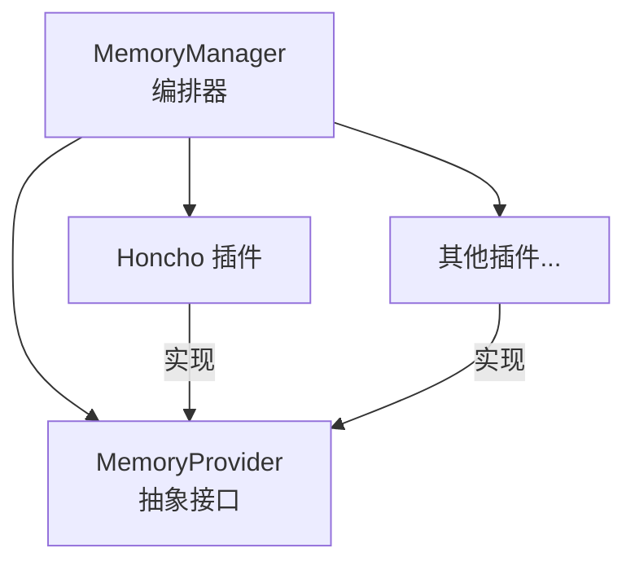
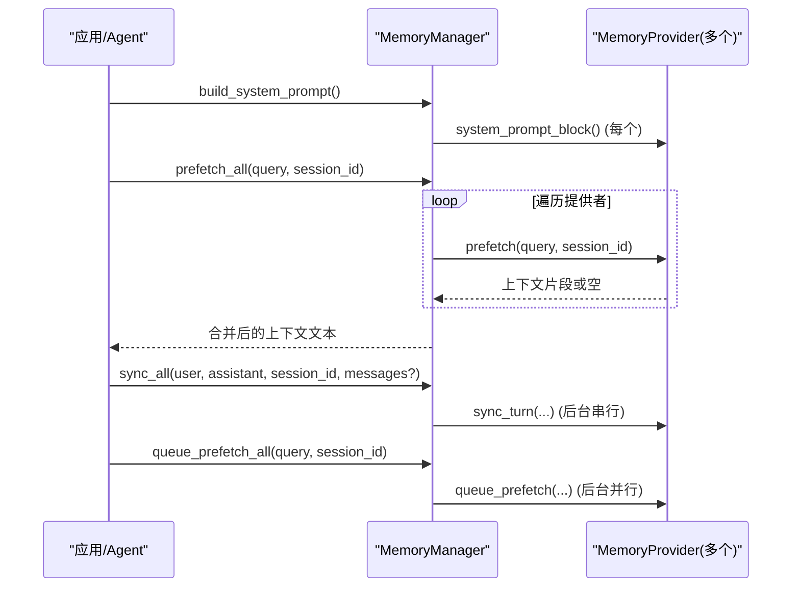
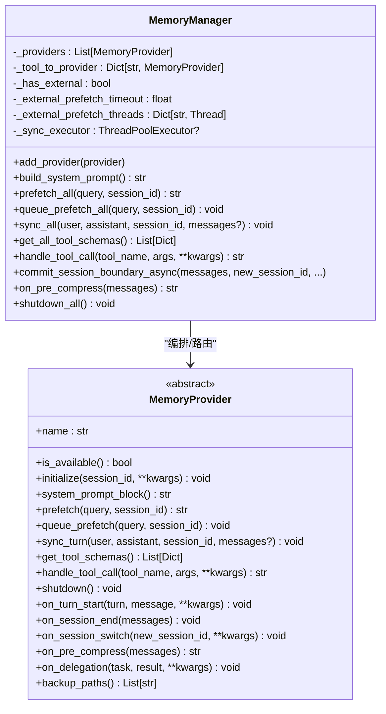
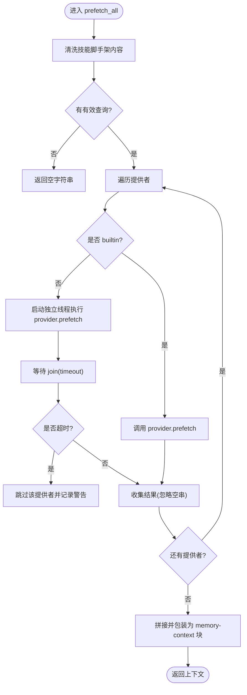
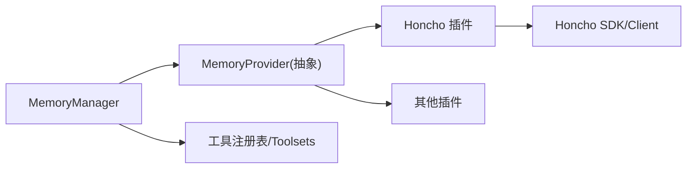

# 短期记忆管理

<cite>
**本文引用的文件**
- [agent/memory_manager.py](file://agent/memory_manager.py)
- [agent/memory_provider.py](file://agent/memory_provider.py)
- [plugins/memory/honcho/__init__.py](file://plugins/memory/honcho/__init__.py)
- [plugins/memory/config_schema.py](file://plugins/memory/config_schema.py)
</cite>

## 目录
1. [简介](#简介)
2. [项目结构](#项目结构)
3. [核心组件](#核心组件)
4. [架构总览](#架构总览)
5. [详细组件分析](#详细组件分析)
6. [依赖关系分析](#依赖关系分析)
7. [性能考量](#性能考量)
8. [故障排查指南](#故障排查指南)
9. [结论](#结论)
10. [附录：使用与扩展指南](#附录使用与扩展指南)

## 简介
本文件面向 Hermes Agent 的“短期记忆”子系统，聚焦于会话上下文存储、对话历史管理与临时数据缓存机制。文档围绕 MemoryManager 类展开，解释记忆提供者注册、工具模式注入、系统提示构建；深入剖析预取机制（prefetch_all）的异步处理、超时控制与错误恢复策略；并提供查询、更新、清理等操作的实践示例与最佳实践。最后给出线程池管理、后台任务调度与内存泄漏防护等性能优化建议，以及集成与扩展开发指南。

## 项目结构
短期记忆由“管理器 + 抽象接口 + 具体插件”三层组成：
- 管理器：MemoryManager，负责编排所有记忆提供者、统一暴露工具、构建系统提示、调度预取与同步。
- 抽象接口：MemoryProvider，定义提供者的生命周期与能力契约（初始化、预取、同步、工具、钩子）。
- 插件实现：如 Honcho、Hindsight 等，位于 plugins/memory/*，各自实现具体的持久化/检索逻辑。

图表来源
- [agent/memory_manager.py:364-470](file://agent/memory_manager.py#L364-L470)
- [agent/memory_provider.py:81-190](file://agent/memory_provider.py#L81-L190)
- [plugins/memory/honcho/__init__.py:237-314](file://plugins/memory/honcho/__init__.py#L237-L314)

章节来源
- [agent/memory_manager.py:1-120](file://agent/memory_manager.py#L1-L120)
- [agent/memory_provider.py:1-80](file://agent/memory_provider.py#L1-L80)

## 核心组件
- MemoryManager：单点入口，维护已注册的提供者列表、工具路由表、后台执行器、外部预取线程与锁、关闭期状态等。
- MemoryProvider：抽象基类，定义 name、is_available、initialize、system_prompt_block、prefetch、queue_prefetch、sync_turn、get_tool_schemas、handle_tool_call、shutdown 及若干可选钩子。
- 插件实现（以 Honcho 为例）：提供跨会话用户建模、语义搜索、推理问答、上下文快照、结论写入等能力，并通过 MemoryProvider 接口接入管理器。

章节来源
- [agent/memory_manager.py:364-848](file://agent/memory_manager.py#L364-L848)
- [agent/memory_provider.py:81-190](file://agent/memory_provider.py#L81-L190)
- [plugins/memory/honcho/__init__.py:237-314](file://plugins/memory/honcho/__init__.py#L237-L314)

## 架构总览
短期记忆在每次对话轮次中的关键流程：
- 系统提示构建：收集各提供者的静态提示块。
- 预取阶段：调用 prefetch_all，聚合各提供者的相关上下文，并包裹为 <memory-context> 块注入到模型输入。
- 后处理同步：调用 sync_all 将本轮对话持久化到后端。
- 下一轮预取队列：调用 queue_prefetch_all 为下一轮准备背景信息。

图表来源
- [agent/memory_manager.py:486-545](file://agent/memory_manager.py#L486-L545)
- [agent/memory_manager.py:638-695](file://agent/memory_manager.py#L638-L695)
- [agent/memory_manager.py:597-623](file://agent/memory_manager.py#L597-L623)

## 详细组件分析

### MemoryManager：工作原理解析
- 提供者注册与限制
  - 仅允许一个外部提供者（非 builtin），避免工具 schema 膨胀与冲突。
  - 自动索引工具名到提供者，屏蔽保留的核心工具名，防止覆盖内置工具。
- 工具模式注入
  - inject_memory_provider_tools 将外部提供者的工具 schema 注入到 Agent 的工具表面，支持启用/禁用 toolset 判断与去重。
  - normalize_tool_schema 兼容多种 schema 形态，确保 OpenAI 格式正确。
- 系统提示构建
  - build_system_prompt 聚合各提供者的静态提示块，异常隔离，任一失败不影响整体。
- 预取机制（prefetch_all）
  - 对 builtin 提供者直接调用；对外部提供者使用独立线程并发执行，带超时控制（默认约 8s），超时则跳过该提供者。
  - 通过 _external_prefetch_lock 管理线程，避免重复启动。
  - 结果拼接为 <memory-context> 块，内部包含系统提示说明，便于模型区分“记忆上下文”和“新输入”。
- 同步与队列
  - sync_all 在后台单线程执行器中串行执行，保证 turn N 先于 turn N+1 落地，避免竞态。
  - queue_prefetch_all 为下一轮预取提交后台任务，避免阻塞当前轮次。
- 会话边界与压缩
  - commit_session_boundary_async 将 on_session_end 与 on_session_switch 作为单一任务串行执行，确保顺序正确。
  - on_pre_compress 收集各提供者在压缩前的摘要片段，用于压缩提示词。
- 工具路由
  - get_all_tool_schemas 汇总所有提供者的工具 schema，过滤保留工具名与重复项。
  - handle_tool_call 根据工具名路由到对应提供者，异常时返回结构化错误。

图表来源
- [agent/memory_manager.py:364-848](file://agent/memory_manager.py#L364-L848)
- [agent/memory_provider.py:81-190](file://agent/memory_provider.py#L81-L190)

章节来源
- [agent/memory_manager.py:364-848](file://agent/memory_manager.py#L364-L848)
- [agent/memory_provider.py:81-190](file://agent/memory_provider.py#L81-L190)

### 预取机制：prefetch_all 的异步处理、超时与错误恢复
- 异步处理
  - 外部提供者的 prefetch 在独立线程中运行，避免阻塞主循环。
  - 通过 _external_prefetch_lock 管理线程字典，避免重复启动同一提供者的预取。
- 超时控制
  - 默认外部预取超时约 8 秒，超过则记录警告并跳过该提供者，保障响应时效。
- 错误恢复
  - 单个提供者异常不会阻断其他提供者；异常被捕获并记录调试日志。
  - 若线程仍在运行，下次遇到相同提供者的预取将被跳过，直到旧线程结束。
- 上下文清洗与注入
  - sanitize_context 移除内部标记与系统提示行，避免泄露内部结构。
  - build_memory_context_block 将结果包装为 <memory-context> 块，附带系统提示，帮助模型识别记忆上下文。

图表来源
- [agent/memory_manager.py:525-595](file://agent/memory_manager.py#L525-L595)
- [agent/memory_manager.py:347-361](file://agent/memory_manager.py#L347-L361)
- [agent/memory_manager.py:174-179](file://agent/memory_manager.py#L174-L179)

章节来源
- [agent/memory_manager.py:525-595](file://agent/memory_manager.py#L525-L595)
- [agent/memory_manager.py:347-361](file://agent/memory_manager.py#L347-L361)
- [agent/memory_manager.py:174-179](file://agent/memory_manager.py#L174-L179)

### 工具模式注入与系统提示构建
- 工具模式注入
  - inject_memory_provider_tools 检查是否应暴露外部记忆工具（基于 enabled/disabled toolsets 与现有工具名）。
  - 规范化 schema 并追加到 Agent 的工具列表，同时更新 valid_tool_names。
- 系统提示构建
  - build_system_prompt 收集各提供者的静态提示块，异常隔离，最终拼接为系统提示的一部分。
  - 插件（如 Honcho）可根据 recall_mode 输出不同的模式头，指导模型如何对待记忆上下文与工具。

章节来源
- [agent/memory_manager.py:110-156](file://agent/memory_manager.py#L110-L156)
- [agent/memory_manager.py:486-503](file://agent/memory_manager.py#L486-L503)
- [plugins/memory/honcho/__init__.py:656-697](file://plugins/memory/honcho/__init__.py#L656-L697)

### 会话上下文存储与对话历史管理
- 会话上下文存储
  - 通过 MemoryProvider 的 initialize 建立会话资源（连接、表、缓存等），并在 on_session_switch 中刷新内部状态。
  - 插件（如 Honcho）在 initialize 中解析 session_key、创建/获取远程会话、迁移记忆文件、预热上下文等。
- 对话历史管理
  - sync_turn 接收用户与助手消息，必要时携带完整消息列表（messages），供需要原始上下文的提供者使用。
  - on_session_end 在会话结束时提取总结或归档，避免丢失重要信息。
  - on_pre_compress 在压缩前收集提示片段，确保压缩过程保留关键洞察。

章节来源
- [agent/memory_provider.py:99-170](file://agent/memory_provider.py#L99-L170)
- [agent/memory_provider.py:204-268](file://agent/memory_provider.py#L204-L268)
- [plugins/memory/honcho/__init__.py:343-562](file://plugins/memory/honcho/__init__.py#L343-L562)

### 临时数据缓存机制
- 基础上下文缓存
  - 插件（如 Honcho）维护 _base_context_cache，按 context_cadence 刷新，减少频繁网络调用。
- 预取结果缓存
  - 首次轮次的 base 上下文可能等待后台线程完成，后续轮次消费缓存结果。
- 流式上下文清洗
  - StreamingContextScrubber 处理分片流中的 <memory-context> 标签，确保不泄露内部上下文到 UI。

章节来源
- [plugins/memory/honcho/__init__.py:253-291](file://plugins/memory/honcho/__init__.py#L253-L291)
- [plugins/memory/honcho/__init__.py:724-800](file://plugins/memory/honcho/__init__.py#L724-L800)
- [agent/memory_manager.py:182-345](file://agent/memory_manager.py#L182-L345)

## 依赖关系分析
- MemoryManager 依赖 MemoryProvider 抽象接口，解耦具体实现。
- 插件（如 Honcho）依赖 SDK/客户端库进行网络交互，但通过 MemoryProvider 接口与管理器通信。
- 工具注入依赖 toolsets 与 registry，确保工具命名空间一致且安全。

图表来源
- [agent/memory_manager.py:364-470](file://agent/memory_manager.py#L364-L470)
- [agent/memory_provider.py:81-190](file://agent/memory_provider.py#L81-L190)
- [plugins/memory/honcho/__init__.py:237-314](file://plugins/memory/honcho/__init__.py#L237-L314)

章节来源
- [agent/memory_manager.py:364-470](file://agent/memory_manager.py#L364-L470)
- [agent/memory_provider.py:81-190](file://agent/memory_provider.py#L81-L190)
- [plugins/memory/honcho/__init__.py:237-314](file://plugins/memory/honcho/__init__.py#L237-L314)

## 性能考量
- 线程池管理
  - 使用单工作线程的执行器（DaemonThreadPoolExecutor）串行执行 sync/prefetch，避免竞争与过度并发。
  - 外部预取使用独立线程，带超时控制，避免阻塞主循环。
- 后台任务调度
  - queue_prefetch_all 与 sync_all 均通过后台任务调度，确保主路径快速响应。
  - commit_session_boundary_async 将端点与切换合并为单一任务，保证顺序与一致性。
- 内存泄漏防护
  - 外部预取线程字典在完成后清理，避免残留引用。
  - 后台 Future 跟踪并在完成后移除，防止内存增长。
  - shutdown_all 期间设置 _shutting_down 标志，拒绝新任务提交，并尝试有限时间排空队列。
- 超时与降级
  - 外部预取超时后跳过提供者，保障可用性。
  - 初始化失败时 fail-open，优先保证用户体验。

章节来源
- [agent/memory_manager.py:698-757](file://agent/memory_manager.py#L698-L757)
- [agent/memory_manager.py:1144-1222](file://agent/memory_manager.py#L1144-L1222)
- [plugins/memory/honcho/__init__.py:425-478](file://plugins/memory/honcho/__init__.py#L425-L478)

## 故障排查指南
- 预取超时
  - 现象：某外部提供者预取耗时过长，导致跳过。
  - 排查：检查网络/服务健康、配置是否正确、是否存在死锁或慢查询。
  - 参考：外部预取超时与跳过逻辑。
- 工具冲突
  - 现象：提供者工具名与核心工具冲突或被忽略。
  - 排查：确认工具名未占用保留名称，查看警告日志。
  - 参考：工具注册时的保留名检查。
- 会话切换异常
  - 现象：/new、/resume 后记忆不一致。
  - 排查：检查 on_session_end 与 on_session_switch 的顺序与异常处理。
  - 参考：会话边界任务的串行执行。
- 系统提示缺失
  - 现象：插件未注入系统提示。
  - 排查：确认 is_available 与 initialize 成功，system_prompt_block 返回值非空。
  - 参考：系统提示构建与插件实现。

章节来源
- [agent/memory_manager.py:547-595](file://agent/memory_manager.py#L547-L595)
- [agent/memory_manager.py:430-470](file://agent/memory_manager.py#L430-L470)
- [agent/memory_manager.py:877-924](file://agent/memory_manager.py#L877-L924)
- [plugins/memory/honcho/__init__.py:306-314](file://plugins/memory/honcho/__init__.py#L306-L314)

## 结论
Hermes 的短期记忆管理通过 MemoryManager 统一管理多提供者，提供稳定的预取、同步与会话管理能力。其设计强调：
- 高可用：外部提供者异常隔离、超时控制、fail-open。
- 高性能：后台串行执行、线程池管理、缓存与懒加载。
- 可扩展：抽象接口与插件机制，支持多种记忆后端。
- 可观测：完善的日志与关闭期状态报告。

## 附录：使用与扩展指南

### 使用短期记忆功能
- 初始化与注册
  - 创建 MemoryManager，注册一个外部提供者（仅允许一个）。
  - 调用 initialize_all 传入 session_id 与环境参数。
- 系统提示构建
  - 调用 build_system_prompt 获取静态提示块，拼接到系统提示。
- 预取与同步
  - 每轮开始前调用 prefetch_all 获取上下文。
  - 每轮结束后调用 sync_all 持久化对话。
  - 调用 queue_prefetch_all 为下一轮准备预取。
- 工具调用
  - 通过 inject_memory_provider_tools 注入工具 schema。
  - 使用 handle_tool_call 路由到对应提供者。

章节来源
- [agent/memory_manager.py:364-470](file://agent/memory_manager.py#L364-L470)
- [agent/memory_manager.py:486-545](file://agent/memory_manager.py#L486-L545)
- [agent/memory_manager.py:638-695](file://agent/memory_manager.py#L638-L695)
- [agent/memory_manager.py:110-156](file://agent/memory_manager.py#L110-L156)

### 查询、更新与清理操作
- 查询
  - 通过 prefetch_all 获取相关上下文；插件内部可实现语义搜索或缓存命中。
- 更新
  - 通过 sync_all 持久化对话；或通过工具调用（如 conclude）写入结论。
- 清理
  - 会话结束时调用 on_session_end 进行归档；必要时调用 on_session_switch 重置状态。
  - 插件可提供 backup_paths 以便备份外部状态。

章节来源
- [agent/memory_provider.py:99-170](file://agent/memory_provider.py#L99-L170)
- [agent/memory_provider.py:204-268](file://agent/memory_provider.py#L204-L268)
- [plugins/memory/honcho/__init__.py:240-251](file://plugins/memory/honcho/__init__.py#L240-L251)

### 扩展开发方法
- 实现 MemoryProvider
  - 实现必要方法：name、is_available、initialize、get_tool_schemas、handle_tool_call、shutdown。
  - 可选钩子：on_turn_start、on_session_end、on_session_switch、on_pre_compress、on_delegation。
- 声明配置
  - 在插件目录下提供 config_schema.py，声明配置字段与存储方式。
- 注册与启用
  - 通过配置文件启用插件；管理器会限制仅一个外部提供者。
- 测试与验证
  - 验证预取、同步、工具调用与会话切换行为；检查日志与异常处理。

章节来源
- [agent/memory_provider.py:81-190](file://agent/memory_provider.py#L81-L190)
- [plugins/memory/config_schema.py:1-145](file://plugins/memory/config_schema.py#L1-L145)
- [plugins/memory/honcho/__init__.py:237-314](file://plugins/memory/honcho/__init__.py#L237-L314)